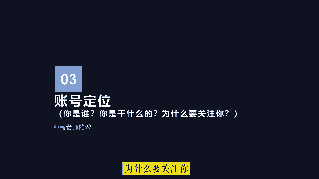

# 【《抖音全套运营教程》2024年做抖音怎么快速起号？分享抖音起号运营思路：找账号-定形式-抄选题-测爆款-复制爆款！】 - P4：3.账号定位 - 淀粉炸尸块 - BV16p421978U

好同学们，下面我们来讲账号定位，对于账号定位的理解就要反思三个问题，你是谁，你是干什么的，为什么要关注你。

首先我们要确定，我们接下来要做的是什么类型的账号，账号类型，除了我们上面章节中讲的大类赛道之外，也就是抖音中定义的一级垂类，那么我们还要思考的问题是，在一级垂泪下面细分的小赛道是什么。

就好比我们参加运动会，你报的项目是田径，田径是你的一级垂泪，然后你最擅长的百米赛跑，而且非常有优势，那么百米赛跑就是你的二级垂泪，因此我们可以通过定位我们账号的细分类目，来确定你的账号的垂直类型。

在这张图中我们可以看到，在抖音中，无论任何行业，只要你的定位足够清晰，都是有机会的，因为抖音的流量足够大，而且一旦你做起来，增长和裂变的速度将是非常快的，其次我们还要确定账号主题是谁。

招主题就是该账号的拥有人，并最终呈现给粉丝的账号主人公，也就是要明确让粉丝知道是在看谁的作品，在抖音商业类账号中，账号主题有商家账号和达人账号，如果账号主题是公司，就是商家账号。

那么账号内容啊就要偏商业化，而且要不断地通过内容拉近与粉丝的距离，避免严肃，这样既有信任感，也能带来好感，比较符合抖音的娱乐属性，如果账号主题是个人，就是达人账号，那么首先应该解决的就是信任问题。

可以通过IP打造的方式，为账号树立一个积极正面的人设，然后我们还要明确我们这个账号是做什么的，最直接的方式就是通过抖音认证身份，也就是我们的职业，如果是达人，可以通过这种方式获得黄威。

如果是公司可以通过认证蓝V认证职业之后，粉丝可以清晰的看到我们的认证标签，也就是明白我们的职业，这个账号大概做什么的，也能一清二楚嗯，同时呢商家认证蓝V或者是达人认证黄V，也可以获取平台背书。

增加信任感嗯，通过对自身商业模式和账号类型的确定，在未认证之前，也可以通过账号设置明确传达给粉丝，你是做什么的，比如可以通过头像背景图简介，视频封面等进行业务关联的统一设置。

最后我们还要花一些时间去思考一个问题，就是你将为粉丝提供什么样的价值，一般在抖音中，粉丝对博主的价值需求无外乎有以下几种，A知识，抖音中的知识一般分为这种类型，认知型的如人生思考，思维方式。

读书分享和感悟行业内幕，成功经验，个人提升等，干货型的如技能提升经验，总结过程步骤，冷知识等常识普及型的如生活常识，健康常识，产品常识，科学常识，历史常识，地区常识的解读和普及啊。

这类账号提供给粉丝的价值呢，就是认同如三观的认同，观点的认同，减少知识盲区的获得感，进而产生对自己的认同，第二类就是情绪，在抖音中，情绪是影响观众的重要因素，一般在作品中。

观众最容易接受的情绪价值有这些类型，开心愉悦，如搞笑类，夸张表情，感染类，人物关系，共鸣类，如情侣关系，婆媳关系，夫妻关系，家庭关系，上下级关系，师生关系等，情绪波动，如争议类的话题激发出来的情绪。

还有就是反转，反差渲染类的内容激发出来的情绪，还有就是反常识，反认知的开场等等，这些除此之外还有怀旧，一某震惊好奇，颠覆三观等，也是用户容易在观看作品时产生的情绪，这类账号提供给粉丝的价值就是共鸣。

也就是利用表情，文字画面声音，肢体动作等抒发的情绪准确到位，直接去感染观众，第三感觉，在抖音中，博主是通过短视频画面，文字和声音来传递信息的，博主提供的价值，还有视频的画面美感。

画面构图以及观众观看视频产生的喜欢治愈，视觉冲击，以及对作者呈现出的个人人格魅力的仰慕感等，或者视频声音为观众带来的节奏感，心跳加速或者是听觉享受等，如颜值类的，萌宠类的，美景类的，才艺类的，明星大咖。

文化类的等，这类账号提供给粉丝的价值就是共情，就是因为表情文字画面声音，肢体动作等的自然表现，让人产生联想，并和作者在情绪，认知和观众等意识层面产生连接，从而间接引发的共鸣，第四体验。

抖音是一个划时代的产品，很多人喜欢刷抖音，是因为抖音让用户看到了不一样的生活方式，了解到了自己到不了的地方，体验到了未曾体验过的事物，感受到了不曾体会过的感觉，做了自己想做却做不到。

或者是未曾做过的事情，也就是抖音为用户提供的体验价值，在抖音中流量最多的美食账号，各类美食的享用体验，制作体验，还有各式各样的旅行体验，运动体验，角色体验等这类账号提供给粉丝的价值，主要是好奇心的满足。

紧张感，激动感动体验获得感的第五期待，当用户刷到你的短视频时，因为内容对他的吸引力或观看视频时的体验，或者对作者本人的好奇与期待，进一步了解，用户在看完视频时会产生意犹未尽的感觉，这时用户就会点击关注。

期待下次更新，所以很多博主利用这点，总是不会将所有内容在一个视频中呈现完，给人一种精彩内容。