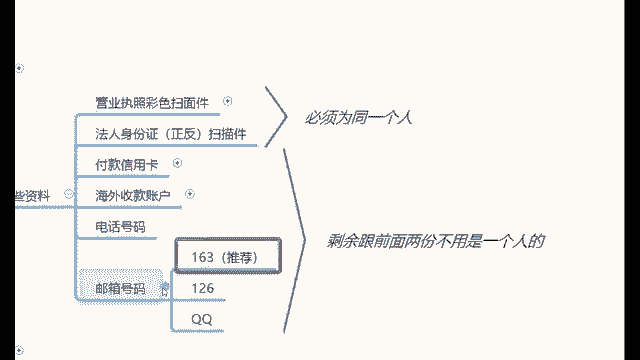

# 【亚马逊运营】B站最详细的新手入门全套亚马逊跨境运营实操教程，亚马逊开店到爆款店铺必学全套跨境电商运营流程，全程干货无废话，手把手教你打造TOP店铺！加字幕！ - P12：12、如何注册店铺：资料准备 - 娇儿运营 - BV14UmHYiEfv

好，那么在你确定了这些站点之后，那我们要准注册店铺的时候，需要准备哪些资料了？那么注册店铺需要准备的资料给大家去简单介绍一下。首先这是我们的一个资料的问题啊。😡，那么这些资料都有什么呢？

第一份我们需要准备的资料是营业执照的彩色扫描件，也就是营业执照的照片。😊，这个营业执照可以是企业性质的执照，也可以是个体工商户性质的执照。在你们当地的工商局啊，就可以免费办理。😡。

那么如果说有同学说老师，我没有这个执照怎么办？如果说没有这个执照的话，我该怎么去办理这个执照呢？首先在这里哈。😡，给大家去讲一下，如果说你没有营业执照的时候，你可以借用家人的或者朋友的。

就是你家家里边的亲戚朋友呢，你可以接他们的。😡，那么比如说你朋友里边有什么说开超市的之类的，或者说开服装店的。那么像这样的这种，你可以去借。😡，你如果实在没有，也可以找一些代办机构去代办。

每一个地方他代办机构的费用不不太一样。那么或者说也可以找咱们助理老师协助办理。助理老师就是今天推荐你来学习那位老师，叫做我们的助理老师，找助理老师协助办理也是可以的，就几百块钱啊，就可以办下来啊。

就是千百块钱啊，就几百到1000块钱左右啊，就大概是这样的一个费用啊，就各个地方都能办的啊。如果你没有的话，可以花个几百块钱去办一个啊。那么至于这个执照有什么要求嘛。首先跟大家讲一下这个执照的要求。😡。

对于注册的资本和年限没有什么硬性要求，你的注册资本是1块钱还是100万还是1000万啊，无所谓的。你的注册年限是刚刚注册来的执照，还是已经注台了很久的执照，也是没有关系的。😡。

那么至于这个执照的经营范围呢，带有销售性质就可以了。比如说就像我说的啊，像我们刚刚说的那种超市的执照，服装店的执照带有销售性质就可以了。但是在这里千万千万注意一个问题。😡，不要在你的执照上去。

就如果你现在去办执照啊，不要在你的执照上上面写什么啊，进出口贸易。😡，就是这个是一个很可笑的事啊。😊，就是为什么为什么我说很可笑呢？我有一个学员哈，就是跟我学习的时候，那个时候那个时候办执照的时候啊。

这个他说自己去办，我说你自己去办自己去办呗。然后他去工商局办啊，办的时候呢，他就很有意思啊，就是他自己工商局的朋友，然后去办执照去了。😊，然后就在他的执照上面写，就是他开了一个超市的执照。

然后好还好好好好歹不赖的，就是在里边写了一个进出，就是进出口贸易，就他开了一个超市的执照，他在上面写了一个进出口贸易。😊，就按道理来讲哈，写个进住贸易进出口贸易应该是个好事，对吧？但是实际情况下。

你们要明白的是，一旦你在执照上面写了进出口贸易的情况下，你就必须要去相关部门办理进出口手续。😡，你明白了？这个叫做画蛇添足，你知道吗？就实际情况下，你一个超市的执照就能用的。但是你要非要写个基础口贸易。

你就要去相关部门去办理办理这个基出口手续。这个点一定一定要注意啊，千万不要。😡，写进出口贸易又听明白了？就这个事一定一定要注意啊。那么至于你执照的经营范围，跟你店铺里边需要卖的产品不需要一致。😡。

就像我刚刚给大家去讲的，你用的是一个超市的执照，办理下来的亚马逊店铺，你去卖衣服，能不能卖？能就亚马逊在这里是不做监管的，就在这个执照上面是不做监管的，这是关于亚马逊的一个。😡，简单的一个介绍啊。

这是第一个。那么第二个需要指明的资料是法人身份证的正反面照片，就是营业执照和法人身份证。这两份资料必须是一个人的，而剩余的这些资料跟前面两份资料不需要是同一个人的。😡。

那么我们第三份需要准备的资料是付款的信用卡，它的唯一的作用是干什么的？它也只有这么一个唯一的作用，是支付亚马逊的月租用。哎，对，这再这我再再强调一下啊，重新再强调一下。😡，这前面两份资料。

营业执照和身份证需要是一个人的，剩余的资料可以不是一个人的。比如说你借用了自己的朋友的营业执照和身份证，剩余的资料全部绑定成你的可以吗？答案是可以的啊，那么第三份资料。

这个付款的信用卡的唯一作用是干什么的？它是在支付亚马逊的月租扣款用的。😡，他需要用的呢是全币信用卡，首选vissa卡和万事达卡长什么样的，给大家看一下啊，就长成这个样子。

只要你的信用卡上带有这样一个vissa或者mastercard这样一个图标就可以了。对，那么只要带有这样一个图标啊，去各大银行都能办。什么工商银行、浦工农商店、浦发建设广发中信这些银行都可以办理。

那如果说有权说老师，我们没有信用卡。没有的话，可以去借别人的，或者说花100块钱买一张虚拟卡。😊。

你花100块钱买一张虚拟卡，你每个月往这个虚拟卡里边充39。99美金的月租就可以了。那么每你每个月往里面充个充个月租，亚马逊扣款的时候，就可以从这个虚拟卡里边直接扣啊。

其实我告诉你这个信用卡真的没什么很很大的作用啊，就是为什么这样讲呢？就是随便你来一张信用卡，就绑定了之后，第一次在扣款的时候，从你的信用卡里面扣了，对吧？后续你的店铺有了营业额之后，对吧？

他再次扣款的时候，就会从你的余额里面去扣，对他不会优先去扣你的信用卡的。所以说这个东西它没有什么特别大的一个作用啊。😡，那么这是第三个需要指纹资料啊，叫做信卡付款信用卡。

第四个需要指纹资料是海外收款账户。这个海外收款账户哈，我给大家重点介绍一下海外收款账户，就这个东西它跟支付宝。😊，它是一样的功能。什么是支付宝哈？比如说你今天开支付宝大家应该都知道哈。

比如说你今天开通了一个淘宝店啊，你这个月赚了1万块钱，你是不是要通过支付宝提现到你的储蓄卡里啊？😊，我没说错吧，你从淘宝上赚的钱需要通过支付宝去体现。那么今天你开通的是亚马逊的店铺。

那你赚的钱就要通过海外收款账户去体现。😡，就他就相当于国际版的支付宝。😡，那么如果你们需要就是后期我可以给你们发个链接，你们去注册一个，就是这种。注册一个这个国际版的支付宝就行了。哎，就几分钟的时间。

就跟你自己正儿八经注册个支付宝一样啊，绑定一下你的这个身份证。哎，这个还有银行卡就行了。注册下来一个绑定一下自己的身份证和银行卡就OK了，就能用了。所以说海外收款账户啊，就是很简单的。

说白了它就是个支付宝。那么第五个需要准备资料是电话号码啊，国内的手机号就可以了。第六个是邮箱号码。那么这个邮箱的话呢，163邮箱，126邮箱QQ邮箱都可以。我个人比较推荐你们使用163邮箱。😊。

那么这是我们在注册店铺的时候需要准备的以下几份资料。