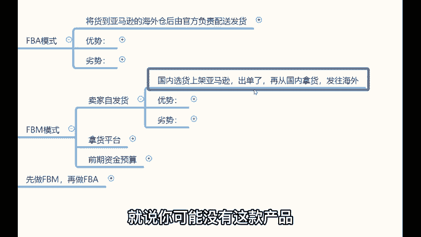
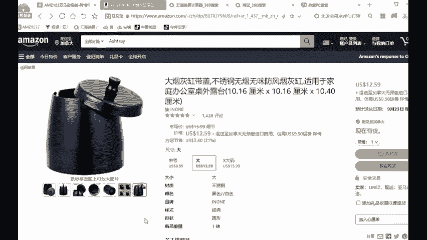
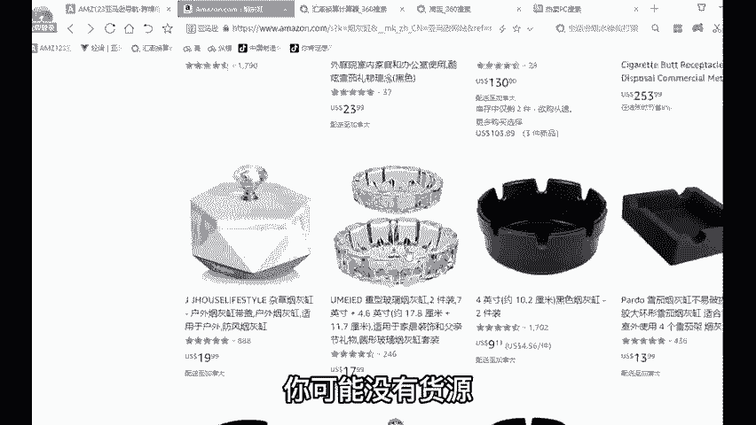
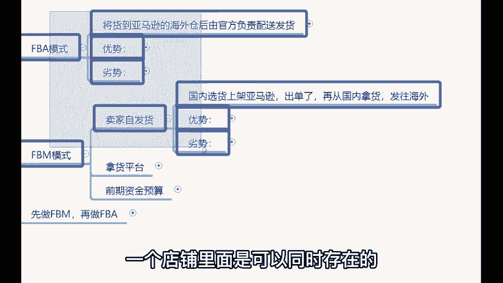

# 【亚马逊运营】B站最详细的新手入门全套亚马逊跨境运营实操教程，亚马逊开店到爆款店铺必学全套跨境电商运营流程，全程干货无废话，手把手教你打造TOP店铺！加字幕！ - P7：07、亚马逊运营模式：卖家自发货 - 娇儿运营 - BV14UmHYiEfv

。

那新手的话，对你不知道什么东西好卖的时候，那你就可以先做FBM模式。😡，这种模式叫做卖家自发货模式，啥意思啊？就是你从国内平台，比如说从1688啊，这样的平台选择你要卖的产品。

把这个标题图片这些相关的信息上架到你的亚马逊店铺里边。😡，对吧然后把这些东西上交到亚马店铺上之后去卖，卖出去了之后，再从国内。😡，直接发货到海外。我告诉你，无货员模式其实就这么玩的。

就是说你可能没有这款产品，但是在网上有人买，对吧？你就像我举个例子啊。😡。

呃，你就像我们刚刚举例的这个烟灰缸，就这个玻璃制的烟灰缸，你可能没有货源，对吧？但是你看到它利润大。哎，这个玻璃烟灰缸在国外可以卖个十几美金，十7美金等于人民币百0多块百0块啊，对。

那你发现这个东西利润大，你又没有货源怎么办？😊。

我们又不傻，我没货源，1688里边有没有货源？😡，🎼淘宝再再不济淘宝、京东、拼多多。我们可以拿回的地方太多了，我只要把这个产品的相关信息，什么标题图片这些东西上架上去，然后去卖卖出去了之后呢。😡。

再从这些平台拿货，直接发往海外就行了，这就是无货源模式的一个它的一个出发点就在于这个地方。那么这也叫做卖家自发货模式的一个运营的一个简易思路哈。😊，做这种模式的一个优势在于哪里呢？优势就是啥？

它属于一个轻资产运的项目啊，做这种模式不需要囤货和压货，说白了还是轻资产啊，就是这个东西的话呃为什么我说这个不需要囤货和不需要压货，轻资产的好处在于哪里啊啊万把块钱就能做啊。

几千几千块钱或者说1万块钱左右，你就能做这个事啊啊，它就没有那么大的压力，并且可进可退啊，这是核心的。就是风险低。说白了就是我我们新手而言啊，对于我们新手而讲，就是风险承担能力会相对比较差的。你吧？

你说我刚刚开通一个店铺啊，我先往里边赔个几千块钱，我怎么也不想再接下来运营了，对吧？我赔个几千块钱本来收入就不高啊，在我这个本不富裕的家庭上给我来个雪上加霜，是吧？

这就比较痛苦了那么而做这种模式的话就不会因为你不囤货不压货之类的，并且可进可退。举个例子啊，比如说你卖了一款产品啊，举例。😊，假设说你卖了一款这个呃卖了一款这个呼啦圈啊，然后你发现这个呼啦圈。

然后卖的特别好啊，一天可以卖这个二三十个三五十个啊。假如说你的这款产品一天可以稳定出单的时候，假如说它一天可以卖这个一二十个啊，稳定出来啊，这个时候你就可以考虑啊。

那么你可以准备个100个、200个甚至300个、500个发货到国外做FBA呀，可不可以呢？完全可行的呀，它是完全可以的。那么假如说你卖另外一款产品，比如说像瑜伽垫啊，然后你卖完之后。

你发现你的这款瑜伽垫造型太花哨了。所以说没人喜欢没人买怎么办？😊，产品下架。下架产品的话呢是没有什么经济上的损失的。对不对？对，所以说对于我们而言啊，风险这块一定要把控到位哈，这就是它的优势。

就是风险把控能力比较强。那么它的劣势就是比着FBA来讲，物流会相对比较耗时。这就是卖家自发货模式。而这两种模式在一个店铺里边是否可以同时存在呢？答案是可以的。😊，是可以的。

那么两种模式在一个店铺里边是可以同时存在的。你可以做着FBA的同时，做着FBM。

