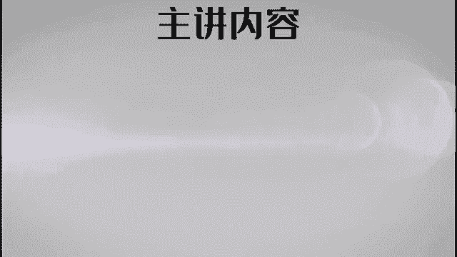
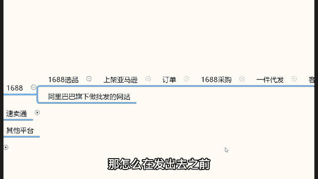
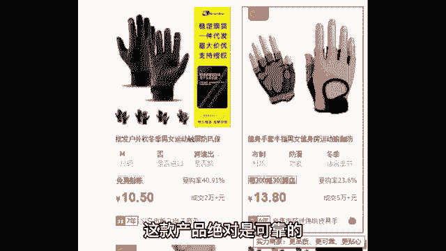
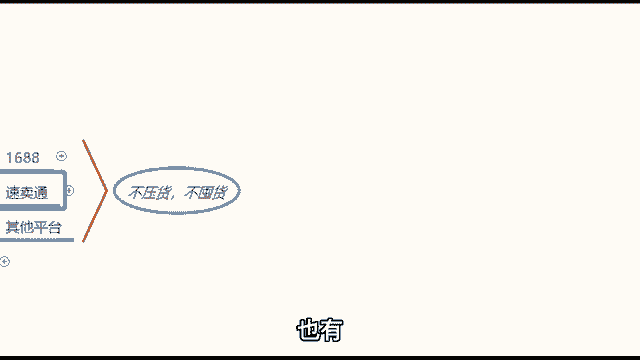

# 【亚马逊运营】B站最详细的新手入门全套亚马逊跨境运营实操教程，亚马逊开店到爆款店铺必学全套跨境电商运营流程，全程干货无废话，手把手教你打造TOP店铺！加字幕！ - P8：08、亚马逊运营模式：拿货平台① - 娇儿运营 - BV14UmHYiEfv

OK我看到我们很多的同学是没有自己的货源的。那么如果说没有自己的货源，接下来我告诉你们去哪里拿货。如果说有自己的货源的情况下，有自己货源的同学就可以去考虑卖自己的产品。你耳麦搞错了啊。有货源的情况下。

你就可以考虑卖自己的产品。那么如果说你没有货源，okK接下来认真听去哪里去拿货呢？如果说你没有自己的货源，有两个非常棒的拿货平台，那这两个平台分别叫做1688和速卖通。那给大家去简单介绍一下啊。

第一个平台叫做1688。1688这个平台是阿里巴巴旗下。😊，做批发的网站。首先这个168基调啊，它就是做批发的。我打开打开给大家看一下啊。😡，先打开1688，带你们看一下。阿里巴巴各位都听说过吧。😡。

哈这个我相信你们都知道哈，阿里巴巴这家公司啊看找阿里巴巴1688批发网官网啊，上阿里巴巴，对吧？你看阿里巴巴就是一个做批发的网站，你在百度上搜一搜，你就可以进去。啊进入到1688的官网之后，进来之后。

首先我刚刚给你们定过这个基调了。因为它是做批发的。所以说1688里边的产品的价格啊。😊，相对比较低。因为做批发，你看找工厂，找货源，所以说价格会相对比较低价。😡，价格低。

也就意味着我们的利润会相对比较高。比如说啊你看这种这个这个什么各种各样的产品啊，举例啊，像小孩子的玩具啊，奥特曼玩具啊。😊，3。36块啊，一个哎，跟我小时候看的奥特曼不太一样哈啊这种小玩具啊，1。

02块啊，什么恐龙玩具，还有这些什么手套啊，还有什么这个什么小书啊，这个儿童的益智书啊，3。989块啊，还有这种什么收纳袋啊，11块啊，杯子啊等等等这些嘛。那么因为这个网站是做批发的。

它是从工厂里边直接做批发的，所以说价格就相对比较低，价格低一点，就意味着说我们的利润会相对比较高啊，这是第一个。第二个优势就是说它的产品很全。

你要卖的产品在这里边基本上都可以找到什么衣服配饰这些东西在这边基本上都有。😊，对吧这是他第二个优势。嗯，就像这里你看什么婚纱都有，你看到没有？所以说这里边的产品啊是非常全的。

同时有一个其他平台没有的优势在于哪里？1688正中间这个位置啊，有一个跨境专供区，看到了吗？😡，这个叫做跨境专供。跨境专供是干什么的呢？是专门给我们这些做跨境电商的卖家供货的地方。

我们点击跨境专供之后呢，首先这里边的产品除了价格低类目权之外。😡，还有那么他们都有自己的国际物流对接。这样的话，你看跨境专供，跨境专供四个字，你就明白就很简单了。就是他们很多都有自己的物流对接的。

那么在这里我们该如何操作呢？给大家简一讲一下他的操作方式。首先操作的第一步的话，我们先来到1688里边选品，你要卖什么东西，你先选出来嘛，对吧？😡，那么这是第一步操作，先来到1688选品。哎。

我怎么打打半天咋老打错呀。好，你选择好了你要卖的商品之后啊，举个例子啊，就在这里边你选那种你要卖的东西哈，假设说比如说你想要卖一个什么。😊，啊，拖鞋OK在选好了这款产品之后，把这个产品的相关信息。

什么标题图片这些相关信息啊，复制粘贴拷贝上架亚马逊。你看标题图片这些相关信息都可以一个一个复制粘贴拷贝上映的亚马逊店铺里边。那么当你上家到亚马逊店铺之后，接下来开始进行销售就可以开始进行卖了，对吧？

当你卖出去了之后，就开始产生了订单。那么当你把这个东西卖出去了，就这双拖鞋，你上家自己的亚马逊店铺里边，然后卖出去了之后怎么办？我们再回到1688。😊，柴高。那么在168采购的时候。

它分为两种采购模式啊，不168采购其实很简单，就168里面有很多很多的产品都是支持嘛，一件代发的。看见没有？什么叫做一件代发啊？那这个就好理解了。一件代发的意思就是说你卖出去一件。

他们也可以帮你对接物流，帮你去配送发货。这个叫什么？这个就叫做一件代发。你明白了吗？这就叫做一件代发。所以说那么在1688里边哈。😡，你直接把这个东西卖出去之后。😡。

让他帮你直接进行配送发货给你国外的客户就可以了。啊，你使用把你的客户的地址给到这个工厂的老板，让他帮你去对接物流，直接帮你配配送发货就行了。所以说这就是168的一线代代发模式，这就是168的优势啊。

就非常的这个。😡，简单。那么但是呢在这里还有一个问题，就是有同学说老师1688那么多产品，我怎么去把控这个产品质量呢？来，各位，你们想不想了解一下，在1688里边怎么找高质量的产品。

想了解的公屏上来打一个数字一。啊，我给大家去揭秘一下这个这个东西是属于一个。😡，呃，小窍门啊，这个东西很多卖家都不知道，就很多很多的卖家都不知道怎么去解决这个问题。其实啊就是大家无法分辨哪些东西质量好。

哪些东西质量不好。我要卖一些差质量的产品，我发到国外首先我良天上过不去。另外我发过去之后，我还有各种各样的一些问题。那搞得我焦头烂额的。那怎么在发出去之前去找到高质量的产品。这个问题给大家去解决一下啊。

教你们一下这个秘密在于哪里啊？😊。

这个秘诀其实很简单。比如说啊你在亚马逊上想要卖一款产品啊，举个例子啊。😊，呃，你想要卖一卖一个什么呃，我看看有什么想卖的啊，对比如说卖一个这个。手套啊，健身手套。假如说你想要卖这个手套的时候。

你在168里边直接搜索手套。搜索完之后，你看168给我们推荐的各式各样的手套。那么这些手套哪些是质量比较好的，哪些是质量比较差的，是怎么去分辨呢？这里其实有一个小小的细节，你们一旦注意到了之后。

那就好分辨了，哪些细节呢？看这儿。😊，在这个整个的产品标识的地方，在这里写的有工厂名称的地方，有很多是带有这个牛头标识的。如果是带有牛头标识的这款产品绝对是可靠的。为什么这样讲啊？

我们点击这个牛头标识给你们看一下这个牛头标识的意思啊，就是亚马就是168的官方解释是实力商家，实力商家是1688平台的高端会员企业具备以下特质，非常重要的特质就是。😡。

质量有靠谱，质量有保障。为什么？因为我们打开这个这样的产品啊，比如说带有牛图标识的这样的产品，你看。你点击这个产产品之后，你看这保证金多少钱？16000。看到没有？就这个店铺的保光保证金都1600。😡。

所以说168里边有很多的厂厂家啊，他们的。😡，能够带有牛头标识的必须。首先第一个点，你是自己有正儿八经的工厂，并且工厂实力满足的，有这样一个真实的嗯运营运营的这种或者有这样的一个真实的实力的。

那么并且你还要给这个平台交保证金。😡，所以说那么这样的品牌就是从这样的一些这个呃店铺里面去拿商品的话，跟他们去合作，你就不用担心产品质量。如果说没有带这个有牛头标识的，那你就心里边可能要打打打鼓了哈。

那有有很多他也没有带这种牛头标识，你看到没有？他没有带的情况下啊，就是我建议不要去商架这样的产品啊。因为这个没有办法给你直接的一个保证，它他是嗯没嗯所以说这个点大家一定要清楚啊，想要找到优质的产品。

这就是一个非常简单的小窍门OK。😊，那么这是第一个可以拿回的平台，16888。那当然除了这个平台之外，还有还有没有其他可以拿回的平台也有。😡。

