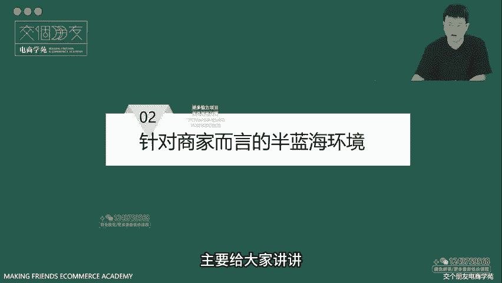
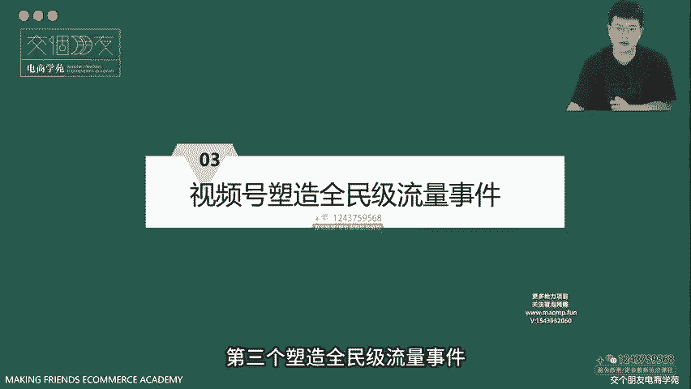

# 【从0-1成为视频号内容金牌运营】1、视频号综合数据和十大信号 - P1 - 叮咚361 - BV1JUtheUELJ

🎼，大家好，欢迎各位来到视频号快速入局企划训练营。我是交哥朋友电商学院金牌讲师泽勇。同时也是交哥朋友B端企业培训内训师。那么今天给大家带来的内容是视频号综合数据和信号。

本节课的主题跟紧2023年电商新机遇视频号，也就是我们接下来要讲的这个平台。好，来给大家具体拆解一下说为什么视频号是我们咱们这个阶段要发力去做的平台。好，今天主要给大家讲解四个部分内容。

学完这节课大家要明确自己的发展路径和时间节点，为后面的细节做好学习准备。第一个平台机遇，我们要了解一下视频号发展的基本情况和预期。第二个流量漏斗。针对于商家而言，视频号现在的环境是怎么样的。

第三个重要的信号。这个平台它可以不断的塑造全民级的流量事件。第四个官方的动作。官方对于商家对于创作者有什么激励的动作。

和政策也是我们需要去关心的。OK第一部分。视频号的发展的基本状况与预期。首先我们来拆解一下，2023年陆局视频号的一些新机遇。咱们不同体量的商家如何在视频号这个平台上找到自己的发展路径。好。

先来看到这个对比，视频号背靠的强大的国民级社交平台微信根据数据来看，2022年四季报及全年年报财报显示，微信及wechat的用户月活跃账户数达到了13。132亿。视频号的月活也有8。13亿人。

相较于抖音的6。8亿来说，用户体量和流量规模是非常大的。所以我们这个平台，视频号不缺用户缺的是习惯。他用用户体量比我们想象中的大多了。思考一下爷爷奶奶们叔叔阿姨们没有抖音的日常生活。

都是靠微信多的是我们之前没有触达过的客群了。现在视频号缺的就是怎么样让更多的人养成使用这个平台的习惯，以及在这里购物的习惯，对吧？而从最新的视频号数据来看。

目前视频号的使用时长已经可以达到朋友圈的80%了，说明什么，说明用微信的人逐渐习惯点开视频号，看看朋友都给哪些视频点了赞，看看最近又有什么新鲜的事儿发生了。

说明视频号正在逐渐占领叔叔阿姨们爷爷奶奶们的日常生活了。这个是咱们商家需要去关注的。

在聊天和非聊天的场景增长的推动下，微信总使用时长与2022年间持续增长，视频号使用时长为去年同期的3倍。这说明微信用户使用视频号的习惯已经逐渐被培养起来了。再来看看马化腾是怎么说的。

马化腾在2022年内部员工大会上批评了某些业务。比如说留给PCG某些业务的时间不多了。他把希望压住在视频号上，并说WXG最亮眼的业务是视频号，基本上是全场的希望。

所以今年必定会集腾讯整个公司的资源来做好视频号这个平台。这个时候大量资源投入和倾斜，就是我们商家要尽快入局，抓住风口的机会了。好，在了解完视频号的基本情况之后，再来看看针对商家视频号的环境是怎么样的。

第二部分，针对商家而言的半蓝海环境，主要给大家讲讲目前适合入局视频号的几类。

人与核心玩法。先来看一下视频号的电商进展和数据表现。在21年4月份，视频号带货全量开放，入场商家汹涌而至，短短一个月，商家入场数量月环比涨幅就超过10倍。UV和GMV环比增长4倍。

然后呢已经出现了成交额单场成交额破1000的头部商家转化率月环比超3倍，增长迅速，但是商家数量才刚刚突破90万，而买家数量在22年就已经达到了7000多万了，再来看看抖音是怎么样的。22年的4月份。

商家数量已经达到了180万。跟90万去做对比的话是90万的2倍，同时还有386万达人在抖音电商开展自己的事业，超过2万家服务商和MCN机构共同发展。可以看到它这个竞争是相当激。

激列的对不对？那么我们可以对比一下，可以发现视频号的月活呢高于抖音，同时买家数量在激增，而商家数量还远不如抖音。各位同学自己就可以得出结论了，对吧？咱们这个视频号呢是属于一个半蓝海的环境。

而抖音呢它现在已经处于一个半红海的阶段了。好，再来看一下个单价和退货率。抖音的客单价在50左右，大众的认知就是便宜，而视频号可以做到平均200%的客单。为什么因为客户是高净止客户。

这一点从咱们的退货率也可以看出来，抖音的退货率在60%，像服饰类更是有可能达到80%到90%，而视频号的退货率呢在10%左右，客群相对没有退货习惯，且对于网上购物来说更加理性。

同时同一产品在视频号的价格高于其他平台。但是它。

它依然可以获得不错的销量。这有两部分原因。第一个是部分客群，他其实刚刚养成直播购物习惯，它是没有比价的习惯的。第二点，他们都是高净值的用户，没有这个比价的需求，所以目前视频号还是一个半蓝海的环境啊。

再强调一次来再来看一下平台的其他优势。第三个，塑造全民级流量事件。好，可以看到市频号能够打通微信类生态，不断的塑造全民级事件。它基于微信的用户量级啊，它能够做一些调动流量，号召全民参与的大动作。

相对来说是比较容易的啊，当然呢也不简单啊，这里可以看到有一起来看流星雨啊，一起来看演唱会啊等等事件。新誉流量的大事件。还有比如说热点资讯。

2022年资讯类短视频的浏览量呢同比增长达到了百分之惊人的237。

大家还可以在此一起看演唱会，一起看春晚流星雨视频号在直播活动中获得了更多的用户心智，共1。9亿的用户，通过视频号的直播，观看了2023年的直播春晚，要和生活密切相关的内容领域。

比如说泛知识泛生活2022年视频号泛知识短视频播放量增长达到了209%。泛生活短视频播放量增长达到了291%，直播观看量增长达到了108%。所以说我们能够看到平台的一系列动作，要流量有流量。

要方向有方向。视频号它是能做的是吧？第四部分，官方的创作激励与商家扶持，来看看平台对于创作者对于商家都有哪些激励和政策扶持。可以看到，视频号从2020年到现在持续不断的进行功能更新。

商业化能力不断更新迭代。基于这一切的更新，使得用户端。

创作端、商业端、生态端多维度都在持续增长。视频号官方的连续更新动作，使得视频号直播电商环境不断完善，呈现出上升的潜力。视频号的创作者激励计划，非常的简单粗暴，就是要让创作者有流量，有收入有成长。

分开细讲则是要让1000万元创作者有流量，要让100万名优质创作者有收入，并且呢给予创作者持续不断的激励啊，而且还有视频号互选平台为创作者和商家保驾护航。

视频号互选平台是品牌方和创作者双向互选自由达成内容合作的交易平台。在视频号互选平台上，品牌方可根据品牌调性，目标人群等维度与匹配的视频号创作者合作。视频号创作者接受合作邀约后，将结合品牌需求及粉丝编号。

为品牌方定制创意内容，最终发。

录在视频号内，背后，商家看到这里，视频号直播，商家激励计划未来一年要扶持不少于10万个优质商家，商家每引导一个私域用户进直播间，平台将至少会激励一个公寓用户返回给商家。OK本节课的内容就到这里。

