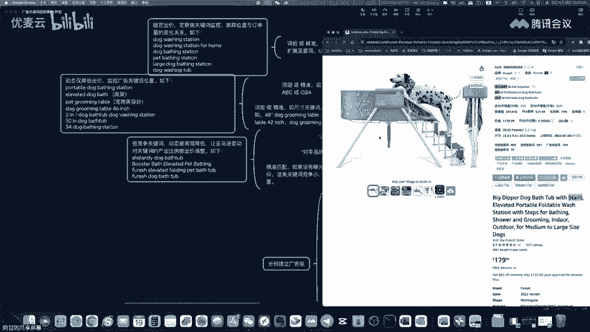
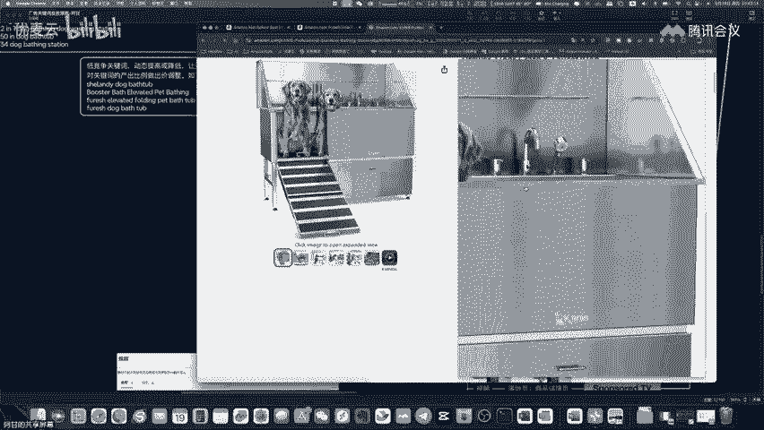
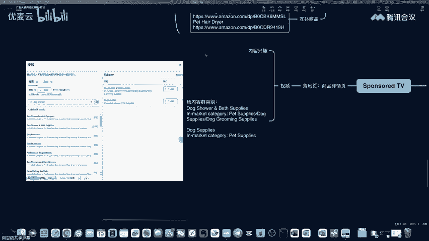
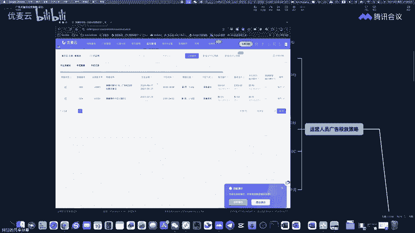

# 【优麦云第27期大咖直播】 阿甘：运营人员忽视的亚马逊广告位置 - P1 - 优麦云 - BV1HVtZetEo7

那应该可以吧。稍等一下。稍等一下。😔，好，这样应该可以。え。Yeah。好，hello，大家好。那个今天是2024年9月19号。星期四。晚上8点。呃。今天我们主要来讲一下关于广告的一个投放策略啊，就是。

很多人对于广告的投放策略其实是没有一个。非常全面的一个概念吧。就是说比如说你们的广告大概会出现在什么位置，然后到底广告的关键词要怎么去进行布局啊，什么样的出价方式？然后不同运营人员如果说是卖相同的产品。

有些人他是公司是有团队嘛。那有团队的话，那么。他的这个呃投放的这个关键词怎么去进行分工啊，避免说团队之间互相内部自己去抢这个流量。所以呢今天做了一个这个思维导图来给大家做一个。拆解啊。

就思维导图很内容很多啊，大家看这个这么多内容，我不确定今天晚上能不能讲得完，尽量讲吧。

尽量把这个给讲完。然后大家如果能听清楚我说话的声音的话，麻烦打个一啊，能听清楚声音就打个一，我就准备开始今天晚上的内容。好好好好，那我就开始吧。好。😊，那么首先啊为什么要做这个思维导图？其实对于是。

在广告投放的过程中，以及说是嗯有新手进来，或者说是有不同能力的运营人员进进来之后，那么我们需要有一个一个广告投放的一个大概的一个标准啊，就是有些公司他可能是团队里面人比较多啊，或者账号比较多。

他可能有ABC3个运营，有然后分别ABC3个账号。那么其实他他卖的产品的大大同小异啊，基本上可能都是相同的。那么在这种情况之下的话，那需要去不同的运营人员去抢占不同的广告位置。呃。

避免说自己之间公司内部去形成内耗吧。那还有一种情况就是说是你们在投放广告的过程中，呃，目前大多数人投的只是搜索搜索广告，就是关于是搜索词。但是SP广告的话，它其实它所能够展现的位置是有限啊。

虽然是最大流量的入口，但是它能够展现的位置是有限的。所以呢今天给大家讲一讲，就其他的广告类型到底是能够帮助我们去做什么样的一个。位置的一个拓展。就是说你明明知道说有些关键词。

它是能够给你带来呃流量带来订单的那么。哦，他是呃就是。在不同的广告位置曝关的时候，能够让你带来更多的一个曝关的一个机会。所以呢就今天晚上大致讲的内容是关于是这些。那今天晚上要举例的这个产品啊。

就投放广告之前肯定要有一个产品的一个举例嘛。那我今天就以这个产品作为举例。因为之前的话其实有说过，在选品的时候有说过哈，就是在。卖家经灵这边这个做了一个这个选品分享的时候。

有收到的是呃狗的这个洗浴洗浴盆，狗的洗浴站。然后这些关键词它的搜索热度是成非常明显的这个搜索的上升趋势的。所以就以这个产品作为一个举例啊。

以一个实例的方式来告诉大家就是怎么样一个投放广告的一个大致的一个流程。我。然后我们首先来看一下，就是SP广告哈，这个做了一个思维导图。那先从SP广告开始，SP广告也是大多数人用的是最多的啊。

就是搜索广告。那么呢它分成两个大块，一个块呢是自动是吧？这个大家应该不陌生，另外一块呢是手动。那，制动当中的话，它有分成是定向组设定设置进价哈，你们自己去对照后台哈，就是你们在设定自动广告的时候。

有一个定向组设定进价。看这里面的话就是有。四种类型。一种类型呢叫做是呃紧密。宽泛。同类跟关联啊，这四种类型。那么其中第一个的话，紧密什么是紧密呢？锦密是在。呃，这个搜索词当中。

去进行一个就是跟你的这个呃就是产品去进行一个匹配，就是跟你产品相关度比较高的一些搜索词去进行一个匹配。这叫做是紧密。那这个这种广告的这个设这个竞价的这个设置的话，其实不需要加太多的这个这个一个出价。

它可以增加百分比嘛。那这个百分比紧密匹配的话，其实是没有必要去进行加价的。为什么呢？因为这种广告其实你们在投放的过程中，大多数是为了去拓展关键词。啊，拓展关键词就是说是一些你们。

可能是在呃手动广告当中是一些缺失的关键词。所以呢这在这种广告当中紧密匹配，它一般跟你匹配的是一些非常相关的一些关键词。所以这个这个位置是不需要加价。

因为你不需要通过这段广告去拓展跟你相关性非常高的这种类型的关键词啊，这是一个策略哈，不是说绝对只是说介意哈，大家听清楚，不是绝对是介意啊，其实是没有必要去加这个竞价的这个百分比。

那第二个呢是宽泛宽泛的话就是说是帮你去拓展一些关联的相关的一些搜索词。那这些搜索池的话，很可能比如说像我们的这个呃这个洗浴盆对吧？那狗的洗浴盆，那它会不会帮你匹配到猫的呢？啊。

有可能会匹配到会不会帮你匹配到就是呃大型犬呢会匹配到小型犬呢会不会匹配到会那么便携式的折叠式的啊，然后呢呃各种类型的，它可能都会帮你匹配到。因为它可能认为是同一个场景上面，就是你帮狗洗澡。

同一个场景上面它所可能会呃应用到的这个洗浴盆的这个相关的一些产品，它都会帮你匹配到，甚至是可能会帮你匹配到它的这个就是狗洗澡的时候，它有专门的花洒软管啊，也可能会帮你匹配到。

所以呢它就是一个关联性的这个流量。那这个流量的话，你为了要拓展关键词嘛。所以你可以选择进行加价，比如说加个20%或者30左右的一个加价啊，当然这不是绝对哈。大家听。

听课程不要三搬硬套，不是绝对，是呃建议你先百分二三十的这个加价。然后第三种类型呢是同类，同类是跑什么呢？它跑的是关联流量啊，就是跟我们洗浴盆相关的这种关联流量。那这种关联流量的话。

那就是跟产品类型是非常非常相关的。比如说像这个啊，这个呢是小型犬啊。

这个呢是大型犬的。它两个是体积是不一样，但是呢它算不算同一类，而且是紧密匹配呢，算算是同一类型，紧密匹配的。所以呢他跑关联流量的时候，他的这种呃广告的这个设置，它会帮你跑出相关性比较高的关联流。

所以这个地方你要不要加价，看你自己啊，我这边建议是不需要加价。因为他可能跑出一些流量的话，他的。竞争力竞争能力很强啊，比如说举个例子，比如说像这个产品。

他有5000多个评价，排名也很好。呃，那么你跟他直接正面竞争的话，除了价格以外，我相信。哦，很难跟他竞争，而且他评分很高，4点8分。销量又好，评分又高，评分评价数量又多，品牌呢有一定的知名度。

然后如果你跟他正面竞争，除了价格之外，我也想不出什么其他的东西啊。就是因为竞争对手能做到东西。

呃，其实跟你们也都差不多啊，所以这个是同类型，除非说你产品非常有特点啊，非常有差异化。那么你可以在这个地方可以加价，就是你自己判断说你能不能竞争过同类的型竞争对手。那么在这种情况之下。嗯。

有些同类型的竞争对手，我们是可以竞争得过的是吧？那你可以自己手动的去挑出来，而不要用自动的方式去跑啊，所以这个地方我建议是不加价，就同类型。那关联是什么呢？关联也是关联商品。

就是属于说是宽泛匹配的商品互补型产品。他买了A可能会买B啊，这种需不需要加价呢？我个人认为需要加价，为什么呢？因为我们很难判断出用户的行为，比如说他买了一个。

花洒。狗用的花洒。他会不会买这样一个浴盆，有可能会啊就有可能会。因为你不知道呃在一个新品投入市场过程中给你带来的关联流量可能是什么？比如说我们看这个手套对吧？他买的这个浴盆会买手套。

那他买这个手套的时候，会不会也买这个浴盆呢，不好说啊，比如说我们点进去看看他的这个关联流量是什么啊，比如说我们拉到这个下方，那么手套的他的这个配匹配的这个关联的商品什么的？是这个沐浴露啊。

就是买手套的大概率是会买沐浴露。啊，那所以说呃你的产品。跟什么类型的产品会形成组合式的购买。

这个不好说，所以呢需要通过自动广告的方式去进行一个。

哦。关联这个互补产品的一个这个匹配。那么所以。你就可以在这个地方可以加价。那么我应该讲清楚了吧，就是是个功能，它到底是出于什么目的？那为什么要加价？为什么不加价啊，就这个。

是这种网络的一个定向组的一个这个设置竞价。那呢接下来是它的一个竞价的一个策略哈，这动管告单里个竞价的一个策略。那这种竞价策略的话，它有分成。呃，这个呃这个动态的方式。那动态的方式的话，我建议就是说。呃。

用仅降低的方式，他有是呃提高跟降低或者是警降低啊。那么景象的的方式呃相对来说会。比较可控你的广告的会出现的排名跟位置。亚马逊它有一个规则是。呃，就是大家总结出来一种经验嘛。

就是说如果说你给他比较高的一个出价，或者是是一个动态的提高跟降低，那么亚马逊会尽可能的在一天24个小时时间之内把你所设定的每日预算给尽可能的给。分配到嗯高流量的位置。因为你的出价可能很高的话。

它分配到高流量的位置，尽快的给他消耗完。所以有的时候你们会发现说你们的广告预算可能只有是10美金和15美金的时候，比如说出价太高，可能一天还跑不完，就直接就超出预算啊。

所以这个是亚马逊的一个呃广告的一个机制，它会给你更多的流量，但它不保证你效果啊，它不保证你的效果。所以呢在这个竞价策略当中，你使用动态紧降动态紧降低的这种方式。

会比较能够是控制你的一个流量所出现的位置啊。如如如果是你给他一个比较低的一个出价，那他会相对来说会在曝关度不太高的一些位置，或者是比如说竞争对手也有分成高流量的竞争对手跟低流量的竞争对手。

他可能会帮你分配到一些低流量的一些竞争对手的商品详情页当中去。所以呢这个竞价策略在新品的期间，前三个月的时间吧。评价数量如果低于100平平均分。如果是4点5分呃，这个以下的话。

不太介议冲太靠前的这个广告位置啊，这是一个出价的方式。那广告位的。这个竞价的这个调整，它有分成三个部分。三个部分是什么呢？是分成搜索结果顶部。商品页面和搜索结果区域位置啊。

就很多人搞不懂搜索结果区域位置到底是在哪里呢，就是这个是。你们去考你们公司的运营人员，大概百分之七八十的，应该是不知道这个答案到底是什么的。很多人就是凭感觉就是瞎填。那么他的商品结果其余位置是什么呢？

是在搜索结果的中部。底部第二页以及是购物车的页面啊，那就是这个虽然是基础知识啊，但是很重要，就很多人搞不懂它到底能够出现在什么位置。那好，那这个时候你是一个新品。那么我我问你，我问大家哈。

你们是要出现在搜索结果顶部，还是想出现在搜索结果的中部底部跟第二页以及购物车的这个页面啊，就你们到底想出现在什么页面啊吧？那如果你的竞争能力不是特别强的时候，我相信你大概率是会选择一些仓位流量。

仓位流量，就是说比如是在一些中部底部第二页或者是购物车的页面啊，去减一些便宜的流量。所以呢这个地方需要加价啊，就这是加价的一个理由啊，比如你可加价30%到50%左右。然后商品页面的话。

它的曝光度是很高的。它的曝光量通常是搜索结果的曝光度大概是5倍以上。呃，大多数产品都是这样的，基本上是5倍以上。那它的流量比较便宜。它的出出价的话。

基本上也是CPC的话是会比搜索结果大概会低一个30%到50%左右吧啊，这个没有一个具体的一个数字，大概是30%到50左右。所以说你在搜产品页面去加价啊，也比较容易去曝光你的关联流量。然后呢。

如果说你的两个。形成了一个匹配。什么匹配呢？就是同类跟关联。比如说你你想拓展互补型的流量，这个地方已经加了百分二三十，然后呢，又把商品页面再加了百分之二三十或者三五十。那么它是叠加的关系哈，叠加话。

那那么也就是在商品页面的互补型产品当中，它会有更多流量的曝光。那么你知道这个原理之后，你就懂得怎么去控制它自动广告，它应该出现在什么位置。或者说你想让它出现在什么位置，就就更高的一个比率的一个这个关系。

这个呢是叫做广告位的一个这个呃竞价。然后呢。提前否定关键词啊，这个是很多新手卖家是不是会经常会去做的东西。就是什么叫做提前否定关键词？比如说呃我们把关键词的功能去做一个这个拆分。拆分之后呢。

我们会发现他的一些产品的一些这种。

需求是吧。比如说这是小狗的。那大家想说，你们在投放自动广告的时候，大狗的会不会会不会跳出来？大家想一想这个问题，就是你投放的是这个小型犬的。

那么呢大型犬呢会不会会不会关键词会不会跳出来？然后呢，你投放的这个这个产品，它可能是适合室内的。那么呢呃户外的会不会跳出来？虽然说他这边哈，你看他这个标题当中，他又写了室内跟室外啊。

但实际上来说他们是有一些场景的一些区分的哈，就是有一些具体的一些产品，它是有一些场景的一些区分的。比如说我给大家再看一个。

再看一个产品。大家觉得这个可以可以投到室外吗？这个他有有人会把这个东西装在室外吗？大概率是不会吧，是吧？大大概率是不会把这个东西会。啊，装在室外。那么呢好，那这个时候如果有人搜说室外的户外的啊，庭院的。

这种关键词，那它会不会自动广告会不会跑出来呢？极有可能会跑出来哈。然后呢，那些买家呢出于好奇心，也会点一点去看一看这个产品到底是一个什么产品。但是这种流量其实不是我们想要的，它会不会成交。

有可能会成交啊，只是说有可能会成交，但它成交率呃是比较低的，它跟我们的场景其实是不相关的。那么这边我只举了两个例子啊，就是一个是场景，一个是功能，你们自己可以举一反三，就是说在你们这个类目当中的产品。

用户可能是会有哪些搜索值。那这个搜索值跟你到底是否是有。相关性如果有相关性的话，它会不会给你带来转化？如果不会给你带来转化的话，其实是可以做一个提前做一个否定。比如说这个跟场景是不相关的。

然后另外一个呢，比如说是跟功能不相关的啊，比如说呃这边有举个例子，比如说是呃狗洗澡的机器是吧？狗洗澡机器，那么比如说那它会不会跳出我们这个产品呢？其实是会的。但是呢狗洗澡机器。

你真正通过关键词去搜索的话，它会出来一个什么样的搜索结果给大家看一下哈。我给大家看，这是狗洗澡的机器啊。嗯。这个出来的产品搜索结果跟我们的这个其实就相关性不是那么高是吧？那你看这个产品它也有是吧？

这个产品也有，但是它会不会形成一个很好的转化呢？大概率应该是不会的哈。当然这个我是我的主观判断，不不是百分百正确的答案，我只是主观判断自动广告，它其实不应该是投放这种关键词。如果说你想投放这个关键词。

你还不如是把这个关键词放到手动广告当中去做个尝试。既然你没有办法去做这个决定啊，比如说啊这个给狗洗澡的机器啊，这个你没法做决定，它有可能会形成转化，你有可能不会，那你没没有必要通过自动广告要去跑嘛。

是吧？你可以通过手动广告的方式去跑，你想验证一下你的思路到底是对还是不对。你用手动广告就行了，没有必要用自动广告。所以如果是跟。功能不相关的啊，其实呢你是可以。哦。提前的去做一个这个否定它。

比如说还有这个这个呢跟我们的这个狗洗浴的这个呃洗澡盆，或者是它洗浴站，关键是很接近哈，它中间只有一个齿不一样。什么词呢？狗爪。因为狗从户外。跑到室内的时候。他需要要清洗他的这个狗爪啊。

所以呢比如说像这种类型，你看它的这个搜索量很高，销量也很高。那么呢像这种类型的这个商品呃，如果说是跟你的这个产品其实是没有什么太大的这个关联性的那其实是可以提前就把关键词去做一个否定的一个这个操作啊。

所以说这个就是自动广告，是需要去做不同位置的这个价格的控制，以及达到不同的效果跟目的。然后以及是说你们在提前量去做一个否定的一个操作。那另外一个的话就是他的一个预算。预算的话。

其实大概是可以用他的一个建议的一个预算。呃，不用太担心预算会超标，因为你们可以通过去调整它的出价啊，或者是它的一个价格加价的一个比率啊，去控制说他每天消耗的一个广告额。尽量不要一个过低的一个预算。

因为过低的预算，它广告会停掉。停掉的话，其实对这个广告跑数据是呃影响是不太好的。那我觉得自动广告应该大概就是几个点跟大家说清楚了。

那么第二个呢是手动手动的话就是最常用的，这个是百分之大概是。百分之大概这个八九十的卖家就肯定是百分百啊，这个都会使用到这个SP的这个手动广告。那手动广告当中的话。

大家可以把它去进行一个广告组的一个拆分啊，什么叫广告组拆分呢？比如说我们现分成两个，一个字叫关键词投放，一个叫商品投放。首先先看关键词的话。关键是投放这边我们可以把它分成ABCDEF啊，就分成多个组。

那么我这边只是给大家举个例子，就是去做为一个关键词的一个分组。大家自己可以举一反三，就是后续要再去增加，或者再去减少。那比如说像关键词的一个分组。呃，第一个是核心池。啊，核心词是什么？

核心词就比如说我这边列出的这个核心词，就狗的洗浴站啊，然后狗洗浴站呃家用的啊，然后狗的这个呃宠物的洗浴站啊，大狗的洗浴站啊等这些这些都是属于核心关键词。这些关键词跟我们的产品是高度匹配的啊。

啊，其实今天要讲的这个产品重点是这个啊重点是这个产品。这个高单价的这个产品。呃，那么你们看它就只有一个评论，只有一个评论，目前只有一个评论，五分五星的一个好评，1249美金的一个售价。

然后通过这个评论来看的话，好像还是直评啊，就是不是说是呃带VP的评价。那么这个有可能是自己。呃，自己搞上去的哈，所以不一定是他的一个真真实的一个评论，但是也不好说。

因为这个这个链接它有一个有比较特特殊的地方，它是亚马逊的呃VC的供应商在卖这款产品啊，所以所以说它的评论应该来说是不会有这个。

呃，人为操纵你的这个嫌疑，但是今天主要围绕的是这个这款这个产品来讲。哦，那核心池其实就基本上是这个固定的。因为这种池基本上跟我们产品是有比较强的一个相关性。但是呢它够不够精准，它其实不够精准。

但是它流量最高。所以呢这种池。你既然知道他跟你是有强关性。虽然说他的。呃，这个不是那么的精准，转化率不是很高。但是呢它跟你的产品相关度是非常非常高。那么在这个时候，我的建议是用固定出价的方式。

固定出价的方式的话是可以比较容易可以控制它的一个广告的一个位置。就是说你可以去用呃。呃，比如说像优卖云的这个关键词的一个这种跟踪。去关键词的排名的这种监控。

然后呢去跟踪你目前的关键词到底是处在于一个什么样的一个位置。比如说优卖云当中它的一个监控管理。

然后用固定出价的方式，然后去进行一个关键词排名的一个监控，然后控制它所呈现的一个位置。比如说你加0。1美金，它可能会在什么位置，它的近一周的数据到底怎么样？你减1美金，它大概在什么位置。

它的近一周的数据到底怎么样，或者呢也可以使用关键词卡位的方式。比如用关键词卡位的方式的话去进行。呃，关键词的位置的一个控制啊，那么你位置控制的更加的精准的话，有利于说你的整个广告的报关的一个结果。

然后给你带来转化率的个影响。比如说我现在是要控制在搜索页面第一页的这个中间的第。

呃，10名到第12名的位置，比方是这么说哈，他这边我们看到这边有一个演示是从第一名到第12名的位置。那么比如说我们可以控制在第10名到15名的位置。那么呢看一下它的一个转化率到底怎么样。

那比如控制在第呃这个15名，比如说到20名的位置，那么它的转化率到底是怎么样啊，不同的位置会影响到你前后左右的一些竞争对手，以及是你的一个投入产出比。也就是比如说你位置比较靠后，虽然流量可能少一点。

但是呢它的投入产出比是最优的啊，那这个时候其实就是要锁定住这个位置。那么用固定出价的方式相对来说比较容易是卡住。

你想要出现的一个搜索结果的位置，特别是在SP的一个关键词的一个投放上面啊。然后另外一个的话，比如说在嗯我们去做一个这个关键词的这个卡位的时候，还有一个就是商品详情页。因为它搜索通过关键词的搜索的话。

第一个是会出现在搜索结果的位置。另外呢它也有可能会出现在搜索结果的位置啊，就是在啊不是另外有可能出现在商品页面的位置。那商品页面的位置的话，它到底出现在哪些商品页面，并且出现在什么位置。

你也可以通过用卖云的这种详情页的这个排名的监控去做一个呃就是一个跟踪吧。那么你用固定出价的方式，这个可以控制的比较的精准。因为这种流量比较高。那么你用你用。你用这个稍等一下。大家稍等一下啊。嗯。呃。

如果说你是用这个动态提高跟降低的话，它的位置会跑来跑去的。因为它会根据你的订单量转化率的话，会呃帮你去加价或者是降低。那么你如果用动态仅降低的方式的话，有可能你转化率不好的话，他就把你拉低排名的。

但是呢这个有的时候他的排名的下降哈，是有时间规律的。什么叫时间规律呢？就是你们有没有去跟踪过关于你们近一周时间，周一到周日它的销量的变化啊，这个呢是呃我这边是有经常去跟踪这个数据的。

那么你跟踪完这个数据之后呢，你会发现说他在不同的。哦，时间给你带来的订单量是不一样。比如像我的产品在周六跟周日，就北美时间的周六跟周日，它的销量是明显不如周一跟周五的哈，大概会落差20%到30%左右。

那好，那这个时候如果你用动态的方式，你用动态紧降低的方式或者动态提高跟降低的方式，它的销量一旦下滑，转化率一旦下降，它就给你拉到更低的位置了。但实际上来说，你没有这个必要拉到更低的位置是吧？

就是说周六周天的。销量不好啊，但是呢我没有必要是拉到低的位置。我可以是比如说拉更拉到更高的位置，我保持住这个曝关量跟点击率，无非只是转化率下降。这个可以理理解的了吧，就是他其实只是转化率下降的。

那么我我还是要保持一个高流量跟高曝光，它该出现的位置还是要出现在那个位置。所以呢就是如果你用动态的方式，它有这样的一个缺点。但是呢这个比较适合这种出价方式比较适合于是有经验的卖家哈。

新手卖家的话嗯还是可以借助这个。

优卖云的工具去进行一个关键词的一个拷位啊，就是你不管你用动态的方式，还是用固定的方式吧。那么你就是用优卖云的方式去进行这个这个卡位。

那产品产品功能B组的话是产品功能卖点的，关键词为什么要把它分成ABCDE组，就分成这么多组？就是说高流量的词，它其实不适合跟低流量的词长尾值放在同一个广告组当中。这样的话它会其实会去抢预算啊。

这个呢是我自己个人的经验。那么呃。就是我发现就是比如说一个组当中，如果说有比如说超过呃50个关键词哈，或者是流量高低有很明显的区别的时候，我发现我的长尾词跑不出报关量。然后呢，我就把它拆开，拆开之后呢。

就是重新分配预算之后呃，它可以跑出这个曝关量。那至于这个什么原因呃，我也不不是特别的清楚。但是这个问题我有咨询过亚马逊的官方啊，这个可能是他们广告的一个机制。就是说他广告当中是会呃向高流量呢去倾斜。

给你更多的报关啊，给你更多的这个订单量而不考虑说一个预算的一个分配啊，这个我觉得。呃，是不太嗯科学的一个广告的一个设计方式哈。所以呢比如说我们就去拆除。那但是拆除的话也有好处。拆除的话，你每个词每个词。

会给他一些不同的一些设定啊，那么它的会更加的精准一点。那么第二组的话，比如说是带功能卖点的一个长尾池，它可以是ABC或者是BCA。那么它可以是持组或者是精准匹配的方式啊。

你用词组也可以用精准也可以都可以。那么你如果要想拓展出一些更长的一些长尾池的话，那你可以用持组的方式啊。如果说你很确定这个词是能够是给你带来呃流量或者带来订单的话，那么你就直接用精准的方式。新手的话。

建议是使用持组的方式，其实就可以了。那么他有。出价方式的话，建议选择是动态。挺降低的方式，然后去控制它的一个关键词的嗯位置。哪怕是说去监控关键词的位置，那那他大概是什么类型的词呢？

比如说像他有些搜索会是二合一三合一啊，有些呢比如说是50寸、34寸、46寸啊，有些说是高价，什么是高价呢？高价就是说他会啊。

这个洗浴盆的抬高。啊，会把洗浴盆抬高抬高的话，更有利于它的操作啊，就是洗浴盆抬高之后，它更有利于是他去帮这个狗去进行一些这个这个操作嘛，那么会更加的这个方便一点。所以说他们会说说这种这种抬高的啊。

就不用蹲在那边，或者是比如说是那个拿一个凳子这个坐子里边啊，你站着就可以操作这个这个啊这个狗的这个洗浴的一个整个的一个动作。

所以说他这边会有一些带功能卖一点的一些仓位值，然后甚至是还有一些呢，他会是什么呢？他会是有一些。嗯，比如说他他会是说有带梯子。

啊，有带台阶，有带梯子。啊，那这种其实也是算一个这个。

它的一个功能卖点的一种关键词，因为有些狗可能比较重啊，那你报上报下的话，其实并不是那么的方便啊，报的不好，可能把这个整个打翻掉都可能。所以说它会有这样的一个嗯关键词。那么也可以是什么？

也可以是带变体特征的长尾池啊，因为有些产品它其实是有同类商品，它其实是有变体的。

啊，编体的一块一般就是颜色尺寸啊之类的那我我看一下，我给大家看一下。

这款是没有。

No。好好，那这个就是带编体是吧？😊，那毕且它这个明显有尺寸啊，38。385061啊，然后呢还有分成是呃左跟右啊，就是左是左边进入还是右边进入啊，有分左左跟右啊，然后还有分有这个有这个柜子啊。

有分左坡道跟右坡道。

嗯，这就是很明显的一个这个它的一个功能卖点的一个区别。但是会不会有人搜索，就左扩到右扩到呢？其实这个搜索量就会比较少。但是呢尺寸其实就是会有很多人去进行搜索。所以尺寸的话可以去进行一个关键词的组合。

比如说你可以分成是C组啊，C组的话，它专门是带于是变体特征的长尾关键词。那么B组的话是在产品功能的长尾关键词。那么它的流量就一步一步的往下收缩了，就是越往下，它的流量就是越长尾。越长尾的话。

它流量就越低啊，目的是什么？目的其实就是为了让它能够是有单独的。预算可以去跑出他的这个报关。打错了一个字啊，核心值。然后地主是什么？地主是自有品牌池的一个组合啊，品牌值加核心值，自有自由品牌。

那肯定有很多人说我我的品牌没人搜索啊，但是呢应该也有一部分的卖家，他的品牌是有人搜索的。啊，虽然你的品牌哎你的商标在北美没有很强的一个知名度，但是呢还是会有人去搜索啊这个你的一些这个相关的一些产品。

可能是会有一些这个复购啊，或者是比如说想再买一个等等之类的。那么你的自由品牌词跟你的核心词去进行一个组合，你可以把它丢在那边，有没有人搜索。目前如果没有人搜索，也没有关系。

未来肯定是会有人去进行这方面的这个搜索啊，能够是把这块的流量嗯把它给覆盖住。那么呢一组是什么？一组是竞争对手的品牌值啊，竞争对手的品牌值。那么就有呃呃很多种这个类型啊给大家看一下。

比如说像这个这个呢这个牌子呢，在北美市场，它其实这个是一个中国卖家的一个这个品牌嘛。但是呢它在北美市场的销量是非常好。它的它的好几款的商品，在北美市场的销量都很好，而且呢卖的时间也很久。

这个链接它是从2020年开始卖的啊，卖的是年06个月的时间啊。所以他的这个品牌值在市场上是会有人去进行搜索的。如果说你这时候跟他做的是同类型的商品，然后你的功能可能比它更好，然后价格可能会比它更低啊。

或者是比如说是有明显的一些差异化。那么你是可以是呃去打它的品牌池加它的核心值的，这个可以单独的去放一个主。比如说这个是放在是E组啊E组当中去进行这个呃自主匹配的这种方式去做一个。

啊，这个广告主。然后呢，像这种设定的话，尽量是可以用动态提高跟降低的方式。为什么不用动态提高更加呢？因为这些词它的流量很低。或就是要没有必要用动态紧紧降低的方式，也没有必要用固定出价的方式提高跟降低。

让他自自己去跑就行了。就是效果好，他可能就会加一点价格，效果不好，他就可能就会减一点价格。所以呢你用动态提高跟降低的这种方式去跑这种类型的关键词是比较适合的。然后呢，还有F组F组是什么？

这个F组的话就是也是一些流量的入口啊。比如说像西班牙语的啊，这个之前是有说过，它的流量有没有呢？很少很少。但是呢如果说你把它放到跟你的主关键词或者长位词，给它放到一个广告组，但是他也跑不出什么曝光。

可能是零曝光都有可能，所以你最好单独放一个这个主。然后给他这个单独的一个预算。那么西班牙语跟一些拼写错误的关键词啊，拼写错误的关键词属于是捡简陋的流量，它的流量不高。但是呢它的出出价进价是非常非常低。

你可以满设置一个放在那边。那么。呃呃有这种简漏的这种概率。比如说像键盘当中有某两个这个字母，它是比较靠近的那它可能就会写错。那么如果是会有写错，你可以放到这个工具当中去进行搜索一下啊。

看一下他有没有曝光，有没有流量，或者是有没有被收入啊，他有时候可能连曝光跟流量都没有。因为它的流量太小，那个工具工具都招不到。所以说你看看有没有收入啊，有有如果有有被收入进去的话。

那那么其实就可以去进行这个投放，或者是有的时候他可能连收入都没有收入。那么这个时候你就凭自己的这个经验去进行这个尝试了哈。就是可以去试试看这种拼写错误的这种关键词。

那么我自自己的话其实是用工具的方式啊去进行这个呃。这组合组合的方式，然后呢。放到工具当中去进行批量的这个搜索，然后把有流量的这些都给它抓取出来。那至于组合的话，其实是有很多种的技巧和方式。

比如说嗯你可以问AI是吧？你可以问VD啊，你问他像这种并且错误的词有可能会是什么啊，那他会给你列了一一大串。然后呢，你可以把这些词呢去做一个这种组合的关系，然后组合起来之后。

它又是形成了一个单独的一个广告组啊。所以呢这个是关于是他的一个关键词的一个投放的一个策略，就是不同的广告组，他分别起到什么样的一个功能跟作用，分别是什么样的出价方式，以及什么样的匹配方式。

它的一个这种关键词的一个投放，就手动投放。

然后呢，再接下来的话是商品投放额。商品的放这边的话，他其实投放的嗯是跟你有相关商品的，他的。标签或者是叫做是这个流量。嗯，他的这个标签或者是他的这个流量。那么。嗯。如果说是相关的品类。

那么它的这个关联度就非常非常的高。那，比如说我这边有列出了3个，那比如说我们投这个商品投放的时候，可以呃这个把这三个呢全部都给他加进去啊，这上面是三个分类哈，然后打开一个分类给大家看一下。

比如说我们看到这边这个分类哈，你看他右侧这边这个分类，它这分类呢有分成三块3个。一个是什么？一个是便携的啊啊就是便携折叠呢。那么还有一个呢是什么？还有一个是专业的啊。

但是呢其实这个当中呢也又放了一些很多不专业的一些这个呃。这个产品什么叫专业呢？这种这种叫专业对啊，这种是就是呃美容院啊，或者是对于是一些宠物护理。

有些专业的需求的啊才会使用到这么高客单价格的这种这种产品。我上次在选品的时候，其实是有说到这个产品啊，这种高单价的产品。我个人还是蛮喜欢做这种客单价格高的产品，因为它的回报率是非常的不错。

虽然一个月也卖不了几单哈，我们看一下它的销量多少，看这个卖家经营。有们把它载录进来。Oh。平均分4点6分，2000美金的一个售价。那下面应该有变体啊，有变体，它有份61寸、50寸跟38寸。

然后看一下他的销量还没载露出来，有点慢。然后他这个呢还是FBA的方式进行配送，说明它的体积是符合FBA的要求的。当这个用户买到手之后，可能需要去进行一个组装。这边还没载入出来，等会儿他载入出来。

再给大家看一下。哦，那我刚才说的，这个就是一个相关的品类去进行投放。相关品类投放的话，它可以帮你去匹配这个品类当中的一些跟你产品相关的关联流量或者是搜索流量。那么可以是让你的。

啊，这个流量的话是比如说你现在目前你在拓展流量上面有遇到一些瓶颈啊，你不知道说到底要去拓展什么类型的流量或者什么什么关理流量或者什么类型的关键词。你可以试一下这个商品投放。

的这个相关品类。那么互补互补品类是什么呢？互补品类给大家看一下。Yeah。

护肤品类，比如说像这种啊，我们刚才说的这个狗用的这个花洒。那，其实这个就算非常非常强的一个互补品类。因为它是在同一个大类目下面的一个小类目啊，所以这种其实叫做是互补品类。

但是互补品类我这边有列了好几个啊，我们看到销量看到了162单1个月哈，是非常不错的。因为它的客单价格足够高嘛，一单就是2000美金。

然后下面还有是相关商品。跟互补商品。那么它拓展出来的这个流量的话，也是可以是考虑到它的一个流量的一个精准度。如果说你要拓展出一些跟你相关商品的。这个他所的商品的标签啊。

这个受众群体用户的一些搜索关键词跟它相关的一些流量或者关联流量搜索之流量。那么用用这种相关商品的这种匹配方式，它可以帮你拓展弹出非常多的，跟这个产品相关联的这个流量。比如说我们需要做像。

像这这款刚才我们看到这个2000多美金那款产品。那其实我们在投放广告的时候，就是要投这个相关流量，互补流量其实没有没有什么必要投啊。因为呃就是看了这种其他非专业的产品的人，他也不会买这种产品。

大概率上面是不会买。而我要投的就是全部都是这种属于这种不锈钢类型的啊，比如说像像下面这种啊，这些呢都是我相关流量的投放目标。

就是这些商品。那800多美金的900多美金的，1000多美金的，这些都是我投放相关商品的这个呃这个目标。然后互补型商品的话，我说了，我目前这款产品是不适合投的啊。那么如果是比如说是是普通普通的。

比如说我们刚才看到那种是他有个那个梯子。有一个这个呃等一下，我看一下。

比如说像这种啊，这种它就适合投互补型的这个对外。因为这种产品的话，它一般是家用的家用的时候他可能会买了一个吹风机。宠物西藏时候这吹风机，然后呢，他同时买了一个这个这个洗浴盆。

因为它可能会成套的商品去同时去进行购买。然后所以可以投一些相关的哦这个这个互补的这个商品。我说错了，投互补的商品。所以说你的产品越专业度越高，越冷门，你就越不应该去投互补型的这个商品。

如果说你的产品是属于是一种标品啊，就市场上同类型的商品是比较多，而且你认为你的受众群体，它可能是这个它的这个范围是比较广。比如说它是家用的。

那跟商用的那就完全不是一种受众群体。那么家用当中他可能是在买其他东西的时候，可能也会买你这个东西。那就他适合去进行互补的这个投放。那么这。这种类型的话。我建议的话，大家是就是说去做这个分组的一个投放啊。

不要去把它就是呃去进行全部都给它加到一起，可以去进行分组投放，然后去测试它的一个效果。

哦，这个呢是关于是SP的广告。所以SP的广告当中，其实要把它给认真设置好，还是需要有一定的。这个策略的哈，那么我们在投放SP广告得到一定的效果的时候，我们怎么去放大这个效果呢？就是投SB的广告。

可以去抢更多的位置。SB的广SB的广告就是它的所谓的它的一个这个一个最主要的一个视频广告嘛。一个商品级广告。还有一个呢就是品牌旗舰店的广告。那品牌旗舰店的广告投放的卖家是比较少的。

因为大多数的是不会去做在亚马逊上面去做品牌影响力的。所以不会去投放自己的旗舰店，一般就是投放自己的商品着陆页。那么呢我们一般去运营一些精品或者些单品的时候，会把着陆页设定设定成商品的详情页，就视频广告。

商品详情页，那投放的是两种类型，一种类型呢也是关键词的投放。这关键词投放呢我们可以把它分成呃三个组，一个组呢是商品的核心关键词。你可以把手动广告当中的这个关键词么？

核心关键词呢就挑出来去做视频广告组的一个单一的一个投放。然后另外一个呢就是它的一个核心卖点池，核心卖点池的话，也可以把你的搜索广告当中的啊这些功能性卖点的这些关键词把它放到这个这个广告组层。

产品功能越难通过图片跟文字描述清楚的情况之下，越是要投放核心卖点关键词的一个视频广告。因为通过视频的表达方式，他可能看了只有10秒钟的时间，但是它的信息量是很大的。他可能知道哦。

你原来你这个产品他的尺寸材质功能卖点。都可以有一个非常清晰的快速的一个认识。然后呢，他看完之后，他可以是呃直接点到你的商品着陆页当中去啊，去进行更进一步的这个了解。

那包括是说比如说是在商品详情页当中的一些视频的一些位置啊，比如说给大家看看。

比如说像这个。啊，这些。啊，这些其实就是它的属于是他的一个视频的一个这个广告位。比如说我们看这个下方。

这个这个也都同于视频广告位。所以很多卖家其实这个地方的广告流量，广告位置的流量其实是属于是是一个缺失的。那么你可以去投更多的一个仓位值。当然你可以也可以把这个组拆的可以更细一点。

就比如说我们刚才说的核心卖点的关键词啊，或者是尺寸参数的这个关键词，或者是变体的这种组合式的这种关键词啊，把它去分成多个组去进行一个测试。然后呢，最后一个呢就是第三个就是他的一个是品牌关键词。

品牌关键词可以投竞争对手的品牌。那这个品牌去跟产品核心值去进行一个组合。那么也是可以通过自动SP的自动广告跟手动广告当中所跑出来一些数据。把它关键词挑选出来之后，再投到视频广告当中去啊。

就是先验证一下这关键词的流量转化率等情况，去起到一个放大的作用啊，就是把它的广告位可以抢的可以更多。在搜索结果，以及在竞争对手的商品详情页当中，进一步的去拓展你的呃流量跟曝光。而。

这个流量是你自己可以去进行一个控制的。就是你需要什么类型的的流量。什么样的这个关键词对于你的转化是比较有帮助的。然后呢，视频广告单呢，它也是可以投放商品。那么这个商品当中，它其实也是分成四个类型。

一个是相关呃相关品类，相关商品互补品类互补商品。那么这个跟我们投SB啊，就是这个SP的这个广告，就是商品搜索广告的话，其实是很类似的，这边就不去进行投重复了。那么如果说这边有一点需要补充的。

就是说他这边是可以去进行一个细化啊，这个在后台你们去看一下这个功能，就是道可以去进行细化。啊细化的时候呢，很多人喜欢把这个条件设定的很苛刻。比如说是平均分是这个试分的。四分以内的。然后呢。

他是这个priimate的这个资格的。然后呢，它的这个呃价格是在比如说是10美金到这20美金之间的啊，它三个条件全部都设置，其实没有这个必要嘛。其实说你只要设定一个条件就可以了。

比如说你的价格很有优势哈，那么你就设定价格区间。比如说你的产品当中很多是大件。搭件的他可能是自发货的，那么你是FBA的。那么你好你就选择prier资格。因为很多做自发货的这个这个链接的话。

它是没有pri的这个一个这个资格的。所以你pri的资格，再加上你是FBA，你的竞争优势就很强。哪怕是你的价格比他们高啊，或者是比如说你的评分是很好的那你就可以去找一些低评分。

所以只要选择其中之一个条件去进行它的细化就行了。那包括是品牌也是一样。那么品牌的话，你们可以去呃挑选一些嗯不要是那种品牌品就品牌影响力特别强的一些这种卖家，知道吧？这种卖家一般给他们的竞争机会。

其实并不是特别大，那可以把这些品牌比如说给他排除掉，去投放一些呃小众的一些这种品牌，或者是不知名的一些这种这种商标去进行投换，这也是可以也是一种方式。那我比较介意的话，就是比较建议大家是用这个。

产品的星级。就priimate的这个资格以及是价格的区间。这三种任选其一。你认为你的商品有哪个优势，就怎么样的投放方式就可以了。然后另外一个他在品牌广告当中呢，还有一个叫商品级。

商品级这个呢很多卖家也用不太清楚，甚至是也不去做设置。这个有一个什么好处？这个好处是说，当你的店铺当中有ABC3款产品，或者是你的店铺AB是老品。C呢是新品。那你非常适合头。商品级的广告呃。

怎么怎么说呢？就是说比如说你投商品级的广告的时候，你投的是老品的流量。然后但是呢它着入页当中呢是有新品。那这这个会比较有大的概率，就是说是老品带新品。那比如说你投放一关键词。

是一个这个是专业的狗狗的洗浴盆啊，比如说投投这个词。然后，那你一个老品，它本身就已经卖的是非常好了。那么它这个词进来的转化率，其实是没有什么太大的这个问题的。但是呢你希望是能够带动一下你的新品的销量。

比如说你这边加了一个新的一个变体。比如说是呃65寸啊，那你好你建立一个这个商品级，或者是你又呃做了一个这个新款，那么你去建立一个商品级。那它这进入到这个商品级当中的时候，可以看到你的新品。

他大概率是会买老品，但是呢他看一下哎新品可能在做促销价格也挺便宜，功能性这个还不错。啊，他很可能会买你的新品。那这这种投放方式的话，对于你来说是没有太大的损失的。因为你的老品本身就很稳定。

关键词你也拿捏的很准确。转化化率也不错，评论评分也很高，那他用户进来之后，他基本上是二选一啊，就是反正不买A就是买B，转化率基本上是保持不变的。那么你不用专门的去进行新品的投放。

因为你如果专门的去进行新品的投放，加大投放的话，很可能你的评论数量不够高啊，评分不够高，你的转化率其实上不去，所以你可以用老品代新品的方式去做商品级。

这个呢非常适合是嗯多SKU或者是比如说产品是迭代更新的，有做一些新品的情况之下啊，非常适合去投这种商品级的这种广告。那当中他其实还有一个是SB广告，当中还有一个品牌旗舰店的广告，这个就呃就。

不在今天讨论范围之内，因为这个这种广告设定的方式的话，是非常非常少的卖家会去用这种投放方式。然后呢，在我们的广告组当中呢，还有一个是SD就是展示型广告。这个呢用的人也是非常的少啊，一般是大多数人是不投。

但呢其实现在的展示型广告跟以往的展示型广告其实已经有了很大的这个区别啊。它的展示型广告可以分成两个素材，一个素材呢是视频，一个素材呢是图片。那么我刚才说，其实投放视频的效果是很好的啊。

所以展示型广告可以是少量的进行投放，你可以是以转化率转化量作为一个指标啊，它有。几个指标方式嘛，比如说是以这个报关的方式啊啊这个报关量啊去进行指标。但我们一般就是说选择转化量去作为一个这个指标。

然后选择它的这个广告格式，式是它的一个视频投放。那在投放当中的话，它有几种类型。一种呢是呃在营销。那展示型广告它所呈现的曝光的位置也有很多哈。然后包括是在他呃竞争对手的这个购物车页面的这个下方。

还有是在这个搜索结果页面，呃搜索结果页面，还有是在有的时候会出现在这个首页啊，就是说他在没有任何去进行搜索的时候啊，比如说直接在首页的时候，有的时候也会看到展示型广告。

或者是比如说站外的时候也会看到展示型广。那么那自己分成几个类型，一个呢是说是在营销受众。像营销诉讼的话，对于是一些精准流量就会比较有帮助。就是他其实他看过这个东西。但是他没买，那么你去对他去进行推。

他比较适合什么类型呢？其实我们目前今天晚上说的这个产品还不是非常适合它非常适合。比如说在未来的时间的这个圣诞节。那大家想买的大多数都想买礼物礼品啊，那这在这个时候他会会去东逛逛西逛逛。

所以呢比如说你们呃她买，比如说女性的呃这个首饰。作为礼物的话，那他其其实非常适合投投放在营销。因为他现在可能不会去买，他可可能会等到黑黑五的时候或者。是比如说有促销活动的时候，他才会去购去进行购买。

或者是等到节日快要到来的时候，他才会去进行购买。所以这个广告的呃组的预算很适合一些事件型的，或者说是一些季节性的啊，或者是节日的大促的等等之类的，它非常适合去投。

那比如说像我这种狗呃狗的这种宠物的这种用品。那我我怎么投呢？比如说我是在它大促的前面的，比如说。三四天的时间或者是15天的时间。然好我可能就会开始去投放这个广告。因为很多人可能会等着这个大促的到来。

那比如我这边投放的这个三种类型哈，一种就是它的分类是属于是它的洗澡用的呃这个花洒，然后便携式的啊，然后还有一个专业式的那就投这三种。这个可以根据自己的实际情况，在这边选择分类。

下面呢是可以选择搜呃搜索一个关键词。下面他会帮你拓展出更精准的分类。那这边可以去进行细化。细化的话，就我刚才说了，就没有必要是选择多重多种的条件啊。

是可以选择一个单一的一个条件去呃过滤掉一些嗯就竞争力比我们强的一些竞争对手。

然后第二第二个呢是场内场内客群的受众。反正客群的受众的话，触达了这些会去购买特定品类的一些受众。最近活动啊，那它是什么类型？它就是像我们上次所说的。

就是上次在那个优卖云这边有说到一个就是代码面的cosmo的一个算法，然后他会去猜测说用户他在呃在未来的时间，他可能会购买什么类型的商品。比如说他买了一个狗的花。

那这个时候它会不会升级一下它的狗的洗洗洗浴盆啊，或者是会不会再去买一个狗的洗发水啊，或者买了狗的这个沐浴露、除臭剂啊等等之类的。就是它从一个小狗。慢慢慢一直养养养，它可能养到一条这个成年成年的狗。

那可能需要一年两年的时间。在这个时间变化期间。他可能会有很多的一些产品的一些变化。那么这个就是亚马逊根据于说他买的产品的类型特征来。猜测他在下一步可能会购买的是什么类型的一个商品。那在这种情况下。

你投的这个受众的话，有需要有一定的关联性。关联性就是说你可以去查一查关联名面，比如说买的狗的。这个花洒或者买了狗的吹这个吹风机的时候，它其实很有可能会去升级一下它的洗澡盆啊。

你需要去查跟你关联流量他们的一些。呃，跟关联商品的一些他们的一些关联流量。然后呢去推断出他下一步可能会去买什么东西，然后去着他的这个受众群体，就是叫场内客群的受众。他跟cosmo的算法很类似。

如果是没看过的话，再去看一下这个优卖云的上一期的那个回放哈，关于是cosmo的一个算法的一个讲解。那第三个是什么？第三个是兴趣生活方式啊，兴趣生活方式的话嗯，投放的效果并不是会特别的好。

他是会去也是会去猜测用户的一个行为。比如他其实是有养宠物的啊，他已经买了一些宠物用品，比如买了狗的零食啊什么。那那么亚马逊推推测出他可能是养了什么类型的宠物啊，需要什么东西啊平时的兴趣爱好是什么啊。

或者比如说有些像是在呃出。房品类当中，比如说他日常的行为当中，他就很喜欢买厨厨房用品，他可能是一个呃厨师或者是一个对这个是有爱好的人。那么他大概概率在未来的时间可能也是会买相关的一些其他的一些产品。

那这个字叫做是一个受众。所以呢这三个其实都是可以去进行投放，去拓展一下你的这个流量。但是你需要知道。呃，你的用户来自于是哪些流量？那分类的话是比较容易判断的。因为我们之前是有投放。

就是互补型的品类跟相相关的这个品类。我们大概知道去投哪些分类的话，对于我们的展示型广告的帮助是比较大。那根据那个结果的话，是可以在这个地方去进行选择。那么场内客群和兴趣爱好的话，你们可以去查一下。

你们在跑SP广告的过程中有哪些关联流量进来。这些关联流量它可能存在于哪些品类啊，你你肯定会跑出关联流量。你而且呢你肯定会跑出有些关联流量给你带来的订单量转化率还不错的那么这个时候。

那些品类就是你要在场内客群售众当中去选择的品类。因为这个就代表人是一个方向，并不是它一定是你这个产品本身的品类，而是跟你产品是有相关性的，跟你能够带来订单量的关联流量的这种品类。然后。

第三个这个呃兴趣爱好跟受众它当中还有一个很好用的一个点是什么？嗯，它其实不一定非常适合我们这种B to C的这种卖家，或者比如说适合我们这种产品。它有一个地方很好用，它里面可以去挖掘B to B的订单。

啊可以去挖掘是B to B的一个消费群，就是企业企业买家啊。你这个因为今天时间关系啊，我这个这个社会导的单也没做。回头关于是B to B这块的一个呃亚马逊的这个方式，我也专门抽个时间讲一讲。

因为关于B to B这块好像从来没有人没有没有听到谁有讲过这个东西啊，就回头看一下就讲一下这块的。的这个内容。那么呢，这是关于是呃展示型广告。然后呢，展信广告它还有一个是图片，图片的话。

它其实是会呃也是会出现在一些搜索结果或者是商品详情页的一些这个位置，或者是一些站外站外与站内的一些位置。所以说他其实也是适合去进行投放。你可以单独建一个组，给他一个少量的一个预算。

然后呢去投放一些竞争对手的一些相似产品。啊，比较适合去投竞争对手的一些相似产品的。这种呃带来的这种关联流量。

那这个是关于是这个啊展示型的这个广告啊啊最后是1个这个TV啊TV这个的话，就大家自己可选。目前选择这种投放方式的人比较少。但是呢它里面所能够嗯。带来的更多的是曝光量。我们看它的出价方式。

它就跟这个CPC的出价方式是不一样的。还有什么出架方式呢？他是以这个签次展示。千次展示CPM的方式去进行一个嗯竞价。比如说他1000次展示是15美金，那么用户会不会点进来会不会买。

你需要去做一个测试不好说哈。因为这个东西相关到你们卖的这个产品。呃，比方说我现在卖的是一个圣诞节的一个礼物啊，那么我今年做了一个新款啊，那我我大概率是会去投1个TV广告。

就在这个这个11到12月的这个期间去投放一个这个TV广告。因为特别是礼品类的产品，它很难打很难打关键词。因为用户搜索各种各样的这种习惯都有。那我只能朝一个大的方向去投。

那它就非常适合投CPM的这种广告去投TV。但是大家不要觉得说TV它就是在那个电电视上面。他这个TV的话是亚马逊的pri的TV。他primon的话是亚马逊的会员。

他有可以看他的呃呃就是pri video的这个一个这个就是说所有的这个这个权限吧。所以呢他也有可能用手机来看，也有可能用这个呃电脑来看，也有可能用电视来看，不一定一定就是电视哈那。

但是就算是电视也没有关系啊。你就是如果这个广告展示了之后，那么他有可能会回过头去亚马逊当面去进行搜索。包括是现在我们在ttok上面。ttok上面，他们有些人看到一些ttok上面的一些爆款之后。

他们也会反过头来到亚马逊上面去进行搜索，然后呢，再下单去进行购买，这个是一个。

部分用户的一个购物情况，哪怕是说TTK上面已经是有小黄车的功能的，但是他们本身是prime的会员，他们想就是说比如说享受一些运费的一些这个服务啊啊这些折扣啊等等一些东西。然后。

会返回到亚马逊上面去进行。你就购购买。这是一个购物习惯的问题啊。那么今天时间已经超超出去了哈，这个我还是稍微加快一点这个东西这个思维导图。如果认认真真的说的话，大概两个小时说不完。

然后就是今天只能说一个大概的东西啊。那，再说一个这个运营人员的一个投放策略。这个投放策略嗯给大家一个参考的一个建议吧。比如说你公司里面是有三个运营，或者说你自己有两个店铺，两个店铺呢可能卖相同的产品啊。

能不能这么卖呢？其实是可以的，可以这么卖。他的呃用同一个品牌也没有问题啊，然后不同的品牌也没有问题。然后你的图片可能会修改一下，改一改，也不可能用一样的图片，图片一般会改一改标题也要改一改。

5点描述稍微改一改，那么他其实是可以是同时可以卡住两个位置。比如说你某一个关键词他的数据表现很好，那么在搜索结果的第一位跟第二位都是你的，都是你分别是A店铺跟B店铺。那么那用户如果说你店铺数量多。

理论上来说哈，用户就拷不出你的。逃不出你的这个流量的一个这个入口。那在这个时候的话，比如说你就需要去进行分组啊，给大家一个大概的个方式。比如说A组。那么比如说公司里面的A组，A组的话。

比如说他可以通过关键词卡位的方式，就是严格的控制在。比如说是第一页的。

前5名的位置，比如说是第一页的第一第第一页的第一位到第四位。比方这么说啊，通过这个优卖云的关键词卡位，那么B组什么呢？B组可以是在搜索结果。第二页或者是在中部或者是下部的位置，比如说是在。

啊，第10位到第15位啊，比如说这这个位置。

然后呢，C组的话以此类推。那么呢肯定这样的话是会有一个不平衡是吧？那么你可以是。呃，公司内部可以是有一个这个所谓的一个末位淘汰制啊，比如说呃通过比如说上个月的一个统计，他们的一个出单量转化率。

订单增长情况，A course的比率一个给他们一个综合的一个评分啊，这个综合评分到底怎么打分的方式，你们自己去想啊，就我我就不不讲的那么的细啊，评分完之后，那么下一个月开始。他可以是倒换顺序。

比如说是B组，B组，他可能是在修索结果第二页，但是呢他的关键词控制的更好，卡位的更更精准，转化率更高。

投入产出比是更A公是更优秀。那么呢其实可以给B组机会，让他是在第一页的位置啊去尝试一下。那么嗯原先的A组的话就是到了是。

呃，去卡第二页的这个位置。那如果说你是有多个账号的话，你也就不用分成ABC哈，你可以自己去进行某个位置的去呃卡位或者调整。比如说如果说你有三个账号，你三个账号呢分别去卡住三个的这个广告位的一个这个入口。

那比如中间是有一些间隔，比如说是在搜索结果的头部中部跟底部，那么用户他怎么浏览大概率的方式，其实你的点击率都是会很不错。然后你可能会得出一个结果是哦，原来是我在。搜索结果的中部的数据表现比较好。

那么你可以做个调整，调整怎么调整，你把原先搜索结果顶部的这个账号给它控制在搜索结果第二页的呃顶部啊，你再变换一下这个顺序，以此类推。就是你要去尝试一下前商前三页，不同位置，能后给带来不同的这个效果。

你最终会得出一个比较好的一个数据的。呃，一个这个就是一个统计，然后呢去实时的去卡住这个位置。这种方式呢非常适合去控制你的核心关键词，就是它能够给你带来更多的流量更多的订单，是转化率是比较平均的。

它转化率可能不是最好的，但是是比较平均的，把这些词去做一个分账号，然后分别去进行卡位的一个这个动作。当然如果说你是只有一个账号啊，但是呢你有多个SKU，比如说你是做有带多变体的。

那么你也可以采用这种方式，你可以把单独的SKU去单独的去进行投放。比如说我们刚才那个狗的洗浴盆，它有分成38寸的50寸的、60寸的48寸的。那好，那你不同的SKU可以用不同的主关键词去进行分组投放。

没有必要所有的这个变体就全部都用同一个这个主关键词啊。然后你的这个产品会在分别会出现在不同的位置，再去测试它的这个呃这个不同的位置可以给你给你带来的这个效果，这也是一种方式。就是你的单账号的情况之下。

如果是有多变体。也可以采用这种这种策略。两个方式。然后呢，长尾关键词的话，其实就是可以去进行自由的投放啊。如果说你的公司里面是有多个运营人员啊，可以自由的去进行投放，这个呢不作为绩效考核的一个标准。

或者是不作为一个分工的一个标准。但是如果说你是呃公司里面就你自己就一个人啊，或者是你一个人管两两两个账号，那其实你的长尾关键词也可以采用以上的这个策略啊，不同的账号卡住不同的位置。

然后分别给他不同的这个出价。

啊，用优卖云去啊去进行一个关键词的卡位的操作。那同时还有一个就是说它是有一个自动化的一个策略啊，这个自动化策略是可以去在广告位的时候去增加它的一个呃预算。就是你的数据波动的情况之下。

比如说你是在搜索结果顶部的这个广告位或者搜索结果其余的广告位置，它的这个点击量，但它的平均值是大于是100，比如说是大于是100的时候。嗯，那么他的。搜索结果其余位置的广告。其余位置我们刚才已经说了嘛。

是吧？然后他的这个。CVR转化率是大于10%的时候。好，给他。给他加。10%到30%。然后这个可以设成自动化的规则。然后呢，他每隔7天去分析一次数据，根据数据来去去做这个自动化的调整。

这个也非常省时省力的方式，能够帮你去控制它的位置。这种控制位置的方式就没有那么关键没有关键词卡位的方式，那么的精准。但是呢也是比较审视省力的一种方式。

那么如果说你是想控制这个仓尾关键词也可以采用这种的投放的一个策略。但是你的广告主线要设定好，设定好之后，再配和工具去进行一个呃广告位的一个出价的一个策略，以及是关键词卡位的一个这个自动化的一个策略。

那么呃。最后的话就是他的一个竞争对手的一个品牌值以及小众的一个品牌值的一个这个投放。那么比如说你是有多组的情况之下，你的不同的账号可以是投放不同的竞争对手啊，不一定一定要投放这个相同的竞争对手啊。

比如说你A组是专门投放一个竞争对手，B组专门投放一个竞争对手。C组专门投放一个竞争对手，这样的方式可能会是比较好一些。为什么这么操作呢？因为在亚马逊里面啊，就是你不确定你会遇到什么样的对手。

你可能遇到一些很恶心的对手的话，他可能。会对你采取一些压制的手段啊，这个压制手段是什么？我就不用去说了。那么如果说他对你产生压制的话，比如说你在这个四个当中，你全部都投过去。你万一踩到一个雷。

他对你产生一定压制。那么你有一点可能会有点难受。但是呢如果说你分开。比如说你分成呃不同的品牌，这个分别分开。那么其实如果说遇到了这种情况，你也大概会猜到是谁对你采用了这样的手段。

你可能也可以采取一些反击的一些方式。所以竞争对手的这种关键词。可以嗯。品牌词的这种关键词的这种投放可以是啊去进行一个这个分组。然后还有就是一个小众品牌投，小众品牌投放的话就全部都是自由投放方式就可以了。

然后这边其实还有个很大的一块，就是说关于是产品卖点的文案。因为不同的关键词它需要匹配不同的文案。

啊，比如说我现在重点的去突出某一个产品的功能卖点，然后它的主图什么样子，副图什么样子，A加什么样子，标题什么样子，关键词什么样子？这块的话啊就放在呃下一期的课程。因为这个内容也很多。

就是讲起来的话可能也要。这个1一两个小时的一个半小时的时间吧啊，所以今天就给大家大大致梳理一下，关于是广告的一个。

投放的一个策略哈，就是你到底要怎么投投哪些投了以后，它能够带来什么啊，以及它会出现在什么位置。然后我们为什么要用。自动化的策略以及关键词的卡位，它到底能够给我们带来什么？所以呃希望能够通过今天的。

课程给大家说清楚。然后另外说一下，如果你们。呃，这个想找我的话，可以去那个抖音上面或者是全平台上面搜索阿甘聊跨境哈。就是如果如果想找我的话，想问问题。可以去这个搜索阿甘辽跨境抖音。呃。

这个我现在目前直播是抖音，现在也有在开着嗯，然后。今天的内容。呃，暂时先到这里，就是大概留一两分钟时间吧，看一下你们有什么问题想问的哈。我刚才一直没有看那个你们的评论。呃，我看一下。

就有评论说高单价产品退货怎么办？哎呀，这个问题真太常见。太我我每次说到高单价的产品的时候，他就有人问说退货怎么办。退货怎么办退货不扔掉啊，退货货怎么办？有什么好怎么办的，就直接扔扔掉就好了。

就你你没有搞清楚，就是高单价的产品，他退货的损耗到底是在哪里？这个以以后有机会讲宣聘的时候再去讲讲这块的这个内容。你既然问这个问题，其实你就不太适合你不太适合做高单价的产品。

你还是去做一些二三十美金的这个产品会比较好。Yeah。好，那这个呃这个广告的这个基础知识的这个思维导图，其实你们自己也是可以去做一份，就是这个并并不是特别的难啊。

只是把一些很多的一些嗯它的广告整个架构给它梳理清楚啊，这个思维导图也是我自己做的啊，不会不会分享给大家啊。这个因为。一分享出去的话，就被别人改改来改去，改来改去，最后就不知道改成变成改成什么样子了。

所以这个你们看一看就行，大概知道有这样的一个东西就可以。重点还是学习的是一个。思路哈，不是说是按部就班，直接抄答案的方式，希望你能能够大家大家带来一些新的。一些思路跟一些方法。

对于说新手一些卖家会比较有帮助吧。当然今天这个课程内容肯定是不太适合老手，就老手的话，这些东西大概率其实都知道，但是。但是。啊，但是很多老手是不知道不知道原来说是呃其余位置，它到底是出现在什么位置。

不信的话，你们自己去考一考你们身边的人，很多老手不知道。搜索结果其余位置。它到底是显示在什么地方？你们不相信的话，你们去考一考就知道。好，那今天的内容就呃先到这里哈，再重复一下。如果说想找我的话。

可以全平台搜索阿甘聊跨境或者抖音。抖音上面搜索阿甘亚跨境啊。

好，谢谢大家观看，拜拜。😊。

