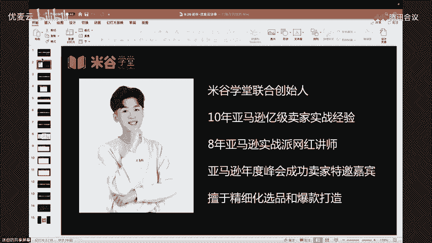
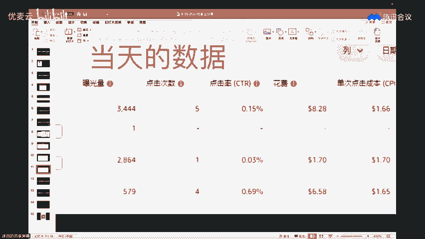

# 【优麦云第28期大咖直播】 迷谷：亚马逊CPC广告精密型打法实战解析 - P1 - 优麦云 - BV165xneLExi

啊，看到屏幕。あ看な。hello，欢迎大家来到优麦云的直播间啊。呃已经进入直播间的小伙伴啊，咱们第一件事先检查一下声音和画面是否是清晰的啊。😊，欢迎已经进入优麦云直播间的小伙伴们啊。

今天的话就是我们在优麦云的直播间会给大家讲的话题是关于CPC广告的一些实战的一些策略和技巧啊。已经进入直播间的小伙伴啊，咱们第一件事，先检查一下声音和画面是否是清晰的啊。OK已经进入直播间的小伙伴啊。

咱们第一件事先检查一下声音和画面是否是清晰的啊。已经进入直播间的小伙伴，咱们可以扣一签到啊，咱们可以扣一签到。声音和画面都是可以的对吧？OK好的，已经进入直播间的小伙伴啊。

咱们第一件事儿就是先扣个一签个到啊，扣个一签个到。因为我们今天的直播笔记的话，会作为直播福利送给大家的啊，会作为直播笔，就是作为直播的一个福利送给各位。好，已经进入直播间的小伙伴啊，咱们第一件事儿先。

😊，检查一下声音盒。画面是否是清晰啊？欢迎大家来到优麦云的直播间。今天我们的主题的话是关于广告的打法，就是偏一些实战的一个技巧的一个点啊，就是大家可以拿来急用的啊，已经进入直播间的小伙伴啊。

我们基本上直播会在一分钟之后开始啊。然后大家如果说有空可以在右下角点点赞啊，可以在右下角点点赞，右下角点点赞啊。然后已经进入直播间的小伙伴啊，我们先看看声音和画面是否是签清晰的。咱们可以扣一签到啊。

因为今天直播主题的话是关于广告板块的啊，关就是关于广告板块的啊，啊，大家进来一定要签到啊，签过到到的小伙伴呢，我们可以给他送今天的直播笔记啊。O。好，欢迎柳，欢迎YY啊。欢迎已经进入直播间的小伙伴啊。

呃，大家注意一下，就是我们今天的直播主题的话是关于CPC广告的一些实战策略的一个解析啊。嗯，大家来到直播间先看看声音和画面是否是清晰的啊。如果说声音和画面都清晰的小伙伴，咱们可以扣1签0到啊。

咱们可以扣1签0到。对，因为米国老师在今天的直播过程当中呢，会带着大家去做笔记的，会带着大家去做笔记的啊。然后如果说你到时候签过到的小伙伴啊，我们到时候是可以把笔记送给各位的啊。O。😊。

好呃，再跟大家说一下啊。今天迷国老师直播的主题的话是关于亚马逊CPC广告的一些打法实战策略。OK好，所以已经进入直播间的小伙伴啊，我们的直播马上在30秒钟之后就要开始了啊。

我们的直播马上在30秒钟之后就要开始了。所以你进来的第一件事情呢，咱们可以先检查一下声音和画面是否是清晰的啊，给检查一下声音和画面是否是清晰的。好，已经进入直播间的小伙伴啊。

今天的直播主题的话是关于亚马逊CPC广告的精密型打法实战的一些策略和技巧点啊，可以确保大家到时候听完课之后能拿来急用的啊。OK好，所以第一件事情的话，你先一定要确保你今天的声音和画面都是清晰的啊。

OK好，那我们直播的话就正式开始了啊，就正式开始了。其他废话咱们就不多说了啊。已经进入直播间的小伙伴啊，咱们扣1签0到啊，咱们扣1签到啊，扣1签0到。好嗯，简单的自我介绍一下嗯，大家好，我叫咪咕啊。

今天很开心能够来到优麦云的直播间啊，今年是我做亚马逊的第十年也是我分享的第八年啊。今天在优麦云的直播间呢，我们会给大家介绍关于广告方面的一些内容和技巧点啊，希望能够帮到大家啊。OK好，欢迎保卫萝卜啊。

已经进入直播间的小伙伴，咱们扣1签到啊。OK。😊。

好，然后第一个的话就是我们先聊聊广告的预算啊，广告的预算该怎么给。因为现在的话其实呃去推一款链接也好，还是维护老链接也好，其实作为操盘手，对吧？像你做美国站，你每天下午3点下令时之后，你其实对于你而言。

你肯定会要去思考，我今天广告这个预算要不要动，对吧？或者是你最近刚好推新品，你可能会觉得哎我这个预算，我要给多少会更合适啊，那首先的话对于我们而言，其实我我建议各位啊，我建议各位就是刚开始的时候。

你的初始的。就是你初始的那个呃。广告点击就是预算不要给多。像我们一般的话啊就是一个广告活动，基本上我们先会给。5到10次点击的预算。对，一般我们会一个广告活动，先给5到10次点击的预算啊，这个是从。

如果说你开始开一个广告活动的时候，给到初始点击的时候，先不要给多。对，因为你们会后面慢慢的去加预算的对，我们的底层逻辑就是你先把流量调精准之后再去放大流量。OK好，那这里面的话就是在预算这个模块啊。

因为我们今天会告诉大家预算该怎么调，出价该怎么调啊。呃，那我们第一个话题的话是先关于这个预算啊。那我刚才说了，就是你的初始预算呢，你不要给太多，你先给5到10次点击就一个广告活动。

然后还有一个的话就是如果你的品类。如果说你的品类是比较卷的。建议分十调预算。建议分十条预算策略啊，一般来说我个人是怎么去判断一个品类是相对比较卷呢？呃，一个的话就是我会根据广告的单次扣费。除以平均售价。

比如说我今天如果我卖一个。嗯，水杯对吧？那我的广告单次扣费假设是两美金一次，然后我水杯我平均售价是20美金，对吧？那这里就是10%。其实在我们目前定一个品类卷不卷的情况之下啊。

他如果说广告单次扣费除以售价占比超过10%的时候，其实这样的品类就是属于比较卷的。属于卷的品卷的品类啊。那在这样的品类下面呢，如果说。你的预算不分时条，你很容易被对手给他点爆的。

你你很容易被队长点爆的啊。像我们的这个分时条预算策略是怎么样呢？就是我把钱花在黄金时间段。对，那什么是黄金时间段呢？

举例啊，像在美国的话，如果像现在。下令时一般情况下啊，中国。下午3点到晚上10点钟的时候。我们预算就会设置为一的。设置为一美金，然后晚上10点之后，就比如说我晚上10点之后啊，10点之后我可以。

可以正常给预算。这个是呃对于我们现阶段啊，这个是中国时间啊中国时间。我自己在实操过程当中会去操作的啊。那如果说真的遇到更卷的品类，对我刚刚还在跟我朋友聊。现在有一些家具品类啊，3C品类啊。

其实都很卷的都很卷的啊。像对于这种。特别特别卷的品类啊，甚至我们在中国时间下午3点到晚上12点的时候，我们都会把预算设置为一。然后晚上12点之后呢，我们才。敢正常的去。给预算，这个是在我们去。开一个。

广告的时候啊。或者是你现在你的老链接，你发现也拒绝，然后你的广告转化越来越差，对吧？那那我建议大家可以用一用这种分时调预算这个小技巧啊，这个小技巧。对，因为毕竟像在美国站点。

你中国下午3点到晚上10点的过程当中。老外是在睡觉的，对不对？老老外还没有醒来，那这个时候呢。点你最多的肯定是同行嘛，肯定是同行嘛，对不对？那你你把钱烧给同行烧完了，那真正消费者起来买的时候。

你又没有点击了，你又没有预算去出现在真正的消费者面前了，那不可那不得转化率一直起不来嘛啊，所以这里面的话，分时调预算，我们是通过大量的案例去进行验证的。尤其是我刚才给大家对于卷的品类的定义的时候啊。

如果说你的品类是满足我刚才说的特点的。甚至像我们自己的话，在定义过程当中要求会更严格。比如说超过5%的时候，其实也是相对来说开始卷了啊，开始卷了。所以在预算这边呢，米果老师已经给到大家第二个建议了啊。

分时去调，刚给到大家的第一个建议就是刚开始的时候，你不用给多。然后如果说你开始。推起来了之后呢，你就进行分时调预算。OK那很多人会问我，那我什么时候我可以去加预算呢，对不对？我什么时候可以去加预算呢啊。

那这里面的话，像我自己的话，我是会根据转化表现的。

就是我会根据转换。给他弄下来啊。根据广告活动的转化表现。去小步慢走加预算。那这里面的话啊，我等会会跟你们说过，其实会有两类卖家啊，比如说。

像我现在我以这个广告活动为例啊，你们可以看一下，他点10次出两单，转化率20%。那这样的转化率肯定已经算很好了啊，算不算算很不错了。那好，那如果说我是小步慢走加预算的策略，我该怎么去操实操呢啊。

如果我今天我是这个广告活动的操盘手啊。那我们会根据当天的广告花费。

OK比如说我会根据当天的广告花费。像他是花了大概12美金，对不对？那我这个小步慢走加预算的策略呢，就是我会根据当天的广告花费啊，当天的广告花费，然后我乘以20%，就是就是按照20%的比例。那我就会加2。

4美金，就是在这个广告活动当中啊，在这个广告活动当中，我大概会加2。4美金啊，这个就是我们所谓的小步慢走加预算策略，就是把钱花当然上啊。当然也有一些卖家。

他其实是属于呃不想抠的这么细，对吧？那他可能刚开始预算就给的比较足，就可能一上来他就预预算拉满啊。所以这里面的话。我刚好也互动一下啊，就你们觉得现阶段的亚马逊预算抠一点。还是说如果说假设你发现它转化好。

你预算拉满。选一的扣一啊，选二的扣2，就是你们自己做亚马逊的一个实操心得吧啊，你觉得现阶段是比较适合扣一点。就像我刚才说的，小步慢一走，还是说预算拉满，大家可以。

可以那个啊可以就是说一下自己的一个想法啊，自己的一个想法啊。有扣2的有扣一的。就是你你你们觉得预算抠一点，还是预算直接拉满，预算直接拉满。2。🤢，有人说2ok。12考一大要考考的。martin说。

熟悉的类目可以以不熟悉的扣2啊，分类目。预算充足就拉满。预算高不代表转化高啊。刘星说预算高。对刘星，我看你扣了一啊，我看你扣了一。好，反正大家都可以说啊都可以说。因为。对于我们而言，小步慢走也好。

预算拉满也好啊，拉满能维持出单，能花出去就加啊。所以这里面的话其实我想要告诉各位的个点啊，就呃，我们自己实操下来是这样子的。就是如果说这个品类推新品的时候，它是比较卷的。那我们是会预算扣一点点。

先把转化调出来。但是呢转化如果说没问题的情况之下啊，我们可以测试一下预算拉满。比如说他平时花12美金的，对不对？那我可以3040，就是类似于这种拉满啊，比如50这样子，就是先让他花出去。

就如果说他稳定了之后啊，还有ganmartin，我觉得呃他的建也挺好的，熟悉的品啊，熟悉的类目可以一不熟悉的可以扣2。就是。

这里面的话啊，那我个人是呃在不熟悉的品类当中，我也是要它转化的稳定了之后，我才敢拉满的啊。所以这里面的话就是大家可以不用去纠结，就是去测试就好了。而且的话有时候你们做高客单价品类的时候。

尤其是你这个链接想要去冲量的时候啊，预算还是要拉满一点点，它冲上去的可能性会更高一些。冲上去的可能会更高一些啊。所以它没有谁对谁错，大家可以去测试，就是我刚才的一个建议，如果你现在特别特别卷。

你的转化一直很难调出来的，那你就预算扣一点点，不要让他点太多次，先把你转化调出来，对吧？但是如果说你现在你这个类目。你也很熟的，然后转化也调出来了，你想要去冲量的啊，那你就把它预算拉满。

因为呃有可能有时候你拉满到50美金，它也烧不到50美金，它可能只烧到30美金啊。但一定程度上面呢，它可以把你的单量维持的相对稳定啊，维持的相对稳定。所以这个是。关于预算这边啊，关于预算这边的话。

我们给到大家的呃一个建议吧，就是。从刚开始的预算，不要给太多分时调预算到后续的加预算的一个策略啊，那这里面又会出现一个问题。又会出现一个问题，因为我刚才我的底层的点就是把钱花在刀刃上嘛。

把钱花在所谓的黄金时间段，对不对？那这里面就会被人抛出一个问题，说什么呢？老师，那我是分时调预算好还是分时调出价好？

觉得分十条预算的扣1。分十条出价的扣2。就实际实操的过程当中啊，我们再给大家互动一个问题，大家觉得分时条预算的扣一，分时条出价的扣2。就是站在我们把钱花在刀刃上的这样的底层的一个策略的一个角度啊。

底层的一个角度。大家觉得分时调预算更好，还是分时调出价更好？因为你的目的你的目的都是希望哦，我把钱烧在该烧的时间段嘛。该烧的时间段嘛啊。嗯，VR忘了说不分时啊，呃是我我们自己平时是这样子的。

如果这个品类它转化一直很难调出来很卷，然后广化占比比较高，那我肯定是一定会分时的那如果说。他也没这么倔，对吧？反正对手也不是特别强，那我也是不分十的，因为累对吧？你分十你还挺累的，你还挺累的啊。

分时调预算和分时调出价可以一起啊。嗯，这里面我跟大家说一下，如果说你是属于那种比较呃保守的卖家，不太喜欢冒险的那我建议分时调预算。对，如果说唉你觉得也没啥问题，你的链接比较少。

然后你想要多省一点广告费的那我觉得一和二一起都OK啊。但这里面呃我个人的建议啊，我个人的建议就是。当你的自然单占比。如果说超过50%的时候。这个是我个人的建议啊，就是当你的链接自然单的占比啊。

假设超过50%的时候啊，呃我个人是觉得。先不用分十条预算。先不用分时去调预算啊，就是。如果你前期不稳定，然后你的品类呢。又比较卷的过程当中。分时条预算确实它有利于把我们的整个广告转化率做高的。

广告转化率做高的啊OK。好，那如果说哎你现在链接比较稳定了，它像飞轮一样已经滚起来了啊，那这个时候去分时调预算呢，反而有时候你的单量会不太稳定。O所以这也是我们刚才在预算拉满还是预算扣研的时候。

我也说过，你链接比较稳定的时候，呃，然后你这个品类又比较熟悉的时候啊，你是可以去进行那个。预算拉满的就不用去分时的啊，不用去分时的。所以关于预算这边呢，大家一定要呃清楚相关的一些建议啊。

比如说你刚开始你可以先预算，不用给多，你先把转化给它调出来，OK然后第二个的话就是你可以采取分时调预算的策略。但是呢如果你的链接比较稳定了之后呢，你可以不用去分时调预算，对吧？那加预算过程当中呢。

你可以走小步慢走的，也可以走预算拉满的啊，尤其呃尤其是如果说在中后期的过程当中，你的链接想要去冲量，想要去稳排位的时候啊，那这个时候的话就是你可以不用去分时调预算，也可以把预算力度加大。

就是加加大一点点啊，ok怎么看广告单和赞单嗯，你可以去手动统计啊，像我们平时都是手动统计的。比如说你一天出了50单，你的广告出单是20，对吧？那就20除以50，那你广告单就是40%嘛啊，广告单就40%。

嗯，爱吃饼的爱吃饼干的小沙，就是你可以自己手动去统计的啊，手动去统计每一条链接的。OK好，这个是关于我们的预算这个话题啊，预算这个话题。嗯，像最近9月份啊，我不知道大家能不能感受到流量是很不稳定的。

是比较差的啊。那这个时候如果说你的广告比较差的时候呢，我建议大家可以分时调预算测一测的对，就是尤其是转化比较差的时候，整个的一个呃就是你比你你的同行可能现在也差不多的情况之下，你看看分时调预算。

它能不能。转化高云的同行，然后可能你来的自然流就会更多一些啊，来的自然流就会更多一些。好，那这个是关于预算啊，给到各位的一个建议。那接下来的话我们就来聊一聊，就第二个话题。就是我们平时的出价。

该怎么调整啊？首先的话啊，这里面的话，我们平时在系统的话是会有。建议进价的。所以很多人会问我，老师，我要不要跟着建议竞价去进行调。那我自己从实操的维度啊，我不太会跟着建议竞价去调的。

因为可能刚开始的时候建议竞价它是2一下子变1。8，一下子变3。5。那我每天都要跟着建议去进价调嘛，那我就会很累，对吧？而且我们自己实操下来，就是你随机的就也也不要随机的跟着建议竞价去调。

就是你跟着建议价去调，你会被它。被他误导的被他误导的啊。所以像我们平时实操的时候啊，像我们平时操的时候，可能我刚开始我为了把整个广告活动激活的快一点点啊。那我会出价，嗯接近于建议进价。对。

就是因为推新品嘛，我得快速打开曝光，快速的给他嗯点击对，快速的给他点击这样子啊。O好，那我开了之后，那我在中后期的过程当中呢，我该怎么去调这个出价的啊。那这里面明国老师给到大家一个比较常用的一个方法啊。

比较常用的一个方法。这也是我们自己现在会带着一些学员去推链去啊。然后我们每次会拉一个微信群。然后我们会告诉他哦，就是你这个广告活动，你要怎么调那个广告活动会比较调，这个是我们实打实平时在实操的对。

就是会针对每一个广告活动。我们会有一些实操的一些建议啊，会给大家些学员的实操建议啊。OK刚刚有人问嗯，会有回放吗？嗯，会会在优麦云的历史的回放过程当中的啊。O好，然后这里面的话。

今天的直播笔记也会送给各位的啊，想要直播笔记的小伙伴扣1啊。想要直播笔记的小伙伴扣1。对，因为我们今天的话题，我们全部就是有做笔记的。然后这个是免费送给各位的啊，想要直播笔记的小伙伴扣1啊。

想要直播笔记的小伙伴扣1，这个是免费送给大家的福利啊，免费送给大家的福利啊，免费送给大家的福利啊，所以大家如果说。😊，呃，有需要的扣1啊，没有扣扣过的是送不了的。这里面再跟大家说一下啊。

如果说你没扣过一，那那送不了笔记的啊，所以你一定要扣一，我们才能够把笔记送给各位啊，才能把笔记送给各位啊。对，就是你一定要留过你的足迹。对你扣过一了之后，我们才能够把笔记送给各位啊。

我们才能把笔记送给各位。所以一定要扣过一之后啊，我们才能把笔记送给各位的啊。这个笔记是免费给到大家去做复盘的，到时候大家可以结合回放啊。OK你们可以左上角关注一下优麦云。因为关注了之后。

到时候可以去看回放的啊，到时候可以去看回放的。你扣的最多OK好，然后我告诉一下大家领取的方式啊，大家可以加我的同事，咪咕089，直接微信搜咪咕089就可以了啊。下播了之后，他会根据你添加的顺序。

然后把笔记发给大家的啊，呃是不用费用的，我们是免费送给大家的啊，是免费送给大家的啊，免费送给大家的。OK然后大家就是微信搜它就好了啊，他会根据你添加的一个顺序，然后把今天的笔记发给各位啊。

会根据大家添加顺序啊。直播过程当中他没办法发给你啊，就只能说下播了之后啊，下播了之后。咪咕089啊，你要打大家是要的话全部全部给他那个的米咕089，你就按照我这这里面一模一样去去去去输就好了啊。

一模一样去输入就可以了。就微信加他就可以。到时候下播的时候，他会送给你的啊，会把直播笔记免费送给各位的。所以大家就等下播就好了啊。OK好，然后那我们继续了啊，像我们平时实操过程当中。

我们的出价是怎么调呢啊？我们有一个方法叫做根据广告位置调出价。就根据广告位调出价啊，那我们先给大家介绍一下啊，就是给大家把把一些基础的知识点再给大家复习一遍啊。首先，亚马逊目前是有三大广告位嘛啊。

搜索结果顶部首页，还有我们的商品页面以及我们的搜索结果其位置啊，搜索结果其位置。

搜索结果首页。然后还有商景页面。对吧还有搜索结果及位置。所有的结果其位置啊。好，那这三大位置呢？对于我们而言，我们也不知道我刚开始会被分配哪个位置啊，那这三个位置有的一个特点是什么啊？首先从曝光和。

点击率来看啊，一般来说商品页面是曝光最多的。但是呢他的点击率是最低的。然后这个是曝光区中。点击率居中。我先把这三大广告位的特点给你们普及一下啊。对，就是搜索结果。其位置呢是曝光居中点击率居中啊。

然后一般搜索结果页面呢，这个黄金位置啊，虽然说它是黄金位置，但是每天想要上去的人太多了。所以有时候你上去了之后，你很快被点完之后就轮到别人嘛，所以相对来说它的曝光是最少的。然后点击率是最高的。

点击率是最高的啊点击率是最高的那这个时候的话啊，经常就会有人问我，老师，我是不是推新品的时候，我要去选那种点击率最高的搜索结果首页，对吧？我是不是使劲要把我的。广告位往搜索结果首页去靠啊。

OK然后又有人会问我，当时我那我刚开始的时候，我是不是先把曝光给它凑出来，先把曝光给它凑出来。那我是不是先待在这个商品页面啊，所以经然被问到这些问题的时候，我是没办法给标准答案的，为什么呢？

因为其实对于我们而言啊，呃我们的适合的位置，有时候这个广告活动可能就适合商品页面。比如有一些广告活动就适合搜索结果其位置，对吧？你不好说，你没办法给具体的一个标准。答案说哪个位置会更好。

所以这个时候我们的实操方法论是什么呢？实操方法论啊。首先我们的第一步啊我们第一步我们会先根据近7天。近7天或者是近14天。甚至有一些做高客单价的产品啊。近30天。我问一下在座各位啊。

今天直播间的小伙伴啊，你们产品的平均客单价是多少美金？我互动一波啊互动一波。就是大家今天来听课的小伙伴啊，你们的平均客单价是多少，然后给你们具体的建议啊，就是今天来听课的小伙伴啊。

你们的你们现在在做的呃主打的品类，平均客单是多少？grace是20，ic是20。屋形是14。9，流星是15，casy是70到80，另是15，sny是140小熊猫29。9块，两是26。99。

OK501320到50，乘钢是29。9块。40601左右。3040130啊，然后大家可以就是反正大家可以输入一下，就是你们自己的那个现在的品类线啊做的平均客单大概是多少？做的平均客单大概是多少啊？O好。

那这里面的话我先跟大家说一下啊，因为刚刚大家都有刷自己的产品的平均客单啊。如果说在座各位呢呃。是做那种比较偏低中的，比如25以下的，25到50左右啊，比较偏低中的。其实呢你只要去参考近7天。

近14天就可以了。但是如果说在座各位是做高客单价的啊，就100以上的这种。高客单价的那我建议大家去判断哪个广告位更适合你的时候，一定要去看近30天的，就是把它的时间跨度啊。给他范围要多一点。

因为高客单价的它本身的特点就是什么呢？它的转化率呢没有像。低中客单价的那么高，所以呢我们要数据充足一点，会更好判断一点啊。所以像我们自己现在做一些高客单产品的时候呢，我们就会去把数据给它时间拉长。

但是我现在如果说做低客单价的产品的时候，我基本上就参考近7天和近14天的，就近接近14天的啊，所以这里面的话，为什么刚才要跟他互动啊。因为你你我们每个人做的这个品类是不太一样的嘛。

我们每个人做的就是那个平均客单是不太一样的嘛啊，OK好，那对于我们而言，我们去看近7天也好，近14天也好，还近30天也好啊，我们要看啥呢？

我们要去看的就是近7天或者近14天或者近30天的哪个广告位更好啊？那比如说像我这个案例一，你们来看一下啊，它的搜索结果顶部首页点了40次。出了5单。然后商品页面呢。点了22次，出了两单啊。

然后其位置呢大家可以看一下啊，点了13次，出了两单。好，那我们去判断的点是什么呢？啊？判断点我们优先看订单，尤于新品啊，单量很重要的，要先有销量。OK那订单的话哪个更好呢？很明显啊，这个案例一。案例啊。

就从订单这个维度，订单和转化率啊。订单和转化率。那很明显，案例一订单和。转化率啊订单和转化率我们可以看一下啊，哪个更好。大家评论区啊看看看看大家能不能。发现正确的答案哪个更好？

就是就是如果说从单链和转化来看啊，单链和转化来看，搜索结果顶部和商品页面和搜索结果其位置啊，哪个更好？大家看一下啊，哪个更好。最后一个其位置吗？大家看一下思考一下，因为这个是关系到你们的实操的。

关系到你们实操的啊，就是你们觉得哪个更好。有人说首页啊，有人说其位置，有人说其位置。首页。首页对吧？首页更好。商品页面首先我们肯定排除一下啊，商品页面肯定是在目前这个广告活动里面，它是表现最差的。对。

OK那首页和其位置呢。是属于比较纠结的对吧？是属于比较纠结的那呃那这个时候呢，你也可以把近14天的数据切出来啊，也可以把近30天数据切出来。但是如果说我现在我推新的话，我肯定是会。搜索结果顶部。

因为我最需要单量嘛。OK那如果说你是老链接的话，我个人觉得所有结果顶部和其位置其实都都还不错的，都还不错的啊。OK。好，因为如果说我新品我更需要量嘛，那我肯定搜有结果顶部啊。那如果说我这个案例。

我最好的位置搜有结果顶部啊，那接下来的话我可以去检查。就是你去检查啊，你可以去检查当天。或者是近2到3天。的点击。是否有点到最好的位置？就是你可以去检查一下当天啊，近2到3天的点击。

是否有点到最好的位置啊，因为我们第一步的话就是先判断嘛。第二步的话就是做检查嘛啊，先判断。然后然后第二步的话就是我们去做检查啊，我们去。看一下当天有没有点到最好的位置啊，那你就把广告位数据给它切出来。

比如说你这个时间你就可以选择昨天，对吧？因为你看的时候，他一天已经过去了嘛，一天的时间已经结束了嘛啊，或者是你这个时间你可以去切2到3天。对你如果说你昨天的数据有滞后性。因为有时候。

他不一定昨天的数据就是。更新的及时嘛，像今年亚马逊。系统尽样出bug，对不对？所以呢我就会去看近2到3天的，近2到3天的。然后我看一下近2到3天的，比如说像这个广告活动，你看他昨天也好，近2到3天也好。

它的点击其实都有点到。搜索结果顶部的也有点到其位置的。okK且它的转化率不错，那这种广告活动呢，我们就不动。第三步的话就是根据实际情况去调出价。比如说。它分为几种情况，比如说情况一。对吧有点到。

最好的位置的。那就不动。要千万忍住啊。就千万忍住。因为其实我们会发现很多人去调广告啊，它他这个位置明明已经点到了最后位置了，最好的位置了，对不对？他就是手闲不住，他就去动那个出价啊。好了。

广告权重被他动没了。对，真的就是这种情况在新手挺普遍的，因为他不懂这个动出价的逻辑嘛，对吧？他就凭感觉动就凭感觉动啊，然后动着动着嘛，权重就被动叉了对，但是我们有经验的卖家呢。

我们基本上出价呢是不太会去凭感觉去动的。我们会根据哦他当天的。或近2到3天的点击是否有点到最好的位置啊？茉莉，你你是刚来吗？啊？呃，我们最好的位置呢，其实就是我刚刚讲的，通过第一步去判断啊。

通过第一步去判断啊。如果说你是刚来的小伙伴啊。茉莉，如果说你是刚来的，你可以看回放啊，你到时候可以看回放啊，我们的最好的位置呢，刚刚我们在第一步的时候已经讲过了啊，已经讲过了。

就是我们要学会根据数据去进行判断啊，根据数据去判断。然后如果说你是后面刚进来的小伙伴啊，你等会儿看回放的时候，你可以结合我们的笔记啊，我们的笔记是会发给就是会发给你的，会免费发给你去做复盘的啊。

大家记得加我的同事咪咕089啊。大家记得加我的同事，米咕089啊，咪咕089咪咕089，大家可以加一下啊，大家可以加一下。咪咕089啊咪咕089就是你微信搜，然后下播了之后呢，他会把笔记发给各位啊。

他会把笔记发给各位。然后你就可以一边听优卖云这边的回放啊，一边看着我们的笔记，这样子就方便你去理解啊，方便你去理解啊，OK刚刚我们说书架怎么调，对吧？你第一步你先判断第二步做检查。

第三步根据实际情况去调根实际情况去调啊。那如果说有点到最好的位置呢，咱们就忍住。对，尤其如果说你是新品呃，新新卖家，刚才我说了，千万得忍住啊，千万得忍住。好，那我们再来看一下案例二啊。

案例二一样的几个步骤啊，一一样的几个步骤就是先判断一下哪个位置更好啊。那我们来看一下案例2啊，案例二的话就是。搜索结果顶部首页呢点了一次对吧？没出单，然后商品页面呢点了62次，出了9单。

然后其位置呢是点了12次出两单啊。那这个案例单我问一下大家啊，哪个位置更好？这个案例二，哪个位置更好？我们来跟大家互动一下啊，案例二哪个位置更好？有时候其位置的啊，有说商品页面的。案例二哪个位置更好啊？

案例二哪个位置更好？这个是现在在跟大家互动啊，在跟大家互动。好，那这里面的话我们先从订单来判断肯定商品页面啊。如果说我现在是新品，我肯定会玩202啊，就是往就是商品页面肯定是我的一个首选啊。

所以商品页面其实它出单现间是比较多的那我来看一下啊。我当天的数据，我其位置我点了15次，我才出一我出一单啊，我最好的位置商品页面才点了两次啊。那这种情况呢就是。属于我们刚才说的哎，没声音了，有声音吗？

声音没了吗？有声音吗？大家看一下有没有声音啊，正常的对吧？okK应该是那位同学，你可以退出之后，然后重新进来啊，退出之后重新进来。OK那有声音就可以啊。像这个案例呢，其实你就可以动一动。因为你想想啊。

它最其实他近期天出单最猛的。是我们的商品页面啊，但是它当天的点击呢，它更多的是在其位置，商品页面是比较少的。所以这个广告活动呢就是属于没点到最好的位置的。没有点到最好的位置的啊。OK好，那这种情况呢。

我们会分为有没有出单。比如说他现在他出单了，对吧？那你也可以等他一天，万一他明天又点到最好的位置了呢，对不对？可以等他一天，因为它毕竟也出单了嘛，对不对？

那如果说你现在是推新品或者是你等不牢的那这个时候你也可以去动的。你也可以去动它的啊，因为本身它的转化率已经变低了，已经变低了啊。如果说你现在能等得住的对吧？你你觉得你的一些产品，尤其是一些高客单产品啊。

你等得住的对不？然后那我觉得你可以先等个一天再去调，对吧？那如果说你现在你不要卷的，你等不了的那我们这个时候呢，我们就要通过那这个时候出价的作用来了啊，我们就通过出价。把点击往。最好的位置拉。

OK这个时候我们的出价的这个这个工工具啊就可以运用起来了。出价这个工具就可以运用起来了。因为你没有点到最好的位置嘛，对吧？你没有点到最好的位置嘛，像这个链接。像这个链接。

如果说我现在我要狠狠的把点击往商品页面去拉啊，那这个时候我该操作什么呢？我的具体的行动指令就是降低出价。对，降低出价。然后我也可以在商品页面，我可以加个5%10%的一个比例啊。那很多人会问我。

为什么是降低出价呢？对不对？那这里面我想告诉各位啊，就是按照我们的经验啊。其实三大广告位呢就是我们去我们我们出价就是我们在亚马逊上面租广告位嘛，搜索结果顶部的广告位呢一般是最贵的商品页面呢是最便宜的。

搜索结果，其位置呢是居中的租金居中啊。那现在如果说我的点击基本上集中在其位置的时候。但是呢我又想要去租金更便宜的商品页面。那这个时候呢，我就通过出价的调整去发出我的指令，我要少交租金了啊。

那少交租金按照我们自己实操经验的话，就是我会降出价。比如说我会降0。05到0。1，我也不会幅度特别大的。因为怕幅度特别大的话，它一下子没了曝光啊，它一下子没了曝光的话，那也不太好整啊，不太好整。

所以呢对于这个案例，如果说。我要把点击从其位置往商品页面去拉，对不对？那我就少交租金，那我少交租金，我该怎么样去向系统发出讯号点呢？那就是调低我的出价，调低我的出价啊，所以这个是我的一个案例啊。

第就是第二个案例啊。那接下来我们再来看一下第三个案例。第三个案例啊第三个案例也是第一步第二步啊，因为第一步、第二步第三步它是循环的。对它是循环的啊。首先，搜索结果顶部。那曝光是86次啊。

然后商品页面呢它是曝光5629，点了一次没出单。然后其位置。其位置的话就是。点了59次出了八单啊，出了8单。那我问一下各位啊，像这个广这个案例，它最好的位置是在哪里？这个最好的位置是在哪里？

这个最好的位置是在哪里？这个案例案例三，最好的位置是哪里？案例三最好的位置啊案例三最好，这这个其实就比较好判断了，对吧？这个就比较好判断了。因为他59次呃，就是59次点击出了8单，对不对？出了8单。

很明显，其位置的效果是更好的，对不对？很明显，其位置的效果会更好的。OK好，那我们再来判断啊，因为你因为你的第二步就是检查一下当天近2到3天的点击是否有点到最好的位置嘛，对不对？好。

那我们再看一下当题啊。哎，你会发现是有出现其位置，但是没有出单，对不对？那其实这里面有出单一个很大的原因，就是点击太少了。所以这个广告活动呢得预算给它加到。至少。八次点击。

七次点击吧7次点击它现在只有4次。他现在只有4次啊，这种情况的话，我们是会加预算。然后如果是我我也会给他提高一点点出价。比如说提高0。02的出价，把商品页面的点击再往其位置去拉一拉。对。

如果是在这个广告活动当中呢，我肯定一我会加预算的。然后第二个的话，我会出价提高一点点。然后给亚马逊稍微多交一点点租金，然后我把我的点击往其位置。如果预算够的话，那就是加出价。

把商品页面的点击都往其位置去拉。然后我也可以加其位置的比例。对，因为你只要如果你预算够，那你就凑点击嘛，凑点击最方便就加其位置的比例和加出价嘛，对吧？那我可以直接0。1。对不对？然后广告位的比例。

其位置我加个10%，20%，我快速的把点击往其位置去拉，把点击凑到8次嘛，8次9次这样子。OK所以这个的话就是我们从出价的一个维度啊，出价的维度，我们教大家一的一些调整的一个方法和思路啊。

当然我个人觉得出价它肯定不是只是单纯的。

只是这一种方法去调出价样的一个思路啊。因为今天直播我们我们时间有限，然后我把最重要最核心的就是知识点先给大家去做一个讲解啊，先给大家做一个讲解。

好，然后呃第三个的话就是。第三个话题的话就是想要跟大家分享一下啊，就是我们现在的精密型的一个打法。下面SPSB和SD的一个组合拳是怎么样的啊？像我今天呃在杭州那个数字贸易会的时候。

就那个主持人就问我一个问题。他说现在新进来的卖家在运营维度应该注意什么点啊，我个人会觉得就是像我自己今年是第十年嘛啊，我觉得其实亚马逊现在对于运营的要求就是。

这个运营的节奏感一定要强，就是他得知道什么阶段该做什么事情，什么阶段不该做什么事情。OK如果说运营他的认知能到这里的话，其实这个运营的运营能力。不会太差的对，OK好，什么叫什么阶段做什么事情呢？

这个就是你要根据链接目前的一个。一个呃他的一个那个。链接的一个情况啊，像我们一般来说的话就是。什么叫做新品？什么叫老品啊？我自己的一个标准。

就是说自然单如果说能激活到50%的那这种就是相对来说比较稳定的老链接了啊。那如果说我现在自然单还不是特别稳定的那我就会当新品去推，先把它的自然单给它尽量的。透到50%以上啊。OK好，那在新品期。

的过程当中啊。刚刚其实在评论区的话，我们也看到会被问的。哎，老师手动关键头放盒。自动广告可以一起打嘛啊，那在我们自己现阶段，我们是肯定是一起打的，肯定是一起打的啊。甚至我们在新品期的时候。

我们还会引入SBV的视频投放。对，那如果说遇到比较卷的品类呢，我们还会直接引入手动做关联，就在新品期的过程当中啊，就它的一个组合权的一个搭配，我的目的呢就是快速出单。因为这里面我告诉各位啊。

对于新品而言，你一定要抓两个数据。对新品而言啊，就是你的订单是不是在稳定。增长的。什么叫稳定增产呢？比如说01。02。せ？4。🤢，5。这种就叫稳定症，它中间可以有断单啊，可以有断单，然后是可以稳定增长。

这个是很重要的。就是你的订单。然后第二个的话就是转化率。第二个的话就是转化率。所以呢你前期啊，尤其是我们白帽打法啊，广告转化率啊一定要。大于行业平均。行业平均的转化率啊。

这个的话是可以在那个我们后台的品牌指标当中可以看到行业的平均转化率的。像我们平时推新品，我们会很明显感觉到，比如说我的平均转化是8%，我广告转化率呢，我调到了10%的时候。

它那个自然流量亚马逊就会奖励我。20次15次。但是一旦我的转化率低于平均水平的话，你就会发现一直都是广告点击，你自然流量就很难进来，你的自然流量就很难进来啊。

行业平均转化率在我们后台的品牌指标那边是可以看的啊，左边导航栏品牌分析呃，就品牌指标那那里可以看得到我们每一个你做的细分赛道的平均转化率的啊，平均转转化率的对，所以对于新品而言。

我们一般给到大家的一个点就是说你可以不用点击买多。但是你一定要找到。

最适合你出单的广告类型。先把它的转化率给它凑出来。对，因为你只有你的广告转化率凑出来了之后呢，它的自然流才会导给你的。就是平台免费的流量才会导给你。那个关键词上首页的速度才会更快啊。

O所以我们一般来说的话，我们是会呃先找到让我能够快速出单的广告类型。有可能是手动关联投放，有可能是自动解密匹面，有可能是SBV视频的，有可能是手动做关联。对，O有可能都全部都出单了，那我就保留就好了。

对不对？OK好，但是当我的定就是我的链接，我的自然单经占比达到50%的时候，我想要把我的链接再往上走一走。就是我想要链接突破销量瓶颈的时候，那这个时候我建议大家一定要引入关联流量啊。

因为官流量其实在亚马逊平台，它也是占了比较大头的那官流量通常情况之下呢，我们可以手动商品主动去定位，也可以自动同类和关联，也可以开展示型推广的相内容相关性投放啊，引入官流量去搭配搜索流量啊，OK好。

成熟期的链接。比如说你现在链接在前20前10名，对不对？那像今年的话，老链接稳排名，基本上我们是要搭配de的。OK那你搭配第过程当中呢，如果说你的类目是比较垂直的那我个人建议你可以去搭配。

比如说商品级的投放啊，平安行行焦点受众投放STV其实目前验证下来拿到结果的卖家并不多。所以SD的受众投放啊，尤其是在座各位，如果你有做那种欧洲站点啊，法国、西班牙、意大利、德国、英国啊。

其实今年的展示型广告效果特别好。就是在这种欧洲站点比较偏小的站点啊，因为它可以快速的把你的链接去补充流量啊，去补充流量啊，所以这里面的话就是。我刚才说的现在的运营，你不是只是纯粹的，你只要。会开就行。

你得知道什么时候该该开哪几个怎么做好组合群，对吧？以及前期最需要关注的点是什么？这个是你对于运营自我内功修炼的一个要求啊，对吧？包括你的链接现在。你成熟了之后，你就要搭配d们啊。今天那个分享的时候。

我我说到一个特别有意思的一个点啊，就是我说现在很多新卖家进入亚马逊平台，比如说他进入的品类，它这个品。上去之后测款出单特别好，他就马上备大货过去，对吧？你可能他测款的时候日出20单，30单。

他他就被日销50单60单的货过去。一背过去。一冲突然你就会发现你被扔差评，或者你被对手搞了，或者你冲不上去，对手拿低价来卷你了，对吧？O这个也是我刚才说的优秀的运营，他知道什么时候该做什么事。

也也知道什么时候不该做什么事情，对吧？比如说你现在你的链接，你评价没破百，你就想要去冲前十，充2前20，是谁给你的勇气呢？现在尤其像美国这种站点，专业化的卖家这么多，对不对？你评价都没破百。

你还敢去冲前20冲前十，你的对手都盯盯牢你了，对吧？所以这就是我刚才说的什么阶段不该做什么事情。比如说你评价数量有限的情况之下，你不应该冲的太前面，你先定位中腰部的链，就中部链接。

先把中部链接的订单的钱先赚到一步一个脚印，对吧？积累完评价之后再往前去冲，再去搭配一些。有量进来啊，OK因为很多新卖家其实有时候他并不是推不起来，而是他不知道什么阶段该做什么事情。

什么阶段不该做什么事情。O大家把我这两句话听进去啊。对，就是给到大家的一个建议吧，给到大家建议吧。因为还是希望各位能在亚马逊上面赚到钱的啊，赚到钱的像现在其实很多品类。

卖家其实都很专业的卖家的很专业的对，O好，但然如果说你的品类是很蓝海的，大家都很low的那也无所谓的啊，那也无所谓的。所以这里面还是要看品类啊，还是要看品类的。O好。

所以这里面呃今天主要给大家分享的是我们三个话题啊。第一个的话就是你的预算该怎么给。第二个是你的出价该怎么给啊。然后第三个的话就是关于我们的不同阶段的一个广告的思路给到大家做了一下提醒啊。OK好。

然后这个是我的那个微信啊，然后大家如果说之前没有加过我的，可以加啊，加过的就不要再加了啊。大家后续有什么问题可以跟我交流啊，可以多跟我交流。

然后我们自己这边的话就是定期会有一些线上的课程和线下的课程啊。直播间江浙沪的小伙伴有没有扣个一呗，有没有江浙沪的小伙伴扣个一。江浙沪的小伙伴啊，有吗直播间笔记有的啊笔记有的。

如果说想要直播笔记的小伙伴啊，想要直播笔记的小伙伴可以加我的同事，咪咕089啊。保卫萝卜，明天来听课了，欢迎欢迎OK江浙沪的小伙伴啊，我们基本上每个月在杭州都有线下的课程的啊。大家如果说有需要的话。

也可以加我的同事啊。如果说有需要的话，也可以加我的同事。😊，🎼呃，爱吃饼干的小沙怎么分时调鱼？对，是手动调的啊。嗯给大家3到5分钟时间给大家答一下疑啊，给大家答一下疑。对大家反正需要线上课程或线下课程。

都可以加我同事了解啊，都可以加我同事了解啊，这个是我的微信啊，这个是我的微信啊，这个是我的微信。

这个是我的微信啊，大家可以先截屏啊。😊，嗯，对，我们有课程的，我们有线上的课程，线下的课程都有的啊，线上线下都有的好心情，你可以加我的同事了解一下啊。咪咕089。

怎么现在换地方直播了哦，没有，今天是在优麦云这边合作的直播啊，合作的直播。新品怎么找进对头流，啥意思啊？你的那个类目转化率在品牌，在品牌的左边品牌指标那里啊，林泽。电子消费品大家问问题问的具体一点啊。

大家问问题问的具体一点啊。ok。还有2分钟啊，我家要下播了。还有2分钟，我想A屏这个点赞大家很给力啊，大家马上破1万的点赞了，谁能帮我破个1万？谁能帮我破个一万的赞啊？😊，老师问一下外观专利有必要做吗？

本身已经有外观专利。如果说你是自己创新的产品啊，很有必要要做。对，就是很有必要啊，省得被别人抄啊，省得被别人抄。哇，这么快就一万了。O好，大家看看还有没有什么问题啊。如果没有问题的话。

我们今天到这边就要结束了啊，到这边就就就要结束了啊。呃，林泽是在广告界面啊，不是在主页，是在广告界面左边左边。德国战线在广告能打吗？还好。德国站主要是你你你你要把曝光和点击先刺激出来啊。

老师首页B的加百分比拉上去之后，关键词一定会在首页不一定的，你要转化率凑上去。有回放吗？有的，你关注优麦云就有的啊。苏us子ok然后你可以加我同事的微信，苏子他会把笔记发给你的啊。

如果说是刚刚进来的小伙伴啊，你可以看回放，然后可以加我同事的笔记啊。OK。

啊，然后这个是我的一个微信啊，大家如果说之前没有加过的，可以加加过的就不加了啊。

好。😊，金铺一般一个店多少个产品合适呢？我觉得看运营的状态吧，运营的经历吧，一一般金铺的运营搞个10到30条链接是没什么问题的。甚至有一些小站点，像有一个做加拿大进铺的链接的。

一个运营可以搞150多条链接。好，然后大家今天直播有收获的，可以在评论区扣个有收获啊，扣个有收获。OK今天直播有收获的小伙伴可以在评论区扣个有收获啊，那我们就结束这愉快的夜晚了啊。

OK有收获的小伙伴在评论区扣个有收获啊，在评论区扣个有收获。扣个有收获啊。ok那反正大家如果有收获，下次我们再来给大家去做分享啊，再给大家去做分享啊。O如果说你今天对米国老师的直播。

觉得还挺有收获的小伙伴，我们可以在评论区扣个有收获啊，扣个有收获。下一次我们再来给大家去做一些分享啊，再给大家做一些分享啊。O好，谢谢大家。谢谢大家的支持啊，谢谢大家的支持。

OK那我今天的直播的话就到这边了啊，我今天的直播就到这边了。拜拜拜拜。😔。

