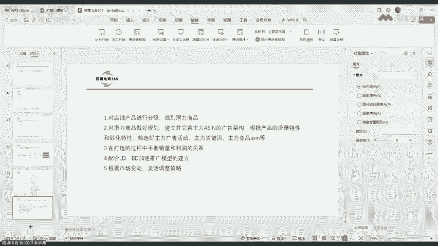
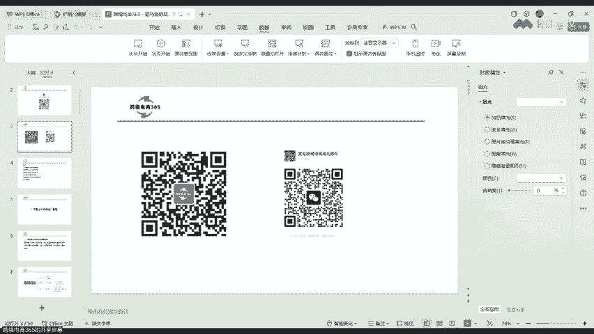

# 【优麦云第29期大咖直播】麦克：亚马逊标品、强季节性产品、老品新推运营策略 - P1 - 优麦云 - BV1hk2mYkEp4

题哈是亚马逊标品啊，强积节性产品和老品新推的一些运营策略啊。之前我们分享过非标品，今天我们大部分讲的是标品啊，当然也会穿插着讲一些非标品啊。其实标品和非标品之间是有很大的一些差异的。好。

那我们就正式开始啊。今天晚上有一个直播的大疑群啊，直播的大疑群啊。如果说你有兴趣的话，可以扫码啊，听到我们这个大疑群。然后呃也会分享一些资料啊，在这个交流群里面啊，平常有问题的话。

以后我们在优美园的专属直播啊，都会在这个群里面做通知的对，有需要的话可以扫码一下啊。可扫码进去啊。好，那我们下一步啊。好，呃，剩下的这两个啊是一个是我的公众号。第二个是我的微信啊，如果感兴趣的话啊。

可以关注一下公众号。公众号上会分享一些亚马逊的一些知识。第二个是我的个人的微信啊，如果说需要交流亚马逊的啊，可以加一下。然后上面这个是我们的直播交流群，可以截屏啊，可以截屏加一下啊。

可以截屏加一下这个交流群。以后我们的直播啊都会在这个群里面做分享啊啊包括一些资料。好，那我们现在就开始啊，优卖与卖家经理是什么关系啊？这两个我只能说这两个软件啊，这两个软件它的功能是不一样的。

然后卖家经灵各侧重于选品和运营这一块，然后优卖云的话是属于就是啊广告广告的一些数据统计啊，利润的一些分析啊，包括广告上的一些调整啊等等哈。它这两个软件是有有一些区别的。

但是这两个软件基本上都是我们必备的啊。如果说你想做的好，那这两个软件都是必备的软件啊。好，那我们现在就开始啊。今天我们的大纲啊，第一个就是我们的。啊，低客单价标品的一个推广策略啊。

低客单价现在竞争是非常大的，很多人做低客单价可能都是属于这种亏损的状态啊。那我们就分享几个案例啊，就是有失败的案例，也有成功的案例啊。第二点的话，我们分享一下啊，高客单价标品的推广策略啊，高客单价的。

对，然后多高算高呢，对不对？那有些人可能做个四五十美金的，六0美金的，100美金以上的对吧？还有更高的一些客单价的啊，然后这种产品的客单呃产品如何去做推广。那我们也跟大家分享一些经验啊。

第三点的话是强积体性的产品。呃，你比如现在很多人会做这种圣诞节的产品啊，或者是万圣节的产品啊，或者是说呃季节性季节属性会比较强的一些产品，如何去做推广？老品销量下降了，通道，一些找原因啊如何解决啊。

然后简单说一下思路啊，后面会讲啊，我们这里就有一个老品新推的一个思路啊，就这里第五点啊，你仔细听。需要从哪方面找原因，对不对？这个哈后面我再给你答疑哈，就是我们第五点有个叫老品新推。那你要看一下啊。

销量下降了，那有可能是市场在变换。那你从哪一方面能不能做一些优化？好，这是第五点啊。然后第四点的话，我们是讲这个利润型的广告如何去打造啊。对，然后还有还有一些别的一些分享啊，然后再加上一些答疑啊。

再加上答疑啊。啊，今天主要就是这些内容啊，那我们就一个一个来。如果你有问题的话，先打在公屏上啊，我们直播先把主要的内容讲完之后，就给大家详细的去解答。好，那我们分享第一个点啊，就是第一客单价标品如何啊。

它的一个推广策略啊。其实第一课单价标品它是有两种思路的啊，第一个就是做盈利性的广告。第二个是做小爆款的模式，做两种啊，我们也是要根据自己的一个预期。目的啊我们的预期的目标和投放的一个表现。

然后进一步去调整思路，找到适合自己的思路啊，有低客单价的标品。其实低客单价的产品能不能做，我觉着还是有机会的。只是说它没有像这种高客单价高一点的那么好做一点啊，他也是有一定的机会。对。

但是就是说如果你确定做这种低开单价的产品，对吧？那你就要看一下啊，就投放广告之后看它的表现。如果说实在不行，就及时止损就好了啊。如果好的话，那你后面再就呃再去补货啊，正常的补补货啊，备货这样就可以了啊。

正常的推广。姐妹的关系啊，卖家精灵侧重选品，有卖云侧重多店铺经营管理啊，数据分析、广告自动化等等啊。对，这个就是这两个的关系啊。好，那我们第一个单价标品的一个推广思路啊。第一个先确定你的目标啊。

就是你做盈利型广告，你还是做小爆款模型。这个很重要的啊，因为你一开始确定你的目标的时候，你从一开始做测款的时候，你就确定了啊，你要发多少货，对不对？你比如你是发100套200个，你还是发四五百个，对吧？

这两个是有很大差别的啊。但是就是两种目目标啊，第一个是盈利型广告小爆款。如果说你对这个产品不了解的前提下啊，你一开始就做小爆款。就是一开始就确立这个目标的话，你可能会有很多的风险啊。

或者说你的失败概率会比较高。我的建议的话啊，一开始就是说低开能产品，你先做盈利型的广告啊，对，包括你前期的背后也不要那么多。然后看看它实地的广告投放表现，对吧？它的数据转化情况。

然后再看一下是否可以向小爆款模型去做转变啊，这样的话你的风险就比较低啊，我们现在创业尽量就是做低成本去做测试啊。对，当然也有一些卖家他的资金实力比较强，对吧？他可能想节约一点时间。

他也可能一开始确定目标就是做小爆款的啊，当然这个也无可厚非啊。所以说这个还是结合我们自己的一个实际情况去做。如果说你真正的就是一个小卖家资金实力不是那么强的啊，我建议还是偏保守一点啊。

还是保守一点去做啊，稳当一点。对，这是先确定目标啊。第二个盈利型的广告啊，它的特点的话，就是我们在广告投放的时候是偏保守的，广告架构也相对简单一点啊，就是说比较单一比较少一点。呃。

然后你投放一段时间之后啊，比如你投放了一周两周之后，对吧？你广告架构逐步完善之后，哎，那肯定是有一些好的有些差的对吧？那我们就把好的广告活动保留就可以了。小爆款的一个模型啊。

它的一个特点就是做薄利多销啊，一定要追求销量的一个增长啊，就是它有比较齐全的一个广告架构。一开始可能是亏的，慢慢的实现盈利啊，而且这种大概率啊都是亏的，大概率是都是亏的啊。包括我们今天的案例里面。

也有这样的一个案例啊，也是亏损的。然后不断的去优化广告活动啊。对，然后从盈利型广告。就是说。从亏损嘛哈从亏损慢慢的再往盈利去转变啊，但是一开始可能就是亏损的。因为低客单价的产品。

你的A cost就很难控制，或者说你的Aco就很容易。飙升啊accos可能780100啊，甚至200都有可能。这个就是做低一客单价啊。好，那我们先讲几个案例吧啊。9。9以下的客低客单价的标品啊。

我们一般的话就是9。9以下的都是归为低客单价的啊，一般存在竞争比较大，产品同质化会比较严重。而且这种的话一个是同质化比较严重。第二个是客户对这种。价格可能还是比较敏感的啊，你9。9的跟6。9的跟3。9。

它的转化是不一样的啊。单次CPC竞价偏高，转化率也高。对它的CPC虽然说你的客单价比较低，但是它的CPC还是高的啊，转化率也是高的，转化成本也相对较高的情况啊，就是你的CPA这个成本。

就是你单个获得的广告订单的成本啊，它也是比较高的啊。比如你就是9。9块的，你可能要花个8美金9美金才能获得一个广告订单。那你这种的话啊，如果说你的自然单比例不高的前提下，你这种肯定会亏损啊。

因为你的综合Acos是高的。这种产品的盈利模式啊，主要是靠走量薄利多销，产生规模效益啊。呃，当然低客单价的哈，一般的话就是我们要去监顾量。如果说你做低客单价的没有量，其实意义也不大啊。

其实意义也不太大的啊。因为你的毛利率是比较低的嘛，Acos等于CPC除以CBR除以这客单价啊。如果即使你这产品转化率高，就说你这个指标啊转化率很高，对吧？但是你的产品CPD很高，加上你的客单价低。

广告的Aco一般也是比较高的啊。如果我们做低客单价标品，能够控制广告的accos。在单量稳定的前提下啊，加大自然单的一个比重，这种产品也是可以盈利的啊。其实我们有看过这样的产品。

其实它广告单纯从广告的数据上来看，它广告是亏损的啊，它的accos可能是在30%到50%之间。但是有一点他慢慢的有自然流量之后，他的自然单多，等他的自然单啊给广告单的比例可能是到1比1啊，甚至1。

5比1啊，甚至2比1的情况下啊，这种情况下你大概就是可以去盈利了。对，这个这种情况嗯。第一个单价标品主要是靠走量盈利的啊，单量足够多，是我们前期推广的重要的指标啊。然后你要核算好你的产品的毛利率啊。

如果进货成本不高的情况啊，定价尽量定在啊9。9美金以下，这样FB配送费也便宜一些，就是你的配送费啊。就10美店以下的配送费要要便宜很多。好，那我们来看一个数据啊，这里面就是业务报告里面的一个数据啊。

Aen1ACN2aen3这啊这三个产品的商品绘画百分比，也就是转化率啊，商品绘画百分比也就是转化率。都在10%以上。有些低客单价的产品的转化率啊，就是有一些低客单价的产品的转化率。

它可以在20%以上转化率高，就是20%以上，30%以上的其实都有啊，就转化率是非常高的。但转化率高不一定是有利润，特别是在新品推广阶段啊，亏损很大程度上就取决于你广告的成本销售比，也就是你的CBA成本。

取决于这个啊你的转化率高，但是你也有可能是亏损的。新品推广阶段啊第一客单价产品往往Acos会比较高，这个是很自然的一个事情。新品没什么评价，对吧？也没有太多的广告数据的积累，广告的单转成本。

也就是CPA的一个成本是非常高的对你看到这里面这三个哈，它的商品绘画百分比就是转化率啊都达到10%以上，1%13%、16%，对吧？然后这是他对应的一些商品的数量啊，就订单订单数量啊。好。

那我们来举一个案例啊，这个案例的话其实是算是一个。低客单价失败的一个案例啊，算是一个失败的案例。那我们来看一下啊，这是一个附体啊，一个附体下是有两个变体的，是一个低客单价的标品啊，有两个。啊。

那我们来看一下数据啊。你看这个刚开始上架的时候，是2014年1月份的时候上架啊。呃，当然这个产品虽然说低开单价的哈，它是标品，然后这个产品的市场容量并不高，这个产品的市场容量并不高，就头部的。

那几个销量也并不是特别高啊，最高的也就在1000单左右啊，最高的也就1000多1000单左右，就月销量啊。然后头部的话隆的还会比较严重。所以说我们这个产品一开始在做推广的时候，也没有很激进的在退啊。

你看整个1月份的时候，它总共才出了51单，对吧？销量才51单，就是51个，然后我们看一下单量是多少啊，单料总共才15单啊总共才15单，也就是说基本上才两天才出一单啊，但是它会有一些算是批量单啊。

算是一些批量单。你看一下订单啊，不对啊，这是两个啊，订单量一个是15加35啊，一个是15，1个35。50单啊总共是有50单啊，其实还是基本上一个订单，一个销量这样的一个情况啊。呃。

一天的话也就不到两单吧。然后我们来看一下毛利润啊，其实第一个月还有点稍微的有点利润啊，百分之啊有17。58美金。然后毛利率是3。37%啊。acco我们看一下啊，这两个附体综合的，就是整体的acco79。

84%。呃，A一是46。5%，A32是100%啊。就是有两个A啊，它是有两个变体的啊，一个高一点，一个低一点啊，一个是主推的，一个是少推一点。你看到这个产品的广告花呗就会多一点，它是花了96。29啊。

第一个第二个产品的话啊，第一个产品就是27。9，对吧？这两个广告花呗其实不一样的啊。其实我们看广告数据要主要看哪些指标，对吧？你看到这个这个图表里面就有很多数据啊，一个是你的销量、毛利润啊。

广告订单占比广告订单占比是多少？A co啊A靠S。A靠ES啊这个指标也就是广告花呗占到你总销售额的比值。其实这个指标是非常重要的啊。A靠ES这个指标。就是你的广告花呗占到你总销售额的比值。

也就是T cost啊，total a cost就这个指标啊，A co啊。你的广告花呗除以你总的销售额，它的一个比值，这个是非常。重要的一个指标啊。好，我们再看啊。广告销售额啊。

你看一下这个总共才100100多美金啊。平均的客单价啊客单价是10。639。98啊，基本上也就是接近这个10美金的。这份报表在哪里看，对吧？这里就是用到我们的软件了啊，优卖云ERP啊。

用这个优卖云ERP你们可以去试用一下啊，它是有一个月的免费试用的。优麦云的ERP啊，这个就是优麦云的里面有个商品分析啊，商品分析。直接把这些数据它就给你算出来了啊，你可以按照附体，按照子体这样去排序啊。

你也可以按照店铺的维度，对子体的维度，附体的维度啊，店铺的维度，然后站点的维度啊去看这个数据啊，其实我们做利润分析啊，这个非常重要的一些指标。交量情况利润情况对Apos情况，对吧？还有这个。

包括综合一cos啊，就这个。别靠ES啊。你的客单价等等啊，这些数据其实都能看得到。好，那这是第一第一个月的一个数据啊。当然第一个月就是刚上架单量也很少，然后推广其实也很保守。好吧。

我们看一下总共这两个便利，总共广告花费是多少啊，这里有没有啊。广告花费啊，这里有啊，你看总共才100多美金，对吧？124除以301天才多少，才4美金啊。对，334120啊，一天才花费4美金。

所以说是第一个月的话，广告花费并不多啊。然后也能出一点单。那我们再看第二个月第二个月数据啊，我们来看一下它的情况，你看到这里面有个叫毛利润啊，毛利润是你要把你的产品的成本啊，你的采购成本。

包括头城的成本先标注出来啊，要标注出来，标注出来之后，这个ERP软件，有买云的ERP软件，它就会自动给你显示你这个月的一个利润情况啊。我们来看一下啊，2月份这个产品就亏损了，亏了多少，139。

53美金啊，你就亏损了这么多，这是低开单价的，看到没？呃，销量呢我们来看一下是112个。然后1月份的时候总共是51，对吧？你看销量虽然说也也翻倍了，但是你的毛利润是亏损的。我们来看一些其他的一些指标。

总共订单量啊，总共订单量是这个啊，61加41，对吧？102个啊102销量是112个。好，我们再看一下A co啊，A co这两个变体综合的A就是整体的Aco是76。5%啊。我们看一下它综合的A co。

也就是A靠AS这个指标啊，A靠A靠这个指标是非常非常重要的啊。无论你是做什么标品也好，非标品也好，高客单下低一看单就好，这个指标都是非常重要的啊，它比你这个A co指标还要重要。这个A靠AS啊。

这个指标。你能否盈利啊，很大的指标在这里，很大的指标就是这个啊。一般的话这个指标如果说你在15%以下，你的毛利润是合理的一个情况下啊，你基本上都可以盈利的啊，就是15%以下。基本上15%以下啊。

你都可以盈利的。只要是你的退货率不是过高啊。这个指标啊AcoIS你看到有一些变体啊，或者有些链接吧，它的A括可能做到5%6%的就非常好的一个数据啊。啊，我们看一下这个销售额啊。

销售额就做到了1000多美金啊，当然。呃，这个是跟1月份比的话，销售额是从这是多少多少啊？50多呃，之前应该是500多美金吧。小脸啊。啊，之前是500多美金哈，500多美金，然后也是翻倍的啊。

这个是1000多美金。广告花费当然也也明显增长了啊，花了300多美金，总共花了300多美金啊广告花费。然后CBC是一美金，你看低客单价的产品，你的单次CBC也比较高，看一美金对不对？然后转化率啊。

我们看一下这个CVR这个转化率是12。8%，对吧？它的转化率能做到10%以上，也就是点点个10次能出一单啊，点个10次就能出单，或者点个9次就能出一单啊，但是这也没有用啊，你还是会亏损啊。

你还是会亏损啊。你看平均的单价是9美金，对不对？你看一下啊，就是说2月份呢整体的毛利润只有负的啊，139。就说这个产品第二个月是亏损的，但是。更恶劣的情况是，3月份更亏损啊。你看一下3月份这个指标啊。

我看了一下啊，这个3月份这个链接总共亏损了是893美金。893美金啊。看一下啊，它的销量是149，广告订单啊是115啊，广告订单量是115啊。然后毛利率我们来看一下啊，这个是负的啊，当然是负的，对不对？

Apo54%啊。其实你看到这里面，Aco反而是下降的，看到没？Aco哈2月份的时候是76。5%，对吧？其实它整体上Aco走势还是在往下降的。你可以1月份再对比一下啊。

我们来看单纯的只看广告Aco这个指标。呃，1月份的时候A co这个整体的是。79。84%对吧？然后到2月份的时候是。76%啊降了一点。然后3月份的时候你看一下哈，54。84%。

其实它的一pos还在往下降，还在往下降啊。但是为什么亏损会越来越多，对吧？就是说你的销售量越大，你的亏损就越多，这个是为什么为什么会有这个数据啊，会就是为什么会有这个结果呢？

因为你这个指标啊叫A靠S这个指标，你看一下啊，45。75%对吧？45。75%。你想一想啊，如果说你的广告花费带来的销售额单价降了吗？单价。影响不大的啊，这个单价派单价影响不大的，主要还是这个指标啊。

主要还是这个指标，就是A靠ES这个指标。这个45。75%，你想一想啊。这个指标如果说是这么高，你怎么可能会赚钱呢？你不可能赚钱。就说你卖的越多，亏的越多，很多卖家也都是稀里糊涂在做的啊，也没有认过。

也不看数据的，好像单量是在增加，对吧？Aco也在降。但是你每个月的亏损情况是在逐步增加的，就是低客单价的产品是这样的。当然如果说你作为稍微高一点的客单价啊，如果说你不注意这指标也是一样的，也是会亏损。

啊，你看2月份啊2月份这个A靠S是33。47%，对不对？33。47%。3月份的时候是。从33。47升到了45。75%。也就是说你广告带来的销售额。广告花费啊带来的销售额出占到你总销售额的这个比值。

其实是在增加的啊，即使它是30%多啊，它也是亏损的，也是会亏损啊。但是这个你的指标越高，你的亏损就越严重。然后你的单量越多，你的亏损越多，是不是这个道理啊？然后我们来看一下啊。

广告销售额是1000多美金啊，整体的话是1300多。哎，他这个指标我看一下广告销售额，广告花费。这个指标是不是有点问题呢？1000广告销售额。我看一下这个数据好像有点问题啊。啊，因为他还要排除一些哈。

因为这里面还会有一些优惠券之类的啊，里面还会有一些优惠券一些数据啊，要把这些去掉。对，就是我们看到这个指标还是在增加的啊，然后。广告点击啊转化率其实转化率你看到也是在上升的，转化率啊14。36%。

2月份的是12。8%啊，增加了一些，对不对？但是整体上3月份。啊，这个是3月份啊，亏损会更多，就是低出单价的产品，大部分是这样的。对，因为大部分也都是说知道啊，就是说很多人就是先亏损的。

然后慢慢的能不能把转化率再拉上去，然后再慢慢的去减少广告的一个占比。对，如果说你能坚持下来啊，然后你的产品也还可以的情况下啊，你大概率后面是可以赚钱的，但是前期基本上是属于亏损的情况。对。

这是一个反面的一个案例啊。当然也不算反面的案例啊，就是很多做第一看的一些产品都是抱着这样的一个期待或者这样的一个期望值去做的。就是一开始出亏损啊，后面想办法去盈利啊，它有可能会实现盈利的。对。

也当然也有可能是亏损的啊，就是这的时候我们可能会做两种选择了。对，可能就会做两种选择，就是第一开单价标品在亚马逊上竞争相对较高。我们在全屏运营上要注意啊，如果产品的盈利空间还可以。

或者说你能看到有盈利的希望的前提啊，你可能继续去做。如果说你发现太小了，你可能果断去放弃了。对，这个也就是为什么说现在不太建议做低开单价的产品啊，就是这个原因啊，你有时标品同质化有严重。

然后CPC又比较高，对吧？CPC当然你看到32月份的CPC其实还往下降了一点CPC又高转化率虽然说高，但是你的Acos还是高的，你的综合Aco如果说强就是长时间降不下来，你就很难盈利。对。

但是如果说你后面再运营了几个月之后，如果说你能把A靠AS这个指标降下来，对吧？能控制在15%以内，你有可能会赚钱的啊。也就是说你慢慢的随着你的自然单多，你有可能会盈利啊，这是这样的一个情况。好。

那我们再分享一个正面的一个案例啊，正面的一个案例，对吧？也是低客单价的哈。我们来看一下这个产品是不是也是9。9块的啊，也是9。9的。就是说低一客单价产品是不是完全不能做。

也不是就是说你还是要找到合适的产品去做推广啊。第二个的话，你可以做一些利润型的广告啊，对，就是产品本身还不错，然后你做可以，如果说产品竞争特别大，你低客单价的产品机会就不大了。

就说现在还是要看产品这一块啊，就是广告运营是辅助的产品是第一位，你产品好，你后面做这种低客单价产品也是可以盈利的啊。那我们就拿这个案例来举一下啊。😊，我们来看一下这个产品啊，可能广告活动开的也并不多啊。

对，广告活动也不多啊，当然这个是优化过的对，慢慢的把那些不出单的广告活动慢慢的关掉了啊，只保留一些。能出单的啊，或者出单相对来说比较好的一些广告活动保留下来就行了啊。对，等你慢慢的就稳定下来，哎。

不用开太多的广告活动。对你这种低客单的产品也是可以盈利的对，还有一个就是你对这种产品，你对它的单量可能要求并不是特别高啊。对，如果说你是做那种。比较激进的啊，就是一定要追求多少单量。

比如一个月出到啊500单、600单、700单以上，对吧？那你这时候可能广告上的比重就会比较大一点，或者说你广告预算就比较高一点。但是还有一种策略，就是你的广告预算也并也很有限，对吧？你花的并不多。

然后你就控制Aco这个指标，你就看控制Aco啊，这个指标或者是。控制A靠ES啊。对，就是无论你控制哪个指标啊，你控制这个指标也好，或者控制个整体的指标也好。这两个你总是要控制一个的啊。如果说你的控制下。

这种低客单价产品还是可以盈利的对，这两个指标啊，对如果说你单纯的广告上有盈利，那你就Aco这个指标低，至于多低啊，就低于你的毛利率以下，第二个是你的退货率不要过高啊，这样的话就是你广告本身是可以赚钱的。

这是第一种情况啊。第二种情况就是你的广告A cost稍微高一点也没有关系啊。比如你的你看这个产品的数据是它目前是19。69%，对吧？如果说你的Aco是在控制的就是广告单纯的啊，比如它是30%。

甚至40%也没有关系。但是你的综合Aco，也就是这个A这个指标啊，就是我们刚才这个数据里面的这个指标啊。这个指标啊你能控制就是A靠S啊，就是广告销售额代净销售额，他要去掉优惠券呃，去掉这个促销啊等等啊。

对，包括你的de等等。这个费用之后的这个比例，你要去掉这个比例啊。对，就是说你能把这两个指标控制的很低，你都可以实现盈利的这个。好吧，然后我们看这个就是盈利型的广告问题。我们来看一下这个总共现在几组啊。

总共就6组啊，分别看一下Acos15。98%、47%啊，这个就稍微高一点，对吧？第二个组的话就高一点啊。然后29、21、50啊24等等啊。当然综合的就是说整体的这几个广告活动一块儿是19。19%，啊。

整体上它是有盈利的，就是广告本身就有盈利，对吧？如果说在有一些自然订单，那你这个产品还是盈利的。比如果你做这种广告，就是不要追求单量的。单量的就是特别多的一个单量啊。对，就是我们就是以利润为目标啊。

就是以利润为目标啊。然后控制广告的Aco或者是AcoES这两个指标啊就可以了。好，这个是低看单价的啊，利润型的对吧？刚才我们这里是不是讲了两个啊一个。😊，呃，第一个案例啊第一个案例，这种情况。

其实如果说后面你再做几个月啊，慢慢来看能不能把广告再优化到位。呃，这个也有可能实现盈利啊，或者说你觉得没有希望了，你就及时止损就行了，就不要去做了啊。反正我现在的意见啊，就低客单价的产品能做。

但是你一定要去测试这个产品的转化率啊，就转化情况。如果转化好，转化成本不高，你可以继续做。如果说转化成本过高啊，它的accos或者A靠S这个指标过高，你就及时的去放弃就好了，就不要去立案战，对吧？

你可以去找一些更好的一些产品去做啊。这个就是做低客南价的啊。好，这是第一部分我们就讲完了啊。那我们现在讲一下第二部分啊，高客单价。标品的推广策略啊。好，那高可能性的产品啊，那我们就举个例子啊。

就非常高的对吧？比如500500美金以上的这种产品啊，这种产品的情况跟刚才的情况又完全不一样了啊。呃它的转化率就很低，转化成本相对也比较高啊，就转化成本，也就是它的CP成本啊。

对他可能要花个100美金200美金啊，才能获得一个广告订单的。就是获得一个广告订单都要花100美金到200美金啊。它的转化率也是非常低的，转化成本相对较高。但由于客单价高。

A cost还好还好控制一点啊。高客单价的产品售后维护成本是比较高的啊，要留足利润空间啊，特别是你的产品比较复杂，对吧？经常有售后问题啊，或者是经常有呃有些配件配件啊缺缺损的。

你可能要专门的有一个客服的啊，就是人工成本，对吧？他可能会有专门的客服的。对，就是高客单价的。要去解决售后问题啊。好，那我们来看一下啊，像这种高客单价的一些广告数据。你看这个产品它曝光量是5万多，对吧？

点击是3300多，点击率还可以啊，0。63%对不对？点进去还可以，总共花费是119。29。然后单次CBC你看一下啊，高客单价的产品的CBC反而是低的，看到吗？这个反而是低的。

刚才我们案例前面的这个是你看啊，它这个差不多是在1美金左右啊，低客单价的。这个产品啊00。77呃，1。3北1。03对吧？然后我们看这个高客单价的，反而它的CBD。比较低啊。

当然我们一般的话也不会给他特别高，因为它的转化率很差，对它的CVR啊就转化率非常低的。然后我们看他这里是出了三单，然后销售额是2697美金啊。你算一下这个客单价是多少，2700啊。2700除以3啊。

反正这个客单价还是比较高的，对不对？然后Acos是4。42%啊，这个Acos就非常低了啊。当然这个数据是比较好的一天的一个数据啊。点了300多次，出了三单，acco4。42%啊。

那这个广告它本身肯定会有盈利的啊。对这个广告。好，那我们来看啊，当然客单高客单些产品，你要注意一下售后成本啊，比如产生退货了，这个也是一个成本。就是我们在定价的时候要考虑这个售后成本啊。好。

那我们看一下哈，这个也是用的优麦云的ERP啊，有优麦云啊。用U卖云啊ERP啊G。如果说你的广你的这个。亚马逊的运营做的到位一点啊，然后你节约你的时间，那你一般都会利用这种ERP啊去帮助我们去分析数据啊。

然后看一下那有哪些调整的方向。啊，我们来看一下啊，这个是啊这是8月份的一个截图啊。对，2014年8月份一个截图，我们来看一下他这个订单量啊总共是9单。销售额是7000多美金啊。7000多美金。

然后广告单呢，我们来看一下广告订单是3个，对不对？广告单量是3个，这个是在优麦云啊，你绑定你的店铺之后，在优麦云首页就能看到你的销量情况啊，有回放啊，有回放的就在优麦云的视频号，直接可以看得到啊。

看他的广告订单量哈是三单，对吧？广告花费。是168。52，广告销售额是2497啊。对，包括今天的昨天的数据你都能看得到啊。对，昨天的数据，今天的啊同期的。重期的话应该是去年的啊。那么看这个指标A靠S啊。

A靠S对吧？这个是2。2%就非常低了。A co2。2%啊，Acos也低6。75%。CVR啊，你看一下这个转化率啊，给那个低客单价的标品的转化率是有天差地别的，那个是能做到百之十几的以上的转化率啊。

这个只有百之多少，0。68%、0。68%啊就非常低。也就说点歌。点个100次啊点个1000次，点个1000次才有可能出多少6。8单，对吧？6。8单啊，1000次的话。就是转化率是非常非常低的啊。

就是这个指标啊。啊，我们可以借助这个ERP去看一下数据啊，你的广告单量、销量、销售额ac cost啊，综合A cost等等这些指标啊，呃要不然你得手动去做统计。啊，我们再看一下下面这个数据啊。

销量这个是汇总的啊，它总共销量是109个。退了两个啊，我们来看一下，其实这个产品的利润率并不高，你看到没？呃，利润只有4000多美金啊，只有4000多美金啊，当然我们在填这个商品成本的时候是。

把退货成本是增加了啊，因为他可能会有退货啊，比如你卖了几个产品，他可能会退几个。比如你卖了四五个，他有可能会有一个退货的。所以说我们在设置商品成本的时候啊，会把这个售后成本直接包含在里面了啊。

所以说这个利润相对来说就会比较低一点啊，就是我们尽量是做保守一点啊。对，就是我们在考虑利润的时候啊，商品成本的时候，你可以加一点。对，因为会有一些售后成本啊之类的。这样的话。

如果说你能做出来利润来会更好一点啊。哦，你看一下，就是如果说按照我们之前填的那个。呃，有4000多的美金，它的利润只有4。65%，对吧？其实我们做一些客单价稍微低一点的，比如二三十美金。

三四十美金的这种啊，就是如果说你的利润率能做到10%啊，就是我们追求的期待值就是10%到15%啊。对，10%到15%。这样的一个利润率。对这样的一个利润率啊，扣掉广告费啊，扣掉一些杂七杂八的一些东西啊。

啊，我们看这个销售额是87000多美金，广告花呗是1000多美金啊。好，这个是高客单价啊，高客单价标品有没有做的啊？我们。直播间有没有做高客单价的啊，可以互动一下啊，你们做的客单价高的是有多高啊？

有没有做高客单价的？好，那我们去看一下高客单价哈，你怎么去做啊，它的推广策略啊。😊，第一个是搭建合理的广告架构啊。对，广告架构是核心啊，它也是基础的。然后高个能家标品的广告框架可以参考下图啊。呃。

第一个是合理的广告件啊，基本上我们还是分这几大类吧哈。对，一个是自动广告，手动广告啊，自动广告你可以把三种匹配都打开，然后你也可以再再建三组独立的啊，像自动紧密自动宽泛，自动同类啊，再建三组独立的。

然后你再看看它的数据啊。手动广告啊手动广告也是分成两大类嘛啊，关键词和asen，也就是说关键词又分精准啊，关键词又分三种是吧？精准、词组广泛等等啊啊，然后asen的话又分两个啊品类。和A。品类和S2。

就是手动广告自动广告啊。呃，这是常规的哈常规的商品推广广告，就是SCB广告。还有一个就是。就是SP广告里面的主推关键词和主推asen啊，你广告跑出来一段时间之后，你其实哪些关键词的转化好一些。

你其实可以找出来的啊。对，这里面就会区分一些主推的关键词和主头的一些asen。还有一个就是SBV广告高客单件的产品啊。高客那些产品其实商品就是视频广告效果会比较好一点啊。对，就是说你有完成品牌备案。

你把你的品牌基内装修一下哈，你可以做一些视频广告。其实视频广告有很多玩法的啊，对它的落地也可以是你具体商品，也可以是你的品牌经验子页面啊，就是你的SBV广告啊，对，包括商品及广告。对。

包括品牌期内的焦点广告，甚至包括SD广告都可以尝试去看一下啊，但是并不是所有的广告活动表现都会特别好的。也就是说你要去做优化。对，要去做优化，去做趋势。

要不然你可能也会产生很多荣余的就是浪费的一些广告广告情况啊。对，当然前期的话我们一般是这样去搭啊一般是这样去搭啊，分自动手动主推啊主投，然后SBV啊商品机SD等等。然后你再去啊优化你的广告活动，对吧？

后面可能再去简化一下啊，再去简化一下。就是先加后减啊，再去简化你的广告活动啊。然后我们找到高绩效的关键词啊，高绩效的广告活动，高绩效的关键词啊和高绩效的竞品啊，你找到这些，然后主力的去投就行了。好。

我们看一下高绩效的广告活动啊，投放广告一段时间之后去测试不同类型的广告活动效果。比如自动广告效果还不错，对吧？有些产品自动广告效果可能不好，有些可能就不错的啊，有些标非标品或者有些高客单价的自动广告。

它本身也还可以啊。😊，啊，那你比如这个组啊，我们看一下啊这个产品。花费这个是11000多美金啊，单次CBT是0。4美金，高客单价的啊，然后出单是87单，销售额是8万多美金啊，销售额是85000美金。

然后A cost13%啊，A cost13%啊，当然对于高客单价来说，这个Aco还是有点偏高的，但是也还可以啊，但是也还可以。因为它还有一些是自然订单的。也就是我们直前讲的这个综合Aco啊。

就A靠S对A靠S这个指标足足够低就可以了啊。对你不能因为你单纯的去控A cost，然后把综把这个A靠S这个指标。对吧拉的也很高，也也不行啊，就是说我们广告还是要去用的啊。对，这个是13%啊，相比较而言。

这种高考添压的呃也还行啊，还是可以接受的。13点多啊呃rice是7。69。好，我们再看啊高绩效的广告活动SBV的一个分组啊。SBV广告就是说做了视频广告。我们来看一下视频广告的一些出单情况啊。

它总共是有87单啊。我们看到这个视频广告总共是优化后是有4组吧啊，还有4组，对不对？我们来看一下它的数据啊，点击率啊，你看一下啊，CTRCTR这个指标啊。CTR这个指标嗯。

我们看一下这个刚才这个自动广告，它的点击率啊，CTR是0。5%，对不对？那我们来看一下视频广告的点击率会更高一点啊。你看一下啊，1。2%1。661。51。57，对吧？他的点击率明显的是它的3倍了啊。

差不多是3倍，对不对？差不多就是3倍了，点击率会更高。我们看一下它总共花呗啊，这个是1万多美金，销售额是7位呃，75000美金，Acos14%啊，当然这个也是可以接受的啊。然后这是几个组啊。

分别出单情况，36单、27单、16单、8单对不对？然后Aco11的、1的、18的、25的等等。当然你根据他的广告表现啊，然后后面可以再去优化，比如这些高的、18的、25的话，可以再去优化一下。对。

但是你看到这里面啊，其实他的CPD已经给的非常低了。看一下啊，CPT是不是很低啊，只有0。3没定啊，我们看自动广告的CBC啊，还有0。4的对吧？这个视频广告只给到0。3啊。

因为亚马逊的视频广告最低的只有就是0。25，它最低的就是0。25了啊，不能再低了。对，但是这里面可能会有这情况啊，虽然你出到0。25，但实际上可能是会比这个偏高一点啊。有这种情况啊。

我们再看一下SB广告活动啊关键词的出摊情况。我们看到这一个组里面。啊投放了一些关键词，对吧？其实每个关键词都有出单的，每个关键词都出单啊。我们来看一下这个数据啊。然后我们看一下它整体的点击率是1。

22%，这个广告活动里面啊，单次CPT就0。3，点击次数是12000多啊，然后出单36单，对吧？你看到它整体的转化率肯定是非常低的啊，点击率1。2%，就相比较SB广告来说啊，它的点击率是高的。

订单是36单啊，acco我们来看一下啊，11。65，对吧？很低了啊，算是很低了啊，ice是8。59%啊。然后新买家是占比是86%。订单是36单啊，销售额是3万多美金啊。销售额是3万多美定，对吧？

花倍是3000多美金啊，销售额是3万多美金啊。然后我们看一下关键词啊。嗯，你看到这个关键词，它是嗯。就这三个关键词可能多一点啊，但是它也不是属于那种关键词比较集中的那一种，对吧？比如某一个关键词。

36单，它可能占到十几单20单的那个是它主要的关键词。你看到视频广告里面。它还是比较分散一点啊，有两单的两单的一单的等等啊，就是视频广告。对，就是说如果说造高客单价的啊，你没有尝试过SBV广告。

你可以投放试一下啊。就是你要建好广告架构，然后筛好关键词，去优化你的关键词啊，然后低竞价的去出，根据你的品类的竞争情况啊，给到一个基础的出价，然后再去优再去优化它出单多的，你可以加一点。

对吧如果不出单的慢慢的可以去降，然后可以去否定啊，如果点击次数过高，对吧？比如三四百次都没有出单的啊，我讲的是这种五六百美金以上的这种高看连线的标品啊。你就可以去否定了啊这种词。好。

那我们找到高绩效的关键词啊。哦，这个是讲过了啊。高客单件的标品测试一段时间之后，你会发现出单词比较集中啊。对，当然我这里指的是SP广告啊，SP里面对，因为标品。一般的啊无论是低客单价的还是中等客单价的。

还是高客单价，基本上他出单词都会比较集中一点啊。这个很简单，你把你的广告报表一拉下来哈，就是下载你的广告报表，你可以下载最近30天的或者最近65天的啊广告被表拉下来，对吧？哪个词出单最多啊。

你做一下降序你就知道了啊，然后再去判断相关性啊。然后主推关键词的转化率很低啊，整体A靠s会比较高。相对标品而言，关键词投放还是要去做的啊。因为这个对于自然流量增加是有帮助的，其实Aco会高一点。

我们来看一下啊这个关键词哈。😊，这个点击55000多次啊，5500。77次啊，点击率你看到SP广告里面呢，它的点击率跟视频广告比它就是低了很多，这个只有0。43%啊，花费是3046美金啊。CBC的话。

你看一下，平均的啊是0。55，对吧？我们视频广告就是在0。3啊，我们视频广告就是在0。3。对，你看这个是单次点击成本啊，平均的是0。3，对吧？我们看主要关键词的话就是0。5做高客的性的产品。

一般我们CPC也不会放的很高啊，因为你放太高也没有太大用，因为它点击很多次才能出单啊。对，点击很多次才能出单。你看这个啊，比如我们举个简单例子啊，这个出了一单的这个情况啊，acco22%。

你看他点了多少次。307次才出来一单，对吧？你这种产品你就没有必要给他过高的ac啊。对它现在是0。59啊。那这种的话其实你还可以往下降一下啊，它的点击率转化率其实都不够都不太够啊。

所以说你SB广告高客单价产品CPC也不要过高啊，除非是它转化率很好嗯。然后我看第一个关键词，它的出单比较多啊，十单四单三单，对吧？你做一下降序就行了啊。对你哪个是主要的关键词。

kiword一key word2Q word3对吧？主要的你一拉就出来了。很很方便啊。你看第一个产品的它的点击率0。45%啊，然后2174次出来1单Aco13。54%啊。对，这个指标13。54%啊。

但是我们这里看到SP广整体的ac cost偏高啊，其实这个指标不是特别好，你还可以往下降。对它整体的19%啊。对你看到下面这几个关键词啊，当然没办法，因为有时候SP广它ac cost就是那么高啊，对。

当然你还可以再去优化，对吧？你可以去优化CBC啊之类的啊。啊，当然这种都是独立投放的啊，你也可以优化它的首页顶部的位置啊，就是杠杆就是。按照位置调整节价的那个比例啊。好，我们再往看啊。

高绩效的竞品的S啊，就是高客单价的产品，其实做关联流量也是可以投放测试一下的啊。对关联流量一般对于非标品的效果会好很多，特别是非标品啊，特别是非标品。比如你是己做服装鞋子啊这种产品的啊。

对非标面的效果要好很多，标品的转化就会弱很多啊，光联流量啊。对，专关联流量。其实关联流量。如果说你是老品的话，你一定要去下载你的报表的哈，你要找出来你那个出单的asen哈，特别是你最近30单啊。

最近30天或者最近65天啊，出单量两单以上的或者三单以上的啊，一单的就不要看了啊，一单的话是有偶然性的对，特别是两单以上三单以上的这种as啊去找出来那么十几个啊，然后再重点去做投放，就是关联流量啊。

这个做非标品，标品的转化就会弱很多啊。对高客单性的标品其实我们也可以尝试去测试一下数据啊。如果这个产品投放就每转化情况，哎，好像还可以，对吧？那我们就可以保留。如果转化不好的话，我们再去做优化就可以了。

这是关联流量啊。😊，好，我们小结一下啊，高客单价标品在实际的推广过程中啊，也会有各种的变化，在变化中灵活去调整，用广告和活动这个杠杆啊去放大流量和利润啊。对广告和活动啊，像LD和BD等等啊。

一般的话是广告是第一位的啊，广告是第一位的。对，因为高客单价嘛，对，也能把量做上去啊。第二个客单价你的产品的毛利率啊，毛利率要高一点啊，要高一点。因为它有退货成本啊。

你可能还有专门的这种人工成本客服成啊，不只是运营，还可能会有客服啊。就稍微的成本会比较高一点啊。好，那我们第二节就讲完了，高含单价标品的。好，那我们再讲第三个部分啊，强季节性产品如何去做推广啊？

强季节性的产品啊，应该有同学也做过这种产品的啊。我们会做一些弱季节性的啊，强季节产品的话。呃，他对于运营的运营的要求啊，就是运营能力的要求就会更高一点。好，那我们讲一下强期这些产品啊，像万圣节的产品啊。

圣诞节产品啊，像泳衣啊、暖手宝啊等等这类的产品啊，这只是举个例子啊。然后他的一个推广思路啊，推广思路是节奏更快，然后运营能要求会更高啊，然后制定合理的一个销量目标。对，包括你的备货啊等等，这些做好。

对吧？你备多少货，然后怎么去做投放等等啊，然后以盈利为目标去推广产品，一般的话我们都是以盈利为目标的。因为像这种简单的像万盛像生诞节的产品嘛，对吧？你比如你发了600个货，那你就是要赚钱的啊。

你你如果说你这几个月这三个月你不赚钱，那你等到下一年不可能的啊，因为仓储费和长期仓储费都很高的啊，基本上你都要。气质了，到时候啊对，就是他的目标就很简单啊，就是盈利我目标去推广产品啊。那我们怎么去做。

就是搭建合理的广告框架。合理的搭建广告框架啊，这个是非常重要的。然后找推广关键词和竞品的asen对竞品的ascent和推广关键词啊，这个都是必备的。测试广告数据啊。做好每天的一个利润统计。

根据产品的表现啊，再配合活动，看是否要去配合活动啊。对，其实像这两天啊，8号和9号不是有一个秋季促销嘛，然后有个美国站是50美金啊，其实我发现了最近大部分参加的产品表现都还可以的啊，还是可以的。

然后有翻个3倍4倍5倍的都有啊，就是秋季促销的这种。好，快速去搭建我们的广告架构啊。广告架构的话，你基本上就可以先分这几种去测试啊，对自动广告手动广告啊SBV广告对吧？先这样去测试，看看效果怎么样啊。

就说你广告架构也不要太复杂啊。呃，手动广告有关键词和asen给之前的。讲的差不多啊，广告架构我们要去快速去搭建去测数据，广告架构也不需要太复杂啊。第一阶段去测试产品的转化情况。

根据转化成本和库存去调整预算啊。对，然后你做好备货啊，一定要去做好备货的。然后找关键词和精品asen啊，我们是可以通过呃卖家经灵去反查精品aen的流量词哈，就是特别是他的广告词，特别是他的广告词哈。

srs啊就是广告词，然后去判断相关性啊去做一个整理。去做个整理啊，整理到关键词部，然后去做投放啊。对投投放到手动广告里面啊，手动里面又分精准次度和广泛等等啊。然后第三第四点哈。

我们要测试广告数据及优化广告活动啊。对，去优化广告活动啊，那我们这里面比如。啊，当然这个广告优化其实都差都一样的啊，都一样的对吧？你就看了一下Acos指标啊，然后点击率啊，对吧？这个点击率啊。

这个点击率还挺高的，1。81%啊，花费情况销售额情况啊，Acos情况啊，你看这个产品的广告数据啊，最近7天的数据。呃，36单啊，一天也有5单，对不对？一天有5单，你看他的ac就非常低啊。就非常低13。

54%啊，这个广告本身就会赚钱啊。对你看这1个21单、五单、四单、三单等等啊。对，像这种产品，如果说你能找到啊，那就肯定会赚钱的啊，就是赚多赚少的问题。对，赚多赚少的问题了啊。好。

每天要做好利润的一个统计啊，我们可以做一个利润统计表啊，对利润统计表啊啊统计表对吧？然后这里面是日期，你的毛利润啊，平均的毛利润、毛利率啊、总销量、自然销量、广告销量A cost啊，然后综合Aco啊。

或者叫A考S对吧？广告销售额总销售额啊，自产销量占比，就是你可以做。你如果说你没有像优卖淫这种ERP软件啊，你就手动的去做。然后手动的去计算这样的一个表格啊，即使你有ERP，对吧？你也可以呃。

利用ERP的一些数据，然后再去结合这个报表啊统计一下，这样的话会更好一点啊。就是我们刚才案例里面讲到的这里。你可以附体的呃附体的维度或者是单个Acent的维度啊，你看你是标品。

就是是单品还是多变体的产品啊。如果你是多变的产品，那你就以附体的维度去统计就好了。如果你是单品，那你就是以就是以单个S呃单个Acent的维度啊去统计。就是统计这里啊。就是优卖云里面有个叫商品分析啊。

商品分析，对吧？你看这里面就有这些具体的一些指标，它的销量情况，广告啊，毛利润情况，毛利率是多少，A cost多少，综合A cost等等。这些指标你直接啊直接拿来去用就好了，直接去统计啊。你这样的话。

就是你有这个数据分析之后，有数据统计之后，你就起码知道你这个产品目前是处于什么阶段啊，它是亏损阶段。还是盈利情况，对吧？还是属于这种有盈利的情况等等啊，反正你。你对这些数据统计的。越详细哈。

你你做起来会更加的有目标一点啊，你不要盲目的去做。就比如我们之前讲的第一个案例啊，做低客代产品。如果说你都不知道你每天你每个月亏损多少，对吧？你这个月亏损多少，下个月亏损多少？你慢慢的你不注意的话。

你可能就倒闭了，对不对？可能就倒闭了哈。所以说我们做这个亚马逊还一定要对数据要敏感一点，对吧？即使亏损我们也知道亏多少啊，亏到哪里了，对吧？为什么会亏损，是否要及时去止损，对不对？😊，啊。

就是这个利润统计表啊，利润统计表如果有需要的话，可以进到我们那个直播群啊，就是这个直播群，到时候我可以发给你们啊，就是这个群啊截个图啊，可以截个图。就今天晚上我们的一个直播群。

包括以后我们在优满云的直播，也是这个群啊。统计表我可以发给你们啊。可以截个图加个这个直播群啊。好，我给大家停留个33秒钟吧啊。好，那我们接着往下讲啊。好，后面我们直播之后再给发发给大家发一下啊。呃。

有好几个表格呢不只是个利润统计表啊，包括安全备货表，还有一个利润计算表都发给你们啊，最少发给你们三个表格啊，这个有回放吗？有回放啊，有回放啊。对，如果说你要这个表格的话，就刚才加到我们刚才这个交流群啊。

最少有三个表格发给你们啊。然后都是非常实用的啊，一个就是安全备货周期表，还有一个叫利润核算表，还还有一个就是包括刚才这个利润统计表啊，这三个表格啊。都可以发给你们啊。呃，可以截个屏啊，截个屏加一下啊。

好，那我们接着往下讲。对，关注优麦云的视频号，回放都有的啊，使用是吧？嗯，好的。我们来看一下讲到哪里了啊。哦，就是这个利润统计表啊，这个我觉得还是非常重要的啊。对你每天亏损的情况，你要你要注意一下。

特别是老板啊。对，当然如果说你本身是运营，你也要注意一下，对吧？你你这个产品明明明是亏损的，但是你视而不见，对不对？你就好像回避在躲避，嗯，好像。就是大部分可能会有这个误区啊，我知道亏损。

但是我就是不想看，我看了我心里难受，对不对？其实这个不对的哈，就是我们要直面亏损啊，因为很多人做亚马逊的产品大部分是亏损的，就是我们想办法怎么能扭亏为盈啊，这个是我们需要思考。对，需要思考的事情啊。😊。

所以说这个利润统计是非常重要的哈。如果你有ERP，你可以用ERP。如果没有ERP的话，你就手动的去做一下啊，去计算一下啊。当然手动去计计算的话就比较麻烦嗯。好，然后我们再配合活动啊。

如果说你的库存充足啊，每天的销售数据还不错的情况下啊，那我们就配合LDBD去放大销量。前提是能够覆盖参加成参加活动的成本啊。就是如果说你做这种季节性的产品，它效果不错的话啊，你去做。对，如果说。

产品本身不好，你亏损的话，你就没有必要啊再补货了啊。当然你要注意一下补货的节奏啊，你比如像圣诞节产品，你基本上是在12月20号之前都要卖完了。你后面再补的货，如果说有荣誉的话，基本上就卖不动了。

就卖不动了啊，你后面可能都要批量清货或者是气质了啊。所以说做这种季节性特别强的产品一定要注意节奏啊，备货节奏和运营的。节奏啊。对。要求都会比较强一点啊，新手的话不太建议做这种啊，不太建议。

虽然说它的流量也大，但是它的风险也会比较高啊。就是做这种强季节性的产品啊。你可以做一些弱季节性的产品啊，弱季节的就是一年四季它都能卖。只是说它有淡季和旺季啊，这种产品我觉得是没有太大问题的啊。

当然如果说你有这个经验或者是有这种优势啊，长期一些产品可以尝试的。啊，反正就是结合自己的实际情况来啊，然后我们再讲一下啊，第四个利润型的广告如何去做啊？啊。

这个其实我现在是比较推崇的一种啊比较推崇的一个。就是说你的选品还不错。然后你做利润型的广告，我觉得是非常非常好的啊，你的单量并不是特别多啊，就是我们不要跟带些大卖家去比啊，因为大卖家他的资源。

他的资金实力啊，他的团队建设对他的呃运营经验可能都比我们要丰富，或者都比我们要强势一点啊，那小卖家对吧？像这种1到2个人的团队或者像夫妻店的这种或者个人在创业的这种，其实你做利润型的广告是最好的啊。对。

做利润型的广告是是最好的。而且你不太容易亏损啊。它的前提是啥？你要去测评啊。第一个是你要做好选品的数据调研。第二个你要测测款啊，测品要测出来之后，你才能做利润型的广告。当然它是一个相辅相成的啊。

就是产品还不错。然后再结合着你的运营经验啊，然后能做出来利润型的广告。对，这种产品还是不错的啊，就是你店铺里面有有这么几条，其实你还可以的，比上班要强的，真的要强的啊。对。

假如你的单量啊一天可能也只有十单，但是你的毛利率高，你的单量啊一天只有十单，其实你的利润算下来也也也还可以的啊。应该也算是可以的啊。比如你一天能不到二三十美金的利润，二三十美金利润，对吧？你想想。

如果说出十单一单赚三美金，那也就30美金的利润了。如果说你一单能赚到4美金。你十单那有40美金利润，4七280对吧？再乘以30，那有1万多块钱的利润了啊，其实就是这样的啊。

就是你假设你这两条链接或者三条链接能出个十单，一单赚个两三美金或三四美金。哎，这种好像难度也也不是特别高啊。对，只是说你要去做积累哈，怎么能找到这样的产品，单量不大，但是有利润的产品。

你真的要去做积累的，就是任何一个行业都需要积累啊。好，就是利润型广告啊，它的目标是很单纯的，就是要利润啊，以利润为核心目标不在乎单量的多少，对吧？然后控制每个广告活动的预算竞价。对。

就是要控制广告的预算，竞价A costs啊，包括预算的一个分配啊，这些指标你要去做调整的。然后盈利型广告的一个思路啊，盈利目标不在乎单量多少。第二个是控制预算啊，竞价Acos啊，对，包括竞价调整的位置。

就是那个杠杆啊。然后广告活动一般是先增后减啊，广告活动就是慢慢去做丰富的。第二个的话，要果断去优化掉Aco斯过高的一些广告活动啊。这里面你可能要区分你是到底是标品和非标品啊，之前非标品我们也分享过啊。

就是非标品，我现在有也有会更多的一些感受啊，后面可以再分享一下啊非标品的。案例啊，我们先讲几个案例啊，利润型的广告一般不会追求太多单量啊，控制的会比较低一点啊，就是综合Acos也会跌的。

就是ts啊T cost或者叫A靠啊，这个指标都会比较低一点啊。那我们先举的第一个案例啊，看一下这个指标啊，点了3000多次啊，对，30012呃，3012次啊，点击率是0。33啊，点击率并不高，对吧？

就是综合的啊，综合的下面是有很多广告活动呢，你看这个产品虽然说是利润型的广告，但是广告活动还并不少，看到没？广告活动其实还并不少啊，就是我们这个截图里面你数一数应该也不少啊。

看一下多少个1234567891011121314啊，看这里就有14个广告活动的，对不对？就是做利润性广告。所以说你还是有一套就是广告推广的一个思路的啊，就是广告这块你还是要去学习的，或者要去丰富的。

或者是去做优化的啊。然后出了233单啊，233单。然后转化率你可以算一下啊，233除以301啊，算一下啊，我现在也算一下，看一下转化率这个产品的转化率，233除以。3012。7。7%啊7。

7%它的转化率不到10%啊，就是这个产品的转化率7。7%左右啊。然后Aco我们来看一下啊，25%对吧？这个Aco算是比较低的啊，ac cost20%多啊，这个产品的毛利率很高的啊。

这个产品的毛利率定的还很高。然后Aco有25%，其实广告本身是有赚钱的啊，就是广告本身是有盈利的，就是这个产品。它本身的毛利率定的还是比较高的啊。然后这下面是有很多的广告活动啊。

每个广告动表现不一样的啊，我们先看一下广告出单多的吧，53单、52单和33单的啊，Acos分别是24。91%、18%、36%，对吧？其实这也还可以去优化的啊。对。

比如你的rice是在3以上的和3以下的啊，你可以去做优化的。特别是三有以下的，你还可以去做优化。当然三以上的，你也可以去优化啊，就是accos它的这个指标并不是越低越好啊。

就是说你看一下这整体的广告活动，哎，它控制在一个合理的目标范围以内就好了啊，比如你是控制在25%以内比较好，还是15%以内比较好，还是百分之。35以内比较好啊。对吧这个不一样的啊，有。不一样的对。

特别是做这种。你如果说你是做小包款那一种啊，你可能Aco就不要严格的去控制的啊。你控制的是综合Acos就是A靠A靠S这个指标A靠S。如果说你的单量可能一天也就是个三单五单的这种量啊。

那你就控制Aco就可以了啊，你可以控制Aco这个指标。如果说你的单量再往上升。比如你一天可能二三十单以上二三十单以上的目标，那你就控制综合A cost，我觉得是比较实用的啊。对，比较实用的。好。

这是第一个案例，对不对？啊，我们再详细的去分解一下啊案例一，其中的SBV广告是性价比比较高的一种广告形式啊，accos是21。92%啊。就是说你看到这里面是有很多广告活动的，这里面有分SP广告啊。

可能有自动啊，有手动对吧？有SBV有商品级广告等等啊。然后我们去做一下分组对吧？做一下分组啊，做一下分组，也就是模块化去做广告投放啊，我们看到它的SBV广告是性价比比较高的一种广告形式啊，综合的ac啊。

就Aco21。92啊，你看一下21。92啊，4。56，也就说这个广告形式啊，它目前是有三个广告形式啊。你看一下啊，这个产品大部分都是属于这种。SBV广告出单的，看到没？大部分是SBV广告。

你看到其实还是有很多卖家没有做过，甚至没有做过商品做过这个视频广告的。你不去尝试的话，你真的不知道哪一种效果会更好，所以说前期的话，我们是要去做测试的啊，你要给他一个机会，对不对？你连机会都不给他。

你怎么知道他好或者不好呢，对不对？或者你的产品好或者不好呢，有很多卖家的产品本身还是不错的，就是在运营上比较薄弱啊，就错过了，真的是这样的啊，有很多产品是这样的，虽然说是七分靠选品，三分靠运营。

但是运营它的重要性还是有很大差别的，对不同的人运营同相目的产品它的结果也是不一样的。对，你看这种。53单52单啊8单对吧？Acos就比较低啊。然后我们看一下点击率啊，1。2%。

点击率也是普遍高的那这里平均的是0。33%啊。你看一下，这里是1。2%。也就是说你看到视频广告，它整体的点击率也高。转化率你也可以算一下吧，转化率啊，我看一下啊，113。113除以1000。

605啊啊它的转化率也是7%啊，它转化率不是那么高，但是它的CPC应该是算低的啊，0。32CPC啊0。32基本上是按照最低的出价了啊。他这个是平均的是0。39啊，就是视频网相对来说会更低一点嗯。21。

92%啊，CPD出价也很低的对，CPD出价也很低啊。好，那我们再看啊主推关键词的一个数据啊，主推一是比较精准的关键词啊，我们再看一下主推一是比较精准的关键词，就是第一个这个指标啊。看到没？😡。

然后IS展示份额是40%。37%的啊。33%40。37的，然后91次点击出了23单，你看一下这个转化率啊。花了77。81美金，销售额是395啊，这个转化率就比较比较高了啊。主推关键词一啊。

然后23除以多少91啊。它的转化率是25%啊，25%的转化率啊。25%的转化率，你看一下是不是非常高啊。然后这个客单价大概是在16。99啊或者15。99啊，就大概是这样的一个。一个一个客单价啊。

就是主推关键词它转化率是非常高的，这个转化率就是23除以91%，25%啊，这个转化率是非常高的啊。对你看到这种产品它其实还是有集中出单词的对，集中出单词啊，集中出单词呢，我们肯定是要重点去做关照了。

对不对？然后你针对自己的产品去下载展示份额报表哈，找出转化率高的关键词去做重点推广啊，一定要去做重点推广啊，将第四个关键词是搜索量比较大的关键词啊。第四个数一下1234啊，这个那这个。这个关键词啊。

然后他的IS展示份额，你看一下小于5%，它是一个比较大的词，对吧？我们都知道啊，你打这种大词的难度是非常高的对，当然你看到它目前啊它的转化率其实是非常还是可以的啊。36次出了5单。

转化率是大于10%的对转化率是大于10%的啊，它的CBC啊，你看一下它的CBC相对来说也高一点啊，0。74%啊。Aco23%啊，这种词其实这种词的话还可以再去加强一下啊。对，还可以去加强。

因为它IS展示费额目前是比较少的。也就是说你在这个市场上占的比例是非常少的。但是这个产品的转化率还可以啊，虽然说它是一个大词啊，转化率还可以的，你可以去加强一下啊，对于重点的关键词。

然后我们包括包括第三个词也还可以啊。你看29次出了7单啊，29次就出了7单。A耗才19%啊，对吧？像这种词的CBC0点，当然他现在的CBD也不算低啊，0。93了啊，0。93就说你发现这几个比较明显的呃。

特点吧啊，你看一下啊，就是说出单在5单以上的5单7单9单23的啊。你看他的CPT其实我给的并不会特别低。对，给的并不会特别低。因为我们会看综合的看这个Acos这个指标啊，看Acos指标，对吧？

你看这个0。860。980。930。74等等啊，你看下面的这些数据相对来说它的CPT就给的就比较低一点啊，因为我们是尽量尽量把我们的预算花在这种能给你带来更多订单和价值的这种关键词上去，对吧？

我们一定要去学会抓重点啊，对，要学会趋势，对吧？一定要去抓重点啊，分配。其实就做好分配的一个动作啊。好，这个是主推关键词哈。这个我今天讲的这个是比较详细的啊。然后我们再看一下案例2啊。😊。

我们看了一下202啊，202前面这个也要提过啊，最近7天的一个应该是讲过啊。好，我们来看一下最近7天它是出了36单，对吧？一天是有5单的啊，136。95啊，点击率我们来看一下啊，1。81啊。

点击率还是非常高的，Aco就非常低，13。54%啊，这个产品这个产品的。这个产品的acco啊就非常低啊。啊，就是整体上都很低啊，广告活动是很少的，出单也相对较少，Aco低，每个广告活动都是盈利的啊。

每个广告活动都盈利的就是最差的这个是Aco还有24。91%呢，就基本上每个广告活动都盈利的啊。但是啊这个产品它其实是。就说你做盈利型广告本身是没有问题。就是说你做盈利型广告啊。对。

就是说目前维持这个现状也可以。其实你还可以再决做开发啊。因为这个产品目前它的广告活动比较单一，就是自始至终就是这么多，其实它应该是有很多没有到位的地方啊，或者说广告经验不是特别丰富。对。

可以慢慢的去布局其他的一些广告流量啊，去逐步的去增加广告预算，看看能不能把就是维持ac cost可以增加一点啊，可以增加一点A cost。就是说但是也增加预算的情况下。

能不能把订单和利润都同步增加这种啊，就是我们还可以再去做测试。像这种产品的基础是很好的。这种产品的基础是非常好的。对，一天能出到5单，A13。54%啊，这种产品好不好？其实很难找到啊。

这种产品是不是很好啊？这种产品其实我都很羡慕的。其实我们真正的卖家同学里面有很多这样的产品的，真的有很多这种产品啊。然后模块的话去搭建我们的广告框架啊，调整优化广告结构啊。对。

其实我就是这种本身它就已经是盈利型的广告了啊。对，但是你可以在盈利型的广告上，其实还可以做的更好。对，是不是？就是已经到完成了0到1啊已经完成了0到1的一个动作啊。

就是我们能能不能在这个一的基础上能不能对吧？放放放量，对吧？做一个1乘10啊或者1乘100等等啊。好，那我们再看一下啊。阿里三啊阿里三这个也是啊这个也是你看一下啊，这个产品广告活动应该有几组啊。

12345678910啊，这个是有1组广告活动啊。这个产品的数据你来看一下啊，也是非常非常好的。花费是1万多美金啊，单次CPT是0。45啊，订单是1853单啊。订单是1853单。A耗21。39%啊。

是不是这个指标？是不是很好？那我们来看一下啊，超过Aco30%的就这一个啊，53%的，然后出单是195%的，只有这一个是超过30%的，其他的广告活动Acos都在30%以下。这个产品是不是非常好？

这个产品是非常好的哈，像这种产品也是属于利润型的广告啊，也是属于利润型广告，对吧？像这种产品的话。😊，呃，可以往小爆款模型去转变啊，提高规模效益，平衡出单的情况和利润关系啊。对。

就是我可以利用广告杆逛广告这个工具啊，然后建立小爆款的广告模型和利润模型。就是说你你可以往上走一下，或者说你目前维持现状也可以的啊。对你就是维持啊，你是维持也可以，就是这个广告数据还是非常好的，对不对？

广告数据啊，就是我们讲利润利润型的话啊，这种数据就很好啊。好，那我我后面还有一些数据啊，呃一会儿再讲这啊，我先把这个讲了吧啊。好，那我们再讲这个广告架构啊。广告架构我再讲一下啊。

然后最新的广告价格模型就是说它是分三个层级啊，就是广告组和到广告活动，再到广告组啊这样一个层级。就是很多卖家现在广告架构是很混乱的啊，广告后台连广告组合都没有啊，广告组合都没有去创建过啊，你去做。

做数据分析的时候是很麻烦的啊。有回放的啊有回放的啊，在这个优卖云的视频号啊就有回放啊，就是商品投放广告、品牌推广广告和。和这个展示性推广广告。

这三种商品推广品牌推广和展示推广这三种广告盒里面它都是这种广告架构啊，就是分广告组合到广告活动到广告组啊。呃，这个广告架构后面我看一下吧哈，如果有必要的话，我再给大家讲一下啊，这个放到后面啊。

因为还有两个板块没有讲完。对，好，那我现在打开另外一个啊。直播。可以把你们的问题先打在公屏上啊，一会儿我们还有这个直播大疑的啊。哎，这个直播呢？还没讲完啊，还有还有呢还有呢。呃，有问题的话。

先打在这个公屏上啊，先打在这个评论区啊。哎，这个会议我怎么进不去了？先互动一下啊，可以互动一下啊，有问题的可以先说一下啊，共享屏幕。

哦，在这里再着连系一下。好，那我现在继续讲啊。

有收获是吧嗯，有收获就好啊。202案02刚才我们也讲了这个吗？我看一下啊。好，我们来讲一下这个202啊，这个也是利润性的广告啊。接着前面来讲啊，B产品A cost在结束的范围内啊。

我们来看一下这个产品啊。1919次啊，然后点击率这个产品的点击率就差一点。百就是整体的啊0。21。因为下面也是有很多广告活动的啊，这个产品的广告活动也是比较多的。你看这里面也应该有十几组啊。

有十几组的广告活动啊。然后我们看它总共是出了112%单啊，Aco29。14%啊。就是这个产品的acco是29%，就稍微偏高一点，但是它产品毛利率还是高的啊，就是产品的毛利率呃你的A cost这个指标啊。

你的目标A cost控制在多少合适，跟你的毛利润是有关系的，跟你的退货率是有关系的啊，基本上是跟这两个指标有关系的啊。当然你还可以呃理解为跟你的综合Aco这个指标有关系啊。

对你要判一下你这个Apods控在多少。如果说你像这个产品的毛利率就比较高，它可能有40%多的毛利率啊，它有40%多的毛利率。所以说你的Acos控制的29%本身是没有任何问题的啊，本身是没有任何问题的。

对，这个其实呃在我的概念里面，它也是属于利润型的广告啊。然后看一下A cost29%啊，然后看一下前面出单最多的这几个网活动啊，比如七单以上的这5个吧，12345啊5个。看这几个指标啊呃IS展示份额啊。

这个你可以注意一下啊。然后这个是第一个啊，352次点击，然后出了24单，呃，它的转化率是不到10%的啊。然后A cost18。8%啊。对，这个为啥它的Acos低呢？因为它的CBC低啊，CPC0。

31啊0。31。啊，这个产品也就是十几美金啊，这个产品就十几美金的。然后第二个产品我们看一下啊，374次出了十7单啊。呃，你看一下它的转化率跟第一个广告活动比的话，它就会弱一点。

所以说它的Aco就高一点啊，29。66%。然后第三个呃。204次出了13单啊，它的转化率也不到10%。你看到每个产品的转化率其实有很大区别的。然后他的A号是20%。17%。他的单词CPT给的是比较低的。

0。22啊0。2，其实这个产品还可以把CPC拉高一点，让他看能不能再多出一点单啊。然后第三个第第四组吧，70字出来1单啊，这个产品的转化率是大于10%的啊。但是但是虽然说它转化率高。

但是你看到哈它这里有个CPC啊0。94，它的CPC就比较高了啊，0。941次啊。所以它ac cost26%啊。对，然后再看一下啊，第五个吧啊，1064出了7单啊，它的转化率也是不到10%的。

它的CPC是0。75%。但是这里面就有一个Aco就比较高了，67%啊，67%。就如说你的产品的CPC又高，转化率又低，那你的Aco自然是高的，对不对？那这种产品那这种广告活动你可以去优化的对，这个1。

49%啊，就是在3以下的或在3以下的你都可以去做优化的啊。你看到下面也有一些啊就是转化不是那么好的，1。37的啊1。33roice啊这个指标对不对？这其实都可以去做优化啊，甚至有些特别不好的。

你就可以去暂停掉了啊，就保留好的就可以了啊。对，这个其实这个B产品啊，它也是属于利润型的广告啊。对，就是广告Aacco每个产品的Aco，它有一定的范围啊，合只要是合理就可以了啊。对。

是20%以下还是30%以下，还是35%以下啊，跟你的产品具体的情况是有关系的。这是什么产品啊？这个CP对我们而言算低个啊。呃，有低的有低的，有很多低的呢。有很多很低的。

就包括我们刚才讲到那高核单家的CBD都很低。高看了药产品都很低的啊，你不要去做哪一种，就是同质化特别严重的。特别严重的那种产品，它的CPD就比较高，只要不是特别严重的，哪怕你是做高客人件的。

它的CPD都不一定高的，知道吧？都不一定高的啊。你只要是做红海的，同质化严重的那肯定CPC高了啊。未来以来啊。啊，我们看一下啊。好，我们再再接着分析一下这个主主推关键词啊，出单效果并不好啊。

竞价偏高一些，Acos也高一些啊。对看这个产品的话主推主推关键词哈。他的Aco就整体偏高一点啊，你看它点击率也不高啊，就是综合到一块啊，0。19。它的单词CPT是0。8啊，平均的是0。8。

然后出来是1单，ac cost38%。就说我们分组的话啊，就是关键词这一块。它是38%，这个是偏高的。也就是说你单纯的从这一个组上来说啊，就是关键词这一块，它可能是会亏损啊。他是其他的广告去弥补的。

然后关键词2，我们来看一下啊。就是关键词一的Aco啊，26次出来4单A8对吧？你看关键词一啊，26次出4单啊，这个产品的转化率还可以，转化率是大于10%的啊，它的Aco就比较低8。73%。

这个CP你还可以再拉高一点。目前是0。8对吧？你可以出到0。9啊0啊甚至1美金啊，这样去做测试。然后我们看第二个关键词啊，65次出来4单，它的转化率是低于10%的啊，A73，这个其实你就可以往下降了啊。

对，其实可以往下降。因为我们是做的盈利型的广告啊，对，这种可以降。对，包括第三个啊，其实0。88的出来一单对吧？这种都可以往下降的啊，对，包括第三个关键词也是45次才出来一单，这个转化率更低了啊。😊。

0。84的CPD其实下面这三个其实CPD都可以往下低。然后第一个可以往上调。对，其实可以往下调。当然我这种是针对利润型的打法啊。如果说你是做小爆款的话，你的调整思路就不一样了啊。对。

因为有些产品我们是做标签型的广告，有些可能是做利润型的广告，这个是有区分的啊，就是所有的广告活动的调整都是围着广告目标来的对，就看你的目标是啥啊。如果说你就单纯的就是利润，对不对？那我们就空号就好了。

对，如果说你是做小爆款，对吧？先追求量，对，先把自然流量打上去，那你可以不用动，甚至还可以去调高CPD这两个完全不同的方向啊，对，就是广告所有的行动都是围着我们的广告目标来的啊。😊，好。

那我们再看一下B产品啊，就是刚才讲的202B产品的视频广告效果啊。然后617次出了32单，转化率是大概是在5%左右吧哈，或者低于5%啊。然后点击率，我们看一下这个产品的点击率它还是比SB广告要高的。

就整体上啊，你看SB广告它整体是0。21%啊，视频广告，我们来看一下是0。73%啊。呃，不像我们前面讲的几个案例是1点多1。2%1。41。5%，对不对？这个是只有0。73%啊，它的视频广告呃。

但是比商品推广广告的点击率要高一点。转化率当然它也低啊，它转化率甚是在5%左右吧啊。看一下CPC0。31啊。CPC并不是特别高。啊，Aco是整体上是26%啊，Aco整体上是26%啊。然后我们看一下哈。

进入视频广告里面嗯。他也有好的，也有差的。你要第一个出单最多的啊，IS展示份额是13%，然后35呃352次出了24单0。31的CBC，然后acco18%啊。那，当然它的转化率其实还是不到10%。

然后我们再看第二组吧，第二组是95次出了4单啊，这个转化率更低了啊。5%以下吧啊5%可能5%左右。然后他的CP7话是0。37啊，它还偏高一点啊，其实这个也可以往下降的啊，就是从0。37往下调，你出到0。

3去测试一下嘛，或者0。32等等啊，具体给到多少，你要去测试的。然后第三组也是一样的啊，你看156次才出了三单，转化率不行啊。你这的话除了去调CVG之外，你还可以去优化词啊。对。去调整这个词啊。好。

我们再看第三组，12次出来一单啊，这个没有问题啊。就第二组和第三组，这他的CPD可以优化一下啊，除了优化关键词之外，你还可以优化里面的关键词啊，或者asen。好。

我们再看啊B产品还做了一个品牌旗舰的焦点广告，品牌旗舰店焦点广告是很多卖家没有尝试过的啊。我我相信今天在我们直播间的可能也有大部分人是没有做过这种投放形式的啊，就是品牌旗舰的焦点广告，就是落地页啊。

是你的品牌旗舰店的子页面啊。我们来看一下这个产品啊，它是182次出来9单啊，然后花费是48。77美金，是销售额是236美金啊，acco20%。61%。就是相比较而言哈，同样是视频广告。

因为落地页的不同啊，我们是品牌TT内的子页面啊，它的accos就会更低一点，20%。61%啊，然后这个是26%对吧？是6个点啊，6个点其实就是你的利润，对不对？6%啊，就是6个点其实这些都是你的利润。

就是在出单。😊，在增加的同时哈，或者说你的出单量不变的前提下啊，你的A cost越低。那你的利润其实就越多，对不对？啊，那我们还是去找到适合你产品的投放投放形式啊，对，找到性价比会更高的。

然后我们来看一下啊，这种广告形式其实就真的不错的啊，182次出来9单啊。嗯，它可能转化率也是在5%，但是它挡住它的CPT低啊，你你看一下，基本上是按照最低的出价来了啊，平均的是0。27，对不对？0。

30。290。240。223。你看一下这个CPT是非常低的啊。你在SP广告里很难出到0。出到0。2几的哈，除非是哪一种，除非是你做那种非标品啊，多变体的那一种。才有可能有这么低的出价的对。

其他的广告形式你基本上是没有啊啊，还有一种就是商品级广告啊，还有一种就是商品级广告可能也很低。或者说你是做那种非标品的SB广告里面的自动广告。呃，或者是某些手动广告吧，有可能会这么低啊。

其他的基本上不存在这种这么低的竞价的。而且还是有出单的情况下啊。然后你看第一个啊出单四单的，它的Aco12%，三单的是17%啊，下面这两个就比较高了啊，转化率不够啊，你还反正还是可以去优化的。🤧嗯。对。

利润型的广告啊，我们要测试你的产品更适合哪一种广告，可以去更多的预算啊，分配表现好的广告活动啊，分配更多的一些广告预算。其实广告啊。其实就是预算的一个分配啊，预算的分配问题哈，对吧？哪些该花哪些不该花。

对吧？哪些花的该哪些花的有价值，哪些没有价值啊，你要去做一个分配，这个是非常非常重要的一个能力啊，我们要慢慢去培养的。小结一下啊，就是利润型的广告啊。

适合很多小卖家资金不太充裕的这种卖家的一个推广思路啊，它的一个特点是进可攻退可守，风险可控，对不对？进可攻退可守，风险可控，而且你的投入资金也不多，风险也很低啊。对不对？利润型广告啊。

我现在还是比较推崇的这种是利润型的广告。对，利润型的广告啊，就说花小钱办大事啊，然后还产生还不错的利润嘛啊，虽然说不是说很多，但是还不错的一个利润，就是利润型的广告啊。好吧，这是第几节啊，第四节是不是？

😊，第四节哈。好，那我们再讲一个第五节啊，就是老品新推啊。一开始有一个同学就问，对吧？结合着他的问题啊，说一下啊，还在不在B开头的这个同学在不在。B开头的同学在不在啊？呃，我先念一下你那个问题啊。

老品销量下降了啊，需要从哪些方面找原因如何去解决，对吧？老品销量下降了啊，就是我们现在也面临这种情况，老品下降很多情况是这样的啊，它的市场在变动，在的是吧？等到现在了啊。好，那现在就回答这个问题啊。

这个问题是比较复杂的啊。对，这个问题是非常复杂的。对，但是我知道啊它为什么销量呃在下降啊。第一个你要去分析一下这个整体的，也就是大趋势，也就是大盘的方向啊。如果说你这个类目整体上都在往下降。很简单啊。

第一个你去用卖家经理去看一下它的搜索量，搜索趋势，看一下主要的关键词的搜索趋势是不是在往下降，就是热度在往下降，对不对？就是大市场它整体上在往下走。这是第一点啊。

第二点的话是市场垄断程度是不是更加深了啊？也就是说大部分订单都被头部垄断掉了，这也是一种情况。第三种是你的广告没有优化到位啊，没有优化到位，或者说这三种情况可能都存在。这三种情况都存在啊。

所以说你的销量整体上会下降的。你你感觉你是属于哪一种？就是整体市场在往下走，对不对？第二个是头破垄断比较严重啊，你你做的不是特别到位，你的整体上再往下降，然后又没有有效的一些策略啊。

我们最近也在调调整几款这样的产品啊，它是慢慢去拉动的，真的不是说很短时间就有效的。你要慢慢去拉销量，拉利润啊，有的时候销量很容易去拉，但是销量一上来就没有利润，对吧？或者有利润了没有销量，这是一个矛盾。

就是我们怎么在有限的预算和时间内啊，怎么去平衡这种关系。对，又要又要销量又要利润啊，怎么去平衡，这个是非常关键的你你做的是标品还是非标品。感觉这三方方面对关也对他肯定是一个综合的。

就是整体上它这三三个啊。所以说你问的这个问题，我们最近也在做，我们最近在做这个相关的一些产品，飞标是吧？嗯，遍题有多少二三十个有吗？电题多不多？辩题有多少个？遍题应该也很多吧。就是非镖哈，飞镖其实。

有很多有8个啊8个还不是那么多呢，还好啊。😊，你的飞镖只有8个，还好啊，不是那么多嗯。这种刚才那三种情况都会存在啊，所以说。呃，如果市场一个大的市场，这个你改变不了，对不对？那你只能改变自己了。对。

就是大环境你改变不了，你只能改变自己，看看能从运营上能不能做突破啊。对，那我们后面这一节就可以看一下啊，就是老品新推这一块啊。对，因为大的市场你真的改变不了的。那我们也讲一下这老品新推啊。

当然这个案例其实嗯。这个应该是什么时候的了啊？反正是一样的啊，就是说这个产品我们先讲一下这个背景吧。这个产品已经运营半年多了啊，多变体的产品啊，接手的时候reating是200多个啊。

附体的日销量是平均20到35单左右啊，附体的日销量是20到35单左右，月销量是1000多啊，每天的广告花费很少，但是缺乏增长，就是销量增长乏力啊，就是销量上不能再去做突破了，整体上稍微有盈利。

但是盈利的空间非常小啊。一个月可能也就挣个百十美金啊，就很少的利润。对，大市堂是改变不了的哈，真的改变自己了。😊，然后他之前的一个运营思路是走低价的一个策略啊，有一个主推的产品。不过毛利率定的非常低啊。

不到10%的毛利率啊。你想一想啊，多变体的产品，它一开始的毛利率只定到10%以下啊，其他变体的毛利率稍微高一点，但是也高不了太多啊，广告架构是非常单一的，就是广告架构是非常单一的啊。

自动广告手动广告都有投放，但是广告预算非常有限啊，广告订单占比是很低的，就是广告占比很低的，就是A靠S这个指标非常低。😊，广告销售额占比也很低啊，这种策略有自己优势的一些地方啊。

更多的是靠低价驱动销量的增长，对吧？能最大限度的提高产品的转化率啊，但是对于广告的依赖性是不强的啊，对，这种对广告的依赖性并不强。然后90%以上都是自然出单，就是自然流量出单，这种打法不太容易亏钱。

这种打法啊就是以前的策略它是不太容易亏钱的啊。而且现在很多卖家都是这样一个策略啊。就是单纯的靠低价去驱动的，靠价格去驱动，靠这个低毛利率啊去驱动的广告很少，一天可能只有二三十美金的一个一个广告花费啊。

你想一想啊，你的变题那么多，然后你的背后又那么多。你可能这二三十美金的广告花费可能是真的是比较少的啊。然后我们就仔细的去分析了它的优势和存在的一些问题，制定了一些切实有效的推广策略啊。

然后接手一个月的时候啊，然后那个时候日均销量就做到40单到60单了啊，做到40单到60单。然后同类产品第一名的销量。是在80单到100单左右的，就第一名的啊就同类产品。就如说该斯的3个榜单里面。

同类的产品啊，他一天能出到80单到100单左右啊。然后B萨排名在稳步增长，盈亏情况啊，调整两个月开始盈利的啊，调整两个月开始盈利的。然后每天盈利是大概是100到130到160美金嘛啊，然后后面这个情对。

就大概是这样的一个情况啊。但是有些产品可能要调整3个到4个月才有可能会盈利的就有些产品就比较难啊，因为每个产品的难易程度并不一样的。呃，目前市场并不太好，采取保守的推广策略啊，就是控广告花费，控转化啊。

兼顾利润。然后要提高客单价啊。因为你后面要把广告预算要拉升的时候，你肯定要去提高你的毛利率。如果说你的毛利率没有变，还是那么低，10%的毛利率啊，主推的你肯定会亏的会更多啊。

比如说你在增加广告预算的时候增加的越多，你亏损就越多，你的出单越多亏的越多，是不是这种情况啊。所以说我们要慢慢的去拉升，对吧？一个是要提高客单价，提高毛利率啊。

第二个是控广告的一个ac cost啊等等这些指标。还有一个就是你要看这个产品它能不能调整过来。因为有些产品是可以救的，有些产品可能真的救不回来啊，就是回天乏术，你怎么做，它都可能会亏损。

而且亏损你改变不了，就是你无力是一种无力的一个状态。有些产品你可能调整个2到3个月3到4个月之后，有可能还会会变好啊。对，目前我们调整过几个这样的非标品啊，呃还算是比较有还算是比较有成效吧。

但是它比较花时间啊，比较花精力的，真的很花精力啊，很花精力，真的很花精力。你每天都要看数据调整数据啊，去想各种策略，你这个方法可能不行，你要换一个方法。对，然后反正预算就是那么多。

你而且你要合理去分配预算等等啊，就是说有有点麻烦啊，但是你还是要有还是要想办法去做调整啊。好，那这个老品新推的一个思路啊。第一个啊，你要看一下你这个产品之前是做了哪些，对不对？有哪些不足的地方。

有哪些需要提升的部分啊，对吧？那这个就是这样的一个思路，就是你要去诊断你这个链接目前出现的问题，看有哪些方面可以做提升啊。首先啊我们要建立全新的一个广告架构啊。对像之前那个链接的话，它是。

广告活动非常少，广告广告产品也很少，对吧？就是一个自动一个手动，而且广告活动就几个，然预算又非常少，那你肯定增长发力，对不对？啊，这个时候我们就要去建立全新的一个广告框架啊，对去完善你的关键词库啊。

完善关键词库。然后关键词库这个也是非常重要的啊，你可能通过各种方式啊去找到关键词啊。比如通过买点精灵ABA工具啊，你的广告报表。如果你是老品就很简单啊，直接先去下载广告报表啊去分析。

然后做关键词的一个归类，然后再去做投放。然后这里面又会牵扯到广告架构，然后完善广关键词库啊，包括A森啊，然后制定新的一个定价策略啊，去慢慢拉升产品的一个价格，给广告推广腾出空间，对不对？

你要你你因为你要去加大你的广告的比重啊。所以说你要去慢慢去拉升你的产品价格啊。如果说之前定价低的话，当然还有一种还有一种反过来一种情况，如果说你之前的产品定价过高也不行啊，产品过高，那你可能要去降价了。

就是另外一种。对，有些是过低的，有些是过高的，过高的话，你转化率肯定会有影响的哈。对，因为大部分卖家进来了，你还是那样高的竞价也不行的啊。对，就是我们要随着市场而动啊，就是过高过低都不太好啊。😊。

那这个产品的话，我们是要去拉升的。因为你产品目前的毛利率就已经非常低了啊。流量竞品的流量结构啊，那我们要去去监控一下啊BSR前100名的啊。对优麦云直接分析广告数据和搭建关键词产品库。对。

用优麦云可以的啊。比亚瑟100里的产品监控起来，流量分析做到知己知彼啊，你把前100名的产品都去监控一下啊，或者说你对标的竞品，那么几个优秀的竞品啊，一定要去监控一下，看看他哪些做的到位的地方，对不对？

知己知彼啊，一定要做到知己知彼，定销量目标啊，根据产品的转化率，逐步去增加销量啊，产品的定位，对吧？那我们去呃，你反正你要做一个阶段性的目标啊。对吧你现阶这的目标是是做什么啊？你是要利润。

你还是要增还是要增量，对吧？那比如目前的定位就是要做增量啊，就是做放量，对吧？目标是同类产品的top3，要做到同类产品的前三名啊，对你可能做到第一名，可能有点困难，但是你可以做到前三名，对不对？

做到第三名或者第四名，你还是有机会的啊。广告投放的一个调整啊，去增加广告预算去扩流量啊。还有一个是BRRC排名的一个变化。你日出30单的一个排名位置，40单啊，50单啊，80单的一个排名位置。

你去监控一下啊，还有一个关键词的一个排名变化啊。还有一个就是变体的一个联合推广啊，因为你是多变体的产品，你单纯的只有一个主推A啊是不够的那你还有次主推的啊，第三主推，第四主推的等等啊。

一般的话一个多变体一般主推的就是2到3个就足够了啊，一般是2到3个吧，一般是2到3个啊，呃三个会比较安全一点啊，你推三个产品就三个变体会安全一点啊。因为有些产品多变体是产品它有一个情况是容易断货啊。对。

如果说你其中的一个或者两个变体断货了，你起码还能接上去，还不会影响特别大，不影响特别大。因为断货是很常见的啊，多变体的产品是不是？所以说我们在做策略的时候，一定是做变体的联合推广。你有一个变体断货了。

哎，好像影响还不是特别大啊，其他的把那个预算补给其他的变体啊，从单量上来说啊，可能影响不是那么高的。对，所以说变体联合推广啊，就是你不要只推一个变体啊。呃，当然你也不要所有的都推，你所有的都推也不行啊。

你全推也不行，你只推一个也不行，知道吧？对，就是你太太片面了也不行啊，就是你太整体上也不行啊，就是有重点哈，对，有重点的去投就打配合嗯。😊，还有一个就是广告报表，哎呀及时去做分析整理啊。

广告报表这个是很有价值的啊，特别是你是非标品啊，非标品的关联流量你一定要去重视啊，包括关键词啊，对，包括关键词和关联流量都要重视一下啊。关键词的排名变化追踪啊，广告预算的合理分配啊，广告预算的合理分配。

这个也是非常非常重要的啊。就是我们是尽量把有限的预算啊调到。有价值的广告活动上去啊，还有这个优惠券秒杀促销等等啊，优惠券秒杀促销。对啊，比如现在刚过去的这个秋季促销，对吧？50美金对吧？你肯定要去做的。

而且它效果还不错的啊。你想想50美金，你相当于是做了两天的秒杀活动。你平时的话，你做个12个小时的，你要花150美金的，你肯定是要去做的啊。对，然后制定全新的一个广告框架啊。

全面分析的链接的转化率定价情况，毛利率情况啊，然后经验根据经验重新做了广告布局，老的链接啊没有动，然后老的活动有一定的权重啊，之前的推广思路和方法啊，有所差异啊，不太好调整。

所以说之前的那个老的活动就没有关掉啊，然后重新搭建了全新的广告架构。呃，亚马逊的广告架构是非常重要的环节啊，对于我们高校分析广告数据，调整广告参数起着重要的作用啊，没有系统广告架构的思维的。

可以参考我之前写的文章啊，对广告架构后面有时间的话，再给大家讲简单讲一下啊。完善关键词库啊，完善关键词库这个就非常非常简单。你是老品老品跟新品又不一样啊。老品的话，直接去下载广告报表啊。

你下载最长时间的啊，65天的，不要下载30天的啊，对把历史的出单词都整理到你的关键词库上去，讲的很好啊，对你很有启发是吧？好的好的。😊，非常感谢啊非常感谢啊。😊，然后再利用ABA的工具啊。

再利用ABA工具啊，用卖家精灵，对吧？这些工具啊去补充到我们的关键词库就可以了啊。然后第一天把自动广告手动广告开起来啊，把视频广告和商品级广告也开起来，就说你要慢慢的去丰富啊，去测试。

但是测试的时候就是预算先不要太高CP也不要过高啊，从低到高去做测试，但呃把SBV广告和商品级广告啊测试起来啊，丰富你的流量入口建立流量的一个矩阵，对吧？然后B100名的产品全部全部去监控啊。

用卖家精灵去监控一下啊，然后附体300以上的产品监控起来啊，反正竞品的流量结构啊，初步呃了解竞争的情况啊，然后制定全新的一个价格策略，之前的定价策略是是利润是低利润的一种形式，对吧？

广告预算是非常有限的。之前的广告预算真的非常少，一天也就二三十美金啊，肯定是不够的啊。😊，保守的打法啊，后面有节奏的去慢慢拉升主推产品和其他遍体的定价啊，然后给广告推广预算留足共坚啊。

当然这里面有个问题啊，就是主推产品主推产品。这里面我强调一下啊，结合我们最近推品的一个呃一个经验啊，主推产品，你看一下你之前的主推产品是不是有问题。对，看一下它的转化情况啊，因为非标品里面啊。

它真的不是说。你想象中那个变题，它的转化率高就高的啊。对你要去做测试。你测试的话，你可以简单的拿自动广告去做测试啊。对你比如你开几组自动广告分别去开，哎，每每天可能给他个三美金5美金预算嘛。

给他个3美金5美金预算，先烧他个几天啊，一般三四天就能看出来结果了啊。就拿一个四拿一个自动广告，你多开几个，就是你认为还不错的广告活动啊，可能开个四五组吧或者五六组啊，然后看一下自动广告，哪个出单好的。

哪个就作为主推的啊，是主推的去测试一下啊。就是说你之前的主推产品有可能会是一个误区，它不一定是效果最好的啊，就是说多变体产品一定要测试，一定要去测试的啊，看看哪个遍题的效果啊。对。呃。

广告的定价啊给广告推广预算保留充分的一个空间啊，就是主推产品就是有主推的第一主推的，第二主推，第三主推的啊，这个是非常非常关键的。然后定价策略也是非常主要的，过低过高的定价都会影响利润水平。

就是说我们做这种特别是非标品啊，特别是非标品，你过高过低都不行啊。对，就合理的定价就行了啊。合理的利润水平。但是我们在在这个具体的链接上，肯定是做逐步的拉升的，你不能说一下子就拉升很多啊。

做逐步拉升的一个动作啊。对，为后续营销推广和利润收入打好基础啊，竞品的流量结构啊，竞品的流量结构，我们这里可以用那个卖家精灵啊去广告洞察啊，广告洞察去分析他的。呃，自然流量和广告流量。

包括自然流量占比和广告流量占比啊。对，还有这用卖家经灵的插件去看一下竞品的呃推广路径，对吧？有哪些我们可以去吸取的一些地方啊。然后定目标啊，定目标啊，围绕努力，对吧？这个就不讲了嘛。

这个这个就是老品新推啊，老品新推也就是关键的一点啊，关键的一点就是我们先分析目前这个链接有哪些短板或者做的不到位的地方，然后去。去强化一下啊，强化一下我们的运营能力啊，去对一定要去做强化的。

然后就是这里面哈就是庖丁解牛的核心，其实并不是熟能生巧，知道吧？而是顺势而为。不是熟能生巧，而是顺势而为。就是说你怎么都做到位了哈，这个产品能起来，它是很自然的事情。如果是真正的起不来。

那可能就是产品本身的问题了啊。对我们做顺势而为的事情就可以了啊。对，就是我们能够短时间内推起一款产品并不是特别轻松的事情，要天时地利人和，对吧？掌握运营技术是很有必要的啊，掌握运营技术是很有必要的。好。

这是第五点啊。今天的五个主题我们都讲完了，对吧？五个主题都讲完了，就是低开单价的标品呃运营策略，高客单价标品，还有一个是强季节性的产品啊，包括利润型的广告。对，包括这个老品新推的一个策略啊。

给大家分享啊。现在还有点时间啊，我再讲一下那个广告架构吧啊，广告架构。我觉得这个也是非常非常。非常实用的啊。好，我们来讲一下这个啊。😊，好，你们现在就可以先准备你们的问题了哈，我们马上就结束了啊。对。

准备问题都答疑一下啊。😊，好，我们来讲一下这个广告框架啊，广告框架其实很多卖家比较薄弱的，非常非常薄弱的啊这个广告框架啊。怎么能方大呢？看一下。啊，这个好像放大不了啊，就我就大概再讲一下吧啊。呃。

就是从模块上来说啊，如果说你是做这种精细化的广告啊，精细化广告广告框架是非常非常重要的啊。刚才我们讲到广告组合啊，有回放的啊，有回放的在这个优麦云的视频号啊，有回放啊，对。

广告组合就是从广告组合到广告活动再做广告组啊，它是有三个层级的啊，然后我们再分模块化去讲啊，呃，你大体上就是亚马逊的广告是目前是有三个类型，对吧？有SP广告SB广告和SB广告啊。

分别叫做商品推广广告品牌推广广告和展示性推广广告，对不对？这三种广告形式啊。然后我们再去细化一下啊，再去细化一下，分模块化的再去拆解一下，就分为自动广告手动广告。手动关键词的广告啊。

手就是手动A线的广告。然后还有一个。视频广告啊就是SBV广告商品及广告品牌期间的焦点广告，然后再分展示型广告啊，分这几大类。对，分这几大类啊。就分这几大类。好，这个它整体的一个广告框架啊。

整体的广告框架。对，有需要的话也可以加一下我们之前的啊这个直播群吧啊，也可以给你们一下啊，这个可以分给你们啊。哦，加一下这个啊。好，我一会儿再给大家看一下啊，还有一个详细的就大家拆解一下啊。

你们可以加一下这个啊，这个直播群啊在停留个3秒钟啊。可以看一下啊。好，我再给你讲一下这个广告框架啊。好，那我们来讲一下这个广告框架啊。刚才我们讲的分组，对不对？讲了这个分组啊。

就大概分为自动手动主推主投视频商品及品牌积电焦点和展示性广告啊。对，分组的角度来说，分这几组啊，自动广告手动广告主推关键词和主投asen视频广告商品级广告品牌基电的焦点和展示性啊，细化来说啊。

分大块的话就这么多啊。然后我们再看一下广告的一个层级啊，广告的层级啊。就是这儿啊它整体上就是刚才我们在那个PPT里面看到的就是这个啊，那我再给细化一下啊，细化的话就是这里啊。😊，好，那我们看自动广告。

自动广告它是有四种定位的对吧？那我们简单的去投放的时候，可以把三种啊定位都打开啊。一般的话就是自动紧密宽泛和同类这三种都打开。然后关联的话一般不打开啊，因为这种一般没什么效果的啊。

然后如果说你再去细化的话，那就分自动紧密，自动宽外和自动同类啊，这样去做投放啊。然后我们再看手动广告，手动广告主要分两大块啊，一个是关键词，一个是asen啊啊，一个是关键词啊，准确的来说叫做商品啊。

商品推广叫做商品。就手动往外分关键词和商品啊，那关键词的角度来说分为精准尺度和广泛，对不对？按照匹配方式来说啊，又分这三种。然后从商品的角度来说，又分这个品牌词，也就是你竞品的品牌词。

包括你自己的品牌词啊，再加上asen和分类啊这几种，再加上这几种啊。啊，当然这个品牌词也是属于关键词哈，然后分商品的话就是分这个aen和分类啊。😊，这两种啊。然后下面的话哈，你广告投放一段时间之后。

你会有重点重要的关键词哈，那你就会主推的关键词。主推的关键词我们一般怎么操作啊，就是。单组去投放啊，就是单个广告活动去做投放啊，就主推123456啊等等啊，有多少就投多少啊，就主推的。

然后我们在做主投竞品内cent，特别是非标品啊，关联流量一定要去重视的啊。那我们这里又区分主头一主头二主头三啊，主头四主头5对吧？又区分这么多啊。好，还有一个就是这个合理关键词我就不讲了啊。

合理关键词啊，然后我们就讲这个商品级广告啊，商品级广告啊，这个是属于品牌广告下的啊，品牌广告又分三大类型的商品级广告视频广告品牌新的焦点广告啊，它以它的逻辑给我们做SB广告，就是商品推广广告是一样的啊。

分精准词度广泛，分类和as。然后品牌推广啊，分类分类的话，你可以理解为是品类啊，是一个意思啊。呃，品牌旗舰店广告一分精准尺度广泛，品类和ACN。然后视频广告。也分精准词组广泛品类和as损啊。好。

那我们还有一最大最后一部分啊，就是属于展示性广告。展示性广告的话，一般的话我们投放的会比较少一点。因为这个产品啊可能要分产品的哈。呃，这种的话就是我们比例不会特别高。第二个做展示性广告。

我们还是以利润为主啊，并不会因为因为它这个A cost哈，它是有怎么说呢？有。有这个虚标的成分啊，就是你的accos不要过高，你可以控制在15%以内吧啊。如果说你做展示性广告不要过高啊，一定不要过高啊。

然后展示又分按照内容相关投放，然后按照受众投放啊，它是分两大块啊，一个按照内容相关投放和受众投放啊。那具体来分，那按照内容相关投放又分这个品类和as啊。然后按照受众来说，它分生活方，根据生活方式。

兴趣啊，生活事件和场内客群又分啊亚马逊消费者和在营销、流览定向和购买再营销这三大类啊，你可以去做投放测试。好，这个就是我们讲的广告框架啊，非常详细的，我们在这个基础上就是所有的动作啊。

我们是在这个基础上去做增加和减少啊，做优化的动作啊，做调整和优化动作。但是我们基础的框架是这样来的啊。对。基础的框架就是广络框架，基础的框架是这样来的。至于你开多少，都是在这个基础上去做增加减少的。

对不对？这个是基础哈，就相当于是我们建房子哈，它有个图纸是一样的，我们按照这个图纸去做对。好吧，那我们今天的分享就差不多了啊，今天我们分了了五大块，其实你也可以分为六大块啊。我们还讲了一个广告架构。

还讲了一个广告架构，对不对？😊，我觉得今天的分享对大家来说应该是它是比较实用的。或者说对你们或多或少都会有一些启发啊。对，然后看一下还有没有其他的问题，有其他问题的话，我们再答疑一下啊。

就是希望我的分享啊不浪费你们的时间啊，对吧？对你们哪怕有一点帮助啊，我都感觉很高兴啊，对我希望我的分享对你们有所帮助啊。😊，看看还有没有问题的啊。有问题的话就说一下啊，想进我们这个直播群呢。

就加一下这个群啊，谢谢alex啊，谢谢点赞啊。😊，然后或者说想关注一下我的公众号，或者是加一下我的这个。微信的啊可以加一下。我看一下有没有问题的话，我就搭一下，看看之前有没有一些问题啊。

直播分享的内容就结束了啊。然后如果说你们还有广告问题的，可以说一下啊。小品新推那个问题就已经答完了啊。在线的同学在线的同学可以敲个一啊。在线的同学敲个一啊。

