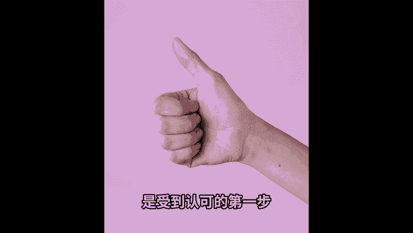

# 【保姆级攻略】素人0基础从0开始用小红书赚钱，1个视频破解小红书起号攻略｜1000粉丝月入60w+，布局2024 - P1 - 咔咔的红宝书 - BV1fp421S7gA

🎼在小红书上只是靠1000粉丝就能月入1万美金，发一发简单的产品图片，就能月入10万美金。这是真实发生在我和我的代运名客户身上的事情。普通人零基础就能使用小红书赚钱，提前为2024年的被动收入布局。

这一波红利，你还要再错过吗？大家好，我是凯卡曾经在互联网内容平台，担任7年内容运营职位。江湖人称爆款制造机，打造了多平台多领域的个人爆款短视频账号实现变现。

这个频道专注于帮助每一个普通人利用AI从零到1打造自己的小红书账号，实现涨粉赚钱。在小红书，我曾经仅凭一条视频就涨粉7000一个月粉丝突破3万。今天的视频我就来给大家揭秘如何从零开始精准账号定位。

打造爆款笔记的四大底层逻辑和六大小红书变现方法，在别的地方需要1万家的知识付费课程。这条视频免费告诉你。如果你也想在小红书做内容赚钱的话，一定要看到最后小红书。

🎼是目前对新人最友好的平台。没有之一，零基础小白通过学习也能够快速起号。纵观市面上所有自媒体平台，小红书具备新人选择平台的三大要素。一、内容创作门槛低。2、流量分发普惠原则。3、粉丝质量高。

先说第一个内容创作门槛低。虽然抖音、淘宝等各大内容平台都真着想做图文内容，但中文自媒体图文街的第一把交易，还是小红书图文相比视频的创作门槛更低，你不需要会写脚本会剪辑，甚至不需要拥有专业的拍摄设备。

很多普通用手机拍摄的日常图文就可以获得一个不错的流量。第二，流量分发普惠原则，这意味着中央部和尾部博主也可以和头部博主享受同等的流量分配，只要内容好，受欢迎，并不存在太大的流量差异和扶持差异。

所以你会看到小红书上很少有百万以上的大博主50万粉丝以上已经算非常头部的博主了。第三，粉丝质量高，根据官方和第三方平台发布的数据，小红书百分。

🎼70都是女性，其中90后、95后居多，而一二线城市和新一线城市占大部分整体具有较高的消费能力。小红书月均可支配的消费金额是在5000以上。所以有一种说法是小红书1万粉丝，相当于抖音10万粉丝的价值。

毫不夸张的说，现在几乎每个人都想要入局小红书。无论我在任何场合提到小红书都会有人先问我卡我也很想做一个小红书，但我不知道从何开始。这个时候会让他先不思考，我可以做什么样的内容。

而是从思考可以用什么变现倒推。很多人一上来就说，我要做自媒体想要涨粉，但是没有产品和服务承接，有流量来了，也跟你没有关系。我们做任何一件事情都需要有足够多的正反馈，才可以让我们持续的做好它。

所以以终为实是最好的方法。小红书一共有6个变现模式，推荐程度从低到高排序。一次是置换变现广告变现带货变现直播变现，这是付费变现和私域引流变现，置换变现是指品牌在推出新产品时，有投放和宣传需。

🎼他们会给小红书博主免费邮寄一套产品，小红书博主为其创作一篇宣传产品的笔记作为交换。这种置换变现模式通常是没有任何费用的，品牌方也通常会选择粉丝量比较少的博主进行这样的置换合作。

不需要粉丝上千几百粉的素人通常就可以接到这样的免费置换的商单。这类的变现虽然是免费的，但千万不要小看这类的变现模式。护肤博主可以通过记录自己的护肤心得实现护肤品自由。

家居博主也可以通过记录自己家的装修日记，获得免费的家居电器，虽然变现金额少或者没有，但至少证明了我们的账号是垂直的，并且拥有至少1到2篇爆款笔记受到了品牌方的关注，是受到认可的。第一步。

广告变现是小红书最常见的变现形式，也就是不同于之前的置换变现，商家不仅会赠送免费的产品给到博主还会支付与粉丝量相匹配的费用。粉丝数量越高，广告费用的报价也就越高。作为回报，博主也是要按照品牌的需求。

创作一篇图文或视频笔记，宣传品牌以及。

🎼这种笔记的内容通常是软性植入为主，既符合博主本身的定位，给粉丝提供价值，又可以为品牌生传产品达到共赢。有的博主应对广告的花薪思程度甚至高于日常笔记。所以在小红书的广告笔记，也有非常大的欣赏价值。

如果你经常收到小红书的话，就会看到这样的笔记。笔记的左下角有商品的链接，如果喜欢笔记的内容，就可以直接去左下角的商品链接里购买，非常的直接和方便。这样的带货形式就是带货变现。无论你是有自己的货源。

在小红书开店，还是没有货源，只是成为买手带货，都可以使用这样的形式。在视频一开始提到的小红书账号，就是通过发一发袜子的产品图片或者穿搭图片，就可以通过小红书这一单一渠道运入10万美金。

而拍摄袜子的摄影成本，仅仅是40美金20张图片，可以发购5篇笔记。也就是说，每一篇笔记的成本发美金不到，就可以看造10万的美金利润。如果你没有货源也没有关系。只要你有足够锐利的选品能力。

就可以通过合作中心的商品合作，给。

🎼笔记挂链接，而这样甚至完全不需要你管后续的物流和客服，就能轻松赚取佣金。今天小红书发布的最新消息是鼓励每个普通人都可以成为买手，并且提供500亿的流量，帮助100万小红书博主成就一份新职业。

可以说这是普通人通过买手入局小红书的最好时机。你可能看过他的直播，他的直播过者他的直播直播变现可以算是无论哪一个平台，目前最火红的变现方式，不同于笔记的静态模式，有一个人在你面前演示。

不仅可以多维度的展示产品的各种细节，高级的直播还可以提供情绪价值，让你不自觉的就看很久，并且激情下单。可能你会问明星都下场直播了，难道不是来抢普通人的饭碗吗？错特错明星下场意味着平台要树立典型。

典型树立好了才能吸引更多人入局直播，盘子才会更大。普通人才会有机会分到一杯羹这是付费变现是用于某一技能的博主，比如营养师课程的主题是年前急救21天营养师带你养成易瘦体质太极。

🎼博主则可以分享太极课程，比如太极几倍专修班。虽然知识付费变现难度较大，需要博主有比较成熟的知识体系，但毕竟知识这个东西没有实体，全在你的脑子里，没有仓储和物流成本，属于轻资产。

所以虽然课程达到的时间较长，但是几乎零成本实现复利，即一对多的变现方式，只要你的人设做的值得幸福。粉丝数并不影响你的变现天粉的小红书博主不能靠着200人的会员社群，轻松变现200万。

为什么我把私域引流变现放到最后一个当做最推荐的变现模式，因为前面的几种变现模式，无论赚钱程度大小都有一个缺点，那就是必须依托平台，在平台上完成交易，很容易有不稳定性，而把用户引流到自己的通讯软体。

在自己可以掌控的渠道实现变现产品交付和重复购买。举个最简单的例子。假如你是一个做服饰的买手店铺，在小红书，你只能通过不断的发布笔记，被动等待客户，他可能今天打开小红书，也有可能明天打开小红书。

那打开小红书之后，也有可能。😊。

🎼你的笔记被海量的其他信息给淹没了。但是如果他是你的通讯软体好友，你的服饰上新信息就会经常出现在他的朋友圈里，你也可以定期给他发送私信，或者通过社群上发布团购消息等等方式，促进购买和二次购买。

重点我们已经知道了，但是如何开始呢？接下来我会从账号定位账号包装爆款笔记和平台规则，四个维度来手把手教你如何从0到1搭建一个小红书账号快速起号。一账号定位，如果只能用一种本领来代表你，你只能依靠他赚钱。

你会怎么选。很多人会回答说，我是一个斜杠青年有很多技能，很多兴趣爱好和身份标签，但不知道自己的核心技能是什么，我们总是想要的太多，但不知道如何取舍。而自媒体账号的定位就是一个取舍的过程。

需要精准需要垂直，需要单点打爆，能让你和其他人区分开来的差异性，就是你的定位方向，如何找到自己的差异性呢，不如问自己三个问题，自身已经形成的优势，非常突出的缺点。接下来会在什么方向努力。如果你擅长。

🎼给朋友解答情感问题。那他是一个情感账号就很适合你。如果你在职场上做个PPT让同事称赞，那就适合做一个职场博主。他有可能会问了他卡找到自己身上有人愿意付费的价值很好理解。

可是为什么要找到自己身上的缺点呢？举个非常简单的例子，一个大腿很粗的女生通常会对自己的身材不自信。但是如果他可以先展示自己不那么完美的身材，再展示会显瘦的衣服，但视觉效果是不是就拉满了呢？

所以找到自己的差异点，不仅要优点缺点也可以要让别人有记忆点。如果你现在没有突出的优点也没有突出的缺点，他也可以思考，在接下来的1到2年内，你会在什么方向跟耘。如果是马上要买一个房子。

那显然做家居博主就可以很好的记录这个过程。如果马上要去考托福或者雅思，那也可以记录每天的学习过程和成果，让用户可以像在看连续剧一样，期待你每天的更新，变成一个养成系博主。如果无法在一开始准确定位的话。

也没关系，可以把方向缩小到2到3个领域，并且在每个领域先发10到20。😊。

🎼片内容让数据帮你决定。通过我们前面的三万法，我们已经有了精准定位。那账号的包装就完全围绕着这个定位去进行就好啦。这里包含三个部分昵称、头像和简介昵称我们需要以最简单和最直接的方式向用户做自我介绍。

这里也给到大家一个公式。爆款昵称等于爆款定位，加简单好记己的名字，比如这个频道就是专注于教大家怎么做小红书的卡卡这个名字朗朗上口，那么我就叫卡卡的红宝书。

比如健身博主就可以叫卡卡爱健身爱健身的卡卡健身达人卡卡等等。这样用户只要搜索相关的关键词，就可以在用户列表里轻易找到你头像推荐使用真实加符合人设定位的头像，很多人会有一个误区是。

头像我要用摄影棚拍摄的高级感照片才好。但如果你不是专业性比较强的职场或者投资类博主，需要营造专业的人设，还是建议使用具备真实感的头像，这样才会使你更加亲切情侣博主使用两个人的合影作为头像。

旅行博主就使用在旅行时拍摄的图片，简介一个更立体的展示人设的地方，遵许两个。

🎼原则表达一我很专业。2、我很特别，运用数据化的描述加专业领域，比如自媒体创业年入7位数，陪跑用户500，就可以帮助你实现专业性的人设要求。简介我们可以使用imo节和风格符号，让排版更简洁。

这里整理了4个常用的典型句式，可以截图保存。如果你不满足我很专业的描述，也可以通过高级感的文案引发共鸣。比如微胖博主就可以在简介里面写，美丽不应该由身材定义。

这样就可以精准定位有同样价值组装的粉丝关注你。第三步，爆款笔记爆款笔记的底层逻辑是在自我表达。用户需求当中找到交集部分，并持续重复的表达。小红书最大的禁忌就是自我感动，只发布自己觉得好的图片。

而不考虑这个内容是否利他别人有用。比如读书博主用心发布的手抄笔记，自己眼中是很辛苦了。但是在用户眼中却很不清晰，换了一个重点清晰的排版和全面的知识点总结，点赞数据也就一下子会上来哦。

从具体操作的层面选题标题内容和封面选题一定要。

🎼自己的爆款审题库，什么是爆款审题呢？点赞收藏，评论加起来是5000以上的数值都可以成为爆款审题。这里介绍3个打造自己爆款审题的方法。一、可以积极利用小红书的搜索功能，输入你的领域关键词。

在高热内容里找到爆款审题，先超越再模仿。2、找到这个领域的对标博主，看他们的爆款内容，收集爆款审题。3、在爆款笔记内容里，重点关注高赞评论，这都是用户在浏览笔记之后，发现笔记还没有完全满足的需求。

我们要能很敏锐的捕捉它，如何能让你的内容标题更加吸睛呢？我总结了8种爆款标题的公式，大家可以截图保存，最常见的就是第一种数字法，用数字凸显价值和美感。我们大脑会优先识别数字，因此。

在标题中使用数字可以增加辨识度，让用户可以更加直观的感受到内容的价值，激发点开笔记的欲望，不要打开小红书开始浏览，就会发现很多这样的案例。接下来是制作内容。图文内容一定要有一个精彩的开头，有价值的中间。

🎼号召性的结尾。最后再加上讨论度高的话题标签，一篇笔记的字数最好控制在500到800字，内容要充实，但不要冗长。跟个人简介一样，我们可以善用风格符号和imo，把排版变得更加清晰易读。

视频内容也是遵从同样的逻辑。一开始的口播开头不要超过30秒，整体的视频也不要超过10分钟，最好可以控制在3到5分钟。因为小红书是中短视频逻辑，更加追求高效获取信息，在拍摄条件方面也不用追求过多的设备。

一个手机完全足够。一是因为我们现在很多手机的像素已经完全能够媲美相机的清晰度。而是因为手机能够更加真实。我们要想做的是向邻居哥哥的姐姐在分享内容，而不是遥不可及的明星。在创作内容的时候。

我们总是考虑无文的颜值，美观确实能够给用户带来很好的印象。但当很多人都在做同样的内容的时候，我们想要做的，就是让封面更加的吸引眼球。不管是奇特还是夸张，只要让别人愿意点开你的笔记就是好封面，想要做好小。

🎼的笔记封面只需要记住一个小tips，善用花字，所右花字就是封面图片上的标题文字，呈现的是笔记里最精华的关键词内容。现在已经有很多的线上软体支持这样的自定义的封面设计，并且会定期更新模板。

比如搞定设计、黄游相机等等。在之后的视频里面，我也会分享更多用AI做小红书封面的小技巧。第四步平台规则，现在你知道了如何快速打造一个账号和创作爆款内容，但这并不代表工作就结束了，掌握平台的流量密码。

还可以不断提升爆款的稳定性。一发布时间在某一个时间段，小红书的在线用户越多，平台流量也就自然越多。那么你的作品就会更有可能被看到。一般来说，所有的内容平台有4个高峰。

那么分别是早班高峰、午休高峰、下班高峰睡前高峰，那么具体的发布时间也会根据你的账号定位有所不同。比如情感类的内容就适合在睡前发布。因为晚上大家都会阴谋啊，但职场学习电身类的内容就更加适合在早上发布。

这个时候大家就会更有动力打击写。

🎼大家一定要了解小红书平台的推荐机制，这就是小红书流量推荐背后的秘密。每篇发布的笔记都会得到一个s分数，点赞加1分，收藏加1分，评论加1分，转发加4分，关注加8分。

所以我们一定要在笔记内容里面提醒观看我们内容的用户点赞分享给他们的朋友，也可以在内容里留下一些可以引发讨论，甚至有争议性的话题，让粉丝在评论区里互动。

如果就曾经在评论区设置关于阅读完某一本书后的一些问题，粉丝就会自发的对这些问题进行回答或者分析。这样我们一条笔记谢的分数，不就很快就容易上来了吗？

恭喜你你已经把我花了7年时间在各大平台学习到的爆款秘集吸收成功。如果你可以按照视频提到的方法发布第一条视频，那你就已经跑赢了70%的人。如果你可以坚持制作30条，那你就跑赢了90%的人。

对如做小红书是坚持的艺术。这条路可能很难，但值得一试。好了，去做吧。完成永远比完美更重要。

