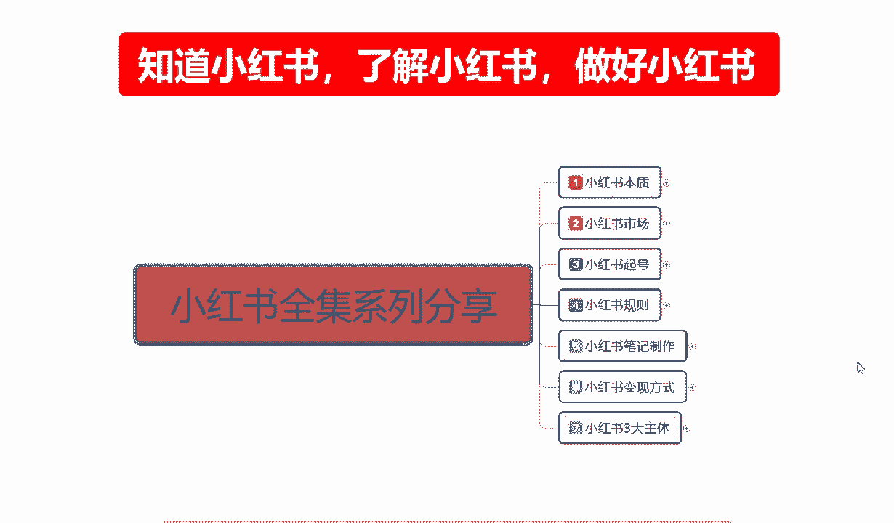

# 【全198集】强推！！2024（全新）最保姆级小红书运营教程，小红书起号到爆款店铺打造必学全套运营流程，新手开店必看！拿走不谢，允许白嫖！ - P12：5.5新手小红书运营-小红书规则（5） - 红书开店教程 - BV1NvpuenECZ

大家好，这节课给大家分享的是。小红书全集系列的第四大节啊，最后一节课第五课时小红书规则。

接着我们上节课的一个内容，上节课的话主要是给大家讲解了一下我们推荐的一个整体规则啊，平台是通过什么样的方式啊？

进行的一个整体推流啊，包括我们的一个发现页流量和一个搜索页流量两个区分。

这节课呢主要给大家讲解一下啊，被推的一个核心逻辑和我们需要有哪些地方不能采的啊，尽量去避免的一个。

内容点被推的一个核心逻辑是什么意思呢？就是说我们笔记发送出去以后。通过什么样的方式，比方说我这一篇我账号是星号，我正常发数据的话，大概有1000个展示流量，或者说是50到200个小眼睛的一个点击率。

那他通过什么样的一个方式可以把它跨越到200到500的一个啊小眼睛。或者说是有30千展示。或者是。更高的一个层绩。就是跨越成级，它是通过什么样的一个方式来进行一个升级的？

因为我们了解这个升级过程以后的话，我们才知道我们的流量截流到底是出现了什么问题啊，是我的笔记做的不行，数据做的不行，定位做的不行，还有什么啊？就说他的一个整体。核心的一个逻辑。首先第一个点是打开率。

打开率是什么呢？小红书我们在打开的时候，大家可以做一个示饭啊。你们打开手机以后，把小红书点进去以后，它上面第一个页面展示的。是4个小红书笔记啊，当然了你如果说点进去的话。

它有一个主动推广的那个小红书页面，那个基本上有人看内容吸引内容做的好，有人看。但是那个不是我们主要做的啊，那个是付费的啊。我们现在的话还涉及不到做做了一块的一个高高层级的一个流量推广啊，没有必要。

就是说我们第一要意就是说打开以后。小红书展示的一致。推荐的一个流量，那推荐的一个。流量来源我们笔记发放出去以后的话，它会在里面展示一个页面大概是4到6个产品啊，看我们手机的一个大小。

手机小的话就是4个手机大一点的话可能会达到6个。看我们把页面放大或者缩小啊，看你们有没有这个操作。有些人习惯的话，可能看小一点的图片可能会展示6个。正常的话，他说是4个产品已展示。不能说是产品。

应该说是四个笔记忆展示啊。然后这四个笔记我们往下面拉的话，它会选择性出现20条笔记，然后进行一次的刷新。也就是说我们在这20个笔记里面进行展示以后，有人点进来。给了你1000个展示。

比方说基础展示是1000点。那我们平均打开率的话要超过11%，你才能进入下一个层级，他才会给你2000到5000的一个呃暂示量。如果说你连11%都没有，那它就一波推流。就给你2000的一个反数。

所以说第一个第一要点打开率是11%，在20个同类型的笔记里面啊。你的笔记最少就是给了你1000个，你最少要有1110个小眼睛。给了你2000个，那你最少要有220个小眼睛。以此类推啊。

它才会跳到下一期给你翻倍的一个展示数据。如果说你连平均11%的打开率你都没有，那你就是100100就100000就是2000啊。这个基础的一个展示量的话，它是根据你账号来的啊，你账号权重越高。

基术展示率也越高。但是你的笔记发布推广出去以后，如果说你的平均点击率就是小眼睛不到11%。那不好意思，你这个笔记内容不行，对别人的一个吸引不行。你的笔记图片不行。啊，他就不会继续给你推流了。

就是一波的事情，三天就结束了，好吧。二个是互动率。平均互动率3%是什么意思呢？如果说有人在你的笔记里面进行留言。我已经通过了第一阶段的11%的一个概率，他给我进行了第二次的一个推流。

那你的互动率低于3%是什么意思呢？就是我们进来以后，比方说我们以前进来的110个人，110个人里面，如果说。连4个评论的都没有。啊，就是连四个评论的都没有。那你的互动率就不到位。超过4个数据越高。

他给你推流的数据也就越多。通过这种方式去定位的。所以说我们大家一定要了解啊，先是打开率，然后是互动率。啊，超过3%以后，你我们已经升了一级了。你下一级升的话就要靠互动率去升了。

就是20001000升到2000到5000。下级就从2000到5000里面升到1万到2万。应该说是5000到2万这个范围以内。给你的一个展示量。如果说你的平均互动率再次超过了3%。

他会根据你的内容选项再次进行升级。啊，就是2万到10万的一个。小眼睛。应该说是2万到10万的一个展示，你能获得多少小眼睛啊，就看我们整体的一个图片做的怎么样，标题有没有吸引力，内容做的优不优秀啊。

靠这些的，但是它的一个推流推流程序的话，就是这个样子的啊，先点击后互动，升两级，你想升升第三级基本上不可能啊。因为你的技术权重不够。你如果说新号的话，你最多分到第三级。如果说你是老号，你起步就是第三级。

你就可以升到第四级、第五级。你是第5级的话，那不好意思，你已经到顶了啊。6级、7级、8级那个流流量互动的话，那是大的王后博主去做的。我们正常的话基本上到第4级，第5级就已经不错了啊。

超过第5集开始第6集、第7集、第8集都是那个是要花钱的，而且是要花很多的钱。好吧，不过那个时候你有那么多的一个数据量也就不会在乎这一点钱了啊，但是你的内容要好，你内容不好的话，那个钱也是白花。

最后的话就是说它的整个搜索结果是打开率，然后在搜索结果中点击率较大。打开以后点击了进行你的一个收藏、评论、关注啊之类的啊，这些数据如果说。他还有一个。

整体核心整体核心的话就是我之前给大家介绍的这个。呃，给账号打上精准标签，不是看一下啊。

老子有点过仔了啊。

是这个。点赞、关注、收藏、互动。分享第四个点，它都是有评分的。

所以说我们需要把评分做好，你当然啦，这是基础属性啊，你评分如果说做不起来的话，还好，但是你基础属性达不不达标的话，那你评分给你再多都没用啊，你最起码要先把基础属性给达标啊，11%的评分打开率啊。

3%的以上的互动率啊，你才会有这个。分享点赞、关注啊，才会有这种权重。你要这个都不达标的话，那些权重给你了也和没给没区别。好吧，所以说大家一定要把这个被推的核心逻辑先了解清楚啊，这个就是整个小红书。

他的一个推流规则。啊，最后一点内容给大家讲解一下啊，小红书有哪些坑不能踩。比如说我们在了解小红书规则的时候，你要避免我们自己所犯的一个错误啊。这里呢我也给大家把它给列出来了，大家可以看一下啊。

嗯，首先第一个点就是新号呢，他不要立刻发布笔记啊，我不知道大家之前有没有仔细听我说新号需要养号的，你号不养的话，你。今天见号，早上见号，下午发。顶多给你200个。小影音的一个点击量。

就是你已经把第一波的。平台就是小红书平台给你的权重用掉了。你后续再发的话，就是550807080，偶尔出个100100多的一个小眼睛点击率。那你这账号就已经半废了。你就得重新去打标签或者重新去做了啊。

没有必要，所以说我们新号的话，不要立刻的去发放笔记。第二个就是说违规会降权笔记推荐和排名的话，它都是会受影响的。我们尽量的话就是把那个发送笔记的时候啊，之前给大家那个推荐的一个规则给大家说误。

小红书整体规则里面的话，就是说尽量的话不要去。怎么说呢？不要去违规，因为违规一次你降90%的流量。7天，那你这个号你后续你。年段跟7天的一个笔记的话你。后续想把它做起来的话，难度最少提升百分之。

60以上。就比本来以前做的话吧，百分之百的概率还能往上面提两级。你这一被降全，你就只有40%的概率把它提两级了。啊，所以说尽量的话就不要违规。然后就是确定标签后，就是我们整体的一个标签，店铺标签也好。

人群标签也好，账号标签也好，不要去反复修改。啊。有一定流量呢再修改的话，就说它就容易限流。就是我有我这个账号已经有流量了，但是我觉得我的人群不准，我想把它改一下。改了以后，你就相当于自己给自己做了个。

手讼啊。把自己一半给砍掉了。左右两只手本来挺好的，你非得觉得另外一只手不好用，把它给一刀给咔切了。虽然说是残废的一双锁啊，但也没必要给他切了，累就更惨了。所以说确定标签以后的话，不要进行反复的一个修改。

然后就是不要一个手机登录多个账号，这个给大家也说过。一级一级一卡一张号保证这个节奏就行。你要操作的话不行，电脑最多也就分三个号。然后谨慎发布推广引流的一个内容，谨慎处理留言私信。

这个呢我就不给大家一一一念啊，就是我打的这些内容大家了解一下。啊，自己截个图，自己心里面有个底，有些东西能做，有些东西不能做啊。好吧，那这节课呢呃小红书第四大节的一个课程给大家讲解完了啊。

当然了这说实话前面几节课都只是说让我们了解整个小红书。我们后续怎么去操作，后面三个点啊，才是我们正式步入做小红书的一个节奏点。

我们只有了解了我们前面几个点，才能去做后面这几个点。

好吧，那么这一节课呢就到这里，下一节课呢给大家讲解一下小红书，我们整体的一个笔记到底应该怎么去做。而而且这个内容的话是比较多的啊，它比前面的小红书规则。

启号市场这些加起来可能都还要过。先了解小红书笔记怎么做，然后我们再了解小红书通过什么方式去变现。最后小红书三大主体我们到底要做什么？给自己定个明确的目标。同时从三大主体里面的话。

我们可以了解我小红书做店怎么做啊，小红引流怎么做？小红书，我想做博主怎么做。好吧，那这一期课的课程呢就到这里，下一节呢给大家讲解小红书系列的第五大课时，小红书笔记的一个制作。

