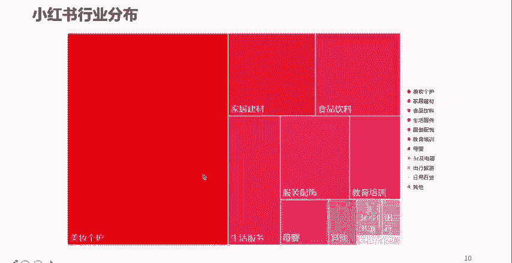
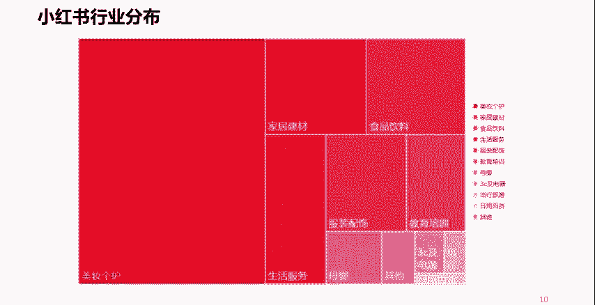
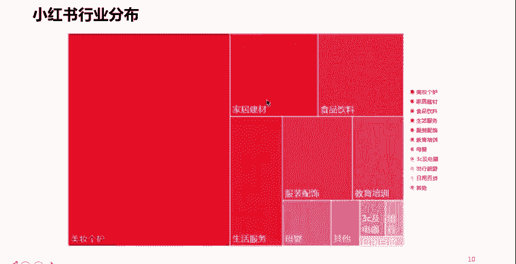
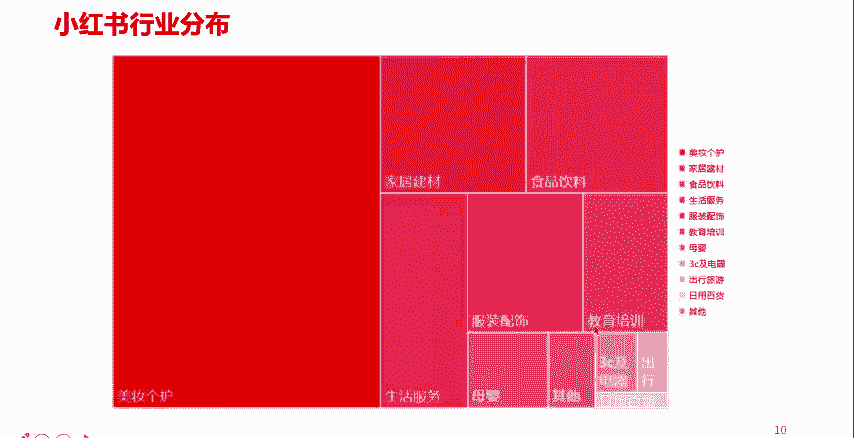
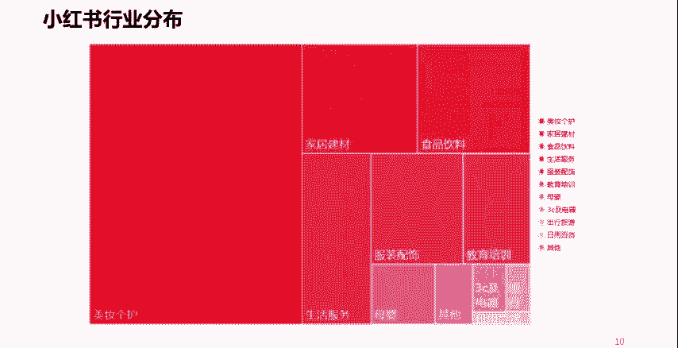

# 【全198集】强推！！2024（全新）最保姆级小红书运营教程，小红书起号到爆款店铺打造必学全套运营流程，新手开店必看！拿走不谢，允许白嫖！ - P17：9.小红书的内容类别 - 听山说雾ax - BV1YY8QeTEfD

那么再往下，我们看一下小红书的主要内容的一个分布啊，你比如说占到了半壁江山的啊，占到了半壁江山的还是美妆各户，所以这也就不难看出，为什么小红书的主要用户是年轻的女性了是吧。

好第二个是家居建材类的是吧。

包括食品饮料类的，然后还有什么呢，生活服务啊，服装配饰，这也是一个大类啊，这也是常见的哈。

包括教育培训啊，像其他的呢也有一些啊这些，所以大家在做小红书的时候呢，也可以积聚啊，基于这样一个内容的分布啊，内容的比重啊去考虑啊，去考虑一下，是否涵盖了你所在企业的一个什么呢。

业务类型或者是商品的一个类比啊，所以说我们知道做小红书，或者我们在任何一个平台上去做运营，必须得考虑这个平台的主流的用户，都喜欢什么样的内容。

因为每个平台都有每个平台的特征，对于每个平台的用户的喜好，对吧嗯这个你是不可更改的啊，不可更改，所以说呢一定程度上呢，我们要去借着这样一个东西，去做我们自己企业的一些唉电商。

或者做我们个人想做的一些有意思的，或者是优质的内容啊。

