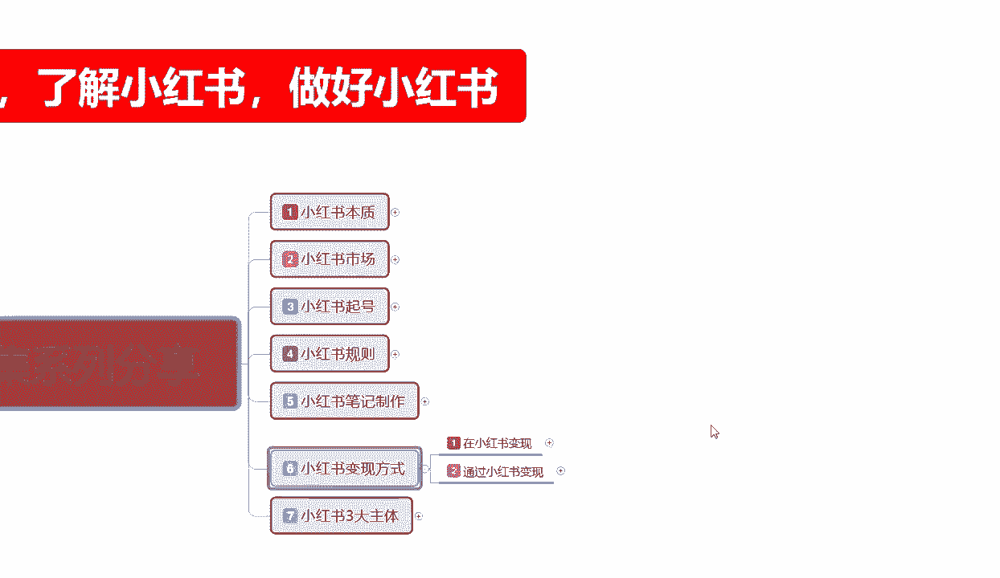

# 【全198集】强推！！2024（全新）最保姆级小红书运营教程，小红书起号到爆款店铺打造必学全套运营流程，新手开店必看！拿走不谢，允许白嫖！ - P33：25.2.新手小红书运营-小红书变现方式（2） - 红书开店教程 - BV1NvpuenECZ

大家好，这一节给大家分享的是小红书全集系列的第六大课时。小红书变现的方式第二节。

因为这个整体内容的话不是太多啊，这节的话主要是给大家讲解一下，通过小红书变现，我们有了几个方式。

上一节给大家讲的是在小红书，我们用自身的一个资源也好，账号的一个资源也好进行了一个变现方式。这节的话是通过小红书，我们怎么去变现？说实话，通过小红书和在小红书变现的话，它其实本次差别是不大的。

都是要通过小红书平台进行一个切换，只是切换的一个方式是切换在平台内部转进行转换，还是切换在平台外部进行转换。这节呢就可以与大家讲解一下在外部是怎么转换的啊。通过小红数变现的话，在这个地方的话是有3点。

第一个是引流私域，第二个是技能变现。第一个三个是影响力变现。影响力变现和技能变现的话，说实话，我们。很难做到。啊，我们来了解一下。

私域变现？什么叫思域变现？这个的话就是说适合我们你有自己的产品啊，虚拟的产品也好，实募产品都可以啊。只要有引流到私域需求的话，就OK了。你在小红书上面，无非就是我想把这帮用户集中起来。

然后的话通过通过小红书扩展我的整个平台，我把思我自己本来有私域，对吧？但是我的用户数量不多。我想去小红书上面做引流这个引流私域就是这么来的。小红书三大主体是那三大主体啊。

就是这这个里面包含了一个店铺运营一个主体，私域引流一个主体，网红博主一个引。主体上面的小红书变现里面的话，基本上都是属于网络博主。这个变现里面的话基本上都是属于私域一流。啊，他只是说两个变现模式不同。

其实还有第三个变现模式是店铺运营。但是店铺运营的话是在小红书本体体制内的一个变现。他和我们给大家分享的话。其实也可以分享，只是说它的内容的话比较适合在小红书里面去做。而且。你了解过的。基本上都好摸。

就是店铺运营，我们把店铺整体这个呃数据量做起来以后就可以了。

在私运引流方面的话，其实。怎么说呢？这个时候的话我我们的话就只需要发精准的一个内容。去吸引精准的粉丝即可，不需要盲目的追求爆款。就是我的小红书上面，我这个账号创好以后的话，我其他的不需要了啊。

我在有个账号有个店铺店铺里面挂不挂产品那种另说，对吧？挂肯定是要挂一两件产品的。这个产品的话，你可以把它改成课程，改成其他的一些东西都可以啊，随便挂个一两个，它增加我们账号的一个整体权重。做思域引流。

无非就是说把我知道的所有行业内目做出来。做好以后，通过我这个方式，你比方说我做视频。我需要一个宝妈群，然后我在小红书上面所发的内容是包含什么呢？就是食品内的一个嗯。你比方说做儿童的儿童保健的啊。

养生养胃的啊，周一到周日吃什么的。这种的话，你做一个循环模式，你在上面去做别人就会问你这个今天做什么，明天今天做什么菜，比较对儿童有益，明天做什么菜比较对儿童有益，这个菜怎么做，用什么方法用什么食材啊。

温度加多少等等。你通过这种方式去进行分享。对吧分享以后，别人觉得你这个博主还不错，那么他就会。关注你的一个账号，那剩下的就靠你自己怎么去引流到微信。确也好啊。QQ群也好，引流到其他的一个交流平台也好。

你就靠自己了。你引导过去以后，你然后的话通过教他们这些方式，对吧？我这边有卖食材的，我这边有卖成品的对吧？你自己不会弄的，我可以教你怎么弄，你自己再去收费。这个就是叫死域引流。

也是小红书通过外部变现最主要的一个方式。后续的话，一个技能变现和一个影响变现的话，其实类似也是一样，只是有产品和没有产品的一个区别。技能变现，学会小红书这个技能的话，你也可以实行跨行业的一个转行。

去给别人带运营账号的呢。这个的话就是叫技能变现。什么意思呢？我教会你们了。对吧。但是你自己觉得自己不好做，而且自己没有什么实战经验。那么你可以去应聘应聘什么呢？小红书代运对吧？一个月拿几千块钱工资。

然后通过这种方式的话，去别人那边学。拿他的产品做自己的一个经验思总结，自己经验总结总结好了以后，再自己再去开店。自己再去找产品也行，对吧？你要是觉得我这个工资拿的还可以，老板还给我提成，对吧？啊。

卖多少，我说里们提多少，对不对？我整个小红营我已经做的不错了，那你可以跟老板分点，也是一种方式。然后是影响你变现，这个呢就不多说了。说实话你有粉丝有致名度的话，作为社群社群的人进醒你做分享。

甚至上综艺输书等等都是有可能的。指说。你的影响力大和小的关系，对吧？你在本区域有个2万5万10万粉丝的话，你在本区域已经很牛逼了。对不对？你60万以上的话，别人还会存钱鸡自己会再主动联系你。

都不去都不需要你去联系别人了，对不对？比方说你做小红书的一些思路啊，做小红书的一些方法都可以去续分享。那么你还有出场费。对不对？门票费等等都有可能。只是说这种的话，你的影响力变现。

它的一个持续时间要非常长，最少也是半年到一年以上。你才能把自己的人设。地位定位内容。展示给用户，别人才能喜欢你。他的一个时间跨度比较长，但是整体收益都是非常高的。只是说一般人做不了啊，你要有颜值啊。

可要有综合素质能力，要有那个不涉恐啊，最重要的是不涉恐，你要什么都能说，什么都能想，什么都能干。这个呢就是通过小红书。给自己创造一个发展的平台去进行编现的。什么意思呢？就是说嗯胃在美。啊。

提升自己本体本身的一个综合素质。宣传的是自己，而不是宣传的商品，也不是宣传的引流，就是宣传自己。新时代的网红就是这么产生的，好吧。

这个呢就是通过小红书整体变现的一个方式。我这里呢没有给大家过多的一个讲解，是为什么？因为小红书变现方式的话，其实就这么几个点。反复来反复去的话，你们只要把握核心的以后的话，把自己做好了，怎么变现都好。

你把自己做不好，你怎么都不好变现。

那这节呢分享呢就给到大家讲到这儿。下一节呢给大家讲解一下小红书三大主体啊，也是我们本期小红书全集系列分享的最后一个大内容。这个内容的话是非常庞大的。嗯，大家如果说嗯。对接这里面的感内容感兴趣的话。

接着往下面听，听完以后，你就知道小红书怎么去操作。也就有了自己的一个定位目标。那这节分享呢就到这里。

