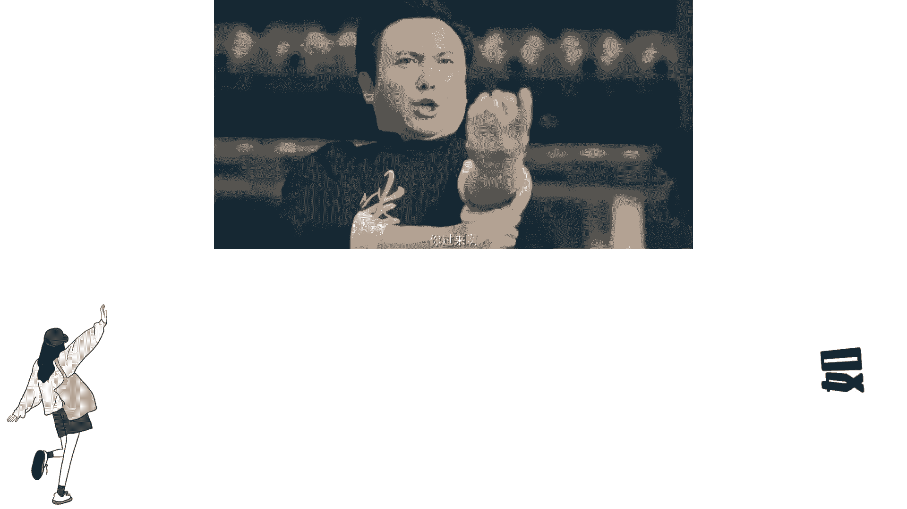
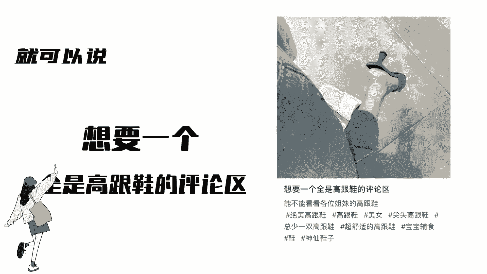

# 【全198集】强推！！2024（全新）最保姆级小红书运营教程，小红书起号到爆款店铺打造必学全套运营流程，新手开店必看！拿走不谢，允许白嫖！ - P8：2.3小红书起号-评论区起号法 - 听山说雾ax - BV1YY8QeTEfD

所有人都告诉你。

小红书现在流量特别好，但从来没有人告诉你怎么做流量才好，你以为做小红书就跟我二奶发个朋友圈一样。

随手一拍的照片，配上个感动的文案，刻字它就不断。

结果你发完笔记，隔5分钟就打开一看，卧槽没有人看，真是老太太钻被窝给爷整笑了。

今天强哥教你一个做小红书百分百出爆款，并且还能获客的方法，如果没用。

你来找我，我给你投1000，聚光视频左下角有一份完整的起号方法，偷偷去拿吧。

这个方法我称为评论区起号法，这个方法只需要一个标题，一张图，比如你卖礼品的。

就可以说想要一个全是礼物的评论区，把你的产品植入到图片里，然后通过评论区打广告置顶你产品链接。

你是卖高跟鞋的，就可以说想要一个全是高跟鞋的评论区。

你是卖手串的，就可以说想要一个全是手串的评论，然后在评论区打广告，把自己的广告产品给置顶，只要对你行业感兴趣的用户，就会来咨询你这种分享的形式。

用户喜欢流量大，制作成本低，这个标题不仅适用于任何行业。

