# 【全199集】强推！！2024（全新）最保姆级小红书运营自学教程，小红书起号到爆款店铺打造必学全套运营流程，新手开店必看！拿走不谢，允许白嫖！ - P15：8.小红书平台用户标签及流量入口 - 木吉木更小姐 - BV1Sop5e6EVE

OK那么我们刚刚讲的我们系统小红书的一个平台，它是怎么来判定我们的一个内容标签的。那么接下来我们来讲一下平台它是怎么去判定一个用户的一个标签。那么这个地方呃判定用户标签的过程。

可以帮助我们怎么样去分析和了解我们的。标签我们的笔记是怎么被系统推荐给用户的？好吧，以及我们可以从背后的逻辑来反推，我们怎么样才能让我们的笔记被我们的用户被我们的精准用户看到，好吧。OK我们来看一下。

首先呢用户标签啊，用户标签系统现在给用户打标签，呃，它的主要的来源就是根据用户的一个浏览行为浏览行为。那么我们前期像啊你刚注册账号的时候所选择的那些兴趣范围，其实参考值不大。好吧，参考值不大。

它只是作为你用户刚注册小红书的时候，相当于平台给你做的一个内容方向的一个引导啊，内容方向的引导，它只能初步做一个用户的初步筛选，这个筛选呢还进不了，就是小红书系统最深层的一个用户标签池里边。

那么这个时候我们系统它判定一个用户的分类啊，兴趣分类是根据用户的一个浏览行为来定的。我们来看一下都有哪些。首先第一个是点击率啊，点击率。那么什么是点击率啊，点击率就是。

系统给用户在发现页推送了几个内容啊，推送几个内容。比如说有明星的，有美妆的，也有家居的啊，还有母婴的对吧？也有可能说还有一些装修的。那么这些内容。在呈现给用户之后啊，用户点击哪一类的内容点击的更多啊。

哪些内容他可能根本就没有点。那么这当中系统就能很清楚的得到一个算法啊，用户的一个点击概念，对吧？他点击10个内容当中啊，点击美妆的点了3次，然后呢点击家居的点击了两次，然后母婴的呢就点击了一次。

或者说根本就没有点O他能判定这个用户对母婴的不感兴趣，那有什么情况，就是这个人呢他不是一个宝妈OK他不是一个宝妈。那么如果说他对这个呃美妆类的比较感兴趣。然后系统就会持续推送更多美妆领域。

其他的内容来试探用户来呈现给用户啊，用户哪些内容他不点哪些内容他点的多，那么通过这样的一个点击率的逻辑，系统就能给用户打些打上一些强关联和弱关联的标签啊。

那么我们可以啊就理解以前其实是有这样的一个云图的啊，这个云图呢，就是我这里面。做完，我们呃我来展示一下。给大家好好的理解一下这个云图，就是打标签系统给用户打标签这个意思啊，整一个白档。

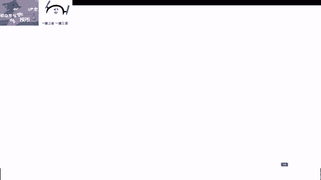

OK我们举个例子，比如说。美妆对吧？嗯，这竟然没办法调大小。嗯。然后。美甲啊。OK这是美甲，然后呢呃。我再来再来画一个啊。不是很好用啊。我是不是选错了？啊，对我选错了。好，这是美甲，然后呢。

还有什么来着？还有美发。OK那我不搞这么复杂了啊，比如说这是一个美妆。哎，然后这个词是什么呀？这个词是母婴，然后这个词是什么呀？这个词是呃我们的带娃，然后这个是装修等等等等啊。

我们这里会有一些强关联弱关联的这样词啊这样词。这些呢其实就可以理解为我们的系统系统或者是平台给用户打的这样的一个标签，这所有的标签里边，我们假设其他的标签都没有这个美妆领域这样个标签大。

就代表着这个用户，他就是美妆领域一个特别喜欢看美妆内容的这样的一个用户，他的标签主要就是这一内容。那么后续哎我就这个系统就应该保持给这个用户多推送与美妆相关的内容，像什么呃其他他不感兴趣的母婴的内容。

哎，我不给他推送，或者我少推送。那么这个用户他是不是就持续能在我平台上刷到他喜欢的内容，他就能获得一种哎获得感啊，或者说一种呃停留啊，或者一个足够的停留时长。那么这就是一个系统给用户打标签。他。

希望达成的目的对吧？希望达成的目的。那这就是呃我们的系统对吧？我们的平台，还有我们的用户。啊，平台用户以及我们的博主啊博主。

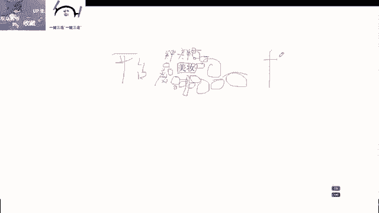

别成挺难打。啊，这就是我们三方之间的一个关联啊，三方之间的一个关联。我们作为博主，我们要平衡一下自己发布的内容，自己做的这个账号，它的意义，他能否给。

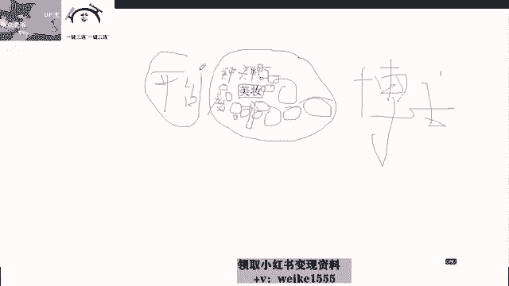

用户提供价值啊，他还能否给平台提供价值，对吧？平台呢他又要给什么呀？他又要平台也要给用户提供价值，这就是我们之间形成的一个串联的关系啊，其实这一条呢都可以抹掉了啊，O那么这就是我跟大家讲的这一点啊。

就是啊我们刚才讲的用户啊，平台通过给用户打标签来判定他的一个呃整体的一个行为，或者说这个用户他偏向喜欢的点论内容。然后呢，像这个停留时长，刚才我也讲了，对不对？呃，停留时长其实也是一个分析行为。

比如说他喜欢美妆类的内容啊，但是呢他美妆的内容很多哎点了他就划走了，点了就离开了，那说明什么，说明这些笔记不是他喜欢的。那么这个时候系统又要持续给他推送美妆里边其他领域的内容，对吧？像什么啊。

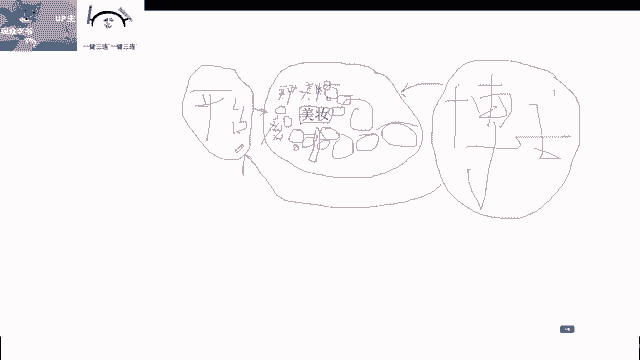

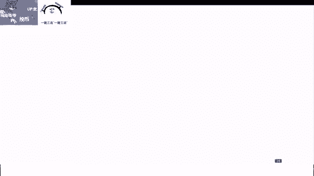

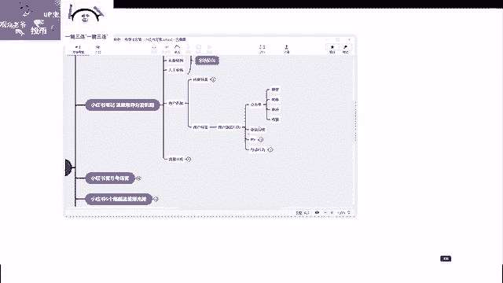

上粉啊啊或者是一些护肤啊等等，还要要给用户推荐一些其他的内容来观察这个用户的行为。那么停留时长。

啊，他对美妆这一类的划的比较少。但是唉我今天给他推荐了一个家具的内容，平常他点的比较少，对吧？但是这个用户今天他点了这个家具的内容，他进去之后呢，哎他还停留了很久啊，停留了很久。

他在上面刷了呃翻了好几页的图片，然后在下面内容看的特别仔细，还看了非常非常多的评论。那么这个时候这个用户就可能有一种什么样的特征啊啊，他可能就有一个装修的需求，对吧？也有可能是装修的需求。

或者说哎这个家居的产品啊，他是关于一个什么？关于一个盘子的，那说明这个用户哎他最近他可能想买盘子，是不是那么这个时候我要考虑系统就要考虑要不要给这个用户推送呃，这个盘子的商品，吧。

或者说推送更多盘子这样的一个笔记，那么这就是根据用户的一个停留时长来判断用户的一个喜好。我们相信啊就是我们平常刷这一类的，大家应该也能感受到啊。那么PV呢PV其实可以理解为就是用户浏览页面的一个深度。

那么这也是有一定的呃有一定。

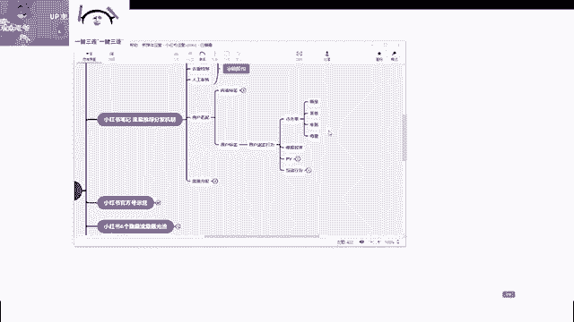

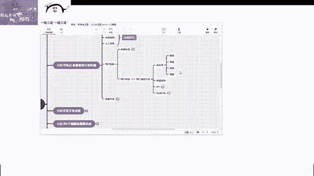

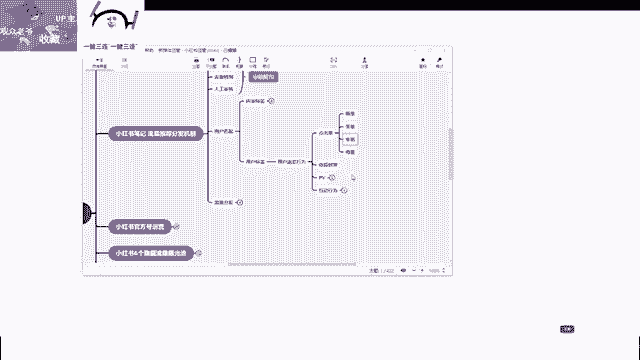

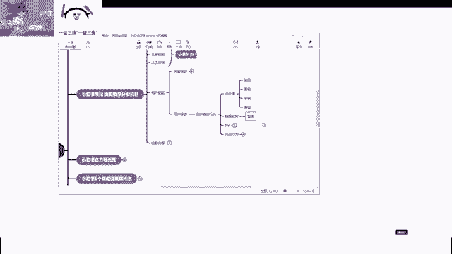

分值的。比如说这个用户啊他刷了一个装修的笔记，然后进去了之后呢，他不光看了这一篇笔记，他还点进了这个用户的主页。哎，他在用户的主页里边看到了非常非常多的笔记，挺喜欢的啊。

那这个时候呢他又开始点了这个用户的也就是这个博主的第二篇第三篇第四篇笔记。那么这个就是这个用户他浏览的一个深度，也就是他浏览的一个页面数。那么如果说你的这个账号，哎。

我做的把里边我主页里边所有的内容做的非常精致。那么用户进来之后就有可能提升这个用户在我们页面的一个浏览数，那么我可以明确的告诉啊，屏幕前的各位这个数值对我们是有很大的帮助的啊，也非常大的帮助。

那么当然啊很多人呢他浏览过后，这个时候他如果说浏览你的笔记的深度足够深的，那么就会产生一个行为，就是关注，他会关注你关注一样是一个呃永久的提升分，好吧，你也知道粉丝越来越多，对吧？

你的这个账号的质量也越来越。

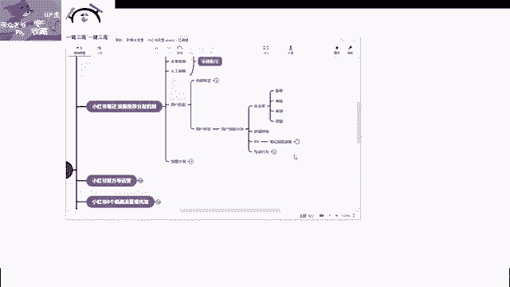

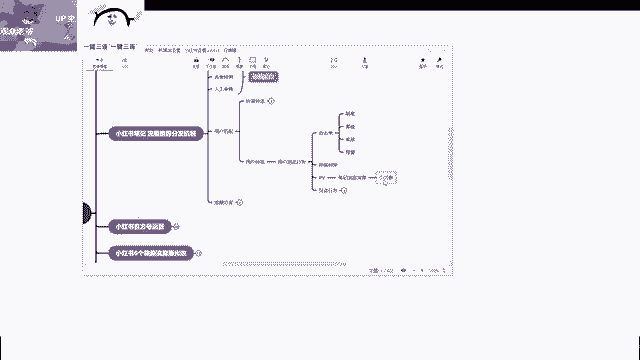

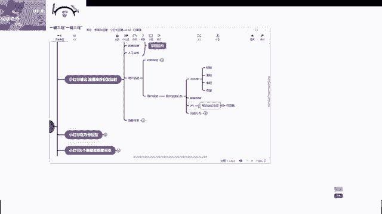

高。但是在你没有一定粉丝基数的时候，你提升你页面主页的浏览数啊，浏览页面的深度是能够给你的账号带来一定非常健康度的这样的一个评分的。OK这是关于PV那么剩下的就是互动行为这块大家也知道，对吧？

这个我就不多说了，点赞收藏评论关注。其实这每一个数据都是我们做每一篇笔记，需要去想去做提升了，对不对？你的点赞收藏数值高了，那么我们以后自己想做接单啊，或者说一些变现啊，是不是就更容易了啊。

那我们点赞的收藏的数据高了，我们这篇笔记，它获得的更多的推荐流量池啊，它的几几率也更高啊，胜带着说不定还能带动我们账号里的其他笔记的这个攀升啊，也能提升我们粉丝数，这就是我们呃讲究的这个互动行为。

这是啊我们一直在做小红书平台，一直在努力的目标，对吧？这个我就不多讲了，这个这个就是一个用户的互动行为。好吧，这个互动行为呢呃就是能够提升。

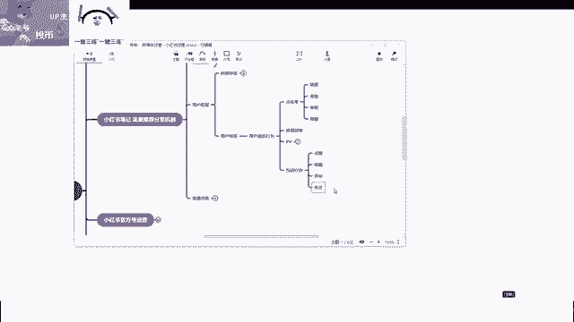

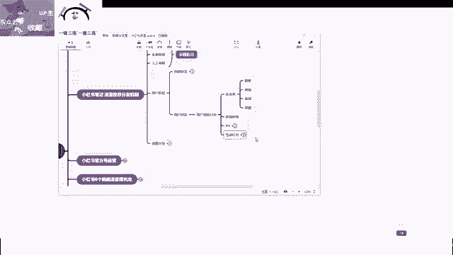

我们笔记的下一层的一个推荐的流量池。OK那么很简单的，我们就不讲了啊。然后流量分发流量分发这几个点呢，我就跟大家简单介绍一下，好吧。呃，流量分发呢我们现在小红数平台有4个啊4个，一个是发现页。

一个是关注页，还有一个是附近页，还有一个购物，那么你们可能作为用户经常使用，但是你没有去分析这几个它之那个区别。首先发现页啊，发现页里边所呈现的内容呢，主要包含几个点。

第一个呢是我们所经常有关注过的这些达人，啊，就是我们点了关注的这一类达人，他们发布的内容，然后其次呢发现页还会包含一些就是我们平常浏览深度比较高的。

就是我们刚才所说的用户标签里边系统判断用户提浏览行为的时候，他根据你的点击率在这个地方给你推荐系统觉得你可能喜欢的内容，对吧？这就是发现页里边出现的。

有时候呢发现页它可能还会包含一些呃我们其他的内容呢就是我们可能不感兴趣的，或者我们平时没有刷到过的系统也会。

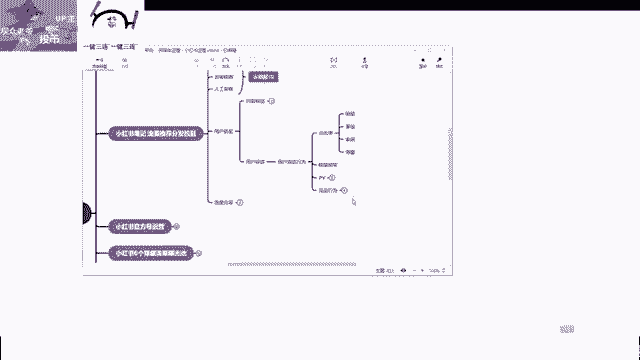

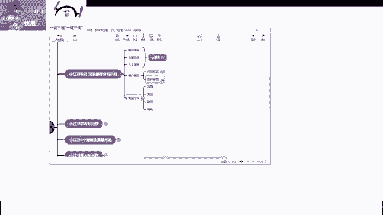

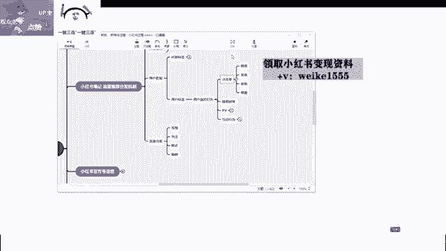

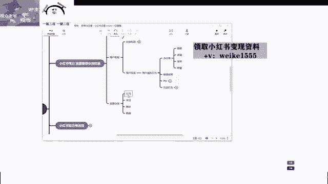

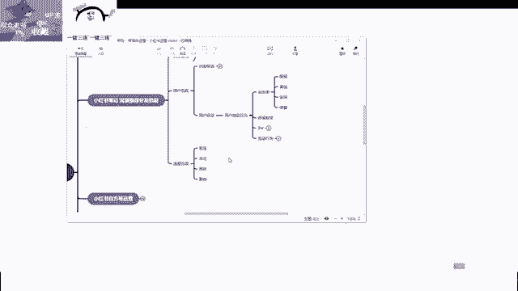

给你推荐一下，这样能增加平台的一个多样化平台呢呃我们的用户啊，在一个平台上面，现在不光是一种需求啊，我们的需求是多样化的。我们刷小红书，有时候可能想看看攻略，有时候可能看看教程。

有时候呢也可能看看别人比较有趣的事情分享。那么这个时候平台也不能做的特别单一化，他还是要为你的这个主页去提供更多更多用户喜欢可能喜欢的内容。那么这就是发现页的它的一个价值。所以说我们就告诉大家。

就是你的笔记，你的账号，后期你能获得的流量，主要来源于也就是发现页啊，也就是发现页。当然如果说你一些啊做线下的或者一些其他的不同的人群的需求。那么可能啊像购物附近这一块啊，我们待会来讲啊。

那么关注页就很简单了，关注页就是啊一个啊关注页就是一个就是你关注博主里边会出现在这一类内容里边。那么我们一般其实关注页，大家点的也比较少。有可能我们直接去刷啊找到啊，就是强关联的这种强关。

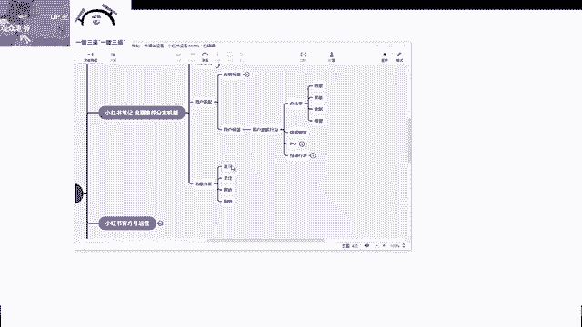

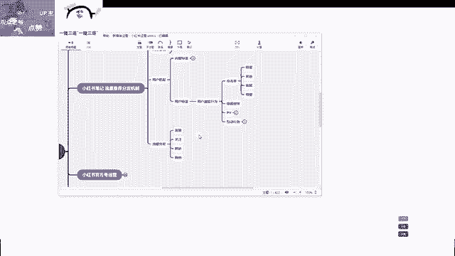

关注的用户我们可能直接去关注列表里边去找他了啊，不过呢有些人现在点关注呢，那基本上都是几百个上千个就有时候找不到。那么这个时候呢，也可能在我们的关注页里边，他会去给你推荐去给你呃，你也可以去这里边找到。

好吧，这个我先列一下啊。

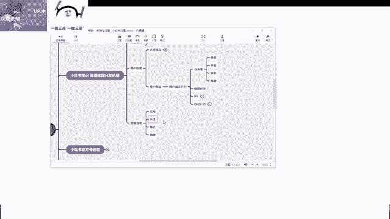

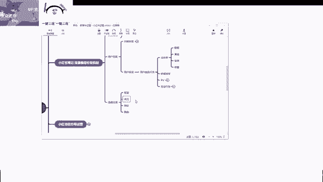

关注达人。

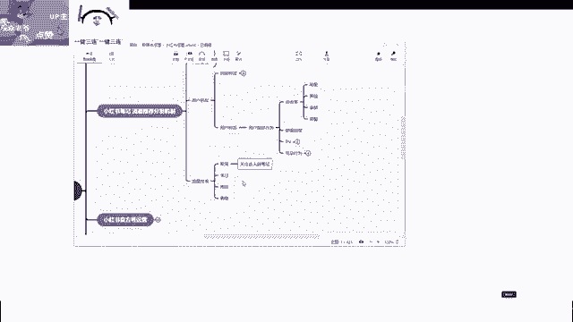

OK然后还有。

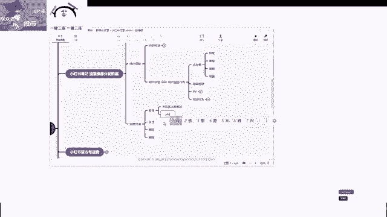

兴趣内容匹配。OK然后是发散性内容匹配。这是关于发现。那么关注页里边就一个啊，就是我们关注的达人的笔记。OK那么附近是什么的啊，附近其实这个附近呢呃我们都应该知道。

就是早期呢最早呢是由这个微信啊提出来的这个附近人。那么小红书的它附近也是一样的道理啊，类似的这种形式。附近呢就是展现啊，根据我们的手机定位给我们推送附近同城的内容啊，这种呢一般就是附近这一个板块呢。

一般是以美食当地旅游啊等等等等这种比较强地域特征的这种需求的内容为主。那么像我们做小红书一些线下店的一些推广啊，你比如说美容美容院等等啊，然后一些啊其他的美食啊，当地的一些这种。

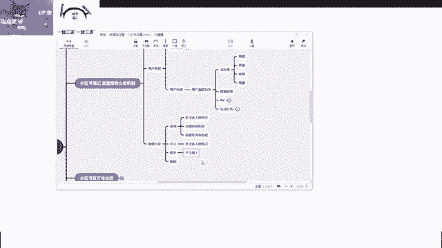

景点啊这种啊这种就是在附近这一块推荐的板块会比较高啊会比较高。

啊，根据手机定位。推送。

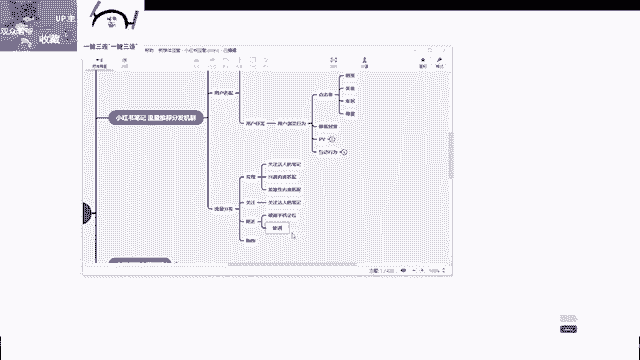

附近以及同城相关的内容。

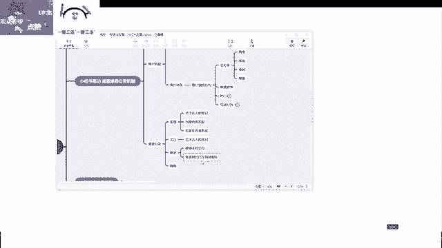

那么如果我们屏幕前有同学后期你是要做线下实体店的，你想通过小红书来做，那么附近的话，你后期在做这个小红书的信息流广告的时候，你就要多注意一下附近人群的这一块兴趣的一个推送。好吧？那么购物我就不说了了。

购物这个大家应该都知道啊，购物这个入口呢属于是小红书变现啊，以及小红书现在往商城电商方向发展的一个入口。就是呃还有部分人群啊，现在在小红书上还没有形成这样一购物的一个强习惯。

可能更多人呢还是在于传统电商平台和抖音上面小红书呢呃现在电商啊，就是搞直播带货的，可能还比较多。你要说直接进入购物里边，商城里边去搜索某个，那还比较少，可能很多人还是想去搜索笔记，对不对？

当然笔记呢小红书现在笔记大部分用户也在吐槽这个广告出现的频率太高了，你有时候想推荐一个东西，以前大家都是纯众房的现在呢好多都是假动头，对不对？啊，购物呢就是匹配这个我们的购物需求。

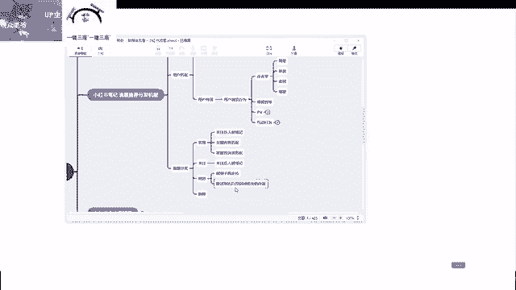

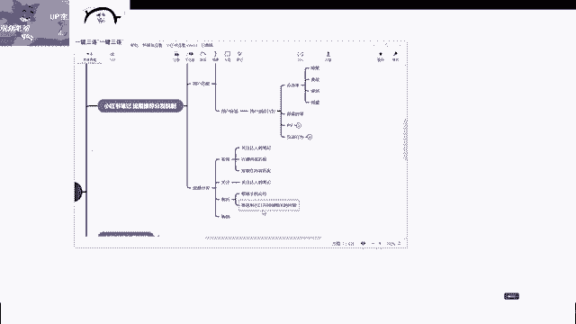

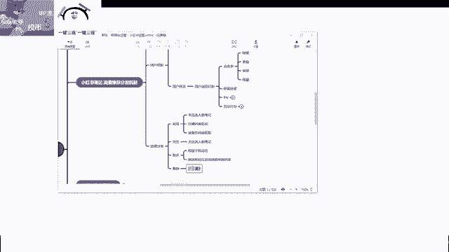

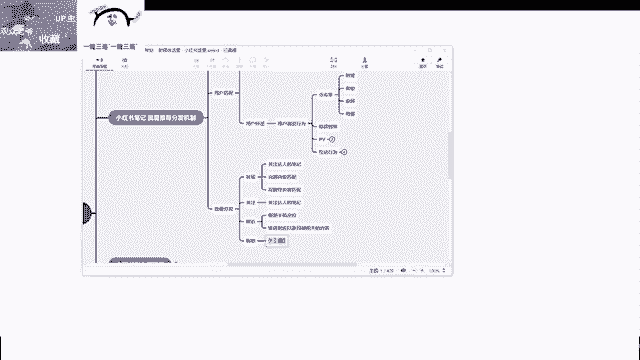

那么通过这么三节课啊这么三节课，我们就跟大家聊清楚了。小红书的整个流量推荐的分发底层逻辑。我相信这些内容很多，你们在其他地方都没有听过啊，或者说你没有了解那么清楚。那么我这个课啊。

我这个系列课的目的就是不讲废话，也不讲一些其他别人讲的不要的东西。我这里呢就是把你们很多不懂的东西啊，但是很重要的东西，我清清楚楚的给你讲出来，给你罗列出来。O那么这是关于我们小红书笔记流量啊。

以及我们的一个。

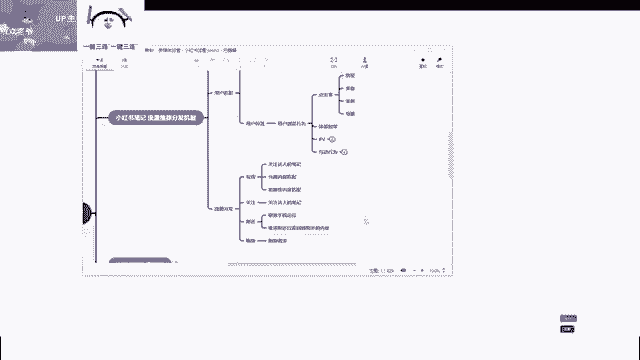

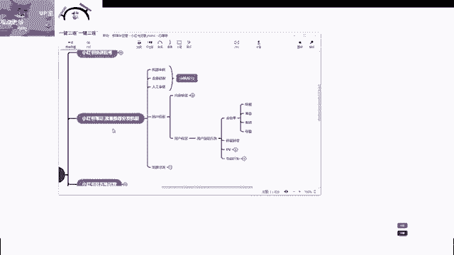

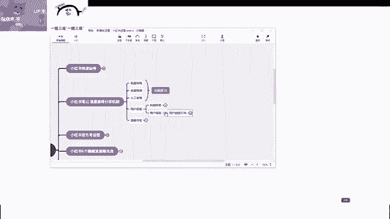

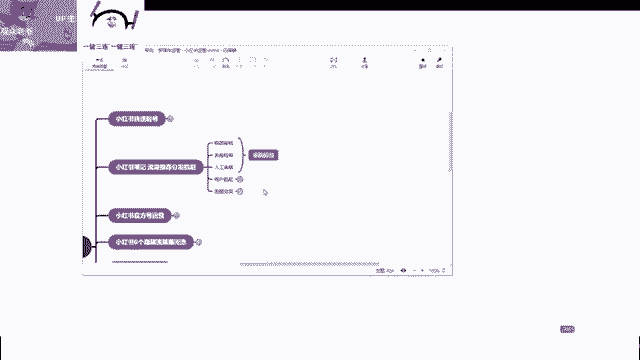

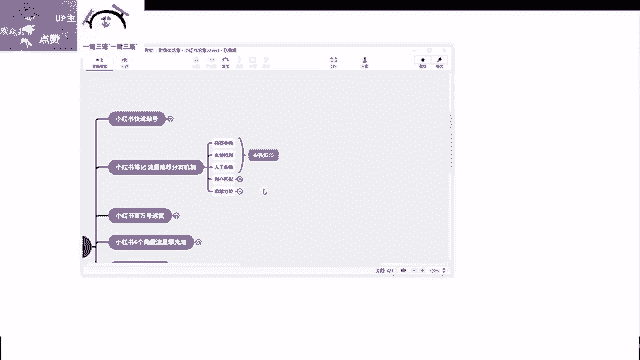

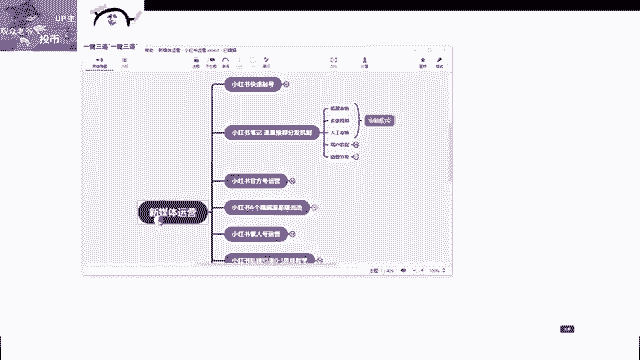