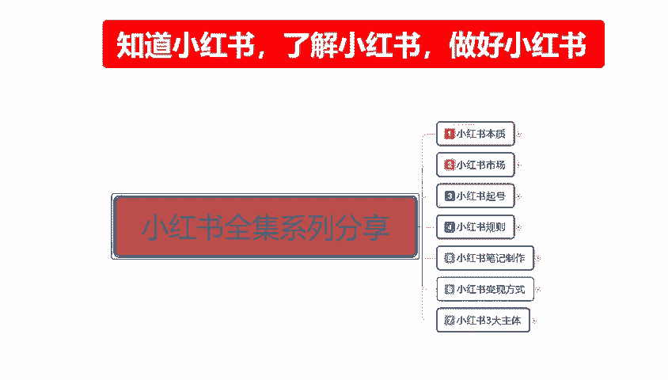
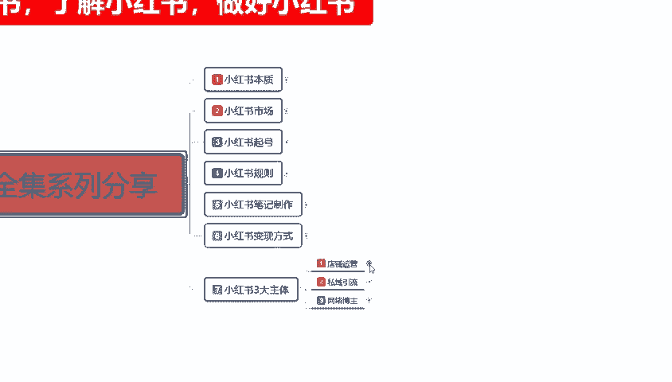
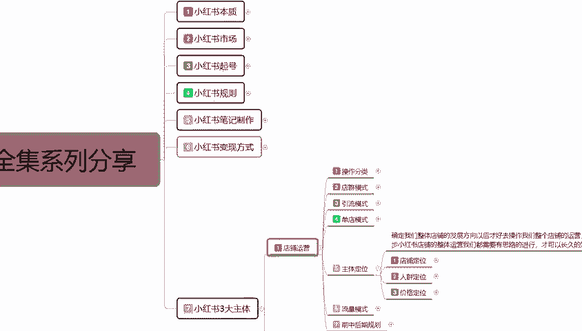
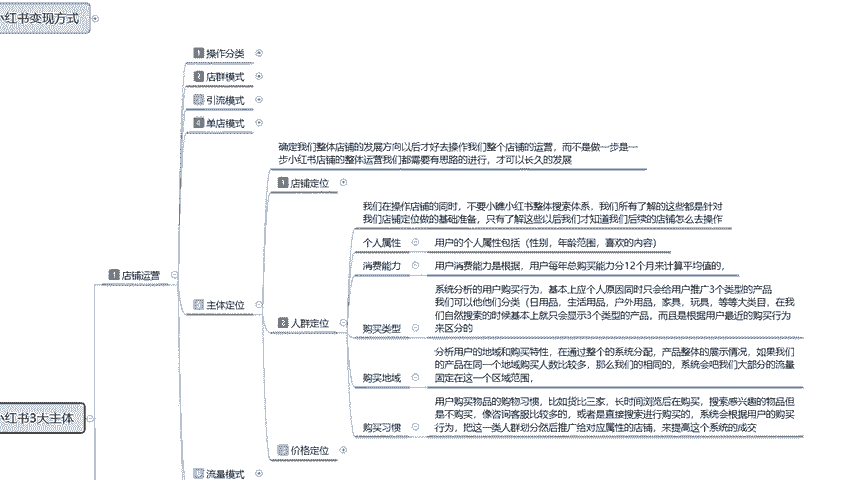
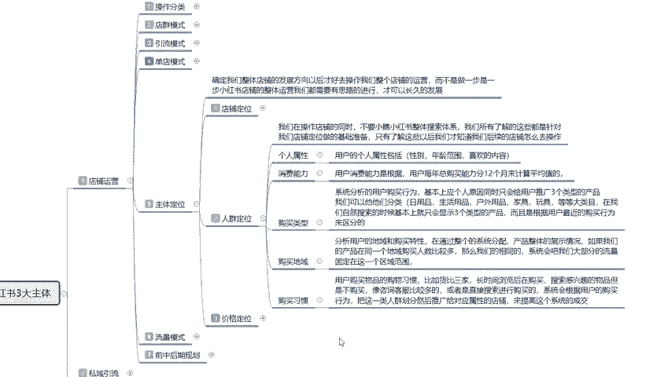
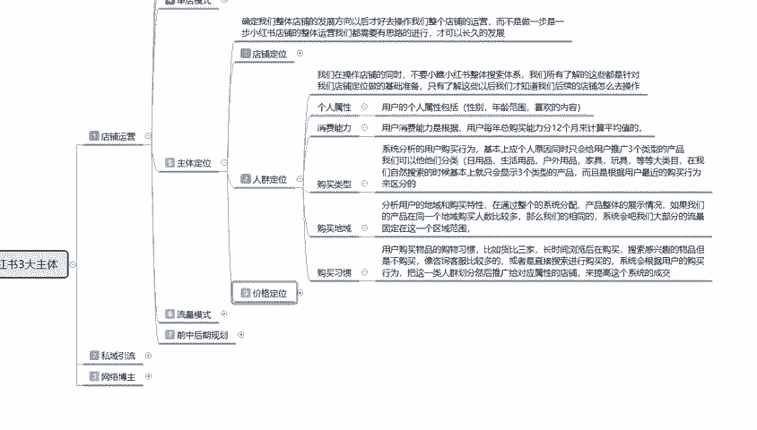
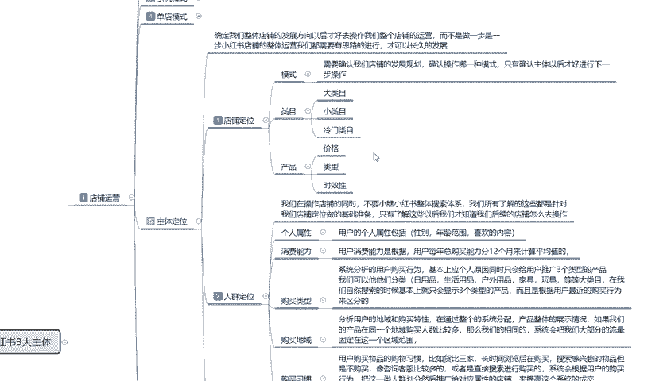
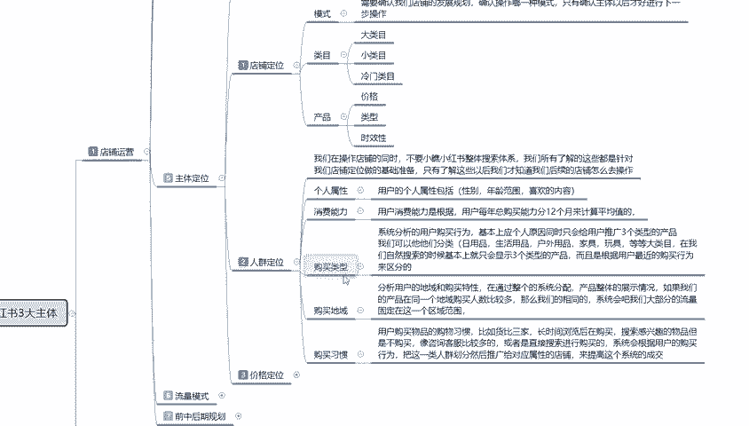

# 【全199集】强推！！2024（全新）最保姆级小红书运营自学教程，小红书起号到爆款店铺打造必学全套运营流程，新手开店必看！拿走不谢，允许白嫖！ - P24：17.新手小红书运营-小红书主体定位（2） - 木吉木更小姐 - BV1Sop5e6EVE

大家好，今天给大家分享的是小红书全集系列啊，三大主体的一个课程。这节的话主要是给大家讲解一下我们小红书店铺运营里面的一个。

人群定位啊。

小红猪店铺人群定位的话，其实。

和账号的定位差不多，但是它这个的话是属于整体的一个人群内位。我们在操作店铺的时候，就说不要小瞧小红书整体的一个搜索体系。我们所了解的这些的话都是针对我们店铺定位做的一个基础准备。只有了解这些以后呢。

我们才知道后续的店铺怎么去操作啊。首先呢是个人属性，用户的个人属性，包括性别年龄范围和喜欢的一个内容。其实这个我们在操作之初，它和选店铺的一个店铺类型其实是差不多的。啊，个人属性。

用户的个人属性就是包括性别年龄范围和喜欢的内容。我们小红书。坐店和做账号不一样啊，之前给大家说的都是账号的一个起号。账号起来以后的话，你的一个店铺运营也要匹配账号的一个属性，你才好去做推广。

你如果说光做了店铺的一个属性，你不光做了账号的属性，不去做店铺的属性的话，你后续店铺的一个人群的话，它引流的人群也是不一样的。你要两相结合。你才好去做。所以说我们在这个里面的话。

一个用户的个人属性里面啊性别年龄范围和喜欢的内容啊，就要根据产品去选了，懂意思吗？就是他是相互性的。😡，之前我们做账号的时候，你只选了一个特定的范围，范围的话可能是2到3个年龄阶段。但是在这个里面的话。

我们选人年龄阶段的话，其实你就又已经把范围缩小了。因为小红书上面你做产品做搜索的，它和那个大众的一个推广是不一样的。我们一定要先把人群处境给大家弄清楚，选择方式和之前是一样的啊。

只是现在我们是以店铺来确定人群。就是你根据你的产品去选店铺的一个人群。第二个就是消费能力。用户的消费能力的话，它是根据用户每年总购买能力分12个月来计算平均值。什么意思呢？在小红书上面。

我每个月花费多少钱？知道吧。他不通过这种购买的一个行为。来确认他在小红书上面的一个类似于隐藏的一个嗯会员等级制，知道吧？他购买的一个产品类型，却购买产品的类型产品的一个价格和所搜索的一个方式。

确认着他消费用户的一个能力。所以说我们在定价的时候，你要根据他的一个能力来确定，你才能吸引到这一部分人。下面呢是购买的一个类型，系统分析用户的购买行为的话，基本上是以个人原因。

同时的话只会给用户推广三个类型的一个产品。基本上在小红书上面我们去搜的话，三个类型的一个产品。但是如果说你说的多了，他就可能只给你推1到2个。你说的稍微多一点，浅一点，看的稍微广泛一点才会是三个。啊。

我们可以把它分为日用品、生活用品、户外用品、家具、玩具等等大类目。啊，然后呢，在我们自然搜索的时候，基本上只会显示三个类型的一个产品，而且是根据用户最近购买行为来区分的。就是说因为它的一个。

千知千面的一个原因，在小红书上面，它也是非常明显的。你就我经常说什么内容，它展示的就是什么内容。基本上2到3天就可以定型，你后续要改的话，可能需还需要花个4天左右。

然后的话你才能改到另外一个属性点里面去。但是它同时是显示三个，你再搜第4个，第5个，第6个的时候才会给你去改。知道吧？前三个的话，他不会改，他只是显示多和显示少的一个呃关系。

然后的话就是确认他的一个整体购买的一个。嗯，怎么说呢？人体购买的一个地域吧。小红书系统的话，就是说我们在购买产品以后的话，它那个地域的一个快递，它会遇到什么地域。然后的话它会小红书整体系统的话。

它会根据我们这一个地域的一个区分来显示。你比方说在北上广深这种地方，他们所购买的到底是什么产品，服装一么？行吗？对吧？是食品购买的多，服装购买的多，还是说嗯其他的东西购买的多。它这种购买的多了以后的话。

在系统分配的时候，你比方说我现在的话，我是在四线城市。啊，我在三线城市对吧？我自己做了一个小红书店铺，但是我的店铺的话购买的一个属性刚好符合北京的一个用户。那么我的一个主要人群点的话。

小红书就会根据我店铺的一个属性推广到同时在北京这个地方浏览的用户啊，几率就会偏多。它就是固定的一个系统，然后的话把对应目标的一个产品分享给对应目标的一个人群。这个就是购买的一个地域。然后呢。

是购买的一个习惯。用户购买物品的一个习惯的话呃，也是有划分的。比如货币参家长时间的浏览后再购买，它是根据我们个人用户的一个搜索喜爱来判断的。就是你的兴趣搜索的越多，那么相对应的一个产品推广的也越广。

但是最后的成交。说实话，你这个这个过货比商家的话，你不管它是怎么比在你的店铺看了，没在你的店铺购买，去别人的店铺购买的话，那么下一步推广的时候，推广别人店铺的一个属性。

就会比推广你店铺的一个属性要高得多。有意思吧？以前的话我们做其他平台的一些这种呃。怎么说呢？销售。都有这种互相伤害的一个行为，就是呃找找一帮人啊，先浏览同行的店铺，然后找到定点目标去浏览。

然后的话来我店铺成交，会把别人的店铺接近10%到15%，到后期会越来越多这一个流量引入到我的店铺。因为显示的话就是我的店铺数据比他好。啊，在他没有成交的店铺在我成交了。这种的话以前是一种竞争对手。

竞争手段，但现在的话不是太适用，但是他也有这种这种一个潜意识一个影响啊，所以说我们还是要注意一下。这个就是人群定位里面的一个用户购买习惯。

就说我们整体来说的话，就是我们在做店铺的时候啊，首先的话就是。

店铺定位。啊，选内幕产品。啊，价格的话我们先了解一下定型，然后的话产品时效性保持好，往后续走，就是人群定位啊，把个人的一个属性选择好，消费能力选择好购买的一个类型，购买的一个地域购买的一个习惯。

这个是系统匹配的。

往你想往大的地方做，你就把这三个点了解一下。你不想往大的地方做。你只说我先习惯一下，我习惯一下整体的一个节奏。那么我们这三个点你先了解一下就可以，暂时的话不需要跟着去做。因为的话如果说你在去做的话。

那么你产品特定人群的话，就是我们做笔记的时候做推广的时候，它的一个人群属性的话，就会。推广精准是精准的，但是数量会变少啊。你比方之前的话可能给你2000到3000的一个展示量。

那么如果说我们做了这个的话，可能只有怎么说呢？自砍一刀1000左右啊，可能砍不了一半。但是他的一个人群属性的话会比那2000的要精准。但是我们前期做推广的话，如果说你想拉特定的一个范围型人群的话。

这三点先不要不要着急去做啊，把前面这几点做了就行。这个就是店铺定位和人群定位的一个综合应用的一个方式。包括后续后续的话还有一个价格定位。价格定位的话说实话，就这这三个内容的一个延伸，好吧。呃。

这一节呢就给大家分享到这儿。下一节的话给大家讲解一下价格的一个定位。价格定位的话就是。定位了价格以后，你才能定位这三个东西。这三个东西购买的一个类型。

购买的地位购买的习惯就是靠价格定位和其他的一些综合啊进行匹配的。如果说你前期不想做这些东西的话，那你就自己定啊，这个的话都是不影响的，看我们自己怎么去选。因为前期把这几个东西做了以后的话，你的说实话啊。

你的店铺小红书账号，还有店铺里面的一个流量属性的话，会减少进营一半。但是你做了以后的话，你的后期后续提升数据的话会比较好一点。只是前期的有一些影响。

那这一节分享呢就到这儿。