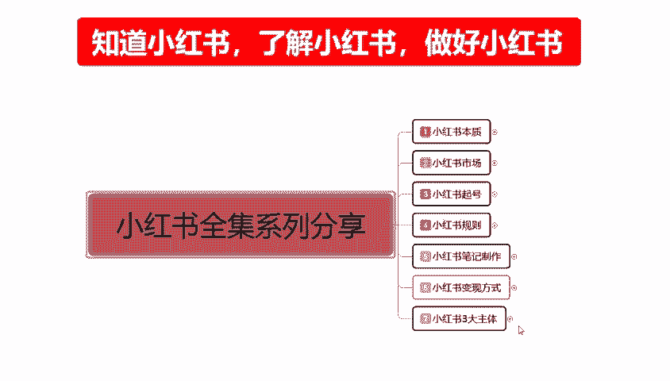

# 【全199集】强推！！2024（全新）最保姆级小红书运营自学教程，小红书起号到爆款店铺打造必学全套运营流程，新手开店必看！拿走不谢，允许白嫖！ - P25：18.新手小红书运营-小红书主体定位（3） - 木吉木更小姐 - BV1Sop5e6EVE

大家好，今天给大家讲解的是小红书全集系列分享第七大课时小红书三大主体的一个内容。嗯，这节呢给大家讲解一下。

店铺运营里面主体定位的第三节课啊，价格的一个定位。之前呢也给大家讲课的时候，也给大家说过了啊，价格定位的话，它其实就是定位我们人群定位的后三个内容呃，购买类型购买地域和购买的一个习惯。

他确认这三个类型的。

那我们来了解一下什么是价格的一个定位。产品的价格定位的话，是确认了我们所面对用户是什么类型的。我们需要确定做店铺人群系统才会给我们对匹配对应的一个搜索人群。如果说我们不做这个的话，就是不做价格系统定位。

我们该怎么做就怎么做的话，那么我们就没有购买类型，购买地位和购买习惯的一个呃内容进行分享。那么我们的基础流量曝光的话就会变多。但是我们特定的店铺整体人群的话就会偏移。呃，你前期如果说做这个东西的话。

你的前期可能会困难一点，但是后期会好操作一点。但是你不做这个的话，你前期会简单一点，后期就会难一点。因为你后期的话要把这个购买类型的一个价格人群拉回来的话，你需要长时间的一个累积啊。

它不是短时间的那拉过来的。就看我们自己怎么选择啊，你的你的推广路数的话。推广度数推广方式的话，看我们自己大家你到底往哪个方面去靠啊，因为本来就是主体定位。你定位好了以后，你才能去做。你定位不好的话，你。

不好做。那我们首先来了解一下。

产品价格确定了我们所面对用户是什么类型的。我们在这里面的话就先来了解产品价格定位，它三个对应的一个分类，三个对应属性分类属于三个不同的一个店铺操作模式啊。它首先是分级。

低级、中级和高级分别对应的是产品的一个折扣价格。就我们在小数上面你打产产品，你的一个卖价折扣初始价格，它就确定了我们三个阶段的一个嗯。怎么说呢？就是对应的用户人群。地址。😡，中高三个阶段。

低一的话是三则以下。啊，中的话是53折以上到7折之间。就是456啊，它都在终端产品的这个范围之内高的话是7折以上789十。什么意思呢？七八九0的话系统就会认为你的产品质量还是可以的。

他会把你分到高端产品这个范围内。在这个产品范围内的话，我们做价格的话是比较好做的。终端的话就是456这三个阶段，这三个阶段的话，我们去做产品的话，它就会把你的产品列为终端。我们之前说过了啊。

你在小红书上面定位的话，你选人群的时候，它有消费习惯，有购买类型，购买低于，对吧？它是通过。购买的一个价格对人群进行的划分。例子方来说呃，我是一个小红书用户，我经常在小红书上面购买三折以下的产品。

什么特价呀、特惠呀、一折呀、两折呀，限时折扣啊，那么我就是低端用户。同等的在456折这个范围之内，我购买的基本上都是这一类的产品。那我觉得中端用户。但是小红书上面的话，我们做高端的其实是比较多偏多的。

因为789折的话，对于小红书的女性来说啊，因为整体女性18到35这个范围以内的话，他们的一个消费能力是非常强悍的啊，不要小瞧他们。所以说你只要保证产品的质量不充问题。我们做高端的一个折扣价也是非常好做。

这个就看我们自己怎么去选择我们购买类型和地位人群啊，分别对应的三折5折7折低中高三个三个阶段啊，看我们自己怎么给自己主体一个定位。基础的一个定价就是说产品的一个。价格设置啊。

它的话就是利润是在1到3倍之间。你不管放到其他平台啊，放到其他任何地方。你的一个你如果说你的基础低价设施不好啊，稍等。刚刚鼻子有点不舒服。就是说我们基础定价产品的一个基础定价的话。

我们在前面选择好了一个呃店铺定位里面选择好了类目，选择好了一个产品。

个人属性、消费能力这三个点你们选不选是你们自己的事啊。

弄完以后的话，我是不是得给我们自己产品的要设置一个技术定价。那它的一个价格是怎么设置的？其实这个的话还是比较简单的，就看我们自己怎么去分配啊。产品的一个价格设置的话。

一般的话就是说在产品出厂价值的1到3倍左右，什么意思呢？嗯。产品到你手上的话，可能是。拿低一点的做比方嘛，产品到你手上的话，可能是10块钱。那么你去卖的话，最少要卖。20。到50之间。你不要觉得贵啊。

这个是正常的。我们做网络营销的，你的产品价值的话，就是在1到3倍之间给自己留下一定的空间。第一个。这个1到3倍的一个价值的话，说实话他们是把运费啊，保险包括退货退换货的一个概率全包括进去了。

你后续把这个价格如果说定出来以后的话，你基本上就不能再做修改了。价格需要确认的是我们产品的一个基础价值。简单点说，它的一个定价的话就是基础价值加运费加利润。基础价值如果说是50的话，加运费10块。

利润加利润50就是110。那么基础定价是110110的情况下，我们是打7折5折3折，这个范围内1到10折，你自己去打，对吧？那么就确定了我们下一步店铺所走的一个形式。那么我们这么想啊，技术价值是50。

利润是50，运费是10块钱，是110，对不对？我们打789折里面，我们做高端产品，那么你就要代表你的产品质量要好。那你的基础定价的话可能就不在这个范围以内。你本来就卖质量。对不对？

那你的一个一个基础价格的话，我可能给你返到220220打个八九折。那么你在里面的话，说实话我们前期去赚的话。你的成本价就是100块钱，你赚一件的话也就赚个几10块钱，其实是不高的。对不对？

因为你还有里面的人工，你自己的一个投入。你自己的一个宣传，包括你后续的一个售后服务，还有退货等等。那么你现在在看这个基础的1到3倍，大家觉得这位这个价格高吗？这么想的话，其实他就不搞了。啊。

心狠一点就是两倍，心黑一点就是3倍。就看他自己怎么选，基本上的话都是在一倍往上一点点。啊，不会多太多，这个还要看我们自己产品的一个呃技术定价去选的啊，当然了你要打5折呢。你要打三折呢。

那你的基础定价定到3倍过分吗？50块钱，10块钱运费利润150，那么就是210210打3折下来还剩下多少钱？对不对？你210的三折相当于是100块钱，30还剩6070块钱。

70块钱一一单产品你只赚几块钱，十来块钱。你觉得这个价格还高吗？就不高了。你要看算法运用，包括我们自己所结合的一些东西，你自己我们要把会计算啊。首先你也是要会计算自己的一个利润点在什么地方。

你要自己看怎么去做啊，低中高三个三个品牌的一个档次阶段。然后在这个里面的话，就是说商品的价格越高，利润的话它是越低的。啊，这样的话可以提升我们产品的一个知名度。在第一意见组推产品操作店铺数据以后啊。

就比较方便我们操作整体的一个店铺数据，可以得到很好的一个排名。就是我们第一件产品它是不怎么赚钱的。它主要是提升我们账户的权重，提升我们店铺的一个权重，提升我自己的一个内在美。什么意什么意思呢？

就是说我第一件我保证不亏钱的前前提下，保证我的生活能过得去。啊，可以小赚，但是不能赚太多。第二件产品。如果说我们是做多单店多爆款的话，你在第二件产品，第三件产品，第四件产品开始你开始赚钱的时候。

为什么你第一件产品已经给你累积了人气信人气度信誉度和一定的老顾客。你做第二件产品的时候，爆发的话，就会非常容易。当然了你做单店单品的话，就不须要考虑这个方面了啊。单店单品的话，你就是能赚多少是多少。

看我们自己的一个主体定位，但是不能太过太过的话，你后续你去开其他的店铺的话，你会觉得这个投入和付出有点不成正比。因为你的数据量做不到啊，这个大家一定要考虑清楚。比如说。😡，整合所有的数据和经验的话。

我在操作店铺的时候，最圈最产钱的时候，其实就是第二件产品。第二件第三件第四件啊第二件是最赚钱的。第三件第四件啊，说实话的对有点信誉下降了啊，看我们自己大家怎么去分配。第二件主产品上架的时候，有一定的话。

就是说嗯前期因为我前期已经把店铺基础做完了，在第一件主产品上面。整体的信用润和力度就已经提升了啊，整体的利润我就可以把它稍微高一点。我可能之前的话我在做第一件主产品的时候。

因为我要提升我自己本身的一个能力和素度，我把第一件产品的一个价格的话可能控制在一倍左右，就是刚好保本赚个人工钱。第二件我就可能会提升到1。5或者是两倍。那我卖一件就相当于是赚一件的钱。

通过这种方式去赚钱的啊。第三件的话，你就不能过分了，你就不可能直接翻到三倍了。你还是按照第二种第二件产品的一个定价去操作的。而且这个定价的话，你说实话第三件产品的话，你再去操作的话，用户会有一点皮视感。

只是说你的这个产品也能卖啊，赚的和你第二的第一差不多，只是。是吧时间长了以后的话，没有什么太大的一个新用户进来以后，你就要想办法提升自己了。有新用户进来，那你还是可以和第二件产主产品一样越赚越多。

你如果说没有新用户进来，那你可能就会越做越少啊，这个就是一个怎么说呢？店铺的一个分水岭，看你后续的一个整体运营规划是往哪个方面去靠啊。啊，有点偏题了啊。这个呢就是技术定价所起到的一个作用。

价格的一个定位。我们这这几。

这几节课啊给大家讲的一个店铺定位也好，人权定位也好，价格定位也好。就说我们前期在操作的时候，你就已经把自己的后续。

的路选好了，你才好去操作。你路不选好的话，你像这我们这里面有分歧的啊，你这个东西做还是不做啊，你的。

价格你到底是三折5折7折，你要去怎么选，你都要有自己的思路和思维去操作才可以。你没有的话，你后期的话，我们你就只能做个简简单单的普通店铺混合时间打打点的内容，你就不好做了。好吧。

这个呢就是给大家讲解的一个价格定位啊，包括这一期的一个主体定位就给大家分享完了。下一节的话是给大家分享一下一个流量模式。

呃，店铺运营的一个流量模式啊，我们要去增强的是什么样的一个流量？那，这一节分享呢就到这里。

