# 【全199集】强推！！2024（全新）最保姆级小红书运营自学教程，小红书起号到爆款店铺打造必学全套运营流程，新手开店必看！拿走不谢，允许白嫖！ - P2：0粉丝做小红书无货源开店 - 木吉木更小姐 - BV1Sop5e6EVE

hello大家好，欢迎来到曾老师的干货客。那今天我要来跟大家讲一下小红书无货源开店，月赚3万的全流程解析。今天这节课程呢时间会比较长，我会详细的来去讲一下。如果你想在小红书开店。

你想一个月赚3万块钱的利润，你应该要做到哪一些事情，我会每一步把它详细的去讲一下。因为前面其实我有去录过一些内容，但是呢可能是讲的其中的一个环节，所以今天我会稍微把它规整一下，全部的挨个来去讲一讲。

好吧？首先第一点就是很多人会觉得说曾老师我是一个小白，我是一个新手，我之前也没有做过电商，我也没有开过任何店，能不能在小红书上面赚3万，你说的感觉好像很轻松一样，对吧？好，那我首先来去给大家去看一些。

就是我们的一些数据吧。比如说大家可以先看这个店铺，你看这个店铺最近30天的一个时间是卖了多少钱呢？这可以大家看一下，最近30天总共是卖了18万，总共18万，然后笔记的支付金额是12万，是这是什么意思。

也就是说这1。

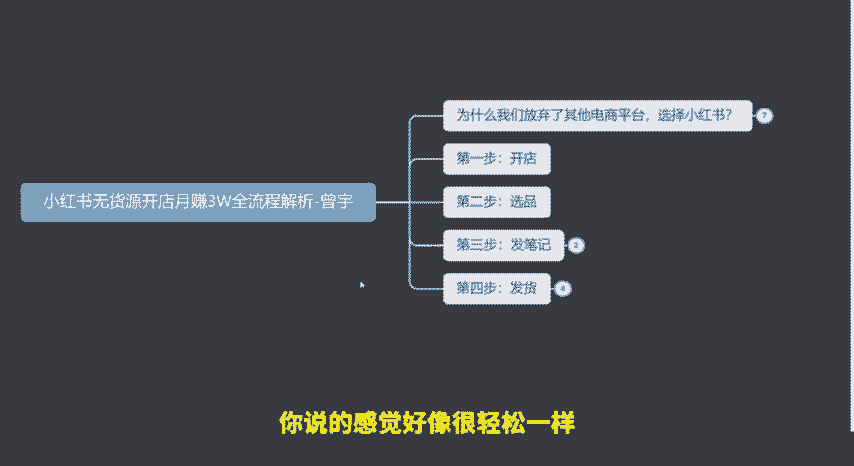

里面有12万都是通过我们发笔记卖出去的，我们没有去做任何的推广啊，没有花任何的一分钱的广告费，都是通过笔记，然后把它卖出去的。我们可以看一下这个店铺做了多长时间，你不要觉得说18万。

好像感觉是不是要做很久啊。这个店铺18万目前一个月的话大概会有5万左右的利润哈。然后我们来看一下这个店铺8月份8月份看到了吗？8月份总共只卖了3000多块钱，这个店铺就是8月份开的。

8月份卖了3000多块钱，然后我们再来看9月份9月份这里就已经起来了。9月份这里就已经卖了11万了。然后我们再来看10月份，10月份卖了13万，然后11月14万，最近30天一共是18万。

所以你会看到其实它需要花很长时间吗？这个店铺从8月份开始开店，在第第二个月，9月份的时候差不多就已经能做到两三万的利润了，其实就是用了一个月的时间，现在基本上就稳定了，每个月大概是卖十几万的样子。

所以小红书开店并不是什么特别难的事情，这也是一个新店，你们可以看到之前前。几个月的数据完全都是0，8月份才开的，8月份卖了3000块钱，对吧？好，那我除嗯除了这个店铺之外，我再给大家看一些其他的店铺。

免得大家觉得说这是一个个例哈。我们再给大家看这个店铺。这个店铺也是开店才一个月，你看这里之前11月呃11月12号的时候，这里你看00000对吧？都是没有成交的。然后偶尔一天啊100多块钱。

200多块钱一单两单的，对不对？好，然后我们来看最近这几天看一天差不多就可以卖2000块钱了，对不对？一天差不多就可以卖2000块钱的。然后现在最近每天大概稳定在1000多块钱。

也就是说这个店铺也是最近这一个月才开的，我们可以看一下，整个11月对不对？你看1月之前都是没有数据的，对吧？啊，之前都是没有数据的，也就是这一个月才开的。

所以说这个店铺你会看到它也是只是用了一个月的时间开始去发笔记，然后现在每天能够去稳定在大概1000多2000的一个销售额，然后算利润的话，这个店铺这一个月下来的话，大概嗯应该能够去做到一个2万的样子吧。

😊，如果是他接下来能够稳定的话，大概能做到2万。那我们可以给大家看一些，这里还有一个店铺啊，都是可以给大家看到一些具体的数据。你看像这个店铺最近30天总共是卖了3万多块钱，对不对？好。

我们来看一下这个店铺之前做的怎么样呢？之前整个10月份卖了200块钱。然后我们看一下11月份卖多钱，11月份开始起来了，起来一点点卖了8000块钱，对不对？最近30天卖了3万多块钱。

我们来看11月12号的时候也是零对吧？销售额也是几单几单几单，然后一直在发笔记，发笔记开始慢慢慢慢稍微好一点了，然后在上一周的时候，哎，这几天稍微开始已经有了一个小高峰，笔记报了一天能卖500多块钱。

维持了几天，然后这几天的话，每天大概是卖2000多块钱，一个月下来的话，像这个店铺大概也能做到一个呃五六万的利五六万的销售额，然后利润的话大概能达到2万多块钱，然后这都是新店。

你们可以看到它之前都是没有数据的，对不对？这都完全完全是新店，整个10月份啊，前面都是没有任何的数据，对不对？你看6月份7月份二3月份全部都是零都是新店做起来的。所以大家要知道，就是小。😊。

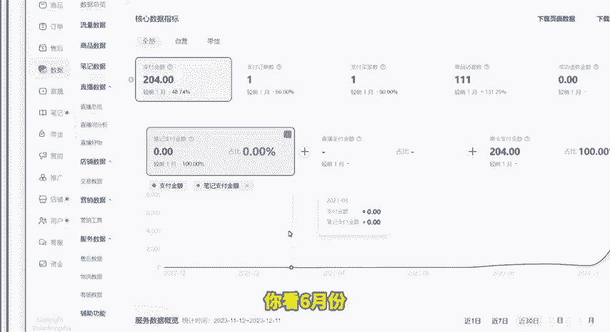

红书现在你在这个上面，你想去赚到3万块钱，其实是能去做到的那这里我就要去讲一下，为什么我们放弃了其他的电商平台，选择小红书来去做。因为我们以前不管是淘宝也好，抖店也好，多多也好，我们这些平台都做过。

那为什么我们其他的平台我们现在不做了，我们现在主要更多的来去做小红书，其实也就是这样一个原因。第一个嗯就是小红书目前的一个资金低门槛。呃，了解我的同学就知道，其实我自己现在我们也有开了几个店铺了。

那为什么我们可以去批量的去复制很多店铺，包括我也在鼓励我们的学员可以去多开一些店铺。像之前有个那个学员他女装店做起来了，我就建议他再去开一个百货店，因为百货店的退货率的话，就会要低一些，做起来会很轻松。

原因之一就是小红书目前的一个资金低门槛。这其实你在小红书开店，它是不需要你花钱的。因为如果开过店的或者做电商的小伙伴就知道你去多多上面去开店保证金1000块钱。淘宝上面开店保证金100。

抖店上面开店保证金2000。就是你去任何的平台开店，它都会有保证金。但是目前在小红书你去开店的话，它是不需要啊，不需要交保。不需要保证金的。所以这就是我们现在可以去呃复制很多个店铺。

也不需要去花太多的时间，也不需要去花太多的资金。这是每个普通人都可以去做的。所以少数目前是一个可以每一个人都可以去来做的平台，因为它没有一个这种门槛，而且零粉丝就可以开店嘛。第二个就是它的流量门槛很低。

什么叫流量门槛很低呢？就是你做其他的电商平台。那你现在基本上都会需要广告费来做推广，甚至于说叫做销量。什么叫做销量，做假的销量，对吧？比如说你做多多也好，你做啊淘宝也好，这些平台你不可能不去做销量。

你要还要花广告费去推广。这个对于新手来说，它的门槛也好，成本也好就会很高，对吧？很不是所有的人一上来之后，当我们还没有赚钱，他就愿意去花钱的，很多很多的我们特别是新手，肯定是希望说我先赚到了钱。

我再去花钱。如果一上来之后，先让你花个一两千去做推广，我相信大部分人是不愿意的，但是小红书目前它的一个流量结构跟传统的或者说我们以往的电商平台是不一样的。就是小红书目前的流量只需要靠发笔记。

加上你的笔记的技巧，你就可以做起来。比如说我们来去看这个店，你看这是我们刚刚看的那个店，总共一个月卖了，总共最近30天卖了33000多。然后这里面其中27000多都是。

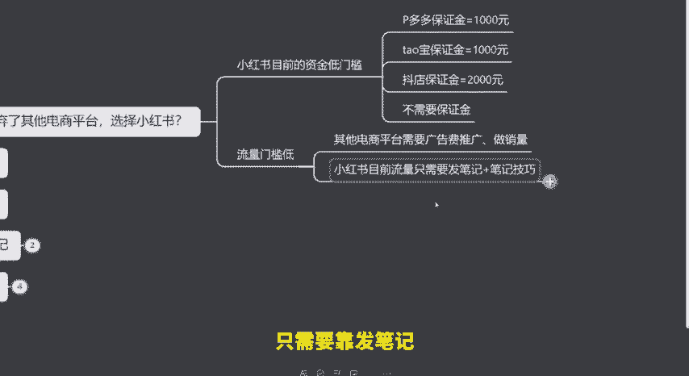

发笔记来的。就是如果我们新店刚开始去做的时候，你会发现你基本上所有的销售额全部都是通过发笔记来的。当你的店铺越来越稳定，越来越稳定之后，那那你的店铺就会有其他的一些流量来源。

这些流量来源也是小红书给你的，也不需要你花去花广告费。就比如像这个店。那么他一个月卖18万，它有6万块钱，它是通过小红书的其他的流量渠道来的，比如说别人搜索你过来的啊。

或者说是呃其他的一些就是小红书商城，比如说你可以看到这个地方叫商卡支付金额，这个就是通过商城过来的。小红书的一个商城，然后12万是通过笔记啊过来的。所以说其实你会看到我们今天做小红书。

你不需要去花什么广告费，你也不需要去做销量，你只需要去掌握发笔记和发笔记的一个技巧，你就可以来去出单。所以这是我们现在去花很大的时间在小红书上面的一个原因，就是因为小红书现在门槛很低。好。

那我们说了了解了这些之后，我第一步我想在小红书上面去开店，怎么去做。打开我们的小红书，你看我这里准备了一个什么零。

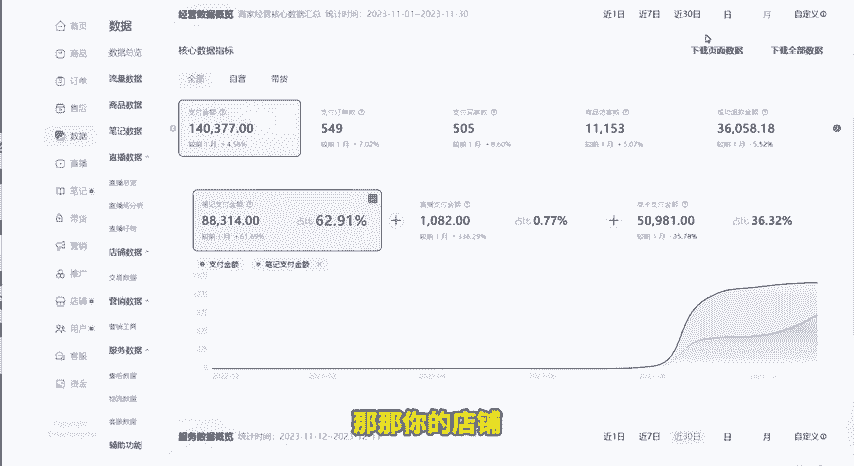

粉丝的一个账号，这是一个完全的一个信号。就是目前小红书开店的门槛低到什么程度，哪怕你是一个零粉丝的一个新号，你也可以开店。我们在哪里开店呢？在小红书这个地方，小红书的主页这个地方，左上角有一个三条横线。

我们点一下这三条横线，我们会看到有一个东西叫做创作中心。我们点一下创作中心之后，这里有一个更多服务啊，注意我的每一步操作。然后这里就会有一个叫开通店铺，开通店铺，我们点击之后。

你就会看到它这里就会有一个立即开店。为什么说小红书现在其实开店会特别是对于新人来说都会比较好做。因为现在其实你看小红书它这里又已经跟你说了，0元开店服务费优惠流量扶持。所以这个不是我讲的。

是小红书跟你说的，所以现在小红书开店的话，其实机会还是很大的。那我们点击立即开店之后，它这里会让你去进行一些选择。那你可以去选择。哎，我们重新点一下，那你可以去选择个人店、个体店或者企业店。

那这里的话我就建议大家选择个人店。因为这些呃这不体不管你有没有营业执照，你个人个体店和你的个人店其实都是一样的，没有什么差别，选择个人店，用你的身份证就可以开了。然后点击下一步。

点击下一步选择你想去做的类目，我们这里选择电商商品，你想卖什么类目，你就选择什么类目。比如说我想卖服饰鞋包，家居百货，对吧？然后母婴用品，你想做什么类目，你就选择什么类目选好就行了。选好之后。

那么你接下来继续点击下一步，上传你的身份证，就可以把你这个店铺开好了。这里我就不详细给大家去做演示了。因为这一步很简单，我们不在这里去浪费时间。好吧，你打开你的小红书去照着去操作。

只需要把你的身份证上传上去之后，填写好你的信息，那么你这个店铺马上就可以开好。所以这是小红书目前来去说对新手很友好的一个地方啊，它的开店够简单，而且是马上就可以开好。那么当我们开好了店铺之后。

接下来才是最关键的，就是我们怎么样能够去把我们的产品卖的出去。第一步不要着急，我们先要去。

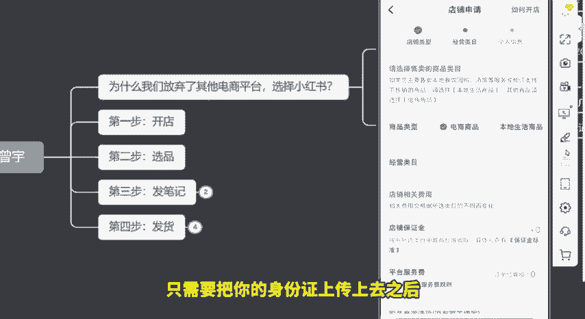

选择产品，因为你选择什么样的产品，这就决定了你未来在做的时候，它的难度大不大。比如说你今天去做母婴用品，跟你做服饰鞋包，其实它的难度可能是有差别的。很多人为什么刚开始的时候出不了单。

其实就是在于他们在选择产品的时候是选择错了的。那之前呢就有小伙伴给小伙伴给我发消息说，他说曾老师，我选了一些产品，然后也开了店上架了之后，但是就是为什么不出单呢？然后我就去看了一下他的店铺。

我就看了之后，我就发现我说你的产品是怎么去选的。他说我也我也不懂，然后我也没做过，也没有去学过。然后我就去看多多上面哪些产品卖的比较好，然后我就上架的。其实很多人都会在这里哈，我可以这么去说吧。嗯。

如果是新手的话，基本上98%的人都会在这里去犯错。为什么呢？因为很多人选择产品上面都是乱选的，都是就是凭感觉，我一直在说，如果你今天凭感觉你选的产品你能卖出去的话。

那么其实这个概率就跟你中奖的概率是差不多的，就是这么简单，所以大家不要去凭感觉来选产品。如果你去凭感觉的话，那基本上就等于说是什么呢？就是买彩票，你就等着相当于就是你去等那个中中奖的概率。

那你觉得你能中奖的概率能有多少呢？对不对？好，那我来去说一下我们是怎么去选产品的。首先第一个我们选产品的话。我们不是说去凭自己的一个第六感，我们一般会去参考一些工具。那我给大家看一下。

就是我们一般会参考什么工具。这里我就不去把这个工具的名字露出来了哈。因为避免大家觉得说我是打广告。因为我之前也有说过，在我前面的视频里面说过，如果你想要这个工具，你可以直接来找我，我直接给你送啊。

我可以直接给你送几天的，这个都没关系。因为你自己去买，你可以看到这个上面呃，10021个月哈，1021个月都是100多块钱一个月。但是如果你想用的话，或者你想那个的话，你直接找我，我可以给你送7天。

这个都没没没问题的，本能帮大家节约一点算一点，你看我们选产品，我们一般会选什么呢。比如说这个是我们参考抖音的一些热卖产品，我们可能会去看抖音上面哪一些产品是热卖吧。比如看这个抖音的视频热推吧。

这里面有具体的类目，对吧？比如说母婴用品玩具然后文创各种各样的一些类目，你是做什么类目呢，你就在这个里面去挑。比如说我们看月榜，那这就是这一个月里面，整个抖音上面卖的最好的。

那么这些产品是不是就是给我们做一个参考，对吧？它就是。

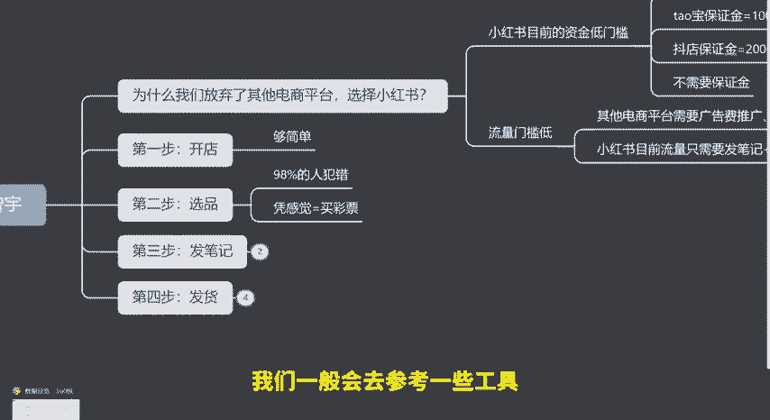

来告诉我们，目前别人已经有哪些产品卖的比较好了，那我们就可以去参考我们来去选这个产品，我们就来去做这个产品。所以这个你如果去选产品的话，你能有一个工具来去帮你去选。

相当于就是你有一个给你做开卷考试一样的啊，你有一个答案可以去照着去抄，所以我们选产品的时候，我们一般都会去参考这个周版或者月版，然后我们是做什么类目的，然后我们就在这里面去挑啊，因为你自己去想。

你是想不出来的，对不对？这个时候我们会参考抖音的数据，那么还有一个工具，我们会直接参考小红书的工具。比如说在这个里面你可以去看到这个里面它会有什么呢？就是我们会看第一个也是看类目，对不对？

比如说我是做母婴的那我就可以去点一下这个母婴，选好母婴之后，我们选一个这个东西叫做低粉报文，什么意思呢？就是同样的别人粉丝数很低。然后他发了这个笔记就报了，我们就参考低粉报文。

那这个时候我就在这个里面去找，看看这里面有没有一些产品是比较不错的。这里面大家首先要看到哈这里面的所有的这个榜单里面都。都是已经报了的笔记。那我们就看这个里面报了的笔记里面有没有一些产品。

比如说我们来看这个。你看这篇笔记。这篇笔记总共大概是12万的阅读，对吧？一万的点赞，它是一篇豹文了，然后它是什么呢？它是一个帽子，对不对？你看婴儿帽子，那这个时候你我们来想一想。

我们可不可以去做这个婴儿帽子。你看评论里面评论里面说啊，宝宝好可爱，帽子也很喜欢是在哪里买的，对不对？然后第一个有链接吗？对不对？

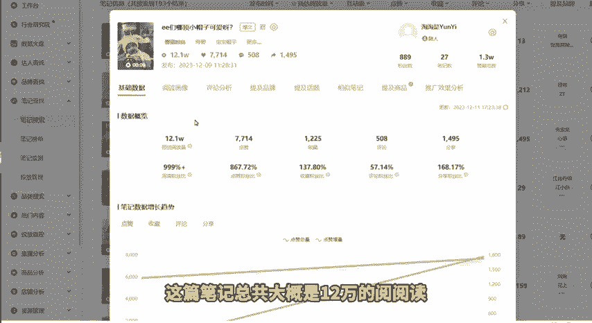

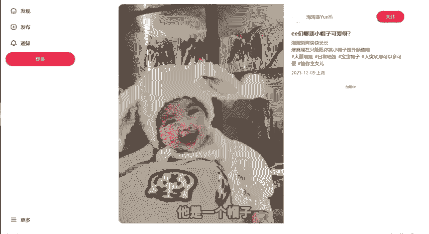

然后等等等等。你看我好喜欢这个，对不对？😡，啊，给我来两个，对不对？😡，所以你可以看到，我们可以去通过看别人的笔记，就找到哪一些产品是好卖的那这个产品你看这个它只是一个用户去分享的，他并没有挂链接。

那我们可不可以去卖这个产品，你会看到有很多人都在问，对不对？然后你看他说都是在1688上面去买的。然后第一个是哪里哪里哪里的，其实他自己并没有卖，对？那我们是不是你看他把供应商都告诉了你。

我们是不是就可以去拿这种货来去卖，我们最简单的，我们现在在多多上面去搜一下这个帽子卖多少钱，好吧，我给大家看一下，我。😡，嗯，我们用这个以图搜货，我们多多上面直接有一个以图搜货，我们直接去搜一下。好。

我们播放，我们直接去搜一下。来，我们看一下，我这里已经搜到了哈，你看这里我用以图搜货，对不对？视频拍出来搜一下这个帽子来看一下这种帽子多少钱。这个帽子我们看到这里有便宜的，大概就是多少钱呢？

就是十几块钱，对不对？各种款式的都有十几块钱的一个帽子。😊，你看是不是收到很多啊，你看像这个啊搞活动，活动，这里价格是多少钱，十几块钱，就十几块钱。像这样一个帽子，我们在小红书上面卖多少钱呢？

比如说它是我们的成本大概是16块钱，刚刚看到了，对不对？我们可以卖28块钱。😡，或者说卖26块钱都可以，对不对？这是不是就我就找到了一个很好的一个产品了？😡。

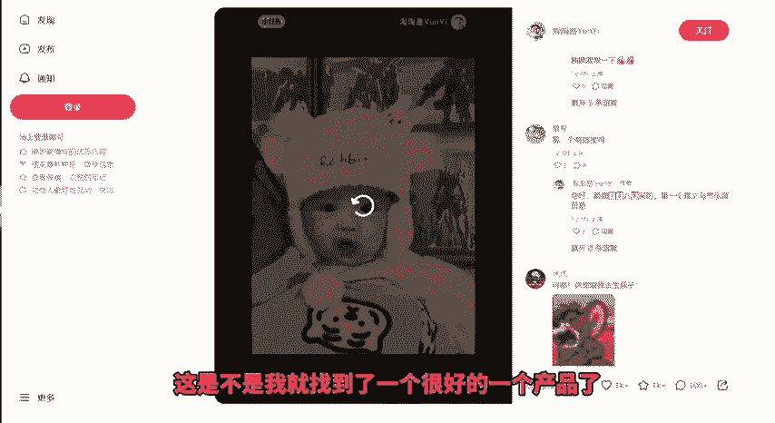

对吧那所以这是我们找货找选选产品的一种方式。好，我们再继续往下面去看，我们可以还可以继续往下面去找哈，看看有没有一些其他的类似于呃类似的一些产品。比如说我们来看这个笔记，这个笔记它是。

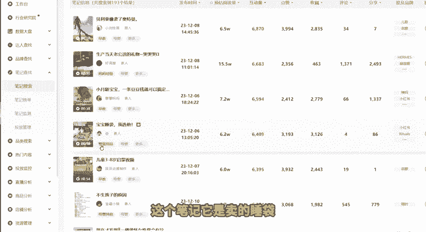

卖的睡袋，你看它这里是直接袭及了这个商品的对吧？直接把这个产品发布了的。然后这个产品它总共大概是卖了200多个，然后预估是卖了3。3万啊，卖了3。3万。然后我们来看一下这个产品。

这个产品是一个什么样的一个产品，我们来去搜一下138块钱一个睡袋。然后我们还是来去搜一下吧。好吧，看一下多多上面卖多少钱。

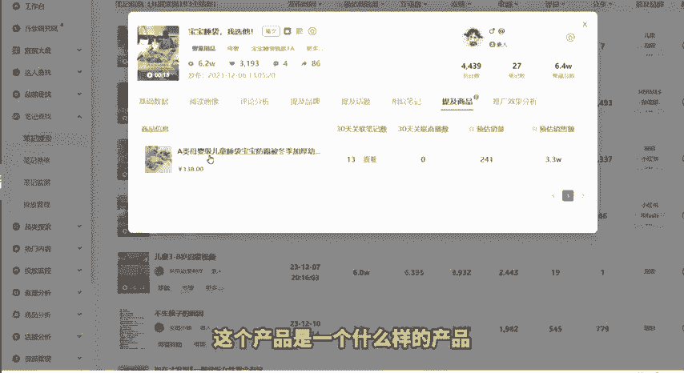

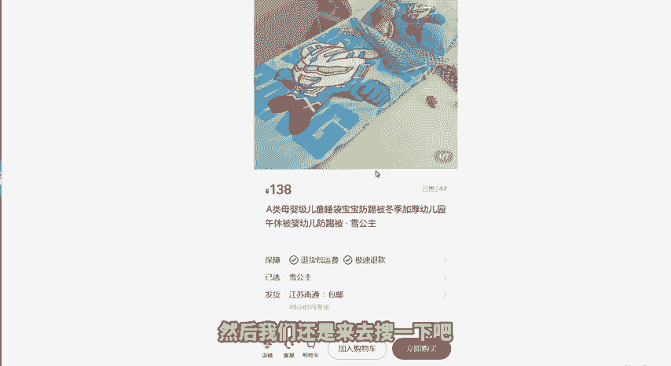

多多商品我这里搜到了，然后大概成本的话是100块钱的样子啊，大概成本是100块钱。然后你看可以看到这里成本大概就是100块钱。然后我们大概这个产品一单就可以赚38块钱。然后这个同行已经卖了244件了。

对吧？其实所以我们在这里我们就可以找到很多同行已经卖好的产品。那这个时候我们再来去跟着他来去操作。如果你这样子一个形式去做的话，你的产品出单基本上都会很快啊，因为我这套模式。

这套方法我们是已经复制给了无数个我们自己的学员都是按照这套方法方法去做的，出单都是很快啊，出单都是很快的。

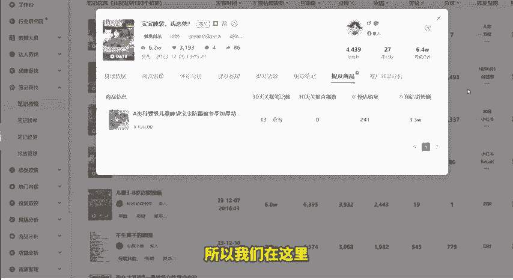

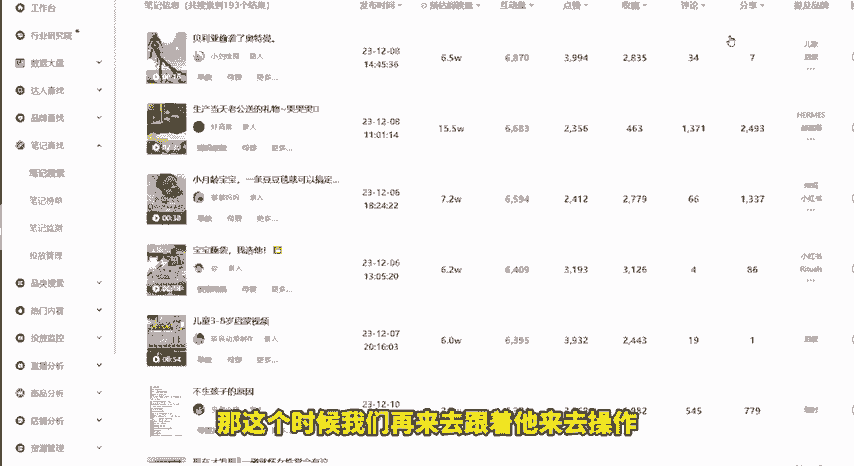

那我这里也找了一个就是我自己带的一个也是12月7号报名的一个学员，他的一个聊天记录。你看前几天前几天反正就是也开始发了一些笔记。然后这是他当时剪辑的一些产品嘛，然后当时去找了一些啊。曾老师。

你看这个品怎么怎么样。因为我一般都会跟我的学员去说，如果你选好的产品一定要发给我，我来帮你去看一下，而不要就是说直接自己去选好之后你就去发布，你一定要发给我，我帮你看一下，然后这个产品到底能不能去做。

他当时找了一些产品，然后发给我，然后说一些问题。呃，他当时。从他是12月7号报名的。然后今天啊昨昨天的时候啊，今天早上的时候跟我说，你看老师我今天早上出了一单，然后就200个小眼睛。然后也是同样的方法。

就是我告诉他你去要去一定要去跟报款，你一定要去找。然后他当时就在呃抖音平台找到了一个啊已经是报了的一那个已经报了的一个视频，然后他自己就去发200个小眼睛，然后就已经出单了。然后我当时就跟他说。

我说你现在总共发了几篇笔记。因为他当时开店，他到现在开店差不多是4天5天的时间。他说总共发了4篇，刚刚发了一篇，一共5篇笔记了，发出去，第一天有100多个小眼睛。

然后总共200多个小眼睛就已经开始去出单了啊，然后早上就已经开始出单了，问我说要不要开运费险啊，我就说告诉他，其实你这个就是什么？就是产品选对了，这个品是OK的那你就接下来就继续去发。

所以只要你的产品选对了，基本上就是你可能呃三天4天或者说一周你就能出单。所以这是我们讲第二步很重要的选产品啊，产品建议大家可以去用工具来去参考着去选。我前面也说了，如果说你没有那个工具的话，你可以来去。

找我领我K给R去直接去送几天，这个都没有关系，好吧，能节约一点。第三步，发笔记，发笔记，这是一个很多同学会很头疼的一个问题。因为很多同学会说，老师我不知道这个笔记应该怎么去写。

首先大家要知道笔记不是你自己去想，我们的笔记都是做二次创作啊，大家要记住这个词叫什么叫二次创作。什么意思呢？就是你不是说我们自己去拍，不是说我们自己去写。那我们的笔记都可以通过别人的笔记。

或者是抖音上的这些内容，然后来去做二次的创作。我还是给大家去举个例子，比如说你看像这个学员，这个学员他当时呃你可以看啊，这是他当时找到的一个产品，然后他就自己去写笔记。然后他说这是我剪辑的啊。

然后我就说你这个剪辑肯定不行啊，你这个剪辑肯定不行。因为你这个剪辑跟别人原来那个视频就很相似，那我们一般就可以怎么去做呢？比如说你在抖音上面。😡，找到了一个好的产品。那这个好的产品抖音上面肯定会有视频。

对不对？抖音上面就会有很多视频。那这些视频我们可以拿来干什么呢？我们可以全部下载下来，下载下来之后做一些二次剪辑，这叫叫做我们的笔记技巧。就是你把它这些视频下载下来，我们做一些处理。作为处处理之后。

就变成了我们自己的原创视频，原创视频变成了我们自己的原创视频之后，你再去发布。这个时候你就通过这个笔记来去卖货。所以明白了吗？我们做笔记是二次创作，不是说自己去写。那笔记是素材从哪里来，我刚刚已经说了。

我们可以通过抖音来，然后我再给大家去讲一点，就是我们以前的一些方式，比如说我们以前当时卖那个手机壳，我给他去搜一下。比如说我们随便搜一个手手机壳。我们当时卖手机壳的时候。

我们很多的一些笔记素材是从哪里来呢？我给他去找一个比较可爱的有趣的一个手机壳吧。

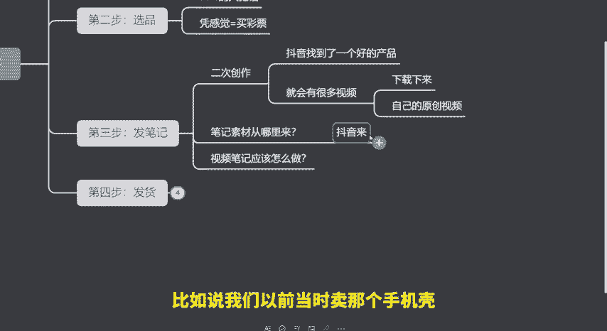

比如说我们来看这个手机壳，我们当时有很多的一些视频的素材和笔记的内容，全部都是从买家秀里面来啊，然后就从这笔买家秀里面。比如说我们找一个比较好看的，我们找一个那种很多女生会用的那种手机壳，好吧。

比如说我们来看这个，然后这里面就会有很多，这个是嗯找一个销量多，评价多一点的哈。就会有很多一些好看的买家秀。那我们就可以把这些好看的买家秀下载下来啊，下载下来之后我们就用这些买家秀。

然后来作为我们的一个笔记的素材。😊，比如说我们来看这个产品，你看这个手机壳，它是不是就会有很多的买家秀，那可能这会有一些真人买家秀。那像这些买家秀里面我们就在里面去挑看哪一些买家秀会比较好看一些。

那这些好看的买家秀就会成为我们笔记的一些素材。比如说我们就会挑一些，比如说好看的小姐姐他们的一些这种自己发上去的买家秀。然后大家可以不用去担心这种你用他们的买家秀哈，然后你来就做成你自己的笔记。

这个是完全合规的啊，不会违规，也不会涉及到任何的侵权，所以大家可以大胆去用。你看像这些比较好看的买家秀，我们就会直接下载下来，下载下来之后发到我们的笔记上面去。所以笔记的素材会有很多。你抖音上去找也好。

买家秀上面去找也好都可以啊。然后这就是我们说第三步发笔记。然后因为笔记怎么去做这一步确实要讲的时间太长了，我今天在这里我就不能去详细的来去说了啊，这个要太花时间了啊，这个这个可能一讲就要讲半个小时了啊。

所以这是我们说第三步发笔记，你只要去做到二次创作就可以了。

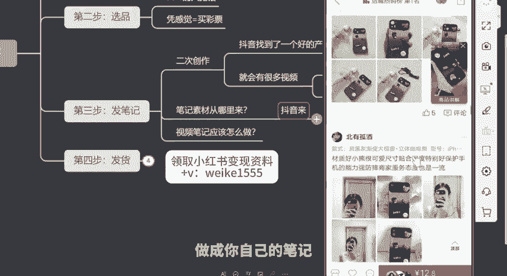

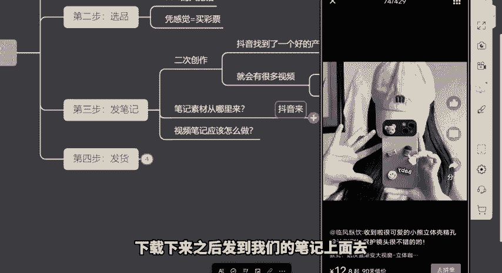

当你的产品没有问题，你的笔记开始去发了之后，第四步出单基本上是顺理成章的。因为这个我们有绝对的自信，我们已经测试过太多太多的店铺，太多太多的产品了哈。只要你前两步第二步，第三步没有问题。

那么你第四步出单这是一个顺理成章的事情，好吧，所以你根本不用去担心。那第四步就是发货了。那发货这一点我就简单去说一下，因为很多的一些小伙伴可能对这个东西不是很清楚，以前没有去做过哈。

首先第一个我们的货源从哪里来的？嗯，货源我们一般都是可以在多多。或者说呃1688就是阿里巴巴。还有什么呢？淘特啊，这几个都可以去找淘特就是淘宝特价版啊，很多同学可能不了解。你们可以去搜一下。

这上面都是很便宜的，产品都很便宜，都可以加价在小红书上面去卖。基本上你翻一倍的利润，在小红书上面去卖都没有问题。我刚刚给你们看的，我们的那些店铺都是翻接近一倍的利润，就至少是30%到40%的利润啊。

基本上都是翻一倍。那我们就可以去找到这些，他都是我们的供应商。然后找到这些之后，当客户在我们的店铺里面下单，他可能会留下一个收货地址，对不对？比如说收货地址是四川成都哪里哪里哪里。

那么接下来我们就去供应商的店铺下单。他是阿里巴巴的，我们就去他的阿里巴巴店铺下单，他是淘特的，我们就去淘宝特价版里面给他去下单，那我们去下单的时候，收货地址就填写客户的四川成都哪里哪里哪里哪里。

然后填写了之后，第三步供应商发货。供应商发货之后，客户就会收到产品。然后第四步确认收货，客户确认收货之后，平台结算，我们赚取的是中间的一个差价和利润。比如说我们经常以前像我们做手机壳。

基本上在多多上面啊，阿里巴巴上面啊，手机壳基本上就是一单7块钱8块钱。但是我们卖的时候都是卖17块钱，卖18块钱，我们就中间赚这其中的一个10块钱的一个差价和这个利润。所以这就是我们整个小红书上面。

你一个月你想去开店，月赚3万的一个全流程，全部的一个流程就这么简单。其实你说它有多复杂嘛，并没有多复杂，对吧？其实是一个比较简单的事情。只是说在这个里面呢可能还会有一些呃细节上的一些东西。

但是我们整个小红书赚钱的一个逻辑和原理，就是这样子。所以今天的话呢，我全部给大家去讲解了一下。

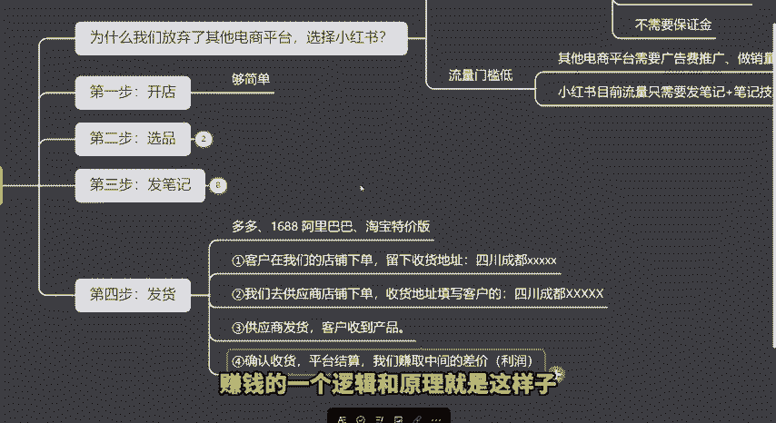