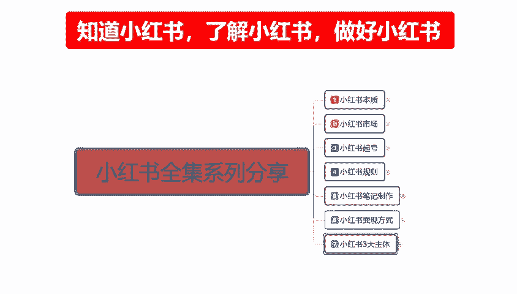
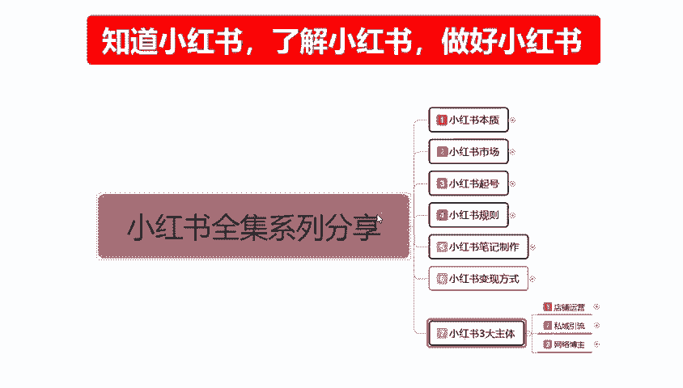
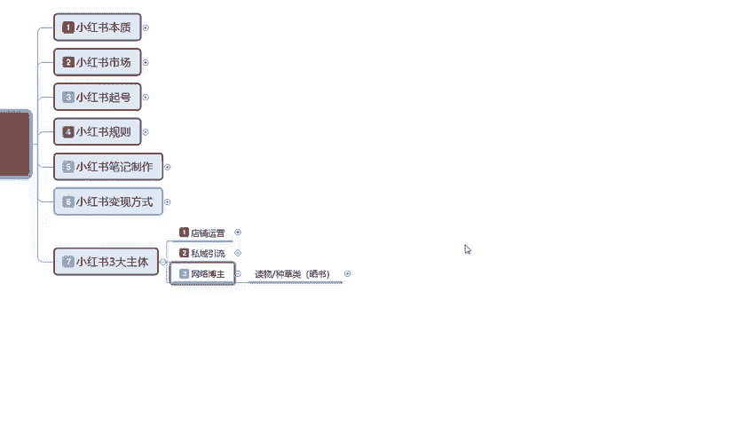
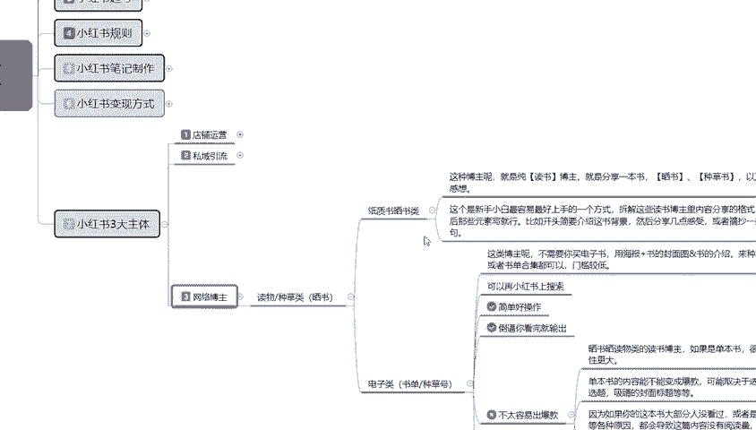
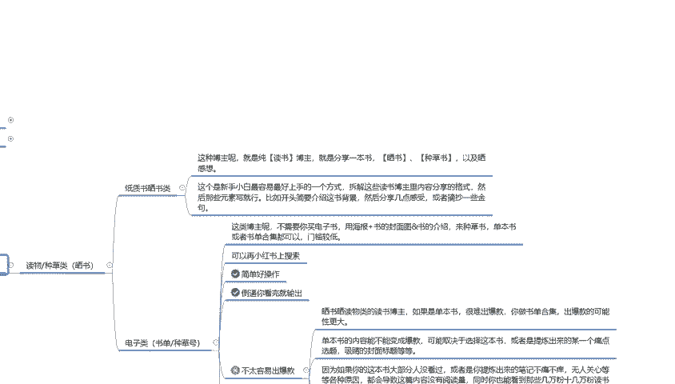
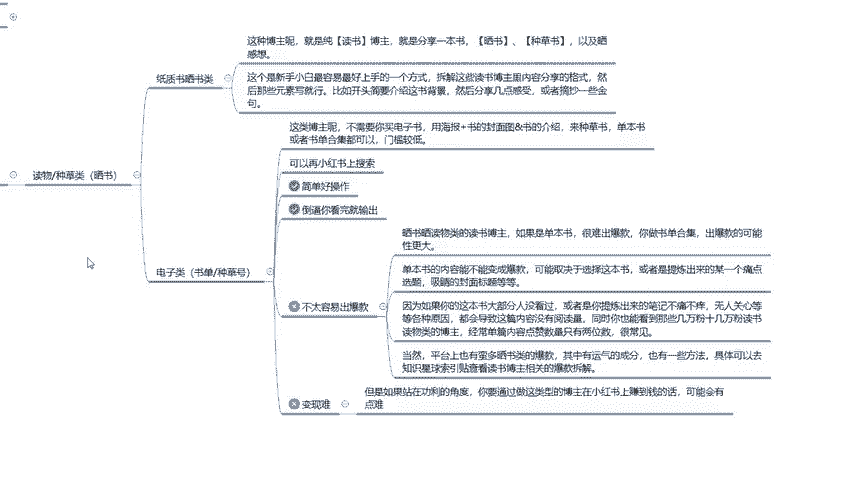
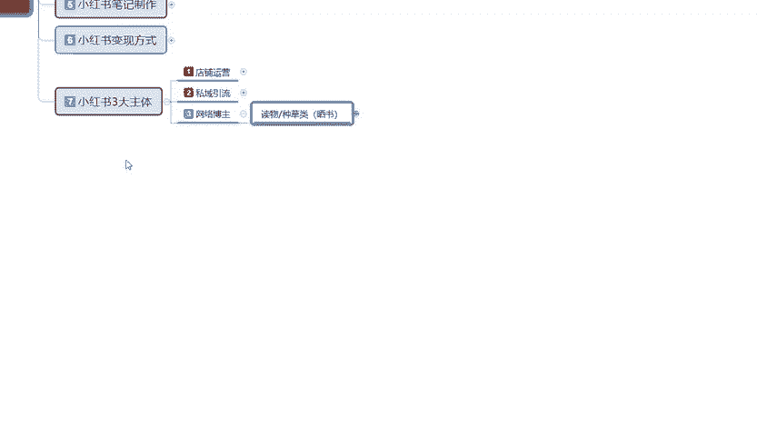
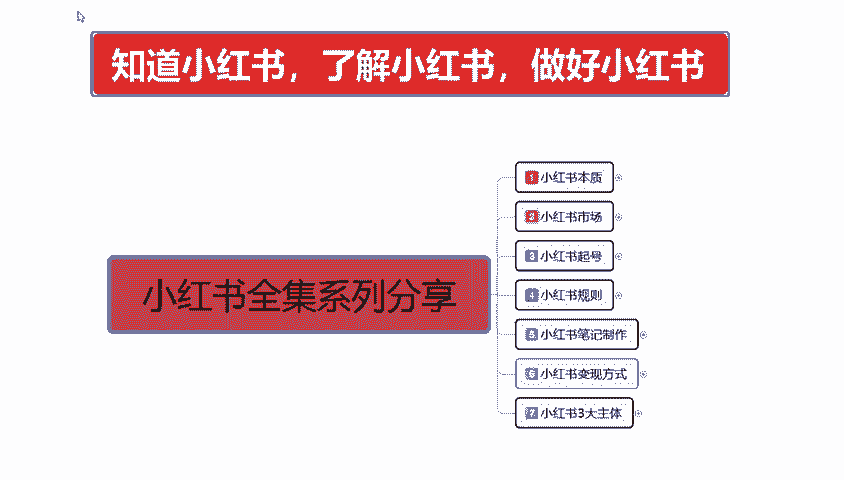

# 【全199集】强推！！2024（全新）最保姆级小红书运营自学教程，小红书起号到爆款店铺打造必学全套运营流程，新手开店必看！拿走不谢，允许白嫖！ - P30：233.新手小红书运营-网络博主账号打造 - 木吉木更小姐 - BV1Sop5e6EVE

大家好，今天给大家分享的是小红书全集系列的。

最后一课啊，小红书三大主题最后的一课呃也是本期分享的最后一课。

网络博主的一个运营模式。网络博主啊说实在的在这个里面的话，其实它相对其他的一个内容的话还是比较简单的。因为它没有那么高的一个硬性需求。只要我们内在的一个属性量的话啊做。

就是内在属性做好以后的话，其实基本上网络博主这一类的话还是比较好做的。这里我只是说给大家举了一个例子啊，拿了一个读物种草类的，就是分享书本类的一个知识点来给大家进行一个讲解啊。首先是分为两个点。

第一个是纸质。

纸质书和赛素类的。第二个就是说电子类的一个图书类的。只是赛书类的一个博主呢，这种博主就是纯粹的读书博主啊，怎么说呢？就是说什么三国啊、红蒙楼啊这种博主就是分享一本书、赛书、种草书以及赛感想等等。

就是我看了这个书以后的话，我有什么感想啊，有什么不同的见解啊，然后就是分析你面人物事啊等等。你做其他的行业也是一样的。你都是要通过我们自己所分享的一个博主类型。你分享国际时事也是一样的啊。

这个的话就是说心手小白的话，我们最好上手的一个方式。所以。拆解这些读书博主内容里面那个分享内容格式，然后的话找那些元素写就行。比如开头简介要介绍这本书的背景。

然后几个熟悉的一个几点感受分享或者摘抄一些金句就行。同类的你做其他的也是一样的。你要先拆解分享。啊，对于新手来说的话，了解这个方面的内容是最简单的。而且方式也比较简单，在网络上面你去搜索同类的。

你在抖音去搜也可以。你代表小红书去找同类的也可以，你去百度搜都行，知道吧？就是找同类的一个呃发布内容，你去看一下，然后的话把你的建议打上去，或者是把你的看法打上去，再实在不行。

你就去把人别人的复制的一个感官感受，你复制下来，你然后再发上去都可以的啊，就是白运工小白都能做的，也是最简单的一种网络博主的一个形式，只是你的起账号的话，你后期还是要有自己的一定的特点。然后去进行分享。

这种的话，你到中后期的话，你要想变现，就是接广告啊。啊，卖书啊这等等之类的。当然了，我这只是拿了一个读物赛书的一个种类，单独的一个哦种类去给大家做。你做食品也可以啊，做服装也可以啊。

做呃穿搭介绍也可以啊，都是一样的道理啊。比如说这种纸质晒素类的话是非常简单的。然后就是电子类的一个。电子类就是书单仲草号。这种博主呢就是说不需要我们去买电子书啊，也就不需要充会员去给了解什么。

用海报加书的一个封面，加书本的一个介绍来种草树。什么意思呢？就是种草种草再种草。等草长高了以后，对你了解，对你认可了，你再去打广告再去做推广就可以啊。单本书或者说是呃出单的一个合集都可以。

就是你比方说呃四大名著对吧？他每一个名著的话，你看简介版的也行，看完整版的也行，它的内容都很多，你第一册第二册第三册对吧？上中下三册对不对？你包括你看小说也是一样的，你小说一级、二级、三级4季。

你现在我们刷抖音，你看那个。嗯，抖音上面那个现在最近什么比较火来着？啊，什么穿越啊之类的这种网文小说，其实你都是可以分解拆系的。都是一样的。当然了，我这只是拿了一个类目来给大家进行了一个分享啊。

就说我们把所有的内容你了解以后的话，再把它粘贴复制下来，再到小数小红书上面去看。说实话，小红书现在做这一类的话有，但是很少。啊，你把自己的特点找出来就能做。也可以在小红书上面搜索，然后拆解分析。

然后自己再去做也行啊。他的话就是比较简单好操作。然后的话到逼你看完，就是我把别人的内容看完，然后再做把内容编辑一下，然后再输出数据就行，非常简单。这个里面的话有两点啊，就是第一个。不太容易出爆款。

第二个就是变现比较困难。变现的话，你只能到中后期。你前期的话想变现的话，基本上没可能人家你账号权重都没起来，粉丝都没几个，你咋去变现，对吧？不太出不太容易出爆款的话，就是说单独的这个是赛速类的。

不太容易出爆款。因为赛速类的一个独物博主。说实话，如果说是单本书的话，很很难输出爆款，你出合集的话，出爆款的可能性更大一点啊。单本的输出爆款的话，你去做介绍的话很难。

然后单本选书的内容不能改变成爆款的一个内容，可能取决于这本书，或者说是提炼出来的某一个痛点啊。这些的话我既然给大家打出来了，大家了解看一下就行。

当然我这个的话只是说找的一部分资料给大家进行了一个类似的分享。你们做其他类的一个产品，我不做毒素种草类的，我做食品类的也可以，对吧？我做美妆类的也可以，我做化妆类的也可以，对不对？都是一样的方式。

我做战争类的博主也行，我做武器介绍的类的博主也行，对吧？我是武七星爱好者也行，我是那种嗯运动爱好者也行，我是美食专家也行，都是一样的。只是说。模式是一样，你选择的路不一样，就看我们后续怎么去做啊。

这个就是网络博主。我们在小说书上面你要整体操作的一个整体思路和规划。看我们自己怎么去引导和制作。

好吧，这节的课程呢就给大家分享到这，也是我们这个本期给大家分享的一个。

拳击系列分享所有的一个内容完结。整个课程讲下来，其实我给大家分享这么多内容，主要就是说想让大家先明白啊，我们三个重点。知道小红书，了解小红书和做好小红书三个点。只有先知道了小红书它整个运营的一个系统。

然后我们通过了解小红书，它整个运营系统的一个呃运营模式，最后才是做好小红书。缺一不可啊，这就是我给大家标红一字放在每一节课所有的内容都在这地方显示的主体。制造小红书，了解小红书，做好小红书。

那这一期的分享呢就给大家分享到这儿。呃，下一期的一个内容出现以后的话，或者说是大家想了解的话，我们再给大家进行一个完全的一个分享。这个小红书全集系列的分享呢就给大家讲解到这儿七大课时啊。

整体内容的话是分了很多节的一个小课时。让大家去有针对性的选择学习一下啊，提升自我。

那今天的分享呢就到这。