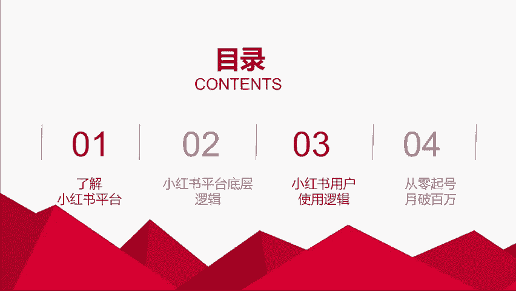

# 【全199集】强推！！2024（全新）最保姆级小红书运营自学教程，小红书起号到爆款店铺打造必学全套运营流程，新手开店必看！拿走不谢，允许白嫖！ - P3：1.前言 - 木吉木更小姐 - BV1Sop5e6EVE

那么我们今天讲的主题是小红书运营的一个底层逻辑。我们怎么样从0到1来做出1万粉的账号？那么先是我们来看一下啊。

今天讲4个。大块。第一个是了解小红书的一个平台。第二个是小红书平台的一个底层逻辑。第三个是小红书用户的一个使用逻辑，以及我是怎么样从零起号月破百万的啊。

我是大概是平均去年应该是做了将近1000万的一个线下的成交额。那今天我会弱化这块部分会主要跟你们讲，账号和平台怎么去做。然后整个的这个内容绝对是纯一线的实战干货。

我敢说这个东西你们在外面应该是很难很难听到的。因为大部分就是说公司比较大的话，这个老板他不会是自己一线的操盘手，他操盘有别人，而我的账号是我自己从选题到内容到全流程是我一个人独立完成的。虽然公司有人。

但是我做小红书是属于2019年是属于先行研究，所以我是没有用用任何公司资源做出来的。

