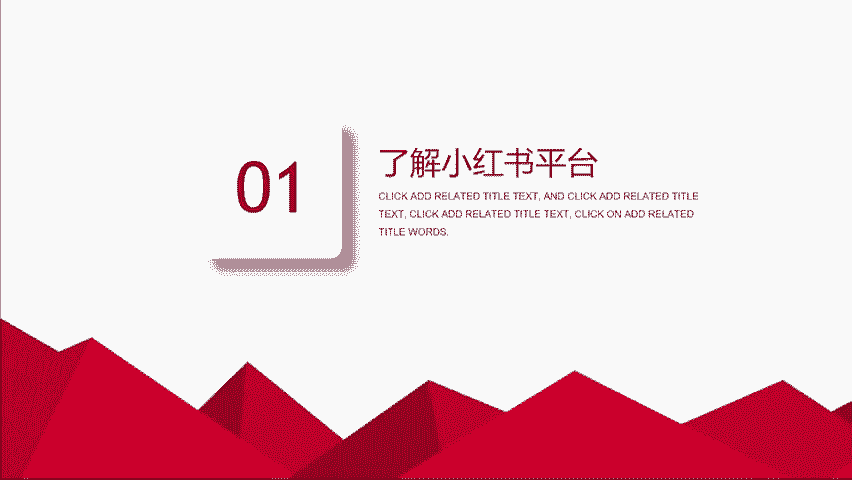
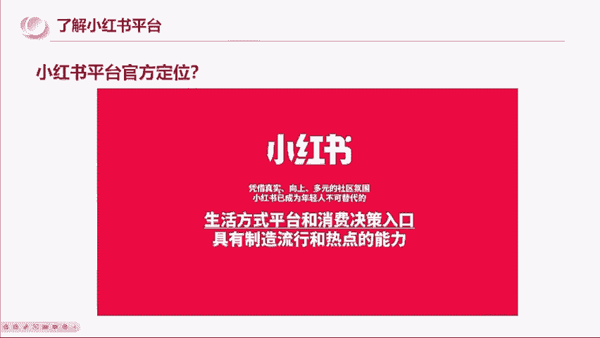
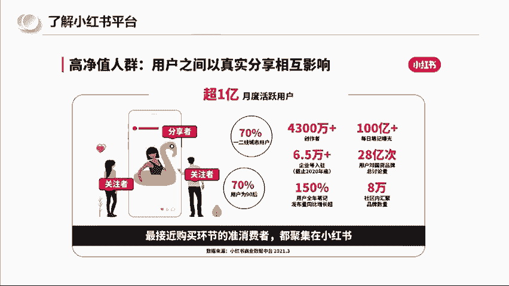
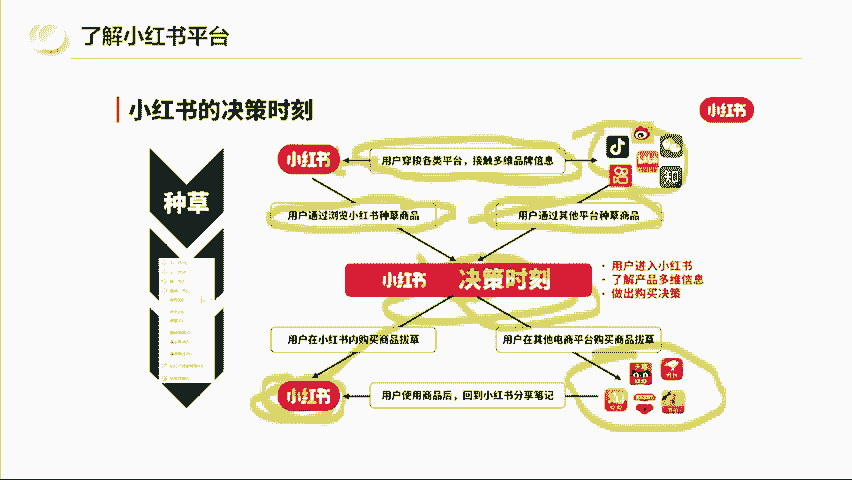
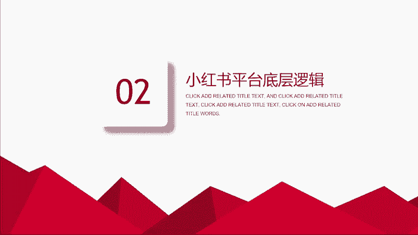

# 【全199集】强推！！2024（全新）最保姆级小红书运营自学教程，小红书起号到爆款店铺打造必学全套运营流程，新手开店必看！拿走不谢，允许白嫖！ - P4：2.了解小红书平台 - 木吉木更小姐 - BV1Sop5e6EVE

那我们先了解一下小红书的一个平台啊，就是说先看一下小红书平台的一个官方定位啊，这这张图是小红书官方的图片，它的描述什么？是生活方式平台和消费决策的入口。凭借真实向上多元的社区氛围。

小红书已成为年轻人不可。替代的啊入口。所以小红书给自己打的标签真实是排第一的向上啊，社区以及消费者觉对入口。那这个第二个呢它是讲到了高净值啊，高净值人群，超一亿的月活用户70%的一线和这些一些东西啊。

但这些数据是中间的，我们把官方的这个资料说成人话是什么意思呢？就是在目前现阶段的这个网络平台当中啊，我们可能会刷抖音，可能会刷快手或者B站知乎啊，甚至微博。那我们会在这些平台上去接触很多很多的信息。

那我们小红书和他们之间是发生什么关联的呢？就是因为他们从这些平台上啊，从这些平台上收获到信息之后，他们。在穿梭到小红书来进行一个研究，通过小红书进行浏览啊，然后进行一个影响决策。

要么他们会在小红书进行拔扫。因为小红书它自己有官方商城啊，要么他们会直接在其他的平台进行一个购买，这是小红书的一个决策时刻。

好，那我就跟大家用说人话讲啊，就是小红书这个平台它到底是怎么火起来的呢？其实它是经历了抖音的一个4近将近4年的一个增长。因为抖音在它这个四年的一个野蛮生长时期，它的变现方式其实是经历过N种样式的迭代。

我不知道你们有没有人刷到过啊，最开始的抖音快手变现，他们是主播只要有粉丝，你在直播间你开直播就有几千几万人在线，这个时候就已经开始有商家。比如说比如说啊比如说你们是主播，你们的直播间有几千人上万人。

而我是一个卖面膜的商家啊，我就会告诉大家，我非常非常的喜欢你很喜欢看你的内容，我的这个面膜，在天猫旗舰店卖199啊，在京东卖199，但是针对你直播间的粉丝，我拿出几百单来做福利，只要多少钱，只要39。

9块。那个时候是抖音最开始的一个变现模式，就是商家直接打版，打版之后直接卖货。然后。主播给这个商家挂人，我想问一下，大家有经历过这个时刻的人吗？有经历过的打个有好吗？有经历过这种卖货的吗？叫打连麦卖货。

那再往后走，抖音开始推出了一个小黄车，就可以进进行一个通过小黄车去购物。那这个时候它是什么玩法呢？他们就有很多的人啊跑到这种源头的水果产地啊，大爷大妈啊，下跪说求求大家了，我的苹果直销啦，橘子直销了呀。

就用感情牌啊，用视频去吸引大家去下单啊，但是这些东西现在是不被允许了啊，那么再往后走，像一些美妆的，他们又研究出一个什么样的一个玩法呢？就是一次性投放上百个达人账号。比如说啊我老婆他买的那个酒酿面膜。

我记得买过酒酿面膜，买过那个薏米茶，买过那个号称是协盒的美白，美白的那个小瓶瓶的，后面都上新闻了啊，协盒说根本他们就没出过这个产品。那么这个操盘的打法，就是可能你通过一个博主，对吧？

你说这个美白能这个东西能美白，可能你不信，那O我买通100个博主甚至几百个博主，我让你9点钟刷视频，A说它有用。B也说它有用，C也有用，刷的越多之后就造成一个从重心理去进行一个收割。而这一系列下来啊。

就有不少人收到货之后，他就会发现什么？就会发现自己踩坑了。然后也就开始变得谨慎。那怎么样防止大家上当呢？所以这个时候其实小红书的价值就开始体现了。因为小红书它的定位是种草的一个分享社区。

而且它的算法对普通人很友好，有大量心地善良的人在里面分享，包括面膜的使用感受啊，防晒刷的一个真实效果对比图啊等有效信息。所以小红书就相当于它为大众提供了一个产品好坏的一个体验的一个分享平台。

你们如果片面点的去理解，也可以理解为它是一个避坑平台。但是然后又由于前期有很多的海外购物经验分享，小红书，它的前身是做海外购物分享的，积累了一批高素质、高学历、高消费能力的用户。

高素质高学历就决定了他们的语言表达会更加的客观。他们拍照的能力和展示能力都更强。所以他们给用户的感觉，会比商业的博主要更加的真诚啊，可信度更高，也就慢慢积累下一批女性用户为主的用户。那么抖音和小红书。

如果。我说在我的视角里，我们去做一个对比，就是抖音，现在是专业的玩家居多里面呢鱼龙混杂啊，有正有正向的啊，也有玩套路的，而套玩套路的是层出不穷，而小红书呢，它更倾向于普通人真诚分享的平台。

里面信息的密度是比较大的，你可以筛选出有用的避坑指南生活方式。所以其实就让我想到啊，就像我们以前用淘宝是吧？最开始我们在淘宝上买衣服啊，可能只需要有衣服在上面挂着。就会有人去买。那再往后唉。

商家觉得说好像好评这个东西对消费者决策起到关键的作用。那可能他们就会在好评上面啊，比如说我搞100个买家秀，自己弄100个账户去。说这个衣服有多好看，穿上去效果有多好，但是消费者他也不傻呀。

他发现说哎我买回来衣服和好评里面的衣服不一样，怎么办啊？消费者就开始不看好评，我们开始看差评啊，那有的商家又变聪明了，你看差评是吧？那我就在差评里面去做文章，通过差评去让你认可我的产品品质。

比如说啊比如说一个一个一件卖一件衣服是吧，他可能说给的是一个差评，但他说虽然衣服质量还可以，价格也合适，但是配送太慢了，这个差评我给定了。像这种的语句，看似它是一个差评。

实际上它还是向你传递了用户的真相认可。所以商家和消费者他一直在博弈。而大部分人我们在抖音如果说去买到了这种不好的商品，你去曝光它，其实拿到的流量是很有限的。而小红书这个平台不一样啊。

如果说你在上面买了什么不好的产品不好的体验。第一，素人的流量权重和大大的博主可以说几乎没有太大的区别。第二，小红书他有搜索流量，因为我们是基于什么基于我们在某些短视频平台刷到了这个产品。

比如我刷到一个是吧？这个又刷到一个什么面膜啊，号称能够美白。那这个时候因为我之前上过当了。所以我这一次我就希望说我在小红书平台再去搜一下。而这个时候当他搜这个面膜的时候，可能他就进来一个测评的帖子。

那测评的帖子可能就告诉他这个。的面膜不如另外一个面膜啊，然后这个消费者的心质就被影响了。所以小红书它基本上就是给我觉得片面的理解啊，就是避坑平台，它的内容就类似于说。豆瓣的电影评分啊。

以及大众点评的一个美食评分一样。那虽然到今天为止啊，平台里也会有很多的素人分享，但是同时也参杂了很多的这个商家啊冒充信息。但是这个平台整体来讲还是非常有这个使用价值的。

