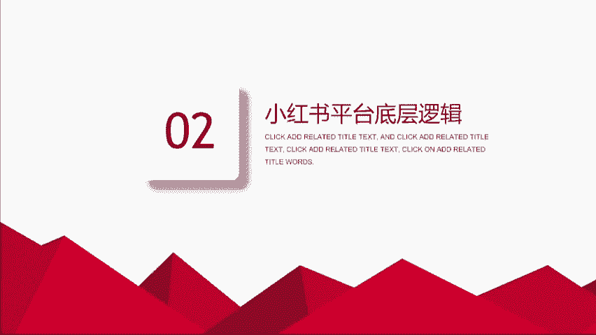

# 【全199集】强推！！2024（全新）最保姆级小红书运营自学教程，小红书起号到爆款店铺打造必学全套运营流程，新手开店必看！拿走不谢，允许白嫖！ - P5：3.小红书平台底层逻辑 - 木吉木更小姐 - BV1Sop5e6EVE

那小红书平台的一个底层逻辑啊，就是我在做小红书平台的时候的底层逻辑。首先我们去做一个东西，一定要了解一个平台他要什么平台要的东西，你给他他自然就给你流量。那么我想问大家一个问题啊。

假设现在你们啊是一个开淘宝开天猫旗舰店的，现在你手下有5个有5个客服来回复这个客户的咨询。你店里有2000，现在每天有2000个咨询啊。

你会怎么去分配，是平均分配2000个除以5个人，每个人平均分配400个，还是怎么分配，还是说不平均分配，你们可以告诉我吗？你们思考一个问题啊，现在你们的身份是天猫旗舰店的一个老板，你有5个客服啊。

然后有2000个客户咨询，你们怎么分配是吧？这同学很配合啊，这的是平均分配。这个其他的啊其他的朋友啊也可以啊，继续去多互动。因为我知道你们的水平就决定了我后面讲的一个东西的重点和速度。啊。

有人说不理能下单的，不会多问啊，这个兄弟，你在跟我开玩笑，你一个开天猫旗舰店的，你说2000多个客户咨询，你有5个客服，你跟他跟我都不理啊。有人说按需求比例，有人说按能力分配，有人说平均分配。

好的那如果说这5个是新人的话，那基本上来说的话，第一轮肯定是先平均分配。但是你们往后走，你们会发现一个结果，就是每个人的能力是不一样的那我们可以看到，那通过一个星期的数据下来。

那我们现在发现了张三他的成交是4000块钱，理四是3000块钱，往五是8500块钱。赵六是6500，孙七是1000。我想问一下你们，接下来你们准备拼怎么分配呢？我相信啊。假设你们是一个老板的话。

你们是不是会希望王五能够拿到更多的客户？因为王五的销售额是8500元。他是詹三对吧？和李四的double。所以。这就是我们啊假设我们开店的一个商业逻辑。那。到了小红书平台，你们就去思考小红书平台。

其实对于小红书而言，我们他手上拿到的东西是什么？他手上拿到的是访客，对吧？我们打开手就变成访客了。然后呢，他手上会有多少呢？会有新增笔记。那你觉得他分配笔记怎么分配呢？他就像我们去开店铺一样。

他前期比如说我们现在同一时刻这一分钟有500篇笔记，新到诞生了，他一定是给这500篇笔记啊，一个平均的一个初始流量值。然后通过初始流量值的一个数据表现，再次再去决定二次分配和三次分配。

所以那我就想问一下大家第二个啊问题就是小红书平台它最想要的东西是什么？你们有想过吗？是用户停留还是新增还是成交额？你们可以在评论区啊可以在评论区。告诉我。你们觉得小红书平台最希望要的是什么？

我来看一下啊，这道题这道题挺有技术难度的。所有打停留的啊停留的是正确答案，停留的是正确答案。因为我现在用的词是什么？是最希望要的是什么？为什么我告诉你，用户停留是最关键的啊。因为不管是小红书也好。

抖音也好，快手也好，微信也好，他们都在干一件事情，就是要争取用户的时间。为什么？因为你后面所有的成交额，你的这个电商的变现，广告的变现都是要基于用户在使用你这个软件。包括你们所说的用户新增。

新增看上去很重要。但是你要明白，当我们愿意用1个APP，愿意一。新增只是早和晚的问题。如果1个APP你一天只用2分钟，或者说你一个星期你都不想打开一次，你觉得这样的新增有意义吗？所以我们就想到以前是吧。

我们以前看电视的时候。还记得吧？以前电视台的核心关键数据是要啥？是要收视率，对不对？收视率电视台有了收视率，它就可以去插播。广告植入对吧？可以接一些大品牌的一个广告。所以对于。这种平台也好。

其实不管小红书、抖音、微信、淘宝，他们都是希望有用户停留，有用户停留才一切可能。那这里又有一个问题就是。我们希望用户停留。那就需要有好的内容让用户去停留下来。但是小红书的平台它是一个机器。

如何让机器去判断内容的好坏呢？啊，我们都说内容为完，你们有想过没有？如何让机器去判断这个笔记的好坏呢？如何让机器去判断笔记的好坏？机器一篇笔记灌输下去。

其实它是没有办法啊算法机器是没有办法完全去识别出内容的好坏的。它只能通过一些数据。所以我们能够看到的点赞、收藏、评论、转发这四个东西其实就是一个用户的反馈。对于机器而言，系统推荐。两篇笔记啊。

A笔记和B笔记各500个。报关A笔记获得了100个点赞，B笔记获得了10个点赞，那机器就有理由判断A笔记更受用户欢迎，能理解吧？我相信你们都能理解的。好，所以说整个来讲，小红书平台它其实就是基于。

用户停留的需求啊，用户时长的需求通过机器去判断你的内容是否是用户喜欢的，能够让用户留下来的。因为我们自己是不会在我们不喜欢的内容去浪费时间的。所以那整个来讲的话，大的方向啊，我跟大家分享一下。

就是小红书平台现在有哪些红利呢？第一个是流量红利，因为小红书目前的月活应该是两个亿左右啊，我估的。然后23年刚刚上线了网页版。这个流量红利就意味着说。

如果小红书未来的月活能够在接下来23年、24年达到5亿的话，它有两倍的流量buff。就是你做相同的事情，它是有两倍的流量buff。如果小红书能够到7。5到8亿的用用户，就有3倍的buff。

是你做相同的事情，这也是为什么我会去在。119年去做抖音，我们做11抖音是19年6月份我。做小红书是21年10月份，我永远因为作为一个老互联网人，我永远是要抢平台的前瞻视角钱这个流量加成的。

所以说抖音我我们现在有在做，我们还会接下来还会去做。但是现在的抖音的流量已经见顶了。所以我们其实早做和晚做同样的一个项目，差距不大了，没有流量红利了。那第二个点，我们讲的是素人红利。

就是小红书平台对于素人笔记的其实是很友好的。而且最近小红书平台，他把这个广告的门槛从1万粉下调到1000粉也可以开通。这是你能感受到它不是去捧这种大博主的一个心态。第三个叫搜索红利。

就是笔记在小红书的笔记，它可以获得长期且持续的搜索访问量。3000小眼睛的笔记拿到100万。小眼镜，这是我实际的我的后台数据。这个等一下你们后面呃可以给大家看一下啊。第四个就是电商红利。

小红书今年对于电商有很多的动作，类似于早期的小红车的推出，包括最新拿到的信息，小红书的这个本地团购也在内测了。就是你通过笔记可以直接上架。本地的一些优质商家。所以我觉得就是说对于一些小白而言啊。

你这一次可以把你的目标定到你知道怎么样去做内容，做有效的内容。然后电商这个东西你可以。就是说你不要把自己的要求拉太高啊，在这一次，因为后面还有本地团购等着你。这个你们可以看一下，我有一个习惯。

就是我会统计我每一篇笔记，每一天的一个最后的一个数据。这一篇的话是截取的一个曲线，它是从。这应该是几百的播放，到了9万多多播放，而且这张图是我应该是去年截的，现在应该还是继续往上走的。

这个我没有去拿数据最好的图片。所以说小红书最牛逼的地方是什么？就是它的长尾流量是我见过最牛逼的。查尾流量是我见过最牛逼的没有之一。包括你们可以看到右边啊它的搜索我的笔记，我的搜索量是77。

所以都是搜索进来的，搜索流量就越的精准。那么总总结一下就是小红书平台快手他们的差异在哪里呢？快手抖音啊，我觉得它可能更倾向于之前的优酷土豆是用户一个欣赏观看视频的一个工具。而小红书呢。

它有点类似于百度加知乎的一个结合体，我们在百度可以查到怎么去。一些比较啊更深入的东西。比如说iphone怎么去拆机，而小红书它有百度加知乎的一个这种调性的一个感觉。

