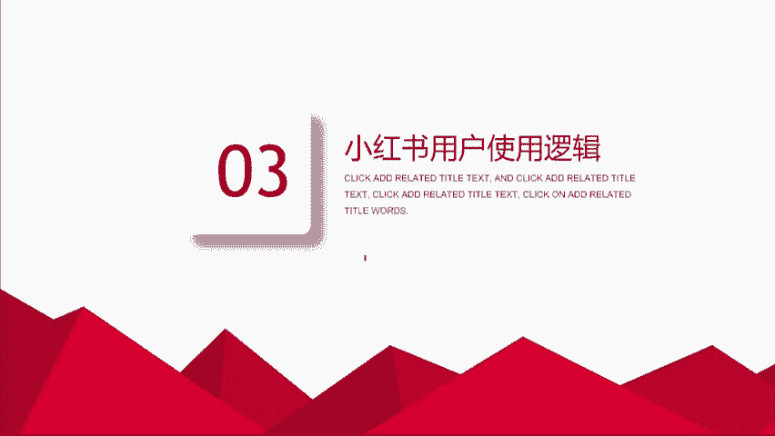
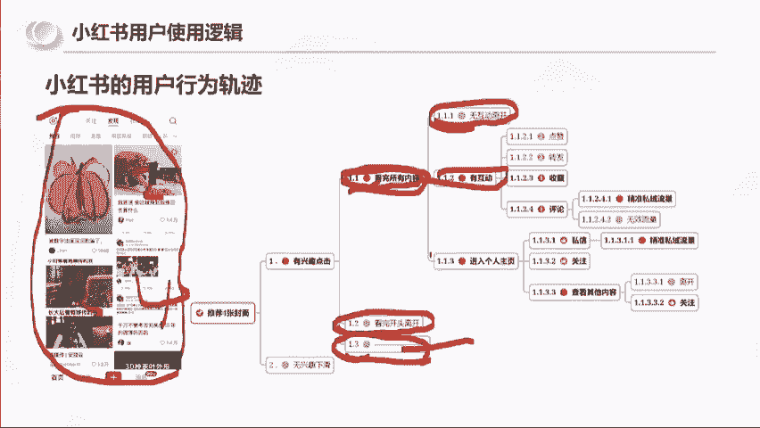

# 【全199集】强推！！2024（全新）最保姆级小红书运营自学教程，小红书起号到爆款店铺打造必学全套运营流程，新手开店必看！拿走不谢，允许白嫖！ - P6：4.小红书用户使用逻辑 - 木吉木更小姐 - BV1Sop5e6EVE

我们接着往后走啊，那么小红书我们要去做的话，我们了解了平台之后，我们要还要了解用户的一个使用逻辑。可以看一下这张图啊，这张图是我去研究用户的一个一个流程图。我们可以发现说小红书平台，你打开之后，对吧？

它给你推荐的是四篇笔四篇笔记啊，四个封面，对不对？四个封面，那么我们的行为轨迹是不是要么你就有有兴趣，你就点进去，要么你没有兴趣你下滑了。而点进去的里面，要么就是看完所有内容啊，要么你就是看完离开了。

是不是？那还有第三个什么思考一下，思考一下，动一下你们的大脑，我们打开小红书啊，我们小红书给我们推送了4篇四张封面。我们要么点进去看完，要么我们看完离开了，还有一个选项是什么？

有没有人能够想得到啊？今天的内容，你们能够动起你们的脑子。我相信会让你们可能是今年收获最大的一个小时。看一半啊，这个这个朋友没有名字，但是我觉得回答的很漂亮。就是还有一个选项就是没有看完离开了。

没有看完离开了。没有看完，你开了啊。所以说看完所有内容之后的路径，他又选择没有互动离开以及有互动离开，以及进入个人主页。

啊，以及接下来的路径。所以这是我去研究用户，其实我就是研究我们自己。那你们有没有这样的一个思维是吧？我们再往后走。那么小红书平台做账号和抖音它到底有什么不同呢？第一个就我们刚刚所说到的啊。

它的其实是属于信息的推荐方式就已经不同了。因为抖音打开软件，它是直接推送一条内容并自动播放的。你们不感兴趣，你们就会去刷到第二条。而小红书打开软件，它是推荐4条内容，它没有自动播放的。

你们不感兴趣就直接下一条了。所以就意味着是什么？说明抖音的开头很重要，因为抖音是自动播放，而小红书的封面标题非常重要。如果你的封面标题不行，对不起，我我一一个我都不会点进去看，我直接下面四个了。

所以说小红书的标面标题封面非常重要。大家现在应该能这个解这个拆解，你们应该能意识到封面标题的非常重要性啊。那么你们去思考一下，或者说啊你们有女朋友的，有男朋友的对吧？或者你们的同事。

你们去研究一下你们的同事，他在耍小红书的时候。给他四篇笔记，他是怎么样去阅读的一个顺序。他是从一看到二看到三看到4，还是他打开手机扫一眼啊，直接滑了，还是说打开一眼扫一眼直接点了。就我个人而而言。

这四篇笔记我是不会按顺序1234去看的，我是扫一眼的，扫一眼也就意味着说。一秒钟的时间，四篇笔记，其实每一篇笔记连半秒都不到。所以说这个封面标题非常之重要。那么小红书平台啊做和抖音还有一个什么区别？

其实他们的账号的运营方法也是不一样的。抖音平台，你们去运1个IP其实主要还是要去博这个系统的一个推荐流量啊，用想办法去破圈。而小红书他是因为社群属性和搜索流量大，他还可以通过账户笔记为形象展示。

去他人评论去吸引目标用户啊。像右边这个案例啊，是我前几天刷到的，就是这个人。在这篇笔记啊这篇笔记讲的是啥呢？这篇笔记讲的是。就是没有听妈妈的话，拿着家里的钱去开店，就压力很大啊。他就在评论区说。

我也是对家里报喜妇败忧，开奶茶店最多负债500万，不敢跟家里说，每次问只能说还行，因为奶茶店太卷，最后去做压，结果没想到一年把负债还清，还把生意发展到全国。就意味着他这个其实传递了一个什么信息，一年。

他是负债500万一年还清，就意味着说什么说他一年赚了500万。然后下面还有一条评论，不过你们家味道确实不错，就是价格高，不知道是不是一样，是吧？还有一个用户好评。看到没有？所以如果说我想问一下大家。

如果是你们。看到了这一个人，你们会不会点他的头像会打会好吗？不会打不会。如果这篇笔记是你们刷到了，你们会不会点他的头像去看一下，因为他负债500万。啊，一年还清会对不对？那我想问一下你。

你们点了他的头像，进了他的主页和他发一篇笔记，你们看完了进他的主页是不是达成了同样的一个目标，就是把你吸引到了他们的主页里面去。是不是？所以这就是小红书的一个魅力。它可以通过评论区去吸引用户。

不是只能够通过内容去吸引用户。啊。那那也就意味着说对不对？比如说是不是就我以服装举例啊，我们用服装举例，我们换位思考一下。假设这篇笔记它讲的不是开店亏钱的事啊啊，或者说我还是开店开店亏钱啊，就是呃。

找爸妈借了10万块钱啊，开开童装店。啊，开不下去了。会不会小红书会不会有这样的笔记，肯定会有，就是那些开童装店开不下去的。那么是不是可以在评论区去说。现在实体店的东西卖那么贵，怎么可能开得下去？

我在我在朋友群里买的一件小朋友的T恤，才6。9块钱，而且跟实体店29。9块的质量差不多。谁还愿意去实体店买东西？我想问一下大家，这一句评论区有没有杀伤力？是不是你们就可以理解啊。

同样的小红书他现在还干了一个什么事情。今年啊我发现他把群聊的一个这个好友数，就是一个人可以进群的上限，已经我现在已经建到15个群了。之前我只能建5个群，现在能建15个群。

那也就意味着说他的这个玩法会更加的多样化了，包括他还可以他还他有一个官方页面，招募群友，你建群之后，他他给你提醒你，你可以发布笔记招募群友。所以这个玩法就有很多种方式了。好，那我们就问。

那么接下来我们的问题就来了。那我们的笔记封面如何脱颖而出呢？已经知道每次打开推荐四篇笔记，我们怎么样把封面做到超越他人呢？尽可能高的拿到点击呢？啊，这里我插一个问题啊，我插一个问题。

就是平台能够给你们的给普通人的唯一的一个。数据你们知道是啥吗？就假设啊我们200个人全部发笔记，他能够唯一给的东西是啥，你们知道吗？他能够唯一给的东西叫这个。叫报关。啥意思啊？

就是把我们的笔记推送到别人的手机上面。这个动作让你的手机。看到这四篇笔记，这个动作叫曝光，就是平台唯一能做的，就是让你们的笔记出现在别人的手机屏幕上面，他只能做到这一步，他没有办法让。

看到你这个笔记的人点进去，他也没有办法让他点赞。所以很多时候你们的小眼睛是由什么决定的？是由你们的点击率决定的。假设平台给这四篇笔记都给1000的报关。都给一000的报关。

假设这篇笔记1000的报关里有200个人看。就会显示你们的左下角就会显示小眼睛。其实这个叫。小眼睛它是属于阅读数，但是平台给你的不止200，它可它可能给了你1000，明白吗？明白吗？同样的，这只猫。

它可能也给了1000个曝光。但是因为这个猫比较吸引人，所以它有300个小眼睛，那就是30%的点击率，所以你的眼睛只有200，你的眼睛，别人有300，不是说平台给了它300给了你200。

而是你的点击率会影响。好啊，那我告诉大家，我是怎么样去提升我的封面呢？接下来的这个方法，如果大家看了有用，就在评论区回复有用，好不好？我的选择是啊，这是我的一个封面。我的选择是我做出来我的封面之后。

我把很多个封面放到一起，我把我的放上去，看我是不是最能跳出来的那一个。我把我的封面放在这个手机的示意图上，看下跳能不能跳出来。我把我的封面放在这四个里面，能不能跳出来。有用答有用好吗？有用答有用。

因为我跟大家说了，我们这一次的三位老师全是实战派老师，我不会去跟你们说什么啊，标题的三个方法啊，这个吸引人的三个方法，我讲的就是我在用解确实有用的东西。接下来还有更多的干货啊，咱们继续。啊。

大家也可以在去。继续啊，咱们继续。好，那么问题来了啊，就是笔记封面，我们如何脱颖而出呢？啊，这是我今天从网页版上啊截图的十几个。那么。划重点来了，就是在之前啊在在今今年啊网页版推出来之前。

我们要思考的是啥？我们要思考的是四篇笔记啊，我们要思考的是四篇笔记，我们怎么脱颖而出。但是网页版出来之后，网页版的推送是是多少？是是这样推送的，是我是黄红框里面的一个推送啊，我是把两个拼到一起了。

那就意味着说每如果说你要考虑到小红书后面的流量，它如果是手机端进入，你是四进一，它如果是网页版刷的话，你是十五进一，是不是对你的封面要求更高了。那么这一张图，我为什么截给大家看啊，我想跟大家讲一个点。

改一个点。就是。以网页版的一个阅读质感。我把这个。同样啊这种在备忘录打字啊，这种算很简单一个展现形式。这篇笔记算一号笔记，这一篇算2号笔记，这一篇算3号笔记，这一篇算4号笔记。

你们认为1234里面哪一个是如果你们选择这种表现形式会会认可的方式？1234，你们更认可哪一种方式？二、对不对？为什么？因为二不仅它的标题更加的显眼，它还画了一个红圈做视觉引导。而一是吧，一的字。

三的字啊都是属于字都有点看不清了。四还好一点。在网网页版的视角里，四的字还是比较清晰的，而二的标题更加的清晰，而且它还用了这个用了这个红色，对不对？这就是我们把就是东西好坏是怎么来的？我告诉你们。

封面好与坏，标题好与坏。就像什么？就像我们。😡，给我们的对象拍照一样。你拍一张照片可能就只能拍出50分。那我们怎么样保证自己的对象能够选出好看的照片，是不是咱上来先给他干个100张。

是不是你在100张里面选，你总能选出好看的嘛？所以我们去做小红书，做封面。😡，我们。😡，两种方法，一种是我们去看100个封面，找出我们觉得好的去学习，还是我们做100个。去选一个呢，肯定是看嘛，对不对？

然后。讲到这个服装啊，我今天还去找了一下服装的例子，就是我们如果去研究账号啊，我们要去向有结果的人的学习。因为我已经告诉大家，标题和封面非常的重要。那什么叫有结果的人呢？

我觉得第一个你要看他的数据是否稳定啊，像这个账号。他前前面的数据还是比较稳的啊，点赞都在100以上，可能最近的流量不行，但是它能够连续几篇拿到100点赞的这种账号，它其实一定是对平台有内容理解的。

如果一个人对平台的内容不理解，他的数据就会变成什么？可能突然他有一条100点赞1000点赞的。但是再往后他无法连续，他无法连续，就是优秀的人他的下限是更低的。

就是我们没有人能够说我一定能写出1万点赞的笔记，但是优秀的人他的下限可能就是100，但是如果说你对平台没有那么了解，那你的笔记完全就是开盖率。那这个账号他的特点在哪？因为你们要讲要可能有人会选择做服装。

那我给你们简单讲一下，就是。第一它的定位，它是专门研究篮球穿搭。细分是吧？第二个。他是。小众篮球穿搭。第二个，为什么我说这个账号有用？是因为我们通过他的评论区，你去看是会有人找他要链接的啊。

求第一套裤子的链接。他不是简单的说，我给你点个赞我，点个收藏，我走了，你会在评论区看到有人要要是什么，是代表购买欲，是不是？好，那我还找了几篇其他的这个衣服去看啊。像这个账号也是比较有特点的。

这个账号它的一个拍摄角度是非常固定的，而且它的数据也很稳定。这个账号数据也很稳定啊，然后这个账号人家更直接了，蹲价格侠，价格侠什么意思呢？就是谁谁去了店铺翻到件衣服的价格，告诉我。

这个直接就是考虑到价格层面了，能考虑到价格层面，说明什么？说明这个衣服他已经心动了。那么我们再往后看第三个啊，这个账号它叫野生塔塔。这个账号它也是很固定的一个商品，对不对？我们讲的账号定位清晰。

它的账号定位是什么？账号定位就是这种它这个叫什么叫JK是吧？学生日常的这种风格，然后他的目标客户也很清晰是吧？就这种感觉很相似啊，他的效果有没有有人家会问他群子哪家的啊，他说海胆举例子。好。

那接下来问题来了，其实这三个账号，它的变现方式是不一样的。是不一样的，你们来看一下啊。这个。人家是告他是告诉别人，我的裙子在这家店铺买的这一个也是告诉别人我在哪里买的这个衣服。而，这一个呢。

这一个是发链接。谁？我先问一下大家啊，就是篮球啊和这个黑衣服。啊，这个水手服你们觉得这三个哪个更赚钱？或者说哪个的运营水平更高。你们有这种感感觉吗？就运营水平来讲啊，是打篮球的高，还是黑衣服的高。

还是水手服的高？有人说篮球啊，有人说第二个，有人说第三个。啊，你们觉得篮球是吧？其实我我我讲我的个人观点啊，我讲我的个人观点。可能我会觉得黑衣服的高一些。就就变现手法啊就变现手法，这个篮球它是卖衣服嘛。

是吧？它可能是没有上线的，但是就这个账号定位而言，就账号定位而言，我觉得黑衣服的呃段位高一点。因为第一个他的这个数据。更加的稳定是吧？篮球它是稳定稳定100家，那也意味着黑衣服一篇是他的十篇。第二个。

黑衣服的这个。质感更高级，单价应该也会更高一些。这是我我的个人观点我的个人观点啊。就是黑衣服的整个调性，它就不是简单的说我要卖衣服这一件事情本身，它是我在卖衣服的这个事情里面，我去选择更高客单。

更高预算。更有钱的这个客户群体。而且我告诉你们这三个账号里面。有两个账号其实是有模板的，这个水手服，它就是在走，就是在出快出门的这个位置拍这个黑衣服它就是在这个位置拍。而这个篮球它是户外户内。

包括这个停车场都拍。所以从这个拍摄的一个。这个角度和拍摄一个成本啊，我们可能拍一条这个成本。是差不多的。但是你做篮球的这个账号，他是一直在想我今天在哪拍，明天在哪拍。而这两个剩下的黑衣服和水手服。

它是有模板的。它是我只要有新衣服，我就知道在哪拍了。而且它的这个模板是持续有数据的。这也是为什么我说黑衣服的它这个运营水平更高。他的拍摄模板更加的明确，不用每天去抠脑袋，我明天怎么拍它的数据更加的稳定。

它的质感更加的高。至于他变现手法是挂店铺也好，还是挂链接也好，其实他有了这个运营能力，只是他自己洗，只是看他自己想怎么玩而已。他想轻松一点，他就挂店铺啊，他想复杂一点，他觉得赚钱多是卖衣服。

他其实完全可以挂链接的，他的运营能力是最高的。