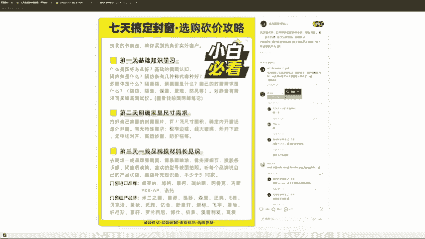

# 【全199集】强推！！2024（全新）最保姆级小红书运营自学教程，小红书起号到爆款店铺打造必学全套运营流程，新手开店必看！拿走不谢，允许白嫖！ - P7：5.账号孵化商家破局 - 木吉木更小姐 - BV1Sop5e6EVE

那么最后总结一下啊，就是我觉得作为电商商家一个小红书的一个破冰流程呢，你们要明确内容是有区别的。有的内容是吸引眼球的，有的内容是调动思维的，有的内容是有下单欲望的这是三种不同的内容。

我们到网页上看一下，好吧。

给大家看一下啊，客户怎么来的，给大家展开一下好吧，这篇笔记。这篇笔记就加了。200号人。来给你们看一下，怎么带你们看一下，记得啊内容的三种形式，内容是有吸引眼球的调动思维的和有下单遇的。如果说你的目标。

是去。卖货，那你就要做有下单域的内容。

Yeah。哎，我们看一下啊。来问你们吧。像这种是吸引眼球，这个茅台是吸引眼球的，还是调动思维的，还是下单域的？这个茅台它就两片茅台。是吧啥也没写。然后有互互动，有数据，这种所谓吸引眼球下单月。

还是调动思维啊？眼球是吧，眼球思维下单这个吸引眼球的。好，这个呢。2。4万拿下20件家具。

这个是眼球思维还是下单月？

下单吗？我想问一下大家。这个地方。哪里有下单？哪里有下单？😊，你假设你是一个读者，你从他的评论去看，哪有别人想找他下单的这个欲望。没有的，有思维，就是人家会去看他里面的东西，有字啊。

比如说618双十一的一个购买时间，但是没有找他下单的。是不是他的评论区你们可以看吗？没有没有人找他买。这个是思维，这个是没有下单的。就是用户对于这个作者来说是没有下单的。

这个啥眼球思维下单月。

给大家找一个。找一个这个有下单域的啊。啊，这种这种这个这个是啥眼球思维下单域。这个啊第一次退茶位费成功结算，这个是眼球思维下单月。这个是思维啊思维。就是如果你们看了这篇笔记之后。

你们会去思考它的这个东西做法对不对？然后这个做法你有没有必要学，你学的有没有用，这个是思维。来，我们要找到。有下单域的东西，因为你们要卖东西，你们要知道什么叫下单域。如果这个东西都没没有下单域。

你做了之后他没有成交，那太太正常了。看我吧，告诉你们什么叫下单域。随便看。眼球视维下单月能看见这个小字吗？我只想知道结论，长沙买哪家。我只想知道哪里可以安装同长沙求推荐。求推荐。求推荐。求推荐。

求推荐已关注求推荐求推荐。求推荐。求分享。求推荐。求推荐。求推荐。

再看这一篇。我只想知道结论，长沙买哪家。

啊，这是同一篇。

看这一篇好吧。我主同长沙，麻烦拉我进群。你选好了吗？选哪一家，我看吐了，拿不定主意。同长沙想进群。求笔记。

再给你们看一下啊。

这一篇。求推荐求推荐求推荐啊。所以你们要有意识的去区分吸引眼球调动思维和下单域。如果说你们赚的钱，你们是要赚陌生人的钱，那你们就是下单域。如果说你们想赚粉丝的钱，那么你们需要有调动思维的力和有下单域。

然后接下来你们还要干嘛？你们还要明确学习的账号，明确运营的方向和明确运营的结果。还记得我给你们看的三个卖衣服的吧。如果不管你们自己要做什么。其实就是。四句话，找对标拆爆款多阐试要坚持。这12句话。

我做任何一个平台，其实就是靠这12个字。先找对标。装修就研究装修，水果研究水果衣服研究衣服、视频研究视频，拆爆款，你要去去猜到别人的这个东西为什么会爆啊，这个东西反正后面还会有老师去分享具体的东西。

但是你知道就这1个是第三个是多尝试，第四个是要坚持。

然后我想问一下大家。告诉我你们这一次的目标是什么，好吗？做出一篇100点赞的笔记，是你们这次的目标，你是小白，你就评论100点赞。如果是1000点赞，就评论1000点赞啊。

你们的目标就是只要做出一篇这样数据的笔记就行了。如果你们的目标是做出100粉丝的账号，就打100粉丝，10千0粉丝就打1000粉丝，做10百成交就打100成交10千0成交，就做0千成交。

100利润就打100利润，10千0利润就打1000利润，大家定下自己的目标好吗？看一下大家的目标啊。😊，大家都给自己定一下目标，我看一下你们的目标，然后也给后面的这个分享啊，来确定大家的一个。方下嗯。

好的好的，你们打着啊，因为我到时候会去把这个数据啊，我会去分析一下这个尽量啊去帮助大家达到自己的一个目标，好吧，好吧。然后希望大家知道龟兔赛跑赢的不是兔子，是龟。有的人他很聪明，但是他可能觉得说。

这个事情对他来讲太简单了，他不愿意去做，反而真正出结果的人是坚持不断迭代往后走的人。好，接下来问答环节。大家有问题就提问啊。我讲了75分钟。稍微差了点时。大家有问题都可以提问啊。有人问啊。

怎么让人关注涨粉啊，这个问题就是说。当你的内容是对别人有价值的时候。其实这么理解吧这么理解，我这个问题我这么回答你啊，你的问题是怎么让人关注涨粉，你打开你的小红书。打开你的小红书，打开你的关注列表。

你扪心自问，你问你自己，你为什么要关注他？再看第二个人，你为什么要关注他？再看第三个人，你为什么要关注他，你把列表分析完，分析你自己，你心里会有答案。第二个是一天几篇笔记发布，这个看你自己看你自己。

就是内容的发布数量啊，我觉得这个没有固定的一个要求的。你像我如果去写这种原创内容，我基本上我真的三四篇三四天我才能干一边出来。这个自己把风就好了。啊，有人说做了一个多月，出了三单全退了，又暂停了。

这就是我后面说的嘛。

要尝试，其实很多时候。你能够出三单，其实就已经代表说你对产品对内容是比不出单的人要强的。这个时候那你要去找这个问题在哪？出三单退三单是什么原因造成的？就我你可以看到我做这个事情全流程的过程中。

我问了自己很多的问题，每个问题我心里都有答案。啊，黑梦问怎么让人产生互动性？互动信我刚刚你你如果后面来的，你看一下回放吧，我大概在五六十分的时候，我拿我的账号说了，怎么样去调动收藏，调动评论。互动什么？

互动就是点赞、收藏、评论、转发、收藏和评论，我都已经给你们看了实际我是怎么做的。啊，有人说我开店一周，现在每天还有十几二十个的赞。浏览量也是有个几百个，但是一直不出单，不知道该不该换品。这个你。

就是你要去看具体的东西啊，你这个我没有看到具体的笔记，具体的商品我没办法判断，你也要去查你的这个类目，你不出单，究竟是你的价格比别人卖的都高。还是说就是说你先确定你的产品有没有问题。如果你看了小红书。

同样的产品，你觉得你的质量比它好，或者说相同质量，你的价格比它。就是合适一点，或者说价格也差不多。你觉得你的产品没问题的情况下，那你再把你的这个报关和笔记内容放大一点。啊。

有人问做人社贷的产品必须是一个行业吗？我这么回答你这个问题。对于这个东西啊，我这么回答你。看你这个人的销售能力有多强，销售的最高境界。是别人相信他这个人。不管他卖什么产品都会去买。你就想一个道理了。😡。

不管是罗永浩也好，还是董宇辉也好，没有说他只能卖一种产品的。销售的最高境界是卖人，卖产品是前期。啊，有人说我们卖水果怎么有那么多内容？找对标。你在小红书，你去搜产品也好，搜水果也好，搜这个方式也好。

其实你们去它是有无限种方法的，包括助理今天在群里买了，你卖水果，你只能去发水果吗？可不可以假设我是一个开水果店的，我可不可以发我的，就是说创业日记啊，我开了一个店啊，今天卖了多少单，明天卖了多少单。

可不可以发创业日记？我可不可以用另外一种形式，一种心态啊。就是不要把思维局限在啊，我是卖香蕉的，我就天天拍香蕉，天天拍香蕉。你去小红书搜一下香蕉，你看一下什么样的东西有下单域，只要是有下单域的内容。

都是你可以研究的内容。刚开始。小眼睛数多少是正常的。个人理解啊个人理解小眼睛，我觉得你新发一篇内容，200左右的小眼睛是正常的。如果说你的东西你一发只有100个小眼睛。

然后你接着发几篇都只有100个甚至40个、50个。我的经验啊是这个账号的权重是比普通账号要低的。我会建议你直接注销重新注册。因为我曾经有一个后面有一个账号就是这样子，搞搞了两次。

就是一发就是100个、50个、60个，我注销重发注销重发。我第三次我发一篇就在这边拍了个窗户，200个小眼睛之后，我再发同样的内容，那篇笔记点赞加收藏就过百了。啊，有人说怎样找到适合自己的对标账号。

我觉得你们去思考对标账号啊。第一个是。要思考几个问题。第一个是这个账号它是否能够达到你的目标。你的目标如果我就是100个点赞或者说100个粉丝，那只要他能够内容能够吸粉，能够有人互动。

那就已经是属于你能够借鉴的对标账号了。如果你的内容是希望卖掉东西的那你就一定要找有下单域的账号，下单域可以从评论区可以看出来。有下单域的账号里找到之后，比如说你找10个20个里面。

再从这一20个账号里面找它的内容，你也能够创作出来的。然后第三个是这个内容它可以持续更新的。再然后。你不是说，然再然后你可以持续去。找你这个赛道的东西，你可以去继续去迭代你的内容。

它不是说你一定是固定的一个东西。怎样才能输出更高质量的内容和优化？嗯嗯。我觉得啊你能够输出更高质量的内容和优化，一定是你对用户要看什么更加。更加理解，又或者说嗯你可以去看，比如说你要去讲一个知识点吧。

嗯，举个例子的fabing这个单词FA。MI LY。那我们同样是英语老师，同样是英语老师。我们去讲单词FLFAMILY。那我不管别的老师怎么讲，我会告诉你怎么去记住这个单词，faabing是家庭的意思。

F代表father爸爸and mother，妈妈，I love you。所以爸爸妈妈，我爱你，就是family家庭。那么我用这样的一种方式去讲解fmiing这个单词。

是不是一下就比那种纯讲单词的高级多了。那这种内容就会比纯简单词接好。那我会我是怎么来的呢？是因为我看到了这一条，我当时就觉得这个老师真牛逼。我记得很清楚，我相信我今天告诉你们。

family等于father and mother I love you，你们这一辈子都会记住。😡，最好的内容就是多刷多看多借鉴。更高质量的内容啊，如果你没有原创高质量内容的能力。

你就多看看了你就有灵感。好，有人说小红书开店红利能有多久？嗯嗯。其实红利这个词呢，它是一个大盘数据，真正你能够赚到钱的人。其实红利一直存在，因为消费需求是没有改变的，因为人永远有需求。那平台红利的话。

我觉得就是到他这个日活月活见顶的时候，我自己啊个人判断我估摸着小红说这个APP我爸妈还是不会去用的。他们虽然会用抖音会用微信还是不会去用的。所以13亿人减去老老一辈的，我估计到六7亿的这个用户没问题。

还有两倍的增长没啥问题吧，2到3倍。有人说权重是经验吗？还能在哪里看到？呃，账号权重是这样的，不用过于神话。我简单跟你们说一下账号权重什么逻辑啊，就是。我们大家去发内容都是正常权重。但是如果说我的粉丝。

我的账号有1万粉丝，也只意味着说我的起始曝光比你们多给一点而已。但后面大家还是公平的。但是如果说你的账号数据异常，比如说人家发都有2300个小眼金，你一发就只有100个几十个，这个就属于账号异常。

就这三种情况，一种是大账号有一点点基础的加成。第二个是正常账号，大家其实都没啥区别。第三个就是异常账号，没有其他的更多的悬念了。啊，有人说听完我的接下来怎么做？

接下来大义老师还会再去给你们讲详细的定位和内容啊，我们今天讲的主题是小红书平台运营的底层逻辑和我是怎么样从0到1把账号做到1万粉丝的。啊，有人说小眼睛正常200浏览情况下是发布比较后24小时吗？对。

就你发完一天有个200眼睛，你这个账号就是正常的。然后有人说需要养号嘛？养号这个东西呢，严格意义上来讲是个伪命题，但是你可以养一养养号的作用在什么？在告诉平台你要看什么和不看什么。

就是比如说我们你像我我做装修，那我就会去看一些装修相关的东西，比如说设计师，比如说设计方案，而不是去看那个。这个小姐姐是吧，你越看的越多，小姐姐，他越给你推小姐姐。

就是还是要让自己在使用这个平台的过程中，自己做的这个类目还是要占据25%到30%的阅读量吧。我觉得其他的你想看什么还是可以照照常看的。好吧。😊，那我看大家没有什么太多的问题了。那今天的分享就到这里。

感谢大家啊，接下来还会有大益老师去给大家分享账号定位以及更多的实战干货。这一次所有的三位老师全是实战牌，没有一个理论牌，好吧，谢谢大家。😊。

