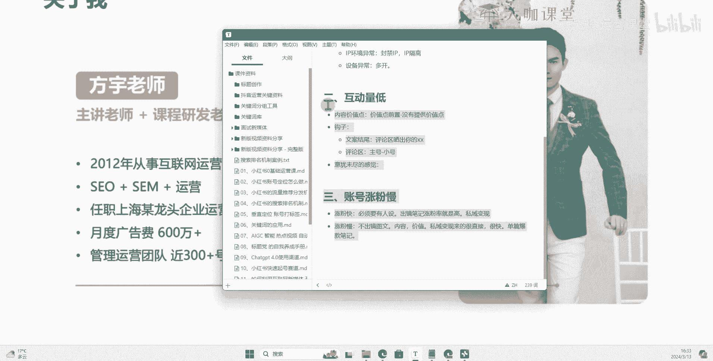

# 【全200集】强推！最详细的新媒体运营课程，小红书运营新手起号，一周学完就业！抖音零基础干货教程，看这一套就够了！ - P26：24、图文笔记：三大核心运营问题：互动低、涨粉慢 - 方老师运营课堂 - BV1egpteJEpN

Hello，大家好，那么上一节课呢，我们针对小红书运营中的三大核心关键问题。

小眼睛持续低迷，这个呢给大家做了一定的解答，那么接下来呢我们来聊另外一个点，就是如果说你遇到了你的笔记持续互动量低，到底哪里出了问题，OK那么这里呢我来跟大家讲一下，就是有两个啊非常关键的核心点。

首先第一个呢，第一个是我们的内容价值点是否满足了，那么我一直跟大家提啊，跟大家讲强调就是我们现在做小红书运营，你一定要关注你的账号的一个笔记的，它的一个价值点，你是否有真真切切地满足了用户需求点。

我们呢在假设啊，你现在小红书的这个笔记，他的小眼睛还可以的情况下是吧，有那么三百五百，或者说啊甚至说200，那么我们去设想一种情况，这两百三百五百里边，有没有可能有你的精准用户。

那么这个问题呢大家可以想一下，其实的话我告诉大家，你只要拿到的流量有流量的分发，那么这些里边儿是绝对是有，包含你的精准用户的，不管你做什么赛道，只要有这个流量分发，你的关键词包含了你的笔记内容。

里边做了这个关键词的一个定向标签打了，那么这部分流量里边一定是有你的精准用户的，不管这个精准用户有多少，它是一定有的，那么这部分用户进来之后啊，一开始它的一个比例，一直到最后我们笔记产生爆款之间。

它的一个比例呢是呈逐步增加的一个态态势，比如说一开始给你分发300个流量，这300个流量里边可能至少有30个到50个，至少啊是有是你的精准用户，那么这些用户进来了之后，他没有给你点赞。

收藏以及给你评论的一个内一个一个问题，你觉得可能是出在哪里呢，那么我们想一下，你的笔记有小眼睛是代表什么呀，其实就代表了他有点击行为，对不对，他点击进入了你的笔记，但是他跳出了，他立马就返回了。

这是什么问题，这就是因为你的内容没有提供用户，它吸引的价值点，或者说你没有把价值点前置对吧，两个点，一个是价值点前置。

一个就是没有提供价值点嗯，没有提供价值点，这个很好说了，就是你的笔记里边一堆废话，甚至说你的封面，或者说你的内容图里边根本就没有提供，你封面上要告诉用户的东西，然后呢呃甚至说你的文案这一块。

你也没有给用户提供一个清晰的排版，或者说让它看起来很舒服的这样的一个结构，让它意义，也能从你的笔记当中得到他想要的东西，比如说我们去写一篇关于旅游攻略的，这样的一个笔记，他的笔记呢从上到下肯定是包含诶。

第一天去哪里旅游旅游路线，然后呢哪个地方建议去花多长时间，坐什么车对吧，从这一排下来，然后第二天去哪里，然后哪些景点呃优先去啊，坐什么车，什么路线，第三天等等，你做这样一个直接的结构，一个下来。

这个就是我们提供价值点对吧，然后呢，还有一种情况就是我们的一个价值点，前置的问题，可能说你这篇笔记文案啊当中，你提供了这个价值的有价值的东西，但是呢你前面加了一堆废话，哎欢迎同学们啊。

欢迎大家来到我们的这个呃看到我这篇笔记呃，其实之前啊一直怎么怎么样啊，然后呢呃讲讲故事啊什么什么的，谁愿意看你这些故事呢，用户呢他看你的笔记，一定是通过封面想要去进入到你这篇笔记，得到他自己想要的东西。

这个是非常关键的，也就是说你的价值点一定要要么就是没有废话，要么就是你的价值点必须要往前面放，哪怕说你要放钩子，你也得放在最后，而不能说往前面前置，这个是我们前期起号的时候，大家一定要注意的点。

内容价值点前置，还有呢内容一定要去提供，就是用户你至少说你做的这篇笔记，那么根据我们提供的这个教大家的一个，选题的方式，你一定要提供满足当下用户需求，也就是我们这个选题的一个关键内容。

这个就是我们的内容价值点，这个非常关键，我一直跟大家讲，就是你只要你的笔记封面标题设计的好，你只要有点击率，其实我们是有很多很多办法，可以让我们的精准用户来了，我就能让他给我产生点击数据啊。

我们的点赞收藏甚至是评论，这个是完全有办法可以办到的，当然前提就是取决于，你到底会不会在这个文案里面加上，或者说你这个封面图片里边的文案图里边，你到底有没有办法提供他想要的价值点。

这个就是我们提供的价值啊，也是我们内容为王的一个核心嘛，那么第二个呢就是我们讲到的一个钩子对吧，我们时常说呃拍短视频要留钩子对吧，我们做文案也要留钩子，是不是你呢在这个我们前期跟大家讲的时候。

就是前面几节课跟大家聊过，就是你留钩子这一块呢，我们可以通过正文的文案内容去留，然后呢也可以通过什么呀，在评论区去留，对不对，这两个方式都能够让你的这个笔记，有一定的互动数据，那么文案里边留啊。

嗯在文案里边留，可以说哎大家来参与一下这个互动，在评论区晒出你的对吧，晒出你的某某，对不对，这种方式很常见，为什么咱们不去用呢，这是非常简单的对吧，这个是我们的一个文案区，文案结尾对吧。

然后呢还有一个就是我们评论区，评论区呢用自己的方式，你可以用自己的一个主账号去告诉大家，需要领资料的，或者说呃有没有遇到同样情况的，或者说你最近是什么样的一个呃，这个这个这个这个啊。

你最近是什么样的一个情况，在评论区打出来都可以，或者说呢你用小号对吧，一个是主号，然后呢，另外一个呢是小号来配合着。

在评论区配合主号来做这个评论的引导，这些都是可以去做的，没有多大难度，真的很简单好吧，你用这些方式，你不要说就是我们之前说的，你不要去做纯纯的去做分享嘛，对不对，你分享了你还得告诉别人。

哎我这个内容是吧，嗯有一定的价值，你呢要参与我的这个评论是吧，我肯定是有一定的目的的，对不对，那么其次呢还有一个小方法，对不对。

互动量低，是不是还有一个小方法啊，还有一个小方法，就是我们可以可以做出一个，什么样的一个感觉呢，就是我们的内容啊，让用户有一种意犹未尽的感觉，什么意思呢，就比如说我的封面上。

我告诉大家哎护肤呢要讲究这18个步骤啊，这18个步骤，但是我没有办法完全提供嘛，对不对，我的文案里边可能只讲那么一部分，我讲的1~8，对不对，还有呢十个点哎，我写不完，然后但是呢我整理成了一个什么呀。

我整理成了一个攻略的视频，或者说一个教程，一个方法，一个图册，然后需要的在评论区扣个一，我私信发给你，或者是呢我的文案图里边呢，呃就是我封面后面这个图片里边，我只放部分内容对吧，我只放个八条。

或者说我放个六条，剩下的写不完，这最后一张图写一趟评论区嗯，呃打个一或者说评论区扣个给什么，想要等等等等，我私信发给你，这都是一种方法，就是呃内容需求和价值，然后呢配合咱们的钩子。

再配合咱们一些其他的玩法，你想提升互动点是非常简单的，这个就要靠咱们有一定的思维，和有一定的这个认知来做这个事情。

好吧，这是互动量低解决办法，第三个呢就是我们账号的一个涨粉慢了，那么这里呢我要跟大家说一下啊，如果说你的账号遇到涨粉慢，你就要看是这两种情况啊，我们首先我来跟大家讲一下，小红书上面的涨粉呢。

它是有一定的嗯，我们知道啊，小红书上面呢它目前呢一个是视频对吧，然后呢一个是图文，那么我跟大家讲一下涨粉和不涨粉的一个情况，第一个涨粉快是什么样的一个情况呢，涨粉快必须要有什么呀，涨粉快必须要有人设。

人设是怎么来的，人设是怎么来的，人设并不是说哎我在我的介绍里边，我的名称里边，我告诉大家我是谁谁谁对吧，人设是怎么来的，人设是非常关键的一个东西，你必须要有出镜，对不对，你出镜告诉别人我是我是谁对吧。

你经常经常能够刷到我，诶你对我的印象已经比较熟悉了，那么呢诶觉得我讲的还可以，不管是图文或者说是视频，那么出镜的这种笔记，它的涨粉率，就是高好吧，出镜，附近的涨粉率就是比较高。

然后呢呃但是也有一个也有个问题哈，也有个问题，这也同步讲了，涨粉快对吧，出境人设高，但是这种呢如果说你想去做私域变现，就会稍微有点困难啊，他不是说稍微有点困难，而是没有我们下面要讲的这个图文笔记。

来的更加直接，私域变现啊，那么我们如果说做视频对吧，然后呢我们做这个呃出镜类型的图文啊，当然一般的啊出镜的话肯定是以视频为主的哈，比较多啊为核心，那你做这一块的内容呢，你的人设你的涨粉会比较快。

但是呢你的私域变现呢就会来的稍微慢一些啊，来的稍微慢一些，待会我再跟他讲是为什么，然后其次涨粉慢，涨粉慢就是我们的一个图文啊，我们不出镜的图文，不出镜的图文涨粉就是慢，因为什么呢。

因为这样的一个账号他没有人设对吧，没有人设用户，他看到这篇笔记，可能说哪怕你是作为一个机构，但是用户看的是笔记，他看的是什么呀，他看的是内容，文字内容，还有你封面以及你里边提供的这些内容，图里边的内容。

它看的是价值，对不对，他看的是价值，也就是说如果说价值提供了很多用户，他就知道自己想要的东西，他不会再理你，后续的不会说什么，给你点个关注啊，他了不起，给你点个赞，收藏一下诶，方便后续自己啊。

可能说有可能回来回看，这就是不出镜的一个一个点，但是图文类型不出镜的图文类型，它也有一个优点是什么呢，他的私域变现来的很直接啊，来的很直接，而且很快。

为什么呢，因为小红书有一个特性，就是它的一个搜索搜索的排名呢，呃搜索排名这一块呢得出来的结果嗯，你们可以想一下什么样的人，他会去搜索，他有什么样的一个需求，他会才会去搜索呢，对不对。

他肯定是当下有迫切的这个需求，想了解这个事情对吧，他才会去搜索，那么搜索的用户呢就在就代表我们刚才说的，他的需求很直接，他得到你的笔记了之后呢，你的笔记里边一定一旦有，我们设置这些钩子或者说内容点。

他一定会在评论区，或者说啊也不说一定啊，就是绝大部分绝大概率，他就会通过你的这个私信，或者说你的一些设出设立的这个钩子，他会去联系你啊，他会去联系你，会去跟你交流，这个就是图文笔记的一个优势。

也就是说图文笔记这一块呢，他其实更在乎的是单篇笔记啊，单篇爆款笔记，也就是说图文，他就更在乎我们的笔记到底有没有爆款，然后呢我这个笔记参与的排名怎么样，在什么样的一个搜索词下面。

能够在第一屏搜索词的第一频，能搜到我们的笔记，这个非常重要啊，非常重要，也就是说呃他的私域呢来的变现来的很直接啊，这就是我们这一块的一个呃一个重点，如果说你的账号遇到涨粉慢的，你就得看一下你的账号。

是否有能力去凸显自己的一个人设，当然也不是说呃一定得出镜啊，一定得有人物，这样你才能够就就就就才能去完成这个人设啊，就是我们其实还有办法，也有办法，能够通过一些其他特殊的这种运营方式。

让我们的账号能够得出一定的人设，但是它远远没有我们出境的这种笔记来的，这个人设来得更快更直接。

好吧，这就是我们跟大家讲的这一节讲的，如果说呃你的账号遇到互动量低。

有哪些问题，你的账号涨粉慢。

