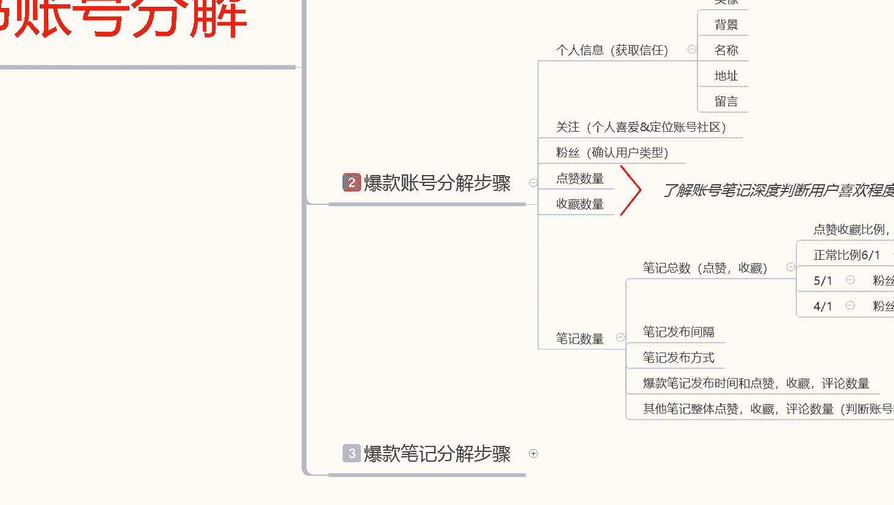

# 【全299集】强推！！2024（全新）最保姆级小红书运营自学教程，小红书起号到爆款店铺打造必学全套运营流程，新手开店必看！拿走不谢，允许白嫖！ - P2：02、新手小红书账号运营-账号全面解析（2） - 红书运营 - BV1jCYWeqEP7

好我们继续啊，刚刚喝了口水啊，讲到讲到粉丝比例这个地方了啊，粉丝比例，他的一个粉丝比例的话是非常不错的啊，整体来算的话，额粉丝的话大概有1万比例的话，你做到这个比例点就可以了啊，就说正常比例点的话。

六比一粉丝低于1万，你的粉丝比例的话，就是这个点赞和收藏做到，六比一就行啊，你如果说超过这个数据的话，就代表你这个账号做的还是不错的，他这个账号就是做的还可以，整体数据还是比较均衡的啊。

1万左右的话基本上就是五比一，然后粉丝1万以上的话，基本上就要做到四比一，你超过这个数据的话，代表你这个账号的一个啊，提升空间是非常大的啊，这个是了解你整个账号的一个纵深，提升空间有多大。

然后通过这个以后的话。

我们再计算它的一个下一个点啊，笔记发布间稿，他的这个账号的一个笔记发布间隔的话，我们可以去计算一下就可以了好吧，目前是70篇笔记，70篇笔记的话找一下最新的，这个是什么时候，这个是7月14的。

应该不是最新的，只是说那款爆了以后，一天前，今天是，今天是24，一天前，也就是说他昨天发布的额，现在是四点多钟，这个还没做起来，这这个的话就估计起来就够呛了，这个50几的。

因为的话技术曝光量只获得了这么一点点击量，他这个偶然间爆的这一款的话，一般，笔记发布间隔，这是一天前的，然后我看一下这个，这个是7月80七二十三，23的话间隔时发笔记。

发布时间的话大概是间隔六天左右，发布时间六天，也就是说他对这个账号的话怎么说呢，了解的就是没有太重视，有时候的话闲的时候发一下，你说没有怎么主打做小红书啊，15，14之前的话就是说十几号的时候的话。

基本上都是一天一发，看到没有，30啊，大家看这就可以了，30对吧，27对吧，基本上的话就是自己看店，应该是自己的店，然后的话自己看店，然后去小红书上面去做，整体的话就是间隔时间，就是看自己。

这个个人消息有点麻烦啊，就是间隔时间的话，可能就是有时间就去发，没有时间的话就不怎么发了，然后他这个2000多亿的一个爆款的话，是什么时候的，是7月14号的，也就是说这个账号的话报起来还没有多久啊。

因为他其他的一个属性点的话不是特别好，我刚刚观察了一下，他这整个六车篇笔记里面的话算1000以上的啊，就是这个点赞的话，1000以上的话就这一个，然后100以上的话有17个，你可以把100以上算成小报。

因为对他这个账号来说的话，基本上没什么权重的一个账号来说的话啊，就是100点赞以上的算小报，1000以上的话算大宝，一个大爆，17个小爆，整体占比的话，70篇笔记，18个数据点占比的一个比例量的话。

大概有25%，然后平均每一篇笔记的话，就是你直接算他的平均值就可以了，1万9的数据量，然后70篇笔记，18篇爆管，18片爆管的话，你穿那个呃这个点赞与收藏的一个数据数据量，平均下来的话，也就每一篇的话。

这18个爆款里面每一个笔记的话，大概可以给他1000个左右的一个点赞与收藏，人体的话，他这个账号做的是不错，只是说他自己的话没有时间去跟进啊，大家可以想一想啊，人家没有时间去跟进的话，这个笔记做的多。

就说这个账号的话，对于这么多粉丝和数据量了，你们自己研究小红书这么久了，自己做的怎么样是吧，也没什么啊，方式啊，自己的了解啊对吧，这些东西其实很多东西的话，你都要需要自己去学习的啊。

他这个数据点给他算下来的话就是大包一个，小包17个，然后的话整体的一个点赞与收藏的话，大概是1万9，粉丝的话大概是1万，这里面的话70篇笔记里面有18篇爆款啊，这两个数据合并这个就是18篇爆款。

然后的话他整体爆款概率的话，大概可以给他啊评个2。5，什么意思呢，四篇里面报一篇，只要他有时间发，说实话他这个账号的话做起来还是非常不错的，然后每平均每一篇笔记的话，大概获得1055个的点赞与收藏啊。

其他的一些60还剩下那个52个，那个小笔记每获得了几十个点赞的话，你就不需要去给他算了，你要算的话也可以算知道吧，52，然后的话你把他那个平均值里面的一个属性点，就说52个里面的话。

你每一个基本上就点赞，大概本来就是100以下，你把那个平均值的55个给他啊，基本上就差不多了，也就是说他这十盘篇笔记的话，每篇笔记的话大概获得了1000个点赞与收藏，基础的一个属性点。

就是每篇笔记的话大概有100个点赞与收藏，那我们再去看他的一个这个属性点啊。

100个点赞与收藏的话就是十几篇笔记的话，点赞与收藏乘以呃，11倍，100×11倍是1000，那他在第三层级，也就是说他这整个账号的话就在第三层级啊，笔记录游览量的话。

大概就是500到2000的一个小眼镜数量，综合平均数据啊，你自己去算，自己去分析，也就是说他在第三层级，大概有500到2000的一个呃点赞收藏量，然后往上面去翻500到2000，这个范围的话。

他应该是在底层，他在第三层级的底层啊，因为他的平均属性点只有100多，正常的话应该是在第二层级，但是你去算的话，他18篇的话应该是在第三层级啊，第二第二第三层级之间晃荡，因为他平均有超过500的。

但是超过的不多，整体算的话是在第二，但是单篇笔记的话，有在第三的那500再乘以四一对吧，拿最小的数据去给他算嘛，那个2000的先不算吧，拿500去再去乘以四一，大概的话也就是5000多。

一篇笔记发出去的话，平均每天的一个曝光量的话大概是5000多，你这算曝光量，曝光量计算完成以后的话，你就算他的那个点击率对吧，点赞率，互动率，完播率去算他单边的笔记数据。

你就能得出他这个账号额有没有用心，对不对，然后爆款是通过什么方式去报的啊。

这个就是他这个账号的一个基础属性点啊，笔记发布间隔比例，发布方式，然后的话笔记发布的一个时间地点，点赞收藏数量，这个的这几个点啊，判断层级已经给他判断出来了对吧，爆款笔记发布的一个时间和点赞收藏。

因为我这个呢是随机的，我随机给大家找的这个账号。

因为我是随机找的一个账号，我没有去关注他，如果说我去关注这个账号，我要去了解他这个账号就是同类目啊，其他内幕的也是一样的，操作方式，同内幕的一个属性点，我要去了解他这个账号的话，我会去观察他。

这整个账号大概3~7天的一个属性点，D就是我就在他就在我这个里面懂我意思吧，如果说我要做女装，做同类型的一个产品，它就在我的关注里面，然后我关注里面的话，我就会通过这个表格啊，我自己做的表格发布时间。

点赞收藏评论，看第一个吧，后面你们可能看不懂啊，记住时间额，现在是因为这个表做的有点早啊，现在是今天是24号，我就会记录他的一个时间段，然后去观察他这个几天的一个时间，你自己想要观察这个账号。

你想去你觉得学得快，那你就少观察一点，学的慢，你就多观察一点时间段，通过这个表记录他的一个记录时间，他自己的一个账号名称，你比方说把这个名称复制到这边来对吧，然后他目前有多少关注啊。

就是他自己对应账号关注了多少个用户，然后的话有多少粉丝，多少点赞与收藏建议的话，你们去找找这种账号的时候，关注他像这个号啊，肯定是不合格的，为什么，因为你看不到他的粉丝啊，你看不到他的关注。

你去关注他的话，你只能拿它把它往关注里面丢啊，不要去考评他的数据啊，因为你考评不到他这个里面的一个粉丝，的一个社交群体，你不知道就是粉丝大概喜欢什么样的一个类型，你看不到，然后这个关注里面的话。

他所关注的一个对应内幕的一个产品，你也看不到，你尽量去找的话，就是第三个点都能点开的啊，这个点你能点开，但是前两个你点不开啊，有些设置以后的话可以看到，有些不设置的话，你看不到了解这几个点。

然后的话记录他的一个爆款标题，这个里面的话啊，比方说我刚刚给大家看的啊，这个2000多的，近3000的肯定是要记录的，对不对，这个700多的也要记录，你像对低于100的这些你就不用去记录它了。

你把他这几个几几个组爆款，你比方说刚刚我算的是额一个组爆款，17个小爆款对吧，你也不用去记录那么多，你记录前五个或者前十个对吧。

就可以，然后你如果说嫌麻烦，那你就记住前五个基本上都能把数据测出来，五个左右就可以测数据了啊，我记这么多的话，只是说为了方便你们去看的，当然我这个的话是之前记的啊，不是他的啊，我现在懒得去给他导。

你把这个属性点给他记录下来，然后去每天观察他的这个发布时间，这个发布时间如果说他是今天发布的，你能看到他是几点发的，懂什么意思吧，比方说我们在这里一天前发放地址是四川，如果说他的这个属性点是当天发的。

你能看到他是在早上的几点，中午的几点，晚上的几点啊，比方说14。40发的，14。50发的，你都能看见，你就知道他自己这个啊，同类目对应的属性点在什么时候发，获得什么样的一个效果，你自己又能测不出来。

这个就不用我教了吧对吧，你关注个十个20个，你每天去这么搜集一下资料，因为你小红书的话，每天笔记就发一篇到两篇就可以了对吧，不用发那么多，发一篇笔记其实都够发两篇笔记也可以，对不对，你把这几个。

然后把剩下的时间去拿来，找一下你自己对应关注里面的一个属性点啊。

关注对应的属性点，看个五个账号啊，能把这三个点打开的啊，这个关注能打开的，粉丝能打开的，你去记录他的时间，然后发布时间是什么，在几点钟发的，然后这个这个笔记发出去以后，他是怎么报的。

大概多长时间获得了多少点赞，你一天看一次就够了，都不用多久知道吧，记录一个大概的一个范围。

然后的话你再根据自己内部去评判一下，你基本上就很好解。

很好的，就能把他这个账号的一个属性点，给他反推出来了啊，这个里面的话就是然后记住他的点赞收藏评论，然后去反计算啊，通过相反的一个方式去计算他的一个技术，曝光量就可以了，我刚刚就已经给你们。

把他的那个店铺成绩已经给算出来了，这篇笔记在第三层级，其他的基本上都在第二层级啊，超过200以上的这种点赞收藏，基本上都在第二层级，这个的话在第三层级没到第四层级啊，2000多呃，500到2000。

这个点赞2900没到第三层级。

因为他这个时间段的话，数据量已经快过了，他这个是几号7月14的，这都已经14天了，马上结束了。

这个账号的话拖不上去了，他的属性点也就也就在2900左右了，第三层级往第四层级的门槛靠，他的排名的话肯定是突破不了第四层级的，因为他是大类目，他的技术属性点绝对不是500到2000之内的，这个范围之内。

好吧，这个呢就是账号分析啊。

这个这几个点啊，我希望大家你们都明白一下，就是说有些东西的话，你要了解自己做的一个爆款怎么去做，怎么去了解，以后的话都是通过这种方式啊，包括后续的话我给大家进行分享嗯，其他类目也好，其他产品也好。

我都会通过这个方式去给你们讲解一下，因为这种方式的话，你们可能呃有基础的人，可能会了解的更清楚一点，如果说没有基础的话，你们可以去看一下我的其他视频啊，基本上都有发布的同类型的一个东西啊。

这个里面因为他的一个我选的这个账号，这个关注粉丝，你不能看呃，还有我没有每天去跟进他的一个数据啊，因为是随机找的一个，所以说我不知道他的一个笔记发布方式，和笔记发布间隔，笔记发布间隔的话。

他这个这个笔记发布间隔给他算出来了，随机的，有时间就发，没时间就不发了啊，他也没怎么用心去做。

然后他这个里面的一个产品，啊基本上就三款，你看来看去也就三款，哪天有时间心情了，换换个颜色呀，把衣服除一边刮一下，然后拍一下，基本上就是按照这个方式啊，都差不多的，没什么太大的一个新起变化。

偶尔变得那么一两下啊，然后这个账号报的话是7月14号报的啊，大家直接可以直接看到你其前面基本上有，但是不多，正常报的话就是7月14号报的啊。

这个就是他这个账号的一个数据量，然后自己的话对号入座，找一找你，你们各位啊自己在什么层级，对不对，自己给自己先分析一下，然后去分析别人的店铺，这个是爆款账号的一个分解步骤，账号分解完成以后。

下一步是什么呢，笔记什么意思呢，他这一篇笔记为什么报好吧。

我们先来看一下啊，还是这个啊，嗯这个3000的。

啧这个点的话。

其实我们要去了解他的话还是比较容易的啊，因为爆款笔记的话，他就没有账号那么复杂了，他这几个几个重点，几个特色基本上都在这个地方嗯，首先是主图分解，主图分解里面的话就是高吸引啊，高吸引的一个点击率。

然后高吸引的一个共同点，然后第三个呢就是知识点，第四个是图片吸引力，第五个呢是文字吸引，这几个点，你要去看他在这个五个知识范围点里面，他占了几个啊，首先我们看第一张原图，说实话我进他这个店。

我我没看他的图片怎么样啊，因为我不是选女式服装的，对不对，我没有看他图片怎么样，我只是随便点进来了，那我们在这个里面的话，首先第一个点他给我的感觉是什么呢，诚实，什么叫诚实呢。

他这篇笔记的话是相当于是在街上随拍，但是它其实是电阻，我们看他的账号内容的话，你就能了解他其实是电阻，那他店主拍摄这一个图片的目的是什么，对不对，这个店我看着还不错，我分享给你们了。

这就是小红书的终极目的，把我身边的日常分享给我对应的用户群体，他做到了，对不对，这就是高共同点啊，高共同点喜欢这个服装类型的人，他或者说是喜欢他服装类型标题啊啊关键词啊，属性点啊。

或者说他图片的一个内容比较有吸引力的，我最近想买衣服之类的，她就会去看，因为我是男性，我没办法完全去评判这个女性的图片选择，审美观啊，我只能从这通过这几个点去了解他，这个高吸引点击率。

说实话我们正常看的话，他这个点击率真起不来啊，他这起来的话说实话不在我的审美范围之内啊，他这个报的话就是主图分解里面的高共同点，包起来的知识吸引有吗，没有知识点没有，对不对，图片性说实话。

图片这反光效果和图片的一个知识点也不好，也没有文字吸引，它基本上都没有文字，哪来的文字吸引呢对吧，看第二个图片，这是他自己店铺的一个位置发放啊，还没有介绍到产品的一个范围。

这个是进入店铺以后店铺的一个白色，其实风格他这个店铺的风格还是不错的啊，呃不不算一个小店，其实正常来看的话是小店，因为他的话不算什么品牌店之类的一个东西，私人开的那种。

你比方说去步行街啊看的那种小商店啊，然后的话不是很嗯，应该说是繁华的地带，创建的一个不是很繁华的店铺，或者说是不是繁华的地带，创建了一个繁华的店铺啊，你可以去这样理解你，我们自己来看一下啊。

成都市成华区培华东路6号，这是他地址啊，然后看电看内容。

刚刚看的是图片，他用的是高共同点，这个点的话，来标出来高功能点关键词。

关键词在下面的不算啊，只算这几个，来成都最大的收获就是这家店500块钱买三件，直白文字描述，这个很明显就是直白文字描述啊，这个没有共同点描述，也没有知识点介绍。

也没有好奇心描述，这三个点不用啊，他这个账号爆款的话，他是选的是这个啊，共同点高共同点。

然后直白文述文字描述，看内容，因为他这个的话是谁拍的，你我们大家可以看得到的啊，他这个的话绝对是店主个人发放的，他就是因为他所有的内容都是这个，它只是以一个用户的角度，它所发放的笔记内容。

也是以一个用户的角度来观看这家店啊，适不适合你们，然后去寻找共同点，也就是说共同点描述，它这个的话是内容分解里面的啊，内容分解，视频分解，评论分解，它这个是图片，也就是内容分解里面的内容分解里面的话。

吸引记忆点，共同点，知识点，共情点和引导点，他这个里面用的是共同点，知道吧，用的共同点，然后引入引导点再申请啊，这里面没有知识点，也没有吸引点，这个就是他这一篇爆款的一个主体框架啊，你们了解一下就可以。

因为不一定适合你们啊，然后我们看他的一个整体评论呃，应该说是这篇笔记的一个实体内容啊，网友果然没有骗我，真的很好看又便宜，对不对，套了三件不到500块钱，性价比贼高，也就是说他这里面的衣服的话。

大概就是100来块钱1000，有兴趣的朋友你们可以去看一看，然后或者说你们看上哪一件衣服了，我可以发给你们，第三句，这家店真的一直在上新，对不对，就说这家店有很多新款，而不是老款，不是之前的用的啊。

你们如果说喜欢新奇的，喜欢新产品的，喜欢提高自己个人的，可以来我的店里看我的产品，我给你们做介绍，店里面夏款和秋款的都有，也就是说他这整个账号的话，他是准备做长时间的，因为我那会看他的那个笔记内容。

里面有一个去年7月份的啊，品类和风格都有，就说你喜欢什么样的，我可以给你介绍，你如果说买不着，我也可以帮你去购买代买，店铺陈列很舒服啊，整体风格韩系简约小众，均价几十块钱到300，最高的也就300块钱。

便宜的也就几十块钱，就看你自己买大件或者小件，就是介绍他自己店铺里面的，一个产品的一个介绍，然后店员会一直帮忙搭配着火，我们也就是说店铺里面的一个嗯服务员，销售商对吧，有问题你直接联系他。

他们的服务态度非常不错，他想表达的就是这个意思啊，让我们自己选择，不会硬化，什么意思呢，据说啊店家尊重你的选择，站在客户的角度为你去考虑，你自己喜欢什么样的，对不对，就是什么样。

或者说你自己穿着什么样合适，然后的话在两件产品之中哪一件好，哪一件不好啊，他可能会帮你做参考，但是不会去硬夸你本来长得五大三粗的对吧，去穿我的这种小小衣服不好看，但是我觉得你非常好看。

这种就是说他没有夸大，就是说在这个里面找共情点，懂我意思吧，共情点这个里面引导是什么地方的。

均价几10~300，对不对，共同点是什么，我站在客户的角度为客户去考虑考虑啊，这个均价几10~300的话，也可以把它评判为细一点，但是它整体细一点的风格的话，他是不怎么充足的啊，最后一条来自成都。

来成都一定要逛逛这样的一个小店，简直就是说太好了，然后把地址留下来了，把营业时间留下来了，就说你们有时间可以去成都去逛去看懂意思吧，这个就是做引流的，但是他不懂得引流。

因为他这个账号的话是7月14号报的，说实话他没有在小红书上面去认真的运营，他也70%，站在了一个客观的角度上去评价他的店铺，他整体抱起来的话，说实话嗯共情点知识点，这几个这款爆款笔记的话就是时间原因。

懂我意思吧，他不是偶然的，因为他整个账号的一个色子啊，他不是单品设置啊，他是整个账号的一个设置都是比较完美的对吧，logo店名对不对，店名对应上了对吧，卖女装的店名，谢谢你们的关注和喜欢。

寻找共同话题的一个人群，也就是说一个小姑娘在买衣服，这绝对是一个小姑娘啊，而且年龄不大，20多岁啊，30多岁，他不会有这种呃这种思考的一个方式啊，因为他的一个生活是非常阳光的。

而且他们没有过多的经济利益来往，为什么这么判断，因为他的账号他自己都没有怎么去打理，他是有时间去发啊，坐在店里面没事了就去发一下，然后每天发个一天，对不对，而且有时候的话间隔六天，说不定电关门都是六天。

但是这种情况基本上都很少啊，基本上就在店里面忙，然后的话没有时间发发送笔记，对不对，说实话他这个笔记报起来的话不是偶然，第一个呢是他坚持，为什么说是坚持呢，它整体数据量笔记发布已经发了70篇了啊。

有这个数据量的话，其实，包括他这个账号的设计啊，包括他这个店铺里面啊，就就说这个账号整体的一个设计都是用心了的，他没有说盲目的向，比方说给大家看一下，我这个我随便创造一个账号啊，做的好玩的啊。

前期为了拉数据的时候做的，我基本上刚没关注他，看能不能找到啊，找不着他无所谓了，等到时候再说吧，不行的话，下下节课再给大家讲详细一点对吧，我这个我这个账号的话就是随便发的啊。

前期的时候做了一个做了一个账号，开店以后的这边有笔记，对不对，这里面的一些那个商品数据啊，包括其他东西我都没有做对吧，你看我这个是新号，我只是把我自己的一个手机头像放上去了，我背景没有做对吧。

名字我随便选了一个，其实我又没电脑，我没有点，对不对，简介我没有做其他的属性我都没有做，然后的话我做了一下关注，关注的话是为了前期养号啊，方便做定位，做数据，做测试的时候，我专门做的这样一个账号。

当然我这个号也不止有一个，这个是新做的，其他的那些做的一个小的，这个是我个人自己没事干，刷小红书玩的时候留的，其他那些没有用的时候，我就把它删掉了，因为有时候的话，一个手机上面账号放多了以后的话。

你后续真要去小红上面啊，再去做运营啊，做之类的东西肯定是不行的，这个账号我肯定是不会拿来去直接做电源，做引流的，因为这个的话我就是我测测数据，然后的话做属性点用的啊，手机的话你们想要做网络运营的话。

你一部手机肯定是做不了的啊，你最少要有个两三部手机，因为你还要去做评论，做其他的一些类型的一个东西，刚刚是这个对吧，我没有关注他，这个是小红书系统自动匹配给我的啊，我可没有关注他啊。

哼他匹配给我以后的话，因为我在这个店铺里面逛逛网的时间长了以后，他下回的话就直接给推给你了，所以说还能找到他，然后我们继续往下面走，我们看了他的这个主图分解，关键词分解，然后的话内容分解啊。

这几个点分解完以后的话，把它的属性点看完，然后就看下面看到没有互动，网上有办法买吗啊，有人去问了群聊，然后这个是作者群聊艾特小号，看到没有，这个就是小号去做引流了，懂不懂，小红书上做引流就不用我多说了。

我那会已经把他的这个整体数据算给你们了，他最少得通过引流的方式，吸引了最少350个固定房客，而且我这是按最少的比例去算的，绝对不止350啊，只多不少，所以说导致他最近这个啧14号以后。

就是这个爆款起来以后，14号以后都没有机会来去更新小红书了，你往14号以前看他13号，15号，16号，17号基本上都有他这个笔记，报了以后多久没有发新的笔记了，对不对，大家可以去考虑一下。

所以说忙起来了啊，然后下面我经常在你家纸巾店买，也就是说同城的啊，有人做的一个数据量，要不就是他朋友，可以去看一下他朋友的一个属性点，这个应该是他朋友，而且应该是建了一个新号，看到没有关注100多个。

应该是他朋友的，然后的话他介绍他朋友来做的，因为他这个里面的话没有任何的一个介绍，而且自己自己的话，他自己的这个笔记的话，就是这个肯定应该是他的一个朋友，就都在一个一个一个方位去了。

然后的话他朋友可能是看一下小红书，但是没有了解，就算是了解也是他介绍的啊，当然这也只是我的一个猜测啊，因为很多时候你通过这种方式去操作的话，会给你的账号里面，就比方说他这个爆款。

找几个人来做一个评价对吧，做一些引流其实很好，抱起来的啊，然后再看他的回复率，你看我们大家可以看啊，前面上面的回复率3000多，对不对，5%大概的话100个就是五个，1000就是50，大概100多个。

作为的一个评论回复，他这个里面的话绝对有，看到没有，绝对有，嗯随便翻一下，你往下面翻，他绝对有，因为他就是通过这种互动的一个评论，超过这个概率以后的话啊，3000多个评论对不对，他想去引流。

想去赚这一部分钱的，他都会去找的啊，所以说人家的账号做起来不是偶然，是他坚持啊，然后组图分解里面自己有共同点，账号的一个呃技术权重做的也不错对吧。

账号的一个基础权重做的不错，基础曝光属性点的话，他的这个综合评分的话还是可以的，我那会已经给大家计算过了，然后账号里面头像有了背景，有了名称，有了地址，有了留言，有了关注个人喜欢里面的一个账号定位。

做了粉丝用户类型的话，也应该是不需要确认的，因为他有1万粉丝，粉丝数量不少，点赞收藏量，了解用户的一个深度，那会也跟大家说了啊，他的一个总笔记，点赞和收藏数量的话是接近了三比一的，一个比例。

是非常不错的啊，他这个账号的一个比例的话是接近了三比一，7000的，1万2，1万9对吧，笔记发布间隔，笔记发布方式，爆款笔记的一个时间评论数量，然后的话他整体笔记其他评论的一个数据属性。

然后他主图里面有整个店铺所共用的一个风格，就是高共同点，我以路人的角度来评判这家店铺，但其实我是我刚刚给大家说的啊，他其实就是老板，但是老板是站在客户的一个用户，用户角度上面去评判这个店铺的。

然后关键词也是直白，文字描述。

大家可以看啊，他的这很多看到没有，刚逛完啊，消费观崩塌，大家可以看啊，服务品质治理，服务品质审美完全不输专柜，对不对，这种的话他是用的那个嗯惊讶的一个文字描述，如果说你们听过我其他的课程的话。

我是有给大家讲过的啊，这里面的话有正正面的一个关键词，创建词汇和一个反面的关键词创建词汇啊，有点偏题了啊，你们了解的话就可以去看一下其他视频，或者说是直接来问我都可以的啊，据说他这个里面的话。

他这个店铺报起来不是偶然，而且他是没有基础的，他只是用心的去做了这个小红书，然后把这个小红书做起来，我们也看到他这整个账号的一个数据属性了啊，包括他是怎么去做引流的啊，这个做引流的，他这个字顶的啊。

我跟你们说了啊，这个就是群聊，群聊里面用小号啊，看他这个名字，看到没有名字，一一这个是小号，小号的话在里面去发了个嗯，其他地方的一个渠道，然后的话加渠道，然后再转移到微其他的聊天方式，然后去沟通。

你要买什么衣服，我给你介绍等等之类的，去群聊里面去选啊，他起码有几百个啊，这个就做引流的，因为他这个里面连店铺都没有，他这里面没有直销产品的啊，做店以后的话，这还有个店。

说实话他这个账号的话做的还算可以啊，对于小麦来家来说的话，做的还算可以，因为他已经做到他的目的引流出去了，但是有一个缺点是什么呢，缺点就是14号以后的话，笔记发布的话比偏少了啊，最新的是几号。

最新的是昨天再往前面走的话，就是六天前，还应该是这六天啊，已经把这个爆款账号，这个里面爆款账号的用户吃下来了，所以说有时间来发笔记了，这是昨天发的呵，不然的话他都没时间懂吧。

然后他这个提升空间还非常大啊，他这整个账号里面的提升空间还非常大的。

我刚刚只是给你们讲了，他这个爆款是怎么做起来的啊，有时间的话我再去给你们讲一下这个，他这个里面提升空间点啊非常大啊，怎么去把这个提升空间点做好。

你们其他的朋友想要了解的也可以去联系我啊，因为时间关系的一个原因啊，这一节的话其实给大家都分享，已经快接近两个小时了，一个多小时了嗯，今天呢就分享到这，下一节一节的话，下一个分享的话还是类似的啊。

只是我换一个类目，换一个其他店铺给大家去分享一下，尽量的话就是找一个，这个关注和粉丝都能看的啊，完完全全的了解一下别人的用户店铺，是怎么操作的，如果说有什么问题的话啊，各位朋友的话可以去联系一下我好吧。

