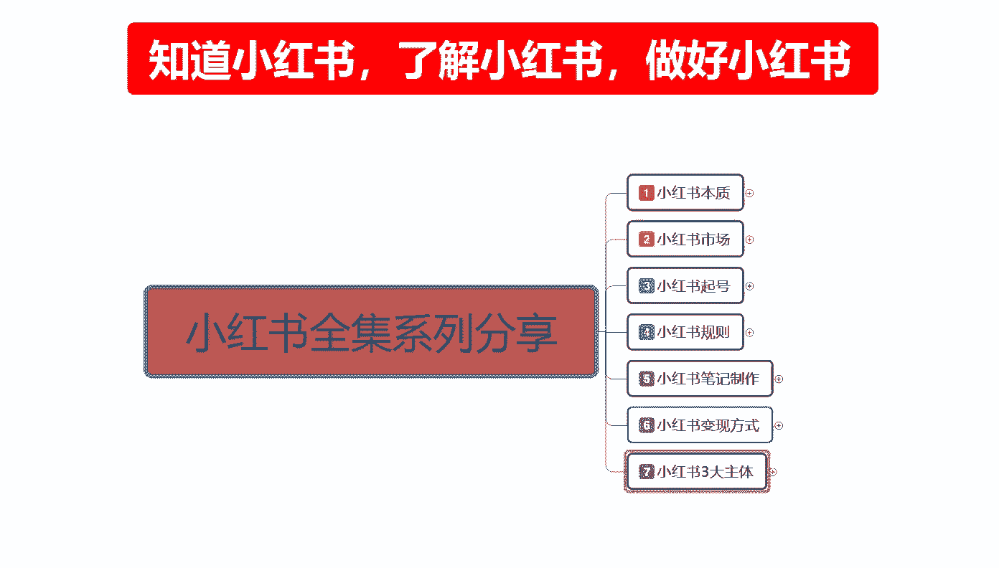
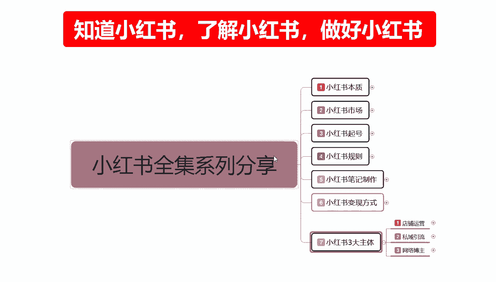
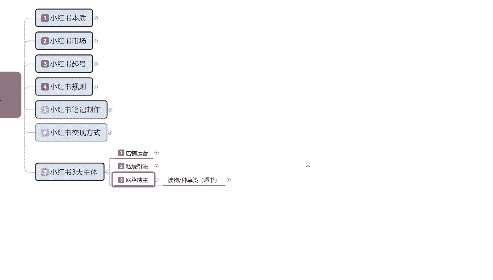
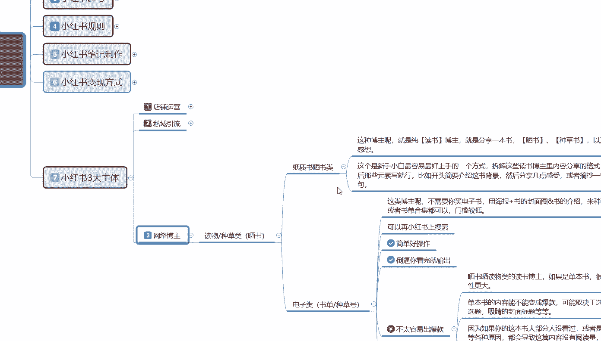
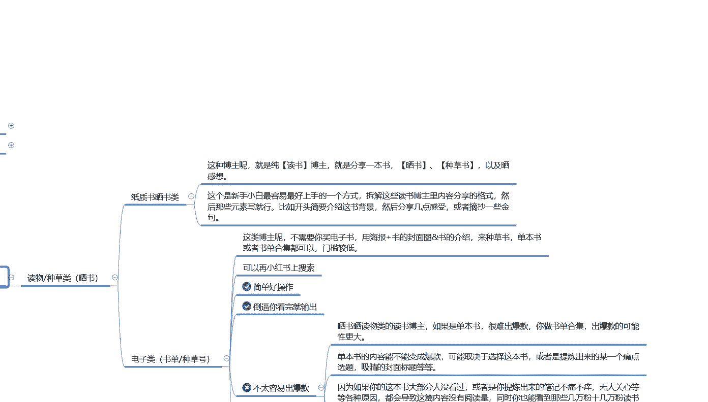
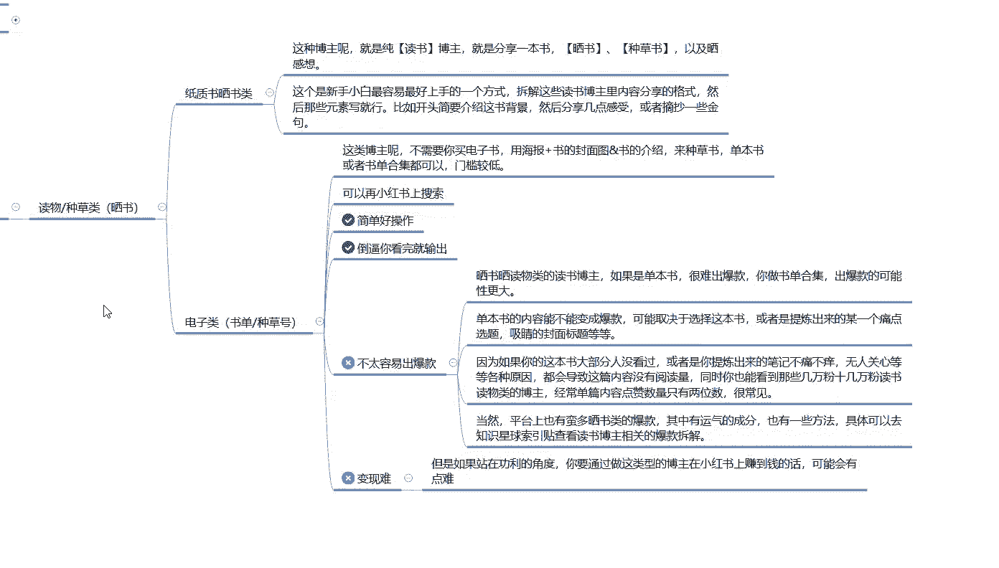
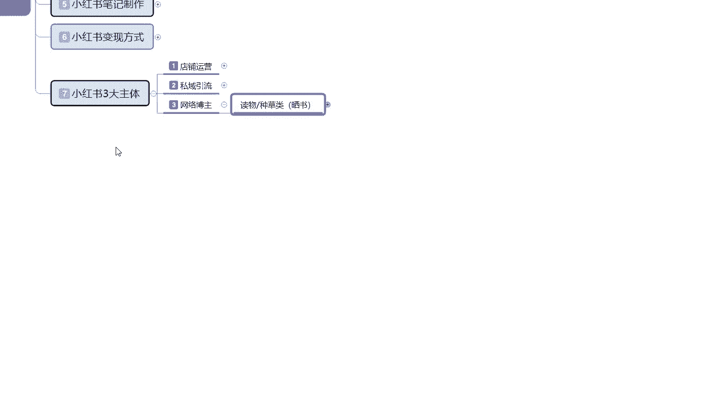
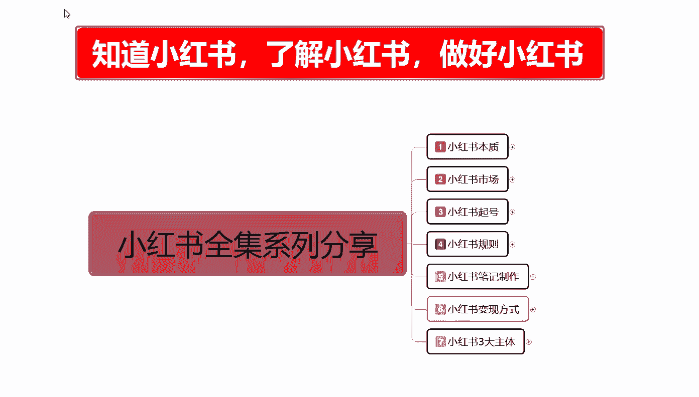

# 【全299集】强推！！2024（全新）最保姆级小红书运营自学教程，小红书起号到爆款店铺打造必学全套运营流程，新手开店必看！拿走不谢，允许白嫖！ - P46：46、新手小红书运营-网络博主账号打造 - 红书运营 - BV1jCYWeqEP7

大家好，今天给大家分享的是，小红书全集系列的最后一课啊。

小红书三大主题最后的一课啊，也是本期分享的最后一个。

网络博主的一个运营模式，网络博主啊，说实在的在这个里面的话，其实它相对其他的一个内容的话，还是比较简单的。

因为他们没有那么高的一个硬性需求，只要我们内在的一个属性量的话啊。

做啧就是内在属性做好以后的话。

其实基本上网络博主这一类的话，还是比较好做的，这里我只是说给大家举了一个例子啊，拿了一个毒物种草类的，就是分享书本类的一个知识点，来给大家进行一个讲解啊，首先是分为两个点，第一个是纸质书。

纸质书和赛数类的，第二个就是说电子类的一个图书类的，纸质赛书类的一个博主呢，这种博主就是纯粹的读书博主啊，怎么说呢，就是说什么三国啊，鸿蒙楼啊，这种博主就是分享一本书，晒书种草书以及赛感想等等。

就是我看了这个书以后的话，我有什么感想，有什么不同的见解啊，然后就是分析里面人物事啊等等，你做其他的行业也是一样的，你都是要通过我们自己所分享的一个博主类型，你分享国际时事也是一样的啊。

这个的话就是说新手小白的话，我们最好上手的一个方式，所以拆解这些读书博主内容，里面的一个分享内容格式，然后的话找那些元素写就行，比如开头简介要介绍这本书的背景，然后几个熟悉的一个几点感受分享。

或者摘抄一些京剧也同类的，你做其他的也是一样的，你要先拆解分享啊，对于新手来说的话，了解这个方面的内容是最简单的，而且方式也比较简单，在网络上面你去搜索同类的，你在抖音，去搜也可以。

你代表小红书去找同类的也可以，你去百度搜就行，知道吧，就是找同类的一个呃发布内容，你去看一下，然后的话把你的见解答上去，或者是把你的看法打上去，再实在不行，你就去把别人的复制的一个感官感受，你复制下来。

然后再发上去都可以的啊，就是搬运工小白都能做的，也是最简单的一种网络博主的一个形式，只是你的起账号的话，你后期还是要有自己的一定的特点，然后去进行分享，这种的话你到中后期的话，你要想变现，就是接广告啊。

啊卖书啊这等等之类的，当然了，我这只是拿了一个读物赛苏的一个种类，单独的一个O种类去给大家做，你做食品也可以啊，做服装也可以啊，做额穿搭介绍也可以啊，都是一样的道理啊。

比如说这种子质塞书类的话是非常简单的，然后就是电子类的一个电子类，就是书单种草号，这种博主呢就说不需要我们去买电子书啊，也就不需要充会员去了解什么，用海报加书的一个封面，加上书本的一个介绍来种草树。

什么意思呢，就是种草种草再种草，等草长高了以后对你了解，对你认可了，你再去打广告，再去做推广，就可以啊，单本书或者说是书单的一个合集都可以，就是你比方说呃四大名著对吧，他每一个名著的话。

你看简介版的也行，看完整版的也行，他的内容都很多，有第一册，第二册，第三册对吧，上中下三策，对不对，你包括你看小说也是一样的，你小说一级二级三级四级，你现在我们刷抖音，你看那个嗯。

等于上面那个现在最近什么比较火来着啊，什么穿越啊之类的，这种网文小说其实你都可以分解，拆细的都是一样的，当然了，我这只是拿了一个类目，来给大家进行了一个分享啊，就说我们把所有的内容你了解以后的话。

再把它粘贴复制下来，再到小书小红书上面去发，说实话小红书现在做这一类的话有，但是很少啊，你把自己的特点找出来就能做，也可以在小红书上面搜索，然后拆解分析，然后自己再去做也行啊，他的话就是比较简单好操作。

然后的话倒逼你看完，就是我把别人的内容看完，然后再做把内容编辑一下，然后再输出出去就行，非常简单，这个里面的话有两点啊，就是第一个不太容易出爆款，第二个就是变现比较困难，变现的话你只能到中后期。

你前期的话想变现的话，基本上没可能，人家你账号权重都没起来，粉丝都没几个，你咋去变现对吧，不太出不太容易出爆款的话，就是说单独的这个是赛素类的，不太容易出爆款，因为赛素类的一个读物博主。

说实话如果说是单本书的话，很很难出出爆款，你出合集的话，出爆款的可能性更大一点啊，单本的输出爆款的话，你去做介绍的话很难，然后单本选书的内容，不能改变成爆款的一个内容，可能取决于这本书。

或者说是提炼出来的某一个痛点啊，这些的话我既然给大家打出来了，大家了解看一下就行，当然我这个的话只是说找的一部分资料，给大家进行了一个类似的分享，你们做其他类的一个产品，我不做读书种草类的。

我做食品类的也可以对吧，我做美妆类的也可以，我做化妆类的也可以，对不对，都是一样的方式，我做战争类的博主也行，我做武器介绍的类的博主也行对吧，我是五七星爱好者也行，我是那种嗯运动爱好者也行。

我是美食专家也行，都是一样的，只是说模式是一样，你选择的路不一样，就看我们后续怎么去做啊，这个就是网络博主，我们在小红书上面，你要整体操作的一个整体思路和规划，看我们自己怎么去引导和制作。

好吧，这一节的课程呢就给大家分享到，这，也是我们这个本期给大家分享的一个全集系列。

分享所有的一个内容环节，整个课程讲下来，其实我给大家分享这么多内容，主要就是说想让大家先明白啊，我们三个重点知道小红书，了解小红书和做好小红书三个点，只有先知道了小红书他整个运营的一个系统。

然后我们通过了解小红书，他整个运营系统的一个啊运营模式，最后才是做好小红书，缺一不可啊，这就是我给大家标红，一直放在每一节课，所有的内容都在这地方显示的主体制造小红书，了解小红书，做好小红书。

那这一期的分享呢就给大家分享到这呃，下一期的一个内容出现以后的话，或者说是大家想了解的话，我们再给大家进行一个完全的一个分享，这个小红书全集系列的分享呢，就给大家讲解到这七大课时啊。

整体内容的话是分了很多节的一个小课时，让大家去有针对性的选择学习一下啊，提升自我。

