# 【全368集】强推！2024最细自学自媒体运营教程，看完就会！别再走弯路了，逼自己一个月学完，从0基础小白到自媒体运营大神只要这套就够了！ - P10：7.视频剪辑实操（下） - 少年镜是 - BV1noxsewE9k

啊，记住了，对吗？好，来接下来一样的右下角对勾点起来啊，这个比例我们弄好了弄好了过后呢，来接下来第二点，我们每一个视频呢，它毕竟不是一个原有的视频，不是一整个每个视频呢大概在10秒钟左右。对吧？

那这个视频之间呢，它是必须要有衔接的，我们必须要添加这个转场的视频。就我不知道同学们有没有这个在看视频过程当中有没有看到过一些转场，就比如说呃有的这个视频看完了之后。

中间会给你添加一个不属于这个视频当中任何一个片段的，搞笑的界面有没有看到过有，对不对？为什么要添加转场呢？我们要让用户明确的知道它每一个片段的内容是不一样的啊是不一样的。

如果说每一个片段不一样的情况之下，你不添加转场，他在看第二个视频的时候，心里会咯噔一下。那这个视频的片段怎长得不一样了，视频内容怎么不一样呢？

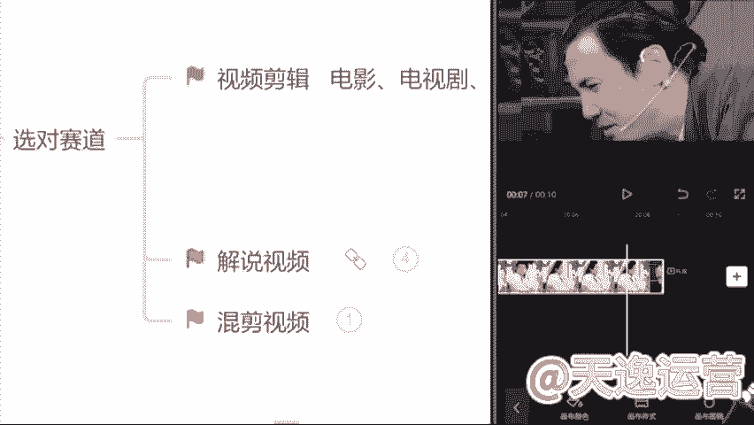

往往有这种情况的时候，我们会做出什么一个动作呢？退出去看一下我今天看的这个视频是什么。如果说他有这个退出去这个动作了，我们的视频完播率它会直线下降。

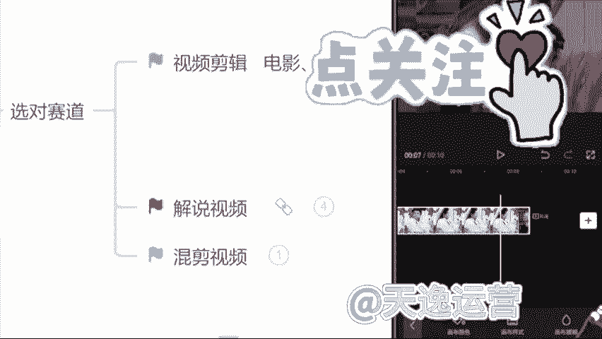

完播率是会影响到我们整体的单价和收益结果的。所以说转场必须要添加。那该怎么去添加这个转场呢？来一样的这个视频轨道右边有一个加号的位置，看见了吗？我们用它的机会是非常多的，点击这个加号一样的，选择谁呢？

选择这个素材库啊，我们一样去找到这个素材库点击它在这个热门里面非常多的一个这个转场，包括像这种的这种的，包括这种的熟悉吗？同学们这种转场是不是看的非常多，包括现在所有做的视频，只要是添加了转场的。

转场基本上都从这个简易里边找的，你们都可以去用啊，这个没有什么问题的。那在找转场的过程当中呢，强调一点。

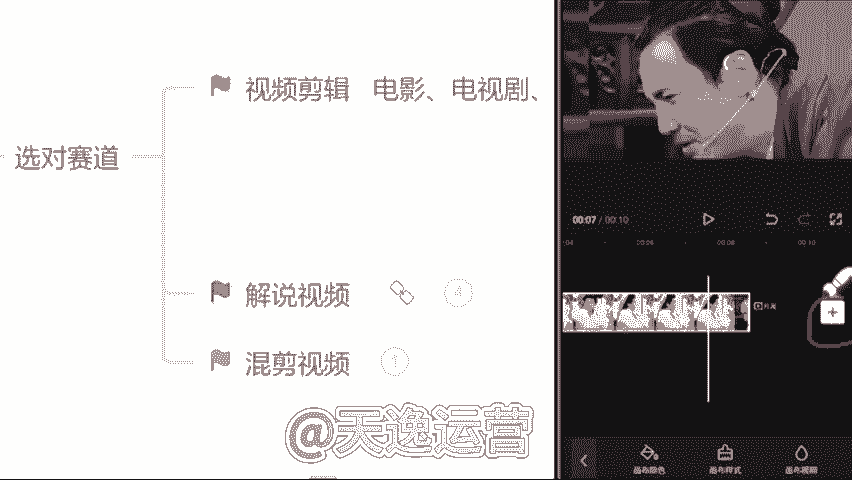

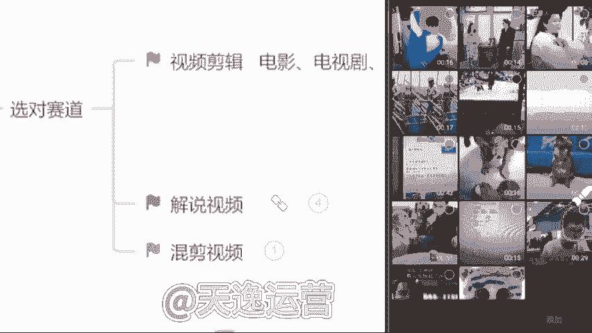

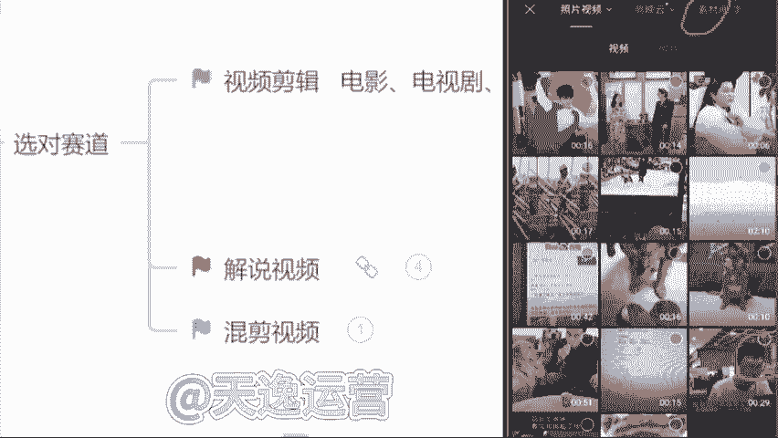

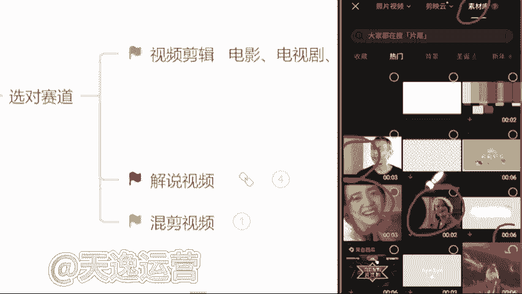

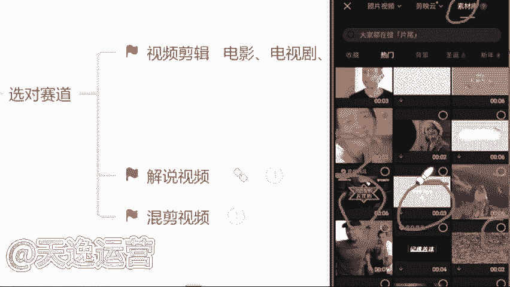

我们不要去找太长的，像这种16秒钟的，不要去选啊不要去选。因为太长了。我们没有任何一个人会把不重要的东西，我们有耐心看完的。没有。所以说我们选择尽量保持在3到5秒钟的一个转场，那最合适的。

我们选择一个3秒钟的来我们给它添加进去啊。这个转场我们添加完了过后来看一下一样的，要强调一点，转场的视频它也必须跟我们所有的一个视频比例保持一致，什么呢？16比9那这个视频我们出来了过后。

右下角直接会有一个画布模糊，画布模糊这个选项啊，直接找到它点击第一个清晰的画面，这个背景它就是一个16比9的一个横屏了啊，现在要记住，我们找到这个画布模糊之后呢，依然右下角的这个对勾点起来啊，点起来啊。

一样的，我们这个视频的比例呢，它做完了这个步骤。

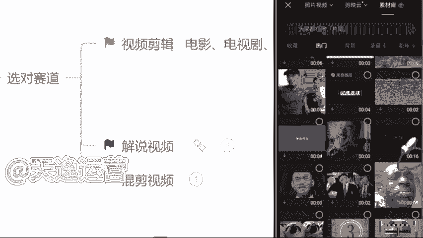

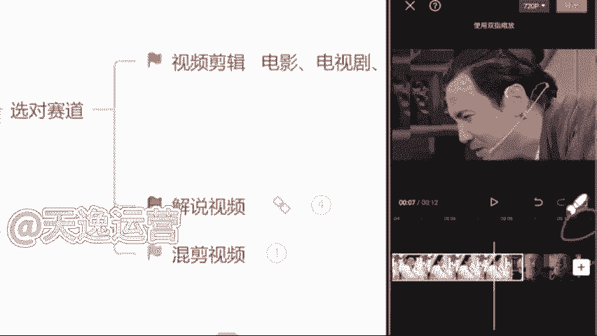

有没有记住啊，我们该怎么去做这个视频能听懂吗？这个步骤啊，我们该怎么去裁剪这个比例，该怎么去添加这一个背景的主题能是不是好的好的，那么这个视频能做到现在来接下来下一步，我们要去添加我们这个视频的文案。

就是字幕，我们该怎么去添加呢，依然找到我们手机左下角这个文字的选项来点击它一下，我们新建文本，右边有一个什么呢？有一个识别字幕，看见了没？直接点击这个识别字幕，然后我们选择这个开始匹配。

它就会自动去给我们识别这个音频当中，或者说这个视频当中人物所说的话给我们形成一个字幕来看见了吗？字幕现在出来了，稍微调整一下，怎么调呢？放大一点，就这个字幕，文本框的右下角。

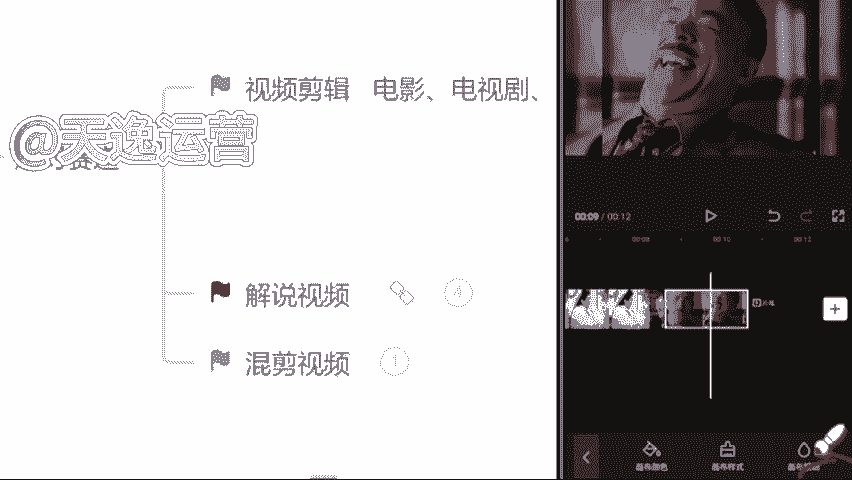

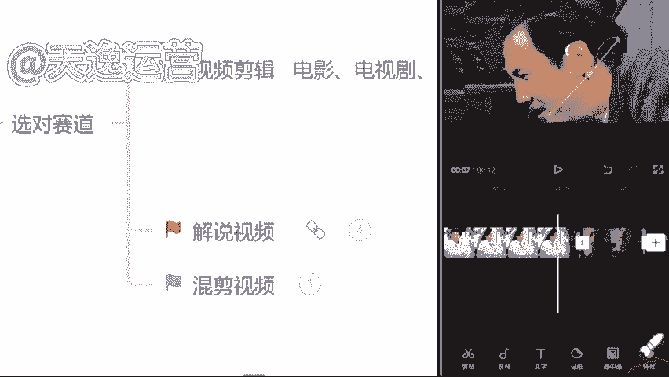

看见没给它往右边拖，那现在放大了过后，整体把这个文本框拖动到视频最下方的一个位置，现在看起来是最舒服的。就你调整完了一个字幕过后，第二个你就不用调了。因为它都会随之来调整啊，这是最方便的。

现在这个视频该怎么去做啊，该怎么去剪这个视频，这个视频我们该怎么去做，知道了吗？我们一定要按照这一个比例，或者说按照所有的一个步骤，找素材也是严格的去做好吧，不要去找太长的一个视频。

到时候平台在这个审核的过程当中，那要不然他就不会给你通过了。知道这个视频做起来难不难，同学们其实不难，对不对？好，很多同学呢在这过程当中也会说到了。哎，曾老师。

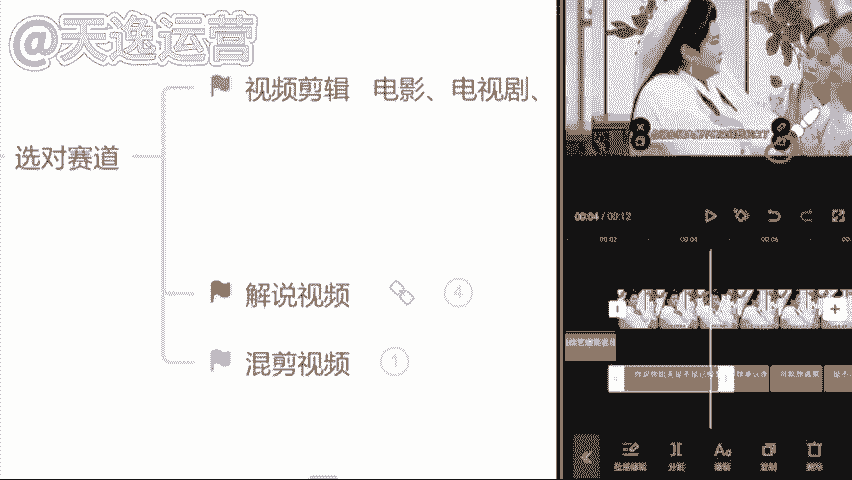

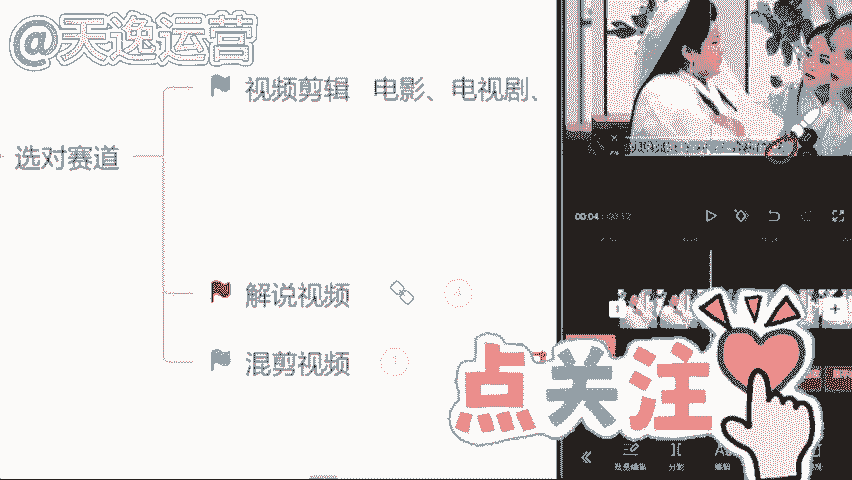

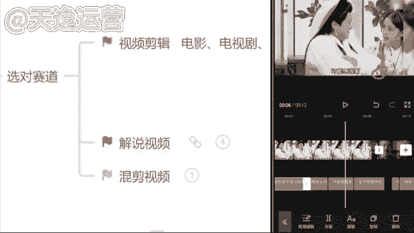

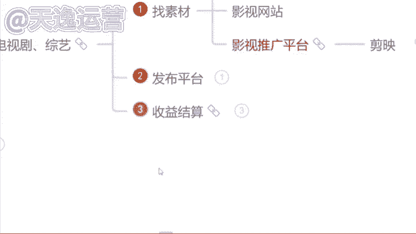

这个视频确实不难是吧？