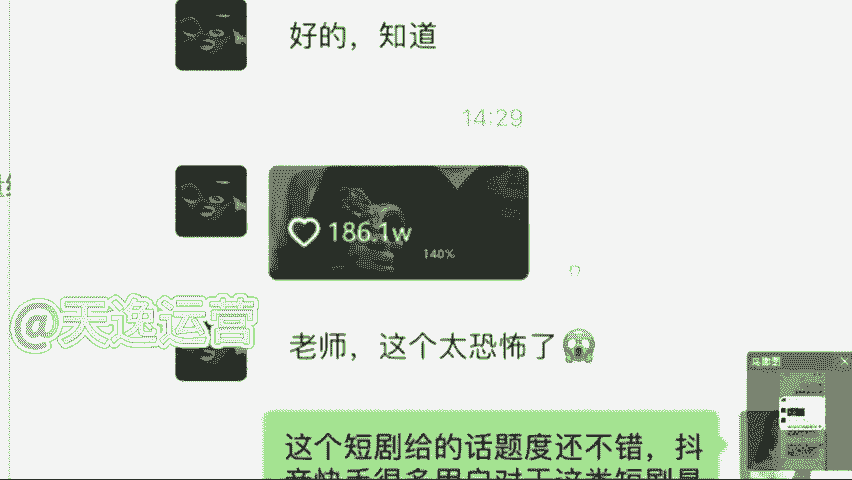

# 【全368集】强推！2024最细自学自媒体运营教程，看完就会！别再走弯路了，逼自己一个月学完，从0基础小白到自媒体运营大神只要这套就够了！ - P12：9.收益结算 - 少年镜是 - BV1noxsewE9k

因为这个影视推广的话，它收益结算的话呢，是一个月结一次啊，是一个月结一次，这个能接受吗？就我们是月底结算的，这个收益结算的话呢，就按照播放量计算。我刚才说到的，每一个这个短句呢要求是不同的。

我们按照他的一个要求来就可以了。像这个呃呃除此之外，就如果说同学们做这个影视的推广。除了这四个平台之外，你们可以靠这个播放量去结算这个奖金。如果说在这个基础之上，你们还愿意去添加解说的。就我们一个作品。

一个视频，你是可以获取双份收益的，什么意思呢？就除了刚才我们讲到那四个平台之外，你可以发布到其他平台，你是同时还是有这个什么呢？还是有版权的，你可以去做影视的解说一个视频，我们拿双份收益。

包给你看一下吧。就我之前有一个小伙伴也是。这个就这个小伙伴呢之前做的就是这一个影视的推广。你们看一下这个收益吧。

当时这个小伙伴他是自己有想法的，他对抖音这个平台是比较喜欢的，但是看中这个抖音的一个带货能力。但当时呢他自己的账号粉丝也很少，他想要去做带货。但当时呢他说先积累粉丝，后期呢他是想要带货的。

做的就是影视推广，因为影视推广的话，当时他问我可不可以朝这个方向发展。我说可以呀，当时我直接把那个回填链接发给他了，报名的渠道，我说每一次你去做之前，你先把这个报名渠道填完，填完了过后做了视频。

你要去填那个回填链接，就我刚才给你们看见的那个账号的ID你是必须要写清楚的。到时候要不然到时候这个抖音就结算不了哈。这个当时我给他看的就是因为最开始呢他做的是什么呢？做的是短句。因为短句的话呢。

他是这个推广的渠道是很少的。如果说我们去做这个播放量的这一个收益呢，他是会更多的。当时他做了第一个短句，这个短句的话要求是发三个视频。😊。

就每一个短句他会有不同的要求，他让你发三个，你必须要发3个，他让你发10个，你就必须要发10个啊，这个我们得按要求做事情的，要不然到时候他是会给你下架处理的。当然他这个视频做完了之后呢，播放量是很高的。

186万。因为短剧嘛它是比较能够贴近现实的，就比较能够抓住我们用户的一些心理啊，所以说他这个播放量呢是比较高的。他也觉得很恐怖。但是就是这些短剧呢，他只是说我们平常看的比较少而已。

就所以说这个话题度是很不错的。当时呢他这个短剧186万的一个播放量结算的话呢，差不多在500左右，结算是结算这么多，但是如果说后期每增加一万的播放量，我们还会给他添加10块钱的这个奖金，这机会是很好的。

但是这一个那做的第二个短句呢就是效果就没有这么好了。因为第二个短句呢，他选择这个短剧呢可能就是本身的话题度就不是很高。但是呢呃它的单价会更高一。

啊，这个就是有不同的一个选择了嘛。当时他这个短剧的话呢，过程当中是1。4万的一个播放量啊，1。4万就很低。但是呢单价的话是给到了150的，所以说单价不同，他给的这一个收益呢也是不同的。

当时这个过程当中的话，他是做了将近一周的时间7天，因为一个月结一次嘛，刚好碰到月底的时间了，结算收益的话，当时官方系统那边给我结算的。因为他是第一波做这个影视推广的人啊，所以说结算给我的。

如果说后期的话呢，我们全部走这个对公账户啊，全部是走对公账户，因为系统那边要核销的。但结算的话，四个短剧，一周7天，他做了4个，第一个短剧的话是在那个186万的基础上面，后面又正增加了1个6万的播放量。

叠加是60，总共结算是580。第二个播放量不高，但是结算了150块钱还是可以的。第三个呢就是因为他没发快手，这个是很可惜的。

因为那一个作品要求发抖音和快手，他只发了抖音，没发快手，所以说只给他结算了一半的收益是120块钱。第四个呢，因为本身任务的单价是比较低的，只结算了45，当时总计的话是895块钱。

这一周的收益这个还可以吗？满足了吗？就7天的时间啊做了4个短句。当然这个根据咱们自己的实际情况来，你有更多的时间你就可以做更多的短句，然后去填回填链接，一个月给你结算一次，还可以的。这个收益还可以了吧。

7天的时间啊，这个呢后期全部走这个对公账户。但是呢过程当中得给你们强调一点，这个渠道是我给你的，你做的视频呢是必须要发给我的，我审核通过了之后，你才能去发，要不然直接给你下架掉啊，直接给你下架了之后。

你就没有办法去靠这个播放的结算收益了啊，这个要给你讲清楚就是这个渠道的话呢就很多同学会有这样一个疑问，说A兹老师，为什么他们自己不去发广告呀，要把这一个。

视频就这个影视推广拿给我们去做呢？有没有这样疑问的？而曾老师，他为什么不自己去做宣传，发广告呢？他要让我们去做这个影视的推广。😡，有没有这样疑问的？因为我不知道同学们有没有了解过这样一些信息哈。

就每当一个这个影视作品或者说制片方出品人，他们去发这一个广告，他们的费用不知道你了不了解哈，就低的话呢，基本上每一个这个广告低的话是10万左右，一个广告，他可能发的地方呢是比较少的多呢？

他是100万起步的，这个广告的费用，你是觉得他把这个影视的这个推广拿给我们去做，给我们结算的这个奖金，他花的钱多，还是他们去发广告花的钱更多呢？你觉得是哪一个，你觉得是推广花的钱多，你打推广。

你觉得他自己去发广告花的钱多，你打广告你觉得是哪一个他花的钱更多一点。😊，是不是他自己发广告花的钱更多，是不是？这个就是为什么他要把这个影视推广拿给我们去做。因为我们人多力量大，我们去做视频。

它的这个扩散度是更高的。包括因为这个疫情期间哈，这个机会呢，他原来是没有的，是因为现阶段的疫情它真的放开了之后可能会更加的这一个扩散度会更庞大了，所以他们不会选择去线下宣传。

基本上都是拿给我们做这个影视的推广的这是一个机会啊，就看你自己愿不愿意去做这个了。😊。

