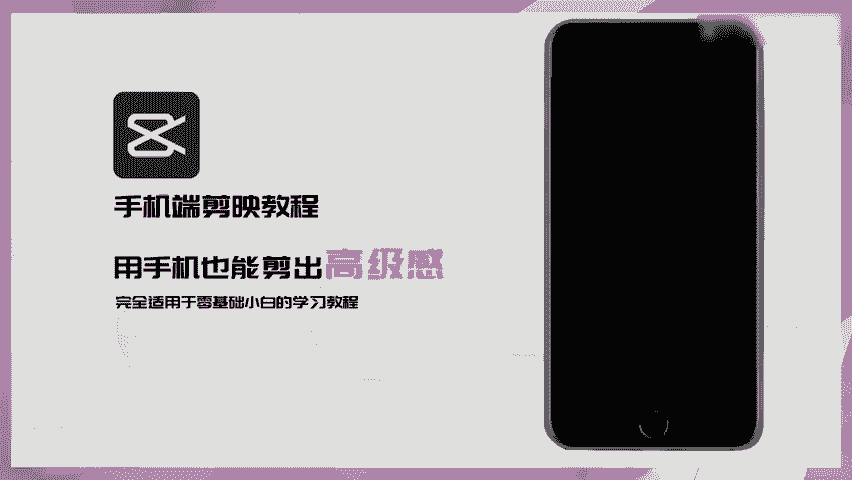
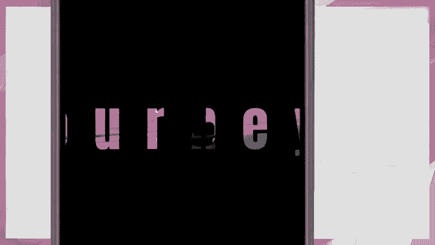

# 【全368集】强推！2024最细自学自媒体运营教程，看完就会！别再走弯路了，逼自己一个月学完，从0基础小白到自媒体运营大神只要这套就够了！ - P35：13.【手机剪辑】镂空文字开场效果 - 少年镜是 - BV1noxsewE9k

🎼教你制作文字镂空开幕效果，准备一张黑底照片，新建文本，输入需要的文字，给文字添加一个入场动画。🎼选择收拢，时长拉为1。5秒。🎼导出备用。🎼新建一个项目，点击画众画。🎼新洁画中画导入刚才保存的文字素材。

放大至全屏。🎼点击混合模式。🎼选择正片叠底移动视频在两秒位置点击分割，给分割户的视频选择一个线性蒙版。😊，🎼点击复制。🎼把复制的视频拖下来对齐。😊，🎼点击蒙版。🎼选择线性蒙版。

然后选择反转给上面图层添加出场，动画里的向上滑动，时常拉满，下面图层添加出场，动画里的向下滑动，同样时常拉满，加入音乐来看看效果吧。😊。

🎼和你呀。🎼和你一样。