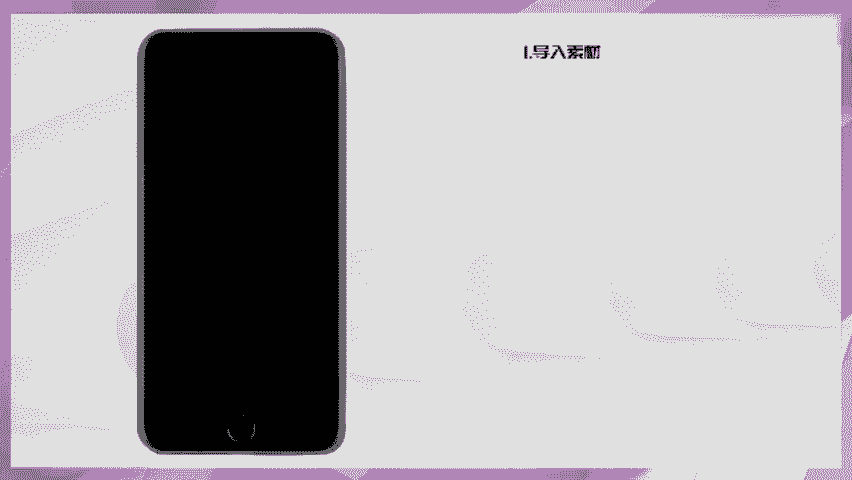
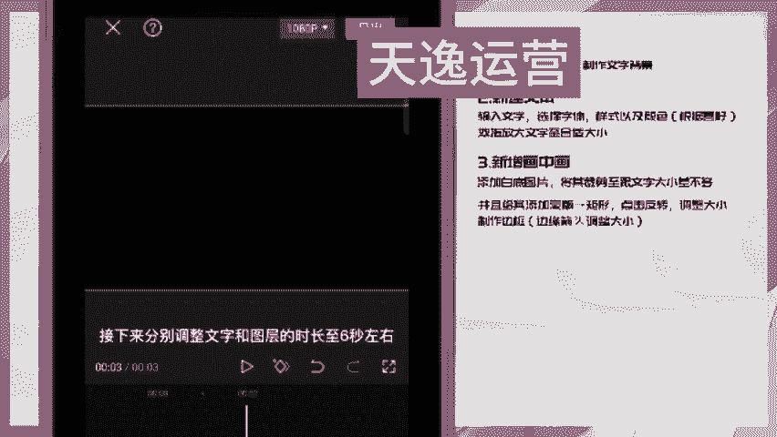

# 【全368集】强推！2024最细自学自媒体运营教程，看完就会！别再走弯路了，逼自己一个月学完，从0基础小白到自媒体运营大神只要这套就够了！ - P40：18.【手机剪辑】人物遮挡文字效果 - 少年镜是 - BV1noxsewE9k

🎼教你制作这种人物遮挡文字效果。🎼首先导入一段黑色背景，点击文本，新建文本。

🎼输入文字，选择这个字体，选择样式里的这个颜色，双指放大文字至合适大小。🎼画中画新天画中画。🎼通过画中画添加一张白底图片，找到编辑。🎼选择裁剪，裁剪出一个跟文字大小差不多的比例。

🎼再次调整一下大小和位置，点击蒙版。🎼选择矩行。🎼点击反转，调整箭头，上下左右放大到边缘。🎼这样文字边框就做好了。😊，🎼接下来分别调整文字和图层的时长至6秒左右，然后导出备用，新建一个项目。

然后通过画中画导入刚才保存的文字素材混合模式。

🎼选择绿色，点击动画，入场动画，选择镜像翻转，给人物图层复制一遍，点击切画中画，切下来后向左拖动图层对齐，然后点击智能抠图。🎼最后添加一些文字贴纸装饰一下，最后导入音乐，一起看看成品吧。

