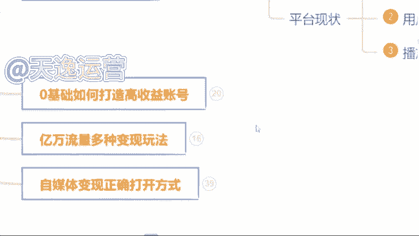

# 【全368集】强推！2024最细自学自媒体运营教程，看完就会！别再走弯路了，逼自己一个月学完，从0基础小白到自媒体运营大神只要这套就够了！ - P7：4.0基础如何打造高收益账号 - 少年镜是 - BV1noxsewE9k

好，那除此之外呢，有很多同学也会说到了是吧？好，曾总老师，我觉得可以做是吧？我觉得能赚到钱也值得去做了。但是为什么我发的这个视频发出去，它永远都是零播放量呢，要不然只有几百甚至1000多的播放量。

是不是这个平台他不喜欢我，他看不干我，所以说他不给我推送流量啊，其实不是的，是因为我们自媒体平台呢，他总共有30多个啊，这30多个平台呢，同学们全部截图保存啊，这30多个平台我们未来都能够用到的。

接着截图啊吧，因为这30多个平台呢，它每一个平台结算收益的方式适合的领域都是各不相同的，同学们熟悉嘛，对他们了解吗？其实不太了解，对不对？那首先我们来看一下，其实每一个平台他适合的领域都是各不相同的。

包括给你举个例子吧，比如说今天啊我说我要做一个这个今日头条这个头条号，我说我要做，那我先把这个平台账号注册好。那。😊。

注册好了过后，我去选择一个适合B站去做的舞蹈领域，我能在这个头条上面做起来吗？觉得能做起来吗？我去做的是头条号这个平台但是我偏偏就选了一个适合B站去做的领域。为什么呢？

这个就是很多这个自媒体嗯呃这个人没有做起来账号的原因，你连平台以及领域都没有选择对这个平台，他凭什么给你推送流量啊，他不会把这个流量浪费在你的身上的，他是会去扶持适合他这个平台适合用户去观看的领域的。

这个呢我到时候送给大家好把这个领域的区分，到时候我送给大家啊，让你们有一个领域区分的地方。但是呢我得看你们的表现。好吧，谁今天啊互动性是最强的，是真正想要学习到这个知识的，我就送给你们啊。

因为曾老师特别喜欢这个爱学习的同学好吧，看你们的表现喽。

那除此之外呢，这30多个平台啊30多个平台里面我们该去选择什么样的这个内容，我们来做视频呢？是吧？那首先问一下同学们，平常在这个刷视频的过程当中，我们刷什么样的视频刷的是最多的。

你看什么样看着视频看的最多，是影视的呢解说的呢是吧？单视频剪辑的呢，还是说游戏的呢？综艺的呢？动漫的呢，搞笑的呢？你看什么看的是最多的，美女。😊。

好的好的，我知道了哈。那喜欢看美女的同学非常的不错呀。曾的老师也喜欢看美女啊，但是我们把看美女的时间，我们去做一个美女的盘点视频，它可能赚钱会更快一点，是吧？影视的是萌正能量的、搞笑的。还有呢？

其他同学呢看什么样的视频看的是最多的。😊，还有没有其他的？基本上都是影视了，是吗？好的好的，我知道了。影视呢在所有的平台上面确实扩散量是最大的啊，军事的也有是吗？军事的它在我们国内的平台是可以做的。

但是涉及到一些呃会比较外网的平台，它是做不了的。嗯，像现在的那个ttok它就做不了这个是吧？那首先呢在这个平台上面，我建议同学们哈一定要去选择对赛道。我刚才说到了。

你再到选择对了这个平台它才会给你推送流量。我建议你们去做的话，就以这三个类型的视频为主。首先第一个视频剪辑类的。第二个解说视频类的。第三个混剪视频类的。这三个类型的视频是现在所有平台，大数据分析之下。

用户的点击量阅读量以及完播率是最高的三个领域。大数据是什么意思，知道吗？同学们大数据比如说我举个例子吧。😊。

比如说我们平常就很多同学呢会说看的东西是比较多的，就刷到什么看什么。比如说呃这这一类型的视频的话，就是我们所有同学说不知道的也是啊一样的，就平常刷到什么，看什么。

你在所有的类型的视频的这个停留时间它是一样的。但大数据呢就是如果说我们今天选择抖音这个平台，我今天刷美女刷的时间更长，从明天开始这个平台，他给你推送美女的视频绝对是最多的。

如果说你看美食类看的是最多的那从明天开始这个平台他给你推送美食类相关的视频，它就是最多的，有没有这样的情况是不是这样子的，这个叫大数据啊，大数据呢。

它现在可能比我们自己的爸爸妈妈还要了解我们知道我们到底喜欢什么样的内容，什么样的东西。跟着大数据去做视频，啊，你的这个播放量呢，它才会更高。😊。

