# 【全368集】强推！2024最细自学自媒体（小红书）全套教程，自媒体起号真快！！别再走弯路了，逼自己一个月学完，从0基础小白到自媒体大神只要这套就够了！ - P1 - 小林红书运营教程 - BV1FxVTejEB4

🎼最近又发现一个搞钱的野路子方法，还是通过中视频计划，这个方法啊非常简单，就是抄作业。只要你能够耐得住寂寞，吃得了做抖音的这份苦，你就能够搞到这个方法啊，我在两周前告诉了我们一个圈友，他每天都去做。

就用这么一个简单的方法每天能搞到上千的效益。如果啊你觉得自己能够做这种重复机械的工作，耐得住寂寞，吃得了这份苦啊。接下来呢我把这个方法就分享给大家，小白新手完全可以做，因为非常简单。

我在上一期视频呢推荐大家去做温情故事类的中视频赛道。所以首先第一步呢就是在抖音的搜索框里边去搜索温情故事。因为这类视频呢非常容易引起大家的情绪共鸣，非常容易爆播放。

所以在第一步呢就是去抖音的搜索框里边去搜索温情故事，点第二个视频板块，然后呢筛选最多点赞。这样的话呢，你就会看到。

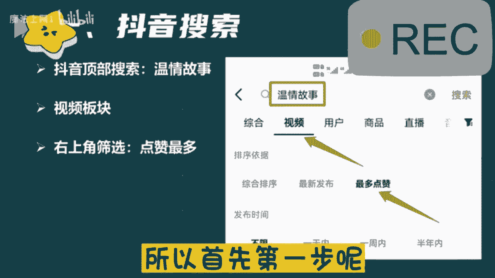

🎼很多百万级别点赞量的这种爆款的温情视频。接下来来到第二步，随便呢点一个视频进去。然后视频右下角呢有一个分享的按钮，点一下之后呢，在最下边会出现一排的选项，里边呢有一个叫复制链接，我们把链接呢复制一下。

然后呢来到一款文案呢提取工具，这一步的目的啊就是把视频里边的文案给它提取出来，直接呢用里边的链接转文案。这个视频里边的文案就被我们提取出来了。但是这里边需要注意啊，这个文案提取出来之后啊。

一定不要直接用，我们把这个文案通篇呢读一遍，然后呢根据自己的理解，用自己的嘴巴把这个温情故事啊再给讲一遍，这样啊就不会有违规的风险，然后来到第三步就是我们把文案啊直接导入到剪映里边。

用剪映里边的一键成片，它就会帮助你自动去匹配画面，而且啊还会根据你的文案去配音，根本就不用我们自己去剪。🎼这样一个视频就完成了。那最后呢就是视频的发布了，直接啊在抖音的顶部搜索中视频计划。

然后呢就会看到中视频伙伴计划的入口。通过这个入口进去之后啊，发布的视频呢，就会计算到中视频计划里边。别忘了发布的时候同步到西瓜和头条。在这三个平台上，只要你的视频有播放量，它就有收益。怎么样。

这个方法是不是非常简单。但是简单里边啊，它又透露的不简单，这个方法的核心呢就在于我们踩中了爆款的文案和爆款的选题。而这两点是爆播放最重要的因素。所以这个方法非常好用，也字实践了。

关于刚才提到的文案提取的工具，以及文案处理的时候有什么样的技巧，还有全网视频的下载器等等啊。这些呢你都可以到我的回复抄作业就能拿到了。好了，简单的方法在于执行，你不去执行啊，一切都等于零。

只要你能够吃得了这份苦，就能够在抖音上搞。

首先第一个板块呢就是自媒体它的一个现状和前景。就是无论我们做任何一个行业哈，无论是做前置也好，还是兼职也好，我们得清楚这个行业，它的一个现状和前景。我们去做，对于我们来说有一些什么样的好处呢？

那到底可不可以去做呢？是吧？我们了解清楚了过后，我们再去上手，我们才能更放心一点。那第二个板块呢就是零基础的同学，我们如何去打造一个高收益的账号，就很多可能了解一点自媒体的同学。

或者说你是有做过自媒同学，可能都知道哈呃我们这个视频发出去，要么它是零播放量，要么你去抖音和这个快手上面，你去做视频啊，靠这个播放量没有人来给你结算收益的这是为什么呢？那这个板块当中呢。

我会教大家怎么去选择这个平台，怎么去选择领域和这个渠道，我们才能把这个收益赚到手。那第三个板块呢就是一个亿万流量的一个多种变现玩法，就是很多同学了解自媒体呢，可能都知道我们自媒体呢。

就是我们做视频或者是文章发到。😊，这个平台上面去有人观看，我们可以靠这个播放量去结算收益。那除了这个之外呢，还有很多种玩法，都适合我们零基础同学去上手的那这个板块呢我会给大家讲的。那第四个板块呢。

就是我们自媒体变现的一个正确打开方式啊，是怎么说呢？就是如果说你是听完整堂课，你觉得这个自媒体比较适合你的，你也有时间来做的那我会教大家怎么去规划我们自己的账号，以及系统性的把这个钱赚到手啊。

这是我今天内容板块的一个划分。那么首先呢先来了解一下到底什么是自媒体呢？自媒体的话呢，我用大白话给大家讲吧。就是我们今天打开我们自己的手机百度去百度上面搜索一个自媒体平台。

然后去这个平台上面注册一个属于我们自己的账号，在我们自己这个账号上面去发布我们自己做的文章，或者说视频啊，我们有人观看就可以靠这个播放量去结算收益。这个就叫做。🎼自媒体我这样讲能不能明白？

那我们了解了一下到底什么是自媒体，那我们得清楚这个行业它的一个平台现状如何呢？是吧？到底可不可以去做呢？就是我不知道同学们在这之前有没有了解过这样一些新闻哈，就现阶段呢，我们整个社会呢，它是非常浮躁的。

就很多人都想赚钱。就是在这之前呢就原来很多人想赚钱的时候，但是采取了一些不合法的手段去到缅甸这样地方被干腰子了的新闻，这样新闻有了解过吗？有的来打个有字吧，就这个呢就是不合法的。

国家呢它已经明令禁止了的，我们不能去做，因为我们去做，对于我们来说没有任何的一个好处嘛，对吧？那么现阶段呢自媒体行业是属于国家支持的那国家支持呢，它现在已经把这个文件已经下达到了各个地方政府。

包括你们现在看见这个呢是一个荆州市的六项措施啊，助力自媒体以及新媒体高质量发展的一个文件，包括这个文件呢是今年6月2号人社局来发布的。人社局。😊，国家单位包括这个文文件当中呢也指出了。

我们要加大政策宣传力度，有力支持自媒体以及新媒体行业的蓬勃发展。包括你们也可以来看一下有没有你们自己的那一个地方。包括往下边看，这个是这个是那个广西壮族自治区的，看见没？都是新媒体的。

包括这个四川省人民政府的新媒体，包括这个浙江省人民政府的以及杭州市人民政府和这个江西省赣州市人民政府都发布了相应的一个政策性文件，包括这个文件当中呢也知道了啊也说到了，说我们要坚持正确导向，内容为王。

什么意思呢？就是我们未来作为这个自媒体创作者，我们创作的这个文章和视频，它才是结算收益最重要的一个方式和途径。我这样讲能明白吗？就包括你们听到这里，你觉得这个自媒体行业，它可以来做吗？

就是国家现在支持的。因为他已经把这个政府文件下达出来了，你觉得他可以来做吗？可以是吗？对了，那除此之外呢，就现在政策性文件也有了是吧？来支持我们去做视频。那我们自媒体平台他也得响应国家的号召。

他出钱让我们来做视频，那他出多少钱呢，来我们去看一个视频来了解一下。

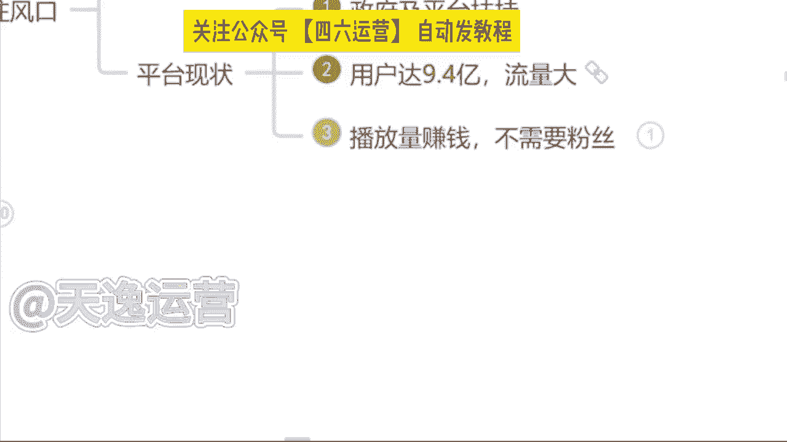

我们希望接下来能够帮助更多的中视频创作者成为职业创作人。

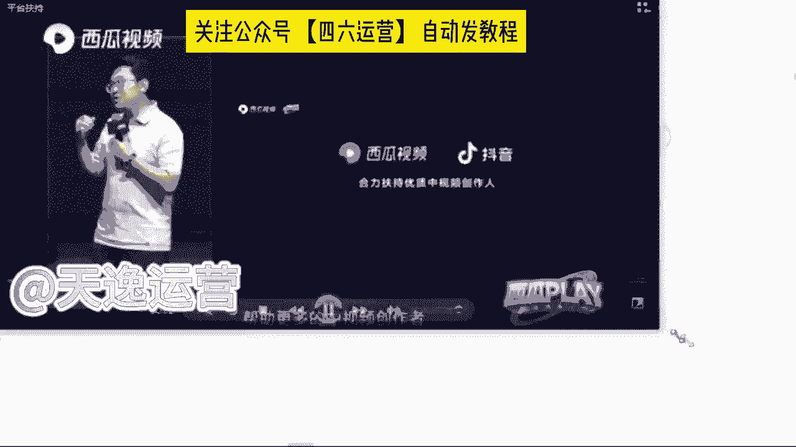

职业创作人的意思就是以创作视频为职业，并且通过创作视频就可以过上更好的生活。那为了实现这个目标，未来一年，西瓜视频决定将额外拿出20亿元补贴中视品创作人。我想强调两点哈。😊，第一。

这是真金白银的20亿元，不包含任何的商单、直播和电商的收入，是纯补贴。我们也会积极探索保底将分成的模式，助力创作人职业化，这可能也是行业首创。第二，20元只是保底上不封顶。啊，说到这里呢。

我想起了一件事情。

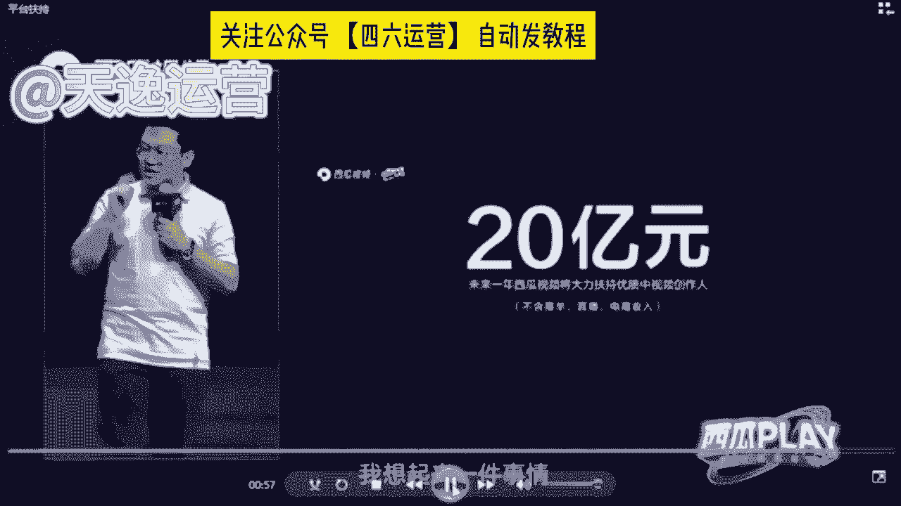

好，同学们从这个视频当中了解到了一个什么关键的信息呢？就这个平台，他给到我们多少钱去做视频，多少钱呀？20亿元对不对？包括刚才这个创始人，他也提到了这20亿元，它不包含任何的商单直播以及电商的收入。

这什么是纯补贴，就是我们未来去做视频，我们就能去拿到这20亿元里面的收益，这个就是我们未来能够赚到的钱。那除此之外呢，现阶段我们自媒体行业呢有一个优势，就他的用户数量非常庞大的，有多少呢？接近9。

4亿了，包括今年这个2022年这个中国研究生网站啊也出台了相应的一个自媒体行业的市场调查以及发展前景的分析报告。这个报告呢是今年9月9号来发布的这个报告当中指出了我国现阶段中国网民规模多少人是9。

4亿人，接近10亿了。这9。4亿人呢，就是看视。频的人，他有手机有这个视频平台，每天都会去刷视频。那看视频的人有这么多了，做视频的人肯定也有吧，有多少呢？来往上边看，截止去年为止。

我就我国全职从事自媒体的，是370万人，兼职从事自媒体的是600万，就加在一起，一共做视频的人才970万人，我们应该他算个整数，我们算1000万，好吧，就有1000万的人，他在做视频，有10亿的人。

他在看视频，这个相当于什么呢？相当于100个人里面只有一个人在做视频，我问一下同学们，我一个人做的视频够不够，你们100个人去看我一个人做视频的速度能不能赶上你们看视频的速度。😡，其实是什么呢？

其实是不够的，对不对？为什么呢？这个就是我们国家为什么支持我们自媒体行业发展的一个原因。因为我们国家未来的一个发展趋势一定是在这个互联网行业当中。啊，是从哪里可以看出来的呢？

就是从我们小时候啊看的是这个黑白电视，就我们长大了之后看的是彩电。那包括到现在呢我们自己家的电视上面都能连接wifi了。这以后我们做的视频，我们自己家的电视上面，它都能够看见。

你可以思考一下这个用户数量是多么的庞大了。对？包括我们的用户人群呢也不断的在扩张。😡，那除此之外呢，现阶段我们自媒体这个行业呢最大的一个优势就是我们去做，不需要我们有任何的一个粉丝基础。

那我们只用靠这个播放量就能够赚到钱。但是我们呃说到这里哈，很多同学会有这样一个问题了。艾森老师，我们去做视频，但是我们没有粉丝，这个播放量是哪里来的呢。😡，就有没有这样疑问我去做视频是吧？没有粉丝。

那这个视频的播放量是哪里来的呢？首先要告诉大家，这个播放量是平台扶持的流量。刚才我们讲到了，国家支持它的文件已经有了平台，它是会扶持我们去做视频的，就看你作品的质量如何了。

就可能同学们现在了解到的平台自媒体平台哈可能更多的，要么就抖音，要么就是快手，是不是就平常刷视频用的最多的，是不是抖音和快手这样个平台，我们都知道抖音这个平台在前两年他短视频最火热的时候。

就他在抖音直播带货最赚钱，但是我们都知道你想要去这个带货，你必须要有粉丝基础吧，你没有粉丝基础，你去带货谁来买呢？是不是？那除此之外呢，我们自媒体平台跟抖音它是有一个本质的区别的。

我们只需要去这个平台上面去做视频，有人观看，我们就能够靠这个播放量去结算收益的，我们只需要了解一点，什么呢？一万的播。😡，放量他能够拿到多少钱？很多同学会问了，曾老师，为什么不是以千0为单位呢？

是以万为单位呢？当然有嗯有1000阅读量的单价但是只有我们拿到1万阅读量的收益的这个播放量的时候，我们才能够去结算收益，才能够把这个收益提现到我们的银行卡里面来。我这样讲能明白吗？

就我们去看一下这个1万的播放量的单价到底是多少啊，首先呢我们这边可以看见一个千次的阅读单价能看见吗？千次的阅读单价是多少钱是3。4块钱看见吗？这是1000的啊，就1000的阅读量我们能够赚到3块钱。

那1万的阅读量有多少呢？我们乘以1万嘛，就是34块钱。这个单价，你们要记清楚，这个就是我们未来能够揣在自己兜里面的钱啊，等一下曾总老师会问的，这11万的阅读量单价到底是多少呢？是吧？这个要记住好吧。

那我们现在知道了这个单价了。很多同学会说，哎，曾老师。😊，反正他都赚钱是吧？😡，那我现在不做，我以后再来做吧，是吧？反正他都赚钱，反正他都赚钱是吧？这个行业我现在不做吧，我以后再来做有没有这样想法的。

有的你就打个有字，就说到这里呢，问腾这样一个问题，就是如果说这个未来自媒体行业，它发展成为像这个九年义务教育一样，所有人都能来做的时候，你觉得你还能不能做起来。就未来我们这个自媒体行业。

国家说哎同学们朋友们，我们现在已经把它纳入到这个九年义务教育阶段了，你全都来做，还能来做起来吗？有的说能有的说不能就问同讯这样一个问题吧，就是这个呃就跟原来这个18年的抖音是一样的道理哈。

18年抖音刚出来的时候，他是最火的时候，刚刚站在风口上面是吧？那个时候选择做抖音的人，他是最赚钱呢，他也赚到钱了，但是现在你再去做抖音，你还能做起来吗？现在你再去做抖音还能做。😊，做起来嘛就做不起来了。

对不对？是一样的道理。每一个行业它都有相应的一个风口存在的。这个机会放在这里，它是不会等着你来选它的。风口它是会过去的，你就不能来做了是吧？如果说未来你去大街上面随便拉一个人问他，你知道自媒体吗？

他说哎，我知道那个时候我就劝你不要来做了啊，因为你就需要花更多的时间更多的精力，你才有可能能做起来，包括我们刚才说到的这个行业的一个市场报告啊，就调查的一个报告是今年9月9号来发布的。

说明我们是了解到这一个信息的第一部分人群，我们刚刚站在这个行业的风口上面，小米创始雷军曾经说过哈，站在风口猪都能起飞。就看咱们要不要去做一只风口上面的猪。😡，是吧这个就是我说到的一个行业的风口啊。

就看你自己愿不愿意来选择了。那说到这里问一下同学们，你觉得这个自媒体行业它值得你来做吗？你觉得它值得咱们来做吗？是吧？这个风口嘛就看你自己要不要去选。😡，好，那除此之外呢，有很多同学也会说到了是吧？好。

曾总老师，我觉得可以做是吧？我觉得能赚到钱也值得去做了。但是为什么我发的这个视频发出去，它永远都是零播放量呢，要不然只有几百甚至1000多的播放量，是不是这个平台他不喜欢我，他看不干我。

所以说他不给我推送流量啊，其实不是的，是因为我们自媒体平台呢，它总共有30多个啊，这30多个平台呢，同学们全部截图保存啊，这30多个平台我们未来都能够用到的。今日截图啊吧，因为这30多个平台呢。

它每一个平台结算收益的方式适合的领域都是各不相同的。同学们熟悉嘛，对他们了解吗？其实不太了解，对不对？那首先我们来看一下，其实每一个平台他适合的领域都是各不相同的。包括给你举个例子吧。

比如说今天啊我说我要做一个这个今日头条这个头条号，我说我要做，那我先把这个平台账号注册好那。😊，注册好了过后，我去选择一个适合B站去做的舞蹈领域，我能在这个头条上面做起来吗？觉得能做起来吗？

我去做的是头条号这个平台，但是我偏偏就选了一个适合B站去做的领域。为什么呢？这个就是很多这个自媒体嗯呃这个人没有做起来账号的原因。你连平台以及领域都没有选择对这个平台，他凭什么给你推送流量的。

他不会把这个流量浪费在你的身上的，他是会去扶持适合他这个平台，适合用户去观看的领域的。这个呢我到时候送给大家好吧，这个领域的区分，到时候我送给大家啊，让你们有一个领域区分的地方。

但是呢我得看你们的表现好吧，谁今天啊互动性是最强的，是真正想要学习到这个知识的，我就送给你们啊，因为曾老师特别喜欢这个爱学习的同学，好吧，看你们的表现喽。😡，那除此之外呢。

这30多个平台呃30多个平台里面我们该去选择什么样的这个内容，我们来做视频呢？是吧？那首先问一下同学们，平常在这个刷视频的过程当中，我们刷什么样的视频，刷的是最多的，你看什么样看着视频看的最多。

是影视的呢？解说的呢是吧？单视频剪辑的呢，还是说游戏的呢综艺的呢，动漫的呢搞笑的呢？你看什么看的是最多的，美女。😊，好的好的，我知道了哈。那喜欢看美女的同学非常的不错呀。曾的老师也喜欢看美女啊。

但是我们把看美女的时间，我们去做一个美女的盘点视频，它可能赚钱会更快一点，是吧？影视的是萌正能量的、搞笑的。还有呢其他同学呢？看什么样的视频看的是最多的。😊，还有没有其他的？基本上都是影视了，是吗？

好的好的，我知道了。影视呢在所有的平台上面确实扩散量是最大的啊，军事的也有是吗？军事的它在我们国内的平台是可以做的，但是涉及到一些呃会比较外网的平台，它是做不了的。嗯。

像现在的那个ttok它就做不了这个是吧？那首先呢在这个平台上面，我建议同学们哈一定要去选择对赛道。我刚才说到了，你赛道选择对了这个平台它才会给你推送流量。我建议你们去做的话，就以这三个类型的视频为主。

首先第一个视频剪辑类的。第二个解说视频类的。第三个混剪视频类的，这三个类型的视频是现在所有平台，大数据分析之下，用户的点击量阅读量以及完播率是最高的三个领域。大数据是什么意思，知道吗？同学们大数据。

比如说我举个例子吧。😊，比如说我们平常就很多同学呢会说看的东西是比较多的，就刷到什么看什么。比如说呃这这一类型的视频的话，就是我们所有同学说不知道的也是啊一样的，就平常刷到什么，看什么。

你在所有的类型的视频的这个停留时间它是一样的。但大数据呢就是如果说我们今天选择抖音这个平台，我今天刷美女刷的时间更长，从明天开始这个平台，他给你推送美女的视频绝对是最多的。

如果说你看美食类看的是最多的那从明天开始这个平台他给你推送美食类相关的视频，它就是最多的。有没有这样的情况，是不是这样子的。这个叫大数据啊，大数据呢。

它现在可能比我们自己的爸爸妈妈还要了解我们知道我们到底喜欢什么样的内容，什么样的东西。跟着大数据去做视频啊，你的这个播放量呢，它才会更高。😊，🎼啊，那首先呢。我们先来讲第一个视频剪辑类，好吧。

视频剪辑的话呢分为很多都可以去做这个视频剪辑。比如说首先第一个就是这个电影的，就影视的剪辑嘛。电影的啊除此之外呢，像这个电视剧的或者说综艺的啊。

这个都是这个视频剪辑类的那如果说我们想去做这个视频剪辑类的呢？我们首先要去干嘛，要去找素材，对不对？那这个素材我们该怎么去找呢？找素材呢，我们先从这几个平台去找。首先第一个所有的视频平台。

知道视频平台有哪些嘛？啊，那现在不知道的同学来看一下，这个就是我刚才让你们截图保存的这30多个自媒体平台，现在不知道的同学在截图保存一次啊，这30多个自媒体平台呢，都是我们能够找到素材的地方。

啊这30多个自媒体平台呢，我们都能找到素材。那除此之外呢，第二个我们可以去一些影视网站里面去找，我不知道同学们有没有了解过哈，影视网站。比如说我举一个例子，就原来我们所说的这个豆瓣电影。

这样子的呢都是这个影视的网站。包括我自己呢整理了将近有这个50多个啊影视的一些网站，这些网站里面所有的一个影视素材，它全部都是没有版权要求的。这个呢我到时候也可以送给你们。除此之外呢，这个平台呢。

就这些网站呢，他是关于影视类的。就很多同学说哎曾老师那我不想做影视类的是吧？我想做一些其他的什么动漫的综艺的搞笑的，我想做一些这些类型的O也可以啊。

我自己呢也整理了将近有60多个这60多个网站呢里面除了影视类的，像这个旅游的啊这个图片类的啊音效类的评论的体育的美食的动漫的综艺的搞笑的或者说各个国家的境内境外的视频素材。我们都是能找到的啊。

都是能找到的这个呢我后边也送给你们好吧，让你们能有一个找素材的地方，那除此之外呢，第三个就是我所讲到的这个影视推广的平台。就影视推广的平台呢，现在他可能做的更多。就是我们在这个抖音或者说快手上面。

我们很多同学都知道哈，你去抖音或者说快手上面做视频有做过的来就是去这个抖音或者说快手上面发过视频的有没有就我们都知道啊，就抖音和快手这两个平台，你去发布视频最多最多，可能只能达到一个涨粉的作用是吧？

这个播放量它是变不了线的那如果说我们去做这些影视推广平台里面的这些影视素材啊，我们是可以靠这个播放量去拿到奖金的啊。这个平台呢等一下我会着重奖啊，我会着重奖。那么首先呢如果说我们要去做这个视频的剪辑。

我们素材该怎么去找呢？比如说我给你举个例子吧。啊吧我们今天打开我们自己手机的百度啊，我们先打开这个百度打开了过后呢，我们随便去搜索一个自媒体平台吧，嗯，用这个西瓜视频。😊，我们搜索一下这个西瓜视频。

然后点击百度。我们打开它的网页。比如说我今天举一个例子，我想要去做一个这个关于综艺类型的是吧？我想要找一个人，比如说综艺类型的，就是他跟娱乐是相关的，就同学们平常看直播吗？直播看不看。

就像一些网红的直播，什么大杨哥，小杨哥是吧？比如说我们想要找一些这一类的素材，我们直接去搜索他们这一个关键词就可以了。什么关键词呢？就直接搜名字啊，大洋哥。小杨哥，我们直接搜索关键词，然后点开搜索。

我们就能找到非常多的一个素材了。现在我们按照这种关键词的方式去找素材，能不能找到？但是在这个找素材过程当中，我得给你强调一点，我们正确找素材的一个方式，不是让你们把这个视频直接下载下来。

就很多同学我不知道同学们有没有听到过这样一个词语，就你们可能听过课程的哈，有的老师叫你去做搬运有没有听过的，或者说有没有做过搬运的。如果说你直接去把这个视频下载下来，他跟搬运就没有什么区别了。啊。

搬运的内容，现在平台95%的人，你去做，都通过不了审核。所以说告诉你们正确找素材的一个方式。就是我们要从这么多的这个视频当中去找到符合我们自己视频主题的视频片段，就每一个片段呢大概保持在10秒钟左右。

啊，10秒钟这个数字你们要记住，到时候。我们找到素材，我们去做视频，平台在审核的过程当中才能给你通过，是不会有违规存在的。这个记住了吗？记住了公屏上打一啊，10秒钟左右每一个素材片段。

就按照这个这个时长去找就可以了。那除此之外，再举一个例子，比如说我们今天想要做一个沈腾的是吧？沈腾明星明星网红它都是自带呃这个热点的啊，热度的你去做它不缺流量啊，不缺流量的那一样的。我们打开一个。

关键词直接搜索，就你们能找到素材呢是非常多的啊是非常多的那现在我们素材能找到了吗？那如果说我们这个视频素材我们自己能找到了，那我们想要去做视频？OK那我们是必须要用到什么呢？用到剪映这个软件的。

做视频的话呢，问一下同学们用哪一个软件用的是最多的，手机还是电脑，你用哪个我等一下就用哪一个给你们实操好吧，根据你们的一个要求来，都是手机啊，没有一个打电脑的吗？好的，我知道了。

就你们打手机的这个搜度就让我感觉到，生怕我看见电脑是吗？好的，稍等一下，我投个屏好吧，我投个屏。😊，啊，那我们今天呢如果说我们要做视频哈，我们首先呢要确定一个什么呢？主题。比如说我举个例子吧。

我说我们今天去做一个综艺类型的，我们就要确定一个人物什么人物呢？我们今天去做一个这个呃沈腾的搞笑名场面吧，就这一个视频的主题，我们的主题确定了。那这个视频的素材当中必须要有沈腾这个人啊，这个是主题。

到时候你们要记清楚，好吧。😊，那现在同学们能看见我的手机了吗？能看见我的手机了吧。那么首先呢在我们自己的手机上面找到一个剪映的软件啊，就这一个剪映的话呢，它这个手机端和电脑端图标找的都是一模一样的啊。

没有什么区别。我们找到这个软件过后呢，直接点开它，点开了过后，我们可以看见一个加号的界面，就是开始创作这个界面，我们直接点击这个加号的位置，然后把我们自己找的一个视频素材，先给它添加进去一个。

那么这个视频素材添加进去了之后呢，首先讲一点，我们自己做视频的话呢，素材它是能找到的。但是我们要做的这一个视频的主题背景，它是找不到的，只能我们自己去制作。那怎么做呢？首先我们要找到这个视频轨道。

有右边有一个加号的位置，看见了吗？直接点击这个加号的位置。然后我们找到这个手机自带的素材库，啊，这剪映自带的，看见没？素材库。我给你们圈出来，找到素材库了过后来直接点开。

我们在热门里面就可以看到非常多的一个背景主题非常多。包括我们用的话呢，像这一类型的，或者说这种的这种的包括这种的，我给你们圈出来这种背景呢，它都是可以用的啊，都是可以用的。

但是我更建议你们呢去选择一些简单明了的，就是用户点进来一看，我就知道你做的这个视频是什么主题，就是黑白色的这个背景，我们就选择一个黑色的背景添加进去吧。啊，那这个背景添加进去了过后来首先背景有了。

我们得添加主题吧。那这个主题该怎么去添加呢？来左下角有一个文字的选项，直接点击文字然后点击最左边这一个新建文本啊，看一下文本框出来了。那现在我们要打我们自己做的这个视频的主题，我们刚才说到的。

我们今天要做的这一个视频的主题人物，他是谁是谁呀？这个我们一定要记住哈，我们的主题人物，如果说明确了你找的视频素材当中，必须要有他啊，必须要有他。如果说没有这个素材，我们就用不了是谁还记得吗？

我们刚才说到的，我们刚才说到的是谁来着？我们今天要做一个沈腾的搞笑名场面啊，沈腾这个人，你们是必须要记住的这个沈腾名字确定了，我们所有的这个素材当中必须要有他出。线啊，如果说没有，到时候这个素材用不了。

重新找好吧，这一点是要记住的哈。那么首先呢先来打两个字，就是谁呢？就主题人物沈腾。沈腾的什么呢？沈腾呢他有自己的综艺场面，也有自己的影视场面。如果说你找的素材是跟影视相关的。你就打影视啊。

如果是跟综艺相关的，咱们就打综艺，好吧，这个咱们区分开来。沈腾的综艺报笑名场面。OK这个名字我们确定了过后，但是我们看一下是不是非常白白色的文字我看起来不太好看，不太好看是吧？

我们所有人呢他都喜欢一些色彩鲜艳的东西，这是比较抓人眼球的，那接下来呢我们也不要去选择什么样式和花字了，不用我们直接去选择右下角这个文字模板，我们直接往上套啊，这样是最方便的。那们这个文字模板呢。

根据你自己的实际情况来，它有收费的，有免费的啊，我们自己去选就可以了。我们随便选择一个模板来看一下。同学们觉得这个模板可以吗？觉得这个模板可以用吗？我觉得还不错啊，这个模板我们找到了过后呢。

来直接选择右上角的这一个对勾。OK我们的主题背景有了。那我们选完之后呢，直接手动的选择整体这个文本框的右下角给它放大一点，好吧，让我们这个文本看起来更清晰。好，这个文本就这个背景我们制作完了过后。

OK名字是有了，但是我们不能让用户点进来看什么看哑巴电视吧，不可以，谁都喜欢有声音的东西。那问一下同学们会配音吗？同学们会配音没会配音的，你打会字吧，不会的，你打不会，如果说会配音的同学。

咱们自己就打开自己手机里面的录音机，我们把这个名字自己念一遍就可以了啊，如果说不会的，没有关系，我们直接选择右下角这个文本朗读，我们直接往上套就行了啊，这个是比较方便的。我们选择文本朗读了过后来。

你看一下，就是特别多的声音，什么方言音啊，什么男生喜欢的萝莉音啊，什么女生喜欢的这个男士的播音腔O都有的。但是我更建议同学们去使用一些这个方言音啊，就方言音在现在所有平台。

它上面的一个呃运用率它是比较低的，它是比较有吸引力的，你们去做，但是比较能够吸引到人的。像方言的。😊，话呢我最近呢比较喜欢一些广西的方言，因为我觉得很有意思，也没有广西的同学，我觉得很有意思。好吧。

我们就先来听一下这个方言音。😊，神腾中于爆销名场面。沈腾中艺爆笑名场面。沈腾综医报效名场面。深腾总一保小命昌面。沈腾总一包厢明唱面。沈腾综艺报校名场面。深圳中医报销名场面是不是非常多的方言音啊。

咱们自己去选就可以了。那我就选一个广西的方言。那我们这个方言音，我们选择完了过后，直接点击右下角有一个对勾。OK它就会自动的去下载这个音频。那这个音频下载完了之后，我们从头来听一下。

沈腾中医报销名场面OK现在声音呢它是有了。那我们现在呢手动的选择这个黑色的背景，你直接点击它一下就可以了。那点完了过后呢，我们自己手动的来给它缩短一点，让它能够音化同步。

那这个主题的背景我们制作完了过后来，紧接着重要的来了。就我们本身视频的本身，首先我们来看一下，有没有沈腾这个人O有那这个素材我们就能用。我们刚才讲到的，如果说这个里面没有沈腾，那咱们就用不了啊。

这个你要记住，那首先呢在讲的过程当中，我边讲边给你们讲细节。首先第一点我们要做的这个视频，它必须是16比9的一个横屏，这是所有平台，它硬性的一个标准，如果不是这一个比例。

O平台的审核是不会给你通过的一定要记住这个比例啊，我给你们打在公屏上了。那除开这个呃抖音啊除开抖音。因为抖音的话。它是需要9比16的竖屏啊，除了这个抖音之外，其他平台都是16比9的一个横屏。

这两个咱们记住，咱们把区分开来，到时候做视频的时候，比例要选择。对那这个比例呢，首先我们来看一下该怎么去做啊，就像我们这个视频一样，它明显不是1个16比9的横屏。我们该怎么去调整呢，来。

首先最简单的一种方式，我们找到这个手机下方有一个比例的选项，直接选择它来，现在我们看见有1个16比9的横屏的选项没给你们圈出来，看见了吗？就是这个找到了过后直接点击它，我们现在就来看。

这个素材视频它到底动还是没动，如果说它动了，okK它就可以用这种方式去做比例的调整。那如果说像这个视频一样，它移动也不动，那该怎么去调呢？我们自己手动调，该怎么调呢？

这样可以增加我们使用素材的这个几率啊，就是我们能够用到素材就更多了。首先呢我们选择左下角有一个剪辑的选项，找到剪辑，然后选择里边有一个编辑的选项，看见了吗？直接选择编辑，然后我们自己来干嘛。

裁剪这一个画面，那裁剪过程当中呢，首先强调一点哈，所有的这个视频当中原有的这个字幕，咱们不要留，直接给它裁掉，我们等一下自己做就可以了。那在这个裁剪过程当中呢，包括这个边框，到时候你们少给他留一点啊。

少留一点边框，到时候留多了过后，它会有一个黑色边框会不好看，少留一点就可以了。这个画面我们裁剪完了过后，直接点击右下角的对勾。OK来看一下这个比例是不是调整了，视频它明显的放大了。

但是它也不是1个16比9的横屏。如果是的话呢，它就不会有这个黑色的背景了。那接下来该怎么去调呢？找到我们手机右下角有一个背景的选项，在这里看见没？背景直接选择它，然后右下角有一个什么呢？画不模糊。

看见吗？直接选择画布模糊。我们调整到第一个清晰的画面，现在你也再来看一下这个是不是就是1个16比9的横屏了呀？同学们这个步骤要记住啊。啊，记住了，对吗？好，来接下来一样的右下角对勾点起来啊。

这个比例我们弄好了弄好了过后呢，来接下来第二点，我们每一个视频呢，它毕竟不是一个原有的视频，不是一整个每个视频呢大概在10秒钟左右。对吧？那这个视频之间呢，它是必须要有衔接的。

我们必须要添加这个转场的视频，就我不知道同学们有没有这个在看视频过程当中有没有看到过一些转场。就比如说呃有的这个视频看完了之后，中间会给你添加一个不属于这个视频当中任何一个片段的，搞笑的界面。

有没有看到过，有，对不对？为什么要添加转场呢？我们要让用户明确的知道它每一个片段的内容是不一样的啊是不一样的。如果说每一个片段不一样的情况之下，你不添加转场。他在看第二个视频的时候，心里会咯噔一下。

因这个视频的片段怎长得不一样呢？视频内容怎么不一样呢？往往有这种情况的时候，我们会做出什么一个动作呢？退出去看一下我今天看的这个视频是什么。如果说他有这个退出去这个动作了，我们的视频完播率它会直线下降。

完播率是会影响到我们整体的单价和收益结果的。所以说转场必须要添加，那该怎么去添加这个转场呢？来一样的这个视频轨道右边有一个加号的位置，看见了吗？我们用它的机会是非常多的，点击这个加号，一样的，选择谁呢？

选择这个素材库啊，我们一样去找到这个素材库点击它在这个热门里面非常多的一个这个转场，包括像这种的这种的，包括这种的熟悉吗？同学们这种转场是不是看的非常多，包括现在所有做的视频，只要是添加了转场的。

转场基本上都从这个简易里边找的，你们都可以去用啊，这个没有什么问题的。那在找转场的过程当中呢，强调一点。我们不要去找太长的，像这种16秒钟的，不要去选啊不要去选。因为太长了。

我们没有任何一个人会把不重要的东西，我们有耐心看完的。没有。所以说我们选择尽量保持在3到5秒钟的一个转场，那最合适的，你们选择一个3秒钟的来我们给它添加进去啊。这个转场我们添加完了过后来看一下一样的。

也要强调一点，转场的视频它也必须跟我们所有的一个视频比例保持一致，什么呢？16比9那这个视频我们出来了过后，右下角直接会有一个画布模糊，画布模糊这个选项啊，直接找到它点击第一个清晰的画面。

这个背景它就是一个16比9的一个横屏了啊，现在要记住，我们找到这个画布模糊之后呢，依然右下角的这个对勾点起来啊，点起来啊，一样的，我们这个视频的比例呢，它做完了这个步骤。有没有记住啊。

我们该怎么去做这个视频能听懂吗？这个步骤啊，我们该怎么去裁剪这个比例，该怎么去添加这一个背景的主题能是不是好的好的，那么这个视频能做到现在来接下来下一步，我们要去添加我们这个视频的文案就是字幕。

我们该怎么去添加呢，依然找到我们手机左下角这个文字的选项来点击它一下，我们新建文本，右边有一个什么呢？有一个识别字幕，看见了没？直接点击这个识别字幕，然后我们选择这个开始匹配。

它就会自动去给我们识别这个音频当中，或者说这个视频当中人物所说的话给我们形成一个字幕来看见了吗？字幕现在出来了，稍微调整一下，怎么调呢？放大一点，就这个字幕，文本框的右下角。看见没给他往右边拖。

那现在放大了过后，整体把这个文本框拖动到视频最下方的一个位置。现在看起来是最舒服的。就你调整完了一个字幕过后，第二个你就不用调了。因为它都会随之来调整啊，这是最方便的。现在这个视频该怎么去做啊。

该怎么去剪这个视频，这个视频我们该怎么去做，知道了吗？我们一定要按照这一个比例，或者说按照所有的一个步骤，找素材也是严格的去做好吧，不要去找太长的一个视频，到时候平台在这个审核的过程当中。

那要不然他就不会给你通过了，知道这个视频做起来难不难，同学们其实不难，对不对？好，很多同学呢在这过程当中也会说到了。哎，曾老师。这个视频确实不难是吧？那很多同学呢也说到曾老师，那这个视频一样的。

我如果说想要去发到这个抖音或者说这个快手上面，我们该怎么去结算这个收益呢？这个曾曾老师要给你们讲到哈，我们这些视频呢，它发到其他的一个平台上面去。如我刚才所给你们讲到的这个视频我们剪完了过后。

发到这30多个自媒体平台，就除开抖音和快手。其他的平台呢，我们都是可以靠这个视频本身给我们的一个播放量去结算收益的，这是可以的。但是抖音和快手这两个平台呢？

就像我刚才讲到的这个视频发上去最多最多他可能只能增长粉丝啊，这个就是我所要强调的，就有没有同学你们是只想去做抖音和快手这两个平台的，就只想去做自己熟悉的平台。抖音和快手。曾老师我想去做这两个平台。

但是我同时去做呢？不光想涨粉，但是我也想靠这个播放量去结算。收益的有没有有的在公屏上打有字吧。像我刚才所讲到的这个所有的一个视频的话呢，它发布的平台呢。

你们就可以去这个抖音快手小红书以及微信视频号上面去发，就这四个平台熟不熟悉，同学们熟悉吗？就你平常会用到的对不对？这个小红书呢，包括很多这个呃可能女性或者稍微年轻一点的95后可能用小红书这个平台呢。

可能用的比较多一点，像微信视频号呢？就我们人手都有一个微信，微信里面有一个这个小程序就叫视频号，我们可以去发布这几个平台，啊，这几个平台发布了过后，我们通过什么样的途径呢？我们去通过这个视频。

这个影视推广这个平台，我们去做任务。然后我们通过这个任务去结算奖金。我们可以看一下素材的话呢是非常多的。包括这个红字的部分，你们就可以看一下，包括爱奇艺的任务。

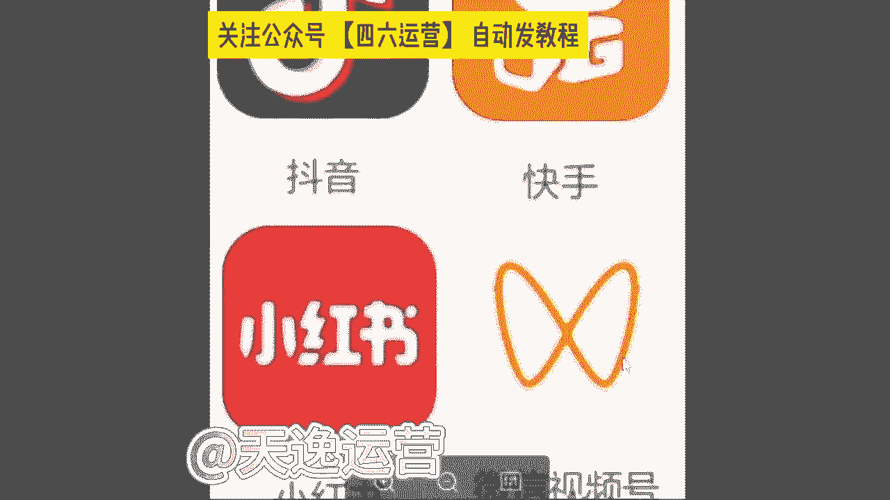

搜狐的任务，这个呢就是所有影视剧的名字。看见没？影视推广是什么意思，知道吗？同学们影视推广是什么？知道吗？就影视推广的话，就是每一个电视剧或者说每一个电影或者说每一个综艺，它都会涉及到宣传啊。

宣传就很多这个现在很多广告商呢，就是因为很多明星也好，或者说很多网红也好，我们拍完了这些电视剧或者说短剧，之前因为疫情的原因，没有办法到线下去这个宣传。他们都会运用到这个影视推广的平台。

就我们去做视频帮他去推广，我们就可以靠这个播放量去让他给我们结算奖金。包括每一个这个视频，就每一个电视剧这个视频，我们做完了之后，我们是需要添去这个提交一个这个任务的这个回填链接的。就我们要去报名。

就我们要填写自己的微信号账号昵称，或者说我们自己抖音或者说快手的ID包括我们自己做的是哪一个电视剧，我们要添加清楚，包。😊，这个电视剧这个作品的链接你是发到哪个地方的，你要粘贴上去，发布的时间是哪一天。

包括你要把这个视频的播放量的截图上传上去。到时候我们这个回填链接填完了过后，我们就会给你结算收益了。这个就是影视推广哈。因我们也可以看一下这个影视推广的话呢。

它的这一个收益呢会比纯播放量的一个收益会更高一点。那现在给你们看一下。😊，看见没？包括短剧的话呢，其实是非常多的。短剧的话呢，就是现在很多这个不是很多传媒公司嘛，就有很多网红，他们会自制一些短剧。

短剧话呢就是他没有办法自己去做一些这个广告的宣传，他就会让我们自己来做这个视频，发布到抖音小红书视频号，那没这三个平台都是可以去发布的。然后呢，根据播播放量的这个要求去计算我们的收益，没有粉丝要求的啊。

对于我们自己的账号是没有粉丝要求的。有没有粉丝跟他没有关系啊，我们一部剧呢最高播放量的三个作品，加起来的总和去给你结算，包括这个总和该怎么去计算的。看一下抖音这个平台，一万的播放量奖金是50块钱。

就最开始我给你们算的那个单价还记得是多少嘛，就一万的播放量单价，就一万的播放量，单价是34块钱。那个是头条号34啊，对，34。就那个呢是头条号，它这个播放量的一个单价的收益。像这个抖音的话。

你明显的感觉到这个一万的播放量奖金收益是会更高一点的。因为抖音的话呢，它这个每天的日活跃用户接近10亿了，非常庞大的啊，非常庞大的啊第二个视频号的话，就是微信视频号，你发上去一万的播放量奖金是10块钱。

为什么它的单价会低呢？是因为我们每一个人都有微信啊，每一个人都有微信都会去看这个视频号的，所以说它单价呢会少一点啊，会少一点。像这个小红书的话，单价是最高的啊。

小红书的单价是1000的播放量奖金是30块钱1000啊，就我们叠加起来呢，每一个这个呃视频，就如果说我们去结算这个收益过后，每增加1万的播放量到时候还是会有奖金的啊，这个就比较可观了，是吧？除此之外呢。

像一些搜狐的短句。搜狐视频的话就是现阶段我们可能看见的是比较少了，就我们原来看的时候呢会更高一点。就是搜狐视频。搜狐视频呢他也买了很多视频的版权。但是因为这个本身这个是视频。

它的这个知名度可能不是很高啊，可能不是很高，所以说他很多短剧呢，没有办法去拿到一个好的评分，或者说更高的一个这个播放量，但是会拿过来给我们去做的，像这个抖音和快手这是需要两个平台都去发的啊。抖音加快手。

让他按照什么结算呢，点赞计算，也是没有粉丝要求的，就单条作品，如果说有5000个赞是怎么的？就是我们抖音和快手，我们右边它是会看什么，就会看那个点星星，知道吗？那个是点赞5000个赞是100块钱。

抖音的话，如果是1万个赞是200块钱，快手1万个赞它是180他给的单价是最高的啊，这个搜狐的短剧，单价最高的，就这一个有没有兴趣的。あ？因为这个影视推广的话，它收益结算的话呢，是一个月结一次啊。

是一个月结一次，这个能接受吗？就我们是月底结算的，这个收益结算的话呢，就是按照播放量计算。我刚才说到的，每一个这个短句呢要求是不同的。我们按照他的一个要求来就可以了。像这个呃呃除此之外。

就如果说同学们做这个影视的推广。除了这四个平台之外，你们可以靠这个播放量去结算这个奖金。如果说在这个基础之上，你们还愿意去添加解说的。就我们一个作品，一个视频，你是可以获取双份收益的，什么意思呢？

就除了刚才我们讲到那四个平台之外，你可以发布到其他平台，你是同时还是有这个什么呢？还是有版权的，你可以去做影视的解说一个视频，我们拿双份收益。包括给你看一下吧。就我之前有一个小伙伴也是。

这个就这个小伙伴呢之前做的就是这一个影视的推广。给你们看一下这个收益吧。当时这个小伙伴他是自己有想法的，他对抖音这个平台是比较喜欢的，但是看中这个抖音的一个带货能力。但当时呢他自己的账号粉丝也很少。

他想要去做带货。但当时呢他说先积累粉丝，后期呢他是想要带货的，做的就是影视推广，因为影视推广的话，当时他问我可不可以朝这个方向发展。我说可以呀，当时我直接把那个回填链接发给他了，报名的渠道。

我说每一次你去做之前，你先把这个报名渠道填完，填完了过后做了视频，你要去填那个回填链接，就我刚才给你们看见的那个账号的ID你是必须要写清楚的。到时候要不然到时候这个抖音就结算不了哈。

这个当时我给他看的就是因为最开始呢他做的是什么呢？做的是短句，因为短剧的话呢，他是这个推广的渠道是很少的。如果说我们去做这个播放量的这一个收益呢，他是会更多的。当时他做了第一个短剧。这个短剧的话。

要求是发三个视频。😊，就每个短句他会有不同的要求，他让你发三个，你必须要发3个，他让你发10个，你就必须要发10个啊，这个我们得按要求做事情的，要不然到时候他是会给你下架处理的。

当然他这个视频做完了之后呢，播放量是很高的，186万。因为短句嘛，它是比较能够贴近现实的，就比较能够抓住我们用户的一些心理啊，所以说他这个播放量呢是比较高的，他也觉得很恐怖。但是就是这些短剧呢。

他只是说我们平常看的比较少而已。就所以说这个话题度是很不错的。当时呢他这个短剧186万的一个播放量结算的话呢差不多在500左右，结算是结算这么多，但是如果说后期每增加一万的播放量。

我们还会给他添加10块钱的这个奖金，这机会是很好的。但是这一个那做的第二个短句呢就是效果就没有这么好了。因为第二个短句呢，他选择这个短剧呢，可能就是本身的话题度就不是很高。但是呢呃它的单价会更高一。

点啊，这个就是有不同的一个选择了嘛。当时他这个短剧的话呢，过程当中是1。4万的一个播放量啊，1。4万就很低。但是呢单价的话是给到了150的，所以说单价不同，他给的这一个收益呢也是不同的。

当时这个过程当中的话，它是做了将近一周的时间7天。因为一个月结一次嘛，刚好碰到月底的时间了，而结算收益的话，当时官方系统那边给我结算的。因为他是第一波做这个影视推广的人啊，所以说结算给我的。

如果说后期的话呢，我们全部走这个对公账户啊，全部是走对公账户。因为系统那边要核销的。但结算的话，四个短剧，一周7天，他做了4个。第一个短剧的话是在那个186万的基础上面，后面又正增加了一个6万的播放量。

叠加是60，总共结算是580。第二个播放量不高，但是结算了150块钱还是可以的。第三个呢就是因为他没发快手，这个是很可惜的。因为那一个作品要求发抖音和快手，他只发了抖音，没发快手。

所以说只给他结算了一半的收益是120块钱。第四个呢，因为本身任务的单价是比较低的，只结算了45，当时总计的话是895块钱，这一周的收益，这个还可以吗？满足了嘛？就7天的时间，他做了4个短句。

当然这个根据咱们自己的实际情况来，你有更多的时间你就可以做更多的短句，然后去填回填链接，一个月给你结算一次，还可以的。这个收益还可以了吧。7天的时间啊，这个呢后期全部走这个对公账户。

但是呢过程当中得给你们强调一点，这个渠道是我给你的，你做的视频呢是必须要发给我的，我审核通过了之后，你才能去发，要不然直接给你下架掉啊，直接给你下架了之后，你就没有办法去靠这个播放的结算收益了啊。

这个要给你讲清楚就是这个渠道的话那就很多同学会有这样一个疑问。说哎曾老师为什么他们自己不去发广告呀，要把这一个。😊，视频就这个影视推广拿给我们去做呢？有没有这样疑问的？而曾老师，他为什么不自己去做宣传。

发广告呢？他要让我们去做这个影视的推广。😡，有没有这样疑问的？因为我不知道同学们有没有了解过这样一些信息哈，就每当一个这个影视作品或者说制片方出品人，他们去发这一个广告，他们的费用不知道你了不了解哈。

就低的话呢？基本上每一个这个广告低的话是10万左右，一个广告，他可能发的地方呢是比较少的多呢？他是100万起步的这个广告的费用，你是觉得他把这个影视的这个推广拿给我们去做，给我们结算的这个奖金。

他花的钱多还是他们去发广告花的钱更多呢？你觉得是哪一个？你觉得是推广花的钱多？你打推广，你觉得他自己去发广告花的钱多，你打广告，你觉得是哪一个他花的钱更多一点。😊，是不是他自己发广告花的钱更多，是不是？

这个就是为什么他要把这个影视推广拿给我们去做。因为我们人多力量大，我们去做视频，它的这个扩散度是更高的。包括因为这个疫情期间哈，这个机会呢，他原来是没有的，是因为现阶段的疫情它真的放开了之后。

可能会更加的这一个扩散度会更庞大了。所以他们不会选择去线下宣传，基本上都是拿给我们做这个影视的推广的这是一个机会啊，就看你自己愿不愿意去做这个了。😊，那么在讲解说之前呢，我们首先先去看一下什么样的视频。

它叫做解说是从哪几方面来组成的。先去了解一下。

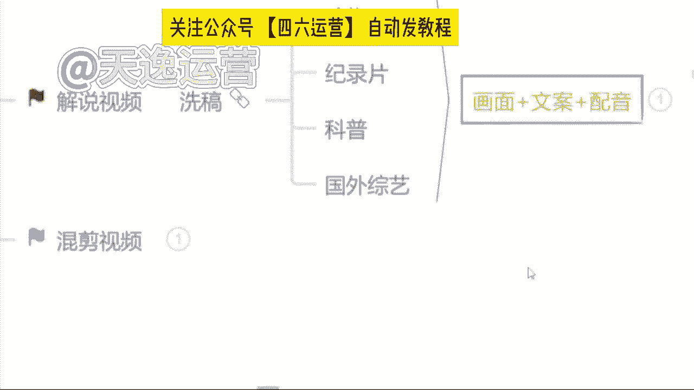

🎼真的抗打，胡子哥的胜利来之不易，比赛竞级，大家请勿模仿，如果给你一个机会，你愿意参加这种比赛吗？就我们刚才看见这一个视频呢，这个视频呢就是非常典型的一个这个解说类的视频了。三方面组成的哪三方面呢？

包括给你们放小一点，你们可以再看一下。首先第一个呢就是这个画面啊视频。那第二个呢就是有这个文案看见没？有这个文案的情况之下呢，还是会配音的啊，就有这三方面去组成的。

包括你们现在看见这个呢是一个这个国外综艺的解说啊，因为国外综艺呢，现在走的真的非常的野啊。除了你们现在看见这个什么扇耳光的也好，是吧？经常刷视频的人应该都有看到过一些奇奇怪怪的就是什么掰腕子的呀。

什么真心话大冒险的呀，包括这个国外不是走这个开放嘛，是吧？什么这个综艺里面穿什么比基尼的呀这样的视频真的特别多啊，特别多。不过现在呢就可能这个也比较抓人眼球啊，未来你们可以去做这样的视频。

国外的一些那今。😊。

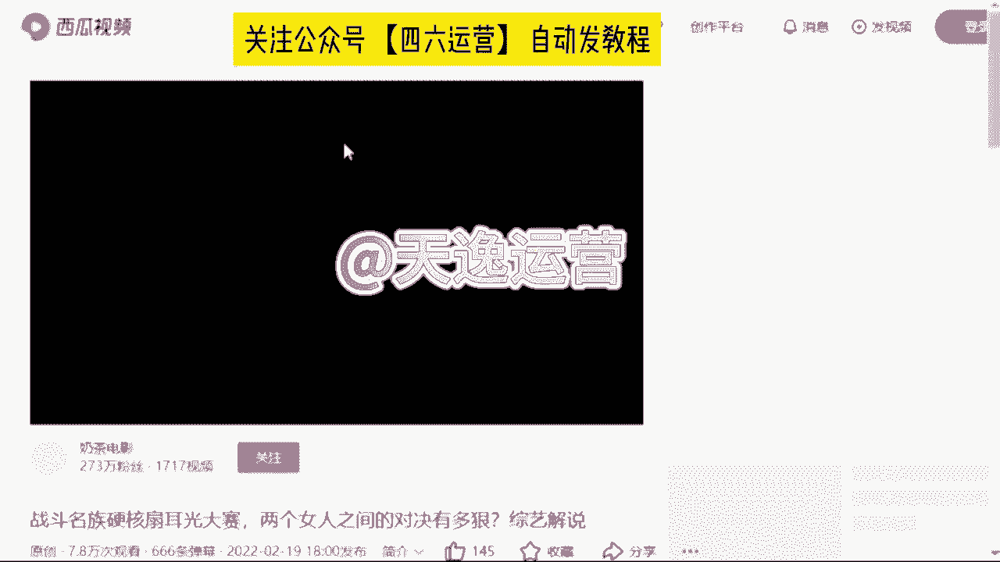

天呢我可能不会给你们讲啊，因为这一个国外综艺的话呢，它是会涉及到一些国外的平台和国外的素材。今天自节官方的人员在听我的课啊，所以说如果感兴趣的同学下课之后，你可以加我的微信来问我，我教你怎么去做好吧。

我们刚才讲到了解说呢就三方面组成。第一个画面，第二个文案，第三个配音。那如果说我们不会自己写文案的同学，或者说自己不想写的那我们就去找素材来用。说到找素材呢，我要问你们一个问题了。😊。

就我们本身做的是一个视频的解说，你找素材还能不能去找视频的文案来用，同学们觉得能吗？就我刚才讲到的不能。哎呦说能的，这么问肯定不能。😊，可以呀，上道了是吧？对，不能啊，打能的同学嗯先给自己一巴掌啊。

打能的同学先给自己一巴掌。我刚才说到了。😊，我们本身做的是一个视频的解说，你还要去找这个视频的文案来用，它跟洗稿就没有什么区别了啊，就没有什么区别了。首先它是不能的啊，是不能的对了，那我们找素材呢。

我们要学会什么，我们要学会逆向思维。什么思维呢？我们本身做的是一个视频，我们就不要去找视频了，我们可以去找文章或者说音频来用啊，因为我们所有的一个平台，我是非常清楚的。它文章和视频是分开审核的。

不会有任何内容重复度的一个出现。我们可以去找文章或者说音频来用。这个小窍门呢是我自己的一个独家小技巧哈。因原来我做这个自媒体的时候，我不光在做视频，我也在写文章的。

就最开始呢我自己的文章是我自己纯原创的，我自己手动去写的。😊，就最开始这个文章的话呢，当时做的人很少，我做起来了过后呢，我的账号就越来越多了。到那时候我账号多了之后，我就明显能感觉到我自己写不过来了。

就很多账号我发不过来了。当时我就在思考，哎，我说我能不能去通过一些什么样的方式去增加一下作品的数量，同时不会去增加这个内容的一个重复度呢。当时我写文章，我当时用的就是一些音频就音频嘛非常多。

像什么喜马拉雅呀、企鹅FM呀，这样的音频平台，我当时是把他们的音频提取出来的啊，文字我拿了过来当文章用的。当时呢我自己主账号呢，就主要做的就是文章类的，我给你们看一下吧，就这个收益的话真的还不错。😊。

这还可以，你们看一下，我给你们刷新一下，你们就可以看一下，每天他这个文章和视频的收益，你可以看一下谁更高啊。同学们是文章吗？对了，这个文章呢每天的收益会更高一点。你为什么呢？因为我堆量也是堆上去了的。

我每天文章呢差不多在12篇左右啊，12篇文章，我数量也够了的，所以当时结果还不错，那我最开始后边做这个视频的时候，我当时也在思考，我说我可不可以用这种方式我也去堆一下量呢？当时试了一下，结果还不错啊。

所以说这个方式呢交给你们可以去用的。😊，🎼那么们今天找素材的话呢，我们就要用到一个小白神器，一搜猫的一个素材库。要找到我们自己的微信啊，然后小程序里面就有一个一搜猫啊，就是这个小程序找到了过后。

首先来讲一下我们该怎么去用。那第一个视频的资源呢，就是我们所有平台上面的视频，所有我们想要做的这个视频主题的视频，我们都是能找到的。比如说举个例子吧，因为我们按照沈腾来是吧，比如搜索一下。

我们直接搜索这样的一个关键词，所有平台的一个关于沈腾的视频我们都是能找到的。看见吗？这是视频资源。那我们今天找素材呢，我们要用这个自媒体资源，这就是文章了啊，我们点开这个自媒体资源。上边这个领域的话呢。

就是我们自己做的是哪个领域。你自己随机去选就可以了啊，我们选择领域了过后呢，下边有个来源，就是所有的一个自媒体平台都在上边，我们自己去选啊，我们就选择一个百家号来看一下，是吧？这就是所有的一个文章。

这就是我们找素材的一个来源了，该怎么去找呢？来我找一个就是最近我们比较熟悉的。😊，我们看一下哪个文章我们能用。非常多，嗯，我们都可以来看一下是吧？包括我们就看这个吧，最近这个胡歌演的电视剧是吧。

县委大院在县委县委大院儿不是比较火嘛？你就根据这个来，我们要做解说视频。首先第一步，我们要去找一个视频的素材，视频素材我们该怎么去找呢？就根据它这个主题来是吧？热播剧县委大院。

我们直接把这一个名字复制下来，然后打开我们自己手机上边的西瓜视频，啊，我们直接去找西瓜视频，然后在这里搜索这一栏，我们直接去搜索这一个电视剧名字什么呢？县委大院儿。😊，来直接搜索就可以了。

来看一下我们这个视频资源素材能不能找到了。现在能的来打个能字吧，视频素材能不能找到了一样的啊，在这个找素材过程当中，我还是强调那一点，你们不要紧着一个人的去用，好不好？不要直接去下载啊。

我们刚才说到了每一个视频片段，你保持在10秒钟左右，这才是我们能够用的视频素材，现在能不能找到了，能是不是啊，这个视频的素材我们能找到了ok那下一步文案是从哪里来的呢？文案就从这个文章当中。

我们去提取出来的文字啊，这个文字我们有了文案有了配音会吗？同学们自己会配音的，自己会配音吗？因为我刚才讲到的哈，咱们手机里面有录音机这个东西吧？有没有有吧，录音机我们打开，然后我们自己把这个文字念一遍。

我们自己去配音，到时候呢人家想把你的这一个文案，或者说这个。😊，和视频搬都搬不走啊，这是我们自己纯原创的一个内容，就不会配音的同学，是不是害怕自己普通话不好啊，是不是担心自己普通话不好？

如果说担心自己普通话不好的同学，我们就可以用方言啊。方言就现在方言音呢，刚才我也讲到了，所有平台方言音它运用的是比较少的，它是比较有创新度的。比如说举个例子吧。😊，这同学们是哪个地方的人呀？

比如我是四川人，你就来听一下我的四川方言，跟我们自己说的这个普通话，它明显的不一样。啊。比如说我们四川话说什么嗯，这个包ber啊乖乖呀，这样听起来是比较好听。第三就你这样一听。

你就会觉得我的四川话是不是更亲切一点是吧？一样的，因为我们人与人之间我们看视频的话呢，它也是有这个地域差异的啊，你们去用这个方言音呢，它是比较有亲切感。就你的这个视频，它是比较有吸引力的啊。

这个同学说把死死的一样的啊，我们就可以用方言，但如果说你连方言你也不想去用的。你说晚说不想自己配音的没有关系，我们直接把这个文字复制下来，复制下来了过后点回一搜猫的首页位置。

我们可以看见左下角有一个智能配音的选项，看见了吗？直接点开它把这个文字粘贴进去，然后选择右边呢有非常多的一个。😊，这个声音什么这个邻家小姐姐呀，什么可爱宝贝的呀，萝莉音御姐音都在上边，咱们自己去选。

选择完了过后呢，这个语速我们给它调快一点，音量放大一点。选完了之后，我们直接点击左下角的试听配音，我们就来听一下。😊，好，现在合成了来听一下林志伟张新城市到光明县参加工作后的第一天，没有人理会他的时候。

他就想方设法的与同事进行沟通。当镜头给到江霞的时候，我以为他们俩会是走到最后的一对，可能是最这个声音还可以吧？这还可以吧，是不是这个文案也不用自己写了。这个视频素材也不用我们自己去找了，是吧？

这个配音还一键给我们配的方便吗？这样方便能大方便吧？嗯，当然如果说你不想用这个一搜猫的呢？嗯，可以打开我们自己这个微信上面有个小程序叫配音神器，啊，配音神器，你们也可以记一下。

他就是也是一个专门配音的一个软件，我记得配音神器，好像一个月是29块钱的会员29块钱愿意去花嘛。就我们得记住这一句话，叫什么呢？叫这个小投资大回报啊，我们一万的播放量，它的单价呢，都不止29块钱了是吧？

就如果说你不想使用的，你就会以去那个配音神器，如果说你不想。😊，去用这个配音神器也可以是吧？这个一搜猫的会员呢，如果说我们后边有缘分，我送给你们啊，我送给你们使用这个一搜猫没有多大问题的。就除此之外呢。

很多同学说哎曾老师，我不想用这个一搜猫的素材库了是吧？那怎么办呢？有没有其他方式呢？当然可以啊，是吧？我自己呢也是有一个解说文库的啊，我自己有一个解说文库的，就是所有的一个文案呢。

是我自己纯原创的内容这个呢我可以送给你们来使用，这个没有多大关系的啊。纯原创的，我现在包括我自己所有的一个小伙伴都会实时更新的。每一个文案的话呢，大概两三千0字左右。

你只需要根据我的文案去找视频来合成就可以了啊，找找这个视频就合成就可以了。这是比较方便的一种方式。😊，就除此之外呢，有很多同学说哎，曾老师我也不想啊，我也不想用你的，我也不想用一艘猫的。

问一下同学们有没有想自己写纯原创文案的。那个你告诉曾老师说，哎，曾老师，我就想自己写纯原创的文案，有没有我之前真的就遇到过啊，那个同学告诉我，那，曾老师，我就想自己写纯原创的文案。😡，真的特别的。😡。

有底气是吧？我就喜欢这种人。如果说想自己写纯原创文案的，我支持你。因为纯原创的文案，他比我们找来的素材，播放量的收益，单价都会高出两倍的，啊，单价都会高出两倍的，这是有优势的。

因为我自己呢是有一个这个文案课程的，就包括我自己写文案也好，或者说我自己小伙伴写文案也好，都是从这个课程里面来提取的，就很多同学说总么说不想自己写文案，我害怕。

就是不是觉得这个文案是一个非常专业的一个东西呀，是不是觉得他是一个非常专业的，像写作文一样的，其实不是的，如果说想写文案的同学害怕写文案同学记住我这一句话，我们的解说文案说人话就可以了。什么意思呢？

大白话就是口水化的意思。比如说呃给你们举个例子吧？就是我们把一件事情讲清楚，就我们平常给我们自己的爸爸妈妈或者说朋友们我们安利一个电视剧的时候，你要告诉他，你看这个电视剧。😡，多么的精彩。

你想让他也来看的时候，你一定不是这样说的吧，什么还有一个头头尾尾的，什么还有个开头过程，还有个结尾的妈妈，我今天看了一个电视剧，我觉得很好看。嗯，你说这个电视剧名字叫什么是吧？他是哪个导演来拍的啊。

他是哪个时间上映的这个男主角叫什么名字？这个女主角叫什么名字，第一集发生了什么？第二集发生了什么？第三集发生了什么，你一定不是这样说的，是吧？你一定是妈妈，我今天看了一个电视剧真特别好看，怎么好看呢？

那个男主角真的超级帅气，那女主角也真的超级漂亮的，因为他们好般配呀，发生了一件什么样的事情呢？这两个人是吧？相爱十年了，马上就要结婚了，但是那个男的这个婚前出轨了，是吧？女的知道之后去捉奸。

找到之后删了那个男的一巴掌说离婚吧，我不跟你结婚了，你一定是这样说的，是不是这就是我们俗称的口水话，不是像什么写作文一样的，还要有个星期集，这一天是这个哪个导演出现发生了一件什么样的事情，不是这样子的。

如果你这样去做，谁还来看你的影视解说呀，谁还来看你的解说视频呢？我都去看电视剧了，是吧？就让我们最。😊，最典型的一个例子是什么呢？是原来这个甄嬛传有看过吗？就非常典型哈。原来甄嬛传真特别好看。

我也喜欢看甄嬛传。但是我有时间我能看第一集，那没时间的时候，第二集我看不了第三集的时候，我就已经看不懂了。😊，是不是当时非常多的人做这个甄嬛传的影视解说是绝对赚钱的啊。

包括这个影视当中还有一些什么文言文，谁的学历有这么高啊，我还能把这个文言文看懂，是不是当时做影视解说的人，他就是说的大白话，你让我知道这个事故事当中这一集发生了一些什么事情就可以了，是吧？

是不是包括呢我自己的所有小伙伴当中做这个视频解说的人是最多的啊，最多的做解说的人，为什么？就因为这个影视解说或者说这个解说视频，他是最赚钱的，给你们看一下是不是做解说的人真的特别多。😊。

美纪录片的解说的，包括这儿有个综艺解说的，那没？这是电视剧解说的。😊，包括这儿动物解说的、电视剧的科普解说的历史解说的、动漫解说的非常多，是不是为什么他都要去做解说呢？就是因为解说它并不难。

而且它也是最赚钱的一个领域。包括给你们分享一个吧，我们你分享一个动物解说吧。就如果说你们现在想要去做解说视频的。一、你要做这个影视推广，你就可以去做这个影视解说，它是有版权的啊。

是能起到一个决定性作用的那如果说不想做影视的，我就建议你们去做这个动物的解说。因为动物解说现在在平台上面做的人是比较少的，平台的扶持流量是最庞大的。你们可以去做。😊，包括像我们这一个小伙伴的话。

当时他是一个五金店的小老板嗯，有没有自己家里面开店的？他就是嗯当时他自己是有一个五金店的，但是他当时跟我学的时候呢，他稍微有一点基础。他跟其他自媒体老师就其他机构老师有学过的这也是非常典型的一个例子。

他当时做或者当时学学的就是洗稿的内容，确实是他当时做洗稿的话，做了一个月。😊，但是一个月期间呢，赚到了100多块钱。但是一个月之后呢，平台直接把他账号给他封掉了啊，所以说他觉得这个洗稿不能做。

所以当时报名的时候，他给我打了半个小时电话，他只问了我一个问题。那老师我就想自己写纯原创的文案，你能不能把我教会我当时听见他这个问题的时候，我直接斩钉截铁的告诉他，我说你想做，我一定让你拿到这个结果。

但当时呢他心里面也有特别多的傲气，因为小老板嘛就原来也赚到过钱所以说过程当中呢，我们的沟通呢，还是出现了一点小插曲的。他虽然是一个这个五金店小老板，但是呢当时也是处于一个欠债的状态。

就是因为疫情的原因嘛，就是自己的这个五金店收益不是特别好，当时呢一度也是面临倒闭，但他找亲戚朋友们呢借了很多钱，在这店里面垫了很多钱。后边疫情呢也是反反复复没有一个很好的结果。

当时呢他做这个呃自媒体的时候，做洗稿赚到了100多块钱，他觉得这个行业是可以的。当时就跟我做，就做的就是纯原创内容嘛。😊，他赚钱的欲望真的特别足。你从他这句话当中就可以看出来，他一定必须成功。

没有撤退可言。我说我就欣赏这种人是吧？我说你有这种动力，我就一定能把你带出结果。我当时特别欣赏他。但是当时呢我给我所有的小伙伴说的是，我说你们的视频必须要全部发给我审核通过了之后，你们再去发布。

但他没有他当时觉得自己可以做。😡，他直接把这个视频做完了之后，直接就去发了。发了之后呢，他给我看，他说老师你给我看一下。他说我当时做的是这个影视解说发的王牌特工二的，让我给他分析一下不好的地方。

问题出在哪呢？问题出在他当时做第一个视频之前，我当时正在给他对接这个影视推广。我正在给他对接版权，他还没有拿到手，他直接去做这个影视解说，当时出现一个什么问题呢？那当然流量特别少啊。

因为影视解说如果说没有版权的话，他会有重复度，甚至说这个版权的要求的。平台在审核的过程当中会给你降低这个流量的推送。当时有这样一个问题啊，当时问题是什么呢？就是当时他这个视频做出来了之后。

2万的一个播放量赚了1。99块。😊，嗯，当时他直接问我，老师这个单价怎么这么低呀？😊，我说单价低两个原因，因为你自己版权没有拿到嘛，剩余的就是你这个视频发出去播放量时长低了。什么意思呢？

如果说你做的是一个两分钟的视频，用户点进去看了之后，他只看了十几秒钟20秒钟是吧？他这个单价这个播放量时长低了之后，会有影响到我们单价，也会影响到我们整体的一个收益结果的我当时给家讲。

那第二个呢就是很多用户，他反复的去点你的视频，他又不看完，因为重复的播放量他是不会计算在这个单价里面的。所以当时他这个单价是比较低的，收益也很低。当时我直接问他，我说现在呢我先让你不要去做这个影视解说。

我说你为什么还要去做呢？他说我有点不甘心，他说原来我做洗稿的时候，我还赚到了100多块钱。我说你等一等，我说把这个版权我给你了之后，你再去做都可以的。我当时建议他先做的是什么呢？

建议他做的就是这个动物的解说。因为当时做动物解。😊，所有人真是少之又少。我说你去做这个流量，我们一定能拿到手的。当时我给他这样说的，我说你做嘛？他说可以，我当时建议他做动物的时候，我说这个视频方面呢。

我们就去找一些国内外的保护动物，就像现在什么意大利的。😡，这个大街上面养袋鼠的是吧？家里面养黑熊的动物袭击人的事件真的特别多。我说你拿过来给我们国内的用户做个普及，是引起一下用户的共鸣。

他是具有科普作用的，这样的视频是比较有吸引力的。当时他做的就是这一类，就过程当中的话呢，是因为稍微有一点基础，所以说我们做这个纯原创内容的时候呢，发布平台也非常多的。

像什么B站皮皮虾视频号多多视频快手百家企鹅、西瓜抖音，每一个平台他都在做，当时呢我稍微有一点点担心，因为平台太多了，我怕他一个人顾不过来，但是当时呢他这个赚钱用望很足，我也没拦着他。

他说我就想把这视频横竖频都发一次，因为抖音是需要视频发放的，有这样一个规则。当时呢呃他说没办法，为了生活全身心都在上边了。我说我能理解你，我说你先跟你老婆一起顾一顾，因为他和他老婆一起在做的。

两个人都在做这个视频，也很不错。当时呢我说一旦过程当中有这个。😊，播放量降低了，或者说这个单价降低的情况出现了，所以你立马先停掉两个平台。我先我们先把我们能够抓住的这个收益，我们先赚到了再说。

那尽力而为嘛。包括当时的话也是文案是自己纯原创的，当时他给我发了一个快手的截图啊，这是他快手的。当时老师一个热门就200块钱，我能不发吗？我说发呀，能赚钱为什么不去发呢？当时快手的话。

热门就是每隔一天就会有一个热门出现。你可以看一下这个播放量42万的56万的，听见没？59万的100万的，包括这个71万的，这个63万的播放量真的还可以吧。这个热门的收益就一个热门是200块钱。

他跟这个播放量单价是另算的啊，是另算的，不会很合成在一起的。但收益呢谁然可可可观的。当时给我说到一个星期就这个热门的收益保底都是630块钱。😊，这个收益还可以吧。当时呢他快手也报了一个作品。

1143万的那老师这个作品还没有评奖，我不知道拿多少。就是我们把我们视频的作品质量估好了，你能够变现的途径是很多的。这个奖金。如果说他能够评到奖。奖金起码都是3000左右的这是非常可观的。

当时呢也是这个过程当中呢，我觉得他特别优秀的一个点，就是过去作品当中啊过程当中我们做视频，他有了这个播放量，有了这个收益过后，他依然会去顾质量，他不会去要求数量的。

当时我说我们的账号是需要有一个稳定期的。我每天先把这个账号活跃度提起来。后边我们的对这个平台给我们推送流量的时候，就会慢慢的去增加我们的这一个扶持流量了。当时他说我不追求数量的。

做一个是一个每天必须有一个不会做多，这是我最欣赏他的一个地方，思路是非常清晰的。当时过程当中呢，也是说到了，但是没办法，如果说做了没有结果，不是我的风格。我当时也说到，我说如果说我带你没有带出结果。

这也不是我的风格。啊，当时他做这个视频的话呢，做将近一个半月的时间。结果真的还可以，给你们看一下。😊，那没播放量1288万的视频的收益22616块钱，这是一个半月的时间。当时还没有到这个月的15号。

所以大概也就一个半月。这个收益满足嘛，你觉得还可以吧，这个收益对你来说你觉得满足了吗？当时一个半月的时间，2万多块钱，他真的当时给我打电话的时自己自己差点差点跳起来，人真的特别高兴，我也真的特别开心。

过程当中呢还是按照我的要求去做的。我给你们看一下吧。当时他第一个爆款视频，你们也可以看一下他到底做的怎么样。😊。

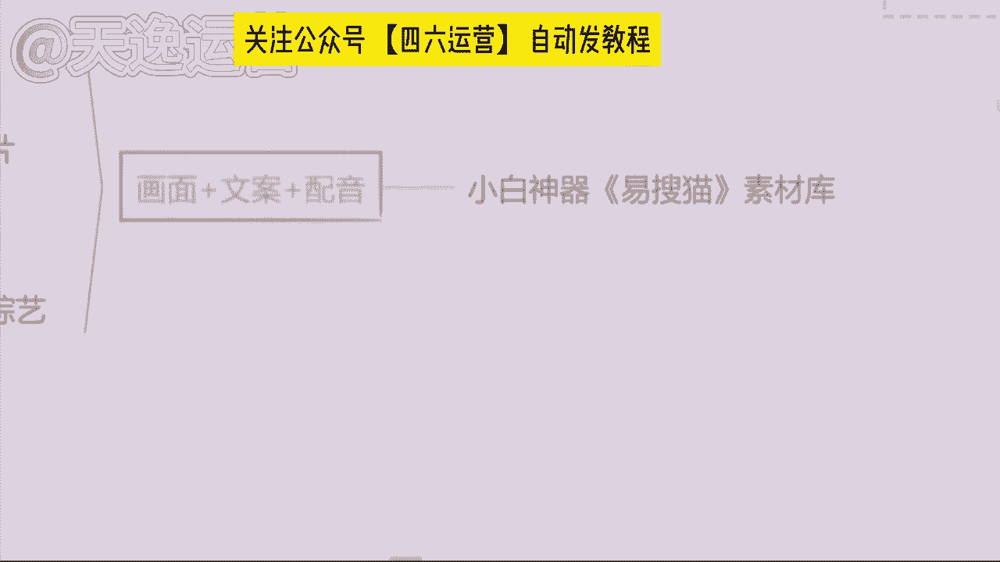

Yeah。🎼在绝杀时刻，一只狮子在这里拦截迁徙的角马家族群，他先是漫不经心的驱赶角马群。一看他就是狩猎经验丰富。为了捕捉猎物，他耐心的观察，不急于出手，他终于发现了适合的角马就全力加速追赶过去。

角马们吓得四散而逃。他的奔跑速度，惊人让狮子感觉有点棘手，他果断放弃，快速转向另一只比较弱的角马，他说真是来的早不如来的巧就是你了。狮子把角马驱赶进了草丛里，这样可以减缓角马的速度，他一个腾空飞跃过去。

就按住了角马，混乱中死死的咬住他，还抱着不撒手。角马腾突万分，可还是毫不畏惧，他一心只想甩掉狮子的束缚，急的是原地转圈圈，他们都觉得是展现自己实力的时候到了，他们不肯认输，又来到了空旷的草地上。

想要一争高下，双方一追我赶，搞的是不亦乐乎。角马今天如有神猪一样越战越勇，把狮子一顿无情的驱赶。狮子也猛圈了，心里在想，你这小子今天是抽什么风，昨晚是不是喝多了，他一连去的腾挪躲避后，忽然在地上。😊。

🎼滚了一圈，然后出其不意，就跳过去抱住了角马的头。这操作绝了。角马说，你小子净耍花招，反正我是见招拆招，他顺势就把狮子放倒在地上，而狮子也毫不示弱，仅仅抱住了他的头，还用他全身的力量往下拉。

可狮子这样就变成了肚皮朝天，把自己最柔软的部位，赤裸裸的露了出来。角马一看反击时候到了，他快速将狮子压倒在身下，好，这些视频我们先看到这儿哈，同学他一视频做的怎么样，你觉得还可以的，来666打起来。

你觉得可以吗？这是当时第一个视频的话，做的结果还不错。当时播这个爆款的播放量的话是51。1万的，你们也可以看一下他这个解说文案当中哈，使用的就是一些口水话，包括说什么？嗯，你小子是不是昨晚上喝醉了。

你抽什么风是吧？这操作绝了，这样的话，你们平常会说嘛？这样的话，我们平常应该都会说到，是不是你小子抽什么风是不是昨晚上喝醉了，这就是我们用户想要听到的口水话，我能听懂的语言。😊，是吧有趣有梗的语言。

就是你平常都会说，为什么不拿来放到自己的解说文案当中呢？是不是这才是我们用户想要听到的，想要看到的解说文案，不要觉得它特别难，其实非常简单的啊，就除此之外呢。

就很多同学你们就可以思考一下了是吧？我讲到这儿，你们到底想要去做这个解说呢，还是想要去做这个影视的推广呢？是吧？我们自自己一定要有一个想法的啊，我们自己一定要有想法，我们再去做。

我们才能够更快的去上手的。😊，🎼那除此之外呢，第三个我要给你们讲到就是这个混剪视频了。混剪视频的话呢，讲之前也给你们讲一句啊，就是这个混剪视频，它是我们所有的视频领域当中最难的一个最难的一个。

因为我最开始呢自己有手动剪过这个混剪的视频，就给你们说实话，我也不怕你笑话哈。就我们我最开始手动剪的时候，给我一度自己做到崩溃。为什么呢？真的特别浪费时间，如果说我要做一个5分钟的混剪视频。

我起码要剪100个视频片段，我能我才能够去组成一个这个呃合适的一个时长的混剪，当时越剪越生气，这过程当中，因为我自己做的账号也特别多，我也在运营公司的账号，包括解说我也在做，包括视频剪辑里面的推广。

我也要去做，包括这个混剪，我也要做，我当时就越剪越生气，我说真的特别浪费时间。我就找老板，我说老板，我真不想做这个了，我说真的浪太浪费时间了。我说我顾不过来，但是我说我们公司这么多这个技术部门的小伙伴。

就不能让他们做一个软件。😊，编出来嘛，是吧？拿来我堆量也好呀，当时我特别生气，因为我老板听了呢也笑了笑，没说话。但是我们公司呢也是浪花了4年多的一个时间给我们研发出来了一个这个软件啊。

就叫批量剪辑的软件，我现在去全靠它来堆量的。所以今天呢我就教你们怎么去用这个工具去做一个混剪的视频。后期可以帮助我们去堆量拿这个播放量的收益的。当然这个呢是我的一个知深法宝啊，这个法宝名字呢。

它就叫批量剪辑，嗯，名字就叫批量剪辑啊，我们不搞那些花里胡哨的东西，我们能听懂能用就可以了，好吧，那这个批量剪辑的话呢？就混剪的视频，我们要去区分领域的，什么样的领域最好做呢？首先第一个就是影视方面的。

就影视方面呢？它是最好做混剪的。国内外的这一些电影，同学们看不看。😊，看得来公屏上打一个看字吧，就同学就国内外的这个电影，你们平常会不会看？就像我们国外的什么哈利波特呀是吧？或者说什么漫威呀。

或者说什么速度与激情呀，这样的影是他最好做混检的那除此之外呢，像一些我们国内的什么。😊，这个什么武打片儿，就像这个枪战片这一类型的，它是最好做魂检的。除此之外呢，像一些这个美食类的。啊。

美食类的也可以做混剪。除此之外呢，像一些动漫的，就国漫呀，或者说日漫，我们中国自有国产动漫、日本动漫就是一些特效场景，它也是比较容易做这个混剪类型的。就做影视的话呢，同样的啊，如果说你去做这个影视推广。

到时候版权拿到手了之后呢，随你做那随你做这是比较有优势的啊，首先我们要去找素材的话呢，我们换一个吧，我们最开始用的是西瓜，现在我们换一个平台。我们去用B站吧，B站什么哔哩哔哩就这个平台知道吗？

同学们这个平平台哔哩哔哩啊，我们平常一搜索网页都会有的，我们直接点开这个搜索栏，我们今天就去做一个我最喜欢的一个这个国外大片，哈利波特有看过吗？有的来公屏上打有字吧。就哈利波特。

我们就去做一个哈利波特的魂简一样的，我们点开搜索这一栏，我们直接去搜索哈利波特。😊，这样的一个关键词就可以了啊，搜索完了之后来直接点开。现在我们可以看一下，这就是全部都是哈利波特的视频。

我们随便点一个来看一下。Your attention， please。Let the feast。Begin。🎼First， these， first。

🎼Say all the words inside my。啊，这个视频呢它就是哈利波特的哈那如果说我们想要去用这些素材呢，就是任何一个平台都是一样的。西瓜视频也好，B站也好，或者其他的视频平台。

我们想要去下载这个素材呢，你可以看一下，下方没有任何一个选项是可以来下载的那怎么办呢？我想用这个素材来，我们直接找到我们手机上边有一个这个网页的链接，看见了吗？我们手机上边都有的。

我们直接去把这个链接复制下来，复制下来了过后，找到我们微信小程序一搜猫，我们可以看见左下角有一个视频下载的一个选项，直接点开它，然后把这一个链接点进去开始解析。那这个视频呢我们就能下载了啊。

这是比较方便的一种方式。当然这也是单个下载的一个途径啊。但是我们要做这个批量的一个文件的话，我们肯定是要下很多素材的，不止一个了。那怎么办呢？😊，一样的，我们去找到这个链接，同样的去复制它。

然后我们就可以看见跟它同样长度的视频是有非常多的。来，我们随便去复制一个那复制完了过后呢，我们就来搜索一下啊，看一下有多少个这个步骤呢，到时候你们可以记清楚啊。

因为我们后边也会用到的来看一下有多少将近20多个视频，我们直接复制，然后我们要用到一个批量下载的软件啊，这个名字呢也叫批量下载，也是我们公司自己研发的，后边呢我可以送给你们使用啊，这个没有问题的。

我们直接点击这一个粘贴，然后所有的一个视频链接呢，它会自己去解析啊，然后自己去下载，可以看一下，是不是哈利波特的是不是自己就会开始下载了。🎼那在这个下载过程当中呢，我们必须要用到一个批量剪辑的工具。

这就是曾正老师说到的支撑法宝了。首先来看一下该怎么去使用。那首先第一个呢，分割提取就是无论你做的是这个。解说还是视频剪辑，还是说批量混剪，我们都可以用到它。就这个我们只需要把这个链接粘贴进去，然后呢。

干嘛？我们只需要去调整一个时间参数就可以了。就右边每段的时长，我建议你们每5秒钟为一个片段，这是最好的也是最精彩的一个片段，我们直接去调整就可以了啊，5到10秒钟10到15秒钟这样去调就可以了。

那么今天要用到的呢就是这个超级混剪多视频混剪这一个选项了。首先第一点就把你们自己下载的一个视频素材全部添加进去。然后这个魂剪的话，它是肯定需要音乐的。我找了一个音乐给你们听一下，你们来听一下它合不合适。

好不好？来听一下这个音乐。Like。🎼不是为。好，那么首先呢我们这个音乐添加完了过后来左下角我们要去添加第一个什么呢？就是有一个生成单个视频的时长。我们刚才说到了哈，就如果你要做的是一个一分钟的。

是60秒。如果是一个两分钟的是180秒。如果是一个3分3分钟的就是180秒，我按照这样的一个时长去调啊，这个调整完了之后，左下角有一个单个视频片段随机抽取。这个按照我刚才说的来，每5秒钟去调整一个片段。

它是最精彩的啊，15秒到20秒或者说20秒到25秒钟，我们就选择中间的这一个片段，它是最精彩的，我们可以去用。那这个调整完了过后呢，右下角有一个生成的视频数量，就你想要做多少个，你要做10个。

你就添加10个，你想做100个就添加100个。这个根据我们自己呃下载这个视频素材的数量来啊。我们今天呢先做一个为了更快的去看见这个成品。这个数量我们添加完。😊，过后只需要点击左下角的开始。

然后他就会自己去执行任务，抽取音频，采取这一个视频的片段，这个他就会自己去做一个这个混剪的视频，我们只需要稍等一分钟啊，这一分钟呢让他去剪，我们来唠一个嗑，对吧？那这个呢我也给你们讲清楚这个工具呢。

它毕竟是工具，如果说你想让它剪出来的视频，跟我手动剪的一样的好，它达不到啊，它达不到，这个得给你说实话，就这个视频呢，它剪出来这个混剪视频，工具剪出来的，每一个呢它能达到一个正常推流机制。

就是每一个在5000左右的一个播放量。就问一下同学每天半个小时时间有没有就半个小时，我们就花半个小时时间啊，我们去剪多少个视频呢，我们就剪10个嘛。就是我们最开始也说到了一分钟呢，它就能剪一个视频。

半个小时肯定不止剪10个，我们就按照最低的一个标准来算。10个视频，一个视频，5000的一个播放量。这播放量是多少了？5万了，我最开始算的一万的播放量的单价还记得吗？还记得来，你把这个单价打出来。

就我最开始算的啊，单价多少？1万的播放量。😊，1万的播放量是34块钱。哎，对了，34块钱我们就来算一下吧1万的播放量是34，5万的播放量乘以34。来看一下，我们做10个视频，170块钱的收益。😊。

满不满足就170块钱10个视频，我们一个月呢我们也不说多了。我们周末呢也休息一下，我们按照正常的一个工作日来算，我们一个月做24天的视频啊，我们乘以24啊一个月我们就靠这个工具。

我们每天去堆量4000块钱能不能接受能的来公屏上大能子吧，这个收益能接受嘛。如果说你觉得这个收益你满足不了，你接受不了的，O那你就花更多的时间更多的是精力，把这个量你给堆上去啊。

我是按照最低10个标准来算的。你就去做20个，做30个啊，当然这个过程当中呢，我们的账号它也要多，我们才能够平平均每一天去发布的啊，这个我要提前给你们讲的，因为我自己所有的小伙伴当中呢。

做这个批量剪辑的人真的不是很多啊，不是很多就是他们都在做批量剪辑，但是不是主体在做的那每一个呢要么在做解说，要么在做盘点辅助工具是这个。呃，混检的工具，他们拿去堆量的。

我还记得有一个主要在做这个批量剪辑，我看一下。对，就这一个。因这个同学呢他是一位宝妈啊，当时他主要做的就是这个批量的混检，就只做了一个批量的混检。当时呢他是呃因为自己过程当中家里面有孩子。

就没有办法自己出去工作，所以当时呢想来做自媒体，就有没有宝妈的，有的来公平上打柚子吧。因没有宝妈同学，她当时就是他有三个孩子，当她跟我说的时候，我都特别惊讶，我说你这么年轻，有三个孩子了，她说是的。

当时呢他也特别想出去工作，但是因为孩子的原因呢，没办法，她放心不下，就过程当中呢，他跟我说她她跟自己有公婆住在一起的，就因为公婆的关系不是特别好。当时呢生活费是每个月她老公发了工资，😊，她去要才会给的。

当时就有这样的一个情况。当时呢因为孩子要这个呃开学了，想给孩子买一些这个开学的新衣服新文具，我觉得这是一个好事嘛，对不对？当时他说她婆婆知道了，她找这个老公要钱，她婆婆给直接把那个生活费抢过去了。

给他说那你天天在家里面是吧？又不挣钱，还要花我儿子的钱，他说我儿子的钱是大风刮来的嘛？当时我听的时候真的特别惊讶，我说是真的吗？他说是真的，我说我以为电视剧里面才有这样的情节，但说当时我也觉得特别生气。

他说我过够了这种手心向上的生活，我也是自己有能力的，但说如果不是我是吧？他的这个我老公怎么能安心出去赚钱呢，是吧？他说这一切好像也应该是我换来的吧，他时特别生气，但说我就想让他们来看一看。

我是可以靠自己的能力赚到钱，改变自己的生活，给我孩子一个好的教育条件的，当时他特别硬气，但是呢随之而来的一个问题，但当时时间真的特别少。😊。

每天要照顾孩子，每天最多最多。他跟我说，老师，我每天最多能给你挤出半个小时时间。我当时听了之后呢。其实还是有点为难。我当时给他说，我说那你就先做这个批量剪辑吧。我说后边孩子上学去了之后。

我们再去拓展一些其他的领域去提升一下收益。当时呢他做了两个月，其实结果还可以给你们看一下。😊，有两个月的时间了，从一开始的什么都不懂，到现在这个月收入已经到13000了。

非常感谢我们这些宝妈提供的这个学习平台，还要特别感谢我的解答老师，细心耐心的给我解答和指导，才让我有了这么好的成绩。下面呢我给大家看一下我后台的收益数据。😊，给大家看一下。

这个是我这个月的总收益13338。看一下收益数据。从第一页。第一页。25号这都是每天100多几十300多。300多100多、200多、500多的。还有一页，这这边中间就有几个爆款了。

900多1000多2500的，然后100多100多200多100多。然后这几天也有一个爆款。

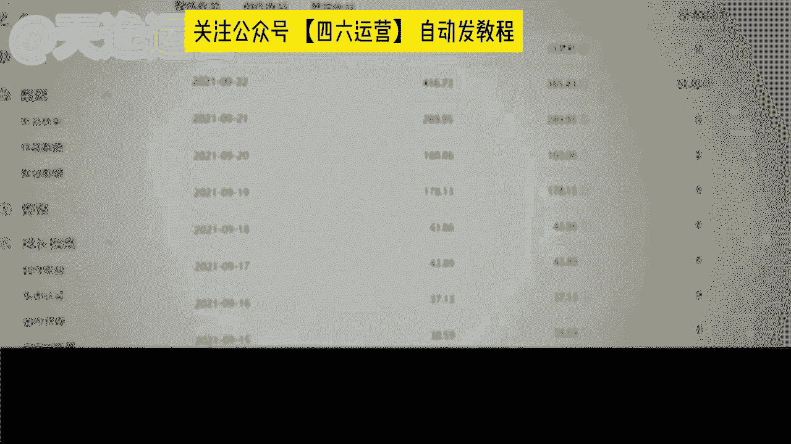

100多600多、200多、400多。昨天有一个爆款，还没出来数据呢。好了，这都是我的收益。这就是我这两个月的收益情况。现在我每天的收益都很稳定了。就算没有爆款的时候，每天也有100多。

我觉得吧做这个自媒体就是要耐着性子坚持不断更，肯定就会有不错的收获啊，后面的收益也会越来越稳定的，最后还要感谢老师们和我的解答好，这个视频呢我们就先看到这里哈啊，这个宝妈呢刚才也说到了。

如果说呢每天没有爆款的情况之下，收益呢也在100多左右啊，这是一个稳定的收益。当时呢呃两个月差不多13000的一个收益。我觉得这个结果呢是因为过程当中，他自己的时间呢慢慢的有增加。

当时他把这个作品的数量也是提升了的。包括他讲的一句话是我最认可的。就做自媒体就是要坚持不断更。为什么呢？因为我们需要活跃，自己的账号，你的账号越活跃，平台给你的扶持流量才会越多。

这也是很多人自媒体没有做起来的原因，因为他坚持不了，同时觉得你自己能坚持吗？😊，是确实啊说实话，现在很多人呢也做不到这两个字啊，我的要求是你们可以期一周7天的时间，不用每一天都去发。

但是至少要保证你发的时间要多于你休息的时间是吧？一周7天，你发4天，你休三天都可以啊，你每隔一天去发也可以，你不要发一周，第二周我不发，这样是不可以的啊，这样不可以的。

平台他有计自有一个计算方式的这样的方式，我们的账号它才会更活跃。😡，是吧包括呢到现在我们一个一分钟时间也到了，我们来看一下他这个视频剪完了没有？好，这个视频呢它剪完了那没执行完毕了。啊。

那我们就来看一下这个工具剪的视频到底怎么样呢？它能不能配得上这个5000的播放量，我们来看一下。😊。

🎼Just like that。🎼愛して。🎼别你我。🎼就是。🎼我去道。🎼愿你为。Bur it up the way， fucking let the world up for just one day。

 Watch this man。🎼他的风是锐。🎼Anyway， just like。🎼都远。🎼给来。🎼不是伪。

Just like that。🎼走开了。🎼し this。

🎼不是为。🎼你我。🎼Just like day。

🎼到了谁。🎼你我。🎼burdenur up the way。 fucking let the world up for just one day。

 watch this man this colorful cha。🎼Just like。🎼给了。🎼不是伪。好，这个视频我们先看到这儿哈。同学们觉得这个视频做的怎么样，还可以吗？这个工具剪的我说实话哈。

虽然说它真的没有我自己手动剪的好，但是它绝对比大部分做自媒体视频的人要好的多啊，这个是实话。这个5000的播放量它能配得上的吗？是不是包括我讲到现在哈同学们就可以思考一下，你自己想要做混剪呢？

还是想要做解说呢？还是想要做这个影视的推广呢？你想要做哪一个，如果说你现在已经有想法了。同学啊，你可以自己思考一下，但是呢我所讲到的哈，这三个领域呢，你不能每一个都想做啊。

我们最开始呢肯定要选择一个领域，我们去专攻的，我们有了这个收益结果，我们慢慢的再去拓展一些领域啊，因为我们没有人能够一口气吃成个大胖子的啊，不可以。所以说你们一定要对自己要做这个领域。

我说这个视频的这一个类型，你一定要有想法的，有想好吗？同学们做解说的人。😊，是我最喜欢的，因为我自己最擅长的就是这一个呃文案的这个写作。那我这是我最擅长的。所以说你如果说跟着我去做这个呢。

你一定能够拿到一个很好的结果。包括我刚才讲到这三个领域的视频呢，这是我所讲到的我们自媒体行业当中最基础的一个变现方式叫什么呢？内容变现，按内容变现。😊，这个内容变现的话呢。

就是如果说我们能够做到坚持啊这两个字你去实时的去发布作品，每天都能去发这个播放量的要求呃这个播放量的收益呢肯定是会更高的。包括这个内容解说呢，他也是我们零基础同学最稳定的一种变现方式。

包括你们现在看见这个呢是我们刚才那些同学今年的收益啊，刚才那些同学今年的收益，因为我每年只会带一批学生，所以说你们最先看到呢是他们去年的他们今年的收益呢我也找他们要了。

当时啊他们这个同学这个收益的话是我们这个呃刚才那一位宝妈就做批量剪介那个同学，他今年的收益。因为今年的话他开始陆陆续续的去接触了一些这个盘点的视频，我说也在做这个影视的推广，所以说收益的话呢。

这个播放量的收益是比比较高的啊，你可以看一下400多600多的，都是有增长的。包括像这个同学是吧？每天的收益当天的。1000多的2000多的这个给你们说实话，它肯定不止一个账号了啊，它有4个账号。

就每天的话呢，他靠这个批量剪辑堆量，他也能有一个不错的结果啊，这个给你们讲清楚。除此之外呢，像这个。就每天你们想要啊就是拿到你们这个这个单价能够达到像这个3000的、5000的、7000的，这个是全职。

🤧嗯。啊，这个是全职给你们讲清楚，就是他自己呢呃这个同学他有自己的5个账号，除此之外呢，他就每天也在做视频，他不是在做视频，就是在做视频的路上，他把所有的时间都花在这上面的。所以说他的是这个收益的话呢。

是比较稳定的啊，这是全职，包括像这个给你们看一个非常典型的一个同学当然这个小伙伴呢就是当天的收益最高的一天13000。当然这个也是个例啊，这也是个例。当时呢因为这个同学他也是全职。当时正值节假日。

节假日的时间呢就每天都在做视频，做完了之后，他是累积到一天去发的。因为他自己的账号也特别多啊，这是个例了，1万多的收益，平常的话也就稳定在过程当中是57000左右的啊，包括每一个平台。

他结算收益的一个时间，你们也要记清楚。像头条他这个平台是呃月底的那一周，周一和周四啊，是结算收益的，像大于和百。😊，或者说其他的平台基本上都是月初体啊，就是这个月月末结算好之后，下个月月初体现啊。

每一个平台它是不一样的。像我们这一个小伙伴的话。这也是全职了啊，这也是全职了。这个小伙伴当时嗯一个月的一个提现金额是78000。当时他主攻的呢是因为过程当中做了一个中视频计划啊，中视频计划的话呢。

是一个视频这三个平台同时都会给你结算收益的。所以他的收益呢是比较可观的啊，这个过程当中呢，他能做到现在呢真的过程当中他家人的支持也非常重要的。这个小伙伴当时他自己做的过程当中，他老婆也特别支持的啊。

我觉得这个信任的力量是非常庞大的，所以他结果是最好的。包括当时如果说你们每一天哈能够稳定在像这个小伙伴一样，每天能有200多这样的一个单天收益，其实你们的播放量呢其实已经差不多了啊，其实已经可以了。

如果我们能有这样播放量的时候，我们就自动解锁，第二种变现方式叫什么呢？叫广告变现，广告变现就像我们这个玩游戏是一样的，是吧？通关了。第一关通关了，第二关自动解锁。😊。

这广告变现是因为所有的平台上面都有广告商就有有没有了解过的广告商，比如说像我们举个例子，像这个什么小红书上面啊是吧？都有非常多的什么美妆的什么临时的，或者说美容方面的是吧？非常多广告商都在上边。

当然他不会让你知道他是谁哈，他会主动来找你的，因为你有播放量啊，他会来亲自给你对接这个广告会给发私信，说哎，我是做什么的？我今天想要跟你对接一个这个呃视频挂链接，还说视频带货，这个是两种不同的方式。😊。

就未来有没有想进行这个视频带货的？就未来如果说你们想要去做这个视频带货的，想朝这方面去发展的，后边呢也可以给你对接这方面的资源啊，像什么千万级粉丝的一些这个带货视频直播回放都可以对接给你们。

你们直接去减，然后挂小黄车都可以的啊，不需要自己囤货，这种方式也是比较可观的。就这个视频带货的，就是视频挂链接的话，讲一下，他是都是按单条计费的啊，每一条算价，视频挂链接呢。

每一条这个单价底价是1000底价是1000块钱。就如果说呃你后边会对接到这类似的广告的话，到时候你也可以跟我说一下，我来给你把控这一个对接的这个价格合作的价格，当时这个小伙伴呢。

他成交了一条这个视频挂链接，成交价格是200，但是最开始报没有报这么高，广告商只给他报了1000块钱，当时呢他来找我，他说曾总老师说可以接嘛？我说可以啊，但当时我多了多问了一嘴，我说你播放量大概多少了。

他说我最近的话。

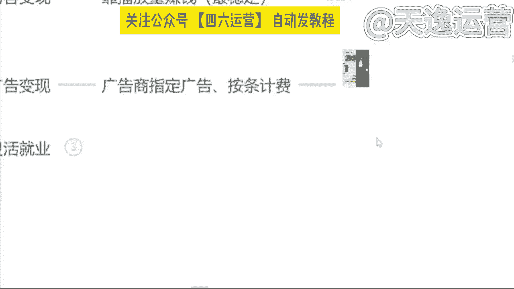

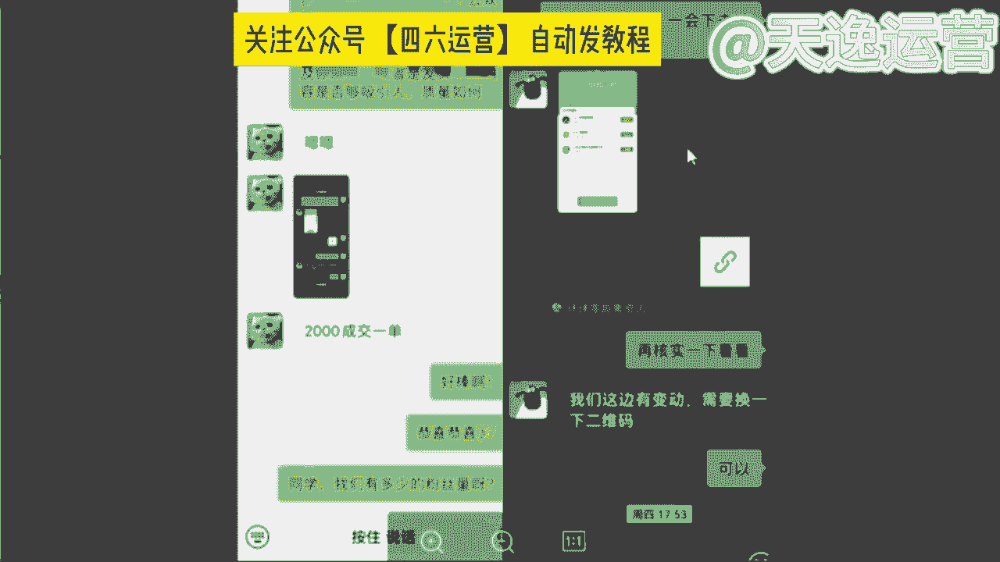

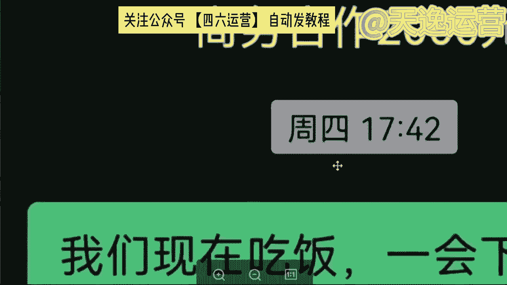

也能稳定在将近8万左右。这不错了，这个播放量当时我给他说了一件，我说你先跟那个广告商周旋一下，跟他砍砍价吧。我说你说你这个合作价格成交价你要2000块钱，我当时直接让提的，当天确实这么提的。

2000块钱，但当天没有答应啊，广告商没答应，因为他也非常尖，思考了一天，第二天晚上答应的。但是当时呢提了一个要求，在他作品里面去放了一个商家的二维码啊，就这个要求，当时呢成交价格就2000块钱。

当然如果说是视频带货的话呢，他单价很高了，单价每一条大概是在5000左右啊，这也是底价，你的播放量越高，他的这一个呃成交价格也是越高的。后边我们可以来呃这个了解一下，是吧？😊，那除此之外呢。

就是你做自媒体，你也可以考虑一下来进行灵活的就业。就这个呢比较适合于一些嗯现阶段就是临近大学毕业了，马上要去社会上就业了，不知道哪一个行业有这个发展前景的，你可以考虑一下自媒体。

就也适合于一些就是现阶段。自己本职的这个工作，它已经没有很好的一个升值或者涨薪的空间了。你想要转行这个互联网行业的啊，这分同学呢也可以来考虑一下自媒体。因为现在自媒体的教学。

或者说这个专业的自媒体运营师运用的行业也是非常广泛的。像现在的话就是每一个行业他都会运用到宣传这两个字，什么宣传呢？就像这个无论你是做餐饮的，还是说做传媒的，还是说做教育的，一定会涉及到宣传啊。

发广告嘛，就现在我们很少能够在这个大街上面看见什么发传单，发这个小卡片的了吧，很少能看到了，他们不做宣传了吗？他们要做去哪里做呢？转战互联网平台了啊，这个就是我们未来这个自媒体运营师工作范围之一啊。

像现在的话呢，国家也是把这个全媒体运营师纳入这个国家职业分类的啊，去年2月份纳入的，这是一个合法的职业。包括像现在的话，这个boss直聘上面给到底薪真的非常的可观啊，这又是零经验的。

从来没有做过这个自媒体运营的人给到底薪，看见没？5000到8000的5000到7000的7000到8000的，真的还可以了吧。就问一下有没有想转行的小伙伴啊，有没有想转行的，想未来做这个互联网行业的。

就如果说你。😊，🎼未来真的想要做做这个转行，做这个互联网行业的，你可以考虑一下啊，来到曾尊老师的这个团队里面，跟我一起共事。包括给你们看一下吧。我们公司的话呢，现阶段是在这个江西省赣州市啊。

恒客产业园里面，我们是政府园区，邀请我们进去办公的，包括像我们这个业务知持中心的话，这是我们前端的部门，就为我们后端所有的这个呃部门去做扶持的。除此之外呢，像这个课程研发中心，这个我重点讲一下，好吧。

因为这个是我现阶段主要在负责的一个部门，就无论是这个平台的更新还是这个课程的更新，全部是由我全权在把控的。如果说未来你真的考虑转行，我欢迎你来到我这个团队，好吧，我也是比较惜才的哈除此之外呢。😊。

🎼像我们公司也是有这个流量中心的这流量中心是干嘛的呢？就是现阶段主要负责给我们自己内部的学员对接官方的流量的啊，包括像一些什么这个影视的宣传推广，就是影视推广平台。除此之外呢。

像这个什么抖音的直播切片啊，挂小黄车这样的一些这个千万级访网红的一些视频，我们都是会来对接的啊，这就是流量中心要做的事情。除此之外呢，像这个VIP服务中心。这样呢就是我们学员进来了过后。

我们后端的一些扶持了。那你一定会涉及到素材不会涨，或者说这个视频不知道该怎么去做的。我们的老师呢都是通过一些语音视频或者说远程操控的方式去帮助你解决这些问题的。

有一个呢就是你可以看一下我们后端的这些VIP老师长的真的都非常的好看啊你可以考虑一下是吧？除此之外呢，像我们的话也是必比较注重这个内在的啊，除了像这个平常工作之外，像我们也会有读书会呀。😊。

🎼如me也是拥有这个咖啡厅的，或者说这个影音室健身房，我们都是有的啊，因为是希望我们所有的伙伴们能够在这个工作过程当中开心的去工作，开心的去挣钱啊，这个你们可以可以考虑一下阿班。

如果说未来你们是真的考虑转行的小伙伴，你可以来找我。但是呢说到这里得提一嘴，我们是真的肚子里面有墨水的，你再来阿班，咱们是有这个技术傍身的。因为我要对我自己的团队和我未来的学员去负责的啊。

到时候你可以来找我，就果讲到现在问一下同学们，我讲的这些内容对于你来说有收获有帮助的如我们自己花了时间来听的东西来学的东西，总得带点回去是吧？不要浪费咱们自己的时间嘛。

今天我们跟大家分享的是小红书从0到1系列对标账号的筛选与应用。😊，那么我接下来要讲的内容还是老规矩，都是一线的实战干货啊，我们大概预计花费一个小时跟大家做分享完毕。那么我们整个分四个板块去做一个分享。

第一个是了解对标账号。第二个呢是如何找到对标账号。第三个是如何运用对标账号以及有效对标与无效对标。那我刚刚问了大家啊，我们怎么什么是对标账号啊，有一个人回答了说同赛道数据好能复制的那这个。

答案是否正确呢？我们往后看啊，其实对标账号是什么啊？在我看来，对标账号其实是分狭义的理解和广义的理解。对标账号狭义的理解就是未来你希望做成什么样的一个账号，给自己一个参考方向，一个前行的一个参照物。

那对标账号的广义理解呢就是只要是账号内容能够辅佐你来做出未来运营决策的，都可以作为对标账号，只是说广义的对标账号，你可能参考借鉴的是它的一个选题一个标题或者是它变现方式啊，甚至引导客户添加你私域的方式。

那我们来看一个例子啊，为什么说我们要找对标账号，我们从学习美术到学习音乐啊，不管你学任何一种艺术，基本上啊临摹是第一步。我们可以看到啊，在美术学习的这个过程中啊，像我就是学美术出身的啊。

那这个呢就是美术生可能都画过的一个大卫的一个头像。那我们发现一个事情啊，你们觉得一号大卫2号大卫和3号大卫谁画的更好呢？一23谁画的更好呢。所以我们会发现说当你把大卫做成当成一个对标的一个头像去做的话。

作为一个产品的话，有的人画出来是一号的样子，有的人画出来是二号的样子，有的人画出来是三号的样子。그。那么在这个过程中啊在这个过程中。每个人本身他对艺术的一种感觉，对产品的描述出来的形式就不一样。

那也就意味着是什么？我们根据不同的描述，我们可以选择学习一号，也可以选择2号，也可以学习一个3号。所以学习是最快的方式啊，那我们再往后看。那么什么叫广义的一个对标呢？就像我们刚刚看到大卫一样啊。

相同的一个大卫石膏像不同的人画出不同的样子。那相同的产品，不同的人写出来的笔迹给人的感觉也是不同的。那我们再看到偏狭义的一个对标啊，还是一个石石膏像。但是你会发现不同的人他的创作手法开始发生的区别。

一号大卫他使用的是素描方式，2号大卫他使用的是油画方式，3号大卫他使用的是雕塑，二次创造的方式，所以相同的产品，不同人的展示方式也是不同的。那我们对账号的管益理解。是什么呢？再确定一下啊。

就是对标账号的关理理解，就是内容能够辅助做辅助自己做出未来运营决策的，它可能是标题，可能是选题，也可能是变现方式等参考。那像我们现在啊所看到的右边的这个图片。

就是我在小红书网页版搜索芒果啊搜索出来的一些内容。那这个图片我第一页我就发现了它的奥秘。我不知道你们有没有人感觉到啊，就是这一个一号内容，这一个2号内容和这一个3号内容。它都属于数据很好的内容，1个3。

7万点赞，1个4万点赞，1个3。3万点赞。而且他们表达的内容形式是一样的，就是吃芒果用什么样的一个方式是超级好用的。那我们再往后看啊，你会发现说这三篇笔记啊，它数据都很好。

而且它都只是讲用勺子吃芒果的这种方式。那我们可以看到这一篇笔记啊，3。7万的点赞，它是什么时候发布的呢？是4月19号啊，22年的4月19号。那这一篇笔记呢，右边的这篇呢，它是22年5月18号发布的啊。

它的数据呢是4万的一个点赞。那我们再来看一下这一篇左边的笔记啊，是22年4月9号发布的。他是3。3万点赞。那么在这一篇笔记中，我们可以发现说他这这个作者艾特出来了真正的原创。第一个发现这个方法的人啊。

他是22年的3月20号啊，他的数据是1。2万点赞。那我们发现说一个芒果的内容啊，被一个素人他发现了，但是被有。敏锐的创作者进行了二次3次创作，拿到了不错的数据。那我们来看一下这四个人的数据结果啊。一号。

发现这个。就第一个发出芒果可以用勺子吃啊，用用勺子吃芒果比切芒果切盘要更加的方便快捷的人啊，他是38个粉丝。那么二次创作的啊有的是138粉丝啊，有的是10万粉丝啊，有的是5。4万粉丝。

所以当我把芒果的这个事情拎出来之后，你们现在能够理解什么是一个基础的一个对标了吗？啊，芒果的这个案例就是在告诉大家。账号内容能够辅助自己做出未来的运营决策，可能是标题选题或者变现方式。那我们可以看到啊。

这四篇数据都很好的内容中，原创内容的标题是吃芒果的正确方式。那二次创造用的是终于找到芒果的正确吃法，太开心了啊，以及终于找到了芒果的正确打开方式和吃芒果方法超方便实用好用。请问一下。

这四个人他们有借鉴第一个原创的吃芒果正确方式的这个标题吗？是没有的，对不对？所以他们借鉴的是什么，他们借鉴的是选题，就是我们来分享用勺子吃芒果这件事情就能获得大量的流量，所以他们借鉴的选题。

那么我们再来看一下，我们切到这个网页版来看一下，来看一下这四个账号的一个实际情况啊。Yeah。实际情况我告诉大家是什么样的呢？就是真正的原创的人啊，他38个粉丝，他发了将近四五十篇笔记。

但只有这一篇数据OK而这个138粉丝的，他是属于他真的啊用了他看了他的笔记，他用了他的方法去吃芒果，他也觉得很好，所以他也发了，但他不是真正的内容创作者，所以他也只有138个粉丝，而右边的这两位。

他们是真正的做内容的啊，做创作的，他们看懂了这些。这个选题的一个数据的一个有效性和爆发力。所以他们进行了二次创作。所以他们做到了10万粉丝、5万粉丝啊，但是我想问一下大家。

吃芒果的一个用勺子吃芒果的这样的一个方式的分享，他为什么会有这么多的点赞收藏呢？符不符合最开始跟大家说过的真诚分享友好互动。我真诚的分享了一个吃芒果的方式。所以我拿到了观众的友好互动，好。

那我们再来想一下啊，我们为什么要找对标账号呢？几个点啊。第一个点是对标账号能够有效提供前行的参考方向。第二个对标账号的类型多样，能够更快给我们找到内容的制作方向。第三个对标账号的数据。

代表着市场结果可以提取精华。第四个制作出来的内容，有对比，可以找到差距去缩小啊，就像我们前面所看的大卫一样，你有对比，你是去临摹的有差距，你就可以去缩小这个差距。但是如果你没有一个参照物。

你都不知道你画的好还是不好。那么第五个就是我们可以借鉴选题啊，借鉴封面，借鉴优化思路的一个理解。第六个是依据对标账号的数据表现提取爆点啊。这个接着我们会细细的展开。那么右边有一幅名画啊，是小鸡赤米图。

那我们可以看到啊，对标的过程中，我们还可能发现一种情况，对吧？就是做。边是被对标的啊，右边是我们有一些朋友啊，有一些朋友的一个结果是吧？这个就变成了什么小鸡夺米图。我想问一下大家，这个叫有效对标吗？

这个算对标吗？一个小鸡痴米图，一个小鸡夺米图，所以有对标就能让你知道你哪个地方没有做好啊，而且大家在后面的一个制内容的创作过程中，不要轻松的觉得说啊我做了内容，我的标题跟它是一样的，所以我就能报。

你真的看一下你的内容是不是像这两幅画一样，出现了巨大的理解差异。那为什么我要去做对对标呢？就是第一个啊，从抄袭到抄越啊，到钞票。那么第二个点啊，我们来讲什么呢？讲如何找到对标账号。

那么对标账的几种收集方式啊，我已经给大家罗列出来了。第一个是关键词查询法用户名搜索结果。第二是关键词查询法的笔记搜索结果。第三个是通过数据软件平台筛选。第四个是跨类目对标。那么第一个啊来看。

就是通过关键词的查询法，这个我们一般是用到手机端啊，我们在手机输入童装中啊，我们可以看到用户这一栏啊，可以看到用户这一栏，我们可以看到。名字中包含童装的这些账号啊，可以对它的内容去进行一个检索。

这里我讲一个知识点啊，讲一个知识点就是。比记数与粉丝量的对比是账号运营能力的体现，是账号运营能力体现。我想问一下大家。A运营啊100篇笔记增加了1万个粉丝。B运营啊500篇笔记增加了1万个粉丝。啊。

他们的目标用户都是一致的，拿到的目标户都是一致。请问是A厉害还是B厉害，A厉害还是B厉害？啊，我再跟大家强调一下啊，今天的知识点啊，比技数与粉丝量的对比是账号运营能力的体现。所以我们在研究账号的过程中。

我们尽可能多去看一下它是如何通过少量的笔记来做到更多的粉丝啊，像我对吧？我通过29篇装修笔记做到了1万粉丝，所以我每篇笔记的增粉量在300以上。那我们接着往下去看啊。

对标账号的几种方式的第二个点是关键词查询法啊。这个我们用网页版的小红书就好了。网页版的小红书啊，在网页版的小红书搜童装结果，它会有一排关联词的出现啊，关联词出现。那这里有春夏春款啊。

公主裙连衣裙、幼儿园穿搭等等啊，它是有关联词的自带关联词。那么通过关联词，我们可以去进一步啊把童窗这个类目进行深化啊，像连衣裙对吧？会出现这么多内容，像公主裙啊，又会出现公主群的一些笔记内容。

那么第三种啊，我们对标账号的一个收集方式是什么呢？是通过数据软件平台进行一个筛选啊，像数据软件里，他们可以筛选博主筛选笔记，筛选实时的一个笔记版低粉豹文版啊，以及商品的7天15天的一个销量排行版。

这是第三种对标账号的收集方式。第四种对标的一个收集方式呢，它是跨类目的一个对标啊，我们借鉴呢是标题是封面，是选题是运营方式，甚至导流方式啊，这个我不具体展开。但是我们实际上是可以做到跨类目对标的啊。

举个例子，我们看到这一篇笔记啊。他的标题是陈海玩具，还比1688便宜，你敢相信吗？我想问一下大家啊，我们跨类目对标啊，我们觉得这个标题很好的情况下，我们怎么样去写一篇母婴的标题，我再把这个标题念一遍。

你们去构思一下，怎么样去写母婴童装的标题，打在评论区好吗？它的这个标题是陈海玩具还比1688便宜，你敢相信吗？大家思考一下啊。我们借鉴这一个标题的手法，去写一篇母婴的标题啊，这一篇标题什么？

是陈海玩具还比1688便宜，你敢相信吗？那同理我们是不是可以把陈海玩具这个词换掉啊，变成。叉叉童装啊，还比1688便宜，你敢相信吗？啊，比如说这个啊。第二个这一个标题我们可以看到啊。

这个标题是啥是顺德本地人分享不踩雷系列啊，荣桂美食篇。那如果说我们觉得这个标题很好，我们把它对标到我们的母婴账号去做，那就可以是什么？就是不是他的他这个标题的吸引人的点在哪里？在顺德本地人分享啊？

我不是美食达人啊，我不是乱七八糟带的带货博主，我是本地人分享，让人天生觉得更真诚。那我们把这个标题套进去就变成了什么什么样的身份更真诚呢？比如说是童装，对吧？那可能就是啊。童装啊或者叫童装产二代是吧？

分享啊，不踩雷系列。或者说。十年童装人啊分享不踩雷系列，它这个叫荣桂美食片。那我们就可以说衣服材质片啊，这也是属于跨类目的一个。跨类目的一个对标和借鉴。那包括像这一篇笔记啊，4000多的点赞。

薅牙毛了1688婴童服装同源工厂便宜这么多。啊，所以我们通过一些对标账号，可以是同赛的对标，也可以是差异的对标。我们都可以给自己提供一个灵感。所以对标账户能够给大家提供更多的信息。

为什么我们要通过对标账号，是因为什么？是因为实际上90%的事情其实都有人想到要怎么做了，而90%的方法都已经有人在做了。所以你们90%问题的答案其实都在对标账号里。我问一下大家童装有几种卖法通过小红书。

是不是可以通过店铺挂车是不是可以通过店铺引流，是不是可以通过群营销啊，我们把群插件对吧？上次跟大家讲解了。所以说那我就看到了这个牧童妈妈童装，他都已经到第九个群了，而且有358人了。

那我们是不是可以通过这个账号去加入他的群去看他是怎么在群做成交的。同样的，在陈先生童装供应链这个账号里啊，他有一篇置顶的笔记，打开是这样的，就是这一张图啊，这这其实这个就是他的笔记内容。

这个就是他一篇的笔记内容。这个不是他主页啊，这已经是他一篇笔记内容，他就画了一个圈，很多人找不到我们字母加数字，这个就是我们的朋友圈。那这是不是通过主页置顶笔记啊导流的一种方式。

所以90%的答案其实都在对标账号里。那么对标账的使用意义啊，我们再来跟大家灌输一遍啊，接下来我们会继续让你们更深入的一个理解啊。第一个对标账号能够有效提供前行的参考方向啊，就是你的账号要怎么做。

对标账号的类型多样，能够更快的让我们找到制作方向。第三个，对标账号的数据，代表着市场结果可以提取内容精华。第四个，制作出来的内容有对比，可以找到差距去缩小啊。第五个，借鉴封面选题优化思路的理解。

以及提取爆点。那么综合用一句话来说啊，对标账号的使用意义是什么？对标账号的使用意义是让我们从偶然的从偶然性的数据中找到必然性的规律。大家把这句话打在评论上，好吧，大家把这句话打到评论区。

加强你们的对这个知识的一个吸收啊，从偶然性数据中找到必然性规律。大家把这句话打在评论区好吗？从偶然性数据中找到必然性规律。为什么我们要从偶然性的一个数据中去找到必然性的规律呢？是为了抬高笔记的数据下限。

抬高笔记的数据下限。我们的笔记能否获得几千点赞甚至几万点赞，甚至上十万的点赞互动，这个是需要运气的。但是你把你的笔记下限抬到几十个点赞，是可以通过自己的运营技巧和找对标去完全实现的。

所以我们找对标是从偶然性的数据中找到必然性的规律，从而抬高笔记的数据下限。那么对标账号的一个学习收集习惯啊，这里我跟大家分享一下，也是我自己把29篇笔记做到1万粉丝所在用的一个方法。第一个动作是。童装。

那你们通过刚刚所说的对标账号的寻找方式，找到你们觉得优秀的账号，关注他，关注它的作用是什么呢？是你可以定时翻阅账号主页，查看是否有豹文出现，趁热打铁，还记得刚刚那个芒果吗？

从3月19号到4月20号到4月20几号到5月份，连续4篇笔记全都报了。但是如果是你们去分享芒果。有多少人能想到，从芒果的。用勺子吃芒果这种体验方式去。创作内容呢根本想不到。

但是我们如果看到了别人这样的方式，他报了，我们能不能赶紧去展示做二次创作是可以的。所以说我们是定时翻阅账号主页，查看是否有豹文出现趁热打铁，这是第一个动作啊，关注10到20个学习账号啊。

定期去翻他的内容。如果他有很好的表现形式，创移方式，赶紧趁热打铁。第二个动作是什么？是在你们的小红书收藏里面建立至少三个专辑文件夹，建立三个专辑文件夹分别是什么？

是标题灵感、标题灵感以及封面样式、封面样式啊，还有选题方向选题方向啊。嗯。我问一下大家，你们觉得标题封面和选题这三个哪个重要？打在评论区好吗？标题封面和选题这三个你们觉得哪个重要啊。

我建议大家啊建在自己的这个小红书的收藏夹里建立至少三个专辑文件夹啊，分别是选题封面以及标题。因为优秀的内容，数据好的内容，它本身就是市场检验出来的结果。所以我们把好的东西的灵魂提取出来了。

用在我们自己的身上，会让自己更快拿到结果。所以我们将日常刷到的笔记有收获的进行分类就好了。不一定是要你做的类目，不一定是要你做的类目，明白吧？好，那有人我看一下啊，有60%的人啊，认为封面重要。

有20%的人认为标题重要啊。然后没有人认为选题重要啊，实际上我告诉大家啊，这三个其实都挺重要啊都挺重要。当然，按照小红书的推流逻辑。因为它不像抖音，它推荐一篇内容，它会自动播放，它封面是推荐四篇笔记。

对吧？小红书的封面是推荐四篇笔记，所以我们必须把标题和优封面优化好，人家才会点进来，在你标题和封面没有优化好之前。那人家可能都不会打开这篇笔记了。那我们第三个我们来说什么呢？来说我们如何运用对标账号。

运用对标账号。对标账号的灵活运用啊，这个地方我希望跟大家去共同创作啊。那我先告诉大家什么叫对标账号？什么叫对标账号的借鉴形式。那么如何运用对标账号呢，我们要想把这个对标账号运用好。

首先我们要知道怎么去分类啊。所以我们要找到合理的账号归类方式，找到多角度的表达方式，找到多身份的表达方式，最终找到适合自己的账号定位和表达方式。那这里啊我们来以同装举例，以同装举例啊。

找到合理的账号归类方式。我能想到的啊，比如说我们是可以按照展现场景去分类的。比如说我们去搜童装或者公主裙啊等等一系列关键词，它出现的内容，我们是不是可以给他做一个场景的分类。这一篇内容。

它是在室内拍摄的，还是室外拍摄的。啊。第二个，我们是不是可以做第二个分类，是他是有模特的还是无模特的啊，还有什么分类方式吗？大家想一下啊，大家动动脑筋因为你们学会怎么去梳理账号。

怎么样去搭建这个账号的分类方式，当你知道怎么分类了，你就知道怎么样去看别人报的内容。那你知道怎么样看别人报的内容去进行有效分类，那你就知道你的内容和别人的内容差在哪里，明白吗？所以我们第二个。

我们可以找到多角度的表达方式。第三个是什么？找到多身份的表达方式啊，比如说爸爸妈妈啊，这篇笔记的一个发布这篇笔记的人，是爸爸还是妈妈还是外婆还是爷爷啊，或者说甚至是后妈，是不是？那我想问一下大家。

如果你们去发童装的内容，你们会选择什么方式去发布呢？是用妈妈我给孩子买了一件啊，心爱的童装。还是说。作为后妈，我给孩子买6。9块的衣服有错吗？😡，还是说作为爷爷。爷爷提前啊，孩子还没生。

爷爷就就已经把衣服买回来了。你们觉得我刚刚的这三个方式，哪个更吸引人？啊，你们觉得我刚的三个方式，后妈给孩子买一件有6。9块的衣服有错吗？啊，或者说我们能不能用用其他的身份去做这样的一件事情。

大家还记得一个有趣的故事吧，有一个这个小朋友啊，拾金不昧啊，送给了警察叔叔啊。作业是不是？所以啊。不同的内容你们看到之后，创作者的身份他们可以进行一个分类啊。账号的展现形式可以分类。同样的啊。

像刚刚也有人在评论区说的啊，产品做成九宫格啊，进行一个拼图。那这是不是属于一个表达方式的分类呢？那我们现在啊有人说了啊，我们可以通过九宫格分类，它有有没有更多的方式。想一下肯定是有的，有方式一九宫格。

有方式2，有方式3啊，有方式4。九宫格算是一种分类，对不对？那同样的，比如说我们在货架上展示货架。货架。啊，以及以及戴老师说过的啊，我们去门店，对不对？戴老师不是说过。

我们直接去合适的朋友的这个童装的门店去拍摄素材，是不是一种表达方式啊，以及什么甚至仓库。是不是等等等等。所以你们要知道怎么样去应用对标账号。首先你们要学会分类，然后你们就会发现有的身份。

有的表现形式和有的展现场景，它是天生有流量的，能理解吧？理解理解打个理解好吗？我打个666好吗？有收获打个666好吗？有收获打个666，我喝口水啊。那么这个地方。我带大家啊。

我们去实际运用一下怎么样去寻找到对标账号。来啊，我们先讲。先讲先看一下啊，这个是手机端啊。

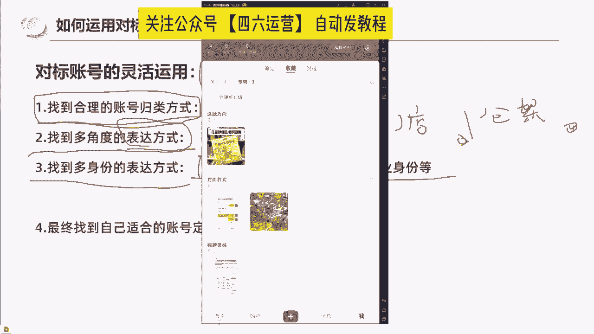

比如说我们通过手机端搜童装啊，我们可以看到。在用户端啊。我们可以看到第一个字账号。它是400篇笔记，23万粉丝，每篇大概增长了600笔记啊，这个地方我把这个屏幕给大家拉大一点。啊。

你可以看到这个这个账号的数据啊。怎么样还可以啊还可以啊。那么你发现没有？😡，他用了他的这个内容啊，有一个共性，我不知道大家发现没有。그。就是他的所有的内容。他的封面都加了一句话，叫富养女儿穿搭。

富养女儿穿搭。看到没有？好，那我问一下大家啊。😊，这些内容的展现形式是不是不一样的对吧？这个属于什么场景，这个属于我们来看一下什么场景啊，女儿的衣服别乱买了，这里都是整套搭配好的，喜欢就收藏关注吧。

不然刷着刷着就不见了。🎼这个属于室内，对不对？室内啊，模特啊混检室内模特混剪。🎼那么这个属于什么？女的服，看到没有他前面啊还加了一段字母，这个属于什么？室内没有模特啊。

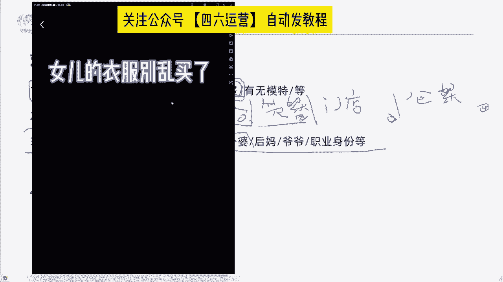

🎼合集室内没有模特合集。好，这是一个账号啊。那我想问一下大家，你们在看这个账号的过程中，你能你们能告诉我是有模特的数据好还是没模特的数据好吗？我带大家看一下这个账号啊。我们怎么去看账号，看一下大家啊。

就是要当我们去分析一个账号，我们就要看它数据高的内容。数据高的内容啊，像他这种账号，那就以以1000啊大几百为单位。这是我们看到的一篇啊1200点赞的内容，这是有模特的对吧？而且是亲子专。啊。

这里有篇4000的，这里有篇5000的。这个是什么？啊，也是有模特的啊，而且他的标题还很重复，孩子就是要在还小的时候尽情给他打扮啊。这里一句话，富养女儿穿搭。Yeah。好，这有一篇一000的，看到没有？

他也用了同样的一句话，孩子就要在还小的时候尽情给他打扮。接着看我们看上千的内容啊，这个也上签了。然后这个呢。就左边这个他是这个也是属于应该是模特没有出镜的。这个封面是没有出镜的。好，看到没有？哎。

这个地方看到没有？他是不是测试了一个什么情况，他测试了用虚拟卡通人物做封面，看到没有？所以我们的出镜方式，除了有人真人无人，还有什么，还有虚拟卡通。之前有人想到过虚拟卡通形象吗？是不是？

那你会发现说他做了尝试，只是他的尝试结果怎么样不好啊，1个16个点赞，1个20个点赞。那我们继续往后看啊，这两篇也是一样的，用的虚拟卡通人物100多点赞啊，7个点赞。所以从他这个数据啊。

我们可以看出来虚拟卡通人物至少他测试的结果啊是放弃了。那我们再看一下这边1000多点赞的又是属于什么？属于真人出境，对吧？真人出境。所以从目前这个账号的数据，我们能看出什么东西。

就是他尝试了虚拟人物出境，然后虚拟人物并没有拿到很好的数据，然后他一直在用富阳女儿穿搭这6个字做内容，以及什么？以及尝试着人物出镜和启能人物不出镜。那么根据数据比较好的笔记，我们可以发现啊。

像这篇4693个点赞，它也是人物出镜。所以我问一下大家是人物出镜的数据更好，出镜数据更好还是不出镜数据更好，出镜还是不出镜啊，把你们的答案打在评论区好吗？像这个1450个点赞啊，是这个小朋友啊。

穿着这个衣服？是出镜数据更好还是不出镜数据更好，出境还是不出境？啊，所以你们要通过分析对标账号去归类啊，归类找结果，找自己的一个内容方向。同样的我想告诉大家啊，其实这个人物它也是还有区分的。

有的人物他有素人感，有的人物是模特感啊，所以也是我们可以去区分的那这个账号我们看到这里，我们再看第二个账号。啊，这个账号是13。6万粉丝啊，他总共是我看一下多少篇内容啊。这个账号叫做童妈啊。

女装童装穿业店415篇笔记啊，13。6万粉丝。我们来看一下他的账号数据。Yeah。他也是一样的，他用了富阳女儿穿搭，看到没有？看到没有？大家这两家店啊，首先说到两家店，他们都把富阳女儿穿搭放在了首页。

我想问一下大家，这个是不是规律，是不是运营的规律，他们能做到十几二十万粉丝，他们每一篇都把富阳女儿穿搭打在封面上，是不是规律？是不是规律？那我想问一下大家。

你们知道富阳女儿穿搭这6个字打在这个封面上还有一个什么好处吗？她吸引什么人群？他信的是舍得为孩子花钱的人群。他是舍得为孩子花钱的人群，对不对？因为我是富养女儿，我不是穷养女儿。

所以他能吸引的就是舍得为孩子花钱的人群。我们可以看到他的内容。啊，我们现在也在往下刷啊，比如说我们可以看到说。4000多点赞的这一篇笔记啊。他是孩子出境啊。然后我们再往上看啊。

像这两篇它是属于大人出境啊，大人出境的数据就没有上签，我们再来看。这个2600点赞啊，这个目前从封面上看没有人物出镜，这个8000点赞的。看一下啊，这个是小朋友出镜，对不对？那你有没有发现一个点。

就是他们的这个所谓的小朋友的模特，其实他打扮出来，是有一种高级感和精致感的。我觉得这个穿搭已经是不是传统的那种小朋友的穿搭了。那么我们再看到右边这一篇1212点赞的，他也是大人出镜还是小孩出镜啊。

大人出镜的数据感还是小孩出镜更好，那我们可以看到啊这个1443最右边这个啊富养女儿穿搭啊，他也是富养女儿穿搭。那中间的亲子装啊数据没有更好。所以我们可以通过别人的数据。

通过他们最爆的内容去看到我们的内容方向是双人出镜还是儿子出儿童孩子出境还是母亲出镜。像这一篇6996969点赞的，又是小朋友出镜。啊，那我们。是不是还可以做一个归类啊？比如说现在的三篇笔记中。

这一篇它是属于一个户外场景，看到没有？它应该是在类似于一个大堂前台的地方，这样一个充电宝。那我们是不是还可以去进行数据分析，它究竟是在户外的表现数据好，还是室内的数据表较好。

就是我们是在一个随机的场景数据好，还是在一个K意的数据好啊，你像它也在尝试，看到没有？像右边这一个戴眼镜的这一个笔记，它是在户外的一个停车场的场景中。啊，看到没有？1619点赞啊。

它是在户外的一个场景中下雪啊，他这两篇笔记。你们不要看啊你们不要看这个笔记，只看数据，只看标题。这一篇458点赞的啊，爸爸给孩子穿衣服。和这个1619点赞的爸爸给孩子穿衣服。我想问一下大家。

爸爸给孩子穿衣服这个动作，爸爸被拍进去，他是有意的还是无意的。大家打在评论区是有意的还是无意的？我们再继续看一下啊。啊，包括这一个。啊，大家意识到没有？是有益的。因为在户外的环境中，爸爸给孩子穿衣服。

这张照片是比你在服装店里穿好站在那里像模特一样拍照是更有场景感和真实感的。所以这个运营，其实我觉得它是一流的运营。他能够捕捉到我刚刚所说的分类的场景的差异。那包括这一张。啊。

是小朋友也是在大胆走路的一个姿势。那我想问一下大家，这个是什么区别？这个是不是动态动态封面和静态封面的区别？因为这个人物是明显拿着手机往前走，他是没有那种刻意感的这是一个动态图。那我们再往往往往继续看。

看到没有？这个1403的这个中间的这个笔记，它是不是小朋友在等电梯的一个照片，他也是人往前走，所以这也是一个动态图动态图啊，包括像这两篇啊，看到没有？他又报了一篇数据很好的2700的，他是怎么报的。

他是妈妈。拿着衣服，妈妈拿着衣服，这个衣服没有挂在架子上啊，就是有一双女人的手拿着这件衣服，这是不是一种表达方式，是不是一个场景？有人物衔接的关系，在挑衣服的关系。那么他报了一篇2790的笔记之后。

他又继续拍了一篇，就是有人物在旁边准备取衣服的这个动态，所以所有的数据好的内容都是值得你去仔细分析的。他是什么样的场景，他是有人还是没有人啊，他配了什么样的道具，他出了手没有出手。

他是静态的还是动态的啊？大家我问一下大家有没有收获，今天有没有收获，有收获打个有好吗？有收获打个有啊，所以我带大家我们实实在在的去看别人的账号到底什么叫做对标。什么叫做对标。那我想问一下大家。

像这种啊像这种账号，我们都可以看到这种就属于什么无模特静态在服装店内拍的。我想问一下大家，他的数据好吗？他的数据好吗？知道为什么要找对标吗？知道为什么要找对标吗？啊，包括有人提到的合集。

合集就一定数据好吗？啊，所以实际上有人刚刚在评论区打了一条弹幕啊，就是。这个孝程啊是模仿这个童妈的啊。那实际上从运营水平来讲，童妈的这个账号的运营水平肯定是最高的。他确实有模仿的嫌疑。但是他模仿。

他只模仿了一个啥，他只模仿了一个标题啊，比如说我要富养女儿穿搭，他没有真正的去把童妈的一些所有的运营思路给理解，没有像童妈一样去做多个角度的尝试，他所有的场景基本上都是在服装店里拍摄的。

所以他有一种刻意感，而童妈她在干嘛，他一直在尝试，是不是跟我当时做我的账号一样，我不会因为说我的数据有400个点赞了啊，我就满意了，我把我的数据拉到上千点赞，我就满意了。不管怎么样，我们永远在尝试。

永远在对标。那这些账号，当他的数据不好的时候，我们是不是现在能发现原因呢？我想问一下大家，为什么这个账号的数据不好，你们能。

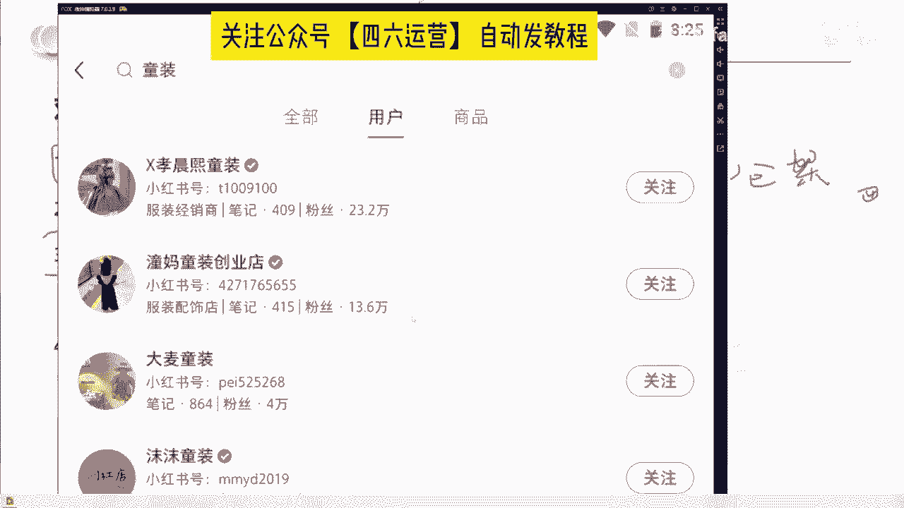

能告诉我原因吗？是真的是因为它的古装风大家不喜欢吗？啊，这个账号我觉得它的产品还是非常有特色的，非常有特色的啊，基本上都是属于这种。

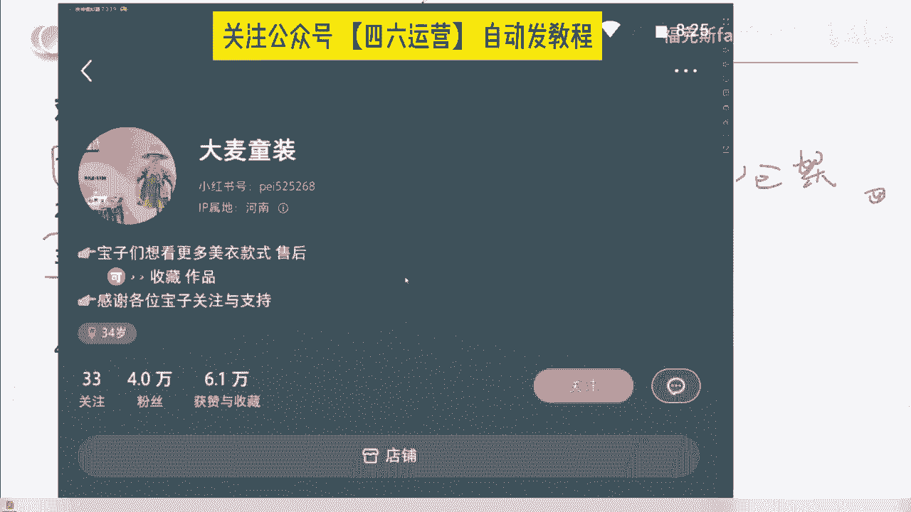

裙子啊。基本上它都是属于裙子。我想问一下大家。如果是你们这个账号是你们的，你们要怎么优化，现在脑子里有没有思路了，是不是这个人他是在把同样的一个事情啊做了几十遍，上百遍啊，就是把衣服挂在这里拍。

他是不是也会有困扰啊，为什么我的数据这么差呀？为什么我的点赞就3个4个呀啊，我可能运气好有30个点赞，看到没有？他好不容易运气好有一篇100个点赞了，啊他的下限是多少是5。

所以我刚刚前面给大家是不是讲过我们去找对标是提升账号的下限从什么从偶然性中找到必然性，明白吗？从偶然性中去找到必然性啊，我们再去续看一下。啊，像这种合计账号，对不对？那我想问一下他。😊。

这个合计账号他数据好吗？数据好吗？啊。我们看一下啊，目前还可以啊，到这一条还可以啊，四4个的合集啊，它的下线大概是上百站的样子。这个是山百赞啊山百赞。它是属于44张图拼图的数据。嗯。哎。

看到没有看到没有？这一条袜子，这一条袜子啊，它有4673个点赞，4673个点赞。在这一个场景中啊，左边的这个袜子，但是我想告诉你，这个商家的运营并没有很优秀，你们知道为什么吗？我想问一下大家。

当你有一篇笔记能够出现4673个点赞的数据的时候，你们会想到什么操作啊，你们会想到什么操作，能告诉我吗？为什么我说这个运营啊，它并没有很优秀，它绝对不算顶级S级的运营。我告诉大家结论啊。

为什么是因为他没有复制，你都知道这个角度有4673个点赞了。你为什么不把这个角度隔一段时间再发一次呢？对不对？而这篇笔记，如果我们是卖袜子的，我们刷到了。

我们是不是可以收藏到我们的专辑里面作为封面的专辑。因为它这一篇我们去分析的话，是封面吸引人还是标题吸引人？所以我告诉大家，我们找对标不是一个今天一天做完的动作。我们的对标和学习是一个持续的对坐。

所以这一张图片对卖袜子的账号来说是有绝对参考意义的。如果卖袜子的刷到这篇它一段时间内去复制，这个一定是可以把下线提到几百个点赞的。大家相信吗？好，那我们继续往下去看啊。😊，唉，又有意思了啊。

大家发现没有？这一篇笔记，最右边的这篇笔记，它有700多个点赞，它有700多个点赞，它是什么？它是把饰品挂到一起。我想问一下大家，这个袜子和这个饰品它有没有关联性？有没有关联性。

是不是属于我们把产品挂到一溜，用1个45度角去拍摄出很多的产品，是不是有关联性？所以这是不是一个共性，我们是不是发到了一个惯性共性？啊，包括他尝述的货架。哎，我们发现没有？

这又有一篇啊又有一篇500个点赞的。他是不是把这个视频放到这样的一个角度，对吧？陈列很多的情况下，是不是数据也挺好的。所以我们在分析别人的过程中，我们要找的什么？要找的是怎么样让数据好，然后可复制。

提升自己的一个内容下限。啊，那你像他啊，他也不是说没有做尝试。那看到没有？其实这一篇也是一样的，它也是一个袜子斜拍的角度，300多的点赞，他也做了尝试啊，比如说母亲拿着衣服拍啊。

宝宝在在这个篮子里面拍啊，是不是也是一种方式？啊，甚至货架。等等啊，所以这一个运营它的优点是什么呢？它会去尝试啊会去尝试，但是他趁热打铁啊和这个。趁势追击的这个运营思维啊稍微差了一些，差差了一些。

所以啊我告诉大家，为什么说最后啊我们是要干嘛？我们是要找到适合自己的账号和定位。为什么我们要找到适合自己的？因为不是所有的表现形式都适合你。比如说我们看到的目前数据最好的啊，她有一个可爱的女儿，对不对？

在外面去拍摄。那如果你的孩子还是一个半个月大的baby，对不对？或者是已经是一个读高中的。男孩子，你怎么去拍这样的内容？你是不是没有创作条件，对不对？那同样的有的内容它是属于拍照好看的。

有的内容它是视频创作出效果的那如果你没有视频，那是不是不适合你？所以我们要通过种种的归类方式和和这个角度的整理，去找到适合自己的账号定位和表达方式，能理解吧？最后你们是要找到自己的账号定位和表达方式。

所以最后啊我跟大家讲一下，有效对标和无效对标。因为你们在找的过程中呢，其实有可能会踩坑的啊。因为在我接触这么多商家的过程中，我发现了几个坑啊，第一个是什么？是他们找到一个。大几十万的粉丝的账号。

但是我们去看笔记的时候，就是他这一篇他这个账号可能。就是20万点赞啊，20万赞啊，5万的粉丝看这个数据很牛逼。但是你看他的笔记，你会发现他最近的20篇笔记可能就是5个点赞，10个点赞。

那这种账号它其实是运营过早的账号，它的积累是因为平台出去的红利，所以这种账号对你们来讲是没有对标价值的，所以我讲叫无效对标。那么第二个账号是啥？是粉丝量过大的账号，可能是平台选出来的案例账号。

大家知道今年啊今年小红书平台要做直播选出来的案例账号是谁吗？把谁打在把这个人的名字打在公屏上好吗？所以如果你要去对标你要尽可能跳出平台的一个案例账号。因为平台的案例账号是你没有对标意的。

平台会用各种流量和资源去警结，去帮它打起来。知道吧？第三个是啥？第三个是持续投放流量的账号，持续投放流量的账号。因为你们在刷的过程中也有一部分笔记，右下角是有赞助标签的那这种账号它能带来的流量。

不一定是自然流。而你如果是做自然流的情况下，这种账号对你来说没有建议。如果你是打付费流，那赞助数据高的笔记肯定是对你有借鉴意义的。因为它只有这个笔记出效果，它才会持续去投这个笔记，大家能理解吧？

第四个是啥是也是比较容易踩的一个坑啊，就是只有数据没有咨询的账号，就是在我们刚刚所看的这些账号里，其实我们可以通过他的评论区去看到有人有没有人在下面评论怎么买怎么买啊，在哪买多少钱，有这些评论。

意味着什么？意味观众和消费者有购买欲。如果没有意味着这个东西只是点赞收藏高。所以不要去。对标这种只有数据没有咨询的，以及什么，以及不要去对标近期数据不稳定的账号，为什么？我在抖音对不对？曾经有一个。

炫饶力师表的账号是不是很牛逼啊，导演叫小戴，是不是？枯燥无味的生活啊，那当他把运营换了之后，这个账号数据一下就下来了。所以如果一个账号他的数据不稳定，那么你要意识到他是不是可能更换了运营。

所以我们找对标啊，要先。把对标账号拎出来，再反问一下自己这个账号是有效对标还是无效对标，把无效对标的账号剔除掉，然后找到我们的一个规律。那有效对标有什么特征呢？第一个特征是什么？是半年内数据优秀的账号。

半年内数据优秀的账号。因为。他三年前就已经做了10万份了和3个月做1万份，那肯定是后者对你的借鉴价值更大。因为3年前的运营方法和涨粉方式可能更加的简单。啊，第二个是粉丝增长速度快的账好。

比如说你哪怕他现在只有1000个粉丝，但是你发现他总共才发了半个月一个星期，他7天15天就做到了。1000粉丝啊，这种也是属于有运营人才在做才能做出来的。第三个什么？是评论区咨询量大的账号。

因为如果你的目标是卖货卖货卖产品，那你就一定是要以评论区去判断他的咨询量怎么样，是否有消费动因。那么第四个什么？是我刚刚所说的数据下限高的账号。因为一个账号的运营是否优秀，我会看两个指标。

第一个指标就是他粉丝增长的速度，对吧？比如说他是通过500篇笔记去做到一万粉丝，还是通过100篇笔记，他就能做到1万粉丝啊，这里还记得我用了多少篇笔记吗？我用了29篇笔记做到1万粉丝。啊。

一个是这个水平的差异。第二个是看数据下限啊，有的账号5个点赞，10个点赞啊，500个啊，10个10个啊，50个。那有的账号它是300501000。啊，300500100。

那你肯定是要去关注这种数据下限高的账号，因为你去获得几千几万个点赞是需要运气的。但是你能够稳定的获得上00个点赞，这个是运营的实力在那里的，明白吧？所以再次给大家啊去讲一下所有自媒体平台的运营。

其实就是这12个字，找对标拆报款，多尝试，要坚持。那我今天跟大家详细讲的内容是什么？是如何找对标，对不对？我们怎么样找到有效的对标。

怎么样去通过对账号的一个分类方式去套到这个账号中去找到数据下限高的表达方式。那么面对你们后面还有什么还有拆报款，还有多尝试以及什么，以及要坚持，再牛逼的运营，啊，他牛逼也是需要尝试的。他不是把脑门一拍。

唉，我按这个方式排会报，我按那个方式排去报。不是的，越牛逼的运营，他越会尊重这个市场的一个客观规律。为什么？因为本身小红书每天就有大几十万的笔记，新的笔记投放到市场中。

本身这个事事情这个笔记它能获得上千的点赞，就已经是千里挑一的了，就相当于什么？就相当于什么？就相当于说小红书它是开卷考试，就像我啊我读书的时候，如果说你把我放在全年级第100名。

那我考试成绩就在200名以内，但是我最牛逼一次，我考了全年级第59名。你们知道坐在我旁边的是什嘛？是全年级第19名。其实就是这个逻辑，小红书是开卷考试，它的这一篇笔记已经在排名中拿到了好的排名。

你就要去研究它借鉴它。所以最后呢就是我们要说坚持啊再坚持。好，今天的分享就到这里，更多干货慢慢更新，有问题评论区见。😊。

