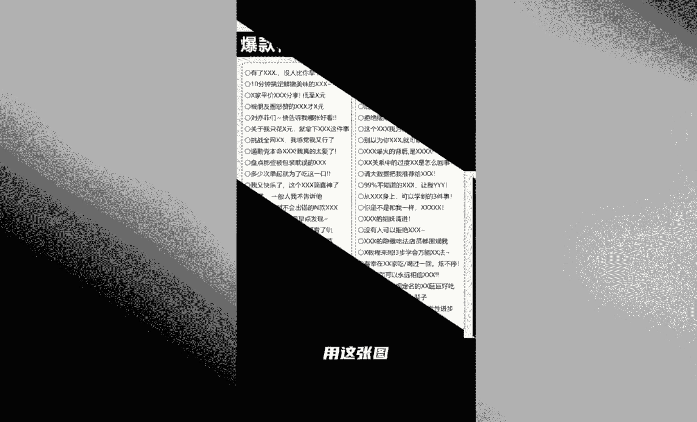
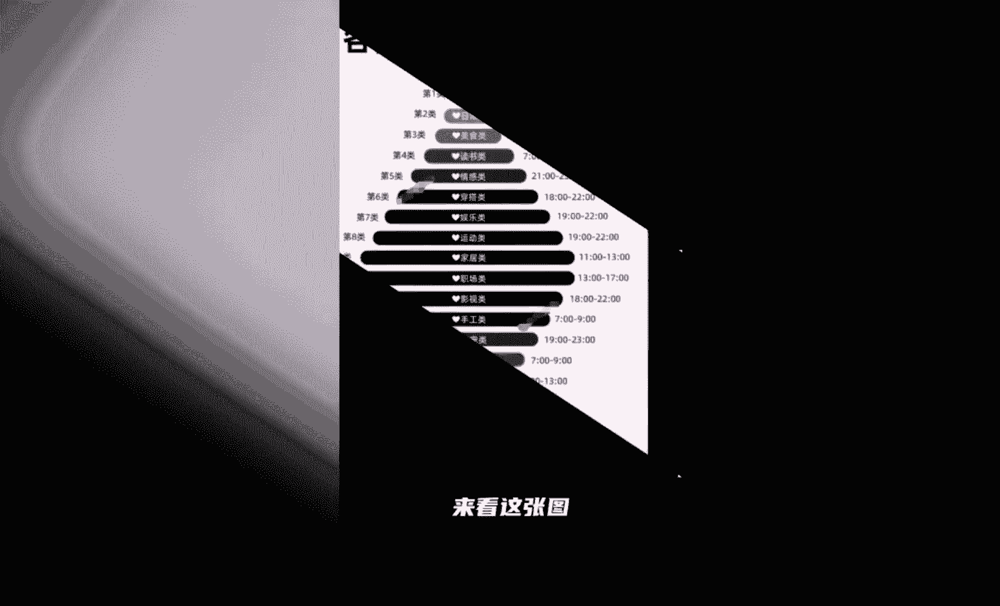
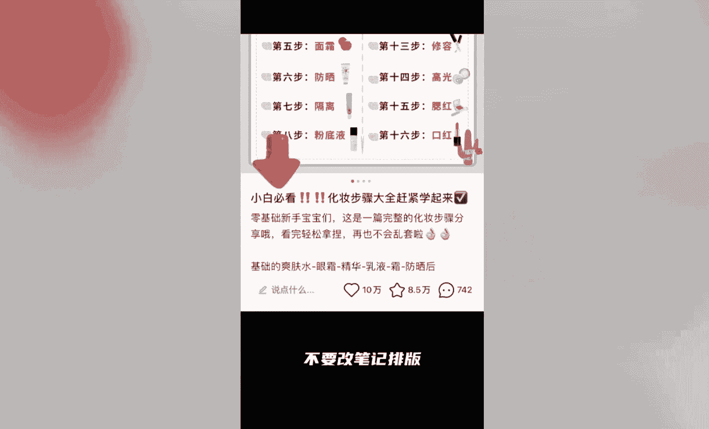
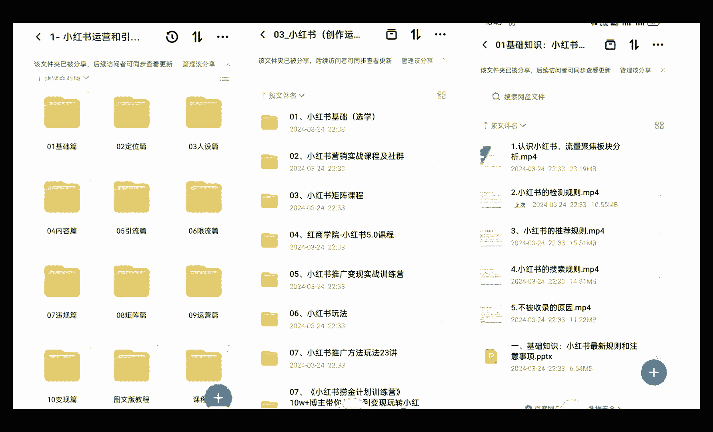

# 【全600集】强推！！2024（全新）最保姆级小红书运营自学教程，小红书起号到爆款店铺打造必学全套运营流程，新手开店必看！拿走不谢，允许白嫖！ - P1 - 红书运营 - BV1dtWGe1EPX

24年做小红书，先别发笔记，先别直播，先别去找对标账号，因为你做了也可能是白做，我是一名从事了4年小红书的操盘手，起号的第一条笔记就做到600万，播放30天涨粉5万。

今天这条视频我告诉你一个第三关的四部，干掉刚起号的99%以上的人，记得点赞收藏啊，第一部新手起号，先看这张图。

把小红书的推流机制搞明白，你就不会被割韭菜了，需要做人设的呢，看这张图。

一分钟就能够梳理出你的人设，第二步，发布作品的标签呢，用这张图爆款笔记必有的20个关键词标签。

新手喜好发布的时间来看这张图。

各行各业爆款笔记发布时间都有啊，不会做封面的呢，来看这张图，新手不会排版小红书笔记的。

看这张图一下你就明白了，第三步，如何快速打上标签。

跟跟别人发一模一样的笔记，别人有流量，你却没有，大概率是你的账号还没有打上标签，推流就会很不精准，两个方法打上你的账号，标签一关键词布局，找到你赛道相关的行业关键词，在内容里去布局封面标题，正文话题。

因为平台机器会识别你发的关键词去归类，怎么查看自己的账号标签，打开创作者中心数据中心粉丝数据，粉丝画像查看粉丝画像是不是你想要的，就可以判断你的标签是不是正确，第四步，人人都来家里找对标账号。

但是没有人教你正确的方法，来我教你，确定好赛道之后呢，找对标账号，打开首页搜索关键词，比如美妆，选择用户一栏，然后出现很多账号，你看谁的粉丝多，而且内容是你能够模仿的，对标哪个至少找十个对标账号。

半年内点赞，最多找到十个同行对标，切记找到优质的笔记呢，不要改笔记排版。

如果还搜索不到的话，这张图的四个方法拿去搜索吧，最后小红书今年的四大趋势，一视频流量大于图文流量，第二挂车笔记流量大于不挂车笔记流量，第三直播反向加权笔记流量，第四允许你在外打流，但你必须得交钱。

也就是一定要会用曙光，一定要会用聚光，最后偷偷告诉你，小红书最恶心的地方，充了钱不花，封了你的号，花少了也封你的号，你是做什么赛道的，把你的赛道打在评论区，我告诉你不同赛道小红书的起号方法。

另外呢给大家准备了小红书运营实操资料。

