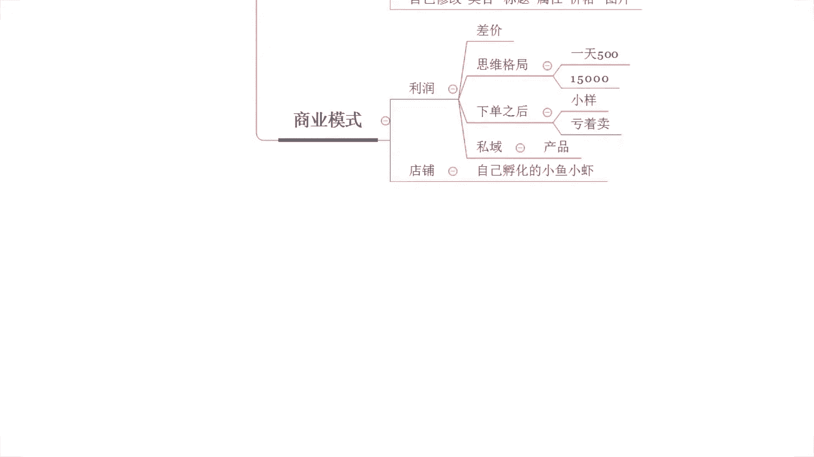

# 【全600集】强推！！2024（全新）最保姆级小红书运营自学教程，小红书起号到爆款店铺打造必学全套运营流程，新手开店必看！拿走不谢，允许白嫖！ - P73：8重加权提升排名 新品7天上首屏 - 红书运营 - BV1dtWGe1EPX

呃五金还能做吗，我的天潇洒，你这个问题问的我真的好尴尬呀，啊你为什么会有这样的疑问呢，你为什么会觉得五金不能做呢，那你告诉我一下来，你可以说一下你的想法啊，你那你既然说是有问了我这样的问题。

你肯定会觉得，五金可能在某些方面是不好做的啊，对不对，呃，你看啊，然后这个娱乐越说五金啊，这么暴力，为什么不能做，对不对啊，我跟你讲啊，这个潇洒啊，像五金里面的话，尤其像一些这个额很小的。

很不起眼的东西，你们可能平时听到的也会比较多一点，什么螺丝钉啊，螺帽这种东小东西啊，像这种小东西，哪怕你看着它很不起眼，但是呢实际上我们的买家在购买过程中，大部分的情况之下呢。

可能他都是一个啊大订单的一个操作的，所以说整个的成交金额的话其实蛮大的，客单价也蛮高的，利润空间是有的，好不好，一个可能赚个一分钱，甚至说五厘钱，但是他一批量购买的话，那个利润还是蛮可观的，知道吧。

然后杰哥说这个女装批发好不好做，OK的，女装是我们品类里面啊体量最大的一个平台，所以说这些品类的话肯定是没问题的啊。

我给你们看几个案例啊，来啊女装嘛，对不对，这个杰哥说女装来这个店铺有看到没有，有看到这个店铺没有做女装的啊，客单价还不低，80多客单价的一个一个女装啊，那么转化率的话不是很高啊。

女装的的话就差不多这个样子的，但这个转化率其实在女装里面也算高的啊，当然可能跟你们平时看到我其他的店铺，对不对，那么我带其他十套店铺呢，可能转化率都是十几，20几的一个一个转化率对吧。

但女装的话没那么高啊，但是这个转化率已经算不错了啊，80多克兰加6。3页转化率一天的话呃，最早呢访客是只有几千个，对不对，那做到现在呢一天访客是5万多。

一天的订单呢3400多单啊，这个做女装的啊，这是做女装的好不好，所以女装的话肯定OK的啊，这是最大的品类啊，呃然后这个呃li is is说，唉我有不少访客，但是呢却不成交啊，其实讲真的啊。

对于店铺操作来讲的话，像你们很多小伙伴也都会遇到这种问题。

哎我有访客不成交对吧，然后呢我就懵了，我不知道该该怎么做了啊，我不知道我该怎么做了，其实我讲真的啊，如果说你们真的是有遇到这种情况，你有访客不成交的话，你认真的去思考一下几个维度。

第一个维度你的访客精准吗，啊你的访客精准吗，好吧，这个问题你先问一下自己啊，你的价格没那么高低价呃，杰哥低价的女装销量会更好，市场会更大啊，我跟你这样说吧，所以说你不用去担心说市场问题。

我觉得如果说你真的是做低价的，这个女装的产品的话，啊啊如果你是想要去做好店铺的话，自己没有方法的话，OK的，那么今天可以认真听一听，如果没问题，完全可以跟着实操嘛，对不对，都可以的啊，呃虚拟类目怎么玩。

被封两个店了，虚拟内幕的话看产品吧，我不知道你具体什么产品啊，像做这个咳设计的呀，做这个呃软件下载的呀，带下载的呀，做这种带充值的呀，各种各样频率都有的，那么有玩法的啊。

呃其实虚拟内部的话可能更多的难度呢，就是这个规避操作风险，规避这个投诉啊，你可能就是这一块没有做到位，容易被人攻击，所以说会遇到一些麻烦一点，那这个东西没问题的啊，这方面没问题的。

如果说你只是这方面有问题的话，OK的这方面我有方法的好不好，不用担心啊，那额对于整个的这个没有有访客不成交，这个问题啊，我们接着来来说啊，我们接着来说额，那么刚刚这个LS也在说啊。

这个问题是你们每个人都会遇到的，我先说一下啊，我先说一下，等一下我回一下问题啊，有这个可能是小伙伴现在是店铺有点有点问题，需要解答一下，我先回复一下啊，OK呃那么这个额有访客没有成交这个问题。

刚刚我们是讲到说是这个是否精准访客，对不对，所以这个你需要注意一下，然后另外一个点的话啊，除了你的访客是否精准之外呢，就是说你需要干嘛呢，需要去针对到你的这个竞争对手进行分析。

你要搞清楚你是否具备啊价格竞争力，或者是你是否让我们的买家觉得你有性价比啊，产生这种有性价比的错觉啊，有性价比的错觉啊，咳好不好，能理解吧，这个LS啊，包括我们其他小伙伴。

这两个点能不能理解这两个点是重点啊，这两个这两个点重点你说什么视觉的优化呀，这个评价的一个设置啊，评价的一些这个引导啊，这都是次要的，重点的话这两个问题啊，重点在两个问题，如果质量问题没没毛病的话。

那基本上你要你的转化不可能说太低的啊，好不好，因为我这边的话很多小伙伴做垫铺呢，我都已经呃说实话算是轻车熟路了吧对吧，做了这么多年，我最早是这个08年开始做电商的啊，做到现在十多年，对不对。

相信一定可以看到啊。

来转化率16。21，看到没有，转化率16。21啊，像这个店铺可以看到转化率的话，22。07，对不对，所以转化这一块对于我来说，它不是什么太大的难度啊，拿捏这些用户才是我们需要去做的一个事，一个问题啊。

这个是做什么的，这个做什么的，跟我们其实说实话嗯，你们有很多小伙伴会关心说，哎哎希罗你你带时尚CPM做什么产品的呀，其实我讲真的啊，他们做什么产品对你来说其实并不重要啊，其实并不重要，为什么这样说呢。

别人做的好与坏，其实对你来说也并不重要，重要的是你自己会不会做，你自己能不能做好，这个才是最重要的，各位知道吧，所以这种你不用去过多关心啊，然后像这个店铺，我给你说一下，这个店铺做的是卡纸啊。

这个店铺做卡纸，然后这个店铺呢做的是护理垫啊，好像这个店铺来呃，20。13转化，你这个店铺做的是那个椰砖啊，椰砖啊，然后还有像这一个刚给你看的做女装的。

对不对，这这个店铺做女装的啊，转化率好高，是不是转化率高是有方法的，像你们转化率低肯定是有原因的啊，自己可以好好认真去诶听一听啊，去看一看你自己是不是哪里没做到位，好不好，OK时间已经到了啊。

来所有小伙伴目前的话已经在直播间了，我最后再确认一次，能够清楚的听到我声音的，能够看到我这边电脑桌面的声音方面没问题，小艺走一波啊，那我们就直接开始了啊，最后我再确认一下都没问题吧，对有没有问题的话。

公屏上小一动起来，我看一下啊，OK啊没问题，对不对，好，那么既然说没问题的话，那我们直接开干喽啊，然后呢呃这个我也顺便再再多说一句吧，因为我看了看到有这个迪斯来，小伙伴啊，我顺便再多说一句一次啊。

那呃我叫西楼，这个大家都知道对不对，那我这里呢我要重点强调的不是我是谁，也不是说我有多牛逼啊，不是这样子的，我要重点强调什么呢，各位你们自己在整个的提升过程中，一定要注意啊，区分一下啊。

这个到底这个人是什么样的一个人，有没有货啊，那我自己呢这里我要向大家说清楚啊，我不是培训机构，也不是代运营，所以说你们有什么问题呢，我们可以多交流沟通啊，但是有一点啊，各位注意了，我平时确实也挺忙的啊。

那么你们如果说是有问题可以找我，但是如果说我抽出时间来跟你进行沟通，交流的时候，对不对，你又那种爱搭不理那种的，那抱歉啊，后续你就不要指望说我天天找惹你了啊，对不对，这个我先说清楚啊，啊。

你就是你自己要有一个主动的一个提升自己的，一个一个一个一个这个样一个行为吧，算是啊对吧，不要说等着说别人求着你去赚钱，别人求着你去提升，那不太现实好不好，能理解吧，啊很多人就是那种很不自觉的。

自己呢跑过来之后呢，对不对，问几个问题，问完之后呢，呃又不去做啊，每次呢看到他店铺之后提醒他呢，他也他也不去提升，对不去改变，那这种情况我说实话就会让人很很反感啊，然后呢每次动不动来问问题。

这种我就不会不愿意回答的啊，我先说清楚啊，好不好啊，这个也是算是给他提个醒吧，啊OK啊，呃废话不多说了啊，直接开干吧，那么今天的一个内容呢刚刚也提到过，对不对，叫做拼多多八重加权提升排名。

然后新品旗舰上手屏啊，整个的操作呢有哪八重加权呢，我直接快速过一遍啊，那么这些内容呢其实在以往的分享过程中呢，或多或少都有提到过一些部分啊，可能没有那么的完整啊，但今天呢可能想要想要去给他更加完整的。

去把这个内容呢进行一个一个分享啊，那么首先呢针对到我们商品，对不对，我们想去做好产品的排名，那不可忽视的一个重要的一个点呢，就是我们的基础权重好不好，那么基础权重这个东西呢，我快速的把它逻辑给他说一遍。

只是什么呢，就是说我自己的产品我在上架之前对吧，我进行选品，选完品之后呢，我针对了这个产品啊进行一个标题的写作，然后进行一个产品的上架，进行图片的一个发布，对不对，那么这些所有的基础信息呢。

平台在上架之后呢，就会进行一个商品的考核啊，那么他考核的时候呢，如果说我的产品是一个优秀的产品，什么叫要叫优秀的产品呢，就是说我的属性是具备那些爆款属性的，我产品发布的时候呢，我的标题是原创的。

而且呢是具备覆盖到很多的，符合产品的热搜词的啊，同时呢，我产品的价格也是属于一个热销价格段啊，被我们买家喜爱的，那我的图片呢也是原创的，那么这种情况我就属于一个优秀产品。

那我就会得到一个相对比较多的基础权重，从而呢得到一个比较多的推荐曝光，各位这个逻辑没问题，能够听懂的话，扣一如果说是有不清楚的，需要详细的去分享一下的，那么也可以打一个呃问号啊，没关系，好不好。

动作快啊，这个地方呃先确认一次啊，这个应该是好理解的，对不对，那么这个是我们的推荐曝光啊，这是第一重加权算式啊，所以这个是我们必须要去做的一个事情，OK呃这个乐乐不知道啊，就就那乐月一个。

不知道是不是那乐月啊，你下播之后单独找我吧，我单独跟你说一下啊，都没关系的啊，那个因为我们直播的话，这个争分夺秒，我不想在直播里面浪费时间，好不好，没问题吧，那么呃针对到我们除了这个技术学生之外呢。

那么其中上架产品之后呢，平台就会进行我们产品的新品权重考核，啊这个就是第二重啊，这个就是第二重加权啊，那么新品权重是什么呢，新品权重就是平台会针对到我们商品的，产品的图片。

产品的标题来完成一个呃同款识别。

如果说我们的产品呢是没有同款的啊，或者是相似款也很少的。

那么这种情况呢，OK我们产品呢就是一个全新的新品，对不对哦，那么平台呢就会给到我们更多的推荐曝光，是这么来的啊，那么这个推荐曝光为什么要给我们，为什么会有个新品的推荐曝光，这里我也重点说一下。

其实早在20年的时候，兄弟们这个都不是什么新闻了，这是旧闻了啊，早在20年的时候，拼多多平台呢，就鼓励商家进行新品的开发跟发布啊，为什么呢，因为如果说平台上都是一些老链接，都是这些老款卖的好的话。

OK那么没有新品来进行迭代，我们的买家进来之后呢，他一直看到的都是一样的东西，OK会影响我们买家的体验，对于平台的发展也不利，所以说呢平台就会针对到新品来进行推荐，来扶持新品的曝光，扶持新品的提款。

来打造新的爆款，从而满足更好的用户体验，得到更好的市场占有率，各位这个是新品权重板块，对于新品权重板块的话啊，他的逻辑我讲完了，那么重点呢它考核的是我们的产品标题，产品的图片啊。

所以这两块呢我们要求是原创的啊，那么这些都没问题，公屏上扣个一啊，这是第二重啊，这是第二重，因为这个也是比较基础的点啊，所以我不想去过多的浪费时间啊，那么这个点没问题，扣一啊。

如果有疑问可以这个公屏上打个问号，或者是直接问啊，都可以的，然后如果说你在公屏上没有说啊，没有问你，下播之后你也不要找我，反正我这个人就很现实了，对不对，你自己都都是那种对吧啊，打个字都不愿意打的那种。

你说你跑过来问我问题干嘛呢，我也懒得搭理你，就这么简单啊，OK这个空白啊啊这个名字是空白的，我看一下啊，名字空白的这个哥们儿啊，名字空白，这个哥们儿，还有这个呃这个这个这个这个呃娱乐乐啊。

你们两个一样的，下播之后可以找我好不好，下播之后可以找我，因为就只只有目前的话给到我反馈的，就是你们两个人不清楚嘛，说一两个人这种情况的话，我们就不在直播间里浪费时间好不好。

我们要有把这个有限时间呢就啊做到更高效吧，算是好不好，没问题吧，没问题的话，公屏打个六好不好，这一个空格，还有我们的这个呃娱乐乐好不好，额，房比价吗，仿比价是基础啊，这个仿比价跟你新品权重没有关系啊。

仿比价跟你的新品权重没有关系啊，那么呃呃原创标题什么意思，不能复制对，不能复制别人的啊，不能复制别人的啊，我们需要自己去写啊，我们需要自己写，那你写的时候呢，你可以用到呃。

市场上的一些热词大师去做都是没问题的啊，所以这是我们第二个点啊，这是我们第二个点，然后呢在做的时候呢，这里我也顺便提一嘴吧，我建议大家呢在写标题过程中的话，啊，啊格式可以参照这个格式啊。

我我我我就简单提一嘴哈，那么什么格式呢，如果说你是有品牌的好不好，如果说你是有品牌的，那么你可以先把品牌值放前面，如果说你的品牌本身就没有什么知名度，也没有什么这个搜索量。

OK那么品牌词呢可以不用去写都可以的，然后呢一开始直接写我们产品的核心词，然后呢加上我们的属性值，加上我们的修饰词，再加上诶加上修饰词，再加上我们的营销词，再加上我们的冷门词就可以了。

啊那么这是这是这是格式啊，那么这些组合其中呢，可能冷门词你们不是很清楚是干嘛的，对冷门词呢你们可以坐上去之后呢，前期你们操作产品关键词权重的时候，通过冷门词组合其他关键词的方式啊。

去进行产品权重的一个打造，而这一词到底是啥，我的天呃，有多少人对这些词是什么意思不清楚的，那核心词是什么，属性词是什么，修饰词是什么，你分不清楚啊，营销支持什么，能不支持什么，是干嘛的。

你也不知道有多少人不知道的，不知道打个一啊，不知道打个一我，我如果说都不知道，我讲一下，如果说知道啊，那就直接跳过，OKOK啊，还不少啊，还不少，那那这样的话我就不单独去下播之后再说了吧。

因为单独下播之后再说的话，我肯定会比较忙不过来哈，你们这个人也太多了啊，这样子我说一下啊，首先核心词啊，首先核心词各位听清楚了，核心词呢就是我们产品的组词，核心词啊就是我们产品的主词。

那么所谓的组词呢就是我们产品的名称啊，名称什么意思呢，我举个例子，今天我做的这个产品呢是电脑啊，打个比方，我做的产品呢是电脑，那么电脑，就是我的产品的组织，也就是我产品的核心值啊。

当然你说哎我把电脑再进行细分啊，他有这个台式电脑对吧，有笔记本电脑，OK也可以啊，那么你细分之后呢，他仍然是我产品的主词，仍然是我产品的核心词啊，用烤箱举例，这个用什么什么举例都一样啊。

那今天你说你烤箱对不对，一样的道理啊，那我这里不是有烤箱吗，对吧，那烤箱就是我的核心词啊，就是我的主词啊，对不对，是不是能理解吧，当然啊还有一个点需要注意的就是什么呢，可能有的产品它不止一个主持啊。

有些产品，不止一个主持，啊有些产品它不止一个主持，什么意思呢，各位呃，我问一下，一个非常非常常用的啊，应该就是类跟内幕没关系，这个这个不等于类目啊，兄弟这个不等于内内不等于类目啊，这个不等于类目啊。

这个不叫不叫内幕啊，主词就是主词，就是你产品的名称，比如说我卖服装的，那服装是不是内幕啊，但服装不是我的主持啊，懂不懂，那服装里面我是棉衣，我就是棉衣啊，我是这个羽绒服，我就是羽绒服啊。

那这个就是我的主词，懂不懂，我是风衣，那么风衣就是我的主持，但是有的时候有些产品它不止一个主持，这个是我们需要去重点留意的一个概念，什么意思呢，各位听清楚了啊，那我举一个非常常用的产品啊，洗发水好吧。

洗发水，洗发水这个产品呢有的地方呢它叫做洗发水，对不对，没错吧，有的地方呢它叫做洗头膏，是不是有没有有没有，或者你们还有别的别的别的这个叫法的，别的名称呢，有没有可以说一下啊，可以说一下，有是吧。

OK有就行啊，有就行，那么这种情况的话啊，那我们需要结合到我产品的实际情况啊，去选择使用到不同的组词，或者是我把不同组词呢，都去应用到我的标题里面去，好不好，这是我们要做的事情，然后属性值是怎么来的呢。

那么它就是我们产品本身的属性，比如说今天这个叶子不是做烤箱的吗，对吧，属性池，那么叶子的这个烤箱它的容量多少，就是我的属性，对不对，它的功率多少啊，就是我的属性对吧，没错吧。

是不是啊啊比如修饰词呢什么意思呢，呃等下功率啊，功率打打打错字了啊，功率啊，那么修饰词什么意思呢，修饰词比如说，我的风格是简约简约的啊，简约对吧，简约啊，我是这个这个这个极简风对吧啊。

或者是我是其他的一些各种各样的一些，这种对产品进行描述的这种呃智能啊，智能是你也是你的这个属性嘛，智能也是你的属性嘛，对不对，这个智能不是这个修饰啊，智能不是修饰啊，这能是属性啊，这种是属性啊。

那这些都是我的产品的一个属性词，我在进行产品的表达式，我都可以把它运用起来啊，然后呢呃营销值呢，就是比如说这个就很简单了啊，营销值，那我们产品的一些这个营销的一些内容啊，比如说我们这个，包邮啊包邮啊。

打个比方啊，包邮哎，买一送一啊，买一送一，啊，或者其他的这些一些对于营销的一些这个，属属性的一些描述的一个关键词啊，新款新款啊，对新款它也其实也属于营销词啊，新款也属于营销词。

或者是它也可以归纳为修饰词，都可以的啊，都可以的啊，而冷门词是什么呢，冷门词是这个词啊，冷门词是什么，这个词几乎没有人用啊，没有人说没有人用，没有人用啊，也没有人搜啊，也没有人搜。

那么这个时候呢这个词用的人很少，收的人也很少，OK如果说今天我用了这一个词，那我一开始用到，如果说是大词组词加属性词加修饰词，这种关键词对不对，所有人都在使用它，那么我们去操作产品的搜索的话。

可能找不到我的产品，对不对，但是呢加上冷门词之后呢，我去搜索的时候呢，可以帮助我产品完成抓取来，兄弟们能不能懂，能够懂的话，公屏扣一啊，能够懂的话，公屏扣一，啊能够懂的话，公屏扣一，OK啊能懂是吧。

能懂就行啊，能懂就行，其实对于店铺操作来讲啊，网红同款夏季新款女装秀，这样的怎么看什么看什么看什么，这样的怎么看看什么，你想你想说看什么，是要看什么呀，啊结果啊看词啊，来各位。

我们把这个这个这个这个拿出来说一说吧，好不好，来刚刚这个公屏上说的这个网红啊，啊我我打一下字吧，啊我打下字啊，网红同款夏季新款女装啊，我我不知道为什么后面是一个袖啊，我不知道为什么后面是一个秀啊。

这个这个这个这个是啥东西啊，是就是就是这个袖子嘛，他就是一个还是啥，来各位这个这一个这一段啊，大家看一下，我们把它拆分一下吧，好不好，我们把它拆分一下吧，网红大家觉得是什么词啊，网红大家觉得是什么词啊。

少了个短袖吧，短袖是吧，女装短袖是吧啊短袖啊，我刚没注意啊，可能是我女装短袖啊，OK咳来网红什么词啊，网红什么词，网红什么事啊，修饰词，OK啊网红修饰词啊，同款呢同款呢，其实严格意义上来说。

网红同款是一个词对，但但他们两个是同一个词呃，同这个同一个词，但是他是一个一个词根来的啊，啊两个词根来的啊，修饰啊修饰夏季呢夏季属于什么词，夏季属于什么职，属性OK新款刚刚有提到过的啊。

新款刚刚有提到过的，属于什么词啊，修饰其实新款它可以判定是修饰，也可以判定是营销，也可以判定是属性值都可以的啊，他其实他其实这个磁性还比较中立的啊，好不好，比较中立的啊，这个磁性比较中立的，女装什么词。

女装什么词，核心词吗，认真思考一下，它是核心词吗，其实女装啊它是属于属性值，对啊，短袖才是核心词，没错啊没错，所以这个是，这个是你们要去要去了解的一个事情啊，啊好不好，这是给你讲解一个事情啊。

OK啊额那我们继续往下好吧，这个这个东西搞清楚之后，我们继续往下啊，你们自己做的时候呢，尽可能这样去做啊，尽可能这样去做，那么你一开始比如说像比如说举个，我举个例子吧，这一个这一个打个比方啊。

它是我们的标题啊，我我们现在举个例子打个比方，这一个是我们的标题，那么这里面的所有的词呢，实际上我们的同行他可能都在用这个，大家同意吗，如果同意，扣一这些词都是我们非常常见的一些关键词，对不对对吧。

那我们的同行都在用，这个时候我只用到这一个词，我去做我的产品，大概率可能是搜不到我产品的，为什么搜不到呢，因为我们搜索出来之后呢，展现出来的产品呢都是那些有销量的，卖的好的产品。

我们产品作为一个新品的话，你没有任何数据，你可能没有展现的，所以这种情况之下呢，我们的排名可能会比较靠后，于是乎呢在这个时候呢，我们要做一个冷门词，而这个冷门词呢是没有别人在用的。

那么这个词没有别人在用的情况之下呢，有人去搜，然后我们再用，那抓取到我们产品的概率就会提高，我们就能够去在我们的靠前位置得到曝光，能够能够听懂吧，啊我我我随便举个例子吧，啊我随便举个例子呃。

我们我们就写一个写一个这个编号啊，打个比方打个比方，我写了一个编号，这个编号呢，我们可以理解为是我自己产品的货号都行的，这个是我自己随便写的，啊假如说我们随便写了一个这么个东西。

这样的一个东西呢是没有人收的，对不对，也没有人用的啊，这个只是我举个例子啊，我们可以写一些其他的修饰词都可以的，无所谓啊，只要是符合你产品的都都可以，那么这个时候原本收前面这一部分的词，的时候呢。

我们产品是不可能得到曝光的，对不对，因为我们产品呢在跟同行竞争的时候呢，我们竞争不过人家，但是因为加入了后面这个部分，那这个时候呢其他人都没有用，它只有我在用，于是乎呢我就可以得到一个很好的展示。

各位能懂扣一，这个部分能够听懂，扣1OK啊，能听懂是不是好，那就行啊，那就行，哎哎我又看到一个一个这个熟人啊，我又看到一个熟人，杰瑞接着来呃，可是后面的人不会有有人说，等一会我说的啊。

等会我我跟你说为什么啊，好吧呃，杰瑞来，我有看到你啊，有看到你刚刚讲的这个能听懂吗，刚刚讲的这个能听懂吧，JERRY本身杰瑞也是说想跟着实操的，对不对，那也是有想去好好把这个电路做好的对吧。

刚好有看到你这边啊，刚刚讲这个没问题吧，能听懂吧，嗯不在吗啊开小差去了啊，被我逮到了啊，等一会说没听到，不知道我，那我就不不鸟你了啊，然后呃刚刚有人在说，哎那这个后面这个词也不会有人搜啊对吧。

这个问题很关键啊，我跟你们讲啊，这个不是给真实用户收的，至少在前期不是懂吗，至少在前期不是在前期的时候，这个东西肯定是给我自己收的，那我们自己通过这样的词去操作呢，让整个这一个啊词去获取到产出。

获取到数据，那么让我们的每一个词根呢能够去累积权重，到后面呢，我们上面有数据之后，人家收这个大词的时候呢，哎我们的产品也可以得到正常曝光，这个是我们的一个一个目的，能够听懂扣一啊，能够听懂扣一啊。

没问题吧，这个这个这个R1，R1能听懂吗，懂了是吧，OK懂了就行啊，懂了就行，OK啊那我们继续往下啊，那做这个过程中呢是我们的新品传统啊，啊以为叫你是吧啊哈好，下次我下次我尽量的啊。

尽量的读读你们完整名字啊，下次我尽量读你们完整名字，完整名字啊，嘶这个字REASON啊，是reaction是吧，是这样读的吧，啊我英文有点差啊，我英文有点差好不好，是叫racing是吧，来啊。

Reason，我记得是是好像是原音，是不是这是原音吧，是不是啊。

是不是啊，是不是是不是不是原因啊，我我印象里面好像是啊，呃那就那就那就没错了，看来看来我还可以啊。

这个虽然说很多年没碰过了啊，看来还可以啊，对不对，OK你们看啊，在我这里，你还不能不仅能够有有运营知识的积累，还能学英文，我的天呐对吧，完美啊哈OK啊，接着啊，刚刚讲的是这个新品权重啊。

刚刚讲的是这个新品权重啊，那现在我们来说一说这个呃，另外一个东西叫做机会商品啊，叫做机会商品，那这个呢我就不用说了吧，应该大家都知道，对不对，应该大家都知道吧，是不是基本人品都知道吧。

有没有人不知道的来，有不知道的打问号，知道的打个六好不好，有不知道的打问号啊，知道的打个六，不知道你们真的假的呀，你们真的假的，这几位人品不知道，你们真的让我让我大吃一惊啊。

OK啊blue还有这一个汤圆啊，是这个是汤圆吗，一个小碗啊，我这边看到这个这个头像，这个图这个名字图标啊是一个小碗，里面有个勺子啊，好像舀了一碗汤圆一样的啊，嗯机位上面我记得好像上了没什么权重吧。

啊后来那个推荐的啊，OKOKOK啊，那这样子这样子我看你们很多人都有些问题啊，啊我我我给你们，我给你们把这个啊，我给你们把这个我给你们把这个啊说一下啊，我们我给你们把这个说一下啊，是这样子的。

机柜商品对我们店铺肯定是有帮助的，他也是肯定是有权重的，这个在平台是有明文规定的，那这个在平台是有明文规定的，这个我先说一下啊，没有你们想的说是那种哎他没有用啊，或者怎么样的，不是的，肯定有用的啊。

那机位商品呢本身是平台通过系统判定啊，通过系统判定啊，能够具备更高转化率，有着很好的市场需求的产品啊，而且呢竞争会比较小，这是平台判定的，那么如果说我们发布的商品，能够去得到技术商品达标的话。

那么OK你在同等的权重情况之下，注意了啊，同等条件你肯定是，权重更高的，什么意思呢，我举个例子啊，我举个例子，今天我的产品有机会商品标，你的产品没有，对不对，我们两个产品呢都是新上架的产品，都是新品。

那么OK在展示的时候，我在推荐机制上会优先展示，包括说我们在后期，对不对，我们都有这个产品销量的销量比都差不多，没有什么太高的或者太大的数据差距，那么我永远是压着你一头的，就因为我比你多了一个精神品标。

因为机位商品标平台判定它是更容易转化，于是乎呢他有优先曝光权，能懂吧能懂吧，就是这么就这么简单啊，那么这个呢在我们后台里面，你们可以看到发布商品呢，是有到一个机会商品的发布通道的，对不对。

我们发布上面的时候，通过这个渠道去发布就可以了，但是发布的时候不是说，我一定是要跟这个机会商品里面的产品是同款，是相似款才可以，不是的，我只要通过这个渠道去发布就可以了，我选择一个竞争对手。

选择一个我目标商品之后，我点击发布同款，对不对，我发布之后呢，可以自己去修改类目，可以自己去修改标题，修改属性，修改价格啊，修改图片通通都能改，但是呢这些东西呢要严格的去做到原创啊。

然后呢属性呢一定是要符合市场热搜，热市场热销的啊，有的很好的市场占有率的这样的，不然的话你可能说没有什么太大感觉，就这样子的好吧，这个是我们要确实做的事情，那么价格方面的话也是我要符合我们市场需求。

不要说那种价格特别离谱的啊，特别低或者特别高对吧，没有意义，一定是符合市场需求的这个热销价格段，那么我们才有到更好的展示机会啊，来能够理解吗，能够理解吧，那么如果说机位商品的一个概念不懂的，这个不重要。

重要的是你要知道一个事情，在我们商家管理后台，我们直接通过这个端口去发布就可以了，对啊对没错啊，啊空白空白，我想问一下啊，你为什么会觉得没什么利润呢，你为什么会这样觉得呢。

你为什么会觉得会会服装没什么利润呢，对啊好累啊，我真的好累啊，你们你们要把我玩疯了啊，这个这个跟你跟你没有利，跟你有没有利润有什么关系啊，嗯空白你可以说一下啊，你可以算你的想法啊，哎兄弟兄嘚啊。

价格不高就没有利润率啊，然后呢你就觉得没利润对吧，嗯有道理，那我那我这样跟你说吧，好不好，呃，这样子啊，这样子我我现在呢我我先不往后面讲了，我先不往后面讲了，呃，我我现在呢我先把呃。

我先把这个我给大家讲一个，讲一个特别的概念吧，好不好，我今天呢这个内容呃。

因为我们讲有这个八重加群嘛，现在其实今天的节奏有点慢啊。

我说实话，因为今天我以为这些很基础的东西，你们应该就不用我讲的，可以直接过的啊，我实话实说啊，好不好，我实话实说，我以为这些东西呢是不用我去讲的。

但是今因为讲了一下，浪费点时间，所以八重加群呢肯定是讲不完的，肯定讲不完了啊，后面还有五个，今天肯定讲不完，因为我时间有限，我确实有限的啊，那呃刚好呢你们有问到这个问题，说利润这个问题。

然后呢也有很多小伙伴会觉得哎这个额，那我肯定要做到有利润，或者有小伙伴说有利润能出单就烧香了啊，啊会觉觉得这个利润这个东西很很很难搞，那我现在呢我们先先不着急，把这个八重加群讲完。

后面呢如果说今天我们时间有的情况之下，我多讲一点，如果时间不够的情况下呢，我们到时候呃另外安排时间，我再把这个东西补充完整好不好，那我先把这个利润给大家讲清楚，可以吧，我先把这个利润给他讲清楚吧。

让大家知道做店铺呢，其实利润它的一个获取是有很多方面的啊，利润的获取是有很多方面的啊，可以吧，来觉得可以的，没问题，公屏打六，因为你们肯定每个人都会想着说我做店铺，感觉做拼多多没什么利润。

或者拼多多利润很少对吧，你们肯定都有这种想法嘛，这个这个东西其实很正常，OK啊OKOKOKOKOK啊，那既然说这样子的话。

那我们直接开整吧，啊我直接开整啊，利润这个东西给你们来点，你们可能平时呢是听不到的一些东西啊，这个是商业模式的问题吧，这个这个这个如果说严格意义上来讲，应该属于经济学跟这个呃，企业管理学里面的东西啊。

严格意义上来讲，它其实不单纯是属于我们电商运营了啊，在很多方面来讲的话，是这样子的，它可以是很宏观的东西，也可以是很微观的东西啊，那我们来讲讲这个东西啊，利润，好吧，利润啊，各位你们。

你们认为的利润是什么，来我我想问一下你们认为的利润是什么，优惠券算在店铺的到账金额是吗，如果是平台券的话，会如果是店铺券的话，不会啊，如果是平台券的话，那么这个平台券的一个金额呢。

会结算到你的店铺的一个到账金额里面去，如果是你的店铺券，不会的啊，来各位利润，你们觉得利润是什么，嗯你们可以说说你们认为的利润是什么，你们可以说一下，来兄弟们，实收减成本。

OK那我我我用一个词来来总结一下吧，差价，可以这样理解吧，可以这样理解吧，啊按照你们刚讲的哎，实收减去成本是不是就差价呀，各位你们你们觉得是这样子的，公屏上打个一好吗。

你们认为的利润就是这个东西的公屏打个一，你们认为的利润就是这个东西的话，公屏打个1OK啊，行行行行行啊啊都没毛病吧，好哎怎么还溜起来了啊，可以了可以了可以了行吧行吧，既然说你们都溜起来的话。

那我也给你们来点狠的吧，来我给大家看一个店铺吧，这个店铺是去年的跟着我实操的一个店铺啊，这个店铺是去年跟着我实操的店铺，我我给你们找一下，等一下啊，因为时间比较久了，我不确定好不好找啊，等一下啊。

稍微等我一下，我来看一下这个店铺啊，这个店铺呢是去年的啊，去年的跟着我实操的一个一个哥们啊，嗯他当时呢哎我等下哎，这店铺呢，啊实收减成本减服务费哦，OK不管你是怎么减吧，反正就是差价嘛对吧，就差价嘛。

哎呦这个太久了，这个店铺有点多啊，跟着实操的小伙伴，店铺有点多啊，这个这一下还不太好找啊，一下子还找不到啊，OK找到了啊，找到了来兄弟们这个店铺啊，去年跟着我实操的，去年跟了我10号的一个店铺啊。

那么各位我告诉大家一个事情啊，我告诉大家一个事情啊，听清楚了啊，我告诉大家一个事情，这个店铺啊，这个店铺听清楚了啊，听清楚了，你们看到他的客单价多少钱，12块四毛八，对不对，有看到没有，有看到没有。

他的客单价12块四毛八，有看到没有，有看到扣一，有看到扣一，也都看到了，都看到了，对不对，OK这个店铺啊客单价12块四毛八呃，当时这个店起来一天卖2700单的时候呢，是12月14号，到年前啊。

一共也就两个多月三个月时间啊，啊到年前一共也就两个多月三个月时间，各位我跟大家说一下啊，他挣了300多个，而他店铺里面啊，我说一下这个产品的话啊，12块四毛八这个产品对不对，进价15块钱，进价15块钱。

他最终销售出去的客单价是12块四毛八，而他在年呃这个过年前也就两三个月时间，平均一个月赚了100个，不是店铺赚的啊，不是店铺赚的店铺啊，店铺没有带来那么多收益，对不对，店铺带来的是什么，带来的是流量啊。

店铺带的是流量啊，这能挣钱对吧，你们是不是不相信不相信是吧啊不相信是吧，跟批发没关系，所以说你们做事情眼光还是太短浅了，知道吧，我我说实话啊，你们做电商啊，你们的思维格局要大，懂吗。

你们做电商市场格局要大，如果说你只盯着这点差价，你能干多少事，你能赚多少钱，你如果说只想着说我就赚点差价的话，OK那你这辈子都干不到的，我说实话啊，这哥们玩资本的跟资本不资本没关系。

他这能体谅他能玩啥资本呢，我跟大家说一下啊，他也是赚钱，他也是卖东西，他也是卖货，但是他最终玩的是流量，你知道吧，12块四毛八是它的均价啊，他后期成交的一个均价，店铺起来的一个均价。

每天在他店铺里面下单的人啊，差不多，当时你们可以看一下，对不对，这个时候是12月14号的时候嘛，对不对，12月14号的时候啊，10月14号的时候，对不对，一天2000多单啊，一天2000多单，看到没有。

一天2000多单，2000多单是什么人，2000多人是在他店铺里面下单的人，兄弟们看到没有，一天呐2000多个人啊，一天2000多个人，各位那我想问大家，如果说一天我就不说多了吧。

一天如果说我们算500个人吧，一天500个人好不好啊，我们是不说多了，一天500个人，那么一个月下来多少个人嗯，一个月下来多少个人，啊有人有人会算吗，啊好1万5对吧，OK15000啊。

1万53个月下来多少钱啊，三个月下来4万5对吧，是不是4万5啊，OK那么如果说我们只是去卖这么点价钱的产品，去赚差价的话，我就算你一单赚一块钱吧，就了不起啊，我错了，说一单赚两块钱吧，了不起啊，对不对。

你能赚多少钱，没多少钱的对吧，没多少钱的，我就算你一单赚两块钱啊，按照一天500个对吧，按照按照一天500单纯利的这个两块钱的话，我可一个月也就赚个1万5嘛，啊一个一个月就赚3万啊。

一个月赚3万赚3万啊，说错了啊，说错了对不对，有什么搞头，没有任何意义啊，没有任何意义，那怎么搞的呢，哥们儿兄弟们听清楚了呃，这哥们呢最终玩的是什么呢，店铺端口啊，对他这是亏的啊。

他这个金额在这个店铺里面能看是亏的，但是呢这些人下单之后啊，下单之后他可以进行私域的沉淀，知道吧，他可以进行私域沉淀，这个店铺做的是我，我跟他讲吧，这个店铺做的是化妆品，这个店铺做的是化妆品啊。

这个店铺做的是化妆品，他店铺卖的就是小样，啊他另卖的就是小样，知道吧，他定位半就是小样啊，然后卖小样，他小样是亏着卖的，亏着卖，你总没人打得过他吧，啊quest man，总没人跟他干吧，谁能干得过他。

是不是谁能怪他干的过他啊，完了之后，这些客户买小样啊，通过积累之后啊，沉淀到私域，他再去卖他的什么产品，啊再去买他的产品，三个月啊，纯赚了300多个，啊如果说你不知道怎么加，那就是你的自己的问题了。

人家有方法呀，对不对，这空格讲的人家是赌徒吗，人家能赌吗，那你能赌吗，你敢这么赌吗，你敢的话，OK的可以跟着来方法，我这里大把的，对不对，对不对啊，那这是第一个啊，这是第一个啊，这才是做生意。

是不是这才做生意，所以说你们很多时候你们自己的思维太局限了，你，所以你做不起来啊，你就盯着你那个蝇头小利对吧，有人退款之后，你就哭爹喊娘的，哎呀妈的又来请退款了，是不是都是隐藏号，喂兄弟。

你觉得是让你自己去加吗，一天2000个，你去加一个试试看啊，这个叶子叶子加点优品，一天2000个人，你你去加吗，你加个试试看，是不是，所以说你们是不是要打开啊，啊怎么跟你做哦，这个不着急啊，这不着急。

想不想再来点更干的，想不想再来点更干的，想不想再来点更干的，啊想是吧，OK我再给你们分享另外一个啊，我再给你们分享另外一个啊，好不好啊，你们所说的这些方法都low到爆啊，我只能这样说啊，我我只能这样说。

你们这思维思维格局太小了，只能这样讲啊，来啊咳不是不是不是，你觉得你们能想到的方式真的那么好的话，你觉得为什么你自己做不好呢，对不对，小卡片这种方式太低级了，我只能这样说啊，你们这个是不是要打开啊。

打开好open啊，那么来啊，我再给你们说另外一个店铺啊，好不好，那么这个店铺也是啊，这个店铺是去年的上半年更的时候，我就不去找案例了啊，我就不去不去找图片了，这太慢了啊，我们在讲方法吧。

啊我要说一下这个地方做什么的啊，这个店铺呢做的产品呢是那种啊，这个店铺呢做的产品呢是孵化的那种，就是自己买回去之后，他是一包泥土，然后孵化出来一些小鱼小虾，可以自己养的那个。

我不知道你们有没有玩过这种东西啊，自己孵化的小鱼小虾，有没有玩过这种就是自己趋向于什么这个东西，它也它也不属于说是水产类的啊，他其实属于玩具类的啊，我不知道你们有没有玩过这种的，有有没有人见过。

或者有没有人玩过的呀，啊如果说都没见过都没玩过的，我就我我就给你们搜出来给你们看一下啊，好不好，OK没有是吧，还有小鸡小鸡小，这这根本没有没有做小鸡啊，我我给你们搜一下看一下啊，我给你们说一下。

你们看一下啊，哎呦你们这些人真的是。

所以说很多时候就是增长自己的见闻啊。

也是一种很好的提高，对不对，像你们自己可能有很多时候闭门造车。

做店铺做不好呢也是有有原因的，对不对啊，你平时多看看，多听听对吧，多找一找这些别人为什么成功的对吧，多去有一些这样的经历或者经验啊，去给到你分享一下，我觉得对你来说也是有帮助的对吧，各位。

呃还有卖无花果树苗，就其其实就是，但是实际上不能自己养活，无花果，自己可以养活的呀，无花果插插那个枝丫就能直接长的，这个我知道的，我们家自己家就有无花果啊，我们家自己家就有无花果的啊。

这个我是知道的啊，来啊来呃。

等一下啊，因为我说的这个词可能不是很精准啊。

我说的这个词可能不是很精准啊，啊等一下我重新搜一下啊，这个这个词好像有点不太对啊，啊没有没有没有，也就面积稍稍微大一点点啊，也就稍微面积大那么一点点啊，啊说所以说一个人无法对对，这个就是这样子的。

这就是这样子的啊，你们很多时候其实没没有，赚到钱就赚钱的核心逻辑其实就是信息差，你知道吧，也就大一点点是多少，这个就不说了啊，这个免得你们说我炫耀啊，咳，哎哎完蛋，我还我还一下子真找不到啊。

我我这样说吧，我是我这样说，看一下能不能能不能收到啊，嘶，主要是我一下忘了这个产品的词是什么了，哎呀，算了算了算了，我也搜不到啊，我也搜不到啊，啊对对对，这个这个这个这个这个这个啊这个啊。

就就这种啊，就这种叫魔法鱼啊，叫魔法鱼。

各位魔法鱼啊，魔法鱼啊，他呢这个模板是什么样子呢。

就是这样子的，看到没有，他给你发了一包土，然后呢，这个这个丰年虾呢也是一像类似一包土一样的，它是孵化出来之后喂鱼的啊，然后这个魔法图里面呢是一些小鱼苗孵化，它孵化出来就是小鱼啊。

看到没有，有看到这个东西没有，来这么一盒子这么一个盒子啊，发过来就这样子的，各位它是属于玩具啊，它属于玩具好不好，他属于玩具，各位这个产品呢不贵啊。

价格其实并不贵的啊，可以看到啊。

30多块钱嘛，对不对，30多块钱看到没有，30多块钱啊，那价格不贵，那么这个价格呢其实利润已经蛮高了，我说实话啊，这个价格的利润已经蛮高了啊。

这个价格的利润已经蛮高了，它它其实它这个产品实际上很便宜的啊，那么呃当时那哥们儿呢，他做这个店铺呢，魔法鱼啊，魔法鱼魔法云啊，这个产品呢他做的时候呢，OK他也是在店铺里面呢牺牲了一些利润的啊。

他牺牲了一些利润，他没有说太赚钱，他的毛利当时只做到了20%啊，没有特别赚钱，因为他看起来不高嘛，然后呢再会有到一些可能有到一些赔付之类的，其实20%的一个毛利的话，在在这个频率里面不算高啊。

那么像这个30多客单价的，起码赚一大半去了啊，我给你们，我给大家讲一下啊，那么他做这个店铺为什么做那么低的利润，为什么能够做好，我来讲一下，原因很简单，因为这个产品呢它是需要去干嘛呢，需要去有教程的。

就如果说你自己不懂怎么去玩，我发一个给你，你就不会用的，各位能听懂吗，能听懂吗，这个产品我说哎，我在详情页里面我就写的很清楚了，可能每一步怎么玩，但是你实际上可能并不会，对不对，能懂吧，能懂吧。

OK那么这个时候呢，于是乎他就需要教程，那么他的教程怎么做的呢，兄弟们，我告诉大家，公众号，啊公众号啊，在公众号里面呢去发布使用教程，然后呢有人需要去看教程的话，在我的包装盒上是有公众号二维码的。

他会关注到我的公众号去看教程，然后我会在公众号里面呢再去送东西，这样的产品的购物人群呢，当时定位的是孩子的爸妈，定位的是孩子的爸妈啊，那么他们买回去之后呢，给小孩子玩这个东西，让他去探索生命的奥义。

这是当时我们的一个定位啊，那么这个产品我说一下啊，我说一下大家觉得怎么样，这样的逻辑怎么样，怎么样这样逻辑怎么样，我用到这个产品定位的话，你如果是你是自己，你你就是以为人父为人母的，对不对。

你会觉得哎这个产品是不是很有意思，你可以陪着小孩子一起来孵一个鱼玩一下，然后呢，让他去看一看，这个生命的一个成长过程是怎么样子的，让他对这种产品呢对生命有敬畏，有爱心，你是你会觉得很很好的一个产品。

所以这个产品的利益是很好的，然后呢它又不是很贵，那进入公众号之后呢，好我会在公众号里面呢又送一些东西，送东西的时候呢，OK什么东西玩具呀对吧，学习用品啊，时不时的搞一搞活动，那么搞活动的时候呢。

好送东西的时候呢，你要领东西，你去到我的新店，你去到我的新品，再帮我操作一些东西，大家懂吧，能懂吧，瞬间店铺又做起来新的链接，新的爆款啊，它是直接就相当于是不断的沉淀，不断的放大，不断的沉淀。

不断的放大，然后呢在公众号里面呢，还可以进行单独的商品销售，对啊各位怎么样思维有没有打开呀，各位今天觉得来的挺直的，觉得思维有打开的公屏，打个六吧，好不好，我看一下，如果今天你觉得今天来的比较直的啊。

觉得今天这个思维确实打开的公屏，打个六，OK啊OKOK可以的可以的可以的啊，那么这就OK了啊，我觉得就不这个额，不枉我啊，不枉我浪费这个一下午时间啊，好不好啊，至少不也不算浪费啊。

不枉我这个花费了一下午时间段，如果说浪费太太过分了，对不对，你们既然有提高，那不浪费啊，那肯定是有用的啊，打开了关不上了，OK行吧行吧行吧，各位啊，如果说你自己目前我说实话啊，真的兄弟们。

如果说你自己目前是有这种想坐垫的，或者是已经在坐垫的，但是确实自己是没有方式方法的，兄弟们，我说一下，有兴趣的话，直接来跟着实操啊，就不要浪费时间了，对不对，感觉我不在做生意，经过跟过家家差不多啊。

我我讲真的，你们大多数人坐垫其实就是过家家对吧，哎好像这样子可以我试一下诶，好像那样子可以我试一下，试来试去，发现诶店铺起不来啊，就哎算了吧，我换一个再做吧对吧，或者我去这个再再再试试别的玩法吧对吧。

女装也能这样用啊，只是你不懂而已啊，结果啊好不好，这里我就不去给你单独举例子了，当然你们不管是高客单也好，低客单也好，这种类似的营销策略，这种类似的运营方案，我肯定都是有成熟的一个玩法的，好不好。

如果说你们有兴趣，那么可以来啊，这里直播间我就不去讲太多了，对不对，毕竟的话我讲特别多讲太多，那毕竟对我那些跟着我实的小伙伴们，对他们来说不公平，各位能理解吧，好不好，所以这个是吧。

希望大家能够去这个相互理解一下啊，今天的话分享的这些这个这个操作方式呢，大家能够听懂，能够去吸收的话就可以了啊，啊不总结了，不总结了，还总结啥总结对吧，总结那么多有用吗，如果说你真的是有认真听的话。

其实听完一遍大概都知道的，怎么会玩对吧，再总结来总结去的都等于零啊，呃怎么跟你啊，OK啊有多少人想跟着实操的，我问一下好不好，来有多少人想跟着C罗实操的公屏扣个一啊，我看一看啊，OK空白，杰哥。

还有呢其他小伙伴呢啊，OK潇洒，对不对啊，潇洒是也是听了好几次分享了是吧，还有这个啊跟跟跟跟这个汤圆一样的，这个这个哥们啊，OK啊行行行行行啊，还有这个娱乐啊，好那啊，如果说确定是想跟着我实操的话。

哎呦学无止境啊，你这话我都不信你了，你知道吧，你你说了好多次想跟他实操了，对不对，你又不来啊，净净说了啊，光嘴巴说啊，没用的啊，你们说什么不重要，关键看你们怎么做对吧，这个才是最重要的啊。

OK我说一下啊，如果说是想跟着我实操的，听清楚了，跟我实操呢是要收费的，这个我先讲清楚啊，不是免费的，是要收费的啊，对不对，这个说实话这个没办法啊，那我可以做一些免费分享，但是我带实操的话。

这个我不可能每个人都免费带，对不对，我也没那么多精力带啊，这个我说实话，我只能说呢挑选出来一部分，确实啊愿意为店铺付出，能够去好好做店的一些小伙伴们啊，那么如果你觉得你自己真的意想，想要把店铺做好的。

想要长期做店的，不是那种做得好玩的，3D的604网的这种呢，对不对，OK可以跟着来啊，这是第一个要求，你要有足够的这个什么专注力啊，专注力啊，你要有足够的专注力，你不是那种搞得好玩的。

不是那种三天等于零天上网的，OK可以来啊，然后另外一点的话，你能够有到足够的时间好不好，像我周一到周六白天时间呢，你需要有到一个小时以上时间跟着我实操，我们需要沟通清楚店铺的操作，店铺的一些具体细节。

关于我们店铺的一些后续的落地，这个我们要沟通的，如果这两个点都没问题，OK是吧，那么想看实操的公民打个六啊，再确认一次啊，如果说这两个点都没问题的话，对不对，时间方面呢。

包括说你自己坐垫的一些后续的规划方面，是没问题的啊，是确实想好好长期坐垫的，打个六就可以了啊，OK啊行行行行行行啊，那么OK我我说一下啊，我说一下啊，那我直接讲啊，具体的实操方式大家可以听一下。

讲完具体实操方式，大家觉得合适啊，觉得适合自己缺缺谁合适的话，OK那么额费用再看一看，那么可以直接来觉得合适的话好不好。

OK那么像这个呃空白呀对吧，娱乐呀。

还有潇洒呀，来看一下啊，呃还要看着档口时间不多怎么办，时间方面啊，我刚刚讲的一个小时，这个时间并不多，并不长，那么碎片化的时间就可以完全进行操作了，这个我觉得OK了，可以挤出来的，知道吧。

如果说你觉得哎顺便花的钱你就挤不出来的话，OK那我还有个建议，就是白天我把你这些店铺操作的一些内容呢，给你整理好之后呢，你自己去玩啊，然后玩玩玩的时候呢，你哪里不清楚呢，你直接跟我讲啊，这个玩的时候呢。

你可以晚上抽时间去做，懂不懂，你可以白天时间，你说我更多时间可能在档口里面看档口，看看档口对不对，没有太多时间去操作的话，这样子去玩也可以啊，那么呃新电脑店这个不重要，都一样的，不管是新建老店。

其实关键看你怎么做，你会不会做，如果说你不会做新建老练都等于零，这个娱乐你同意吗。

同意扣个一啊，然后我说下实战方式啊，可以看一下啊，跟着我实操的话，OK我是根据你的个人情况，根据你的店铺情况，那么进行单独指导的啊，OKOKOK啊，刚刚我这边这个信号有点中断了，显示这个网络中断啊。

啊现在声音正常了，现在现在薪资怎么办，啊新增长是不是OK那就行那就行啊，那就行啊，那就行啊，刚刚这个这边显示网络中断啊，我不知道为什么啊，啊好事多磨啊，刚刚这个像什么潇洒呀，娱乐呀，对不对，OK的啊。

OK的啊，那么呃我觉得确实那么机会来了，对不对，是是是这个做大事的一个好兆头，对不对，好事多磨嘛是吧，那么呃我说的实操方式啊，刚刚讲到这个地方的时候显示中断的啊，那么实操方式呢。

是根据你们的个人情况和店铺情况，进行单独指导的，知道吧，是这样子的啊，那整个的操作的话听清楚了，如果说你是新手，你是没有开店的这种情况，对不对，OK我直接带着你干嘛呢，先去做市场分析，先去做爆款选品。

然后做产品上架，店铺搭建，一步一步去操作，落地执行，能懂吧，这是对于没有开店，没有产品的小伙伴们，如果说是你已经开店了，OK我直接针对到店铺进行分析，我会告诉你。

OK针对目前我们店铺呢这个存在的问题是什么，那针对了这个问题呢，我们需要去做什么，我们为什么要做这个，我们怎么去做，那么这样呢快速提升我们店铺的操作，提升我们自己能力，好不好，来啊。

各位实操方式没问题的话，公屏打个一好不好，实操方式没问题的话，公屏打个一啊，然后这个呃空白空白现在没问题了吧，OK的OK的OK的使用方式都清楚了吧，实的方式都清楚吧，然后这一个还有潇洒呀，娱乐啊。

对不对，实战方式都清楚吧，好像日程日程实操方式没问题了吧，实操方式没问题了吧。

啊实操方程式讲清楚的话，OK我们再来说说具体实操的内容啊，好不好。

我们再来讲讲具体实操内容啊，实操的内容的话，包括了我们所有的店铺云的全部内容啊。

完整的爆款操作体系啊，系统落地执行的一个实操。

从入门到进阶都有的啊，包括像什么这一个呃市场分析呀。

爆款选品啊，货源对接店铺搭建啊，单体语音视觉策划呀。

营销策划，付费推广等等这些东西啊，全部都有的啊，全部都有的。

好不好，是完整的我们爆款操作体系的所有内容啊，那包括像我今天跟你们分享的这些。

商业思维方面的一些提升啊，对不对，OK在我实战过程中也都会涉及到啊，也都会涉及到啊，所以说如果说你自己目前确实，对于店铺操作来讲没有方法没有方向的。

OK可以来个实操啊，那啊如果说确定OK7楼。

我觉得我想给你实操，那么OK来我来说说费用啊。

觉得合适，我们可以直接开干，那么费用方面的话，目前限时价呢是5988啊。

原价是6988的，没有其他的任何隐性收费啊。

一次性收费的啊，但是呢我先说一下啊，那么因为实操是我自己带，刚刚我也讲的石头方式，对不对，这个实操方式呢是非常耗费我精力的，所以说我不会有到特别多的名额给到大家啊。

所以到一个限制啊，那如果说今天想跟弄实操的，那么你们自己拼手速，先到先得。

名额的话，只有四个啊，名额的话只有四个啊，那么呃待多久。

这边的话我说一下啊，那么实操的话直接是带到你可以独立运营的。

什么叫独立运营，我说一下，就是说你自己呢能够去跟着我，给到你的操作方法，去完成自己的店铺运营操作啊，不需要再去说借助到别人的帮助，懂吧，那么当然包括你自己读音频之后呢，也不是我就不管你的后续呢。

你在操作方面有任何操作的问题，包括平台更新都可以随时找我，相当于呢后期我就是你的店铺顾问，这个形式能够懂的话，扣个一啊，然后这个呃像一个汤圆的，像一个这个呃小碗的，汤圆的这个这个头这个名字的这个哥们啊。

头像是一只黑猫的啊，同样是黑猫，这哥们啊啊之前也是想说跟着实操的，我我这个微信上没见你啊，哪个是你啊，你可以微信上找我一下啊，你可以微信找我一下，有我微信吧，有没有我微信，有我微信的扣一啊。

有我微信的话，扣一这个黑猫头像的啊，小汤圆啊，如果说是呃有我微信的话，扣个一啊，你微信找我一下啊，你微信微信找我一下，你们是不是名字不一样啊，这个有的时候你们进直播间的话，名字会跟你们的微信不一样。

我不确定你们是谁啊啊你微信找我一下，你说你是小少年好吧，你给我说一下啊，我不确定你是谁啊，然后呃实操的一个方式，实操的一个内容啊，如果说是OK都没问题的话，好额费用方面也没问题，那么可以直接来啊。

那么这个呃是我的实操微信啊，如果说是想用实操的。

可以直接加我的微信啊，Kd39880，我发公屏上啊，那么有兴趣的小伙伴可以直接加啊，有兴趣小伙伴可以直接加，诶我发个名啊，然后像这个小张啊，小张呢刚刚也是扣了个一了，是是怎么说，想到的十张吗。

像你我记得啊，我记得你啊，只是做这一个羽绒服的嘛，对不对，你做羽绒服的嘛，对不对，额是怎么说呢，你后你后面还是继续做羽绒服吗，还是说要不要去调整产品呢，啊OK啊结构啊，我通过了啊，通过了啊。

通过了啊啊包括说还有像这个空白啊，空白等一下啊，空白我也通过一下啊，空白我也通过一下啊，然后呃其他小伙伴啊，其他小伙伴还有什么其他问题，记住羽绒服是不是OK继续做羽绒服的话。

那么你现在就要去试着去做一个这个，反季节的营销了啊，反季节营销了，或者说是你在夏季的时候呢就需要调整了啊，然后空白是要跟的是什么，如果是的话啊，公屏打个一或者是这个微信上直给我讲啊，确定个时差的话。

包括说像我们的杰哥啊，OK啊啊空白，那我把这个付款方式发给你，搞定之后呢，截图给我啊，把付款方式发给你搞定之后截图给我啊，我就直接开干，我们我们就很干脆了啊，啊，我们就直接把这个呃节奏打快一点，对不对。

直接直接干起来就好了，做电商嘛，有的时候就这样子的，对不对，效率决定一切对吧，你效率低，你店铺就很难做起来，就像我们有很多小伙伴就之前说呃，年轻的时候，这个就说哎西楼，我觉得吧这个电商还是可以的。

我想去做啊，但是呢我觉得我想过年后再去做，对不对，我说实话啊，有这种想法的大有人在，可能你们今天在直播间的小伙伴都有这种人，对不对，但是呢店铺操作来讲的话，不是您能够等出来的啊，有的时候你一步快步步快。

效率决定一切啊，然后空白我已经发你了啊，我已经发你了啊，搞定之后的话截图给我就可以了啊，搞定之后截图给我们直接开干啊，搞定之后截图给我们直接开干啊，啊没有满呃，呃直接就这个卡操作的啊，直接卡操作的啊。

啊我这边不用这个第三方的操作方式啊，都用这个呃账号啊，这种账号啊，OK啊娱乐也要也要来一个是吧，OK没问题啊，没问题啊，娱乐好，我发你了啊，我发你了，娱乐啊发你了啊，然后啊娱乐也是这样的啊。

搞定之后截图给我直接开干好不好。

可以抓紧时间，那对于整个操作来讲的话，也有很多学生会说哎七楼哎呀。

我自己是小白呀，我怕我跟不上啊对吧，有没有这种想法的小伙伴，我说一下啊，有这种想法的，不用去有任何的顾虑，有任何担心啊，不用具有任何的顾虑，有任何担心，对不对，为什么呢，因为我带实操的话。

是从你自己的实际情况，和你的店铺情况来展开的啊，是每一个操作环节我会告诉你是是什么，为什么怎么做的，所以它的一个呃这个对你的帮助来讲，肯定不是说你去看视频看看成熟，让你自己吸收理解的，不是这样子的。

所以他是更加直接的啊，然后像这个小张啊。

那你目前对于整个操作来讲，是有没有这个完整的操作思路啊，有没有。

如果说是确实目前来讲的话，还是缺少操作方法，没有思路的话，我觉得可以跟着实操的，对不对，像你自己本来呢这个也有一定的这个呃优势吧，算是对不对，在沉淀方面来讲的话还是可以的，我觉得可以搞一搞的啊。

可以搞一搞，对不对，像我自己带的一些呃，像去年一个做这个反季的啊，做棉衣的，他不是做羽绒服的，做棉衣的啊，也可以的啊，也可以的，去年也还是赚了不少的啊，那啊像羽绒服板块的话，像我们现在这个季节的话。

其实说实话已经没有一个特别好的一个数据了，对不对，在大盘来说，那更多操作呢，需要我们去做好一个额市场的占有啊，跟这个体量的一个拉伸啊，OK没关系没关系啊，其实跟你这种想法的小伙伴有很多，对不对。

就说哎呀西楼我觉得吧，我这个我自己再看看再试试，再摸索一下啊，你想当赌徒是不是诶直接干啊，想当赌徒就直接干，我觉得可以的，这方法我这边很多的啊对吧，然后啊对于这个很多小伙伴会说，唉我自己呢想想试试。

在再摸索一下，再看看啊，OK转200，我看好，OKOK我看一下，我看一下啊，娱乐啊，呃OK啊，有收到有收到啊，有收到啊，啊你你是你转200是什么，是怕转错了，是是干嘛，是给我打赏的红包吗。

哈哈是给我打赏的红包吗。

啊跟着我实操是5988啊，你给我打200啊，真的是服你了，怕转错了是吧，OKOKOKOK我知道了知道了，OK啊是我是我是我啊，没转错，没谁嘶。

有意思了啊啊我发现你们真是因提也挺好玩的。

你怕转错嘛，你转个一分钱嘛对吧，你确认一下是谁嘛对吧就好了嘛，你还转200啊。

你转200转错了，你就不心疼了对吧，你们这些人真的是啊可以的可以的可以的啊。

啊安排好啊，安排好之后截图给我就可以了啊，然后这个空格对不对，空白对吧对吧，你说了，你想当赌赌这个赌徒方法呢，OK的我这边大把的直接干啊，直接干啊，可以直接来的啊，没问题。

搞定之后直接截图给我就可以了啊，那呃最不缺的就是赌徒，呵呵我们我们不提倡不提倡做赌徒啊，说实话呃，很多小伙伴选择跟我做实操的原因，不是因为说嗯想去做赌徒，对不对，而是觉得确实心里有东西对吧。

希罗这个人呢确实能够有到一个好的方法，是这样子的啊，我我不提倡，我不提倡大家去做赌徒，去这个播种机会啊，我们还是要以最好的方法去做出最优秀的产品，对不对啊，下播直接开干啊，娱乐下播就直接开干啊。

下播就直接直接开干啊，然后像这个小张这种想法的小伙伴，其实还蛮多的，对不对，会觉得自己想先摸索先试试，说实话啊，有大多数有这种想法的小伙伴呢，最终呢店铺操作都是不了了之的，为什么呢，因为自己操作的话。

你肯定避免不了走弯路的啊，那你想当高级强，是不是OK啊，空白那直接来吧，直接来吧啊啊恭喜娱乐啊。

恭喜娱乐啊，成功拿下一名额。

还剩下三个名额好吧，恭喜娱乐成功拿下一个名额，还剩三个名额好不好。

然后空白我觉得OK的，可以直接来了啊，就不用耽搁了。

我们一样的下播就直接干，对不对，呃，这个风浪越大，雨越贵是吧，是不是这样说的，是高级强的台词吧，是不是可以的，可以的可以的，就是要这种霸气侧漏，对不对，直接干啊，干就完了，哪有那么多废话，对不对。

哪有那么多这个时间去扯淡，对不对，直接干就完了啊，然后呢店铺就是个臭卖鱼的，我不允许你这样说自己啊，娱乐啊，你就是高启强啊，你不是臭马云的啊，对不对，你到时候为了灭口对吧，拿着臭鱼过来跟我们一顿拍的话。

那就完蛋了啊，对不对，现在我们知道的太多了啊，我们不知道你是卖鱼的，哎呀我的天，然后我说一下，其实店铺操作来讲的话，还是要有到更多的方式方法的啊，所以这个点的话是需要需要大家注意的，然后潇洒是加了。

是不OK我看一下啊啊OK啊，通过了通过了通过了通过了啊，通过了啊，通过了啊，肖爽嗯，是校课实操吗，校长如果是的话，公屏打个一啊，如果说还有什么其他疑问的，可以直接讲啊，我这人就很干脆很直接的，对不对。

不跟你们玩那些虚头巴脑的东西啊，啊哪里有课可以先听一下啊，小张小张，我说一下啊，首先啊我这里不是卖课的，包括说我现在做的一些直播呢，他也不是上课，那只是一个单纯的分享而已，我说实话啊，你听再多的直播。

你听再多的这个视频，看再多的这个什么所谓的干货，对你来讲，你都不可能说有头绪的，你知道为什么吗，因为你所看到的这些，所有的内容都是碎片化的信息，可以去帮你提升一些知识储备，包括今天你们会觉得诶。

犀牛讲的这个东西很有很有东西是吧，很有货啊，能够对你自己有帮助，有有这个思维的一个开拓，但是真正意义上操作的话，还是会有到很多的一些问题需要去解决的，懂不懂你们自己做的话。

是没有办法去有到一个完整的操作思路，去提升的，所以这个才是你们去操作店铺最大的困难啊，然后这个啊空白我微信上给你讲吧，啊空白，我微信上给你讲吧，好不好，然后这个呃潇洒OK啊。

OK我把这个付款方式发给你了，我把付款方式发给你了，这个校长啊，OK如果说没有什么其他疑问，确定跟的实操的话，那么直接搞定之后呢，截图给我就可以了，好不好，那对于店铺操作来讲的话。

其实呃道理我觉得大家大道理的听的比较多的，那我这个人呢比较实在，其实你们有听我直播也好，看我视频也好，应该都会发现的，对不对，其实我这个人呢就是比较简单的一个人，没有那么多花花肠子，对不对啊。

有很多小伙伴你都会觉得哎这个我觉得吧，这个这个嗯细说这个这个内容还是不错的对吧，这个人还是有货的，对不对啊，但是呢我觉得我不知道他人怎么样，说实话啊，大多数小伙伴就包括说以前跟着我实的小伙伴。

也有可能觉得哎不知道这个的人怎么样，说实话啊，后面呢他们也是觉得确实，这个人呢还是比较不错的对吧，比较靠谱的才会选择这种实操的，包括像今天对不对，有很多小伙伴也不是一次两次看我直播了。

那我分享直播的时候呢，分享这些内容呢，那他不是说啊，像别的其他的你所谓的老师一样，对不对，哎讲一半留一半这种的，而是干嘛，而是说会尽可能的把完整的操作思路给到大家，为什么呢，因为我知道你们想要去提升。

那我希望呢将心比心，我给到你们最真的东西，你们呢确实有需要实操的话，也可以找我，而且呢对于我来讲，分享这些东西的话，你们说觉得很干，但对我来讲的话，真正意对我们店铺帮助有这个比较大，还是实操，对不对。

分享这些东西呢，你们自己去吸收，能吸收多少，是你自己本事哦，我是这样想的，所以呢也正是因为这个原因吧，很多小伙伴觉得哎现在这个人不错，还比较实在的对吧，也会觉得跟着我实操好不好，然后这个空白呃。

这个微信上可以回复一下啊，微信上可以回复一下，然后呃潇洒啊，以后靠你了啊，这个影响健想住住别墅，OK的啊，OK的OK的OK的，好好干啊，别墅会有的，对不对，别墅会有的啊，这个面包会有的，牛奶会有的。

对不对啊，都是小事情，我觉得坐垫嘛其实对于我们大多数人来讲，他就是我们一个翻身的机会，真的这样子的，你能去把这个事情好好做，做好的话，其实真的呃翻身也就那么一两年的事情。

真的是这样子的，因为我见过很多很多这种的啊，OK啊潇洒啊，呃OK啊，有看到有看到有看到啊，啊，我还我还以为我还以为这个，你你是从公屏上跟我说一下呢，已经搞定了，是不是刚刚看到你这个截图了啊啊恭喜潇洒啊。

恭喜潇洒啊，成功拿下一个名额。

还剩下两个名额好吧，恭喜潇洒，成功拿下一名。

还剩下两个好不好，OK呃那么名额有限啊，各位如果说是有兴趣的小伙伴确实说想要实操。

那么可以直接来啊，那么可以直接来，对不对，大道理我就不说了啊，那如果说觉得哎，不知道这些店铺能不能跟他做的对吧啊，可以直接跟他跟我讲对吧，我可以帮你们分析分析，你们的产品是不是能够玩啊。

如果说呃这个不清楚这个泄露的人品怎么样的，也可以直接说好不好，各位我，我这里我先问一下各位，目前还在直播间的小伙伴，觉得西楼这个人啊，我们先不说这个要不跟着我实操的事情，这个东西都都都后话了。

你们觉得现在这个人靠谱的，公屏打个六好吧，觉得这个希罗这个人靠谱的，给你打个六啊啊，图片的话怎么去，我要先去做吗，图片方面不要自己先去做啊，图片方面的话，我会带着你去做策划啊。

视觉策划也是我带着你去实操的一个部分，如果说你图片这边没有策划做好的话，你可能在后期操作的时候呢，很容易做出来的产品呢吸引力不够，不转化，但是呢跟着我实操的时候呢，我会带着你做市场分析。

我们通过这一个完整的产品的分析和卖点提炼，去做我们产品的视觉输出，那么这样呢我们整个操作整个的一个呃，产品的一个呃卖点提炼好之后呢，转化才会更高啊，这是我要去做的事情，OK那么既然这样子的话。

各位觉得信托靠谱的话，真的是有想要跟着实操的，真的是需要是跟着实操的，那么可以来啊，那多的呢我就我就不废话了吧，啊多的我就不废话了吧，然后呢这个空白我们反正微信上聊就可以了，然后这个OKOKOK啊。

OK潇洒啊，没事没事，你先去忙啊，然后呢其他小伙伴啊，如果说是有兴趣的啊，去年跟着实操的好不好啊，包括像我们的这个blue啊，这blue已经很久啦，对不对，在这在这边直播间里面啊。

也已经听了很多次分享了啊，包括说像我们的这个学无止境啊，对不对，还有一个这个呃像这个啊，这个这个是游客身份进来的这个哥们啊，那你们这是我觉得应该或多或少啊，应该都是已经听了蛮多了啊，这里呢我也不废话。

那确实自己想提升的。

那么可以来啊，多的我就不多说了，今天的直播呢到到这里就结束啊，我们有时间下次再见。

