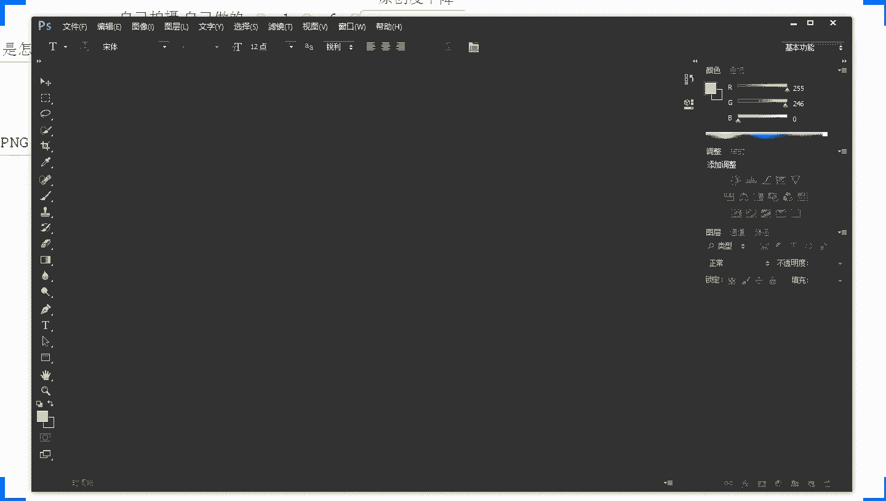
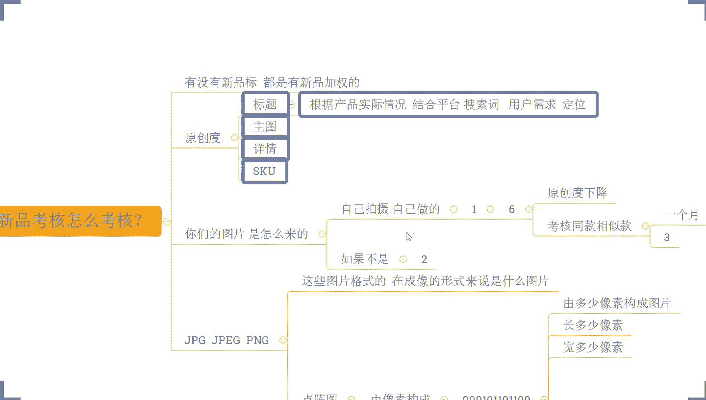

# 【全600集】强推！！2024（全新）最保姆级小红书运营自学教程，小红书起号到爆款店铺打造必学全套运营流程，新手开店必看！拿走不谢，允许白嫖！ - P74：新品推荐加权 新手小白必备技巧 - 红书运营 - BV1dtWGe1EPX

哈喽哈喽哈喽呃，测下麦啊，这边所有的目前已经在直播间的小伙伴们，能够清楚的听到我的声音啊，看到我桌面的话，声音跟画面如果都没问题呢，现在可以公屏上的扣一个一好吧，来确认一下啊，所有人动起来啊。

声音和画面都没问题吧，OK啊一别这边是OK没问题的啊，其他小伙伴呢好没问题，对不对，那就太好了啊，如果说是有这种啊听不到声音的啊，听不到声音的，或者看不到画面的，抓紧时间退出重进啊。

那么一会儿呢两点钟就开始正式分享，还有这个小10分钟时间，可以抓紧时间调整一下啊，那么呃在这一个时间里面呢，我们也顺便呢先等一等，那些还在路上的小伙伴们啊，那么一起呢先把我们这个直播间的小规矩呢。

先说一下对吧，因为确实呢有很多小伙伴都是第一次来直播间，对吧，所以呢今天我们先把这个直播间的一些小规矩，先说一说啊，嗯OK啊，那么呃在整个的店铺运营中呢，大家可能会有很多很多的疑问，对不对。

所以在平时的沟通和交流过程中呢，可能大家也是想说去了解一些，或者解决一些目前自己所需要去了解的，或者是真正意义上跟自己当前的店铺经营情况，相关的问题对吧，这个我非常可以理解啊。

但是呢这里有一点要给大家提个醒，就是在直播间里面啊，如果说你有问题，跟我们当前分享的内容不相关的呢，你等到我正式内容分享完之后再提问，或者是干嘛呢，等到我下播之后单独抹都可以的，在直播间里面的话。

不是说不允许大家提问啊，那么大家可以提问啊，可以提问，但是呢问题啊问题仅限当前内容相关的啊，相关的内容，这一点的话大家了解清楚啊，那为什么会这样说呢，因为其实我们直播间的人说多不多。

但说少肯定不少的对吧，也有那么目前来看的话，也有那么几十百八号人了对吧，那如果说我去给大家解决问题，你们每个人提一个问题，我来回答一个12分钟的话，那我们时间肯定不够的，那另外呢还有是说呢。

有了很多的一些可能确实基础比较差的一些，纯新手小伙伴们啊，那我们如果说是问题东一个西一个的话，他们可能就完全没办法理解，听不懂啊，所以这个点呢希望大家能够明白啊，那么也相互配合一下啊，那么这是第一个点。

第二个点的话啊，这里呢我也重点说明一下啊，就是在整个直播过程中呢，我希望大家能够去做到积极互动，OK啊老欧又来了，哎老欧这个老熟人了啊，来这一点的话，希望大家能够配合一下啊。

那当我在分享某一个知识点的时候对吧，当我在讲某一个操作方法的时候，OK当我分享过程中呢，我会跟大家提问，确定大家的理解情况，并且呢也会跟大家去了解清楚，大家是否能够听明白，或者是在整个分享的过程中呢。

我也会跟大家进行一些提问啊，来了解大家的一个基础状态，或者是对于这些问题的一个思考情况，那这些呢都希望大家能够去积极的互动，那你带着问题去思考呢，这样子你的吸收和理解会肯定会更好的，这一点毋庸置疑对吧。

另外一点的话啊，那当我跟大家确认是否能够听懂的时候呢，你积极的反馈给我，让我知道你的状态的话，那么这样也方便我们后面的分享对吧，不然我不知道你情况怎么样，我以为你懂了，但实际上你没有明白，对不对。

那可能后面所有的东西呢，你是没有办法吸收理解的啊，所以这个点呢，也希望大家能够去认真的对待一下哈，那么除了这两个点之外呢，还会遇到另外一个非常非常重要的问题，是什么呢，就是说大家在整个的店铺经营过程中。

如果说是确实本身自身的一些运营技术，不是很好的情况之下啊，那么记得一件事情，当你啊当你听到我分享的东西，那么一定要去认真思考，是不是你店铺有没有做到位的地方，那是不是你店铺需要的是不是适合你店铺。

如果是的话，记得去实操，啊记得去实操，因为你不去实操的话，那么你听了再多，你看的再多都等于零，各位刚刚讲的这几个点的话啊啊都没问题，都能够明白，都能理解的话，公屏上呢可以扣个一好吧，OK啊很多老熟人啊。

兴兴旺啊，这个老欧啊对吧，包括像我们的生于海港啊，玉玉林枫叶呀对吧，都是老熟人了啊，然后呢我有看到也有很多小伙伴呢是呃，最近这几天才刚刚这个啊，加到我这边的一些新的粉丝啊。

那么可能有很多小伙伴对我的情况呢，不是特别的了解对吧，可能对我不是很熟悉，是不是OK的啊，那这边呢还是也也老规矩吧啊，也给大家顺顺便先做一个简单的自我介绍吧，哈免得说挺会西楼，你到底是干嘛的，对不对啊。

我平时看你视频也看的蛮多的啊，觉得你确实还有点东西的啊，听你这个直播分享的也确实很有东西，但是呢你是干嘛的，我不太清楚对吧，那我先做一个自我介绍吧，哈呃反正时间还有嘛对吧，还有几分钟时间呃。

大家呢平时可能叫我比较多的，叫我老师，对不对，这里呢我也郑重说明一下，你们以后不用叫我老师的，叫我西楼就可以了啊，叫我西楼就可以了啊，这一点的话我说清楚啊，我也不是什么老师啊。

我只不过可能做电商呢比你们做的早而已啊，我就是一个老商家老运营啊，那我最早呢自己在这个电商的道路呢，最早开始进入电商行业，那是08年的时候啊，最早08年开始从事这个电商的工作啊，那么10年的时候呢。

就开始自己独立运营店铺啊，这个时候呢确实也是运气比较好啊，那么时间比较早一点，当时的这个经营环境啊，包括说我们的一些这个玩法呢也都比较的呃，相对来说可能比较简单一点啊，那在13年的时候呢。

我自己经营的这个淘宝女装店铺呢，就入选了这个啊top20强啊，在女装内部里面啊，那么也赚了点小钱吧，算是啊，嗯在整个的后期为我呃另外的一个这个拓展，包括视野的开拓也做了一些铺垫啊，那15年的时候呢。

是这个受邀在陶大呢做了一些分享啊，当时也被评选为了这个优秀讲师啊，那么呃也在这个时候呢认识了很多人，接触了很多的一些官方的，一些这样的这样的一些大牛吧，算是啊也算是人脉的一个拓展哈，那17年的时候呢。

自己呢就开始玩了拼多多，那当时呢拼多多呢也不是我自己想玩的啊，这里跟大家讲一下吧，其实在我们这种老淘宝人眼里面啊，什么京东啊，什么拼多多啊，都扯淡的，我们都不放在眼里了，说实话，当时呢。

拼多多在我眼里也是根本就不屑一顾的一个，一个平台啊，那也是机缘巧合，当时我的一个玩的比较好的朋友啊，他是加入了拼多多，在拼多多管理团队里面啊，跟我透露一个信息说，哎拼多多未来这个一年的话。

要大力的去去发展了，要发力了啊，你可以看看尝试一下，看适不适合开店去搞一搞啊，当然当时他没有让我去进股市这一块啊，啊我一直记恨着他对吧，那要是让我进股市去搞一搞拼多多的股票，我觉得很爽啊，对不对。

那在这一年呢也刚好是做了拼多多，也是算是运气比较好，那这一年的营业额呢做了8700万啊，当然也是这一年，对不对，一家港交所的上市公司呢，邀请我做了他们的电商顾问啊，在19年的时候呢。

也是在全国电商大赛上获得了认证讲师，一个称号啊，二零时候在成都一度电子峰会上，被评选为了电商金融物top，十，22年呢，被华南电商协会授予了一个荣誉副会长的称号，那么这些呢。

大概就是我自己的一个从业的一个经历了，那自己呢做的店铺呢也比较多一点啊，我自己目前的经营的店铺呢，像服装类，食品类，还有这个五金类跟数码，还有家具我都在做啊，都在做。

那当前的这些店铺也都是给了我自己培养，这些运营的小伙伴们，他们在打你啊，我自己呢能够把这个大方向把控一下对吧，腾出手来做一些别的事情啊，大概是这样子的，所以说呢，呃如果说大家有这种店铺招商的问题呢。

不管你是什么内部的，我相信呢我也都会有一个呃比较独到的见解吧，算是啊也是小有心得吧，我个人比较擅长的就是整体运营策划，SUV优化以及自动车板块，好吧，OK那这就是我大概的一个情况了啊。

啊这个南京米洛说哎你带徒弟吗，呃我是有带徒弟的啊，这个是实话啊，我有我有这个带实操这个板块啊，但是这里我先讲清楚啊，你们不用着急啊，你们不用着急啊，如果说你自己目前是属于这种呃，确实想要长期坐垫的。

但是呢自己没有什么很好的运营方法的，OK的，那么可以啊，把这个呃心思稍微搜一搜，认真的听完我今天的分享，你觉得确实泄漏有点东西对吧，你觉得确实是你需要的这样的一个这个方式，方法，OK的。

你可以跟着来实操好吧，以后我会给你们讲的这个具体的一些，时尚的要求的啊，跟我实操的话，不是说你啊愿意花钱就可以了，这里我先说一下啊，你必须要满足我的条件，你有时间去做这个事情，你的这个呃运营的一个态度。

要要要是这个正确的一个态度对吧，这些才是才是重点啊，OK了啊，呃那么这个时间差不多了啊，时间差不多了，还有一分钟不到的时间啊，这边的话我最后再确认一次咯，好不好，来所有的目前在直播间的小伙伴们。

有在认真听直播的小伙伴们啊，能够听清楚我声音的，能够看到我这边电脑桌面的，再一次啊，公屏上来扣一个一啊，我再确认一次好不好，来动作快啊，所有人没问题的话，公平小义组起来OK啊，有还不错啊，还不错啊。

今天你们的这个回复的效率啊，比之前几次直播要高很多啊，我感觉这个速度很快啊，OK了啊啊也有看到很多人的小伙伴啊，是比较熟悉的啊，加油吧，好兄弟们啊，像这个呃这个老欧啊对吧，像这个呃呃这个耳濡目染啊对吧。

还有相濡以沫呀，还有镜啊啊，还有这个呃这个这个这个新兴旺啊，还包括我们彩虹啊对吧，都是一些比较熟悉的小伙伴啊，可以的可以的可以的，OK啊好，那今天我们要分享内容呢是什么呢，这边我跟大家说一下。

叫做新品推荐加权新手小白必备技巧啊，我知道今天我本来我讲，我说诶给到你们做这么一次分享呢，我相信啊可能有大部分的小伙伴呢，可能对这样的一个一个标题呢是不屑一顾的啊，我我我我我心里面很清楚啊。

但是我为什么要来给大家分享这么一个东西呢，对吧大家放心啊，我不是闲的蛋疼，没事干，对不对，那一定是这个东西对大家有帮助的，我可以很负责任地说，我今天不管你们在座的各位老板，是做了多久店铺的啊。

那么但凡是你自己真正意义上，想办法做好店铺的话，那今天分享内容一定对你是有帮助的，各位这个自信我是有的啊，如果说没有用对吧，我哪天直播倒立洗头好不好对吧，这个这个这个底气我有的O。

那这个时候呢我们就直接开始了啊，今天我们讲的首先得搞清楚这个东西叫什么啊，新品推荐对吧，各位呃，我先问大家一个问题吧，拼多多平台你们觉得啊，拼多多平台你们觉得有新品推荐吗，我们讲的是新品推荐。

就是指我们的新的发布的产品啊，它是不是有这个额外的曝光扶持这种东西啊，有没有有吗，有对吧，OK啊老欧说有，然后呢彩虹也说有胡子说有，李丹说有啊，相濡以沫也说是有的，OK大家都是这个认为是有的对吧。

OK微风也说是有的好，没错啊，一定是有的啊，一定是有的啊，这个是有的，这个没毛病啊，这个是有的啊，那问题来了啊，那如果说新民推荐是有的，新品加权也是有的，新品扶持也是有的，那为什么我们有很多人。

产品发布之后没有访客呢，嗯这个问题就很严重了对吧，哎我产品我的产品发布了没有访客，这个是一个常态啊，这个不是个别现象啊，这是常态来的，是不是各位这个这个大家同意吧，这个大家同意吧，这个不是个别现象。

这是一个常态，同意的话，公屏打一啊，如果说大家同意的话，公屏打一，那这个东西就问题来了呀，你又跟我说有新品推荐，你又告诉我我的产品发布了之后又没有访客，那你这不是自相矛盾吗，你这不是扯淡嘛，对吧。

唉欺负老实人吗，这不是对不对，那你给我扶持扶持到哪里去了，你给我推荐推荐到哪里去了对吧，咱们不能这样玩儿玩儿文字游戏没有意义啊，对不对，哎真的是文字游戏吗，不是的啊，那我们的姓名推荐一定是有的。

那我首先跟大家讲一下姓名推荐的逻辑啊，这个东西逻辑大家搞清楚之后呢，我们再来说具体的操作，怎么去通过一些小的操作方式和技巧，来完成这个新品的流量获取好吧，首先第一件事情，那我们说说这个推荐的一个规则啊。

推荐的规则或者推荐逻辑吧，推荐逻辑这样讲可能更加的严谨一点啊，推荐逻辑，那有没有人是在18年之前有接触过，或者了解过拼多多的，有没有准确的说是18年的7月份之前啊，有没有在座的各位。

有没有这个时间段有了解过拼多多的有吗，都没有吗啊OK啊，如果说没有到，没关系啊，那我说一下啊，在那个时候啊，在那个时候啊，拼多多对于产品的考核就只有一个东西销量，那如果说你不知道。

但是这个事情你一定听说过的，早期拼多多就是销量为王，啊就是销量为王对吧，谁销量高谁靠前，谁销量高谁靠前，啊谁销量高，谁排名靠前啊，跟我之前说的一样对吧，早期的时候就做都在做淘宝，看不上拼多拼多多是吧。

OK啊，你说这句话就真的是呃印证了一句话，又是什么呢，呃鄙视拼多多，理解拼多多，然后成为拼多多，是不是现在都这样子啊，你们可以看到现在各个平台啊，都在向拼多多靠近，是不是是不是这样子啊，最后发现呢。

确实拼多多的这个策略呢还真的是挺厉害的，他唯一让人吐槽的嘛，也就是这个呃比较恶劣的这种裂变的营销方式，对不对啊，砍一刀啊这种东西对吧，可能这个东西比较让人觉得反感啊，但是他的大多数的这种东西的话。

目前来讲的话，各个平台都在模仿他啊，但是在这个情况之下呢，我要我要实话实说啊，呃不管是哪个平台，他现在如果真的在模仿拼多多的话，实际上作为高层，他们的策略一定是一定是这个错误的啊。

这句话我给大家把这个话说在这个地方啊，兄弟们今天我们一起做一个见证啊，我把这个话说在这个地方，就不管是淘宝也好，还是说像抖音也好，还是说其其他平台也好的，他们可能目前来讲。

已经在非常大的一个策略层面上来，像更多靠近了，但是他们的这个策略的调整，其实对于商家也好，对于用户也好，都是一种伤害，他们不可能成功，在这方面来说，各位你们信不信，你们信不信，有没有有没有不信的来。

有没有不信的，如果信的话，打一个六好不好，如果信的话，打一个六，如果不信的啊，打一个这个，OK啊都信啊，哎哟看来我们还是志同道合的一帮人啊，兄弟们啊对吧，看来我们还是比较这个达成统一的。

这种这种想法上来说，对不对，其实很简单嘛对吧，用户群体不一样嘛，你像淘宝对吧，早期的时候，可能更多是一二线城市的用户居多嘛，那现在他全部把这个东西砍掉去，搞得跟拼多多一样的话。

最终呢都会有到这种已知出来商家会越来越多，那么像我们早期的时候，可能在淘宝购物的时候流传一句话对吧，很多人说呃淘宝的这个用户呢，他可能是呃害怕买到假货对吧，在拼多多买买东西的人，可能他就不怕买到假货。

为什么，因为在在淘宝买东西的时候，他是花买这个真货的钱去买了假货，他所以他害怕啊，在拼多呢可能他花的钱很少对吧，就是花了买假货的钱，买到真货，就是赚的，买到假货无所谓对吧，就这个意思啊，当然了。

这个只是早期的一个调侃啊，那现在其实已经不是这样子了，呃为什么拼多不能给商家搞一个这个紧收款，哈哈哈哎呀可以可以，你这个想法很好啊，下次我跟他们这个高层聊天的时候，给你把这个想法说出去啊。

让他们看看能不能调一调哈，搞个紧收款哈，试一下，我真的是醉了啊，其实你要真的说紧收款的话还是可以的啊，真的可以紧收款的啊，兄弟们，你们可能不知道啊，你真的要搞紧凑款是可以搞出来的啊。

在我们店铺后台里面的话，是有一个这个商家的收款码的，这个大家知道吧，有没有人有些人不知道的，有没有人不知道的，商家是不是有一个收款码的，一个这个支付二维码，知道吧，收款码你们可以拿这个去收款啊。

可以可以可以仅收款的，是不是只要他愿意付啊，也是可以的啊，也是可以的，好了，不开玩笑了，不开玩笑，扯得有点远啊，刚扯得很远了，我们把这个思路收一收收回来啊，来兄弟们思路说一下啊，早期的时候啊。

我们这个拼多多平台呢它是以销量为王啊，那么这个时候呢谁销量高，谁排名靠前，对不对，那这个时候就有了一个问题，那如果说今天我啊打个比方啊，呃我是卖这个食品的啊，打个比方啊，兄弟们打个比方，我是卖食品的。

我卖零食的啊，我卖零食的哎我卖的是辣条对吧，我卖的是辣条啊，那么我现在呢有很多的这种呃，辣条的这个产品跟链接，我已经发不出去了啊，打个比方啊，那么每个辣条呢它其实都可以卖的很好，为什么呢。

因为它确实是一个非常畅销的产品对吧，它是一个非常畅销的产品吗，那但是呢有一个问题，今天呢我又要去做一个店铺，我可能需要去卖一个东西，什么鸭脖啊，我要卖个鸭脖，或者我要卖个牛肉干好吧，我买的牛肉干啊。

那么这个时候像鸭脖牛肉干这种东西呢，确实啊他在某种意义上来讲也是畅销的商品，对不对，这个要重新把跟跟这个辣条来对比的话啊，跟辣条来对比的话啊，我们我们这些产品，是不是其实都算是畅销的一些零食啊，没错吧。

是不是都吃三样零食啊，但是有一点可以肯定啊，那销量最大的一定是辣条啊，这这几个产品来说，但凡你们是了解市场的话，应该都清楚的对吧，那销量最大的一定是辣条啊，那如果今天我们只是看销量对吧。

他可能就存在一个问题，就是我们这些所谓的呃内幕曝光也好，推荐曝光也好，它会被这些本身内幕体量很大的一个产品呢，所垄断掉啊，这是一方面，另外FM方面呢在同类型商品里面的话啊。

那么低价商品永远是比高价的商品卖得多的，对不对，低价商品可能一天卖个1000单啊，打个比方，今天我们有一个产品辣条对吧，一毛钱一包，他一天卖个1000单，另外一个辣条呢十块钱一包，他一天只能卖十单对吧。

有这种情况的，那这个时候怎么办呢，你如果说只看销量也不对啊，也不对，那么这个时候，我们会造成一个非常大的一个困扰，就是这些跑量的低价商品呢就会去冲量，尤其是一些商家他们去做排名的时候，会疯狂的冲量。

这个时候呢一些有钱的老板呢，他们砸下来砸的很猛对吧，那作为我们中小商家，作为我们真正意义上想去把店铺做好的商家，可能我们就很难去拿到曝光，于是乎呢平台在这样的一个大环境下面呢，在18年的下半年的时候呢。

对这个销量排名的一个这个考核呢做了优化啊，他除了考核销量之外，又加入了坑产啊，又加入了坑产，什么是坑产呢，就是我们的交易额啊，就是我们的交易额，那么这个时候呢就会有一个问题。

就是你销量考核的同时也会考核你的交易额，打个比方，今天你卖1000单，对不对，你只卖了1000块钱啊，你只卖了1000块钱，但是人家卖十单，他也卖了1000块钱对吧，他也卖了1000块钱。

虽然说你们的销量不一样，在销量上你是占了绝对的优势的，但是在你的坑场上，你没有任何优势，而反观在我们的客单价来说的话，人家客单价是100，你客单价只有一啊，你客单价只有一，所以在这种情况之下呢。

我们会认为客单价更高的这个商品呢，对我们的流量的利用率可能会更好一点，他的UV价值也可能会更高一点，当然这个UV价值，还要考虑到我们的这个商品的一个访客啊，各位这样的一个逻辑，大家能听懂吗。

如果说能够听懂，公屏上打个一好不好，如果说没有理解，没有关系啊，也可以打个问号，我再给大家讲一下就可以了，OK啊能理解对不对啊，有没有有没有小伙伴不清楚的，没关系啊，这个很正常，有不清楚很正常。

大家不用去说，担心说觉得自己说的不理解，会觉得没面子之类的啊啊啊这个点刚进来是吧，没关系啊，没关系啊，刚进来没关系，可以认真听一下啊，一会儿的话啊，这些东西呢目前来讲的话。

你只是一个相当于是一个基础板块的东西啊，相当于一个扫盲啊，不用着急，无所谓的啊，那么在整个的这个过程中的话，那我们平台呢他除了会考核你的销量之外，也会考核你的坑惨，但是在坑惨的时候。

他就必然会进行下一步的考核，怎么考核呢，考核我们的课堂价对吧，考核我们的UV价值啊，它是必然的，因为在这些数据跟它是息息相关的，是同步进行的啊，那么所以我们产品在考核的时候呢，他除了考核销量。

考核我们的客单价，考核我们的UV价值之外呢，会进行一个更大的一个维度的一个考核，不是像原本那么单纯对吧，同样的在商品考核过程中呢，这个时候如果说平台在所有的位置，只去考核这些东西，也会面临一些问题。

什么问题呢，你能想一下啊，这些考核它是基于什么的，各位来这些考核数据它是基于什么的，来这一点啊，有没有谁可以给我一个答案的，或者是能够去呃这个把思维发散一下，根据这个数据。

这些这些东西来来给到我这样一个答案的，有没有啊，这个这个不是，这个不是一个非常重要的一个点啊，只是一个看看大家有没有在认真听，有没有非常灵活的去吸收消化这个东西啊，这一部分内容的一个一个点啊。

就是目前来看的话，就这些内容它对于我们产品排名的考核，它是基于什么东西考核的，有没有有没有人知道的，如果说不知道没关系，打个问号啊，如果说不确定不知道没关系，都可以打个问号啊，动作快啊，都不清楚。

那我就直接讲啊，就不用浪费时间，OK啊，那么这个呃你单说诶商品数据，然后这个正文是吧，是站稳吧，他说哎是这个曝光和流量吗，然后这个点说是权重啊，OK啊好没关系啊，没关系啊，呃然后彩虹啊。

彩虹你也不知道啊，你你作为一个运营，你也不知道，你这个就说的有点有点过分了啊，那我觉得你这个跟着实操这个事情，刻不容缓了啊，彩虹知道吧，来彩虹能听到扣一啊，能听到扣一啊，那这里的话认真听认真听啊。

彩虹能听到扣一啊，那我先来把这一个部分呢，给大家认真的去详细的去讲一讲啊，那这个地方一定要认真听啊，其实我们刚刚有反复提到过一个东西的对吧，那这里呢销量啊，这里呢是坑产，它不管是什么，不管是什么。

它的考核都是基于什么，基于成交来的呀，是不是，各位没错吧，其实刚刚有没有小伙伴已经提到过了，对不对，根据我们的商品数据，那么这个商品数据是什么，就是我们的这个啊成交的一个数据嘛，对不对。

然后这个有点说是权重，那么这个权重是根据什么考核的，也是我们的成交数据，是不是，同意的话啊，固定扣一，同意的话，固定扣一好，那么这里就遇到另外一个问题就产生了啊，如果说拼多多平台进行商品排名的时候。

他只考虑成交，就会有一个非常严重的问题出现，那什么严重的问题呢，在我们的产品排名过程中，平台考核的销量也好，考核的坑产也好，它都是要根据我们订单的数据反馈来的，对不对，那么作为我们是新店。

我们是新品的话，那么你新店新品你怎么办，你是不是就没有机会了，就等于说那这个时候呢，他是不利于我们平台发展的，平台呢希望我们的消费者呢，能够得到一个很好的购物体验跟购物环境，知道吧。

所以说他不希望说我们的平台的商品，展示过程中出现垄断，为什么这样说呢，来各位我们现在随便举一个例子啊，我们现在随便举一个例子，各位你们是做什么产品的，来可以说一下啊，可以说一下你们做什么产品的。

我拿你们产品来举例子，这样子，可能大家的理解可能会更加的深刻一点啊，好K老A说是做童装啊，老A说做童装的啊，然后呢这个我们就说童装了啊，好不好，我们就是童装啊，你们其他人做的这个产品呢是什么啊。

无所谓啊，现在其实也不是很重要啊，重要的是我们现在把这个逻辑带入进来好不好，我们现在把这个逻辑带入进来哈，来各位我们现在说一个童装这个事情啊，我们现在说一个童装这个事情，我现在来来说一个事情啊。

假如说今天我们去收了一个词叫做外套啊，就是外套啊，假如说今天我们收了一个词叫做外套啊，各位我想问一下，外套这个词有没有明确的这个具体的产品，可能这个逻辑大家没有特别好理解啊，呃他是夹克吗，他还是什么呢。

对吧，哪怕我前面加了一个男装啊，哪怕我加了一个男童啊，哪怕我加了一个男童，他有吗啊，他有吗，他其实没有具体的指向，对不对，他没有具体的啊，那么这个时候就遇到一个问题，但凡是跟这一个词它有关联的啊。

符合这个词的搜索的规则的，这个所有的商品都会被抓取出出来，对不对，那么他被抓取出来之后呢，如果按照我们刚刚的逻辑，它按照销量，按照坑产去考核的话啊，按照销量按照坑产去考核的话。

那么这个时候呢当下应季的卖得多的，数据好的，这个产品就会呈现出一个垄断的状态，各位这个大家承认吧，当下销量高啊，然后卖的多的就会有一个垄断的一个状态，是不是没错吧，就会呈现出一个垄断啊。

那如果说根据整个考核，他只是考核销量的话，那更恐怖啊，那么只考核销量的话，可能还有去年的是大前年的商品还在霸榜，还在第一名展示对吧，那么这个时候呢对于我们的消费者而言呢。

他可能看到的商品呢都是一些所谓的爆款商品，他一直看到的都是一些所谓的爆款商品，它没有太多的新鲜感，他会觉得这个平台给到我的产品都是一样的，我今天可能在这里买了，我第二天我想买的时候。

或者我过了一个月想买的时候，看的东西还是一样东西，各位这个逻辑能不能能不能听懂，抛开这个应不应激这个事情不说的话，那么当下当下这个季节啊，这个季节我看到的啊，我看到的都是差不多的东西。

或者我每次看到的都是一样的东西，那这个时候你觉得我在这个平台上能购物，购几次呢，一次两次三次，我相信不会太多，各位是不是这个这个逻辑能不能理解，作为消费者来说，我的购物体验很差。

我每次来我找不到我喜欢的，或者是我看不到一些新鲜的东西，每次都是同样的东西，我没有新鲜感，那作为平台来说的话，同样的道理，那么没有办法给到用户一个很好的体验的话，是不能做到用户留存的啊。

所以这个也是一个非常重要的一个一个啊，对我们来说不好的影响吧，算是啊，那么在这个基础之上呢，所以这个时候呢，平台呢也会加入到季节性的考核，针对到应急商品进行加权，对不对，各位这个这个这个没问题吧。

应急商品会进行加权啊，比如说你现在是夏天，那么春天的产品，哪怕你在平台上有占半，那他同样也不会有到特别多的权重，它的权重在同类型商品考核过程中，它是对应急商品是优先展示的，那么这是一方面。

另外一方面呢平台会针对到新品进行啊，针对到精品进行随机推荐啊，什么意思呢。

来我给大家画一个图啊，打个比方，这个是我们拼多多啊，这个是我们拼多多哈，这个界面啊，是我们拼多多啊，在拼多多这个界面里面呢会有不同的宝贝，不同的商品对不对，在这边进行展示啊，我们随便画一下啊。

随便画一下啊，我们随便画一下这个东西，大家不用去管画的正不正啊，画的好不好看啊，无所谓啊，好不好无所谓啊，我们只是做一个演示而已啊，那打个比方，这里呢是我们拼多多界面，对不对。

在这个界面里面呢会有到不同的位置，这个是第一个位置，这是第二个位置，这是第三个位置对吧，这是我们商品的展示位置啊。

然后第五个，然后第六个啊，那这个时候呢假如说啊兄弟们，假如说啊第一个位置啊，第一个位置它是什么呢，它是我们的这个呃广告位，广告位啊，打个比方啊，他是我们广告位，然后第二个位置呢是我们的这个呃推荐商品位。

推荐商品位啊，是根据我们历史的行为，历史的足迹啊进行一个推荐啊，比如我浏览过的商品啊，或者是我收藏过的商品啊，这种这种推荐位啊，然后第三个呢可能是什么呢，高销量的啊，然后后面呢可能是高坑产的啊。

高跟闪的，再往后呢可能是这一个好评率高的，啊好评率高的，那再往后呢可能会有这么一个位置，比如说第六个位置，这个位置他就是一个新品推荐位啊，这个新品推荐位不是固定的啊，我只是拿这个地方来举个例子而已。

它不是固定的啊，它不是固定的好不好，平台会根据人群来进行区分，有些人他喜欢新鲜事物，喜欢新品，那么就会针对到这些人呢，会有到新品推荐位，但有的人呢他可能只是喜欢一些爆款，或者喜欢一些低价商品的时候呢。

诶他对新品不是很敏感的时候，他是没有新品推荐位的，这个点注意一下啊，这个是根据千人千面来的，所以当有人喜欢新品的时候，这个新品呢就会推荐出去进行展示，而展示的时候呢，这个新品推荐位呢。

它会根据当下属于新品的商品啊，在这个商品池里面来进行随机推荐，啊可能对这个人呢今天推荐的是商品一，明天可能推荐的商品，二，后天可能商品三对吧，然后呢对不同的人呢可能推荐的是不同的商品。

那么这些时候呢针对到后面这些新品，正常的进行了这个推荐，曝光之后会形成一个点击反馈，会形成后续的这个成交数据等等这些东西，然后进行商品考核是这么个逻辑，而这个时候如果说有新品。

通过这个推荐位表现的很好的话，那么这时呢平台也会根据这个推荐，很好的新品呢来完成数据的扩散，进入到更多的人进行推荐，这个时候的推荐呢，它就不是说单纯的心灵推荐了，而是标签推荐，而是标签推荐。

各位这个逻辑现在大家能够明白的话，公屏上打个一好不好来啊，OK这个部分呢我讲的时间比较多啊，画的这个篇幅比较长啊，我之所以花这么多时间，花这么多的功夫去给他讲这个事情呢。

是希望大家能够去重视这个这个东西啊，那么这个东西呢对于我们作为新店运营，作为新手运营来讲是一个非常非常重要的部分，如果说你做不到位，如果说你没有做好，那么你前期的初始曝光就会少很多。

对于我们店铺来讲的话，这个东西影响很大啊，影响很大啊，对于我们来说，这个东西呢，这个呃这个影响就可以可以可以这样说吧，就好比说你今天做了一个销量，我今天要做100个销量来追，你，就是个差异啊。

就这个差异啊好不好，因为它是影响到我们初始曝光的，那当然了，可能有小伙伴说有没有这么夸张啊，我不是很理解啊，OK那我们可以想一下，如果说前期你和我都是新品的情况之下，我新品推荐比你多，比你多十倍。

比你多100倍，那这个流量差异是不是产生了呢，如果说这个新闻推荐在产生之后，我们的数据反馈也会有差异，我有很高的点击率，我有很多的用户收藏甚至转化，那么这个差异是不是又变多了呢，当然有小伙伴可能说诶。

那我可以自己去做单子，但是各位我不知道大家有没有注意到啊，目前来讲的话，在拼多多平台上，已经有很多的人发现了一个规律，就是现在他整个的这个虚假交易的处罚力度，或者是处罚的这个概率值越来越低了。

我不知道你有没有发现啊，在之前的时候，早期的时候，我们可能还偶尔听到说有谁被判了什么，虚假交易对吧，各位有没有听过这个东西的，在我们去年上半年之前，大家有没有经常说是偶尔会，就是也不是说经常吧。

至少来说偶尔会听到说有人店铺会什么，会这一个啊，虚假交易对不对，但是现在店铺需要交易，其实真正意义上给你处罚少很多了，但是你会发现一个事情，现在你去做了订单，做评价，做了销量，你会发现没有效果啊。

做完之后呢会虚假发货，跟这个没关系啊，跟这个没关系，那么做完之后呢，即使说你原本是有数据的，你会发现你店铺好像被屏蔽了，是不是没有访客，没有订单了，对吧各位有没有发现这个差异啊，有没有发现的。

如果有发现的啊，公屏上可以打个一，那为什么嗯，原因很简单，因为平台知道这个东西不可避免，也正是因为我们很多商家喜欢去做这个事情，才把我们拼多多做的很繁荣啊，至少来说这个是在官方数据层面上来讲的话。

会让我们的数据变得很繁荣，但是他又不能让我们这种需要交易的风气呢，来影响到正常的店铺操作，所以说他会把店铺的考核数据啊，做得更加的严谨，同时呢去把它进行一个隐形降权的一个操作，而不是放在店铺违规上啊。

当然了，也有人可能说唉，这个是拼多多平台呢做了一个调整之后，他想放长线钓大鱼，前期的时候呢就给你小小的来个屏蔽，逼着你去做更多订单，然后呢然后呢让你订单变多之后呢，来冻结你的店铺啊。

这个也是比较腹黑的一种想法，但是呢我们也啊不知道平台怎么想的，但是也不排除啊对吧，但是不管怎么样来说啊，那我们做店铺的话，你如果说只是靠去人工操作订单，那一定是得不偿失的。

或者是一定是干嘛的一种错误的方式，是不是我们要做的是做好权重，做好推荐曝光，而不是说我们为了做店铺呃，我们为了去做这个销量而去做销量对吧，我们为了去做评价而去做评价对吧，这个就肯定不对的哈。

那新品的权重刚刚推荐逻辑呢我们也讲清楚了，那现在我又想问大家一个问题了，这个问题跟大家息息相关的啊，那新品的推荐是怎么推荐的，新或者是这个新品的这个考核是怎么考核的，来这个问题我问一下啊。

这个问题我问一下好吧啊，有没有人知道的，当然了，有很多类目呢它是没有新品标的啊，有些类目是有姓名标的，那么这里我也顺便说一下啊，不管你的类目有没有姓名标，它都是有新品加权的，这个毋庸置疑啊。

怎么会有新品标的呢，它是有外露的一个展示啊，他是有外露的展示，但是呢没有新品标的店铺，他一样是有姓名加权的啊，OK这个最好说是点击率啊，还有别的这个不同的答案吗，新品的新品考核啊，新品考核怎么考核啊。

好不好，换句话说平台怎么去识别出你是新品的好吧，你们不要这个跑偏了啊，我就感觉你们这个东西跑的有点偏啊好吧，然后这个lucky star啊来问一下，那你知不知道你知不知道啊。

你呢也做了一个几个月时间了啊，这个问题我觉得你应该是能够清楚的吧，在不在lucky在不在lucky star，不会说是在直播间里面挂机吧，啊哎哟说鸡不说吧，啊这个文明你我他刚刚这个嘴瓢了啊。

大家装作没听见啊，好不好啊，然后这个呃呃这个赵文说是销量和评价，然后呢橘子味的猫说是这个价格标题主图，然后天天说是标题和主图，然后彩虹说是产品品质，我的天呐啊彩虹啊，你让我觉得很担心你啊对吧。

作为一个专业的运营来说的话，你你这个每次给到我的答案，都让我觉得有点不尽人意啊，稍微有点这个稍微有点偏啊啊稍微有点偏好吧，稍微有点偏啊，然后这个哎我又看到一个这个一个熟人啊，Whisper。

whisper在不在在的话，来在的话来这个问题你回答一下，OK这个战斗说是标题主图还有SQU啊，标题主图还有sq好吧，来，我在吗，我的天什么情况什么情况啊，我怎么老是看到一些在直播间的人。

然后又不说话的，是是是是不在吗，现在算了算了，不纠结了，好OK啊，那我们继续往下啊，OK啊说的是这个潜力新品吧，然后点击标题主图销量等等啊，OK啊行行行啊，不纠结了啊，那我直接公布答案吧。

不好我直接公布答案啊，我直接公布答案就不去纠结了啊，其实在针对到我们拼多平台，考核到我们产品的时候呢，说怎么去考核新品的话，其实很简单一个东西对吧，考核我们产品的原创度啊，就这一个点啊，就考原创度啊。

那么这个原创图考了哪些东西呢，刚刚你们其实提到了，对不对，标题啊，然后还有主图对吧，包括说我们的详情啊，包括我们详情，还有我们的SQU，这些都是考核的啊，这些都是考核的，各位注意了啊，注意了啊。

呃标屏怎么办啊，哎呦，都有是吧，刚刚为什么不回复了啊，除非自己搭配，OK我说一下啊，标品他不是说我产品必须是独一无二的，这个就叫原创度啊，兄弟们啊，这个要搞清楚啊，不是说我产品要独一无二的，要有混装。

这个原创度，原创度是指平台识别出我的产品，识别出我的这个链接是原创度，能理解吗，链接是原创和你产品的原创度，这个是两个概念来的啊，这两个概念的呢，那么在我们进行识别的时候呢，首先第一点大家记住了。

你的标题一定不要去抄袭啊，一定不要抄袭，当然了，你说我就是去抄袭了行不行，行没问题，这个无所谓啊，这标题的板块来说还好一点，没有那么严重啊，好吧，这个呢大家尽可能的根据产品实际情况好吧。

结合平台搜索词啊，结合平台数字词以及我们用户的需求，以及我们自身的一个什么定位，来做我们的标题啊，这是第一点啊，然后呢重中之重的部分是什么呢，就是我们这几个板块的图片和我们的sq布局。

如果你想要去做一个原创度很高的产品的话，你sq不要去跟同行做的一模一样，哪怕是在文字描述上，哪怕是在我们图片上做出差异都是好的，这一点大家注意一下好不好，然后呢，再就是我们图片，我们的什么主图。

我们的详情，那么来我问一下啊，我问一下，现在我问一下啊，各位你们的图片啊，你们的图片，你们的图片是怎么来的，是自己做的吗，自己拍摄自己做的吗，来扣一啊，这种情况扣一啊，正确扣一，如果不是啊。

如果不是扣个二啊，如果不是扣个二，如果不是Q2好吧，OK啊有扣一的，有Q2的啊，有扣一的，有扣二的啊，啊Q1的少部分啊，扣的是大多数啊，然后呢小伙伴就说哎我也想自己拍对吧。

像一米阳光说哎我自己拍拍不好啊，OK行没关系啊，来兄弟们啊，来注意了啊，注意了啊，现在到了关键点了啊，现在到了关键点了，来我给你们看一下啊，对于我们店铺来讲的话，你前期如果想去得到一个很好的新品考核。

拿到推荐权重的话，那么前期在这个板块一定要做到位啊，我给你们看一个新店啊，给你们看一个新店啊，来诶等一下来这个啊这个新店啊，这是一个新店来的，各位他起量，大家觉得怎么样快吗，从零开始的新片啊。

从零开始的新片啊，操作了有这个小半个月啊，就开始起量啊，就开始爬升啊，到后面的话一个小爆发就冲到了，差不多1万毫克，到这个时候才多久啊，对不对，才大半个月吧，猜到了，看后面的话是一天做了1万5的访客啊。

注意啊，这个店铺做的是纯制按钮，一分钱的推广费没花，一分钱推广费没花啊，啊怎么说呢，店铺操作嘛，对不对，肯定是有这个不同的数据的，像他本身有一点他的控制量比较低一点啊，颗粒比较低一点。

所以它体量也会比较快一点，当然这个也跟我们的品类有关系啊，好吧，可能我们不同产品的也是不一样的，这个东西没有固定的，那但是有一个问题什么呢，我们想要去有到这数据的前提，想要有这样数学前提。

一定是有一个很好的亲民推荐啊，初期做的评价跟销量维护吗，我不知道你说的这个评价和现在维护，是指的哪方面啊，是指的去呃自己去做销量做评价呢，还是说怎么样做这个店铺，我给大家讲一下，他直接做的是进价啊。

直接做竞价，没有去做，没有去做这个S单啊，没有做S单啊，啊我们做店铺啊，你去做销量做评价方法有很多，你可以去S单，你也可以通过别的方式去做对吧，方法有很多，最终的目的。

只不过是帮我们把这个把这个评价做出来，把这些人做出来，能够去促进转化，仅此而已，是不是，所以方法很多啊，方法很多，看你怎么去用它而已，看你怎么去做它而已，好吧，那么这个店铺怎么做的呢。

来我给大家讲一下啊，首先针对到原创度的操作，各位平台在识别我们产品的时候，他怎么去识别新品嗯，各位来，我现在问一下啊，平台在识别我们产品是不是新品的时候，他怎么去识别我们新品，识别的是我们的标题。

识别的是我们图片识别的时候，想起识别是没SQ，对不对，刚刚我们说过了，那么这个时候来重点说一说这几个点，主图详情，还有sq它都包含一个内容叫做图片对吧，所以刚刚我问了一下你们图片怎么来的。

这个地方我说一下啊，不管你们的图片是自己拍摄的也好，还是说你们是这个呃，通过供应商提供的，或者是到处理好，无所谓，都不重要，重要的是你们都要保证自己图片的原创性，如果说你自己是厂家的对吧。

你可能说我自己去拍摄，然后我会把这个图片呢分发出去给我的分销商，有没有刚刚扣一的小伙伴，有没有这种情况，你们会把图片发出去给你的这个分销商吗，会不会会的话，打个六好不好，如果会的话，打个六啊。

刚刚是扣一的小伙伴们来，如果说不会的，OK的也可以打个二好不OK啊，行啊行行行啊，是有的，对不对，那如果说你的图片就是自己在用，这种情况还好一点啊，还好一点，如果说你要分发出去给别人用。

那么这个时候遇到一个问题，你图片虽然说是你自己是原创的，但是可能跟你用一样图片的人很多，就会导致你的原创度，下降能懂吗，因为平台考核新品的时候，就会考核你的同款和相似款，如果你的同款跟相似款特别多的话。

你不仅会原创度下降，你还会减少你的心理权重时间，我们因为很多人做服装类目，对不对，可能有些产品呢本身不是什么爆款，它的新品标可以有到一个月时间对吧，但是有的爆款商品呢，你上架之后发现新闻标只有七天。

甚至只有五天，甚至只有三天就没有了，为什么，因为你同款相似款太多了，平台针对这种产品呢，它会压缩新品的时间，就这么简单啊，然后这个军事会对猫说，哎我都是从厂家直接拿着用的，OK啊。

那么很多人也是这种情况，对不对，从厂家拿来用的或者是去盗图的，那么这种情况你们是扣二的，那这个时候一样的道理，你能够找你的供应商拿，别人也可以找你的供应商拿，你可以到你同样的图，别人也可以到同样的图。

用这个图片的人太多了对吧，用这个图人太多了，所以这个时候就遇到一个问题啊，所有人都能用这个图片，那么这个时候呢你的原创图就会很低，然后这个呃，张文说发机会商品会不会更好一点啊，发机会商品就是这样子。

就是我们在发布商品的时候，肯定是通过机会商品这个渠道去发布，知道吧，但是不管你通过什么样的方式去发布，后期的这些操作，一样的渠道其实都是小事情啊，渠道是小事情啊，那么来啊注意看啊，那这里我们说一下啊。

图片的考核怎么考核的，我们在网络上传播图片呢，什么格式大家知道吧，JPG对不对，然后JPEG，是不是还有这个PNG，没错吧，你们如果说去发布商品的话，应该会看到吧，平台对这个图片的格式要求对吧。

各位这个应该有看到过吧，图片格式大家都知道吧，来我问一下啊，刚刚有人的图片是自己拍摄自己做的，那么这些图片在这个呃平面来讲啊，在这个图图像的一个成像来讲的话，是有一个名称叫什么，大家知道吗，这些。

这些图形这些图片格式啊，格式的呃，这个统称啊，统称在在图像的一个成像的一个模式上来说啊，在成像的一个形式上来说，在成像的形式，来说是什么图片啊，什么什么类型图片，来各位，啊这里多多了一个字来说来。

刚刚是有自己作图的，对不对，然后呢你们应该懂一点设计的，懂一点这个呃摄影的，那么应该是懂这个东西的，然后这个你得说像素点呃，呃呃说到说到这个地方是对的啊，但是这个呃表述呢是有点错误的，你们可以去啊。

我相信啊，可能现在你们因为你们没有答出来吗，可能你们大家不是很清楚啊，你们可以搜一个词汇啊，你们可以搜一个词汇叫做点阵图啊，你们可以搜一个词啊，你们可以自己到时候在百度里面搜一搜，这个图叫点阵图啊。

好吧，点阵图你们可以搜一下啊，点阵图呢就是我们刚刚讲的这些格式，它的一个呃，按图形的成像类型来说的一个一个一个图片啊，那么这些图形呢它们是有个特性，就是它是由一个一个的像素，由由像素构成的啊。

由像素构成的啊，那么由像素构成的这些点阵图呢，在互联网上进行传播的时候，其实平台也好，互联网也好，电脑也好啊，电脑也好啊，他们是没有办法去直接识别出这个图片的，各位知道吧，在平台来讲，在电脑来讲。

它不会说直接就是一个图片，展示在我们的这个算法里面去啊，它只是一段一段的代码，各位能懂吧啊做店铺掌握的真多啊，谢谢你真厉害，哎呀小事情啊，这东西小儿科的东西啊，我都不想跟大家说这种东西的啊是吧。

来这个东西大家注意了啊，这个啊这个在电脑语言里面，它其实也是二进制的对吧，他不会说是直接说给你一个图片，它只不过是一串二进制的代码对吧，000100010001100啊，打个比方啊，这样子啊。

那他可能识别出来这个所有的图片呢，就是这么一串代码识别出来的，可能不同的图片呢它的代码形式不一样对吧，各位没错吧，那么这个时候呢平台会进行识别诶，这一个图片呢它是一个多大的，由由多少像素构成的图片啊。

它会它会有它会有进行拆分，对不对，然后呢查多少像素宽啊，多少像素，是不是啊，然后呢这些像素呢它是怎么样排列的，每个像素颜色是什么颜色，各位我知道啊，可能我这样讲的大家不是很清楚，没关系啊，我打开PS。

然后呢，我们来随便找一个图片来给大家演示一下，好不好，来稍等一下，我现在去百度里面啊，我去找一个图片啊，看看我们来随便找一个产品吧。

刚刚你们说是做什么的童装是吧，童装啊，童装我们来我们来随便找一个童装图片啊。

啊来我们随便找一个童装图片啊，好假如说这个吧，假如这个吧，这个图片稍微有点小一点，不过无所谓，能用好，OK我复制一下啊，我复制一下，等一下没加载完，是不是没加载完，上面还在转圈圈啊，没加载完。

应该格式还不对啊，大小格式还不对，稍微有点卡，稍微有点卡，算了我换一个吧，这个不知道是不是图片问题有点慢啊，这个吧试一下，看看会不会好一点，这个图片大一点，然后一下瞬间就找完了这个图片。

但是这个图片有点模糊啊，那无所谓啊，反正我们只是演示一下而已，只是给大家讲一下这个逻辑而已，来各位来，现在我们把这个图片呢拿到PS里面来好不好，各位所有人能够看清楚，没问题的话，公屏上打个一好不好。

动作快，这个是我们刚刚复制过来的图片啊，这是我们刚刚复制过来的图片啊，那么正常来讲的话啊，这一个图片呢等下我把这个稍微裁剪一下吧，因为这个格式啊，这个这个图尺寸不对啊。

这个尺寸是我之前创建过的一个长图的尺寸啊，来这样子啊，好这个是我们我们的主图啊，打个比方，这是我们主图，对不对，那我们可以看到啊，这个时候呢平台就会识别出这一个图片呢，它是由多少个像素构成的呀。

它的长是多少个像素，宽是多少个像素，对不对，来这里啊，看到没有啊，等下这是厘米，单位是厘米来的，我改一下吧，改一下这个呃，改一下这个这个这个这个。

改一下这个单位啊，这样子大家可能看的更清楚一点啊，来看没有，长宽都是500像素啊，这边啊W500像素，H500像素，对不对，长宽都是500像素啊，那么在这个时候呢，平台就会识别出哎现在有一个图形。

它的长和宽都是500像素，那么这个时候呢呃整个的像素呢长有500个。

宽有500个啊，在第一排的第一个像素呢，它是谁，它是由什么样的一个颜色构成的，看到没有，我把它放大啊，看到没有来能看清楚吧，这里呢有一个这里呢有一个小格子啊，这就是第一排的第一个像素啊。

各位有看到的打一个六好吧，有看到的打一个六啊，这个地方这第一个小格子呢，就是我们这个图片的第一个像素，那这个时候呢平台就会判定说哎我们这个像素，这个图片呢是由多少个像素构成的对吧。

是500×500个像素构成的啊，然后呢，在第一排的第一个像素是什么样子的颜色，第一排的第二个像素什么颜色啊，以此类推啊。

把整个图形最后拼接出来，形成了这么一个一个一个图片啊，这是我们图形啊，这是我们图形，然后呢这个时候就有一个问题啊，这个时候就有个问题，那平台在识别的时候呢，它会识别出整个这个图片。

每一个像素的一个颜色信息，跟我们具体的一个呃产品的一个形状，一个形态啊，如果说产品的主体啊，如果说产品的主体比较接近，那么它就是相似款，对不对，产品的主体比较接近，它就是相似款，产品的主体呢。

它这个一模一样，它就是同款，各位这个逻辑我不知道大家能不能听明白，但是有一个点你们可以试一下，你们可以试一试以图搜款啊，你们可以试一试以图收款啊，啊以图搜款啊。

什么意思呢，你可以拿拿出你的手机，对不对，你去拍摄一下。

你去看一看啊，比如说我现在拿出手机，对不对，我去拿这个照相机功能，我去拍摄啊，就是我们打开拼多之后啊。

拿照相机功能去拍摄这个图片，对不对，我们会发现拍摄完之后呢，这个图片也会被抓取出来，对不对，然后呢这个时候会有到一个小的红色的框子，把这一部分框出来，或者把这部分框出来，让你去选择搜索啊。

那你去选择搜索，各位这一个有看到过的公屏打一，或者有用过的公屏打一好不好，有看到过有用过的公屏，打一，OK那么这个时候产品的识别的话。

是以产品的主这个主体部分为主的，产品主体部分为主啊，并且呢是根据这个东西来进行识别啊，因为这个东西来进行识别，识别你的同款或者相似款啊，是这样子的啊，买衣服就要用这个是吧，OK的啊，很正常。

因为很多时候，我们可能对这个衣服的表述不是很清楚，但是拍一下图片对不对，拍个照，比如看到这个路上有一个这个美女啊，穿的这个穿搭很好看啊，觉得自己也很喜欢诶，我拍一下对不对，然后回去搜一搜哎。

这个衣服是什么衣服，对吧对吧，是这意思啊，差不多这个意思吧，啊，所以这种情况就会有这么一个一个，一个功能出现啊，然后这个功能的话在这个识别过程中呢，就识别这个产品主体部分啊。

那我们如果说想要去做好这个原创度的话，那就要利用好这些东西来对吧，我们要去改变我们的像素信息啊，那各位来，如果说我们的图片是用的同行的，我们图片是用的这个啊，这个供应商的所有人的图片都是一模一样的。

这个时候这个图片是不是，它的像素信息是没有任何改变的，那么这个图片是不是就同一张图片，如果说是同一张图片，你是不是就是这个呃没有没有，这个这个怎么说呢，就是没有原创度的，没事吧。

嗯是不是就是没有圆柱度的，是不是，啊然后这个whisper说哎如果说我是标品，不管怎么识别，我总是会有同款出现，怎么办，注意啊，有同款不可怕，可怕的是你的原创度识别出来是没有的，理解吗。

你产品的新品推荐不是说你有同款，你就不推荐，它是根据原创度来进行推荐的，这样你能理解吗，有同款的相似款，这个不是说可怕的事情，不是最可怕的事情啊，可怕的是你没有原创度，这个才可怕。

本身像我们大多数的标品，你是没有新品标的，你只是有新品的权重，而新品权重和新品标不同，有新品标的话，你说我同款很多，我会掉这个标签对吧，我没有标签怎么办，对不对，但是你是新品加权心理家庭。

不管标签的事情来whisper啊，能够理解功能达一，包括我们其他小伙伴啊，如果说有同样的疑问的，小伙伴能够明白我说的这个意思的话，郭炳生现在可以打个一，我们要的是新品推荐，而不是说我要的新品标啊，懂吗。

OK那么继续往下啊，继续往下，那在这样的一个情况之下，我现在要做的就是原创度，你说诶七楼我自己拍摄，我拍不出来好的图片，我没有办法找摄影师拍，哎找摄影师拍，我没有钱去找他们拍，我这个资金比较紧张啊。

我这个确实很难去实现，说我每个产品都找人去拍图，就是拍图，我还要去做图片，我还做详情，我也没有这个能力去做，我找美工作呢，我也舍不得这个钱，那没办法啊，如果说你这些都不具备这种条件的话。

来我给大家讲一个小套路，一个小操作，这个操作方式的话，包括我自己，包括说跟我实操的这些小伙伴好不好，我们都在用啊，我们都在用啊，理解吧，可以可以怎么去看这个推荐这个这个东西，你是看不到的。

这个东西你是看不到的，你只能根据后续你产品的数据来来来看啊，你有更多的这个产品的权重，你有更高的访客，那你就是有推荐的，比如说我现在我两个产品对吧。

一个店铺发布了，另外一个店铺呢也发布了，这个店铺呢是有访客的，另外一个店铺没有访客，那说明你另外一个店铺是没有被推荐的，能够理解我的意思吧，所以这个东西你是看不见的，但是它又很重要平台。

它就是在这些所谓的很重要的地方，给你玩点不透明的东西在里面，让你琢磨不透，他理解吧，所以越是这种我们没有办法掌控的东西，我们越要做到位，如果说什么东西都跟你说的很清楚，都跟你说的很明白。

你今天你要去发布商品，明天你要去做一个销量，后天你要去做一个评价，什么东西都给你做的很清楚的话，那你想想所有人都能做，凭什么你能做起来，各位我说的这个大家觉得有道理的话，公平生打个六好吗。

所以说我们做店铺就是在这些细节上，在这些平台给我们没有说的很清楚的地方去做，那怎么做呢，来我们要去把我们的这个产品。

图片呢做的跟同行不一样，保证它的原创度，就是要去改变它的像素信息，这句话大家记一下好吧。

这个大家记一下，那么改变像素信息怎么改变呢，来现在我直接给他演示一下，我就不去给你们讲那么多理论了，我直接实操给你们看好不好，如果说你认真听，能够去看明白，能够看懂，能够记住的话，OK那是你的本事啊。

如果说你不认真听，你没看懂，没看明白的话，不能怪我啊，不能怪我好不好，那么现在干嘛干嘛呢，来我们把我们这个图片，这是我的产品图片，对不对，我刚刚已经把它放到PS里面去了，对不对，然后我现在去做一个事情。

就是我去找一张颜色背景很复杂的图片过来啊，这个图片是你自己随便找的，你想找什么样找什么样啊，来这个是我找的一张图啊，这是我找的一张图，那么放到我们这一个PS里面来之后呢。

可以看到它在我们刚刚添加的图层的上方，在上面，所以它是会覆盖掉我自己的产品图片的，它会覆盖掉，对不对，覆盖掉之后呢，现在做一个事情，我把这个图片呢稍微拖动一下，变形一下啊，稍微拖动一下，变形一下啊。

稍微拖动一下变形一下，让这一张图片呢完全覆盖掉我们产品图片啊，看到没有，我们产品图片在下方完全覆盖掉啊，覆盖掉之后干嘛呢，把这一张图片不透明度调低，比如说2%，来各位现在啊这一张图片大家看到的话。

会不会觉得有什么问题啊，我现在问大家，这个产品大家看得清楚吗，来产品看得清楚吗啊战斗说醍醐灌顶是吧，看来你已经懂了啊，看来你懂了是吧，来这个时候图产品看不看得清楚，产品有没有什么问题。

如果说清楚没有问题，打个六好不好，所有人动起来啊，如果说产品没有问题，很清楚，打个六，但是啊这个时候虽然说产品我们看得很清楚，但实际上这一个产品的图片，和我们原本是完全不一样的，两张图片啊。

它是完全不一样，两张图片为什么这样说呢，因为我们的这个图片啊，虽然说它的像素都是500×500啊，没有改变啊，这个大大小没变啊，500×500对不对，还是500×500啊。

但是呢它的像素信息已经发生了根本性的变化，什么意思来看一下啊，我们把这些细节点大家注意看一看啊，来我把这里给大家圈起来啊，这里给它圈起来，比如这一块啊，这一块有没有看到一个条纹呢，有看到的公民党。

一有看到的公屏打印，如果说我们不做不这个不知道的话，就晃眼一看，甚至还会以为是一个很大的脚印子，是不是有一个条纹，一个两个三个四个这样一个条纹啊，这样一个条纹我给大家画一下吧，我给他画一下啊。

呃大概是什么样子的，我给他画一下啊，哎在这里啊，来应该是能看到的吧，这个这个条纹对不对，应该能看到啊，我来我来这个给他稍微画一画啊，啊有这么一个条纹，对不对，差不多有这么一个条纹在这个地方啊对吧。

一杠两杠的，像个大脚印，这样的啊是吧啊，隐约透过去的啊，OK那么这个东西有什么用呢，来各位我们把这个不透明度调回来啊，百分之百它就是这个样子，就是我们原本的这个上面这个图形的印子啊。

啊这是你不付钱能学的吗，这个无所无所谓了，这种东西其实可能在你们看来啊很重要很干，但是对我来说这种小儿科的东西啊，好不好来，所以这个时候呢，虽然说这个图片还是原本的图片，但是经过我们的操作。

它的像素信息其实已经发生改变了，除了这个地方之外，每一个地方其实都有，这种看到或多或少的一些印记发生改变的啊，甚至说我们产品主体部分也会有的，只不过可能它的波动率比较低，所以没有那么特别的明显而已。

但是有一点大家记住了，平台在识别商品的时候，会根据商品的像素信息来识别，而像素信息识别的时候，细微的差距就可以识别出我们产品图片的差异，这样可以预防这个泡沫吗，有一定帮助一定帮助。

因为我们至少说图片的原创性解决了，所以这个时候你说他不是铺货，也能说得过去，能理解吧，但是有一个点很重要，就是这个时候呢我们是可以得到新品权重的啊，怎么样弄平台查不查，你就这样弄平台查不查。

这样弄平台是不查的啊，这种平台是不差的，当然了，也不能说排除有人就针对到你的店铺进行投诉，说你盗图知道吧，这个也不能排除有人会投诉你啊，这个不能排除的啊，但是有一个点可以肯定什么呢。

就是如果说我们这样去做的话，因为我们图片的一个原创都是有的，只要说我能够提交一个证据，证明这个图片是我自己原创，自己拍摄的，那么我们去申诉是可以通过的，啊OK我先问一下吧，好不好。

有多少人觉得刚刚我分享这个东西很干的，我先问一下，如果说你不清楚啊，如果说你不懂这个啊，如果说你不懂这个，你不清楚他到底有什么用，有多干，你不清楚的话，可以打个问号啊。

你说哎其中到目前为止我都不懂你在讲什么，你可以打个问号好吧，没关系，可以打个问号，如果说你觉得这个东西很干，你真的能听懂的话，你公屏上打一个干字，公屏上打一个干字是吧，我看一下，我看一下。

OK啊OK这样的操作啊，它仍然是会被识别出相似款的，这个时候可以被识别出来的，这是被识别出来，但是我们做出来之后呢，它是能够体现出原创度，增加权重好不好，是这样子的啊，OK啊啊如果再换一张图片。

是不是又有新的啊，不是的啊，不是的，是这样子啊，就是我们新品的考核，他除了会考核你的图片信息之外，还会考核你的发布时间的，知道吧，如果说你发布时间很久了，你说你去做这么一个操作，有没有用。

没有用的理解吗，所以是从新品开始操作啊，拆封啊，你看你作为运营，你这样的话问出来真的是啊，拉出去打一顿啊，真的OK那这个东西我说一下啊，刚刚你们说很干啊，确实它很干。

确实这个东西你们在别的地方可能不会听到啊，那我给大家讲出来，但是有一个点我跟大家说一下啊，这个操作的话我刚刚也提到过对吧，也有人在问是不是他就不会被平台处罚，不会被平台查，甚至说有人可能会说。

他会不会这个投诉这个盗图啊，好那这里的话呃我我我说一个点吧，给你们报一个再大的更大的一个干货吧，好不好，我给你们再报一个更大的干货吧，刚刚那其实我也提到过，对不对，我说如果我们能够提供出我的原图。

让平台判定我这个图片就是自己拍摄的，就是我自己做的，那么我们是可以申诉的，对不对，是不是是不是已经发布了有销量，但效果不好怎么办，这个这个我不清楚你的具体数据啊，天天啊店铺操作的话是单链单一的。

要结合实际情况来的啊，只是这你说的这个情况的话，我不是很清楚啊，没办法给到你一个很好的建议啊，啊如果说真的是想要长期坐垫，自己不懂运营的话，我的建议反正你后面可以跟着实操好吧。

那刚刚呢我有提到过说这个呃，这个是关于这个导图的问题，用AICC也是算原创的，也算原创啊，这是可以算出来的，可以算原创的啊，这是没问题的啊，这是没问题的，但是有一个点啊，各位我们在盗图这个道路上来说。

如果说是被识别，被被投诉了，那我们要去申诉对吧，各位你们想不想知道怎么去做出来，一个真正意义上我自己拍摄的一个原创图片，通过这种方式去做，能不能做出来，大家想不想知道，来想不想知道，如果想知道的话啊。

现在公屏上是不是该动起来了，让我感受到你们的热情吧，至少得对吧，诶不错啊，还是有懂有懂事的小伙伴啊，还是有懂事的小伙伴啊，可以的可以的可以的啊，来所有的有在认真听的小伙伴，现在可以公屏打个一好不好。

我给你，我给你们报一个最大的干货好不好，注意啊，这一趴你没有扣一的小伙伴，你说你下播之后来问我说，哎其实你今天讲的那个东西我没听明白，没听懂，你再跟我说一下，抱歉啊对吧，你公屏上都没冒个泡。

你说你过来找我问问题，对不对，那我才懒得理你呢是吧，好不好，OK啊，行了啊，准备开始了啊，那其实呢互联网在识别我们图片是不是原创的，它怎么识别的，一个识别我们图片的一个刚刚讲到的像素信息，文件信息。

对不对，还有就是识别我们自己的这个图片的一些，最底层的格式信息啊，我不知道你们有没有听说过啊，就是我们拍照的时候啊，我们拍照的时候啊，你拍摄出来这个图片呢会记录下来，你拍摄的这个相机的型号啊。

或者是手机的型号啊，你的曝光大小啊，你的这个曝光延迟是多少啊，你的白平衡多少啊，对不对等等，这些东西都会被记录下来，你们知不知道有没有人懂摄影的，有没有懂摄影啊，听还是知道的，对不对，知道的啊。

K那平台如果要去识别，你这个图片是不是原创的，它会识别这个信息啊，它会识别这个信息，你的拍摄时间，你拍摄的这一个呃地理，甚至你拍摄的地理位置，你拍摄的这一个呃呃这个灯光大小，你拍摄的这个曝光时长。

你拍摄的白平衡多少对吧等等，这些信息，所有信息都会记录下来，而这些信息如果现在啊我们现在是这张图片，我们现在这张图片啊，它经过我用PS处理生成的这个图片，它是没有这些信息的，各位大家知道吧。

我通过PS生成的这个图片，它是没有这些信息的啊，我我我随便在这个电脑上打开一个图片的文件，格式啊，属性信息我给你们看一下啊，好吧，我来打开一个这个图片的一个信息，给你们看一下来。

这是我在我电脑上随便打开一个信息，一个图片，对不对，来这边啊，这边它只有什么，只有这个宽度大小对吧，然后详细信息里面它是没有这个拍摄的日期啊，版权信息啊，还有这些相机格式啊，这些看到没有。

这些东西它都没有的，对不对，相机的类型啊，相机的型号，相机的制造商，光圈大小，曝光时长IOS速度啊，然后呢曝光补偿多少，焦距多少，最大功率多少啊，测光模式都没有，但是如果说我是通过拍照拍出来的图片。

他这些信息是会记录下来的啊，也就是我们的这个ex f ex f的一个文件信息啊，是这个信息来的啊，这是信息来的，那如果说今天我要去做一个原创图片的话，我就让我的图片也拥有这些信息，知道吧。

我要让我的图片它具备这些信息，当这个图片有这些信息的时候呢，OK在平台互联网识别的时候呢，它就是一个拍摄的照片，而不是一个做出来的一个图片，好吧，那怎么去做呢，嗯那怎么去做呢，行不知道，我去给你们。

我去给你们搜出来，给你们看一下这个工具，这个地方我就不说了，我就不去说了啊，有这么一个东西啊，有这么一个东西，我把我把文字啊，我把文字打到公屏上啊啊我我把文字输了，做了这个浏览器里面，你们可以去。

你们可以去看一看啊，你们可以看一看啊，这个我就不说了啊，这个我就不说了，有在认真听的，有的认真看的应该是能看得到的，如果说没有认真听，没有认真看的，对不对，这个时候可能就会错过它啊，好不好，就会错过它。

好OK啊，这个地方呢大家有看到吗，有看到扣个一啊，有看的扣个一，有看的扣个一来，刚刚有看到的扣个一啊，有看到是不是好，那就行了，那么这个东西呢就可以帮我们生成，我们刚才说的这些信息。

当我们这个图片呢去生成这些信息之后，它就是一个我自己原创拍摄的一个全新的图片，那如果真的有一天，我们涉及到一些所谓的盗图投诉的话，那我拍摄的时间比较早，我的原图有在这个地方。

我能证明这个图片是我自己拍摄的，OK的，那有什么资格来反驳我不是原创呢，当然了，可能我们真正意义上去深究的话，去做技术鉴定的话，他可能会被识别出来的，对不对，但是啊。

但是在互联网的这种机制的考核过程中的话，这个东西其实比较粗浅的，是可以跳过的啊，好不好，这些东西你们是怎么想出来的，其实还好吧，做电商的话，你不能只看到这个做单，做销量，做评价，对不对。

还有很多东西的啊，OK了啊啊行了啊。

多的我就不多说了，今天时间已经不早了，那如果说兄弟们，今天在座的各位老板，你们有这种人就是觉得哎洗脑啊，洗脑啊，我自己不会做电啊，我没有完整的思路啊，我想要长期坐垫啊对吧。

如果说你是这样情况的小伙伴的话，来公屏上可以扣个一，他他可以给加权啊，也可以给加权，也可以去做到这个防身术啊，好不好，他都是同步的操作的啊，好不好，怎么会呢，我们一般来说做到第一步去做一个颜色叠加。

就可以去去得到权重啊，就不用那么复杂而已，好OK好，那么如果说你们这种情况的兄弟们，那我也说一下店铺运营呢有很多种方式方法，店铺操作呢有很多种手段，对不对，就是你们有很多人喜欢去什么做销量。

做评价一样的对吧，你说它有没有用，当然有用呢，别人做都有用，对不对，那为什么说你自己做的没有用呢，可能很多时候这个方法是没有问题的，但是不符合你的实际情况啊，所以说你去操作之后。

你会发现没有效果或者效果很差啊，那么这个也是有很多人明明可以听我的直播，看我的视频能够学到很多东西，后来还是选择跟我实操的原因，因为自己去摸索，自己去看视频，自己去这个呃，听直播跟实操是有本质区别的啊。

如果说你自己确实在运营能力上有所不足，想要去好好把店铺做起来的话，对不对，OK的，可以跟着实操好吧，目前呢跟着我实操的话是有名额的好吧，还有名额，但是呢我要说清楚，不是说所有人都可以跟着我实操的。

我是有条件的，什么条件呢，OK首先第一件事情做店铺呢，你如果想的是今天这个花的钱跟着智商，明天你店铺就能报对吧，想到这种一夜暴富的对吧，这种情况就不要来了啊，这种情况不要来的啊，方式先不着急啊。

我先把我的要求先说清楚啊，放的好好，方式先不着急啊，一会我把我把这个要求说清楚之后，我们再再说方式好不好，没问题，扣个一啊，问题可以扣个一好不好，那么那如果说我们店铺操作，你想的是一夜暴富，对不对。

想的是A我们随便搞两下，就能把店铺做起来的话，那么这种情况就不要来做店铺呢，它是一个循序渐进的过程，知道吧，我们店铺呢不是说一天两天就能做好的，一定是有过程的，就好比说我们自己感冒生病了，我吃药。

我也不是说这个药吃药就马上好了，对不对，他要你吃了几天之后，你才能够消炎才能退烧，才能够什么才能去缓解，缓解症状才能够好转嘛，对不对，是不是，所以做店铺也是一样的道理啊，你如果想夜暴富这种标来啊。

而是干嘛呢，能够有一个长期去操作的啊，去发展的这样一个一个想法的啊，这样可以来的啊，那同时呢还有就是什么呢，那跟着时尚坐垫的话，一个最起码最简单的一个要求，你能够有时间啊，你在周一到周五啊。

周一到周五白天时间，你能够抽出一个小时以上啊，那一个小时一个小时以上啊，好这是最起码的，我们要能够去沟通清楚你店铺的问题是什么，你店铺当前的问题我们应该怎么去做，我们为什么要做这个事情。

这个我们要沟通清楚啊，那如果你是打算重新坐垫的，能够有时间去操作的啊，同时呢对于店铺操作来讲的话，是想要去好好做，当做一份事业去做的这种情况，OK可以来啊，可以来，可以跟着时长，那么当然了。

这个很多小伙伴可能说哎是可以跟着实操，我也想跟着实操，但是我还不清楚怎么实操啊，你这个到底怎么玩的对吧，像比如像我们这个欢乐猴对吧，有这么一个一个疑问，对不对，OK那么来啊，兄弟我说一下啊。

那具体跟着实操的一个方式啊，注意了啊，跟着实操的话，跟着实操跟着实操啊，听清楚了，跟着实操的话听清楚不是培训教学，不是培训教学啊，这个看视频啊，看资料听清楚了啊，跟着实操的话不是平均加六看视频。

而是什么，而是针对店铺，针对个人进行单独指导，好不好，听清楚没有，那么你把你的子账号开给我好吧，比如像我们的这个时间是吧，像我们时间像我们这个陈晓红，像橘子味的猫对吧，OK把你们的子账号啊给我。

然后呢我带着你一起分析分析你的店铺问题，然后针对到你的店铺，我们需要做什么，为什么要做这个，然后怎么去做这些，带着你去分析清楚，把你给他思路理顺，然后你去安排落地执行，在操作过程中。

如果有任何不清楚的地方呢，OK直接跟我们沟通，并且在你操作之后对数据反馈给我啊，我会带你一起诊断，那么现在呢店铺有什么问题，店铺操作有没有不对的地方，或者需要调整的地方。

然后针对店铺呢来进行一个实时的调整，优化好吧，这个是这个是死叉方式啊，当然了，我知道有小伙伴可能是完全没有基础的，还没有开店的，来一对啊，有没有有没有还没开店呢，我记得这个时间你就是还没开店的嘛。

对不对，是不是时间是没开店了，还有像这个呃，听海是不是听海是不是也没有开店啊，来ta是不是也没开店啊，我没记错吧，OK如果说你说SEO嗯，对没错，我这个店铺呢呃我想跟你实操，但是我还没有开店。

我可不可以给你实操，我还没有任何店铺操作，我都不懂运营的，OK没关系，可以看一下啊，如果说你还没有开店啊，没有开店的来，首先第一件事情呢，我先带着你干嘛呢，做一个事情，市场分析，市场分析。

我们先搞清楚我们想要经营的这个市场，我们想要去做的这个目标市场，他能不能做，他能不能赚到钱，做完这个东西之后呢，我们再来做另外一个动作，叫做竞争分析，我们要搞清楚我们的竞争对手是谁。

他们卖的价格是什么样的价格，他们的优势是什么，应该怎么去玩，他们怎么操作的，那我们去做的时候，我们有没有优势，我们有没有用空间好，OK如果有的话好，我们进行下一步就是爆款选品啊，进行报名品。

那我们要去找什么样的产品来发布，发布之后呢，他能有更大的起爆的几率，对不对，我们去做这个事情，做完之后再进行下一步啊，货源对接对吧，我找货源没问题了，我找选品没问题了，选好品质，我要有货源啊。

我们去找到这样的产品来进行对接，那么我们怎么去跟供应商谈判，怎么样去谈这个价格，怎么样去谈这个啊，这个发货和售后的问题，这些怎么衔接啊，OK这个带着你去一起玩对吧，搞定之后呢。

OK再往后呢我们去做一个店铺搭建对吧，我们怎么去开店啊，开店过程中呢，我们要去注意什么东西，我们应该怎么去设置我们店铺信息，我们要怎么设置我们店铺这些服务的，一些这个呃这个考核的一些内容对吧。

好这些所有东西搞定之后，我们再往后呢来做我们产品的布局，是我们怎么去设计我们店铺的产品啊，做什么样的产品做引流款，做什么样的产品作为我们的这个利润款，做什么样的产品，做我们的这个互补款，做什么样的产品。

作为我们的这一个呃流量款，对不对，我们每一个环节都要去把它梳理清楚，搞定之后再往下呢，我们要针对到我们店铺的一些具体的操作，进行操这个展开对吧，比如说我们的视觉策划啊，我们如何去完成我们店铺的爆款。

图片的一个策划，怎么去做我们卖点的提炼啊等等，搞定之后，后面我们再去做我们的什么新品运营，对不对，我们新品应该怎么去上架啊，我们新品应该怎么去操作我们的权重啊，那么在包括我们后面。

可能还会涉及到我们的什么活动运营，我们应该怎么去报活动，应该怎么去这个设置我们的优惠是吧，再往后呢我们还可能涉及到什么呢，我们还要去做直播运营啊对吧，我们应该怎么去设置我们的直播。

应该怎么去玩我们的直播引流对吧，包括后期我们可能还会去做什么啊，付费推广对吧，我们要不要做全站，我们要不要去做我们的这个标准推广等等对吧，再往后可能还会涉及到我们的数据维护啊。

这些每一个环节都是我带着去实操的，换句话说你是零基础啊，我从零开始啊，如果说你是有技术有数据的，那么根据店铺实际情况来好吧，你是有技术有数据的，我们直接根据店铺式经过来，这个是实操方式。

各位实操方式没问题的话，公民可以打个一好不好，实操方式可以，如果说没问题，公屏可以打个一啊，这个实操方式OK这个站位没问题啊，其他小伙伴呢实操方式OK吗，OK时间是没问题的，对不对，好啊。

那就行那就行啊，那么呃这个呃像我们的这个被抛弃的自己，没问题是吧，换个头没问题啊，蝴蝶没问题，然后离那没问题，OK啊，然后这个，感叹号没问题对吧，好看就根据自己对啊，可以这么理解啊。

就是根据自己实际情况来的啊，没问题啊，就是这个意思就这个意思啊，然后这个呃追风啊，我有看到你啊，追风今天有空白，对不对啊，来我问一下，问一下对方，方式没问题吧，方式没问题吧，啊微风出来了啊，我叫追风啊。

兄弟哎，我发现我这个普通话确实有点不太标准啊，不过不过问题不大啊，微分没问题也行啊哈哈我一般没问题也行啊啊，好啦好啦好啦，那我们继续啊，既然说方式没问题，那么那么可能有很多小伙伴说哎那么西楼。

那我到底该怎么跟李思潮怎么找你呢，好好大家都有微信吧对吧，大家都有微信啊，有我微信的小伙伴啊，小伙伴啊，直接微信找我就可以了啊，直接微信找我，如果说没有我微信的小伙伴啊。

没有我微信小伙伴可以加我的实操微信啊，这边我把我微信发出来啊，这个是我的实操微信啊，这是我的实操微信啊，没声音了，不会吧，声音正常吗，声音画面正常吗，其他人呢，其他人呢其他人信息的方面正常吗。

啊对对对啊啊其他人是正常啊，这正常的啊，然后这个天天晴天啊，这个天天天晴啊，我也没办法跟你讲啊对吧，你听不到我声音，我没有跟你说，你你那里有问题啊，这个就很尴尬啊，OK啊呃只能靠他自己了。

可能是设备问题啊，可能设备问题好，那么这个是我实操的一个微信啊，如果说你们有我微信的小伙伴可以直接加，直接找我的微信就可以了，如果说没有微信，小伙伴们可以直接加我的实操微信啊，XB69880好吧。

这是我的实操微信啊，那么这里呢我也顺便说一下，可能小朋友说哎系统，那你说了这么多，对不对，我也知道了，你的实操方式我也确实实现方面没问题的，那这个对是我是我是我啊，是我啊，那是我的啊。

然后我也说一下那具体的这个费用啊，我还没说对不对，可能是说西楼你还没说费用呢，我想跟你实操，但是我不太敢了，你万一这个几万十几万，大几万这个费用我给不起啊对吧，方式是没问题，我也很喜欢对吧。

我也知道这种方式肯定不会很便宜对吧，但是各位放心啊，价格绝对不贵的啊，目前来讲的话来这里啊，限时价啊，目前来讲的话限时价呢是4988啊，这是限时价，目前限时价啊，那么呃这个如呃这个费用呢。

我说一下是直接带到你自己独立运营的，好不好，是直接带着你自己独立运营的啊，然后这个感叹号你可以你可以微信找我一下，我这个好像没见过你啊，你看见你人啊，我为啥没看到你啊，我为什么没看到你。

你你之前是换号了吗，你是还是什么情况，嗯可能你你你微信可以找我一下，你微信可以找我一下，好吧，呃我我我这边没看到你人啊，然后这个是费用啊，这个费用，然后呢小可能说哎那系统啊是啊。

你这个费用呢确实也不贵对吧，那到底这个这个带多久啊，这个能带多久啊，啊这个能带多久啊，对不对，我说一下啊，OK啊等等，我看到你了，看到你了，看到你了啊，那我说一下啊，这个段位啊听清楚了啊，听清楚了。

因为我们每个人的这个呃基础情况不一样，我们每个人的这个吸收效率也不一样，这样平台呢是在实时更新跟变化的，所以说时间方面呢是灵活的啊，时间是灵活的啊，我们以最终的结果为导向，什么结果呢，你能够独立运营啊。

当然了，就算是你独立运营之后，兄弟们也不用担心说爱西楼，那是不是后面我就没办法给你这个机，这个去了解店铺操作了呀，有没有提升量，来我说一下，那整个店铺操作来讲的话，即使是说你独立运营之后。

有店铺问题也可以随时找我，包括评论有更新可以随时找我，相当于呢我就是你店铺的这个啊顾问啊，运营顾问这么个形式，只不过后期是没有没有任何其他收费的啊，没有二次收费的费用的话，一次性的啊。

后期没有任何费用好不好，兄弟们费用方面啊，包括说我们的这个方式方面都讲的很清楚了，如果说你确实是属于这种啊，有需要提高的，想要去好好坐垫的，OK的可以来啊，然后像这个感叹号对吧。

你本身呢自己是做这个抽纸的，也有合作做这个卫生巾啊，店铺呢也比较基础，我讲真的本身这个品类是没问题的，但是有一点很重要啊，呃我不知道你们有没有了解到啊，就是我们这个呃抽纸也好，卫生巾也好。

它本身属于这种半标品，甚至说它就是标品来的啊，甚至说他就是标品来的啊，那么所以在运营上面的话会遇到一个问题，就是产品的同质化其实是比较严重的，所以他更加的考虑到我们产品的这个呃。

运营策略跟经营的一个方式啊，更重要一点好不好，所以运营技巧方面是必不可缺的，理解吗，因为产品都同质化很严重嘛，都差不多大差不差，那所以说更多时候就是在于运营策略的一个差，异跟技巧的一个差异啊。

那如果说你自己没有一个好的运营方法，没有一个好的运营手段的话，那可能你是很难提升的，然后被抛弃自己，我说一下啊，刚刚讲过的啊，那么因为每个人的这个吸收情况和相，对情况不一样，所以时间是灵活的啊。

是代表独立营唯一一个终止的，最终呢啊是根据这个为导向的啊，好吧，然后这个呃其他小伙伴这边，如果想跟着时尚的小伙伴，可以直接微信找我，也可以直接跟我讲，那么如果说有什么其他地方不清楚，直接问啊，来胡杰。

胡杰还有什么其他问题吗，然后我就说啊农产品农产品这个好做吗啊，我的天呐，呃农产品这个板块啊，具体我不清楚你的产品是什么，但是有一个点我可以很肯定告诉你，这个品类在市场上来说的话是有很大市场的，好不好。

是有很大市场的啊，这一点是可以肯定的，然后这个老龙确定跟我实操吗，确定的话可以公屏上或者直接微信给我讲一下，扣个一好不好，然后蝴蝶，所以产品方面的话，你是不用担心的啊，当然了，如果说你不确定。

你可以把你具体产品是什么告诉我啊，或者说你可以自己呢去试一下，在你的店铺后台去搜一搜，OK老龙这边是训练课实操了，对不对好，那我直接把这个呃付款方式发你了，搞定之后呢，截图给我好不好。

然后呢领取这个信息登记表，我们就下一波直接开干好吧，没问题，打个六啊，没问题，打个六，OK啊，胡建，我看到了看到了，我先通过一下啊，我先通过一下，OK啊蝴蝶通过了蝴蝶，你这边是正确的时候吗，如果是的话。

公屏可以打个一好不好，然后老刘你这边的话是什么情况，确定的话啊，没问题，可以打个六啊，我把这个信息，我把这个付款方式发给你啊，然后呢搞定之后呢，我们下播直接开干啊，OK啊不行啊。

那我把这个付款方式发你了，无解好吧，然后这个还是一样的啊啊搞定之后呢，截图给我，然后下播之后呢，我们就直接开整啊，然后领取进行列表就可以了啊，这个橘子的猫说之前呃店铺之前不会玩，违规有点多。

需要开新店吗，我跟你讲啊啊这个橘子啊，新店老店其实我觉得都无所谓，重点是看你是否会运营，如果你会运营，那么经典老店其实都无所谓的，如果说你不会，那这才是一个很严重的事情，你做心理出发点都是一样的。

所以说如果说你跟着S的话，OK的这一点不用担心，我会带着你去分析你的老店能不能做，你的新店要不要开，理解吧，那如果说确实店铺之间的这个状况不是很好，那我们直接做新店，这个也不麻烦，如果可以做。

我们直接做就可以了啊，然后这老头啊，我说一下小白不可怕啊，小白小白不可怕啊，这东西不影响的啊，小白不可怕，理解吧，那你可以看到啊，来来来来来来，这个老罗来有看到吗，有看的扣个一，有看的扣个一。

有看到扣个一小白啊，这个这个老龙啊，小白去了啊，来这个店铺纯新建来的，最早是没有任何数据的一个店铺，看到没有，从最早的零访客开始跟着实操的，他是不是小白，是小白吧，他连产品都没有。

而且这个这个这个我讲真的啊，我不怕你笑话啊，这个的话是一个大妈啊，这一个是一个大妈啊，这一个是一个大妈，快50岁了啊，快50岁了，一个大妈啊，快50岁了，她可能在某些意义上来讲。

对跟我们这些年轻人来说的话，他电脑都不是很很很懂，知道吧，他电脑都不是很懂啊，那么在整个运营过程中的话，一样的，他不懂电脑，他也不懂运营，他也不懂电商，他只不过想说去找一点事做一做对吧，能够去呃。

有一点是开动开动脑筋，能够去赚一点钱都都行的，OK的好，那跟实操之后呢，来首先呢我带着他去干嘛呢，做了数据分析，那怎么做数据分析呢，我们去找到市场里面这些产品，我们来看同行都是做什么的，卖什么产品的。

他们卖的怎么样对吧，那么这个平台呢他大概这些产品在市场上，他们的拿货价多少，它有没有利润空间啊，那么做的时候呢，他们是怎么做的，他们的规格怎么玩的，每一个操作细节我带着去分析，然后呢怎么去玩，我告诉他。

他按照我给他的方式去操作对吧，哪里不清楚东西的地方，直接问我吧，实在是不会的地方，甚至可以远程，所以说小白不可怕，可怕的是你自己不去操作，你不去探索这一步，这个更可怕，对不对。

你现在唯一确定的是你要不要去做这个事情，要不要去做啊，老龙如果说你要去做电商，你想去做电商，要去做电商，给你打个一啊，这个点很重要啊，OK啊啊胡洁啊，有看到啊，然后那个胡洁。

我把这个信息登记表已经发给你了啊，记忆这里表我发你了，然后你填写一下啊，填写好之后呢，回头给我好不好啊，OK啊OK啊啊老龙既然说你要做他，你要做电商，你要做做拼多多，那么现在就有个问题。

就是你自己目前的运营能力是不够的，因为你说了，你是小白，对不对，所以说你更需要什么，得到一个更好的操作方法，有了一个完整的操作思路，不然的话你凑了店铺呢可能就是走一步看一步，说白了就是浪费钱，知道吧。

因为你自己不懂啊，你所做的这些所谓的操作，都是你自己觉得要做的，或者你根本就不知道做什么，这个时候呢就是浪费时间，知道吧，所以跟着实操的话，每一个所有细节我带着你去实操，那么每一个地方我们应该做什么。

怎么去做，我给你讲得很清楚，那么这样呢你整个操作的节奏也好，你操作的效率也好，就会很高，那么也不会说去走一些弯路，花些冤枉钱，能够明白吧，能够明白公屏打个六好不好。

所以说你想说小白我是小白行不行，小白不可怕。

其实我带实操，我更喜欢小白，为什么这样讲呢，因为有一些人呢他觉得好像自己很懂一样的啊，有些人他觉得自己很懂一样的对吧，然后呢啊他你跟他说什么，他就老师给你唱反调，他要他总是喜欢站在他的这个理解里面去。

去跟你去争论一下，去对啊，所以小白的话更听话，跟他讲什么，他可以很好的去执行，去落地去操作，所以这个时候呢其实效率还反而会更高一点的，好不好，所以我觉得OK的完全没问题，小白其实没问题的啊。

这一点的话OK的啊，然后时间啊，你今天怎么样确定不是13吗，啊确定的话可以打个一啊，可以公屏打个一，也可以直接问你跟我讲好不好都可以的啊，时间本身，你之前也是说这个方式方面也都没问题的嘛，对不对。

没错吧，这方式方面呢包括说这一个呃费用方面呢，其实你都会很清楚的啊，那如果说是OK的话，确定跟着实操的话，可以直接扣个一啊，然后我把这个啊父母方式发给你搞定之后呢，我们就直接开始就好了对吧。

其实我这个比较简单一点啊，然后老罗你觉得呢，你觉得呢呃你目前的一个情况，如果说是自己做店铺能做好吗，嗯你觉得你自己目前的情况，自己做店铺自己能做好吗，啊如果说你觉得你自己做店铺能做好。

OK你可以打一个能做好对吧，那么你可以自己做，没关系，你可以自己尝试去摸索都可以的，无所谓，如果你觉得做不好，OK那么就很很很很很简单了对吧，那你一定要去提升了，那怎么提升。

其实现在无论无非就是说你找谁带，你把你领上道，仅此而已，对不对，好像大佬三哥说你啊看你的视频确实很有东西，这一点不是我吹嘘啊啊啊来有所有所有人啊，目前有在直播间的小伙伴，公民可以扣个一啊，好不好。

你们有多少人啊，你们有多少人，目前就是确实看了我的视频，包括说看了我的直播，确实有真真切切感受到西楼有点东西的，西楼有点本事的，西楼讲的东西确实是干货的，如果说是有这种想法的小伙伴，公屏上可以打个六。

好不好来，如果说在直播间小板OK刚刚打一了，来时间，还有橘子的猫，还有百分号向天对吧，还有我们的欢乐猴啊，还有零度啊，对OK的啊，觉得是有点东西，对不对啊，没问题啊，来所以这个就很关键的一个点啊。

这就很关键的一个点，那像老罗，如果说你自己呢又做不好，你现在无非就是想找一个真正有本事的人，我有没有本事，不用我说，我说什么其实没有意义的，对不对，群众的眼睛是雪亮的对吧，大家能够真真切感受到的对吧。

包括你们看我的视频也好，包括你们看我直播也好，我相信如果说我在我在直播分享里面也好，我的视频也好，没有干货的话，你们不会去跟我聊天，不会跟我讲那么多废话对吧，不会去来到我的直播间里面，听我讲那么多东西。

是不是肯定是认可我的能力，确实觉得我有货才不来才不来的，对不对，那么我呢跟别的那些所谓的其他的那些呃，这个教学培训的这种机构老师也不太一样，甚至我都不是什么老师，我也说过的对吧。

我更多呢就是一个老商家老运营而已，那我在分享的时候呢，我就给他们讲干货，我就给你们讲了很多一些，你们可能在别人听不到的东西，那为什么，包括像之前这个战斗，他也说了，哎西蒙。

你讲的这个东西是我可以免费听得到的东西吗，啊我觉得很神奇，为什么，因为这些东西你们可能在别人听不到，你们可能觉得这个东西很干，但对我来说，这些东西其实说白了吧，好不好理解吧，你们可能在别的时候。

可能会觉得这东西确实很难去在边上听得到，但对我来说，这个东西不算什么，那么免费的直播分享，包括说我在做一些免费的视频分享的时候，讲的这些东西我都可以讲的很干的话，你可以想象到对吧。

跟着实操什么样子的好吧，这个我就不多解释那么多了对吧，一个人你不要看他说了什么，你要看他做了什么，对不对，你看我分享这么多干货，我有说去给自己脸上贴多少金，去吹多大牛逼吗，那没有的，是不是洒洒水啦。

对吧OK了，就是为了猫啊，然后这个追风追风啊啊对方现在是不方便吗，不方便说话吗，如果是的话，扣个一啊，打个打一个数字回复一下，应该没问题吧，如果说是确定整个时长啊，可以扣个六，好不好，来追风。

OK又不说话又不说话啊，我不知道干嘛了，这家伙真的是啊，然后这个呃，时间，啊时间在这对吧，OK啊我就说试一下，看是不是这个麦有什么问题呢，来首先我问一下你目前怎么想的，你可以说一下啊，你可以说一下。

然后让这个老龙啊，还有老龙哈，所以说了特别多了对吧，你可以直接说出你的想法，反正我的个人建议的话，刚刚我也在微信跟你讲了，对不对，可以直接开始的，你觉得呢啊你觉得呢对于店铺商品来讲的话。

本身你自己的是没有办法去很好经营的啊，啊实际上说我听着有点懵啊，觉得很吊啊，嗯时间啊，我我讲一下，我说实话，因为很多行程，可能你现在对于完全没基础的情况之下，你可能接触的比较少一点啊。

你会觉得确实有的时候难以理解，那为什么，因为你还没有做，你没有去实操，你真的去实操的时候呢，你这些东西其实你都可以很好理解的，知道吧，所以这一点的话，我觉得OK的，那么既然说你想要去好好坐垫的话。

这个过程你是必不可少的，对不对，而跟着实操的话，一定是可以帮你去少走很多弯路的，你同意吗，同意的话扣个一啊，同意的扣个一，因为你自己去摸索，自己去试错的话，那么这个时候你每个每个点你不知道它对不对。

你得去试一遍，这个试的过程中，毋庸置疑会去花费时间，花费资金，对不对，但是如果你有一个很完整的操作方法，有一个非常成熟的运营，给到你经验的支撑，用的很清晰的操作思路，带着你去完成店铺操作的话。

那么你可以非常快速理顺利的一个思路，操作的时候也会少走弯路，知道吧，所以这个时候可能你看是说诶，我要前期花钱去实操，但是实际上在你后面操作时，你会减少很多的弯路去走对吧。

节省了大部分的一个操作时间跟资金，所以这个是一个非常重要的点，那如果你确定想要去好好坐垫的话，你后面是真的是这样想的，要去做，要去做店的话，你可以扣个一，你如果确定是想要去好好做店，长期做电。

想要去做电商的话，可以扣个1OK，那么这里啊包括像老农啊，包括像时间，那这里我说一下啊，你们都是想去做电的，你们也都想去把这个店铺做好对吧，但是我要告诉大家，我不得不去泼一个凉水，你们目前的经营能力。

你们目前的运营能力几乎为零，没错吧，那么在这个时间节点上，我告诉大家一个事情，本来早在一个星期之前，如果说你去抄了店铺的话，你可以抢占一部分先机，这个我实话实说肯定是这样子的，那么现在来做的话。

可能已经有很多的商家已经开始动起来了，因为我们618的一个影响已经结束了，知道吧，所以这个时候你如果说还是在那里原地不动，你还是没有一个好的方法去做，你还是用到一些所谓的这个方式。

自己理解的一些所谓的干货的方式去操作的话，那么你浪费时间之后呢，在未来下半年的一些这个平台的高峰期，爆发期的时候，你是没有办法去游到一个很好的权重的，甚至说你想要去追你的同行都很难。

因为我们一步快步步快，知道吧，确实时间很重要，对不对哦，橘子的猫是这样的，那你想嘛就像跑步一样的，对不对，我现在本来就跑得比你快，我还比你先起跑，你怎么追得到我是不是时间。

所以说现在你们本来就没有一个抢占先机，先起跑的机会了，所以你还要有一个你还要去跑弯路的话，那么你就更难了，所以你需要的是什么呢，能够去快速的去有到一个更高的方法，跑得快一点，能够去追得上你的同行。

甚至超越你的同行，这个是一个非常关键的点好吧，所以如果你真的想去好好做电动话，OK的，我个人建议现在可以直接跟着实操啊，本身你也是对实操方面的话，方式方面也是觉得OK没问题了对吧。

时间像这个老农也是这样子啊，也都觉得没问题，所以这个节节这个节点来说的话，我觉得完全可以直接开始了，对不对，当然我知道你们可能想说，哎那小呃，我这个还是担心啊，我怕我自己跟你实操的话，我这个跟不上。

我怕我学不会啊对吧，这一点的话大家可以把心放肚子里，首先第一件事情啊，我不是教学培训啊，我我是带实操，我不是说给了你一个教程，给了你一个所谓的方法，让你自己去摸索，去试去看是吧，你说自己去看这些事对吧。

哎你说我自己的一个理解可能有了一定的限制，我可能很多东西我没法理解，或者是我理解到的东西呢，只是我以为的，那么我没有办法去真正意义上完全掌握它，但是实操的话不一样，就是我带着你去一步一步的去分析店铺。

一步一步的去剖析店铺的问题，然后每一个问题怎么去展开去解决它，知道吧，是这样子的，所以说能够去非常快速的，非常高效的方式去理解，真正意义上，我们需要去做这些运营的动作是什么，能够去提升我们运营能力好吧。

所以这点来说的话是完全没问题的，那么呃还有小伙伴可能会说哎西楼，那我也是想跟着四杀啊，但是呢我也比较担心呢这个被割韭菜对吧，这个东西我很我也很理解啊，确实互联网上什么人都有，但是你要知道一点。

首先如果说我是那种培训教学的，那可能我是割韭菜的，但是我是带师烧的，这种模式就注定了不会割韭菜对吧，而且还有一点非常非常重要，就是说如果说跟着我直到坐垫，我只是让你看视频看资料的，对你爱答不理。

敷衍了事的，没有带你实操全额退款好吧，这句话我说到这个地方啊，那啊如果说这句话，你觉得我说的这个地方大天搞出，说出来，你觉得不保险没关系，我可以通过聊天记录发给你，聊天记录也是有法律效力的。

这一点做不了假的好吧，所以这一方面的话，兄弟们可以完全不用担心的啊，然后这个镜子啊，还有像这个青光啊，还有像这个橘子的猫啊，还有像我们的时间哪，还有像老农啊对吧，这里的话啊，你们是怎么想的，可以说一下。

如果说啊是有什么担心的问题啊，或者有什么疑问啊，都可以直接讲啊，如果是训练讲课的实操也可以扣个一啊，我们就直接开始就不用去纠结它，不用去这个一直浪费时间好吧，嗯时间也不早了啊。

如果说都清楚都没什么其他问题啊，那我们就呃该该干嘛干嘛，愿意跟着实操，跟着实操，那你愿意自己去摸索，自己摸索啊，OK微信找我了是吧，不好意思，我刚刚没注意看微信啊，好吧，我刚刚没注意看微信啊。

因为确实啊，微信有的时候他们发消息发的比较多一点啊，这个这个这个东西有时候看不过来啊，可能被挤下去了啊，我看一下啊，OK啊看到了看到了啊啊橘子啊，我把这个付款方式发给你咯，那你搞定之后呢。

截图给我好不好，然后领取信息证表，下播之后呢，我们就直接开干好不好，然后这个时间来，还有老农来，你们俩在吗，在的话扣个一时间，还有老龙在不在，OK啊时间你怎么你怎么想的，可以说一下好吧，你怎么想的。

可以说一下，啊最初梦想说多少钱，我的天呐，最初梦想你搞啥啊，对吧嗯，来来来，这边这边这边这边目前的现实价是4988，好不好，就是梦想啊好不好啊，方式方面都清楚吗，就是梦想就是梦想，方式方面都清楚吗。

OK啊房子都清楚对不对，OK那么每天一个小时，最少的这个时间安排能够做到吧，本身呢像你自己做这个劳保手套的这个产品呢，也是呃标品来的对吧，操作方面呢也是需要做到一个搜索卡位啊。

包括那个这个产品呢本身的一个啊，毛利呢是有限的，那么怎么样去做我们的呃搜索霸屏啊，怎么去做我们的这个搜索节流，是一个非常关键的点，那么这一块的话跟着实操OK的，我觉得完全没问题。

本身这个产品我是有带过的，之前像这个劳保鞋呀，还有像雨靴啊啊，都是差不多一样一样的一个，所有方法都有带过啊，都有代购的啊，所以这一块的话不用担心，产品的话本身是没问题的，像你自己的话。

之前呢也没有太多的操作，目前是准备开始用心去玩，所以我觉得呃如果说是真的想去好好做的话，那么根据实操的话，对你来讲应该是一个非常不错的选择，因为你自己去做的话，本身没有好的方法。

你可能会导致大量的资金浪费是吧，本身你现在的话也是呃，操作方法也是有问题的啊，这个我也跟你讲到过对吧，所以你可以自己去呃，把你目前的一个想法可以可以说一说啊，如果说是OK方式方面都没问题的话。

资金方面OK没问题的话，确定说是想你好好坐垫跟着实操的话，可以直接跟着跟着来啊，可以扣个一，然后呢我把这个呃付款方式可以发给你啊，来最终梦想，就是梦想你这边是怎么想的呢，可以说一下啊啊可以说一下。

嗯你你你是考虑哪方面，你可以说一下啊，可以直接说啊，这个没关系，这个可以直接说啊，我们可以沟通的直接一点嘛对吧，这样子可能更加高效一点，那店铺操作就是这样子的咯，我们也是一样的啊。

有到更高效的方法去操作呢，我们店铺停车会更快，是不是，所以说我们高中也是这样的，这样可以减少时间浪费，大家都是成年人嘛对吧，没什么不好说的啊，OK啊啊背包器搞定了是吧，OKOK我看一下啊。

OK收到了收到了，恭喜一下，别抛弃啊，好吧啊，OK不用这么说啊，不用这么说，一起努力啊，放心吧，放心吧，放心吧啊还是那句话对吧，你给我一份信任，我给你十分责任对吧，就这么简单对吧，你既然愿意信任。

我愿意相信我的话，OK的，那么我们就好好干啊，一起的把店铺做好好吧，这店铺操作的话没有你们想象的那么难的，对不对，可以看到像这些店铺啊，有的店铺可能嗯像这种店铺啊，来没有访客，没有数据新建来的吧。

跟着实操一样的，能够好好提升是吧，如果像一些店铺呢有一些数据的，那么也能跟着实操提高对吧啊，不管是这种有基础的数据店铺也好呢，还是说这种清洁也好，其实更时它都能得到提升的啊，所以做好落地执行很关键。

能够得到一个更好的方法，很关键对吧，那方法我能给到你，你能够去安排好时间，好好去操作，我觉得OK的，没问题好吧，这就不用担心了啊，OK了啊啊，然后这个最初梦想你你这边考虑考虑什么，你可以说一下。

还有像这个时时间啊对吧，时间啊，我也问你了，我也问你了对吧，你这么想的可以直接说啊，时间，还在吗，时间，OKOK应该是应该是这个盲区了啊，那先不先不管了啊，我的天时间还在啊，时间还在啊。

你可以说一下你的想法啊，我微信也问你了对吧，你可以说一下你的想法啊，怎么想的，是不好意思吗，那算了算了，这样子吧，直接微信聊吧，直接微信聊吧，我就不在这里浪费时间了啊，然今天的视频呢就到这里啊。

这个大家如果说是这个，想要去好好做店铺的话啊，我是觉得可以抓紧时间去好好操作起来的啊，店铺操作的话一定是争分夺秒的，尤其是我们下半年这个时间节点上啊，那么如果说你现在这个节点没有去好好。

把店铺做起来的话，OK后面的话很难做电商呢，有一句话叫做淡季冲排名，旺季冲销量啊，所以现在这个时间地点你没有就要排名，冲上去的话，到后面啊，来到了我们的热销时间的黄金时间，节点上来说的话。

OK的你是没有办法去卖货的啊，所以说机会是留给有准备的人啊，你能够得到一个好的方法去把排名做上去，OK那么你牛逼，你有机会，如果你做不上去好，那么你可能就是浪费时间了啊，看多了我就不用多说了啊。

那么今天的这个直播就到这里，我们下次再见。

