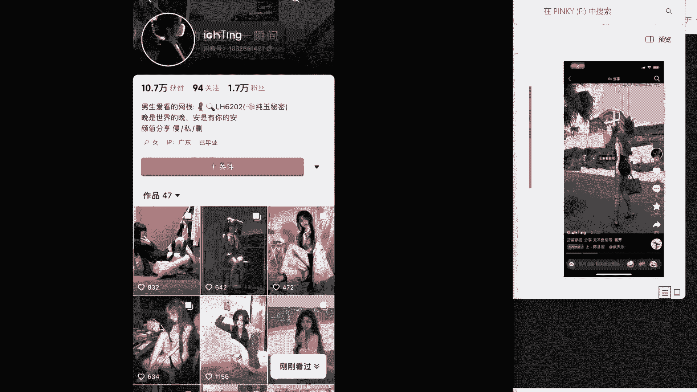

# 【全干货】私域自热引流实战课程之抖音篇（1） - P1 - 私域学前班 - BV1Fw4uemEct

哈喽B站的小伙伴们大家好，今天主要给大家讲一下，我们智能引流系统课的第一节，也就是说作为小白，我们入局肆意引流，如何从0~1跑通，以及1~100放大的这个问题，最近经常很多人问我说，作为小白。

应该怎么样在抖音上面玩自热引流，需要准备什么，首先一机一卡一号这些最基础的准备好了以后，我们再去找一个模板，模板，在我们整个自热玩法体系里面，是非常重要的一环，有在我们社群的小伙伴们。

都可以加上我们的抖音模板群，我先给大家介绍一下模板，如果说我们把这个模板比作一幅画，那么我们要做的就是去模仿，把这幅画90%都给模仿下来，剩下的10%，再按照我们自己的一个网感去进行调整，也就是创新。

然后我们这个账号和设备模板都解决好了以后，直接去发作品就可以了，发完之后，怎么去判断自己的这些操作是不是正确的呢，首先第一点，发完作品以后，我们就看一下我们的作品能不能过斗家，如果能过抖加。

说明你的设备网络账号模板，这些通通都是没问题的，如果说不能过斗加，那么我们就应该会分别逐项的去排查，我们的这个账号，网络设备模板这些看一下是哪方面出了问题，这个我们一般都可以先发个随拍，看一下能不能过。

然后这里具体我们说一下，如果能够斗加以后，它可能会出现的两个问题，比如说第一个就是播放量卡在500以下，一般都是100到200之间，这种情况通常都是账号的问题，账号的权重不够高，导致的流量起不来。

这个时候就需要我们正常的去模拟真人用户，进行一个养号，比如说我们可以点点外卖，然后买买东西，看一下直播，这样这些都是有助于提高我们账号的，一个权重的，具体养号多久，这个没有一个具体的时间标准。

只要说你养了以后，你发的作品能正常过斗家，并且它的播放量过了500，这样也就可以了，如果说你的作品播放量一直卡在，500~1500之间，它跟你的账号权重没多大关系，主要是和你的模板内容有关系。

一个好的抖音模板，它的风口是很短暂的，可能过个几天他就不能用了，或者说没有流量了，特别是现在平台严打这个作品同质化，所以说大家最主要的还是要去，锻炼一下自己的网感。

那么当我们这些底层逻辑全部满足了以后呢，我们就可以开始在作品里面，当我们的一个钩子了，这钩子我们主要就是放在主页简介背景墙，或者通过一个拉群，然后创建作品合集，这么几种形式去把它展示出来。

这里顺便给大家说一下我们是怎么样测模板的，一般我们都会同时先看几套模板，然后看完之后会安排几个账号同时去发，发了以后把这些个账号全部搁置一天，看一下，第二天他的一个数据，如果说这几个账号的数据都很差。

那么就直接换模板，一定一定不会死磕，如果说测出来一个好的模板，我们就会马上安排待发几十个账号同时去放大，这个时候就不需要再进行调整了，一个好的模板在抖音里面，比如说我们看到了。

然后转发到了我们的模板群里面，他经常过个几10分钟就看不到了，就挂了，因为一个好的模板流量起来是非常快的，非常迅速的，对于小白来说，如果你有三四台手机，可以先去测一下模板，看一下哪个数据更好。

哪个镜线更好，流经线的情况下，就可以马上安排大量的分发，去进行一个矩阵的操作了，他抖音的一个推流逻辑和小红书有一点不相同，抖音它是一个竖版，需要我们一个视频，一个视频的刷，小红书不一样。

他的首页同时展现出来的是六七个作品，所以小红书的封面和标题是非常重要的，要能一眼把人勾住，那么对于抖音来说，刷到这个作品如何把人勾住呢，首先一定是内容和音乐，抖音一个很关键的数据。

就是前五秒的一个完播率，所以说他这个作品的开头很重要，然后再搭配一下文案，引导用户进行一个互动，做好闻播和互动，这两个数据作品自然就会有推流，这个是永远雷打不动的一个底层逻辑。

下面我们来看几个简单的案例。

比如说这个嗯，这个你们看懂了吗，他这就是一个小国的一个模板，小国这个大家都知道吧，就是这些算什么什么，你看他的一个钩子就在这边这个这里，这里还有两个群聊，我们点进去看一下他的群聊。

你看这个群聊里面都是这些算什么什么的。

这就是他的一个钩子，然后我们再看一下这个。

这个文案这些你看很明显，你看他的钩子在这边。

这些是评论区，我们再看一下他的主页。

他的一个商品橱窗，这就是卖一些大蓝玩具的一个模板，然后第三个，这个他这个视频的开头，就是典型的以一个很夸张的形式去展现出来的。

他这个是一个祛痘的模板。

看着就是前面我们说的拉住用户的停留，以长痘的话题吸引用户的注意，利用差异化制造话题，引导用户互动评论，我们看一下他的一个评论区，只要有人在你的评论区评论了，就能为你的作品带来热度。

然后看一下他的一个主页，现在我们没看到他的钩子是吧，你看他的他的钩子就展现出来了，就在这里，然后什么什么皮肤管理师，这些就已经很明显了吧，看他发的一些作品。

我们看下一个案例，这个就是一个图文的方式去展现出来的，他这就是抖音的图文吗，我们看一下他的主页，他的钩子就是放在这边，什么爱看的网站，这个用的是谐音，然后这里。

这个就是打的是那种S粉，最后再看一下这个。

这个就是一个交友的模板，这个交友在抖音上面还是很好打的，它也是以图文的形式去展现的，就简单的一张图片加几个文字，这种模板是非常好复制的，你看看一下他的评论区，很多都是这些想交友的。

看他的这个点赞量跟评论数数据都非常不错，然后我们再看一下他的这个主页，你看他的这个就属于说是把这个钩子，直接放在这个主页的背景图，看到了吧后他在这边简介里面会稍微做一下，写一下。

他这个作品合集这里也是放了一个钩子，我们可以看到他这些作品其实数据都还可以，也是简简单单的一个图文。

这种题材在抖音上面还是很好打的，好了今天的第一节课就先这样了，对这个课程有兴趣的可以点个关注，后面我们会继续更新其他平台的一些自热玩法，感谢大家观看今天的视频。

