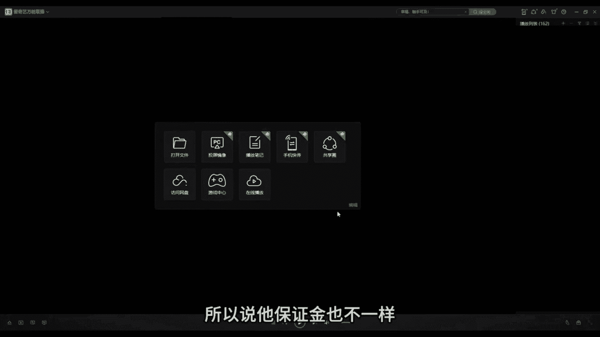
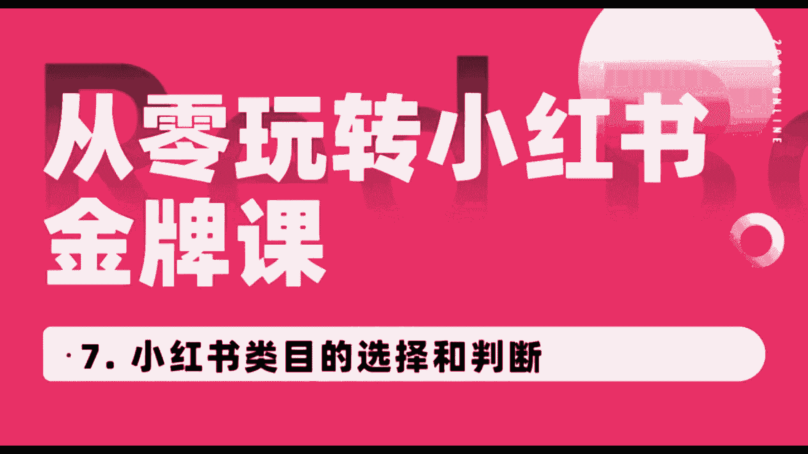

# 【全站最强小红书起号教程】从零开始暴力起号（专为新手小白准备）强到令人窒息的运营，半个月实现0粉到十万的突破！！！ - P1 - 招牌火龙果3 - BV1JhpdezEst

nice一个新手从零开始做小红书后。

30天之后月入5000块钱有可能吗，在小红书认真发布帖子的博主里面，月收入超过1000块钱的占到了57%。

月收入超过5000块钱的占到了28%，也就是说，只要你开始做了小红书，就有28%的概率，纯靠小红书就能养活你自己设置的先驱，我会在接下来的几分钟里，让你获得这28%的入场券。

首先我们要知道小红书是一个什么样的平台，它的本质是一个社交分享型平台，我们要注意里面的社交和分享，所以要为他人提供有价值的内容，是做起来一个小红书号的核心，所以有四类人是不适合做小红书的。

第一不喜欢创作和表达，没有持续输出内容能力的人，第二不善于检索阅读和总结信息的人，第三心理脆弱，容易放弃的人，第四没有执行力的人，这四条只要你占了一条，后面内容你都不用再听了，直接评论区找到我。

先提高你的基础能力再说吧，如果你一条都不占，那么恭喜你，基础能力是没有问题的，接下来我们会手把手教大家解决三个问题，第一如何从零开始起一个号，第二如何保证持续有高质量内容的输出。

第三如何确保内容能够变成收益，这三个问题我会分别分为起号篇和变现篇，两期讲给大家，本期是起号篇，起号第一件事情不是起名，不是搞头像，搞简介，而确定自己到底要卖什么赚钱，它决定了整个号的方向。

我们做小红书不是为了做慈善，做分享，我们做小红书的唯一目的就是赚钱。

有些人辛辛苦苦运营了半天，有了几千几万粉丝了，然后发现自己的方向赚不来钱。

比如有些人喜欢做每日好剧，好剧分享每日读书，打卡的好，热度也很高，但没有什么商业价值，这种核心的问题就在于，一开始就没有想清楚。

自己这个号到底要卖什么东西，所以第一步你要确定的是，自己到底要卖什么产品，然后在这个方向上确定号怎么做，你要卖衣服，你就做穿搭号，你要卖付费课程，你就做培训号，你要卖吃的，那就做美食好。

你自己擅长不擅长某个领域，并不是你选择方向的依据，选择方向的依据是你要在这个方向上，第一能够持续创作内容，第二有产品可以交付，那就可以去做，至于擅长不擅长不擅长，你可以学呀，所有人刚起号的时候。

都不可能比这个领域的大V更加擅长，能力都是做着做着就起来了，就算你刚开始不懂传达。

你做上200个传达的帖子出来，你还不能不会吗，如果实在不知道该做什么，这里可以给你一个参考，小红书里面最赚钱的领域是家居护肤，其次是情感健身健康，母婴和美食，其他领域的收入普遍都没有这些高。

所以你在这里面随便挑一个，你可以做的就可以了，确定方向之后是一些基础的工作，第一个是起名，给你一个万能模板，要做的事情加标签，加个人昵称，要做的事情和标签之间要有一定的反差感。

比如卖猪肉的转行医学生余裕，卖烧烤的下岗基金经理曾格，抑郁的心理医生刘六，不会穿搭的女装店主，不会做饭的美食博主，不会骑自行车的旅行，旅行达人，不会穿越的烧烤摊主，这种反差太好找了，如果不会搞的话。

来评论区找我，我给你起都可以，第二头像随便弄。

别经常换就行，没有什么讲究，第三把默认小红书改成自己的微信号，这样后面有人私信你，你就可以直接告诉他加我小红书号就可以了。

这样可以合规引流，第四简介还是万能模板身份。

我是谁加，我在做什么，加这个号会发什么，比如说这个人身份是九零后自媒体创业者，做什么，帮人搞流量，搞变现，号里面会发什么，会发小红书，运营自媒体干货IP打造。

第五是17下平台规则，第一禁止炫富，不要带给人焦虑，制造焦虑可以短期有流量，但长期来讲既会被平台打压，又不利于人设出塑造，第二禁止直接引流，帖子中间不能出现任何微信和公众号等信息，更不能出现二维码。

合规的引流方式，以后我们会讲，也可以直接看评论区置顶就行，但是在你彻底了解之前，千万不要直接领，直接引流，对你的负面影响一定会大于你所得的收益，第三不要出现不文明言论，不良言论，第四不要过度擦边。

第五不要抄袭大V的内容，可以借鉴选题，但不能抄写内容，第六可以发泄负能量，但不要宣传负能量，比如你可以说自己心情不好，但不要宣传人就应该抑郁不抑郁，不是正常人这样的观点，到这里，所有基础工作都做完了。

接下来是最重点的部分，如何做出好内容，如何把账号给做起来，做出好内容做起来，账号总共有五个方面，第一找到一个稳定的创作模式，进而找到一个稳定的素材来源，比如这个博主。

他的创作模式就是每次做一道新菜分享给大家，植物的做法显然是无穷无尽的，所以他这个模式可以保证长期持续稳定的更新，再比如这个人，你可以看到他的内容就是不同类型的衣服穿搭，衣服的类型款式。

穿搭的方式是年年都不同，无穷无尽的，所以它也可以保证自己源源不断的，有输出的内容，每一个领域都有类似的创作模式，稍微研究一下对标账号，你就可以把它搞清楚，如果自己只是有感而发，或者根据自己的经验。

人生经历知识去创作，你写个一二十篇恐怕就没东西写了，所以你必须要找到一个稳定的创作模式，和素材的来源，找不到评论区找我，我给你找，第二内容必须有价值，要么能解决需求痛点，要么能引起情绪波动。

如果别人想做红烧肉，但是不知道怎么做，你教会了他，这就是解决了需求，如果他晚上刷了小红书的时候，肚子正在饿着，你给他提供了一个美食视频，这就能引起情绪波动，这二者同时都有算是满足底线要求的合格内容。

只满足了一条属于低质量的内容都不满足，那就是毫无价值，垃圾内容没有发出来，任何必要发出来也没什么用，但是即使是两条都满足了合格的内容，也不一定有什么流量，自媒体发展到了现在，大家已经不是比的。

不是谁能合格了，而是谁能考90分，不说红烧肉了。

就算你想学黄焖大闸蟹，花式小龙虾，网上都有无线的教程给你看。

用户晚上刷到的可能是成千上万个美食视频，根本不差你一个，所以如果你要做满足需求的内容，你必须讲得比别人更清楚，更全面，更容易理解，更有帮助，如果你要做让人能情绪共鸣的内容，那你就必须更垂直，更有差异化。

曾经你说自己是创业者，就能让人认同，但现在你必须得说自己是大一在读，创业，985创业辍学创业，有这些标签才可以，曾经只要你的选题是小白，如何从零开始学会创业就可以了，但现在卖创业课的人呢，选题都是负债。

如何翻身，穷人如何翻身，才能引起人的共鸣，在这个内容饱和的年代，情绪价值比内容本身更有价值，别人看见你的选题，至少有点进来的欲望，他才会点进来，比如我这边如果教小红书运营教程，那就没有什么爽点。

也没有什么点进来的欲望，但如果叫做小红书，如何从零开始，30天之后月入5000，看见之后阅读点击欲望会不会就更强一些，但这并不代表只有情绪价值就可以，如果你的内容只是看着爽，但解决不了人的痛点需求。

那他可能只是流量比较高，但你没办法变现收钱。

比如张三生病了，你每天更新十个图，告诉他，我靠，要开心。

要乐观，不要难过，然后他哈哈哈哈，笑完给你点了个赞，转头就给另外一个搞医学科普的人付费了，所以好的内容一定是，同时既满足情绪需求和价值需求，而且这里会有一个雷，这里做干货内容的人。

总是以为自己就能解决需求了，但是内容有干货和能解决需求，它不是一个东西，张三生病了，他最想知道是自己怎么治，能不能治好，多久能治好，有没有后遗症，你讲你为啥得这个病，你得这个病的原理是什么。

人家不关心，你讲的再专业，再有干货都没有用，所以准确的识别需求是很重要的，这是一种网感，你要慢慢培养，如果你翻了一大堆内容号，就是起不来，那八成是因为原因，内容不行，要么没有情绪，要么没有价值。

自己回去分析分析原因，如果还是搞不清楚，还是评论区找我，我给你看看，第三个是封面，既要引发用户兴趣，又要解决用户问题，情内容的情绪价值和痛点价值。

全部都要体现在封面上，具体的操作因为因领域而异，比如说搞穿搭的照片要有个性亮眼，而且要养眼，搞美食的图片拍出来有食欲就可以了。

搞知识的要展示出最引人注目的观点，让别人能关注到你，如果你灵感迸发，想到了一个天才文案，写在封面上，靠着封面说不定就能爆一个帖子，这个我没有办法通过一个万能公式，去让你百分之百的掌握怎么做封面。

这是一种感觉，只能多去揣摩统领域的大号，然后自己去试，做的多了自然就会了，如果怎么做都搞不定，还是来找我看看就可以，第四账号，你要做出个人风格，这个牵扯到个人IP的问题，后面我们会详细讲。

这里就是说说白了就是让你懒一点，不要瞎折腾封面，不要乱换，一直用一套模板就可以了，视频的片头音乐不要乱换，一直用一套就行了，说话的风格不要刻意去学别人的，按自己的习惯坚持表达下去就可以了，比如这个人。

你看他所有的封面都是一个风格，时间长了就记住他了，第五是宁可减少数量，也要保证质量，如果能三天更一篇牛逼了，就不要一天更三篇垃圾了，但是你要保证更新频率稳定，你不要两个月更一更，一个月之内一定要更一篇。

如果一个月之内没有更新平台，就会觉得你断更了，流量会少很多的，到这里，如果今天讲的东西全部都搞定，坚持做下去，起号绝对不是问题，变相关有五个后续变现，相关有五个问题。

第一如何让同样的内容阅读量跳跃式的增长，第二个如何大规模跳跃式的涨粉，第三如何安全高效的引流和变现，第四如何让帖子发布一年后也能继续带来收入，第五小红书群体的赚钱逻辑是什么。

这五个问题在下一期变现篇中会详细讲，迫不及待的，想看的可以看评论置顶区就OK，做了几周甚至几个月连1000粉都没有破的。

评论区找我，我帮你看看好，你好，我叫阿强，我是咱们王导主电商学院的小红书官方讲师，从今天开始就由我来和大家一起来呃，学习我们小红书小红书整体的如何去做的对吧，我们店铺如何去做。

我们小红书的IP如何去打造，以及我们关于一些呃剪辑方面的问题，都会跟大家讲的很明白，很清楚，好吧呃，那我们今天这节课先跟大家来聊一聊，我们小红书的电商的整体的一些介绍，好吧，额。

那我们会从两个方面会跟大家具体来讲一讲，首先会跟大家来聊一聊，为什么我们要去做小红书电商，今天的主要目的就是跟大家来聊一聊，我们整整堂这个我们的课程里面，会按照一个什么节奏。

什么步骤来跟大家呃讲我们的小红书课程，首先为什么我们要去做小红书呢，首先你要大家要知道趋势很重要，小红书它目前算是整个互联网中，风口已经算比较大的，但是最大的流量大家可能也知道，肯定目前肯定是抖音对吧。

但是小红书它目抖音它已经处在一个风口，但是它在逐渐下降的，而小红书其实你会发现，他每年他每个月的和热度啊，以及流量的，都是一个处在一个持续上涨上涨的一个状态，所以说其实大家和我们一样。

其实也是看到了小红书它的风口，它的流量，所以说我们才会去做小红书对吧，才会去越来越多的人在小红书里面赚到钱，也有越来越多的人开始入局小红书，所以说趋势很重要，这个就是目前它的一个风口的趋势。

所以我们也需要大家去顺势而为，而不是逆水行舟对吧，那目前小红书它是一个什么平台呢，首先第一个它是一个电商平台对吧，我们可以在里面买东西，以及可以在里面卖东西，以及它是一个直播平台对吧。

它是一个买手平台对吧，大家要明白这三个点就很重要，以及目前小红书相对于其他的一些平台来说，比如说一类电商的淘宝，天猫京东这些是稍微比较简单的，而且相对于抖音来说也是比较易上手，成本比较低的。

那他具体从哪两个方面呢，首先它不需要大家去囤货，不像抖音天猫淘宝这些，它需要大家有货源，有工厂对吧，他不需要你去说固定，我必须得去直播对吧，直播卖货这些都不需要我，因为我们大部分做小红书的人都应该知道。

他是可以有一个叫做一件代发的，我们可以让别的平台帮我们发发货，我们自己不需要去发货，以及他对于像抖音来说，抖音如果说你不实拍的话，或者说你是全部混剪的话，他肯定会很容易被呃配被判为这种搬运啊，混检啊。

会判会被判为违规的，而小红书不一样，小红书我们前期做的话，不需要你去实拍对吧，而且不需要我们自己去买样品，我们不需要花费大量的人力精力，我们去做混检就可以了对吧，提供呃，你可以自己去寻找一些素材。

通过这些素材做一个混剪，做一个简单的混剪，就能获得一些稍微大一点的流量啊，形成啊，出单等等等等对吧，形成这个店铺的一些火爆的流量，很简单好吧，那第三个点，它目前来说，竞争压力相对于来说也是比较小一点的。

因为很多传统的电商的卖家呀，还没有开始完全的入局小红书这个平台，还有很多人甚至都不知道小红书平台，而目前呃，2024年也确实是小红书，他的一个新一轮的风口，所以说我们大家一定要抓住时间对吧。

抓紧时间去入驻小红书这个平台，也是目前我们呃，大部分人想在互联网上翻身的一个机会，好吧，呃那这个就是我们跟大家讲一讲，具体我们为什么要去做小红书的好吧，那接下来我会通过三个方面跟大家来聊一聊呃。

接下来的课程的内容好吧，首先呃先会简单的跟大家讲一讲，我们的小红书店铺的如何去操作的，我会跟大家简单做一个预告好吧，我们如何去看我们的课程，我们的一个正确的步骤，我们怎么去操作的。

我会从几个步骤来跟大家来讲一讲，首先第一个第一个我们肯定是开店对吧，店铺的一些基础操作，我们对吧，不管说你目前以前有没有开店，或者说你以前店铺操不操作，我们先如果说大家都没有的话。

我建议大家先把我们这个开店的流程，都给大家看一遍，我们开店的整体的流程，以及店铺的一些基础操作对吧，那啊具体怎么去操作呢，我们会第第二节课里面会给大家讲，用什么账号去开店，用新号还是老号对吧。

第三节课第四节课我会跟大家讲讲，我们如何去设计开店，一个人如何去开多家店铺，我们后期想做矩阵，我们如何去操作，以及我们第五节课，第六节课会跟大家具体来讲一讲，我们如何完成店铺的一些基础操作。

我们地址怎么去填写，以及我们怎么去发货呀，以及我们等等等等怎么去上品啊等等，都会跟大家讲，这是我们第一部分，第二部分会跟大家讲讲我们怎么去选类目的，分析一下我们类目对吧，我们内幕其实也是很重要。

我接下来也会跟大家讲啊，其实我们这个方向其实永远比努力更重要，我们要选对方向，这一一大点我会具体跟大家讲讲，如何去选类目的，以及我们选好类目之后，我们如何去养号呀，我们如何去找到我们的对标账号。

以别人学得好的，别人做的好的，他肯定是有一些好的地方我们可以借鉴的啊，这两节课我会具体来跟大家讲一讲，我们养好号之后，我们如何去选品啊，我们类目也想好了，那那我们得去选品，我们通过什么呃。

在什么地方选品呢，在淘宝抖音拼多多小红书里面都是可以选品的，以及我们选品的一些底底层逻辑对吧，以及我们用一些大数据来观察一下，怎么去选品的问题，好吧，呃这是选品的问题，以及我们去选完品之后。

我们怎样去做一些营销的活动，比如说上架优惠券等等等等，我们通过手机端上架产品对吧，电脑端上架产品是吧，以及优惠券怎么去设置客服的聊天等等等等等，这些我都会具体细节方面跟大家讲一讲。

以及我们这些品都上完了，店铺都开完了，那我们开始找素材写笔记了，我们如何去写，写出我们高效的笔记，写出我们爆款的笔记，找到我们爆款的素材对吧，我们在哪些地方找呢，如何在拼多多淘宝里面找。

以及在更多抖音小红书里面找素材，我们的封面笔记标题，我们如何去正确操作，才能做出我们爆款的笔记，爆款的视频对吧，我们手机端如何去发布笔记，电脑端如何去发布等等等等，这个我们会在找素材写笔记。

这里面跟大家讲的很清楚，以及我们会跟大家具体来讲一讲，我们写完笔记，我们笔记后端的怎么去分析它，我们获得如何通过官方来获得更多大量的流量，我们小红书笔记流量整体的分析，以及小红书模板的如何去正确使用。

总共会有大量的模板可以使用，以及小红书如何去日常维护对吧，维护他对吧，让更多的人吸引到我们的账户里面来呃，我们发了一条作品之后，如何去维护它，如何能给他获得更多的流量，如何如何把别人留下来。

如何让别人来出单对吧，小红书如何去使用1688拍单，如何我们使用吞金吞金软件，以及我们如何跟厂家对接等等等等，这里面都会讲的很清楚，以及最后我会给大家讲一讲如何去发货的，小红书的订单。

揭秘我们如何获得更多的私欲额订单对吧，获得订单之后白奖啊，发给人家第第三方平台对吧，我们行程一件代发，以及如何我们使用呃处理店店铺的售后问题，以及小红书如何去报备店铺对吧，这里面都会讲的很详细。

跟大家讲，这是关于小红书店铺的一些呃操作的，那店铺操作完之后啊，我们要打造自己的IP对吧，我IP课程我认为呃还有很多朋友跟我讲说，确实想学IP了，这个课程里面也会跟大家具体来讲讲。

如何去打造自己的IP的对吧，什么是小红书IP，如何确定你的赛道，找到细分领域对吧，找到账号的精细化运营，以及怎么去选题的对吧，我们笔记内容如何制作，账号笔记整体怎么去复盘对吧，如何形成商务变现。

思域产品如何发布，如何导流的对吧，以及我们思域怎么去变现的，这个是将近十节课程里面，我们会跟大家讲一讲小红书IP的，最后我们会来讲到如何我们小红书素材的混剪，剪辑篇对吧，我们如何去把人家的视频保留下来。

我们如何去剪辑的，我们去如何去，如果说后期我们自己去拍摄的，我们拍摄的工具，那构图以及口播如何录制，拍摄素材，初剪的如何添加贴纸啊，添加转场特效，字幕音乐音音效背景音乐对吧等等等等。

这里面都会讲的很详细，好吧好的，那我呃这个就是咱们今天的课程，我们下节课会跟大家去具体来聊一聊，今天来跟大家讲一讲，我们哪些账号适合我们开通我们小红书的店铺，我们会从三个方面来跟大家来讲一讲。

我们这堂课首先会跟大家讲讲，不管说你人是在国内的还是在国外的，我们都是有办法来开通我们小红书店铺的，或者说很多人想了解目前我的账号是一个新号，我们是呃或者是一个老号，我们到底我们的账号是否去。

可以去开通小红书店铺的对吧，或者说呃目前我想了解一下，我的账号到底是否被限流的等等这些问题，我今天课程里面都会跟大家讲的很详细，首先呃不管说你是人在国内还是人在国外的，其实都是可以去开通小红书店铺的。

第一种情况，你如果人在国内，在我们中国大陆内对吧，有我们大陆的身份证的对吧，那我们直接可以去用身份证，开通一家个人店铺就可以了，小红书店铺跟其他平台的一些店铺，开通店铺条件还是不一样的。

它整体来说还是比较宽泛的，呃因为你像其他店铺的话，整个条件还需要你有营业执照，而小红书开通我们个人店的话，并不需要你去有营业执照，开一个个人店就可以了，有一个身份证就可以了。

第二个你如果说是在国外的对吧，但是你也有大陆身份证，那没问题啊，我们也是可以用身份证开一家我们个人店好吧，呃就是你首先第一个条件，你如果说不管人在国内还是在国外，你有身份证就可以开通了，第二个呃。

你如果说人在国外，但是你也没有大陆的身份证对吧，没有大陆身份证，那怎么办呢，我们就需要有一个海外的营业执照开通，可以开通一个专卖店和一个旗舰店，我们也有学员，他是人在国外的，但他有自己的货源。

他们自己有外国的一些货源，那他想营销到中国来，怎么办呢，那就需要有海外的营业执照就可以开通店铺，就可以呃营销到国内了好吧，但是它只能开通专卖店跟旗舰店好吧，呃这个是一个条件。

我们不管人在国内还是在国外都可以开店，第二个就是我们考虑到我们新号还是老号，我们如何去开店的问题，不管说你是新号还是老号，其实我们都是可以去，如果说条件允许的话，都是可以去开店的，好吧。

呃都是可以去发布作品的老号，首先我们分为你之前有没有发过笔记，如果说你之前没有发过笔记，那没有问题啊，第一种条件，如果说你没有发过笔记之后，这个号之之前是我自己，我自己在用的，我经常天天在用吧。

天天在刷一些我自己喜欢的内容对吧，而且这个喜欢内容，可能跟我自己接下来想做的内幕是有点区别的，所以我们最好是要换一个专门的新号，专门的信号，因为可能这个标签就不精准了，跟我们未来想打进这个人群的标签。

肯定是有点冲突的，有点冲突的，因为我们自己用的账号嘛，标签啊，什么都呃呃都都有了，后续来说不太好养号的好吧，第二个呢，如果说你之前对吧，只是注册过，但是没怎么用的，这种情况呢可以用这种账号。

我们因为这种后续是比较好养号的，比较可以自己自己使用的，如果说你之前发过一些日常内停的笔记，一方面要看这个号自己刷的多不多，如果说你这个号啊刷的比较多，那我们就需要及时给他换掉对吧，因为你刷的多了。

你这个发货笔记了，你经常标签，我还是那句话，你标签乱了，标签乱了话，你想后期再养改过来，那难度还是比你重新再培养一个号的，难度要大的，如果说哎自己刷的不多，而且发的笔记啊，整体流量也不是很好的情况下。

那是因为他没有打上足够的标签嘛，那我们就可以自继续使用，另一方面呢要看笔记报没报粉丝，账号的整体的粉丝数量是怎么样的，如果涨得不多，刷的不多，笔记也没怎么报过，那我们可以删掉笔记，因为我刚刚讲到了对吧。

你整体的流量不是很多，因为你没有打上足够的标签，那我们就可以用，如果说你刷的不多，之前发了其他类型的笔记，且有了一定的粉丝基础，我打上人群标签了，人家都都都能刷到我的账号了。

那我们就需要果断果断的换掉新号，要不然你这个老号后续如果说标签很乱的话，你再想把这个标签给他改正的话，难度肯定是比你培养一个新号难度要大很多的，而且我们接下来也会跟大家讲一讲。

我们新号如何去养号的问题啊，好吧呃，这是第一第一个老号的问题，如果说新号的话，其实我们自己如果说我们没有这些问题，我们自己做一个新号也是没问题的，我们会对吧，那如果说你还是拿不准。

我们自己到底是否用自己老号，那我建议大家直接就换新号，找自己的家人帮忙注册一个信号就可以了啊，找自己的家人，一定要是比较熟的家人，因为这个的话后续还得考虑到一个银行卡，人家打的成交额。

打到银行卡里面的问题，好吧，这是第一个新号老号的问题啊，第三个我会跟大家讲一讲，如何去测试账号的是否被限流，而正常情况下，我们账号如果说没有出现大量违规的情况下，正常情况下是不会有太多限流了。

大家不用太过于担心好吧，如何知道自己的账号被限流呢，我们可以通过这个方法测试账号的限流方法，我们可以发布一个日常分享的一个笔记，发布什么都行对吧，正常一点的笔记，日常的分分享的生活就可以了。

看24小时内的流量情况，如果24小时后流量能达到50左右的对吧，那么正常流量是正常的，账号流量是正常的，如果说连50都没有，可能只有一个两个这种额流量的，那说明你一个账号可能会处在违规阶段的好吧。

如果说不正常被限流了，那我们怎么办好吧，上面之前可能有违规的，或者存在潜在违规的，我刚刚讲到流量很低的，我们建议注销掉该账号，重新注册就可以了啊，重新注册完之后，这一位是一个型号。

我们在做继续培养就可以了，好吧呃这个就是大家呃跟大家讲一讲，我们如果说我们怎么去选择账号，以及我们如何去测试账号的流量的，大家不用去担心对吧，我们开一个新号，开一个老号的问题，我建议大家呢。

除非说你之前的账号做的很好啦，或者要不然，你我建议大家还是去可以注册一个新号。

重新养号好吧，那我们今天这个第二节课程就到这边，今天我们来讲一讲，我们第三课程，小红书开店的一些基础的一些流程。

我们如何去开通我们的个人店，个体店以及我们的一些旗舰店啊等等等等啊，我们先从我们的个人店开始来讲呃，首先我们个人店的话是可以通过手机开通，也是可以通过电脑开通的，手机开通的话，我们就下载一个。

我们我们可以用小红书本身的账号也可以，或者说我们下载一个小红书的千帆，我接下来也会跟大家具体来讲一讲小红书，千帆好吧，我们需要的需要的证件，需要你有一个身份证以及有一个银行卡呃。

但是这个一定要是同一个人才行对吧，你身份证跟你银行卡绑定的是同一个人呃，这个是必要的条件，因为他后续，所以说这个如果说大家是用自己家里面人，或者用亲戚绑定的这个身份证的，绑定这个账号的。

所以说一定要找比较熟悉一点的对吧，要不然后续会考虑到一个经济纠纷等等对吧，这是第一个，第二个呢就是我们开店过程中经营的类目啊，其实可以前期随便选一个，先把店铺开通了再说。

反正呃后面啊反正可以随时在改类目，因为我们叫如果说你想持续做的话，你要交交保证金对吧，但是我们在开店的过程中，保证金可以先跳过，先不用交对吧，店铺可以随便取，后面我们后续我们再改都可以好吧。

经营的地址呢也是可以随便填写的，这都没问题好吧，那具体的开店步骤，我来跟大家来讲一讲怎么去操作，首先第一步打开我们小红书的搜索栏，这是我们普通的系统，打开我们小红书搜索栏，你看到了。

这是我们小红书搜索栏，我们在上面搜索开店两个字，搜索开店两个字，打开开店了，看到开店，我们搜索开店这边有个小红书电商，小红书电商官方平台，点击开店，我们就点击这个就可以了好吧，点击开店之后。

点击另一即开店，这边跳出来之后，我们这边有个立即开店呃，我们可以先看一下，比开店必要必看的一些材料费用，而正常情况下开店是不需要你，如果说开个人店的话，不需要收费的，零元就可以开，开通了服务费优惠。

流量扶持必备工具，选择立即开店，选择立即开店之后，我们选择店铺的类型对吧，我们前期我们可以先选择个人，选择个人店对吧，个人店的话只需要你有身份证，如果说你想开一个个体店的话。

需要有营业执照以及运营人的身份证证件，这个的话是支持一部分的类目的对吧，然但是如果说你想开通个人店，后期也可以转为个人，个体工商户店都可以的好吧，如果说你是企业的话，也可以开通企业店。

但是企业的话可能会以额以及专卖店，可能会呃考虑到一个税务的问题好吧，关于开通电，我们点击店铺选择完之后，我们点击下一步对吧，它会里面会有很多店铺的介绍，我们就选择个人店，选择嗯。

你自己想要的店铺就可以了，选择完店铺之后，我们选择点击下一步，点击下一步邀请码，我们可以跳过对吧，没有可以不填，这是关于服务商的呃，我们填写其中的一些信息，身份证的正反面照片啊。

以及我们这边可以选择属于零星小小额交易，依法无需要办理的，以及如果说我们是农副产品的，需要办理的对吧，开店必备的，我们这里面也是有一些开店必备的个人身份，个体户的企业啦等等等等。

电商我们去填写一些自己的一些信息就行了，很简单好吧，不呃有很多信息，如果说你不需要可以跳过的，你可以先跳过对吧，我们选择个人身份，个体店，电商用品就可以了，选择立即开店。

正常情况下我们的店铺就可以开通了，好吧，这是我们开店的步骤，那有几个注意点跟大家讲一讲，首先呃，后续提现的金额会进入开卡身份证人的银行卡，所以说这个就是刚刚跟大家讲过的，我们需要开卡人的身份证。

跟我们的这个银行卡需要是同一个人，好吧，呃以及我们如果说多开店的话，最好找熟悉的人来开对吧，亲戚朋友啊，个人店正常情况下呃，当天时间，如果说你这些信息填写的都没有问题的情况下，当天他就可以下来了。

小红书的名字，也就是店铺的名字，比如说需要注意的是提前查重对吧，我们小红书店铺的名字也也可以提前，可以前前期可以先随便选一个，后面也可以改对吧，但是七天改一次，比如说你这个小红车名称叫111。

那你这个店铺名称就叫111的店，个人店不需要缴纳600块钱的证件费用的好吧，这个是我们跟大家简单来聊一聊，个人店保证金的话，1000块钱大概在1000块钱左右，也不一定根据不同的类目来分好吧。

最低应该是1000块钱，这个有个平台的扣点，平台扣点大概在每个月成交额的5%，因为基本上所有平台他都会有一个平台扣点，低于1万元的，是不收这个平台扣点的，一个自然月订单金额呃，结算额小于一元1万时。

平台免收技术服务费，懂我懂我说的意思吧，假如说你这一个月整体的收入在小于1万元的，成交额在小于1万元的，他是不收你的技术服务费的，结算额超过1万元部分平台按5%收比。

比如说你今天呃这一个月成交额超过了2万，那你超额2万，那里就有其中的1万，你要说给平台一个5%的收服务费是吧，1万元的结算金额已减去退款金额，基础服务费小于5%的店铺，不想收5万元和以下的棉袄。

这个大概大家了解一下就可以了，好吧，这个是关于个体店的个体店的一些部分，大家可以去开店呃，了解一下，如果说你想开个体个体店的话，就需要我们实名小红书的账号呃，以及加上我们的营业执照对吧。

需要是同一个人的，就比如说你小红书是是是谁的营业执照的法人，营业执照上面的人最最好是同一个人，就要同一个人，然后我们可以通过手机开通手机，打开我们小红书的商家版，目前也叫小红书千帆好吧。

呃小红书千帆给大家打一下吧，后续也会跟大家具体来介绍千帆，然后大家可以下载这个手机，开电脑，开通的话，打开小红书呃，千帆千帆的官网就可以打开里面去注册了好吧，我们的专卖店旗舰店，如果说你确实是有专卖店。

旗舰店，也是可以按照我们刚刚的步骤去开通的，呃接下来讲一讲我们一些特殊的一些类目，可能是比大家比较想了解的，比如说酒水啊，零食啊，水果啊这些需要有营业执照加食品经营许可证。

加上品牌授权的这些基本上都需要的，但我建议大家就是，如果说你不是特别擅长于这几个行业，尽量就先别入局这些好吧，美妆行业呢需要有化妆品备案凭证，家电行业的需要有3C认证证书，3C数码的需要有3C认证证书。

其他的内幕的都有，具体的介绍，都能在我们小红书的内幕里面可以找到好吧，然后如果说大家有任何关于内幕不懂的吧，我们接下来也会跟大家讲一讲，怎么去选择类目的问题好吧，那我们今天这堂小红书开店的一些基础流程。

主要是跟大家讲一讲如何去开店。

步骤操作的好吧，那我们今天这个课程就到这边，大家好，今天我们来讲一讲我们的第四堂课，个人如何我们开通多家店铺。

我们后期如果说一家店铺做好了，我们想开多家店铺，我们怎么去选择，我们怎么去做矩阵的问题啊，呃我们会从几个方面跟大家来讲，首先第一个开多家店铺的前提，如何去开家多多家店铺啊，我们店群一些注意事项。

我们先来看一下开多家店铺的前提啊，所有的我们开通多家店铺的前提，一定是你已经能把你手里面的一家店铺给他，运营好了，我们再去做，你连你自己手里面的第一家店铺还没有做好，你就想去大量的去铺，大量的去做。

那是不现实的，你最终可能导致所有店铺都做不好是吧，呃这个是第一个前提，我希望大家听完我的课程之后，能把你的第一家店铺做完之后出单了，能有稳定的持续的出单了，我们再去大量的去铺垫好吧，这是第一个条件。

第二个条件，你能有大量的闲余的时间，空余的时间你去做对吧，我可能花一个店铺可能需要呃一个小时，两个小时，但是你可能花两个店铺可能就需要三个小时，四哦，五个小时六个小时了，就可能不是1+1=2的问题了。

因为两个店铺你可能会发生的事情，可能越来越更多好吧，否则你要先全力做好一家店铺，先把一家店铺做好，先把它整体的熟悉它的流程，整体的方法都给他熟悉了对吧，我们再去做其他的店铺，我们再把其他店铺给他做好。

我们再去铺铺大量的店好吧，这是开多家店铺的前提，我们要有一个稳定的出单，我们先稳定的能赚到钱啊，我们开店流程，我们运营流程，我们笔记啊，我们和混剪所有这些我都能学会了，或者怎么去铺货，这些我都能明白了。

我再去开多家店铺好吧，那我们如何去开多家店铺呢，首先流程流程方面，首先第一个小红书账号加实名账，账号的注册加实名对吧，我们用营业执照，这是第一个，我们可以用自己的家人重新注册账号，重新加实名，重新呃。

用身份证注册小店店铺都可以对吧，这是第一个方法，第二个方法呢，我们用营业执照可以注册成企业号，企业号也可以多开小店好吧，需要600块钱的保证金对吧，再去再去开个体店对吧，这是流程，第二个呢。

我们每多一个营业执照，就是可以多开两家个体店的，懂我意思吧，就是一个营业执照可以多开两家个体店是吧，你也知道可以在淘宝里面，或者说拼多多找人代办，正常情况下几百块钱就可以了对吧。

几百块钱和比如说你是做一个营业执照，可能只要个一一两百块钱，如果说营业执照加食品经营许可证，可能四五百左右，这个是需要身份证的，以及需要你个人提供信息的对吧，这个只要你找一个可以做电商的呃。

营业执照就可以了，并不需要说你还是需要线下的，只要你同类目的就可以了，好吧，这是我们如何去开通多家的，那我们开通多家之后，我们会有一个店群，那什么是店群呢，店群就是我一个店铺一个月能赚2万和一个月。

一个店铺一个月能赚5000，你想你想你想要哪个，我问一下大家，你想要哪个，你想要一个店铺一个月赚2万，还是想要一个月店铺一个月能赚5000，呃相信大部分肯定都是想做前者，但是难度以及付出的精力都是呃。

可能是N倍，你比如说一个店铺我做2万，但是一个店铺你做4万，可能你花费的时间是远远不止这个五千五千的，四倍的，可能十倍都不止，对不对，那我们可以放低标准呀，我们既然一个店铺能做到5000。

但是我们做到5000，做到1万，做到2万，难度很大，很很很高，那我们可以多做几个5000的店铺，那我们是不是一都都能起来了，懂我说的意思吧，在小红书这个方面跟其他电商其实也是一样，你能做起来其实简单。

但是你想做好做大做强，做到一个比较好的头部来说还是难度比较大的，所以说它跟其他平台不一样的一点，就是它能迅速的去复制复制，我可能我说一个一个店，一个月我能有5000块钱的利润。

但是我想一个月有2万块钱利润很难，但我可以做十个店，做20个店，每个店都有5000，这个难度肯定是比你能把一个店做到10万，20万，这个难度肯定是要低一些的好吧，因为我们整体的流程来说。

大家都熟悉了好吧，这是第一个，我什么是店群，那我们多开店需要有哪些注意的事项呢，首先一机一卡一账号，这个大家能明白什么意思吧，就是一部手机，一张电话卡，一个小红书账号是吧，主账号。

建议我们一一个账号放在一个手机里面，不要去一部手机，去多个账号去切换，有可能啊会你正常情况下一个账号违规的话，可能会连同其他账号也会判定为违规，懂我意思吧，所以说我建议是一机一卡一账号。

目前小红书多台设备，多个账号连载同一个WIFI下是不会受什么影响的，如果你同一个WIFI没有影响，但是你最好不要把多个账号登在一个，一个手机里面去对吧，呃而且呃正常情况下浏览器登录多个店铺。

一个电脑里面多登录一个店铺，多个浏览器也是没有问题的，好吧，赚钱呢其实就是一套行之有效的动作，持续复制就可以了，为什么说很多连锁店，很多连锁店可能一个连锁店可能能赚到一个，一年赚个几10万很简单。

但是你让他赚几千万很难，但是他去做连锁了，这其实就跟我们做小红书店群其实是一样的，道理好吧，大家要首先要明白这个道理，我们再去做后面的操作好吧，那我们今天这个个人如何开通多家店铺，课程就讲到这边。

大家好，今天来跟大家来讲一讲小红书店铺后台，我们如何去通过手机端设置一些内容的好吧，然后我们会以视频的形式跟大家展示一下。

首先呃我们打开的系统是这千帆系统，来给大家看一下小红书千帆，那大家能看得见吗，小红书千帆的系统，直接我们到应用商店里面去搜索，小红书签翻就行了，这个是我们后台呃，基本上会操作的好吧。

这直接到应用商店里面去搜搜搜索就可以了，我们打开之后，大家可以看到，我们打开之后，我们正常是这个页面，这是我们创的一个新店，基本上没有什么操作的，这边有一个消息，我们点击消息，点击消息里面。

这里面就是我们客服接待的一些通知，如果说有人问我们店铺的一些问题了，我们就可以在里面去回复他，在里面去回复他，这是客服接待的一些通知啊，都是可以在里面看到的，以及我们配置客服啊等等等。

这里面都可以看到看到吗，这是店铺的一些消息啊，一些通知啊，一些比如说你违规的通知啊等等，这里面都会有好吧，然后我们打开我们的首页，这里面有个区初始化，我们这边可以去填写一些信息。

以及我们这边有个全部工具，我们这边可以发布作品啊，笔记管理啊，电脑端啊等等等等，这边都可以，我们点击全部工具，这里面可以呃，给大家看一下啊，点击全部工具，这边有发布作品，全部全部发布商品。

我们可以发布新的商品，我们可以管理全部的商品，全部的订单对吧，售后的订单数据中心呃，商品笔记啊等等等等，这里面都可以，以及我们发布商品的类目啊对吧，品牌类目啊，店铺的装修群管理呃。

我们打开这边有个成长成长，这边正常情况下，我们先要去把这些给他完成对吧，才能继续后面的操作地址对吧，我们这边有个地址填写我们的发货地址，这是我们这是我们开店铺的第一操作，我们需要去填写我们的地址好吧。

我们就点击去完成，在这个地方也是可以去填写地址的，看到了吗，地址呢我们这边可以，这个时候我已经填好了对吧，我们正常情况下可以去填填，具体地址怎么填呢，这边可以看到我们联系人随便写，我们自己就可以了。

地址中国大陆选择了应该在的地区，详细地址呢其实可以随便填，因为我们是做一件代发的嘛，我们这个地址是是可以随便填的好吧，我们填写自己的手机号码，留给买买家留言，一定要之前有，这边是可以填写联系客服的。

但是现在联系联系联系不了了，我们一面前一定要联系客服给地址好吧，这是就是影响到我们一些退货的一些问题，如果说我们这边填线联系客服的话，他这边平台是不给通过的好吧，我们要在这个地方来填写地址好吧。

然后我们填写完成之后，这边可以填写我们的物流，物流板块对吧，我物流板块填写我们的名称，继续去添添加就行了对吧，我们添加呃，这边是可以添加我们的付运费板块的，你可以选择。

如果说大家看过抖店的这些应该都明白对吧，呃或者说你们不明白的话，我们可以添加运费模板，就比如说你是新疆西藏这些不配送的对吧，我们可以直接选择不配送，如果说需要付费的对吧，买家承担邮费的。

我们也可以去这边去选择非偏远地区的，或者说全国包邮的这些模板，我们可以它本身它会有系统默认的，但是我们正常情况下就选择这个模板就行了，不是全国班游嘛，因为这些地方我们都需要付邮费的好吧。

这些邮费也是比较高的，我们就这是关于地址的选择，再看这边发布作品，看到了吧，这个就是大家可能呃这边有一个优惠券，可以设置优惠券的，来给大家具体来跳一下，看一下，这边有个营销，这边有个优惠券活动报名对吧。

点击进去，我们可以创建自己的优惠券对吧，比如说你创建店铺通用的店铺通用的优惠券，指定商品的优惠券，店铺的新人券对吧，这些都是可以的，我接下来也会跟大家具体来讲一讲，怎么去操作的，全网自动推广的对吧。

正在生效的以及失效的等等，这些都需要大家去了解的，这边填完之后呢，地址填完之后，店铺的认证信息对吧，我们需要去填写你是个人店啊，什么店啊填写，然后缴纳保证金，如果说大家想长期在呃我们这个平台做的话。

我建议大家还是需要去把保证金交了，我们这边一定要注意，一定要去把这个微信支付给它打开，以及我们的支付宝支付，按照它上面的流程对吧，你填写自己的身份证号码，你银行卡只要在这里面操作，我们就可以。

人家就可以通过微信支付，可以通过呃支付宝支付了好吧，我们补交补交我们的额店铺的保证金就可以了，因为根据不同的类目，所以说他保证金也不一样。

那这个就是我们今天的这个小红书店铺，后台手机端的一些操作，大家多去琢磨琢磨，多去摸索摸索，基本上这个是没什么太大难度的好吧，刚刚展示了一下如何去使用呃，如何去设置地址呀，如何使用优惠券好吧。

那我们今天课程就到这边，大家好，今天来跟大家来讲一讲我们的第六堂课，小红书后台的一些技术操作呃，我们如何通过电脑端来操作的好吧，我们从几个几个方面来跟大家讲，第一个保证金方面，开通方式。

运费保的设置以及地址设置，这几个方面都会跟大家具体来聊一聊，先来讲一下保证金，保证金的话，其实我前面也跟大家讲了，我们前期的话是可以不用缴纳的，个人店的保证金在1000块钱左右，额在1000块钱左右。

根据不同的类目啊，他的保证金不同啊。

我们来看一下，这个是我们的小红书千帆系统，我们打开小红书千帆系统。

我们搜索小红书千帆，这里面有个资金，看到了吗，打开我们的首页，这有个资金，资金这边有一个保店铺保证金管理，店铺保证金，我们这边可以充值我们的保证金而带待补缴的，这是因为我选的类目比较多。

选择的不同类目它保证金不一样，我们只需要选择你自己类目，然后缴纳相应的保证金就可以了，好吧，这边有我们缴纳已经缴纳完了，或者说保证金退款，这个保证金大家放心，跟抖音其他平台也一样，他的保证金。

如果说咱们后期如果这个店铺啊不做了，他这个不管多少保证金，他是可以退的，但是这个保证金他也是会扣款的，他是会为了保证咱们店铺的一些客户，他们的一些权益，就比如说呃答应人家这个退款了。

但是我们实际上没有退款，他因以及实际上没有去操作一些他会扣取的，但是正常我们只要在不违规的情况下，他的保证金是不会扣的，以及不会扣太多的好吧，那我们跟也前期也跟大家讲了，前期是可以不用缴纳的。

但是我们后期如果说想要店铺做大的话，或者说我们想要开通一些其他的一些方式，支付宝方式的话，想想要开通微信的话，那我们必须要缴纳对吧，如果说想要长远做的话。

建议还是要去缴纳这个保证金的，就在我们这个入口去缴纳就可以了。

呃如果不缴纳的话，保证金是无法微信支付的，现在有很多年轻人都是使用微信支付呃，所以说呃你想要开通这个微信支付的入口的话，我建议大家还是需要去缴纳一下，缴纳完之后，支付宝跟微信都可以支付了。

这个是我们的一些保证金，大家可以看到，如果说我们个体店的话，基本上在1000块钱左右对吧，但是有很多类目，比如说二奢啊，这些全新奢侈品啊，珠宝玉石呀，家用电器啊，这些是我们个体店无法无法开通的啊。

个人店无法开通的，我们个体店可以开通，你可以去开通个体店，我们正常类目的话，你看个人店的个体店的话也在1000块钱左右，企业店的话也就在2000块钱到1万块钱。

2万块钱不等，好吧呃，大部分的个人个人店的保证金，以及个体店的保证金都在1000块钱左右，呃一些特殊的类目除外，我刚刚也跟大家展示了对吧，你如果说想要了解自己的店铺的保证金。

你直接去选择相应的类目就可以了，我们选择相应的内幕，可以这边可以查询一下对吧，里面都是有的对吧，以及我们的开通方式，开通我们的支付方式，刚才也讲了一个微信支付，一个支付宝支付，那我们在哪在哪设置呢。

其实也是一样，给大家放大看一下，我们打开我们的首页之后，这边有个资金对吧，也是刚刚的资金，有个贷贷款，贷款资金这边有个支付宝，是支付宝以及微信对吧，我们去开通就可以了对吧，开通方式其实很简单好吧。

支付宝的话，微信的话，支付宝当天我们就可以直接去注册了，微信需要去微信的话，是第二天他才能去设置的，好吧，第二天我们需要去缴纳保证金，提现金额是到法人的账户里面去啊，我们注册这个是小店啊。

支持注注册这个小店的身份证的法人里面去，他的微信以及支付宝，都是我们去按照他的要求里面去进行绑定，就行了，只要填写身份证以及啊，如果说你开个店的话，需要有营业执照好吧，这是关于呃开通支付方式的两种方式。

大家去开通一下就可以了，运费保设置运费保呢，推荐大家开通运费保是什么呢，运费保其实就是啊防止别人说退款啊，退货退款，我们这个运费他能有一个保障，也是后期别人就是人家七天无理由退货嘛。

这种差不多跟抖音的七天无理由退货，淘宝天猫的一样，我们可以开通一下，别人退款的话，就不需要去考虑到一个运费的原因。

推荐开通可能会影响到转化率的问题，来给大家看一下啊。

开通全店运费保服务来放大，给大家看一下，开通全店运费保服务，消费者退货退换货成功后，系统自动补贴，打消下单顾虑对吧，提升订单的转化率，降低纠纷率对吧，这个也是好的对吧，大家点击开通就可以了好吧。

这是这个也是在售后里面的，售后里面这边有个运费保好吧。

地址设置的话，前面也跟大家讲，刚讲过了，那个叫手机手机的啊，手机端的对吧，七天无理由退货，自动可以自动同意退款的对吧，退货地址的话最好填写一些偏远地区，后面加上联系客服对吧，正确正确地址对吧。

我们刚刚跟大家讲了对吧，我们一定要去添加联系客服啊。

因为我们这个是一件代发的嘛，地址也在订单物流工具放大给大家看一下。

订单物流工具，这里面有个新建地址对吧，物流板块，运费板块，我前面一节课手机端也讲的很清楚了，怎么设计设置相应的地址对吧，我们地址填写填写我们这个相应的地址就行了，我们可以填写一个新疆的对吧。

额这边的话物流模块对吧，如果说是无货源的同步的商家，如果说是有货源的，正常就填写就可以了对吧，我们这边可以填写我们的运费板块，如果说是无货源的商家同步商家就可以了，如果说有货源的，我们正常去填写好吧。

这个就是简单的跟大家讲一讲，我们的一些地址的设置，运费保的设置好吧。

然后这个就是今天的课程好吧，那我们今天的课程就到这边，大家好。

今天跟大家来啊，聊一聊我们第七节课小红书的类目，我们如何去选择和判断，这个类目到底能不能做好吧，我们从几个方面来跟大家讲，首先呃关于为什么我们跟大家讲，选类目其实是非常重要的一件事情。

以及我们如何去挑选到一个，适合我们自己的类目啊，或者说有哪些推荐，不推荐的类目给大家展示一下，以及我们选类目的需要一些注意事项，好吧呃首先为什么我们要选类目啊，为什么我们说了类目确实很重要。

首先呃我再问一下大家，你认为做一件事情其实是什么，最重要是方向重要呢，还是努力更重要，有人说方向，有人说努力，方向是最重要的，你如果说方向错了，后面你再努力，可能后面都是白费的对吧，选择其实在小红书。

在我们电商这个行业其实是大于努力的，你如果说选择错了，你这个类目选择错了，或者说你这个行业选择错了，那你想继续再付出再多努力，你也不一定能做出来，有人家方向做的好的，那做出来效果好对吧。

为什么当下要去做小红书，而不是淘宝投抖音，同理我们就选择了小红书这个方向呀，方向最重要，需要我们呃沿着大的趋势去顺势而为，而不是逆水行舟，你说我们现在去呃去看淘宝，去看天猫好做吗，非常非常不好做。

因为现在这个就不是方向，我们可能付出比现在做小红书三倍五倍的努力，也不一定有做小红书还效果好，对不对，所以说方向很重要，要不然努力白费好吧，选类目就是一次选方向的机会，我们选择一个好的方向对吧。

那我们后面可能就是非常的顺畅，要不然后面可能如履薄冰，那我们如何选择一个合适的内幕呢，我们从几个方面，首先呃受众人群和平台的主流人群要相符合，我们要知道小红书他目前的人群群体是哪些人。

而我们做的这个类目是哪些，符合哪些群体对吧，小红书她目前的人群群体啊，年龄在18~40岁的年轻女性比较多对吧，你可以发现你周围的很多女性，基本上都在玩小红书，而男性真正玩小红书的其实很少很少。

所以说腰要要求卖给这个人群，他们喜欢的东西投其所好才行对吧，你不能说我去卖给卖的比较多的，都是男性的对吧，确实你说可以做，但是卖给男性的并没有女性那么好卖，这个就是平台对吧，为男性比较好呃。

比较好卖的有哪些抖音哎，还可以对吧，但是小红书来说就是没有那么好做对吧，反过来你要去卖男性产品的话，必然不是很好卖对吧，比如说茶具，鱼竿帐篷篮球鞋，数码3C对吧，汽车用品等等这些你去卖。

你说你能有像女性卖的那些产品，比如说衣服呀，母婴用品呀，宠物用品啊对吧，水果啊，吃的啊这些对吧，肯定是没有他们比较好卖的，所以说建议大家如果做的话，建议以这个目标人群为主对吧。

那我们呃能找到对标账号对吧，第一个A类目不能做，B类目能不能做，取决于有没有同行正在做对吧，我们要了解的是这个类目啊，目前有没有同行正在做，你去小红书里面找了一圈，你发现没有人做。

那这个类目我建议你不要去做，不要去找到这种，你说这个冷不冷幕是吧，人家做的很好了，且具备这个条件了对吧，你也能想办法做得到，那么就能做对吧，比如说货源笔记制作，这些人家从来就没有人做过这个类目的。

你再去做，那你那你你就，你就先不要把你当成这种能人来说好吧，一些冷门的内幕也可以做对吧，冷门的内幕就是但是不是偏的啊，能不能做就看有没有其他人做，比如说你是说是一个冷门的，但是已经有人做过了。

已经有人做起来对，但是做人没有想象那么多，那我跟你讲，这个也是可以做的对吧，如果说从来没有人做出来，那你也不要去做，因为你肯定不是那个天选之子好吧，这个是我们通过对标账号的形式来找一找。

这个类目到底能不能做好，第三个呃，粗略的判断内幕是否值得做的方法，来给大家看一下，首先打开第一步，我们打开小红书，搜索一下内幕的名称或者产品的名称，比如说你是做什么的，你说要女装的。

我们搜索到女装她那个小的内幕啊，比如说她是女装衬衫，女装开衫，连衣裙，卫衣等等，按照销量从高往低去排序，看看产品它的销量对吧，前排产品如果销量高再去考虑，如果说不超过3000的是吧。

说明产品的市场比较小，那咱们就换一个类目啊，以及我还要去1688里面看看，能不能找到同款的货源，如果说可以，那咱们继续做对吧，因为我们是做一件代发，并不是做有自己货源的，得去看看他们平台有没有他没有。

我们做的再好，我们平台做的再好，但是东西没有地方，没有地方给我们去呃，去发给人家，那肯定也不行，我们可以以女装，童装玩具杯子为例等等，我们都可以去搜索，以女装为例是一个热门的类目，可以去做。

但接下来问题是，女装里面要细分很多类目，比如说呃衬衫开衫，连衣裙，卫衣等等，那我们以一个视频来展示给大家看好的呃。

我们打开我们的小红书去搜索，搜索我们想说的类目啊，就比如说我们以马马面群为例，比较火的马面群，我们搜索马面群110，那116万加的笔记，说明这个确实能做，而且60万家的商品啊，说明这个这么多人做过。

那咱们肯定是有能做的，对不对，马面群，你看一下这个是他的用户6000多对吧，6000多的点赞，以及我们点开他的这边有个商品，点开上面我们看一下它的销量，我们一定要先哈点击销量看8000多人购买。

4000多人购买，我刚刚这边讲到了，你如果说不超过3000，那说明这个产品的市场小。

那咱们就换内幕，但是你可以看到他的产品超过8000了，对不对，超过超过3000了对吧，那我们就继续往下滑，看到有很多很多，它正常2000+2000加2000+1000家，他最起码超过1000家了。

那这个内幕就是能做的，以及我们打开他的视频，视频端能看到很多人，他的播放量1。4万的点赞，看到了大几千的，大几百的，说明这个是有流量的。

整体来说是有流量的，你不想打开很多，其实是没有任何流量的，那不能做，这些都是我们有案例能找到的。

那他就是能做的好吧，呃这个就是我们去粗略的去判断一下，这个能不能做好吧，以及呃小结给大家一个小结，第一个同行同行是我们最好的老师，你要做的所有事情，其实你的同行已经做过了，而且已经告诉你这个怎么去做了。

我们一定要去学会参考同行，我不管说所有的平台，都是你一定要学会参考同行，第二个呢，所以要少靠自己思考，多当你去没有做过这类视频，当你去没有做过这个东西的时候，你大部分时候只是想当然，我们去多去实际调研。

多见同行案例，多去积累同行案例，你就会发现原来这样也可以做好吧，多找同行就行了，目前推荐的一些或者不推荐的内幕，具体有哪些给大家展示一下常见热门的内幕，有很多好吧，常见热门的内幕。

比如说服装的服装鞋包的啊，你服装鞋包女鞋呃，女装服饰配件，帽子袜子这些是关于女性的，因为她主要的人群群体是女性嘛，呃特点是爆款多，她是非标品，那什么是非标品，大家有没有知道的对吧，什么是非标品。

没有一个所谓的标准的价格的，我这件衣服啊，我可以卖多少钱，其实都合适，我在地摊上面这一件衣服我可能卖个几十块钱，但是我在专卖店里面可能同样一件衣服对吧，我可能卖到几百块钱，几千块钱。

所以说他可以卖出高的溢价，高的利润呐，它没有一个具体的标准呐，而不像什么叫非标品，就比如说一件纸巾，一包纸巾你顶多一两块钱，你最多了最多30块钱，但是不可能你说一包纸巾，一包一块钱的纸巾对吧。

我卖个十块钱，20块钱，这种情况下是没人买的，而且衣服不一样吧，几十块钱有人买几百块钱，也有人买几千块钱，几万块钱都有人买好吧，但是同样一件衣服，可能从一两百到几千上万都有可能好吧，这就是非标品。

我们建议大家去做一些非标品，因为我们可以把利润提高起来对吧，退缺点呢就是这个斜式服包的缺点，就是退货率稍微比较高，如果说你在抖音里面像女装的话，退货率可能达到七八十%，都有可能。

在呃小红书里面能达到一个4%，50左右的退货率比较高，这个也是所有这个卖女装的都是常见的，因为你这线上看着很好看，但你线下如果说穿的话，可能并没有想象中那么效果好，那人家就退货好吧。

这个你得注意到退货的问题，第二个家纺家纺，比如说床单呀，床笠呀，四件套呀，毛毯呀，夏凉被呀，抱枕呃，地毯地垫这些也是一些非标品，像床单这些家纺这些，其实你也有很贵的价格对吧，换了一个品牌。

价格可能就不一样，母婴用品，童装童鞋毛绒毛绒啊，毛绒玩具这些，其实它也属于一个小的非标品，因为这些也跟服饰，服饰这些相关的，每个节日他都会喜欢六一儿童节，或者说怎么过年了。

农年农年换一个农农农联的这些童装呃，有这些图案的童装，那他就会有机会以及家纺百百货收纳清洁水杯，这些小的啊小的非标品对吧，百货是抖音上面最大的类目，素材很多，我们去寻找素材，我们寻找类目的前提下。

一定要是啊找到这个素材，到底能不能有没有蔬菜给到我们，价格是透明的，利润可能比较低，这个是它的特，这是的缺点，转化率也可能比较低好吧，但是这也算一个小的热门呐，水果特产零食应季的水果。

比如说呃67月份的蜜瓜，9月份的猕猴桃，凯特芒果，10月份的风水泥，12月份的甘南脐橙对吧，这些等等等等，这些比较容易起后发图文，他就有流量，我把这个产品展示的非常诱人，那他就会有流量好吧。

对供应链的要求比较高，如果说你不是一个源头厂家，或者说你这个不知道产品到底你发货的好坏，那我们是很难去做的，除非说你是源头厂家，或者说你对这个厂家确实了解熟悉对吧，我们以前跟他合作过。

那我们可以没问题啊，以及他需要营业执照以及食品经营许可证，好吧，这些都是我们需要去了解的，常见的一些热门的内幕，大家可以截一下图都可以看一下好吧，以及呃小众类目的，比如说冷门的冷门的一些类目。

冷门需要靠自己挖掘，其实这个东西呢也是需要去，大家长期累月的积累的，因为你也不知道，这时候这个东西到底是不是冷门的，可能过了这段时间之后，它就不冷门了，好吧，往往竞争比较小，找到一个就能很吃香。

比如说香薰，香薰的东西可能贵的也能很贵，几十块钱，几百块钱，我们也有学员在做的香薰，户外的折叠椅这些东西，但有有人想买买的东西，这一套可能要几百块钱，几千块钱，定制类的，比如说定制的戒指。

这些都是属于比较好奇的，比较新奇的，所以不大好找，所以大家建议先从热门的内幕开始搞，不要一上来就从小木那小众类目，一旦上来，我们可以搞热门的，可以慢慢去找到这种小众冷门的，或者你觉得这个可以。

我们可以去测测试一下小众的冷门的内幕，以及不推荐的内幕，大大牌A货对吧，AA货的话建议大家不要搞，因为一搞的话呃，风电可能性很大很大，大品牌的产品需要品牌授权，一般人搞不到A货。

建议大家不要搞什么莆田啊，鞋啊，这些不要搞大品牌的产品，也不要搞，临时需要品牌授权对吧，需要营业执照，营食品经营许可证，没有供应链不好做，临时图书，需要制造和出版物经营许可证，没有供应链，也不要做美妆。

擦在脸上的东西，知识要求都是非常严格的对吧，小红书群体购买美妆产品还是比较认品牌的，因为他们整体来说都是属于这种年轻化的，女性，还是比较认品牌的，你要是没有品牌的，人家不太认可男性产品。

我刚刚讲到了鱼鱼竿对吧，帐篷等等这些太小众的产品，情趣内衣睡衣这些内容容易差篇，违规的啊，爆款比较少的，而且购买频次比较低的也比较高，手机壳饰品穿穿戴甲市场太卷了，很难出爆款的手机壳这些对吧。

别人都做了，已经做的很好了，你再去抢这个流量，那肯定抢不过人家，好吧，这是不推荐的一些类目及选择类目十，需要注意的一些事项好吧，首先类目其实是没有优劣之分的，选择一个类目我们一定要坚持去坚持去干。

既然你选择了，那我们一定要坚持去干，很多人选择一个类目，刚做了几天，发现我笔记没有流量，于是就想换一个内幕，大家一定要消除这个想法对吧，你你做几天，你可能刚开始做，你账号标签还没打准呢，不会游泳。

我们换游泳池是没有用的好吧，多去反思为什么同样的内幕，同样的产品，别人能有流量，而你没有原因到底在哪里，我们去改不就行了吗，一定不是内幕的问题，所以不要着急换内幕，想清楚是你账号权重够不够。

你标签精不精准，你是老号新号，你笔记是不是有问题，你的素材处理是不是不到位，不够吸引人对吧，想一想自己的问题，不要想类目的问题，目一定要垂直对吧，有两层含义，第一后期选品的时候注意产品类目要一致。

一个店铺一个阶段只做一个类目，你不要跟我讲，你这个店铺做好几个类目，又做男装，又做女装啊，又卖吃的，又卖衣服的对吧，不要做成杂货铺，什么都卖，这个是切记不要做的好吧，第二个只做一个垂直人群。

就算是女装也要划分年龄段，年龄段她有15~15到二二十的对吧，是18~20的，20~25的，25~30，三，15~40的等等，这些这都需要我们去划分的，或者说划分同一种类，比如说针对相相应的人群。

同样是卖女装的，她有很多风格，小香风，夜店风上班二位熬风对吧，做账号的就针对某一定特定的人群，你只要能把这个某一类特定人群给他圈定了，我们就不用担心再去做其他的了，就怕你做的很泛，做得狠饭。

最终会发现你这个谁也卖不出去好吧，一定要抓准同一类人群，比如说我现在能有的货源就是这种夜店风的，那我就面对夜店卷风这个发发视频发素材对吧，我就抓住这一部内容，人家收到我之后就很吸引他。

吸引他就能产生购买好吧，特别第三点，特别依靠品牌的内幕不要去做，比如说奶粉，尿不湿，化妆品这些日化3C数码，人家看品牌的对吧，你如果说没有品牌资质，你做出来人家八九十%是不认的好吧。

呃这个就是几个简单的注意事项，以及我们一些品类的类目，大家可以了解一下，一定要选择我们相应的内幕，坚持去干就行了，不要呃，这个是最重要的，这个大家可以多花一点时间都没问题好吧。

那我们今天的课程就到这边呀，大家好，我是阿强，今天来跟大家讲到一个非常重要的一节，我们小红书如何去正确的养号，对吧，呜大家一定要知道我上一节课讲了，如何去选择我们正确的类目，先选择类目。

养号其实也很重要的，你如果说号不养的话，你后面想要去呃操作的话，其实比你不养号，操作是呃养号是比不养号是要顺畅很多的好吧，一定要养号，学会养号这个习惯，你后面去不断的去铺号的话。

你自己做的话速度也会更快一点好吧，呃那接下来我们会以四个四个维度来跟大家讲，首先小红书为什么要养号，对吧，大家先想一下什么是养号，我把我这个号养成这个他们喜欢的样子对吧，养成我是正确会推给别人的样子。

或者说我推推给推给我的也是这个标签的，为什么会说打标签呢，就打拳，打到正确的标签，人家就会有更多我们这个同类型的人群，点击刷到我们的号，要不然你看大量的，假如说我这条视频我能有个1000播放量。

但是有个900播放量，都是跟我们这个无关紧要的那里去转化，那它的难度跟你1000，跟你500的播放量，能有400个人跟我这个标签是同样的，你说哪个转化效果好，肯定是500，有400的这个效果好。

所以说我们拿到一个手里面有个新号，一定要不要着急去发作品，不要着急去营销对吧，先学会养号，新号我们防止被判为营销号，前期不要着急，一上来就挂产品，一上来就卖货对吧，一上来直接营销，不养号也不自己用对吧。

我只只也就是这样，很多人就是讲好一个视频，或者说我写好一个笔记，我直接发上去画产品呃，我自己平常也不刷，只有当时我发产品的时候，发作品的时候，我打开一下，这种情况下很很容易被平台判为营销号。

然后后期就不给你流量了，你发一个视频可能只有几个流量，几十个流量对吧，看一个笔记基本上没有播放，没有观看对吧，很容易出现这种情况，不要着急，前期我们一步一步来，为什么很多人说我前期哦我发了话。

很多天都没有赚到钱对吧，没有出单很正常啊，你太心急了，那做所有事情并不是说心急就能成功的好吧，第二个方便我们找到同行的账号对吧，我们新我们新号养号，第一个我们能防止呃平台判定我们营销号。

第二个我们也能养号，也能找到同行，我们也能找到对标啊，找到对标怎么做的，我们知道自己之之后应该怎么做好吧，那什么时候开始讲号呢，我们要确定自己的类目之后，确定完自己类目之后再去养号，不要着急养号，养号。

你不要上来，你类目还没确定，你怎么去养号啊，你都不知道你卖什么的对吧，我确定我卖什么了，比如说我上一节课讲到的卖马面裙的，那我就确定我卖这个女装，卖这个马面裙了，那我就开始通过马面群来养号了。

呃我们具体怎么去养号呢，首先第一步我们先搜索其他同类目的账号，比如说你是卖卖马云群的，那我们去先找到这些卖卖马面群账号，我们去搜索几下，多点击几，再次打开小红书app对吧，我们退出小红书app。

我们第一步先搜索其他同类目的账号，我们搜索完之后，我们退出小红书app对吧，放一段时间我们再打开app，打开小红书app，刷新首页，刷新首页页面，不要凭个人喜好去刷小红书，带着自己的目的对吧。

去刷潜在的对标账号对吧，我们刷开刷那个首页，刷首页，如果说也有卖马面群的，我们点开对吧，如果符合对标账号的要求的，我们点我们可以点赞评论关注，给他安排上一键三连，给他安排上，每天循环到1~1到三。

11~3步对吧，1~3步，然后大约3~5天，111天的话3~5次就行了好吧，大概是这个操作具体怎么去养号的，那我们如何判断养号成功呢，具体怎么判断养护成分呢，首先判断账号养成的标准在50%以上。

50%以上都是跟你这个刷到你刷到的，这个发现页里面，那个发现页里面，50%的都是跟你这个相同类目的，相关的内容的，推送的内容非常精准，内容受众人群也是，也是你就是你想要的那个人群人群，我刷你这个账号。

你就想象出来别人刷这个账号能不能刷到，你，就相当于如果说你能刷到别人，那别人也能刷到你就差不多这种，这就是养号好吧，我们能把号养成之后，那我们这个账号后期再去做账号，那难度就比你不养号难度要好很多好吧。

那这个就是小红书如何去正确养号的方法，大家可以去学习一下，操作一下就行了，实实一定要实操好吧，那我们今天这个课程就到这边，大家好，我叫阿强，接下来这节课我跟大家来聊一聊，小红书如何快速找到对标账号，呃。

大家先要了解一下对标，我们为什么要找对标账号对吧，找对标账号的一个目的是什么，我们讲呃去哪里找对标账号，以及他的找对标账号的一个步骤对吧，那我们接下来一步一步来跟大家讲好吧，首先你一定要明白一点是。

同行是我们最好的老师，我们为什么要去模仿他呢，因为因为你模仿了他之后，别人之前的已经帮你踩好很多坑了，已经帮你铺好很多路了，我们再去做的话，成功的几率也会更大一点，好吧，我们找对标的目的。

首先第一个找对标的目的，首先第一个模仿对标账号，我们可以给账号进行一个报装包装，比如说头像昵称简介，笔记风格这些对吧，你可以了解一下别人是怎么做的，别人是怎样引流的。

别人是这些头像是不是怎么去打造自己的，打造自己的人设的对吧，这是第一个，第二个，根据小红书上面对标账号，我们可以确定自己的账号的运营方向对吧，你可以看一下别人的运营方向是什么。

我们来确定自己的运营方向对吧，我们可以进行其中一些学习参考，针对什么样的人群，做什么样的类型的产品，这些我们都是可以自己做到的对吧，因为你要知道，其实呃因为很多他们的面对人群是什么。

我们如果说跟他同样的人群对吧，那我们也是可以运用他的一些技技巧，一些方法的对吧，第三个找到素材的来源对吧，对标抖音，比如说抖音的对标账号对吧，前期我们就不用去拍素材对吧，因为别人别人的素材抖音对标抖音。

对标，他的很多素材我们可以拿到小红书里面去做的，只要人家没在小红书里面发过，我们可以做一些混剪，做一些剪辑对吧，前期你自己去拍摄难度肯定是大的，时间成本，人力成本，拍摄成本很高很高对吧。

所以说我们找到合适的账号之后，作为你素材的源头，你找到100个1000个抖音的同行，我们把他所有视频，每个视频剪下来个一秒两秒对吧，我拼接在一起，那我就问一下，是是你是你找数找对标的速度快。

还是你拍摄的速度快，还是人家又要拍摄，又要剪辑，但是我只要找到对标之后，我把它保存下来，我做一个适当的混剪，拍出去还有流量对吧，你有可能拍拍出去之后拍了大量的视频，还没有流量，有没有这种可能性对吧。

首先总之我们要先去模仿，模仿到对方有几成功力，我们就能拿到几成的效果，我们模仿了对方五成功力，那我们做成这个呃，概率就最起码在50%以上，所以说别人这个同行一定是我们最好的老师，我们一定要学会学习他们。

学习他们的一些好的方面，他们笔记是怎么发的，他笔记发布技巧他怎么去引流的，他怎么去引导别人购买的，对他笔记，他的主图封面是怎样吸引别人的，他的视频的前三秒钟，是怎样把人家拉到停留里面了对吧。

以及这些都是我们需要找找对标的目的，那我们讲一讲具体怎么去找呢，去哪里找呢，首先两个方面是目前来说找对标比较多的，第一个小红书站内是可以找对标，我们可以搜索对吧，搜索同行是吧。

我接下来会跟大家具体来讲一讲，小红书怎么去找找对标的步骤，小红书站内的对标抖音找对标对吧，抖音一小红书战队，那那对标就比如说他们发拍的一些视频，他们的账号以及他们的一些笔记怎么写的，抖音就更多了。

抖音就是视频视频端对吧，抖音上面呃有些卖我们这些类目好的，后期我们完全是可以拿他们视频用的，对不对，我们只要在不违规的情况下用这些都是好的呀，这个是两个方面，一个是小红书，一个是抖音。

我们可以找对标对吧，小红书找到对标的步骤，我接下来具体来跟大家讲一讲好的小红书呃，目前找对标的方法就是第一个，我们去小红书打开它的搜索页对吧，搜索页搜索这个类目，比如说呃我前面讲的最多的马面群这个案例。

我们也可以按照搜索马面群对吧，在搜索结果中找到低于粉丝在1万以下的，因为小红书整体的粉丝基础肯定是没有，抖音大的，他1万粉丝以下的基，基本上处在一个快速上涨的一个阶段，最好你能找到的是。

也是人家通过混剪搬运的账号对吧，你就知道人家是怎么做的，那我们按照他的模式一比一的复制下来，我们也能做起来好吧，视频清晰度一般，他们这些混剪的账号有几个特点，第一个视频清晰度一般，视频不是很清晰。

因为他们保存过来，它通过二次的路径没法保存这种原图的视频，第二个全程不露脸，用一个表情包把脸遮住，很多这种案例都是因为他放了之后，可能会影响到人家的版权，或者人家发过来对吧。

你这个平台一查到不就违规了吗，持续发布各种不同类型的对吧，带货笔记时不时有个大爆款，上千赞呢，或者产品价格小位数啊，后面两带两位的啊，啊比如说消费主带两位产品，价格99块九毛九啊。

这种无规律的这种等等等等，这些都是他的一个搬运的一些账号的一些特点，好吧，大家可以了解一下第三个点赞，我们找到这些账号之后，我们这么麻烦，点赞收藏，关注对标账号的一些爆款的笔记。

那我们下次可能刷到更多的像这种同类型的，因为他这个也是大数据平台对吧，他会把更多相似的账号给他分享给我们是吧，那接下来我来分享一两个视频给大家看一下。

第九个，打开好的，我们来看一下这个视频，我们打开我们小红书的呃搜索栏对吧，我们搜索马面群，我们搜索马面群，你看这边有很多跳出来的马面群的视频，几百几千赞的，几百赞的都有对吧，这是第一步，我们先搜索搜索。

我们看到有很多很多相同的视频的啊，人账号对吧，像很多种的，人家有露脸的，有不露脸的，我们尽量去找一些不露脸的视频对吧啊，多多类型的，像这个他就属于个人拍的，个人拍的这种是账号。

我们如果说他这个效果好的几千赞呢，我们也可以拿出来当一个选品啊，我们去1688里面搜一下，像这个它是属于摄影的摄影呢，我们就没必要作为一个对标账号了，然后以及像一些个人的账号。

店铺的账号我们可以拿来作为对标账号，你看这个他也是摄影工作室的，我们也没必要去拿它当一个对标账号，像这个他是作为一个卖汉服的，我们也可以看一下，点赞评论都挺高的。

我们去看一下他的点赞评论吸引的哪部分人群，跟我们是否相似的，我们相似，它就是属于一个爆款，那我们是否可以用他的这个去搜索一下，这个产品呢，278，你看他这个店铺的产品，他自己卖的对吧。

这有可能是他自己的店铺的产品，也有可能是他在网上网上盗的对吧，你送的有很多很多账号，你想这个账号他不露脸呢，有两种情况，他粉丝比较多，基本上这个应该属于他自己拍的，他个人账号也有很多。

他这个所有账号都是从抖音里面搬过来的，很多很多，接下来继续看啊，都是有大几千点赞的，说明这个整个马面裙，这他就是一个爆款，像那很多人不露脸的对吧，不露脸的这些视频账号对吧，他这个也是一个原创品牌的对吧。

可以看一下他的对标账号，我们就可以搜一下选品吧，爆品吧好吧，很多很多都是大几千点赞的，像这些对吧，看一下人家的图片怎么拍的对吧，像这种我们就可以作为一个简单的对标账号，这些你像这种啊，6万粉丝的。

他的小清单里面写了哪些哪些产品呢，这是最有可能就是他自己个人拍的，这种这种形式，这种模仿我们也是可以作为模仿的对吧，很多像这种不露脸的，有这种露脸的，有很多，也有很多不露脸的。

或者说要用个特效把脸遮住的，像这种用个特效把脸遮住的这种，有可能这个视频就不是他自己对吧，在其他平台的，你看到了吗，8年来的时候，他把人家视频拿过来，但是避免违规，那避免或者人家已经翻过了。

那还得弄个特效，把这个脸给挡住对吧，像这种视频也是人物不露脸的对吧，介绍的人物不露脸的这种，或者说有这种混剪痕迹的，很，很有可能就是这条视频他来说，他就不是不是他自己拍的，也是混剪过来的。

我们就可以参考它好吧，我们再来看第二个视频，你想这个就我们找到了一个对标账号，他也是开店铺的对吧，他的店铺产品价格也在呃大几10~300左右，你可以看到他很多作品人物脸脸像很多，你不怎么露脸的对吧。

很多很多很多，而且他的名字人物都是不一样的对吧，说明他这些视频很多都是混剪出来的，你知道这种手法就很像混剪出来的很多，你看他每个人物都不一样，看见了吗，完完全全非常对，看也有300多，就是这些。

所以说这就是我们小红书，可以多找几个对标账号，然后去点亮关注，他，跳出来也会越来越多对吧，循环的我们找个10~20个对标账号，肯定能找到的对吧，一定要坚持去找，然后小红书如何。

咱们再看一下抖音如何去找到对标，首先其实也是一样的，我们去抖音搜索内幕栏对吧，去搜索我们的内幕对吧，切切到视频一栏对吧，筛选不不超过半个月的视频，点赞量还可以的对吧。

高的视频不超过30万粉丝的低粉高赞的是吧，循环找一个10~20个，就像刚刚视频小红书一样的这个步骤，建议拿一个单独的抖音号也来，最好拿一个新号是吧，我们也可以拿一个新号去操作，抖音会持续推类似的账号。

方便后续我们长期找到素材对吧，其实他跟小红书一样，他也会打标签，打更多的标签对吧，以及呃这个是找抖音的补丁，不找抖音，找对标的步骤，在最后我再强调一下找对标的目的啊，然后做小红书笔记带货。

当下其实最有效最快速，最最能够出单的方法就是去跟爆款对吧，找到对标了，对标有爆款，那我们去跟对跟上人家的爆款是吧，找到对标账号，这些账号可以持续给到你，提供近期爆单的产品以及素材对吧，暴力那段素材是吧。

这个就是同行是我们最好的老师好吧，大家一定要花时间去找对标对吧，按照这个步骤一步一步去找对标，你在抖音里面，小红书里面可以模仿他们的笔记，抖音里面可以可以参考他们的素材是吧。

选品可以用他们的品都可以好吧，那我们今天这个第九节课就到这边，大家好，我们今天继续来学习，我们小红书的课程中的第十节课，也是接下来几节课的一个铺垫，我们怎么去小红书选品对吧，我们不管选品之前。

我们一定要了解小红书选品的一个底层逻辑，它的一个重要性，我们所有刚刚前期也跟大家讲了，选品方向不对，努力白费你的内幕不对，那你那你选品选品肯定不会太好的，你选品不太好，你的笔记呀。

你的呃整个整体的视频来说，展现的也不会说有太好的效果的好吧，所以说我们得一步一步来，我们先确定自己的呃，先确定确定自己的内幕，确定完之后找到自己适合的同行，找到同行之后，我们再去选择同行的爆品。

我们自己再找到一些通过其他平台，淘宝啊，天猫啊，抖音啊，小红书啊，拼多多等等这些寻找这些同行的一些爆品对吧，了解他的一些重要性，底层逻辑，那我们接下来就正式开始，我们今天的课程，先要了解抖音的。

我们先接下来要了解小红书，选品的一个重要性和底层逻辑，具体来跟大家讲一讲，首先大家要了解一下呃，电商选品的重要性有多重要，我们做所有的电商，做过我直播间，做过电商的人都知道没有没做电商。

你今天跟我们一起学习了，你接下来也会知道所有电商的平台里面，不管说你是抖音淘宝，还是我目前我们做的小红书，七分靠选品，三分靠运营对吧，你运营可能再牛逼再牛逼，只要你这个品不行，那你所有的都是白费。

选品是店铺的基础，选品是你整个整个团队的基础，选品不对，整体努力都是白费的，再厉害的销售也不可能把一坨屎给他，卖给客户的可以，但我说的这个是只是一个话，画一个引号的，但是这个是说明毫无亮点的产品。

没有任何卖点，任何没有任何亮点的产品，你是没法去在平台里面销售的，所以我们一定要选好爆品对吧，过去卖给客户才能，后面操作才能更更简单一点，可能说你后面的笔记啊，视频啊，剪的一塌糊涂。

但是你这个品是个好品，那我可跟你讲，你这条视频爆的可能性肯定也比你这条，你这个品质是垃圾的品，但是你这视频剪的好，效果也好，我敢这么跟你保证好吧，这是电商选品的一个重要性，那我刚刚讲那么多。

那我们如何去培养选品的感觉呢，首先确定好内幕之后，我们要把大量的时间，大量的精力花在选品上面，那你前期选品要花大量的时间，大量的精力，我们才能后面才能不走弯路嘛，我们要多看多对比。

好卖的产品是看了众多的产品之后，结合实际的情况选出来的，既不是瞎猫踩狗屎运卖出来的，也不是自己设计出来的，你不是工厂，我们大部分人都不是工厂，我们都是做一件代发的，你只负责进货。

那我们进货的前提一定要把品选好，拿货去卖，我们一定要选好品，我讲这么多目的就是跟大家讲，不要去着急，我们慢慢去选品，选品对了，后面其他都好做好吧，就是选一个耐子动态的入性质去选品。

然后跨平台选品的逻辑是什么，我因为我们要得得去好多平台去选品，比如说淘宝啊，淘抖抖音啊，天猫啊，京东啊，拼多多啊等等，你要知道这些平台，他们的品都属于一个什么的等级，我来打个比方啊。

比如说今天你开的不是小红书的网店，而是开的是一家线下的女装店，那那么你需要去进货，进货的时候呃，你是否会拿问拿货的老板娘说，最近有什么款式好卖的呀，最近有什么是爆款的，老板娘肯定说。

最近我们家别家女装店，最近从我家拿的ABC3个款比较多啊，这时候你就知道了，ABC是爆款，其他的款你就不拿了，我们就不浪费钱了，我们知道别的家卖的比较多，那我们去拿拿到。

我们面对人群是跟人家人群是一样的，都是同一家拿的货，而且都是卖女装的，那我们就知道这个是爆款了，对不对，不是你觉得卖什么什么好卖，你就去卖什么，而是别人都买什么，那市面上大部分人都买什么。

那这个就是爆款，别人都卖什么，这个也是爆款，好吧，你才去卖什么，相对于来说，淘宝其实就跟那个老的步行街一样，你们自己去算算，算不到啊，自己金门金堂啊，在一些步行街抖音就相当于万达广场。

稍微高大高大上一点，价格也稍微贵一点，而拼多多就跟菜市场一样，里面价格都是很便宜对吧，但是呃好货其实也是比较少的对吧，小红书就更像街边的一些精品店，价格比较贵，但是东西还是比较好的。

相对于抖音跟拼多多跟淘宝一样大，大家能理解了吧，所以我们在小红书里面选的话，尽量去选一些一些精品比较好卖一点，因为整体来说小红书的人群啊，他整体的消费水平还是可以的好吧，现在你要去开一家精精品店对吧。

是不是应该从这些地方去吸取一些经验，看看你有什么是你的目标客户群体感兴趣的，你的目标人群是哪些，你去感兴趣就选哪些就行了好吧，这是一个底层逻辑，那我们看一下选品的基基本逻辑。

基本逻辑我们从三个部分来跟大家讲，首先第一个产品要有热度，要有持续上升的热度，比如说应应季刚需的产品来给大家举个例子，看一下应急刚需的产品有哪些对吧，比如说你是卖女装的对吧，夏天卖连衣裙，基础款T恤。

春秋天春秋天卖长款的连衣裙，长袖的短袖，冬天卖马面裙，打底衫打底裤这些对吧，应季刚需的大家一定要去学会运用，冬天我为什么说了呃，过年期间卖对卖对联，卖红包卖的好的，因为对他是呃应季刚需啊。

比如说你是冬天呃，你是卖羽绒服的对吧，肯定是卖的好的呀，你是卖这种服饰配件的，你夏天卖防晒面具，那冬天卖围裙，围巾手套对吧，夏天卖冰冰袜，冬天卖过膝袜，其实这都是差不多类目的。

而且都是能自在自己人群来说，其实都差不多的，有没有发现，其实你同样的根据不同的季节，你可以卖很多东西，关于服饰的等等的服饰啊，搭配这些，比如说近期的热卖产品也有很多，比如说你是卖女装的。

最近网络上你有哪个明星穿的哪款衣服啊，小众的衣服，但是很好看，价格也很便宜，我们就可以在我们店铺里面做，比如说某某某某明星同款对吧，比如说前段时间比较爆火的电视剧，比如说我举个例子，像繁花。

大家应该有看过繁花里面的唐嫣同款对吧，抖音抖音小红书里面卖的很火很火是吧，你依旧可以去卖对吧，要慢慢培养自己的网感对吧，什么东西啊，火什么话题火，那代表着这个产品这个话题有流量，那我们去卖这个产品。

就99。9%能卖得动，如何如何，这个产品啊爆点跟我们的跟我们这个产品有关，你就去蹭这个热度对吧，新奇的产品造型新颖的吸引眼球的，这些我们都都是可以去卖的，好吧，就是产品有热度，我们要有热度蹭热度。

第二个产品好评率，基本上要符合90%的要求对吧，你可以发现为什么拼多多有很多人在不在，拼多多选品，因为它里面好好评率基本上有很多啊，我不是说百分之百啊，但是有很多它好评率不达到90%，达不到90%。

退货率低一个你容易上升，第二个你店铺的评分容易降低，第三个呢，你本身这个品可能质量就不好，你不好的前提下，你就不容易成为一个爆款，好吧，这是好评率一定要达要求，第三个。

产品受众人群与你的目标人群要基本符合对吧，我年龄段啊，喜好啊，偏好这些都跟你要差不多，最起码差不多吧，不能相差太大，这是我们选品的一个逻辑，你不能说你是卖女装的，你去找到人家男装的店铺里面去选品。

你选一些男装，那肯定不行，我是卖这种上班族，你去卖一些夜店风的，两个相差太大了，好不好，这个就是选品的一个基基本逻辑，接下来我们的课程呢会具体来跟大家讲讲，如何去通过抖音选品，如何通过拼多多选品。

如何通过淘宝，如何通过小红书站内选品，好吧，大家来继续来听我们的课程。

