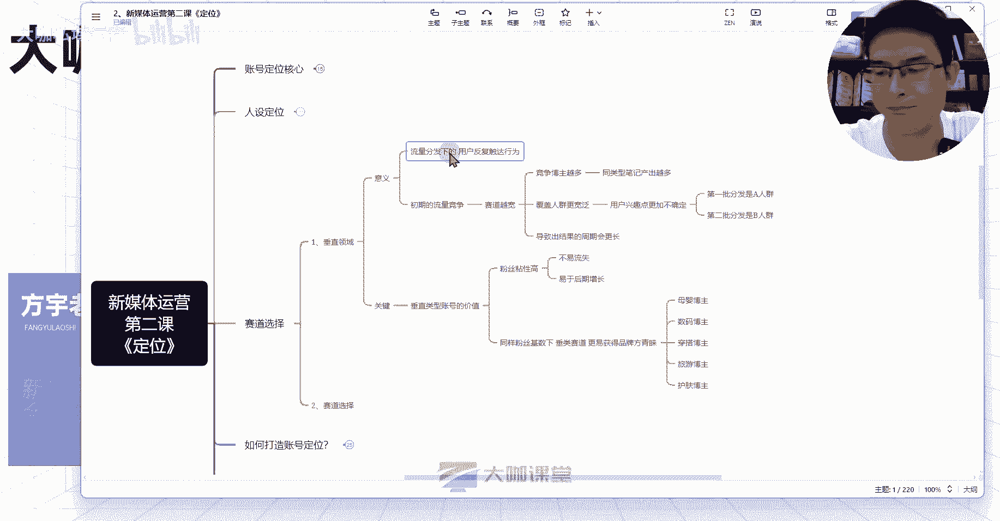
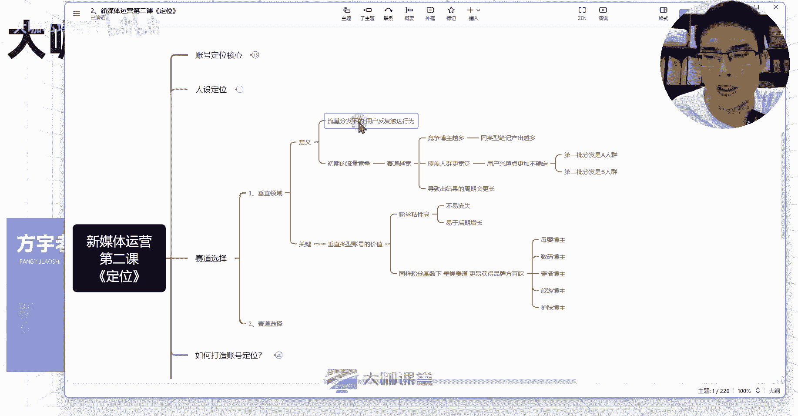
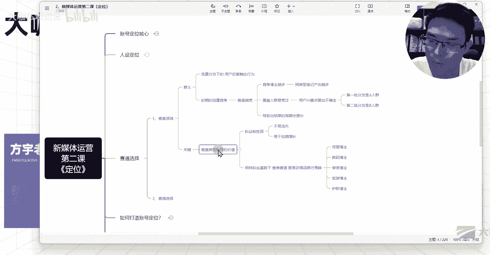

# 【全网唯一！新媒体运营完整版教学】新媒体运营全平台玩法讲解 小红书运营起号／抖音短视频拍摄／直播带货／爆款文案标题！ - P19：17、新媒体运营 垂直赛道的选择问题 - 大咖私域运营 - BV1LcsSeXECV

hello同学们，大家好，欢迎大家来到我们这一堂课。那么我是方云老师。那么这一堂课呢，我们跟大家一起来研究研究关于赛道这一块的一个选择问题。那么在我们首先去决定我们要做什么赛道之前呢。

我们要先了解我们这个赛道后期的一个发展方向问题。就是说我们要先知道赛道这个东西啊，它的一个核心定义，就是我们到底现在去做新媒体，我们选择赛道这一块到底要遵循哪些原则。

我们才能够尽量大程度的一个保证我们这块赛道能够做起来。那么首先第一个呢要大家去研究清楚的就是关于垂直领域这一块，很多人都知道我做这个新媒体赛道，我要去做垂直，对吧？我要去做细分。

但是你们根本就不知道为什么说要这样去做它的一个影响的根本意义到底在哪里，对吧？那么我们这一起来看一下。首先第一个呢就关于意义这一块，就是它的一个呃为什么说是我们要去做垂直领域这么一个一件事。

第一个呢就是关于流量分发下。😊。

一个用户的他的一个触达行为啊，应该说是用户的一个反复触达行为，什么意思呢？

比如我们现在去做新笔账号，你的笔记它会第一批分发给一批人群，对吧？你的第一篇笔记前5篇笔记。每一篇笔记我们前期讲的这些笔记的一个初始流量都是在做人群测试，对不对？那么我们之前呢跟大家打造过一个模型。呃。

我们第一篇笔记呢分发给500个流量。那么这500个流量当中可能有10个是我们这个赛道的一个精准用户，比如说我们是做穿搭的。那么有10个用户呢对这个呃大学生的一个穿达吧。我们做大学生的一个穿搭分享。

那么有10个用户他对这个大学女生的一个穿达比较感兴趣。然后呢，他对我们内容呢呃产生了一个比较长的这个停留时长，然后呢，其中呢有那么3到5个人给你提供的数据。O那么这个时候呢，用户啊。

我们的平台可能判断你这个笔记呢，有没有可能是跟这个大学生穿搭相关的呢？他还无法确定，对不对？那么下一步你的第二批笔记，他有可能根据你上一批笔记的这些用户行为啊，他继续给这10个用户甚至说更多的。

比如说2030个用。😊。

50个用户继续去推你这个关于什么呢？关于这个穿搭相关的这种呃内容。也就是说在我们第二批500个浏量里边，可能有50个用户呢，他对这个穿搭有呃一定的兴趣。

但是这50个当中又有10个用户可能有10个用户哈是之前对你的笔记还比较感兴趣的。然后呢，其中呢有5个用户可能会必然刷到你的笔记。这5个用户就是对你的笔记有一定的这个点击数据，然后呢。

甚至还对同类型的笔记呢，哪怕说他没有点这个互动数据，他对同类型的笔记呢，也有一定的这个停留时长和浏览行为。

那么这5个人他是必然会刷到你的笔记的。那么假设说你之前是做一个穿搭的对吧？大学生穿搭相关的，结果呢，你后面去讲了一个关于唉你今天上班遇到的一个遭遇啊，我们一个情况来分来来来做预算与这个推测。

你呢分享了一个我今天作为1个3十来岁女性的一个上班的这样的一个情况，我遭遇了一个什么样的一个不公平的待遇，或者说啊我上班遇到的哪些烦心事。那么你之前对你这些内容，对你的这个大学生穿搭感兴趣的这部分用户。

他在刷到你这个内容的同时，他大概率不会对你现在发的这个跟他呃目前需求不匹配的这一类内容呃感兴趣。也就是说他同样刷到了你的账号，但是在不应不经意之间，他就刷走了啊，刷走了，他刷到你的这个笔记内容。

在他的这个四篇笔记的陈列当中，但是他刷走了。那么这5个用户的流失，会给系统提供一个什么样的一个呃这种感觉呢，就是之前对你内容感兴趣的用户啊，你现在同样。😊。

分发的这个内容，他们既然不感兴趣了。那么系统会不会觉得呃之前的判断失误？哎，系统他他没有这样的一个思考过程，他只会觉得之前的分发是错误的。

有误O那么你现在的这个如果说你这一篇笔记分发的另外50个那什么来着，50个整个全部50个对大学生穿搭感兴趣的这一部分用户群体，他们都没有给你提供一个很好的数据。

O那么这个时候呢系统他可能首先第一个在大学生穿搭这一块呢，你的这个内容分发呢，他有可能就会给你降低这一块的权重。那么假设说你这500个流量当中有这么一些人刚好这么五六十个七八十个或者说十几个这种用户。

他们对你今天分享的这个什么来着女性成长类的话题，就比如说我今天上班遭遇的这些问题，或者说呃我的这个呃共同的这种遭遇啊，或者说我一些不公平的待遇啊等等。这种情他们他们还挺喜欢的这种情况下面。

那么你们下一篇笔记，就可能导致系统哎他再次错误的判断了你下一篇关于穿搭的内容要分发给哪些人了。这就是我们。😊。

在笔记分发里边，用户的一个触达行为，他能够给系统反馈出你对你的这个笔记类型的一个判断。所以说我们要去做垂直领域，对吧？你的垂直领域呢能够在这个人群触达这一块，就至少说他浏览过你的内容。

那么他大概率还会呃刷到你的内容。那么这个时候只要你保证你的内容质量没有问题的前提下，他们很有可能就还有除了他们之外，还有更多的人，他可能会给你提供一个数据支撑，就至少说点击率这一块可能你就能拿到，对吧？

有了点击率，后面我们就要拿的是什么？我们的停留时长，我们的这个跳出率，还有我们的这个互动数据，是不是这就是我们要拿的东西，对吧？这就是我们为什么说要做垂直赛道呢？你的垂直赛道，你在人群这一块。

你能锁的更加的精准，也能够更加利于你的这个账号，它有一个快速的一个成长。O那么第二个呢就是关于初期的一个流量竞争，我们的账号呢初期发布的这个笔记啊，你的这个流量分发是有一定上限的。

我们之前讲流量层级的时候讲你这个呃账号的一个分发情况的时候，也大致提到过这个后面我会细讲，对吧。😊。

你的流量分发它是有瓶颈的，系统不会，因为你的这篇笔记，它有一个还行的这种数据，它就持续去给你分发流量。你的流量有上限。到了这个上限的情况下。

你怎么能够在这个上线的这个基数下跟你这个同类目的其他的账号去竞争流量呢，对不对？这个就是我们要考虑的一点。如果说你在初期的时候，你所涉及到的这个流量范围越宽。

那么相应的在你这个赛道里边竞争的这个博主啊也会越多。那么竞争的博主越多，它就有什么样的一个意思呢？你今天做的一个大学生穿搭的类目，😊。

呃，假设说你不是做的大学生穿达，你是做的各种类型的穿搭啊，你今天讲这个穿搭，你明天呢又讲的是微胖的穿搭，然后后天呢讲的是通勤穿搭。那么在这几篇笔记的一个反复覆盖当中，虽然说你是跟穿搭相关，对吧？

但是在这同样做这些内容的当中做通勤的，有这么一万个博主，对吧？做这个大学生穿搭的，又有一万个博主，你本来只跟大学生穿搭的一万个博主做竞争。结果现在你变成了你在跟3万个博主再去竞争。

那么每天3万篇笔记当中，你去抢这么点流量，然后呢，和你相对于你在一1万篇笔记当中，你去抢这么多流量，哪个更容易让你分到一些更精准的，或者说让你的笔记在这个领域当中能得到一些呃比别人能得到能更有优势呢。

是不是这个就是我们要考虑的一个点，对吧？你的赛道呢，如果说没有去做细分，你做的宽，你在当前这个赛道做的宽，他的影响，在这里。那么如果说你的账号是今天发一个这个赛道的内容，明天发一个那个赛道的内容。

那么相应的你的这就不是竞争高的问题呢，你这就是你的一个。😊。

然后后期分发精准度的问题了。OK然后呢就是呃覆盖人群范围更宽泛嘛，对吧？那么这也是我们要讲的一个点。😊。

我们刚才讲的这个通勤，对吧？我们讲了大学生的传达，我们还讲了什么？还有一些其他的这个呃职场传达等等。那么这种情况下面，你的笔记他所分发的这个用户是他的一个兴趣点是不确定的。

那么其实我们刚才讲这个用户的一个触达行为啊，也是讲到了这一点，对吧？你的通勤穿达，或者说你微胖人群的一个传达，他们分发的人群是不一样的，也就说我们现在我为什么之前跟大家说，我们有些同学会问对吧？

我同样一篇笔记，我发在我这个账号上面呃，横流量比较高，对吧？我把这篇笔记，我在发到另外一篇账号上面，另外一个账号上，为什么他的流量就这么差呢？是我因为我没有去虫的原因吗？我这么跟你们说吧。

或者说你在同样一个账号里面，你把同样的一篇笔记，你发两次，你的这篇笔记两篇笔记，他分发的人群都不可能完全一样，就是一定是会有差别的。所以说你在做不同类目的一个呃不同细分赛道的笔记的时候。

你的分发人群不一样。那么这些人群，他们的一个细。😊。

趣点就更加不一样了。那你要考虑一下喜欢微胖穿搭的这一类人群，他们可能啊我假设啊我假设这一类人群，他们喜欢看微胖的穿搭，他们同时可能更关心什么？他们更关心哎，有没有什么好吃的，有没有哪里好玩的。

或者说什么演唱会呀，或者什么其他的呀。😊。

举个例子哈，那么这种情况下，他们关心的是这个点，对不对？那么关注通勤穿搭的人群，他们的兴趣点除了关注通勤穿搭，他们还关注什么？他们必然就是不太关注什么呢？微胖的穿搭啊。

不是说必然哈我是现在是把这两个人群呢做了一个呃整体的一个区分开啊，整体的区分开，你不用在意我字面的意思。现在这两个人群，他们的之间的一个需求点不重叠。那么关注职场穿搭这类的人群，他们可能同时关注什么？

关注这个呃消费呀，对吧？关注这个生活啊，家居啊、宝宝啊等等，他们可能关注这些兴趣，但是他们相应的对一些年轻人的东西呢呃可能关注的会相对来讲少一些。那么这种情况下，你用户的一个兴趣点。

他就没有办法确定到他们是跟你的这个类目去进行强相关的。那如果说你在做这一块的笔记，对吧？你是做什么呢？你做这个通勤穿搭的。然后结果呢你今天做这个大学生穿搭的这个优惠的这个合集啊，这个呃便宜又好用。

然后呢又显身材等等这种合集。那么这些点，他可能。😊。

并不是关注通勤穿达，他们喜要喜欢关注的点。那这个时候用户兴趣点不确定不统一，和你之前的分发不不相同。那这种情况下，你的这个流量它也会相对来讲更加的不稳定啊，不稳定，然后呢，整体的这种情况下来。

就会导致我们的账号呢能产出结果的周期，本来说可能说两个月对吧？三个月就说嗯按照你们目前的水平去玩，对吧？但是呢结果在你这种操作下面，它的一个产出结果周期有可能会更长，对吧？

半年或者说甚至更长时间都有可能甚至一直做不起来，都有可能，对吧？这就是我们前期要避免的问题。然后第二个呢，就是我们现在做垂直类型账号，它的一个关键点。

垂直垂直类型的账号呢，它能给我们带来的价值呢有两个方面。第一个呢就是我们的粉丝粘性高。粉丝年薪高呢就是你是做这个大学生穿达的，你关注的这关注你的这些用户群体，他们已经群体这个目标已经固定了。这些人呢。

他是大学生，对吧？然后呢他们关注这些便宜好用的东西。所以说你给他们推荐的东西，他们只要关注你，他们相信你，那么你后期推荐的东西，他就更容易幸福，他就更容易产生什么交易行为，对不对？然后呢，这些粉丝呢。

他们更愿意相信你说的话，所以说你的粉丝粘性高对你整个后期账号的一个流量增长，就不至于说你的流量起伏波动特别特别大。比如说我今天发一个笔记，我有那么500赞，对吧？我明天发一篇笔记。

我后天发片笔记都只几个赞，这种情况下，他的一个波动就是不正常的。所以说我们在你粉丝粘性或者说粉丝质量比较高的情况下，对于你账号后期的一个增长。

他是会有很大的一个增议的O然后第二个呢就是在我们垂泪赛道的情况下，同样的。😊。

粉丝基数下，你的账号做的越垂直。那么你的这个品牌方找你合作的这个价值点也就越高。你比如说呃像某图文笔记平台上面推一些护肤的这个新品啊，或者推一些美食的这种新品啊，在上面呃你的账号越垂直，对吧？

那么品牌方找你的可能性也就越高，你得到的收益的情况下也会越高。那同样的有些账号他发了这个装修的。然后呢也发了这个生活分享的，也发了这个呃散步啊，跑步啊、运动啊等题材相关的。

这个时候如果说是一个母婴的账号，他来品牌，他要去做推广，他肯定会优先考虑一个始终做母婴品类的知识分享啊，或者说话题的这么一个博主，他不会去考虑做我们刚才说的这种比较杂赛道的这种账号。

OK这就是我们在变现这种情况下，我们需要考虑的一个是我们的变现，另外一个就是我们的流量的一个逻辑。O那么这节课呢我们就先讲到这里。

