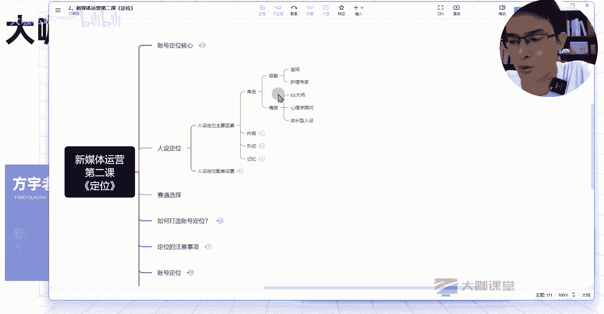

# 【全网唯一！新媒体运营完整版教学】新媒体运营全平台玩法讲解 小红书运营起号／抖音短视频拍摄／直播带货／爆款文案标题！ - P6：5、新媒体运营 IP人设塑造：人设定位的核心因素 - 大咖私域运营 - BV1LcsSeXECV

hello，同学们，大家好，欢迎大家来到这一堂课。那么这一堂课呢，我们主要来解决一下很多人做新媒体会遇到一个比较头疼的问题。那就是关于人设定位这一块始终不知道啊始终不知道怎么去做啊，人设定位呢？

很多人会觉得把这个事情啊想的特别复杂。我怎么去塑造我一个这种比较成功的人设啊，我怎么塑造这种人设呢，会能够让别人更容易相信啊等等等等。这些其实呢人设的整个打造在我们运营的这个大盘上面来说。

它是随着你的一个内容方向和你的一个账号成长，它会才会去逐步凸显的。我们前期所有做的这个人设定位的一些辅助工作呢，其实就是在呃固化我们后期的这个整个账号里边需要去融入的一些呃这些特征点等等。好吧。

那么如果说你们在前期做这个账号，或者说我们在企业里边运营这个公司里边的账号之后，你特别纠结人设的时候，那么你需要回顾一下这节课，你去看一下人设这个东西，它到底是怎么回事。然后我们通常这个。😊。

人设又怎么去打OK。我们来看一下啊，首先呢这节课主要讲两个点，一个是关于人设定位的一个主要因素。然后呢就是我们一些人设定位这一块账号的一些配套设置了。OK我们先来看一下主要因素吧。主要因素呢。

我总结一下，就是四个点。那么你能把这个四个点，我们在这个账号的整个运营生涯当中，它的一个生命周期当中，我们把这些东西融入进去。那么你的这个人设定位基本上不会出现特别大的问题。首先第一个就是角色了。

角色这个东西就说白了你呢我们上堂课呃之前也跟大家讲过，你做什么赛道，你这个赛道呢准备往什么方向去输出内容。那么你就需要让别人知道你提供的这些内容，它是有一定这个专业性的，不管你是做好物分享，做测评。

还是说你是做一个装修博主，你作为一个装修博主，那么你就需要告诉别人哎，我是确实有这么一个户型，有这么一个房子，我正在装修，而且现在装修好了，我整个过程我是记录下来的当中呢，我遇到哪些坑，我是来做分享的。

我得有这么一个成品去告诉别人啊，我的前后的一个差距。我现在的东西到底做的有多么好看，我前后的。😊。

对比为什么我这么去选择等等，对吧？

如果说你作为一个母婴赛道的，那么你本身呢宝妈这是我们在这一块大家很容易想到的一个角色，对吧？那么其实作为母婴这一块呢，根据你做的这个赛道的内容方向，你也可以是作为一个护理专家的一个身份，对不对？

这个护理专家，他就不是说一定得自身是一个宝妈，我可以说是某某机构的呀，或者说某某这个一块专业的这个领域的一个人员啊，或者什么样的？我来作为这样的一个角色来作为分享O那如果说你是做情感赛道的。

你是某某大师，对吧？那我们应该知道很多短视频平台上面有不少这样的账号。那么你作为一个心理学顾问，可不可以去讲讲我们人生的一些情感啊，成长啊，励志啊、正能量啊等等这些话题，我们是不是可以去讲。

那么呃你做情感这一个类的，你还可以做个什么呢？你作为自己单独的就是我讲的这个成长型的人设。什么叫成长型的人设呢？就是我呢作这个账号，我是来分享我自己以前比如说啊我作为一个女性，对吧？30岁的女性。

我在前几年啊，这个家庭呃一些问题，然后呢我的这个创业，我的。😊。

职场的这些问题。就比如说呃一些职场上面的这个这个这个啊女性可能遭遇的一些问题，对吧？这个大家都懂的那这种情况下，我是怎么去应对的。然后同事之间的关系啊，领导之间的关系啊。

然后我们事业的上升的这些遇到的问题，我是怎么去处理的，我的创业失败了，我怎么走出来的这些也是我们作为一个成长型人设，我们可以去打造的一个这样一个塑造的一个角色，O这个角色其实很简单，对吧？它并不难。

就像我们刚开头说的，你做什么赛道的方向的内容，你准备提供什么赛道方向的一个点，对吧？你就你就把自己塑造成这个方向的一个专业的这样一个专家身份就O了，好吧，然后第二个呢就是关于内容这一点呢。

那么内容这一点很简单嘛，我们讲这个内容定位的时候，是不是跟大家说了，你的内容要参照什么，参照哪几个点，你的内容是否吸引用户，对吧？你的内容是否有价值。

然后你这个内容呢是否在平台上面有一定的这个特色等等等等。你跟你具体提供的是什么东西，这几个点只要你满足的那么基本上没有什么特别大的问题。当然我们现在讲内容，你在人设定位这一块，你就我们刚才说的。

你做某个赛道的。😊。

你一定是要讲的是跟这个赛道相关的内容，我们一直持续下去。因为这个呢涉及到什么呢？涉及到我们一个账号的一个垂直和我们账号标签的这么一个问题。

我们之前一直跟大家讲，我们做新媒体一定要做垂直赛道，对吧？垂直领域。然后呢，我们还得做什么呢？我们主要的方向就是去把我们的账号的一个标签给打起来。

因为这一块它是影响我们整个账号的成长和我们后期的一个流量分发的O你如果说你的第一篇内容呢，你做的是这个啊儿童教育相关的。然后第二篇呢，你又是做的什么呢？你做的这个log啊，你做的一些分享的宠物相关的？

那么你分发的这些人群里边，他有没有可能就是有这么一部分前面对你的这个内容比较感数据的这种有感兴趣，他给你提供的点赞收藏的。那么他在二次刷到你的内容的时候，你的宠物相关内容。

他有没有可能对你的内容不感兴趣呢？或者说他此时就是对你这个内容不感兴趣。那么他把你的内容划走之后，有没有可能这一块，你就损失了一个数据，那么给平台间接性的反馈，就是这个视频内容不行啊。

别人不喜欢用不喜欢用户不喜欢，那么是不是决定影响我们的一个推流的效果O。😊。

这个就是一定要记住这一点，你做什么赛道的内容，你就提供什么赛道的，你做什么赛道方向，提供什么内容就OK了。那么关于形式这一点，我们要了解一下所谓的形式是什么意思呢？就是我目前主要讲的这几个点。

一个是我们的内容产出场景，对吧？你既然有人设，那么这个东西呢，你是必然有人或者说有这么一个场景去给大家呈现的，你到底是去持续在室内去跟他们呈现你现在的一个场景，还是说你在室外不同的场景去切换。

你每一次呢都是在室外去跟大家讲，哎，我今天是什么样的一个情况，然后我今天有什么样的一个心得，在这个赛道里边有什么东西呢要去跟大家分享的，对吧？或者说呃我在上班的路上啊。

或者说我去在面试的路上等等这种情况。那么还有呢呃固定的在车内分享的等等。这种你的拍摄场景，你可以先确定一下，对吧？我准备在哪些场景去拍这些场景，其实在我们后期讲对标账号的时候。

也跟大家分析你的所有的场景呢？在这个其实除了你自己提供的这些点以外，更多的我们可能要参照一下什么呢？😊。

我们的对标账号，他们在用什么样的一个方式去给大家做呈现。OK那么呢还有关于声音这一块，对吧？你的角色，你的这个呃就是你具体的呈现形式这一块，你是自己来拍，对吧？还是说你不想出镜。

你的整个呃这个视频里面没有你的声音，你只有配音的方式来解决这个事情，是不是现在也有这样的形式。比如说某人对吧？然后在几个朋友一起对话的一个场景，大家出镜了，但是呢真正声音呈现是什么呢？

是通过配音来解决的这玩意儿对现在来讲也没有任何难度，一个剪映就完全解决的事情。所以这个事情呢，形式这一块你也可以确定一下你的这个声音，你自己能不能讲的好。

你的声音呢能不能连贯的流畅的把这些东西给它解决好，你能不能这样呈现出来。O然后呢，在内容形式这一块，其实也很简单，就是你的这个内容呢，它到底是以剧情的形式。

还是说以干货型生活记录型的方式来给别人呃提供你整个内容，比如说我们做母婴的对吧？母音产品的。😊。

母婴的这一块呃，很多家长呢他们记录这个孩子的一些日常带娃呀或者孩子的一些这个辅食啊等等这些情况。他们都是以什么呀类似于记录的这种方式去记录下来。然后也有一部分博主呢他会出镜唉跟大家聊一下，哎。

像你的小孩最近遇到的什么样的一个情况。那么这种情况，我以前是怎么解决的这叫什么？这叫做这个经验分享型嘛，我们跟大家聊聊干货。然后如果是做剧情的呢那那么它的一个创作难度呢相对来讲就会上升，对吧？

生活记录型干货型呢干货型呢需要准备什么呢？需要准备丰富的这个文案脚本，你呢需要去调。如果是生活记录型的呢，你就得有大量的拍摄素材啊，这是每一个内容形式之间它的一个优劣式和方向性O然后呢关于最重要的一点。

也就是我们的一个记忆点了啊，就是我们的一个记忆点。记记忆点这个东西呢，我上我前几节课呢啊上的课啊也跟大家聊过，你的视频最终产出的一个内容当中呢，你让用户怎么去记住你是通过我们固定去设计的一些环节的。

你比如说。😊。

视频前几秒的一个固定动作，它的一个特效，还有开场白，以及呢统一的BGM，还有呢我们可能统一出现的某个物品，对吧？比如说呃这个这个这个这个什么来着？我们我们每他是每一个每一节课开始的时候。

我们固定一个动作，或者说我们身边就有一个固定的这个物品，在我们不管是什么样的一个情况下都会随着我们去出现这个呢也是我们的一个记忆点。也就是说这个记忆点，你要反复的去刻入你的用户。

也就说你的观众的这个心里边让他们刷到这一个瞬间，他知道这个博主，我之前看过他的内容，他是讲什么的，然后呢我甚至还能联想起来，哎，我以前关注他比较多的一个内容是什么？

就是说我们现在呢有些人你们关注某些短视频的这种博主啊，你们会发现这个博主呢在你们一开始的时候，哎，这些博主呢他可能只有那么十几万粉丝，哎，你过段时间突然看现这博主他火了。

他怎么就突然几百万粉丝到底为什么。但是我仍然记得这个博主以前他是讲什么的，他的内容方向没有变。那如果说在后期你同样刷到这个博主，哪怕是你关注的，他的所有内容风格方向。😊。

不一变。那这个时候你还能知道这个人以前是做什么的吗？啊，不一定对吧？😊。

然后包括服装，对吧？这些呢都是我们需要去植入的记忆点，你的固定动作，某个特效，你的某个开场白这些并不难啊并不难。但是呢需要我们去设计。那么这里呢也给大家留下了一个这个悬念。你想想前几秒的固定动作。

特效开场白BGM出现的物品，这几个东西他们有什么样的一个特征呢？你们想想。😊。

我们先来看前三个固定动作特效，还有开场白这些东西他们有什么样的一个特征，思考一下这些东西它有什么样的一个特征呢？😊。

他们是不是这些东西呢？我为什么我这里写了哈，前几秒看到没？我们把这些字字眼呢我们给它加粗一下，我们来重点看一下。😊，前几秒，然后呢开场白。什么呀？这几个点是不是都要在视频的开头去呈现啊？

为什么说我们说视觉垂，或者说我们的这个某个某个这个呃固定的动作，或者说某个记忆点这三项，我们要在前面去呈现呢？因为整个视频的结构对用户来讲，它的一个冲击，每一次刷到你不同的视频的内容冲击。

比如说你的主页里面有非常多关于健身非常多关于护肤非常多关于旅游关于穿搭的这个内容，你的每一个视频，你的开头都是差不多的这样的格式。那么你用户在刷你主页的视频的时候，我们就假设这种场景。

它一个一个的刷每一个视频点开，哎，你前几的这个动作啊，你的口型啊啊，你的这个呃特效啊什么都是固定的。那么这种记忆的加深会不会更加的强烈，比你把这一些动作特效和这个呃这两个点，你把它放在这个视频的中间。

或者说你随机去讲它是不是效果来的更加的直接，更加的强烈，对吧？所以说这个呢这几个点我们就要把它前置，对吧？😊。

在我们的内容当中呢去做前置。OK那么比如说BGM它是串联我们整个这个视频的一个全程，对不对？然后呢，比如说我关注的一个滑雪的这个带孩子啊，滑雪的一个博主，他的女儿真的是特别的聪明。

然后呢这每一次滑雪的这个背景音乐呢，大部分的都是统一的就刷到这个视频呢就能感觉到非常的治愈，而且呢这个小女孩也特别可爱，他也能力也特别强，那么这种呢在你持续观看的时候，他的一个背景音乐。

每一次在重新刷到一个视频的时候，背景音乐想想起的那一瞬间，可能你还没有进入主题，但是我知道哎我刷到这个博主了。然后呢，这个是他的内容，哎，我记得这个人是不是这个叫做BGM。然后呢。

还有我们统一出现的一些物品，对吧？我们刚才讲到的这个物品贯穿你的一个全局，你的一个背景，你的一个台灯，或者说你后面有一个什么挂了一个什么东西啊，然后呢统一服格的统一风格的这种服装。

你在这个比如说呃农村题材的啊，或者说我们都市题材的，我们职场题材的你的这个服装的一个风格，他呢也能给用户带来一些。😊。

扎深的记忆点。那这种呢就是贯穿我们整个内容全局了。

所以说这个记忆点它是比较重要的。我们在做内容这一块，我们去规划我们的记忆点的时候，你就得按照这种方式去把你该前置的东西呢都要前置。然后该整个贯穿全局的这种东西呢。

我们做整个后期的一个内容方向的这种固定啊和植入。OK这是关于人设定位的一个主要因素。然后呢，下节课我们再来聊一下关于人设定位的这些配套设置相关。😊。

