# 【剪映教程】： B站最良心的2024剪映手机版全套教程（适合零基础小白学习） - P10：7剪映核心剪辑功能讲解--画中画功能 - 视-频号教学 - BV1p9xsePEvi

咱们今天呢接着给大家分享的是剪映的核心剪辑功能。第五个功能画中画。我们经常看到有些视频当中啊，会出现什么多个画面同时进行的。但是多个画面呢可能不是在同一个。是吧不是在同一个时间线上。

但是它它也会出现这种情情景。这是怎么造成的？就是使用了画中画。在剪映当中呢啊我们看到有一些特效视频呢，也是它是借用了这种画中画的这个功能。然后呢将两个视频或者多个视频叠在同一个时间轨道上。

然后呢同时呢进行播放。

那使用画中画它的一个非常重要的特点呢，就是使我们的视频呢内容呢变得更加的丰富有趣。好，那关于画中画这块介绍呢就简单的到这块。然后呢，我们接下来的话是带大家一块进行啊画中画一个实操。好了，回到我们的软件。

好，同样我们首先开始创作。导入一个照片素材。

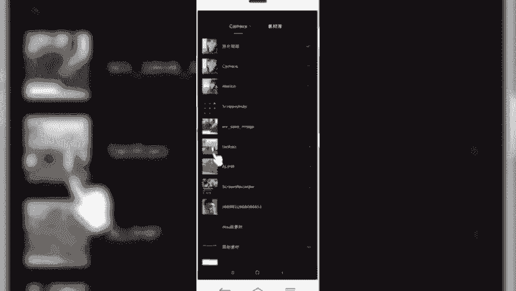

好，导入到照片素材之后呢，我们先对这个照片简单的调整一下它的一个比例，大小选择比例。然后设置为9比16。

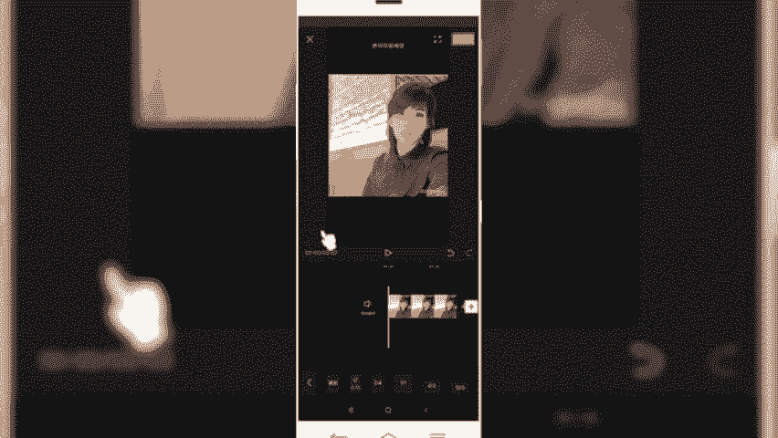

好，先调整一下。

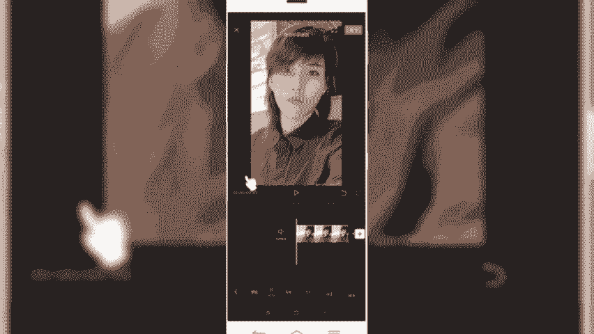

然后呢，我们再导入另外一个添加化工画。好，拉长一下照片的时长。回到一级菜单，然后选择画中画。点击新增画跟画好，我们再添加一个其他例子素材。

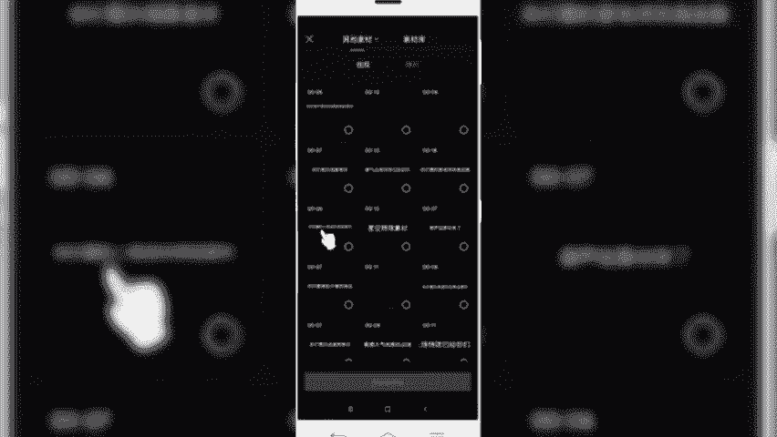

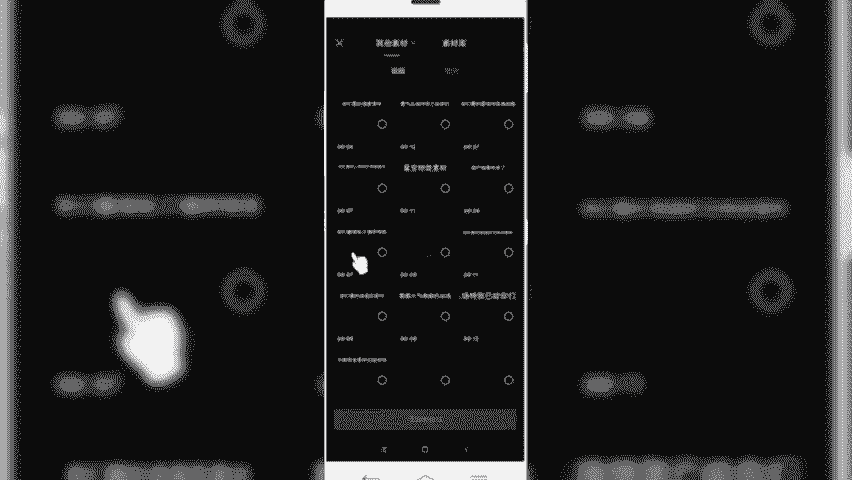

好，我们找一个星空的特效。看一下清空特效。

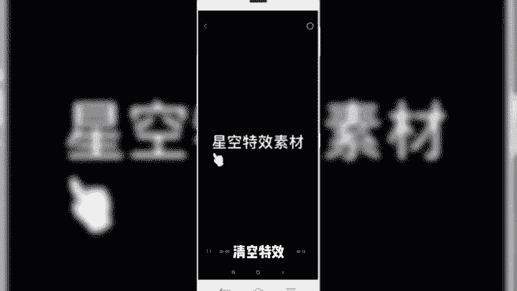

清空特效素材已给你们安排。

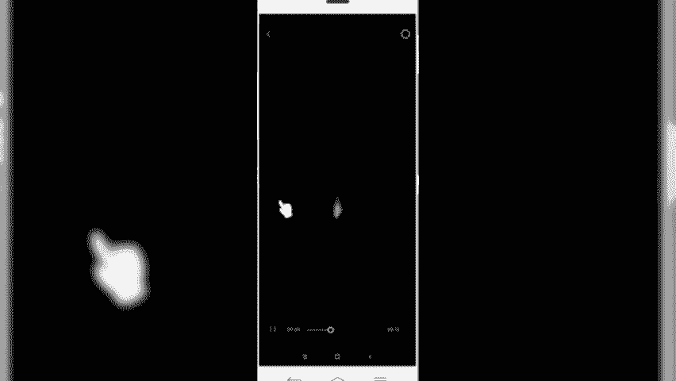

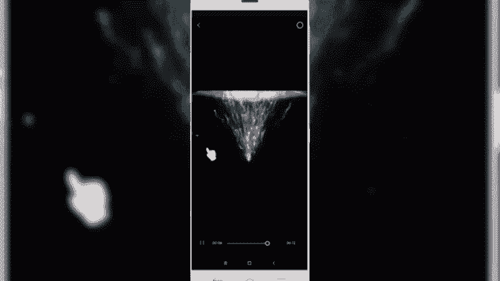

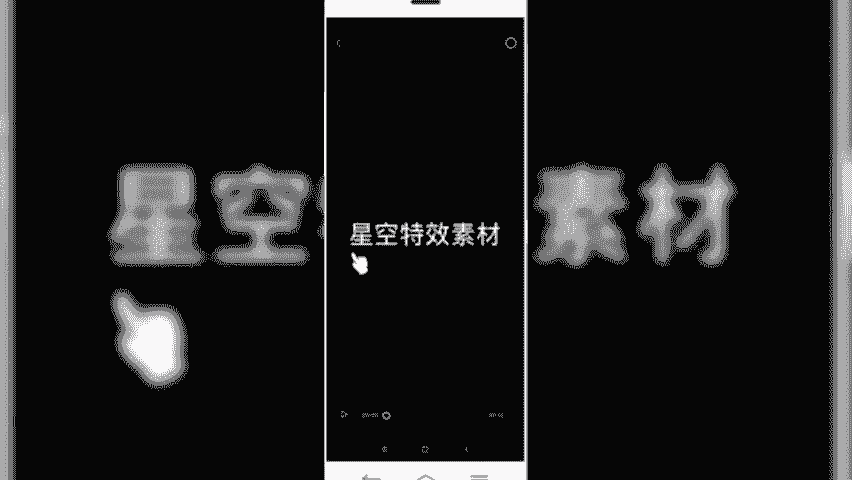

好，我们拿这个为例，星空特效素材。然后导入。导入之后像前面部分多余的这些轮子呢，我们不需要需要给它删除好，我们。定位一下光标，给它删除多余的部分。好，从这个地方算。点击分割。

然后把前面部分多余的给它删除掉。好，然后我们把后面部分。看。调整下时间的位置，挪到前面部分。好，我们正常情况下看到的画中画就是这两个视频画面呢在同一轨道上。

包括我们后面给大家讲到的三连屏多屏的一个互动效果，也是通过画中画可以实现的。好，我们先简单看一下。那我们想要把这个例子的效果呢打在这个后面的照片起上面。那么我们前面看到这个黑色背景，我们需要给它抠掉。

那是我们这块怎么样处理呢？可以使用这个画中画当中的混合模式。点击我们画中画轨道，然后选择底部的混合模式。好，然后选择一个绿色。

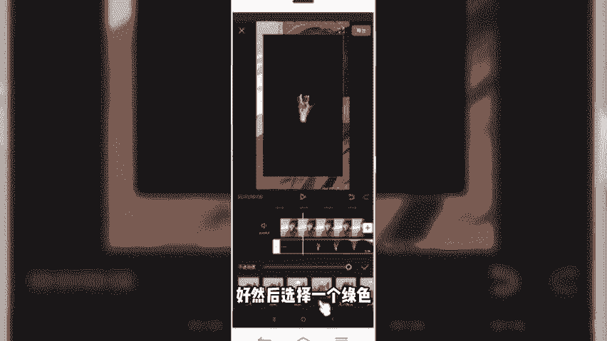

就把我们刚才看到黑色呢给它去掉了啊，然后呢我们再调整一下这个视频的位置。好，再来播放看一下效果。拉长。然后调整一下我们的。没准。好，再来预览一下效果。好，基本上这是我们。通过。添加画中画的形式。

给视频做了一个这特效啊，它就是通过一个照片形式做出来，我们再来预览一下效果。OK那这个呢就是通过画中画的形式来创作出来的。好，那么这再再回到我们的课件，我们一块来小结一下。

那本节课呢主要给大家分享的是剪映当中的画中画功能。在剪映当中呢，我们点击画中画功能，可以直接在原视频轨道上新增另外一个视频轨道，实现一个多轨道的视频运行，让原本的一个视频画面呢变成两个视频画面。

甚至多个视频画面的同步播放，从而丰富了我们视频的内容。理解和掌握画中画规功能呢，对于我们后期通过画中画做特效视频有一定帮助。就像我们刚才讲到的案例操作，是通过画中画实现了一个这样一个特效的一个操作。

我们后期在讲到一些三连画呀，或者说呃人影分身的这种技术的时候呢，都是借用了什么呢？画中化。好了，本节内容呢就分享到这里，我们下节课程再见。

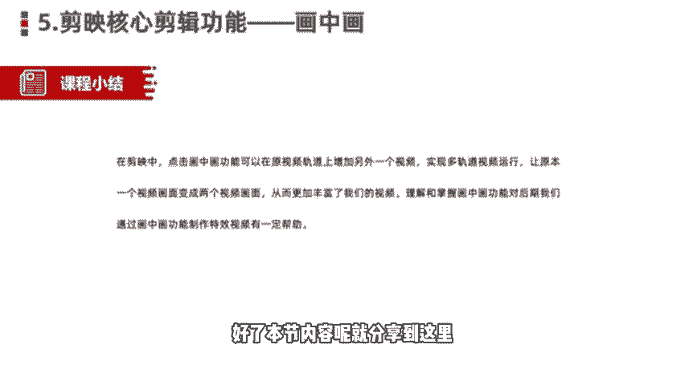