# 【剪映教程】： B站最良心的2024剪映手机版全套教程（适合零基础小白学习） - P11：8剪映核心剪辑功能讲解--音频功能 - 剪-映新手-教-程 - BV1P9xPeCEVh

那么我们在上节课呢给大家分享的是剪映的核心剪辑功能文。那么我们在上节课呢给大家分享的是简映的核心剪辑功能分割功能。那么今天呢接着还是给大家讲解简映核心剪辑功能音频功能。我们知道一条完整的短视频。

它不仅仅包括我们看到的视频画面，还要有一条比较火的或者说比较热门的BCM，也就是我们所谓的音频。那音频这块应该是如何添加和制作的？所以今天给大家讲的是显映的核心剪辑功能。第二个音频功能。

我们知道一条吸引人的爆款视频，它一定离不开一个什么。离开一个热门的BZM。在剪映当中呢，我们可以通过音频功能实现。为视频添加我们背景音乐或者音效。

还可以通过提取音用和抖音搜藏的方式呢直接选取一些抖音上的热门BGM，最后还可以为我们的视频呢。配摄录音。那通过这些操作之后呢，可以大大提升我们视频的一个平音质量和我们的培音效果。

我们视频的一个画面氛围呢或视频的一个感觉，可能用户在看起来时候会更好一些。好，那这块儿的话。音频功能先简单的介绍一下介绍一下。然后接下来我们进入同样一个实操环节。音频的话同样是在我们的。

剪映当中的一级菜单。我们添加好视频之后呢，我们在底部菜单栏点击音频，然后呢就进入音频的一个操作界面。那这块音频功能包括添加音乐、音效、提取音乐、抖音收藏和我们录音5个小的功能。

然后我们接下来挨个给大家详细的讲解操作。好，回到我们的。嗯，检疫当中。好，我们同样是先导入一段色彩视频素材。

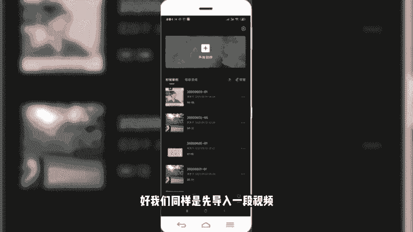

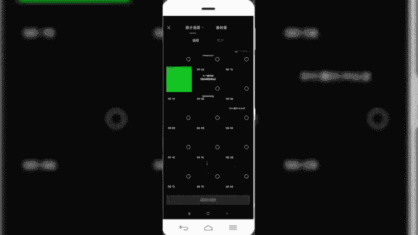

好，我们可以首先呢先预览一下原素材的效果。啊，可以看到原视频素材呢是只有刮风的声音，没有其他的。那么这样种情况下，我们发上去的话。其实它是很多用户在看的时候啊，看不出来我们想要表达的主题。

那我们可以通过添加一些音频或者说热门的BCM来提升我们视频所要传达的氛围和和思想主题。OK那怎么样添加音频呢？首先呢是选中我们的视频。然后呢，第一种方法是直接在视频轨道下方有一个添加音频。

我们点击添加音频。然后就会进入添加音频的一个操作界面。可以添加音乐、音效、提取音乐、抖音收藏和录音。啊，我们首先看第一个添加音乐。

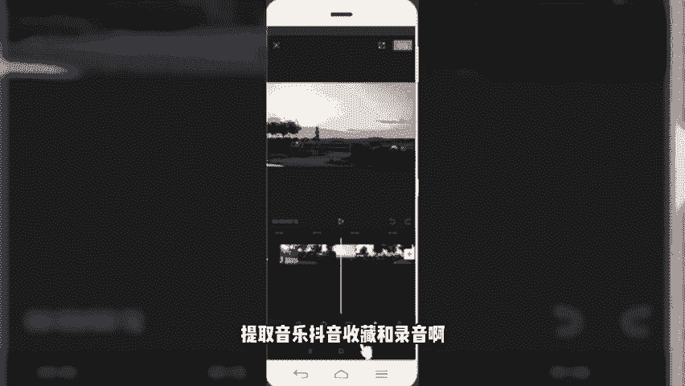

点击添加音乐。

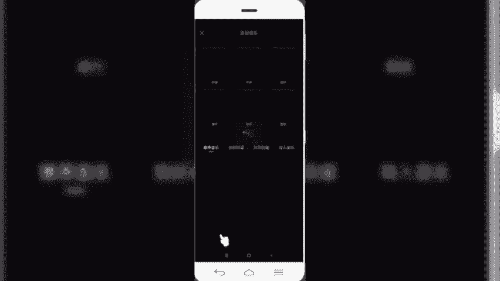

然后呢就会跳转到。剪映音乐的一个素材库。那这一块的音乐素材库呢，或者叫音乐曲库呢，适合我们抖音短视频上看到的很多。热门音乐直接打通的。而且它上面划分了很多类别。

比如说抖音的卡点类的、流行类的、旅行类的美食的。那还有什么belog的，浪漫的。清新的、伤感的、治愈的等等。我们可以根据视频的主题呢选择相应的。那另外一个呢是还有平台推荐的一些热门音乐。

也会在这个地方显示出来。

比如说我们选择夏天的风啊，现在是夏天了嘛，点击可以预览。好，我们就以这个音乐为例，然后呢点击使用。

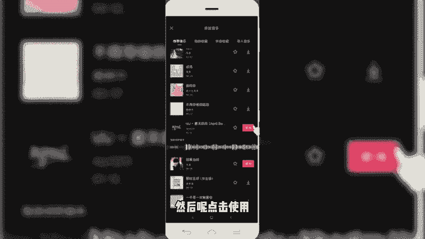

那么这个视频就添加上了这个夏天的风这个音频背景音乐。然后呢，我们需要把它的背景音乐的位置呢调整一下。调整的时候呢，首先是点击选中，然后呢我们。用。手摁住这个音频轨道往前拖。使它和前面的视频轨道呢对齐。

然后呢，我们同样再来预览一下效果。那么我们在预览的时候发现原声呢没有关闭，那么我们需要把视频的原声关闭。因为有原声的话，它会干扰用户或者听起来时候呢不够那么清晰。所以我们把原声关闭，点击关闭原声。

然后我们重新再来预览一下。Yeah。好，我们啊视频到这个结尾的地方呢，音频还有呢怎么办呢？我们需要把它给裁切开啊，同样是需要裁切开，定位到我们视频的最后一秒钟。好，我们选中音频轨道。点击选中。

然后选择底部分割。同样把音频呢拆切开，后面多余的部分呢，我们不需要选中，然后给它删除。OK那么我们音频就给它添加完，添加完成了。添加完成之后呢，就是为了有时候我们做视频的时候啊。

让那个音乐过度的特别缓和，不用那么。就是硬的话，或者说。特别明显强硬的话，那我们需要把音乐变得柔和一下，怎么样变得柔和呢？我们同样是需要对音频音频的出场和入场进行一个淡化处理，选择这块有个淡化。然后呢。

可以调整一下我们淡入的时长和我们淡出的时长。这样的话，音乐它在入场和视频的结尾的时候呢，就会看起来比较柔和一些。然后我们调整一下时长。就说一秒钟。然后弹葱的话同样给它来2秒钟。So。好。

我们调整完之后呢，可以。保存。好，再来预览一下效果。好，那我们。通过添加这样一个淡化处理之后呢，可以看到啊。视频比原来就缓和很多了。O那这一块的话是给大家讲的。第一种。添加音乐。

当然除了这个添加音乐之外，我们在音乐操作当中还可以给音乐的音量。进行一个大小的调整。如果说我们发现添加的音频音乐特别小的话，可以通过音量给它调大。一般情况下，我们在这个抖音曲库中的音乐啊。

它是按100来算的。但是呢我们上传到抖音视频之后呢，会发现视频的音频会缩小很多。是因为啊官方平台我们在上传视频的时候啊进行一个视频压缩，所以导致了我们的音乐变小了。

所以我们建议呢各位小伙伴在导入音频之后呢，把音频的音量呢适当调大一些。然后另外一个踩点儿。那踩点的话，我们后期会给大家讲到我们制作卡点视频的时候，就会需要根据音乐的节奏来裁分视频的镜头。

那这块就需要用到踩点功能啊，那这块关于踩点的话，我们后期会给大家讲。然还有一个是什么视频的变速。那变速的话就是我们有些音频或者有些内容呢需要给它加快，这块儿就可以让它进行一个变速，最大的变成4倍。

那最慢呢可以变到什么0。2倍。那比如说我们看到有些。说慢的，比如说我们放慢可以看一下效果。就特别慢了啊，当然有些镜头的话，我们需要放快的话，就可以把它放快。O那这块是给大家分享的这个变速。好。

返回到我们的一级菜单。可以看到。刚才给大家讲的是音乐，那除了音乐之外，还有一个音效。音效的话简单再说一下，我们在看到很多vlog呀，或者是一些。啊，路人采访的节目当中啊，经常会看到有各种各样的这种。

特殊的音效。比如说我点一个，大家肯定有听过。啊。行。是不是这些音乐我们在做视频的时候，经看视频的时候，经常会看到别人的视频当中会有这样的一个动作，或者有这样一个音频的，其实都是运用了。

剪映官方提取的这些音效素材库。那我们自己在做相应的vlog呀、美食呀或者旅行等等路人访谈等等这些视频的时候呢，也可以借用这些。素菜库，然后呢把这些素材呢直接拿过来使用。啊。

里面有很多就不给大家一一眼展示了。可以有游戏的，还有什么魔法的，还有我们比如说打斗的美食的动物啊、环境呀。乐器啊、交通啊等等有非常多啊，我们在做相应类目的识频的时候，可以从这块直接选取。好。

再说第三个提取音乐。

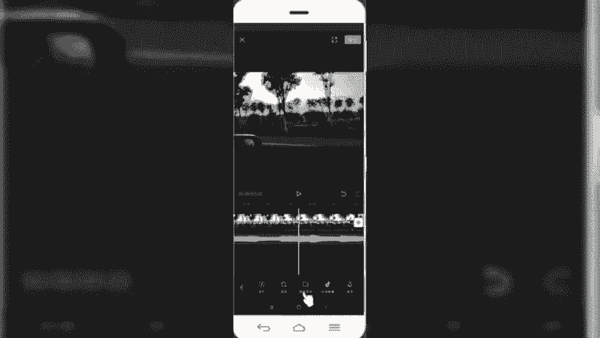

提取音乐的话是什么意思呢？就是把我们保存到手机相册当中的一些视频当中的。音频内容的单独提取出来。然后呢，直接植入到我们这个视频当中啊，然后同样我们拿一个例子为例给大家举一下。

我们选取一个带音频的。

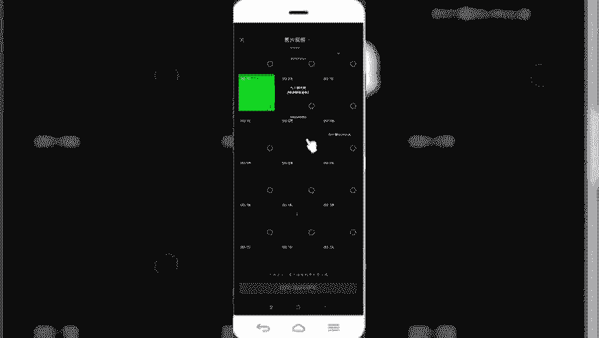

视频。

找一下。

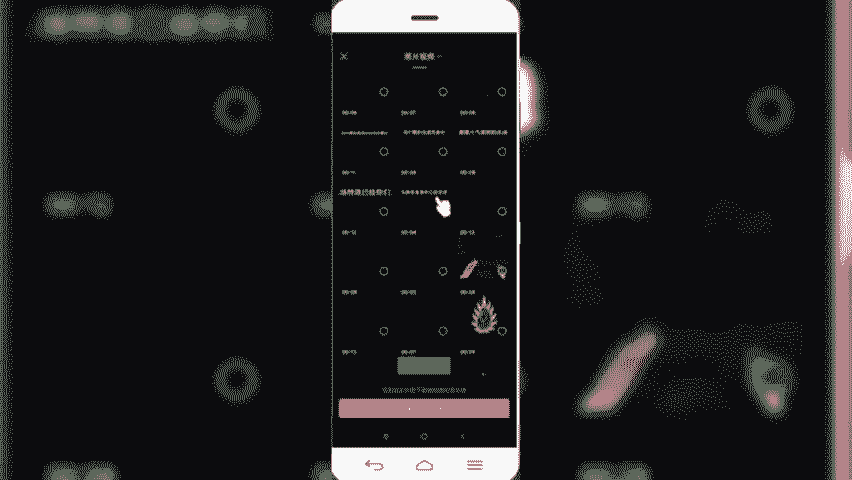

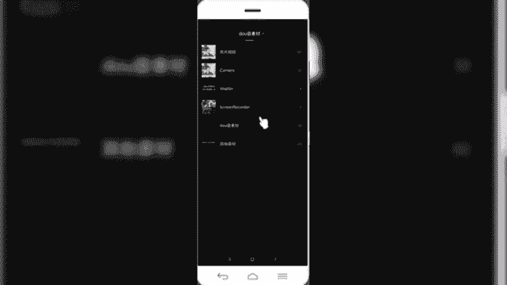

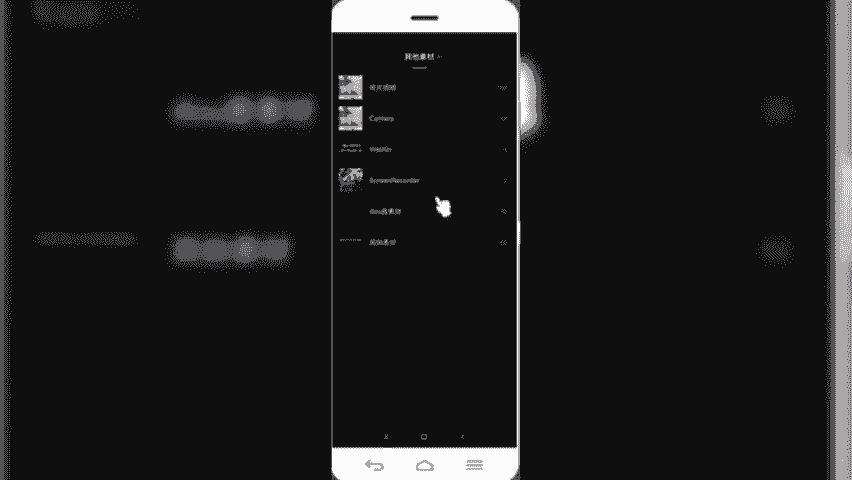

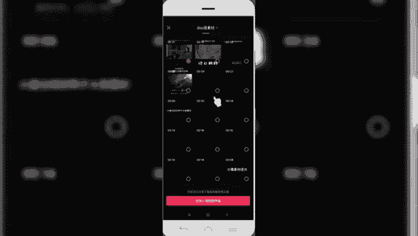

好，那这个时候导入之后呢，我们可以看到啊，首先音频轨道这块呢变成了两个轨道。原来呢是一个轨道，现在变成两个轨道。就是我们把刚才的另外一个视频当中的音频呢提取出来，插入到我们这个视频当中。

那么我们可以看一下效果，把原来的这个音频呢给它删除。然后呢，调整一下刚刚插入的这个音频轨道的位置。好，我们同样再来预览一下效果。最方向送。拿去吧。让我们。好。

我们可以看到这块把我们提取的视频当中的音乐给插入到其中。这讲到的第三个提取音乐。然后再看第四个叫抖音收藏。我们在抖音上有很多热门音乐。那如果说我们想要拍同款的话，怎么办呢？

我们需要在抖音上把这个视频右下角的碟片当中的音频呢给它收藏。然后呢，我们在这块使用剪映剪辑的时候，直接把这个视音频呢可以选中，然后呢就可以拍同款视频了。

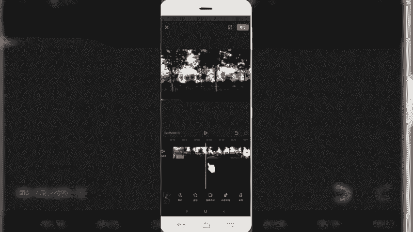

好，我举个例子啊，把我们我们先退出剪影，然后呢打开抖音。

很多朋友问我这个飞天特性。都影子视频太火了，我教你拍，你也能火。可じん。你看看这又是出库，又是入库。🎼你从来没有见过的。不懂教育的人一定要看看这个老师，别看他其貌不。粉丝问我呢出最进罪。

像这样的文字奔割笑目。世界上。🎼空心生不带来死。大学。好，打比方我们拿这个视频的音频为例，那么我们需要想要拍同样这样一个音频的话，怎么办呢？我们可以点击右下角的碟片。然后呢，点击顶部有个收藏。然后呢。

这个音乐呢我们就收藏到。自己的抖音里边啊，收藏完之后呢，再回到我们的剪映。

好，打开刚才的那条视频。然后呢，我们选择添加音频。可以在这个视频轨道下方直接点击添加屏，也可以选择。在我们第一级菜单下面这块有一个音频，你可以在这个位置选择。然后呢，选择抖音的收藏。

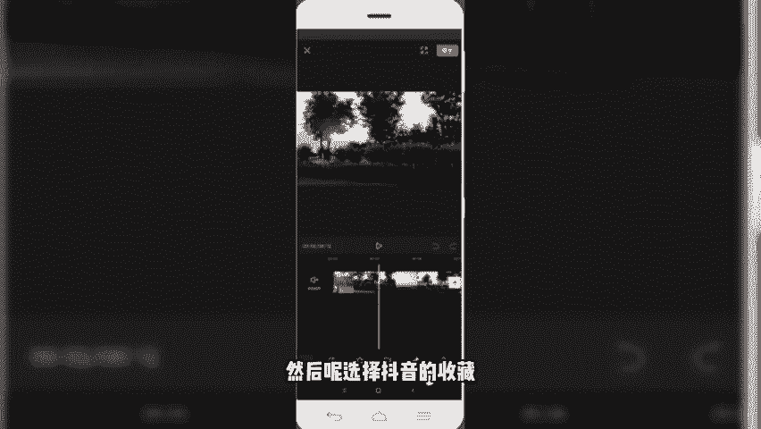

那这块可以看到有一个抖音收藏，我们就可以把刚才选中的那个音乐把它导入进来，我们先试听一下。世界上。

梦心生。好，我们选择使用。那这个音乐呢就插入到我们视频当中，我们同样调整一下位置。好，再来看一下成片的效果。世界上。楽し？短去。She。的皮。好。😊，这是我们讲到的第四个，通过抖音收藏。添加音频。

那第五个的话是我们的录音。就是我们给一些视频。添加一些话外音，或者说一些台词说明的时候，可以选择录音，直接在我们后期剪辑视频的时候给他配入。可能我们当时在现场拍摄的时候呢，没有想到好的文案。

或者说好的一些台词，只需需要这个镜头的话，只是拍了镜头，没有台词。那我们后期想要添加的话，可以通过这块录音，也可以很方便的植入到相应的文案。好，我们举个例子，点击录音。然后呢，摁住这个红色区域开始录音。

就相当于我们用微信语音发发送一样。好，我们测试一段。很喜欢村上春树的一段话。不必纠结于当下，也不必纠结于未来。好，我们试听一下。世界上。好受。Yeah。好，我们保存。保存完之后呢。

可以给我们的音频呢调整一下它的一个音量。悲伤很喜欢。然后呢，把我们刚才植物的这个音频啊，它是本身带歌词的。一般情况下这种我们建议呢选择是纯音乐，这块给它演示。然后呢，我们同样把它的音量呢降低。

很喜欢春上春说的一段话故事。不必纠结于当下。究竟。好，那这样的话，是不是就把我们想要表达的文案主题呢更加凸显出来。那背景音乐就尽量给它弱化，或者是把声音缩小。OK那这块关于音频功能的5个部分呢。

就给大家讲解到这块儿，我们一块儿呢来总结一下。

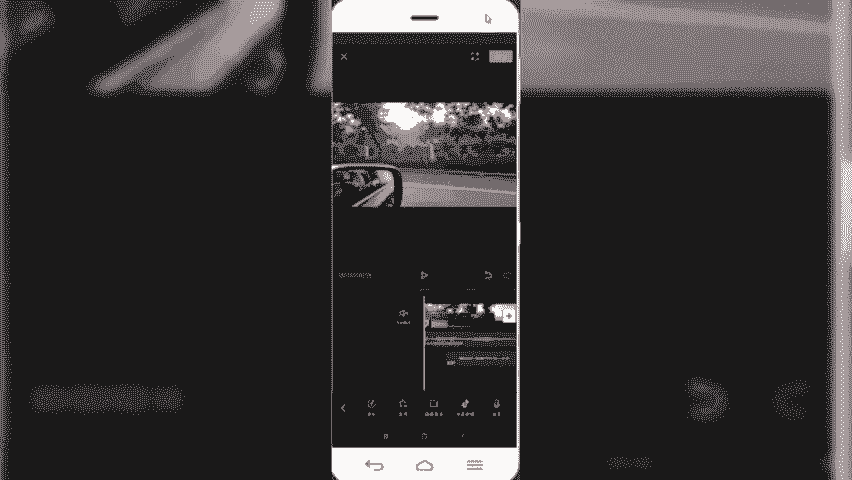

好，通过音频功能呢，可以快速的给视频添加上背景音乐和音效。那么在剪映APP当中呢，添加音乐，我们可以直接从。简映提供的音乐曲目当中，选择抖音的相关音乐添加到其中。还可以选择相应的音效素材呢。

直接植入到我们的视频当中。那另外的话，我们想要拍一些抖音热门音乐的视频的时候呢，可以选择。提取抖音热门视频，或者说我们选择抖音收藏的形式，把这个。音乐呢植入到我们的视频当中。那最后的话是还可以选择录音。

为我们的视频配置换为音。好，本节课程关于剪映的核心剪辑功能，音频功能呢就给大家分享到这里，我们下节课程再见。

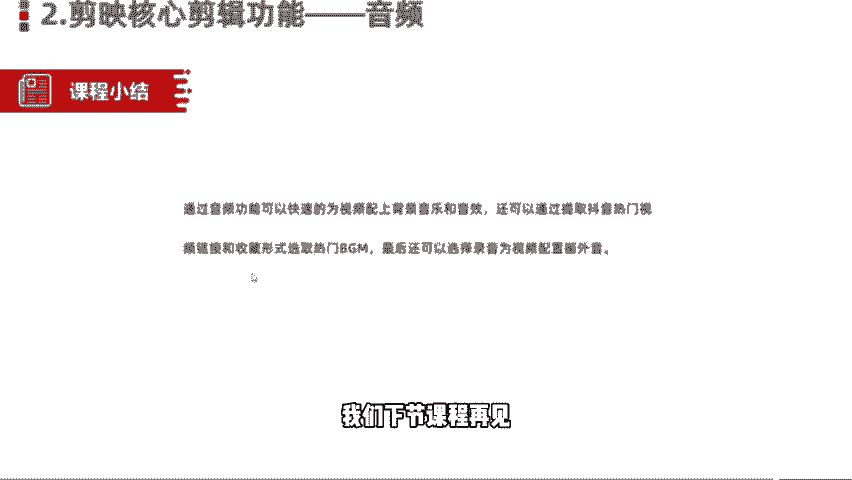