# 【剪映教程】： B站最良心的2024剪映手机版全套教程（适合零基础小白学习） - P12：9剪映核心剪辑功能——蒙版功能 - 视频号运营教程1 - BV1ik1fYEEWd

各位小伙朋友们，那么我们今天呢接着给大家讲的是剪映的核心剪辑功能。蒙版功能。蒙版呢就是我们在剪辑视频当中经常用到的一种遮罩功能。或者说我们在处理视频过程当中，为了让视频看起来更加的精致。

视频当中有一些东西，我们想让它遮挡出来。不让用户看到。那这个时候呢也是用到了一个叫遮罩功能啊，它其实是一个叫隐藏功能，把我们视频当中有些东西呢给隐藏起来了。那么我们在剪映当中啊，就是拥用蒙版功能。

进用蒙版功能可以干什么呢？就我们看到的一些啊转场的特效视频呢，其实大量的应用了就是蒙版蒙版的功能。实现的。好，我们同样是回到剪映当中啊，我们首先给大家看几个案例。好，我们导入素材。好，先看第一个案例啊。

然后点击这块的。预览按钮。不处求。这是第二个案例。那么其实在这两个案例当中啊，我们看到的视频在转场过程中出现这些绚丽的啊地方。比如说我们找一个地方，它在什么地方用到了这个蒙版功能。

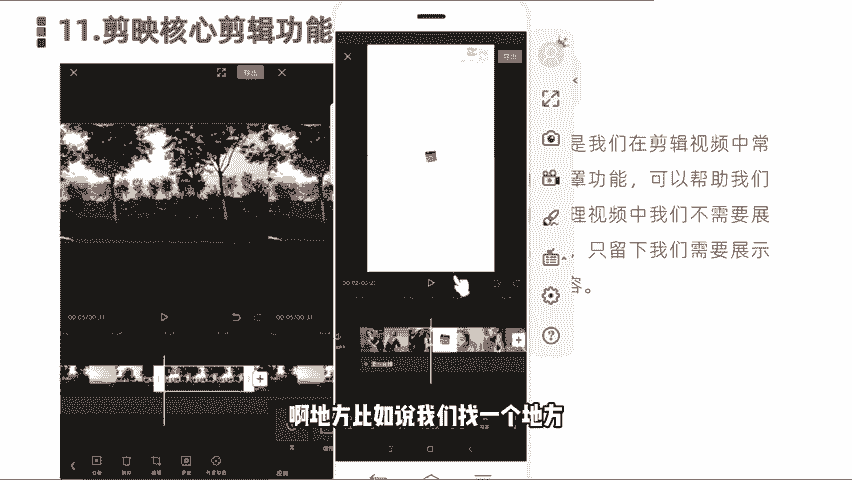

好，我们看这个镜头。在这个镜头当中，画面我们啊把它拉大，可以看的更仔细一些。可以在这块看到出现两个人影，双重人影的结合在一块。那这种情况是怎么做的？它就是运用到了蒙版功能啊。

然后呢把周边的范围值给它羽化掉。那么我们就可以看到这种双重人影的一个转场的效果。那再比如我们看到的另外这个视频当中。那他是看到我们一个五角星这样一个拼图这样一个效果。那他是用到什么蒙版当中的什么呀？

图形蒙版呢，就我们可以让这个视频灯画面以图形的形式，比如圆形啊、方形啊、五角形啊、三角形啊等等形式进行一个蒙版，也是做一个什么比较绚丽的这种专场。好，那么我们接下来的话同样是。

给大家展示一下如何在视频当中使用这个蒙板功能。

好，我们点击开始创作啊，然后呢我们找几张。图片素材导入到。我们随便打打了几张。好，那么我们导入之后啊，正常情况下，我们先来预览一下它的一个这个专场时间比较长。那我们把它时间缩短一下。好。正常情况下。

它是这样一个静态的。那我就是我们看到他这个就。平铺直续这样一个转场，没有一个什么效果。那么我们像刚才看到那个。视频画面当中啊，它是怎么样添加蒙版的啊，我们首先选中第一张图片。

然后在二级菜单下面底部可以看到这块有一个蒙板啊，然后我们添加蒙版。然后呢，在这块的话就看到啊它会默认情况下。比如说像线形的门板蒙版啊就直接添加这样一这种就是最常规的线性蒙版。

啊，我们可以看到这个视频当中的画面就变得比较啊有深入浅状显示出来啊，比如说我们往上拉的越多，它遮盖的也越多。

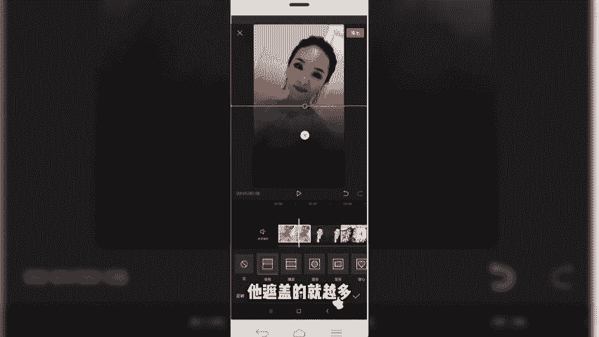

那遮挡起来呢，下面隐藏起来这部分呢并不上没有了1是被隐藏起来的。视频展示的时候只展示上面这部分啊，这是第一种线性蒙板。我们看到的，比如说前段时间比较火的，遇见当年和当年相见啊。

这种视频它就是用到了这个线性蒙板，将中间多余的部分擦除。

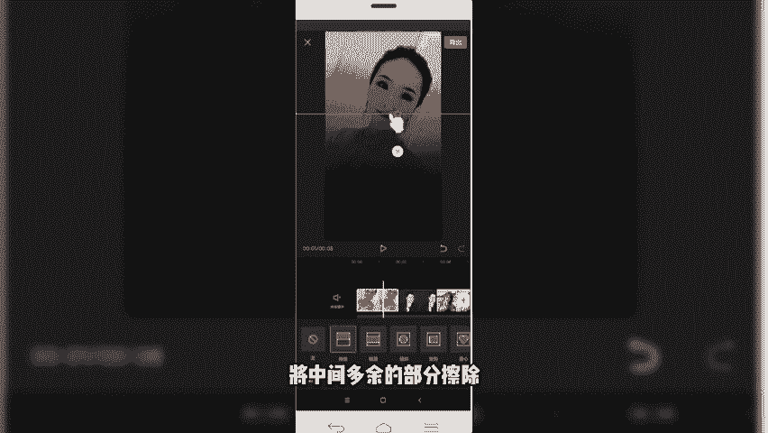

然后我们还有一种是什么镜像的蒙版。那镜像的话，它是向两侧，同时的话啊进行一个优化。啊，我们可以看一下拉拉动这块有个箭头啊，我们拉动这个箭头的话，可以调整羽化的值和范围大小。我们可以看一下那效果。啊。

非常明显。那还有比如说我们看到的圆形。和后面的什么星星五角星同样的道理啊，它就是通过我们。设置这个转场。然后呢，我们比如说拉拉。好，同样是设置这个转场可以出现那种圆形的。这种转场的效果。好。

比如说我们刚才看到这种新型的那同样。啊，选读素材。提限性。

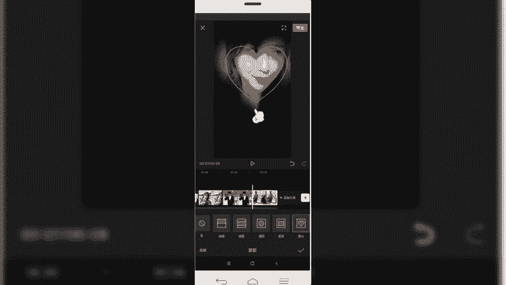

好，我们添加完之后呢，可以再来简单的看一下效果。我们添加完蒙版之后。

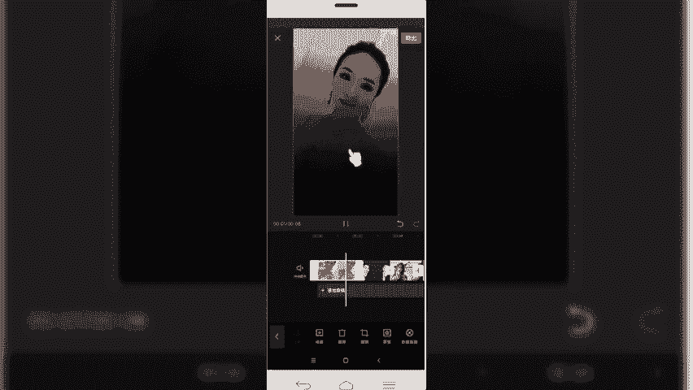

视频是不是就变成我们刚才要的那种效果了？那如果说你像老师我们刚才看到它是动感的那动感的话怎么办呢？我们可以给它添加转场特效。

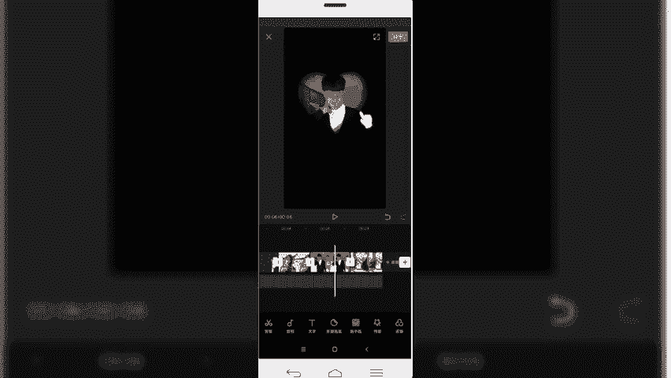

啊，或者添加动画特效。那我们刚才看到了，它是运用了一个叫画中画啊，比如说我们就直接复制了，因为这块做的话就直接复制了，然后选中，然后直接复制图层。添加画动画。

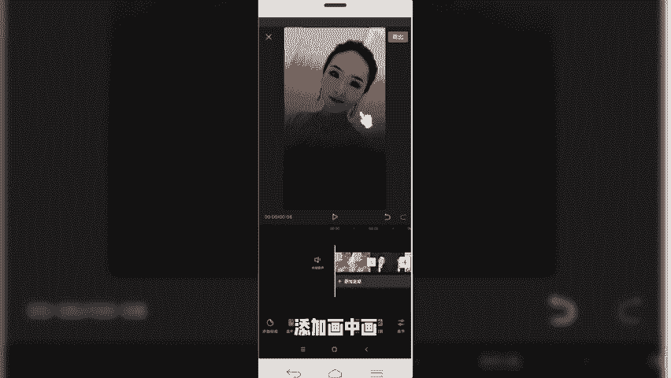

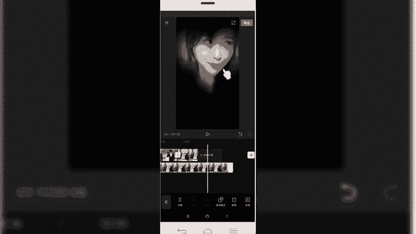

好，重新导入。

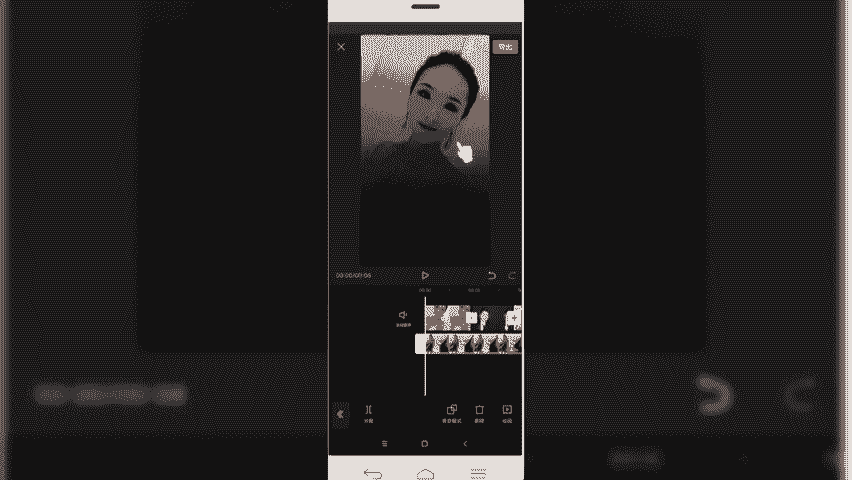

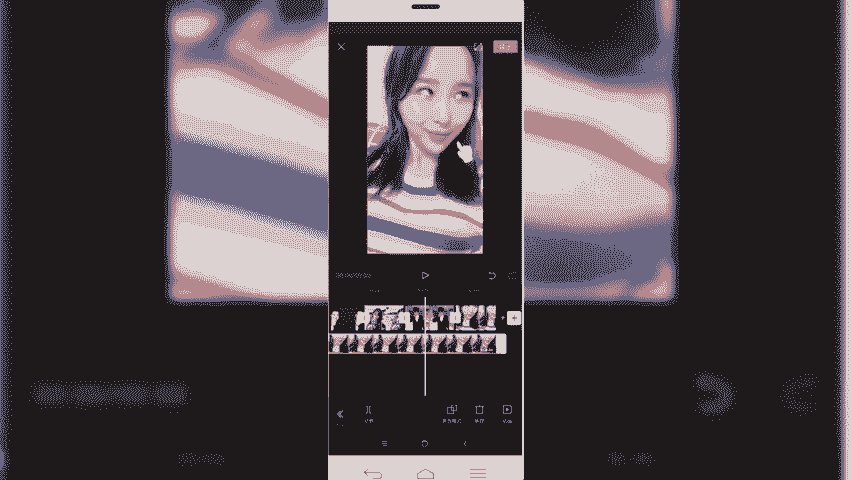

好，我们已经给素材呢添加好这个画中画。那么我们想要出现刚才那种双重影的炫幻绚丽效果的话，就是需要用到蒙版啊。我们选中要添加的画中画，然后呢选择这块有一个蒙版啊，我们找一下模板给它设置一下。在二级探单啊。

然后点击底部的一个蒙版功能。然后我们可以给他选择不同的蒙版啊，比如说选择新型的蒙版啊，调整一下位置。然后是零下雨刮式雨化值。啊，那就可以看到这样一个新形的模板就出来了。要同一下一个视频仪式。

我们给它调整一下时间。啊是这个圆形的。啊，视频比较多，我们就添加3个，然后呢。添加完之后呢，可以给大给他加个动画。讲动画。啊，比如说我们选择个向右甩入。其他的话同样也是选择向右选入。好。

那我们添加完之后呢，再一块来看一下，我们添加完这个。蒙版之后的效果。

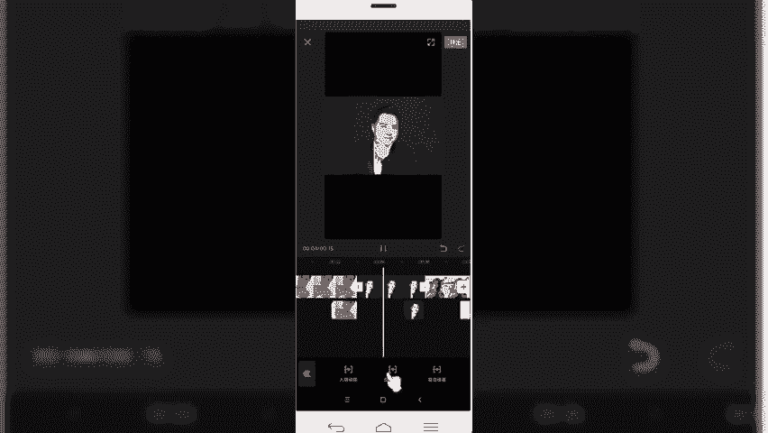

那是不是我们会出现这种双重叠影的效果呢？那这一块就给大家讲到了，我们用到的蒙版来制作这种专场特效。节课程呢内容关于给大家分享的蒙版啊，就讲到这块儿，我们下节课程呢再见。

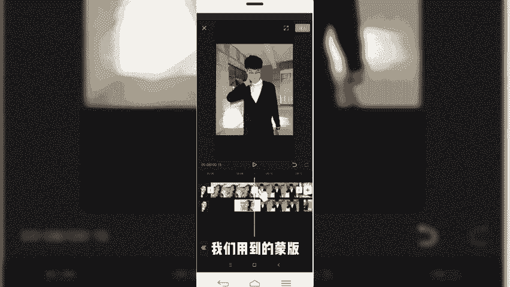

