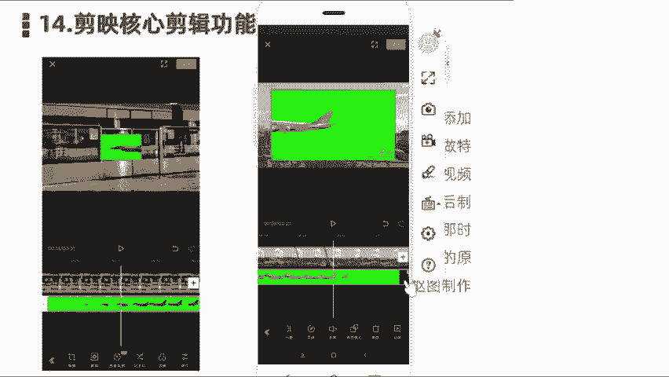
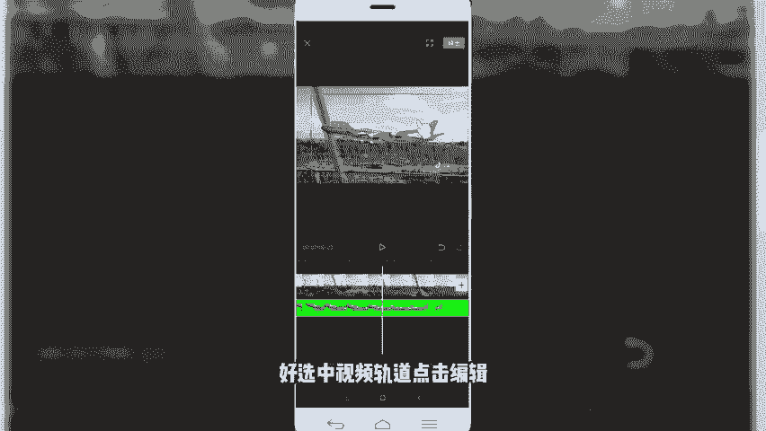
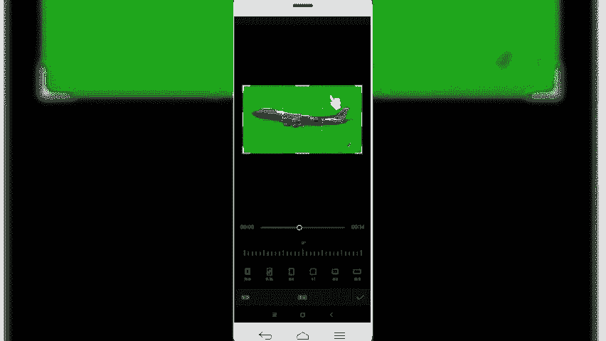
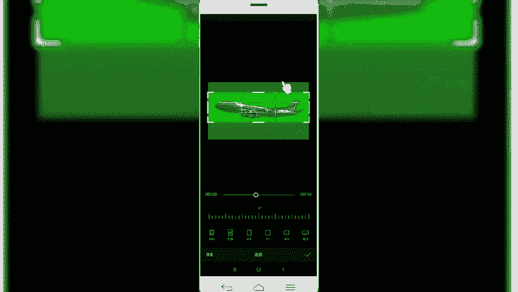
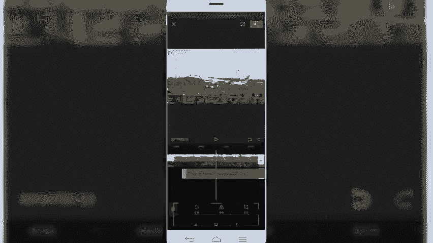
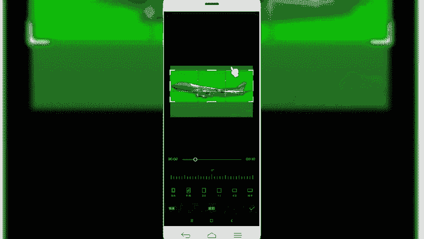
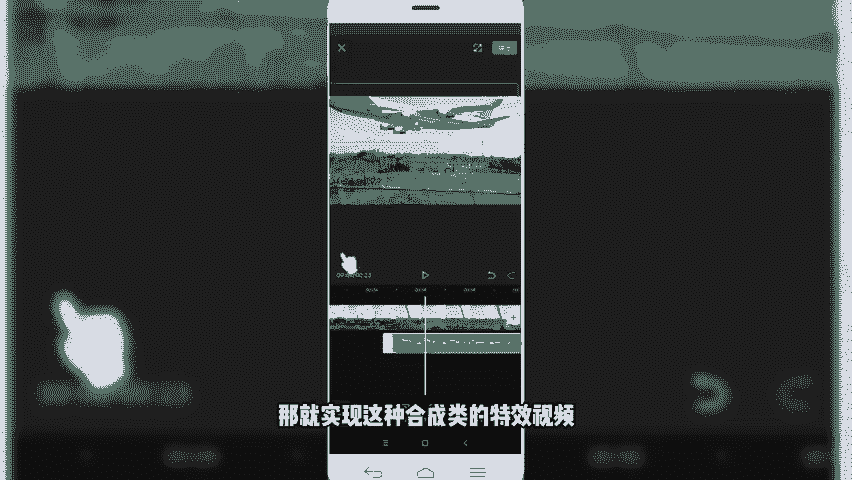
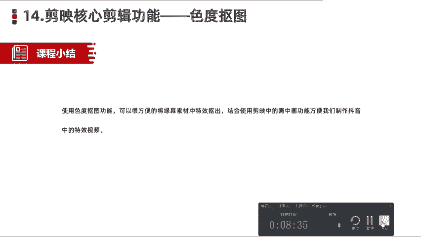

# 【剪映教程】： B站最良心的2024剪映手机版全套教程（适合零基础小白学习） - P13：10剪映核心剪辑功能——色度抠图功能 - 视频号运营教程1 - BV1ik1fYEEWd

那么咱们今天呢记得给大家分享的是剪映的核心剪辑功能。色度抠图。色度抠图呢，这个呢可以说是我们在手机剪辑当中啊，一个非常强大的功能，也是剪映APP呢在这个月刚刚添加的一项新的功能啊。

特别方便大家呢做一些特效类的视频啊，也是我们在过去PR或AE当中合成类拥有最多的。比如说我们的绿幕抠图。把一些特效视频素材的通过率目，然后抠出来，添加到合成到我们的视频素材当中。

那我们在剪映里边添加了这个色度抠图之后呢，也是方便了很多小伙伴呢通过手机端呢就可以制作大量的我们什么这种特效类的一个视频，将我们这个使用这个色度刻图就可以把视频素材呢抠入抠出来。

然后呢添加到我们视频当中。好，那么这一块呢简单的介绍这块。然后呢，接下来同样是进入到我们的。实操当中啊简单的给大家演示一下。我们首先呢是先看一下。好，我们寻找一段视频素材添加进去。大家看一下这个效果。

还好。好，那这个视频说材呢就是很简单啊，左侧呢我们看到它就是添加了这个。是合成之后的这样一个效果。我们看到完成之后的那右侧呢就是我们用到的合成素材。

就是它是一个在绿木啊绿色的背景环境下制作的这样一个特效视频。那制作出来之后呢，和我们左侧这个视频呢合成把背景色绿色抠图之后呢，就会出现我们看到的一个效果。就是用到一个特效。好，那么我们了解了之后呢。

同样是我们再来啊制作一个其他相关的视频看一下。好，我们点击开始操作。导入两端视频素材。好，我们先导入第一段视频素材，然后呢它是一段天空，我们要在天空出现一个什么飞机飞过。怎么办呢？我们选择画工画。

然后呢导入我们第二段绿木的素频视频素材。好，我们已经把蔬材导着进来了。然后我们现没有给它抠图情况下，先来看一下效果是什么样的。

啊，它是这种情况，就背景设置个绿幕。那么我们现在就是需要用色度抠图功能的，把这个绿幕给它抠除掉。好，那么接下来进入制作环节，怎么样制作呢？啊，我们先选中这个素材，然后呢在底部啊找到这个色度抠图。

在在我们蒙版旁边啊，就有一个色度刻考，然后我们选中。然后有一个取色器，那么就是需要选中我们的周围的绿色，把，这个绿色给它取掉，然后呢按住鼠表，然后拖动啊，按住这个是像手，选择一个绿色。然后我们啊。

给他点击一个强度。开始慢慢慢慢慢慢的把这一块这个绿木呢给它去除掉。好，我们可以看一下。那这块是不是已经已经给它去除掉了？当是还有一定啊还有一点点，就是我们可以看到它那个周围还有很多那个绿色的边。

我们可以给再给它强化一下。啊，可以给它添加个阴影。这样的话看起来会比较柔和一些。然后像旁边的那个水印的话，我们可以给它直接裁切掉水印。好，选中视频轨道，点击编辑。

太浅。

啊直接把这个素频素材给它拖上去。把多余的部分给它裁剪掉。

好，那么我们把多余部分拆解掉，然后呢。我们再来看一下。好，那这块也还前前奏呢，它飞机是这种持斜方式的发飞过来的那么我们还需要给它调整一下方位。好，我们把前面多余的部分给它删除掉。然后呢。

给他调整一下它的这个一个入场的动画。增加一个间线。然后呢，前面呢还有一个随性，然后我们突然给它去掉，选中，然后编辑。开见。

好。我们再来看一下效果。In order to maintain。那视频就会出现这样一个视频飞机飞过来啊，然后呢我们可以再给它调整一下。多余的蔬菜删除掉。那视频的飞机呢。

它是从右往左飞过去了那所以我们这块呢需要把它调整一下它的位置。啊，往左移动一下。好，我们再来看一下效果。おし。In order to maintain。这样是不是看起来就会柔和很多。

这是我们用到的很常见的这种通过添加视频素材素材当中一些特效绿目特效啊，用这个色度抠图功能啊，可以给我们的视频当中进行绿幕抠图。那，就实现这种特成类的特效视频。

OK那么我们这节课程给大家介绍的。色图抠图功能呢就简单的介绍到这块。然后我们一块小结一下，使用呢色毒抠图功能，可以很方便的将绿木素材中的特效抠出来。然后呢合成使用我们画中画功能。

方便我们制作抖音当中的一些特效视频。这是我们在抖音当中，或者说我们在小视频当中经常看到的一些特效视频，就是用到这个色度抠图功能来制作完成的。好了，本节课程给大家讲解的简易的核心剪析功能。第14个功能。

色图抠图我们就讲解到这里。我们下节课程呢再见，拜拜。

