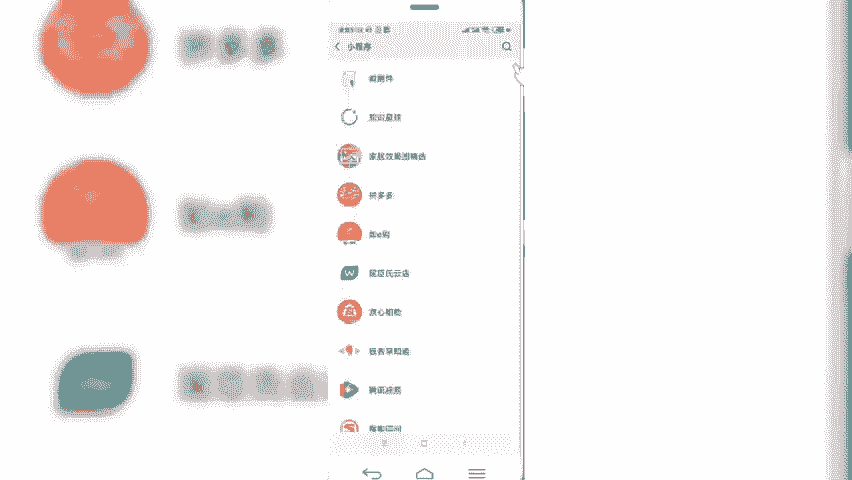
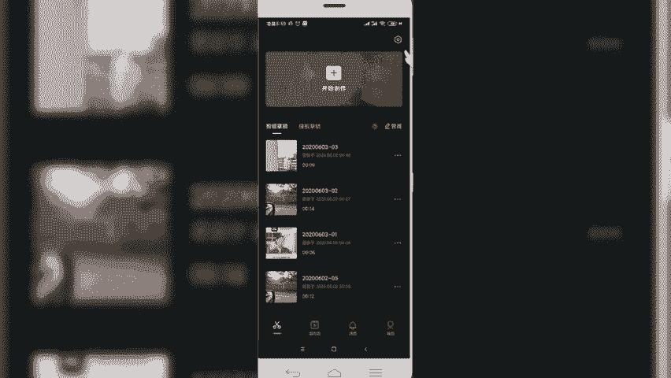
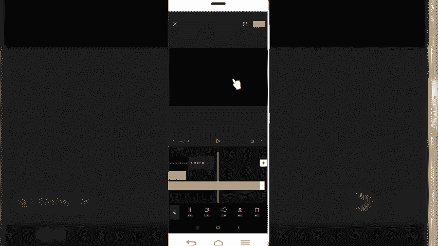
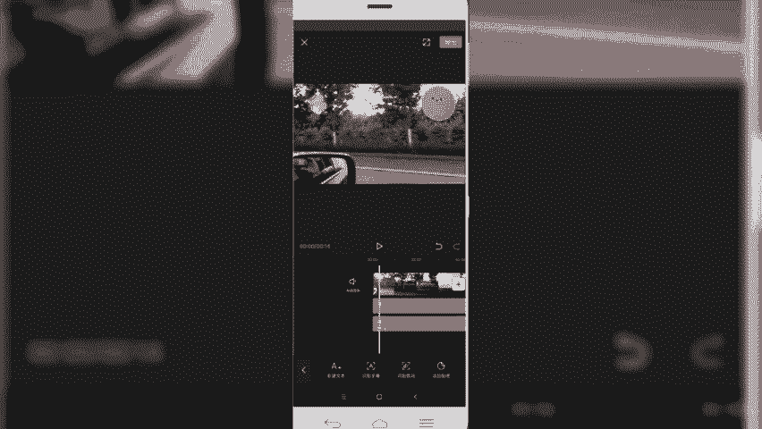
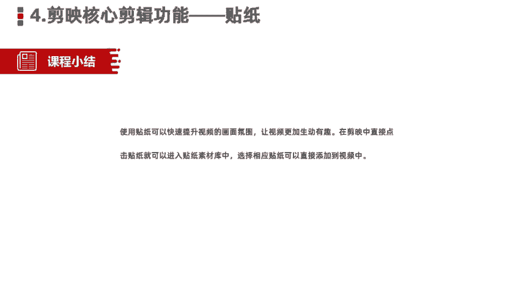

# 【剪映教程】： B站最良心的2024剪映手机版全套教程（适合零基础小白学习） - P17：14剪映核心剪辑功能--贴纸 - 视频号运营教程1 - BV1ik1fYEEWd

那么我们今天呢接着给大家讲解的是剪易的核心剪辑功能，贴纸第四个功能。我们在日常制作北log视频或者美食视频以及屡拍的视频当中啊，经常会看到在视频当中会插入各种各样的好看的贴纸。

那过去贴纸是我们用来做照片修图的时候经常用的一个元素和道具。那么接着我们在今天的视频制作过程当中的同样通过添加贴纸之后呢，也是可以大大提高我们一个视频。的画面质量和我们想要表达的一个。信息源地信息传递。

那在剪映视频当中呢。同样运用这个贴纸添加功能。我们添加完贴纸之后啊，视频库里边会带有很多大量的这个贴纸元素，我们可以选择。一些平台热门的贴纸添加到我们的视频当中，可以提升我们视频的一个呃炫酷的程度啊。

尤其是做那种比如说换装呀啊或者说变身的那种视频啊，通过添加一些这个。贴纸可以大大提升我们的一个视频画面感啊，还有的就是我们看到的那些做日常vlog类的。

通过添加贴纸也是可以提升我们视频的一个形象和趣味性。那这块关于贴纸的介绍就基本到这里。我们接下来的话同样是进入这个贴纸的一个实操环节当中。

好，我们首先新建项目导入素材。世界上。好，这是我们刚才创作的那个视频。然后呢我们可以选择相应的贴纸啊，做一个日常为log的贴纸添加的话，直接在我们的一级菜单组下方有一个添加贴纸点击。好。

可以看到有很多平台上的贴示啊，只有这种。寂寞表情啊，还有一些热门的。也可以添加到我们的视频当中。好，我们随便选一个贴纸添加到里面。太阳。还可以选择其他的。彩虹。还有没log类的。其他的。啊。

文字类的这个贴纸也有很多。当然我们自己在创作视频过程当中啊，可以结合我们的视频题材的类型啊来选择相应的。贴纸添加到我们的视频当中啊，可以大大提升我们视频的一个画面感。啊，视频有很多啊，边框啊。

还有我们看到的蝴蝶呀。花儿啊、文字呀等等有很多啊，这些都是属于贴纸，都可以添加到我们的视频当中。然后添加完之后呢，我们可以设置贴纸的时长，可以让它通篇保持整个视频，也可以给它单独设置一个时长。

设置完，然后预览。世界上。些什。但是。好。同样还可以给贴纸呢设置一个动画。啊，是什么样形式出现的一个动画？好，那这一块的话是给大家讲的关于我们在视频当中如何使用贴纸功能。

好，我们一块来小结一下。在本节当中主要给大家分享的是使用剪映当中的贴纸功能，可以快速的提升我们一个视频的画面氛围，让视频更加的生动有趣。在剪映当中，直接点击我们的贴纸，就可以进入贴纸的素材库当中。

选择相应类别下的贴纸内容，直接插入到我们的视频当中，可以设置这个贴纸的一个时长和它一个什么动画特效。等等。好，本节课程就给大家分享到这里，我们下节课程再见。

