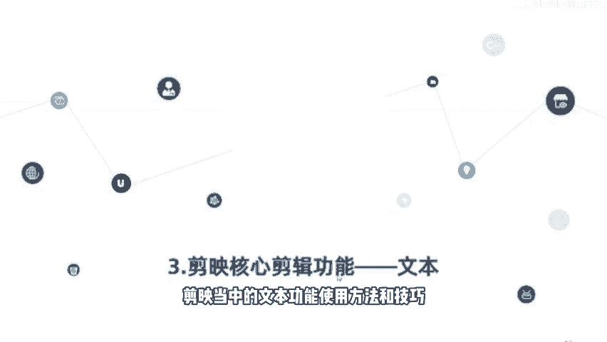
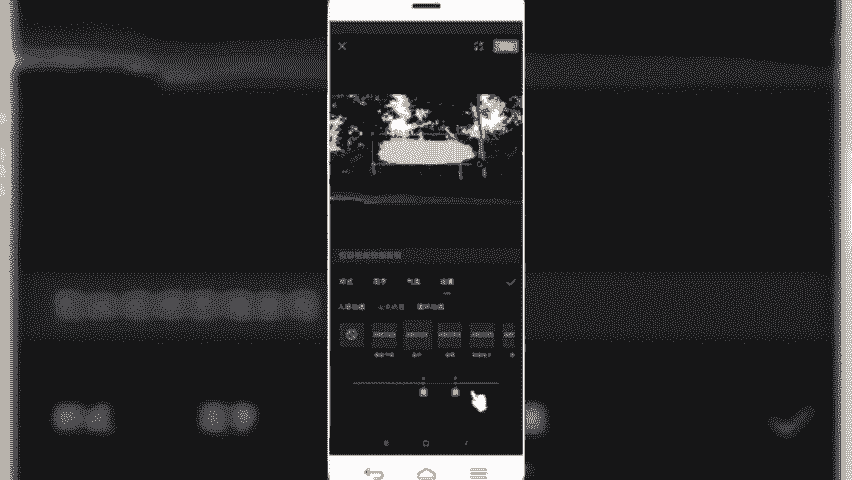
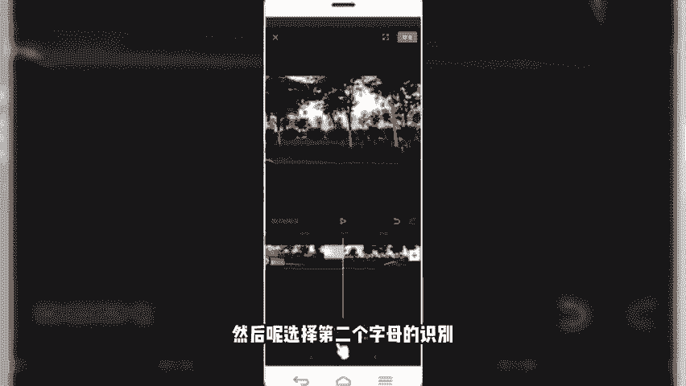
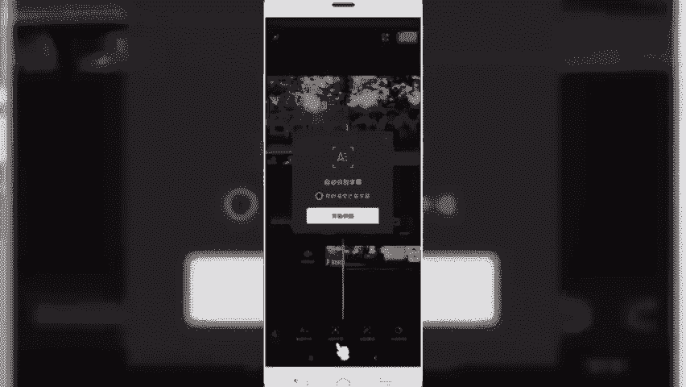
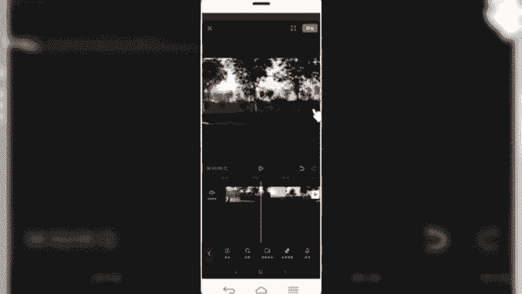
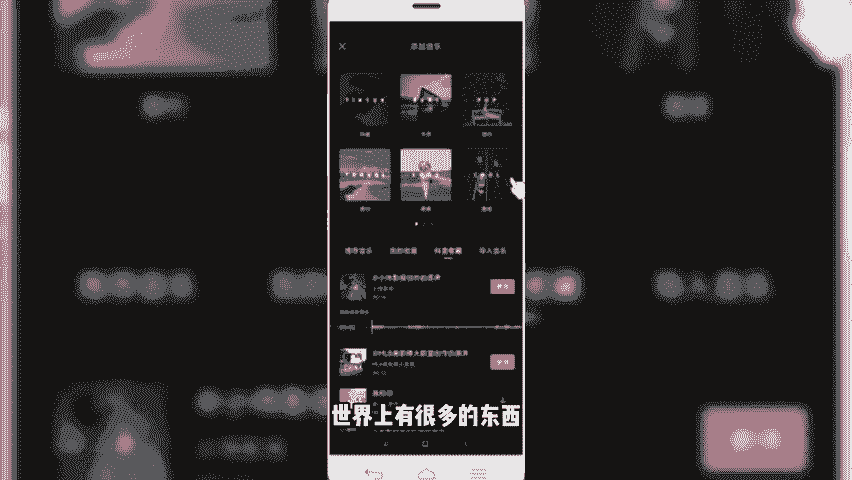
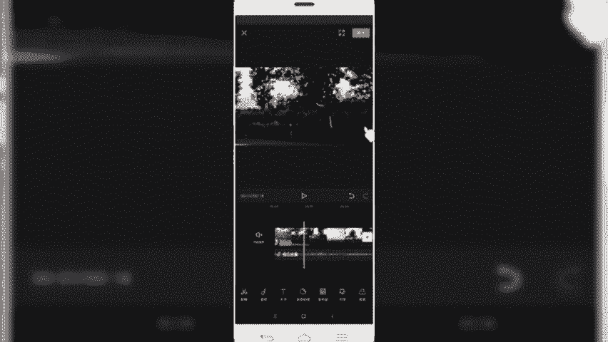
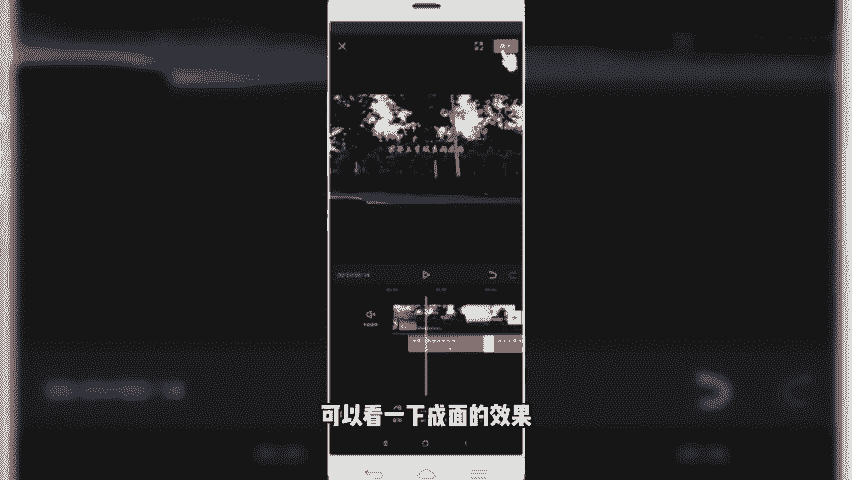
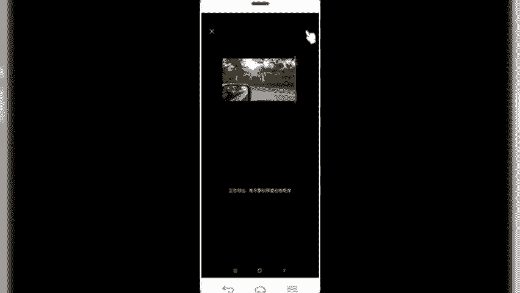
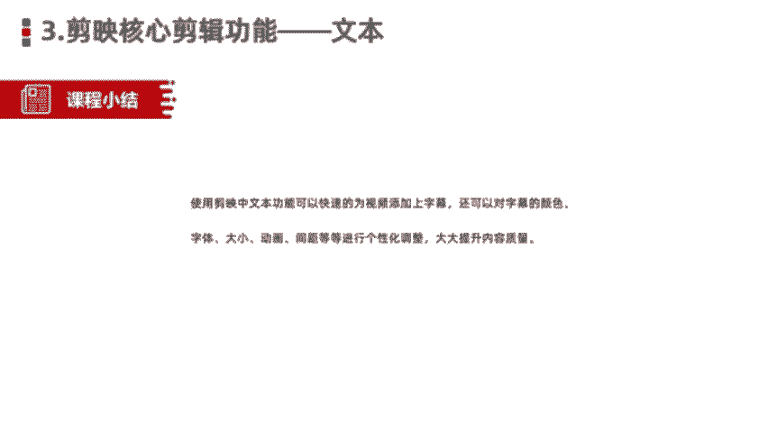

# 【剪映教程】： B站最良心的2024剪映手机版全套教程（适合零基础小白学习） - P18：15剪映核心剪辑功能--文本功能 - 视-频号教学 - BV1p9xsePEvi

咱们今天呢要给大家分享的是简映的核心功能。第三部分文本功能。我们知道一体化完整的视频，除了有视频的画面。背景音乐或者说音频。另外一个。非常重要的元素呢就是文本，或者说叫我们的字幕。

那么我们可以通过添加文本或字幕的形式呢，更加准确的传递出我们视频想要表达的主题和思想以及相关信息。用户在看的时候呢，可以更加的。明确或者更加快速的了解我们想要传单内容。好。

那么这节课呢就给大家讲解的是如何呢通过剪映。给我本视频植入相应的文本，或者说简易当中的文本功能、使用方法和技巧。

在剪映当中啊，我们可以自由的通过文本功能呢给我们视频植入相应的字幕。那植物的字母呢还可以给它单独的设置我们字幕的一个样式，包括字体呀、字号啊。颜色呀、间距呀，以及我们视频的字幕动画等等都可以添加当中。

那另外需要额外给大家讲的是在剪映当中有两个非常好的功能，是字幕的自动识别和歌词识别功能。我们添加了相应的文本信息。可以是手动的，还可以是什么？我们比如说添加好音频了，已经配置好相应的化外音了。

那这种情况下可以通过是识别字幕或者是识别歌词的方式，一键给我们视频快速添加上相应的字幕，非常的快速。降低了我们什么操作的一个难度和时间的成本。最后一个就是在文本功当当中啊，还有一个是可以添加贴纸。

O那这块关于文本功能的基本介绍。就给大家讲到这里。那接下来的话进入我们的一个功能实操演练的环节。那文本功能的同样是我们在添加完视频当中啊，在一级菜单这一块就可以看到一个文字啊，我们点击文字功能。

然后就会出现4个新建文本识别字母识别歌词和我们的贴纸。好，那么接下来进行一个详细的操作。好，还是以刚才这条视频为例给大家进行演示。那么我们刚才呢已经给大家植入了音频。那音频当中呢可以看到。啊。

它是有歌词的。好，我们给大先删除。那么我们在这个视频当中，首先植入字幕，怎么样植入字幕呢？回到一级菜单，点击返回。好，在。底部菜单栏可以看到文字，我们点击文字，然后呢可以跟它添加文本。啊。

我们直接在这块输入。那这块的话，为了方便演示，我就不多说了。六个字，简映视频剪辑教程。那么我们输入完之后呢，可以看到这块就会添加出来这样一个。文字的轨道。那么我们可以给对文字的样式呢进行一个简单的设置。

我们点击底部的样式。然后可以看到对文字的字体呀。一个描边啊或者是标签啊、阴影啊、字间距啊，对齐等等，可以进行单独设置。我们比如说给它设置一个字体啊，新青年体。目前在抖音上特别火。

然后可以给它设置一个描边儿。啊。还可以选择描边的一个粗细度和描边的一个颜色。啊，红色的。灰色的。啊，黄色你可以选择。蓝色的。好，描边粗细度也可以给它家进行调整。那还可以选择什么？

抖音官方推出的什么花字啊，我们在抖音上看到很多。比较有意思的种字体啊，叫花字。那么我们可以直接选中。就一键变成这种花字。像做种草类的视频，或者说做搞笑段子呀，还有那种路人采访的时候。

有很多情况下用到的就是这种。花子。啊，我们可以直接拿过来使用。还有一些呢是我们看到那种综艺节目当中或者vlog当中经常用的这种对话形式的这种。起泡。那同样在这个地方我也是可以植入相应的字幕的。啊。

比如说我们选中这个啊，直接就变成。带气泡的这种分子字体。那第四个的话是我们的动画。可以给我们的文字呢加入相应的动画。啊，比如说添加一个螺旋上升。入场动画。啊，还可以设置一下入场动画的时间。啊。

看起来这样的话，文字会更有灵魂，或者是更加的一个俏皮或者是有趣。也可以设置它的一个出场动画。就结束的时候一个初厂动画。啊，这也可以设置。

好，设至们保存。那么我们再来预览看一下。那就看到我们刚才添加了一个字幕。啊，这是刚刚给大家分享的新建文本。手动输入的方式。那第二个叫识别字幕，就是我们。看到一些视频当中啊。

它是本身dell语音对话的或者是dell文本的。信息通过语音播出来的那这种情况下，我们可以通过识别字幕来添加啊，我同样举个例子，早一段。那么我们可以通过刚才的音频呢录上一段话。好，我们随便举个例子。

剪映视频剪辑教程。好，那这块的话我们添加了这样一段音频。可以试听一下。视频。好，我们有了之后呢，保存回到我们的文本界面，点击文字。然后呢，选择第二个字母的识别。

然后点击开始识别。好，那这块可以看到，同样是也是已经给我们添加出来。我们刚刚录制的这段话。在视频当中就会出现，然后我们预览一下。剪映视频剪辑教程。好，是不是就通过这种识别形式呢。

一键给我们视频快速的添加上字幕了，这是我们讲到的第二个。字幕的识别。那第三个歌词的识别的话，同理那我们添加上一些音频呢是有歌词的那这种情况下，通过歌词识别的话。

也是可以快速的给我们视频当中植入歌词的字幕。啊，我们把这个文字删除，然后呢添加一个。歌曲。

好，选择我们抖音收藏。还是以刚才那个音乐啊，我们试听一下。世界上。

おし？好，它是有歌词的，我们把它导入对齐。然后回到文本的界面。

选择文字，然后歌词识别。

点击开视频。好，那同样情况下，我们识别完成之后呢，也可以看到在我们的视频轨道下方已经出现了这个文字的轨道。然后视频画面当中也出现了我们的。歌词，然后我们同样预览一下效果。世界上。东西生不带来死。あし。

带走的只。也许。自己。的脾气。好，是不是就可以快速的添加上我们的歌词了？那我如果说我们想要提升意境的话，可以给我们的歌词的样式进行一个设置啊，比如说把它位置调整一下。然后呢，选择一个。放大。

然后选择一个其他的字体。然后给大选择一个描边儿。好，然后再给他加一个动画。好，那么我们同样再来预览一下效果。世界上。关心生不。短去。该走的出。🎼己和自己断脾气。好，是不是这样会看起来更加好呢？

如果说我们这块视频。当中的文本信息植入完成之后呢。那我们可以导出，那就视频制作完成了，可以看一下成面的效果。

好。O那这一块的话，关于文本功能的内容呢，就暂时介绍到这块儿，我们一块来总结一下。

当中的文本功能可以快速的为视频呢添加上字幕，还可以呢对字幕的颜色、字体、字号、动画间距等等呢进行一系列个性化的调整。啊，通过添加字幕呢可以大大提升我们的视频内容传达的信息。和我们视频的内容质量。好。

那么今天这节课呢关于简映的核心解析功能，就给大家分享到这里。我们下节课再见。

