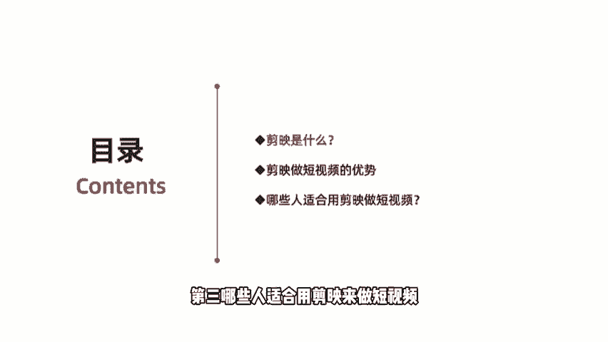
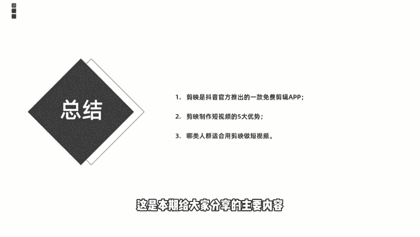

# 【剪映教程】： B站最良心的2024剪映手机版全套教程（适合零基础小白学习） - P3：1快速认识剪映 - 视-频号教学 - BV1p9xsePEvi

那么从今天开始呢，我们就进入正式的零基础，快速学会刷爆朋友圈的抖音爆款视频课程当中的正式讲解内容。我们今天要给大家讲的是第一小节，快速的认识剪映APP。那么在正式讲解课程之前啊。

老师呢首先给大家提醒一下，我们接下来给大家讲的是围绕剪映。APP的剪辑未来讲解的。所以大家在学习课程之前呢，首先是打开自己的手机进入我们手机的应用商件，然后下载下来剪映APP。

如果你是苹果的那你下载苹果版的。如果是安卓的话，需要下载安卓版本的剪映APP好了，那么进入今天的正式课程讲解。我们今天要给大家讲的是快速的了解剪映这款神器。那讲解知识，我们首先来。

了解一下我们的课程内容。

那本节课的学习目标呢一共是分为三个小点，首先是了解剪映的前世今生。第二个的话是了解剪映制作视频的优势有哪些。第三个是了解适合用剪映做视频的人群特点。再来看一下我们的目录，目录呢也是分为三个部分。

第一个介绍的剪映是什么？第二，剪映做短视频的优势有哪些？第三，哪些人适合用剪映来做短视频？

好，我们首先来看第一个小点碱映是什么。

剪映是由抖音官方推出来一款手机视频编辑工具。可用我们手机短视频的一个剪辑制作和发布。他拥有一个非常全面和非常。简洁的剪辑操作功能啊，支持变速啊、滤镜呀。还有转场啊等等多种剪辑效果。

并且带有抖音官方的丰富的音乐素材资源。说起这个剪映啊，就不得不提。制作和推出剪映神器这款公司。那这个制作和推出剪映APP这个公司呢，它叫深圳联盟科技有限公司。联盟科技有限公司啊，如果说。之前对视频剪辑。

尤其是手机视频剪辑这块儿比较感兴趣的小伙伴应该了解联盟科技呢，它是被字节跳动，也就是我们所谓的抖音公司呢是给搜购过来的。那收购了之后呢，有联盟科技。它本身也是个做贴纸。这样一款。公司。

那么他在被抖音收购之后呢。为了迎合抖音短视频的更好发展，或者说为了迎合头条戏在抖音。布局短视频赛道上的更好发展。那推出了剪映APP这款神器，它是在去年3月份的时候上线的。我们知道快手的话。

快手在早期起步的时候呢，也是以主打视频剪辑工具为主的。那快手在早期呢叫Zf的一个动图制作工具。然后随着快手短视频的发展，那它可能。剪辑操作这块的变得更加的娴熟和技术的更加丰富。随后呢。

快手也单独推出了自己的一个剪辑工具，叫什么？叫快影。那抖音也是为了应对快手的。发展或者说在短视频在市场里深耕领域，或者说更好的推动抖音的一个发展。辅助于它的一个后期的发展的话，他推出了剪映这款神器。啊。

这是剪映它的一个。出发点或者说检映它由此得来的一个。原因。OK那么我们了解了这个对于我们今后。开始做剪映视频或者说抖音视频的时候，那就为什么明白在抖音上有很多所谓的爆款视频是由什么剪映发布的。啊。

因为它是获得了抖音官方的流量扶持和推荐的。这对我们想要进入抖音这个赛道上进行深根发展的话，是有非常大帮助的。OK那这一块的话是简单了解一下剪映APP。如果各位小伙伴手机上还没有下载剪映的话。

那么建议大家课程结束之后呢，赶紧去手机上下载自己的剪映APP。那么我们接下来讲解的剪映视频教程呢，都是围绕它来展开的。好，那么我们来小结一下剪映是什么？

剪映是由抖音官方推出的一款超级好用的免费的剪辑APP。那这里也要强调一个点，就是我们过去在手机上可能下载了很多，比如说快剪辑呀、爱剪辑呀。viidedeo leap、乔颖啊等等。

这是各位早期都能接触到的比较熟悉的手机视频剪辑的APP。但是这些视频剪辑工具有一个通的特点，就是一般都是收费的，要求我们开通会员。那么剪映呢它是一个完全免费的这样一个视频剪辑神器啊。

这一点是非常nice的，因为它不是以。剪辑工具来给它。赚钱的而是靠什么剪映来推动抖音发展的这样一个辅助类的工具。那所以它是一个完全免费的，而且它非常好用。比我们前面讲到的爱剪辑快剪辑。

或者说video leap，它的一个操作的界面或它的功能都是非常简洁上手的。对新手小白来说太友好了。我们拍摄完之后，或者我们剪辑完之后，直接可以一键上传分享到我们的抖音平台。

OK那是这这会儿给大家分享的简映是什么？

那接下来的话要给大家讲的是。第二个小点。剪映做短视频的优势有哪些？我们为什么要给大家讲剪映？

在这块的话，我们总结了一共是5点关于剪易做短视频的优势。简单来跟大家分享一下。第一个呢是简单好用。剪映它是一个对零技术或小白来说，非常nice的这样一个神器，就它的操作界面和它的操作功能，非常简单。

我们一学就会不用有很复杂的一个剪辑逻辑在里面，非常简单。第二个的话是它是一个完全免费的剪辑神器，不需要我们开通会员啊，或者说我们花钱买什么样的一个素材啊等等，完全是免费的。

你像早期的时候videolip呀、巧颖啊，还有爱剪辑呀，包括自缩啊之类的这些剪辑APP，他们啊都是打着所谓的免费剪辑神器这样一个。噱头呢吸引用户去下载。但是呢我们想要制作出一些比较好的视频。

或者是使用一些特效的时候呢，都会需要要让我们付费。所以这一块的话剪映是非常不错的，完全免费。第三个呢是功能强大，简映。虽然它现在还只有2。7的版本。

但是呢它还在陆续的更新当中剪映目前应用的功能是非常强大的。几乎可以说满足于我们在抖音上做小视频的各类需求。啊，像文本呀、音频呀、贴纸呀、特效啊，包括最近刚刚上映的。色图。包括最近刚刚上线上映的。

色度抠图啊，把我们一些绿木素材呢放入到其中啊，通过画中画特特效功能，可以实现我们一个色度抠图，把我们绿木素材植入其中啊，实现我们合成的那种所谓的特效视频啊，这是它的功能非常强大。第三个的话是海量素材。

第四个的话是海南素材，抖音上提供了大量的。音视频素材库。那么我们在剪映当中剪辑视频的时候，可以直接拿过来这些视频的素材，或者说拿过来这些。热门的BZM。然后呢，剪辑到我们的视频当中，做出同款的热门视频。

啊，除此之外呢，剪映本身也自带了大量抖音当中经常用到的一些竖频素材。那我们在剪辑的时候可以完全拿过来，非常的方便快捷，不用我们自己去寻找。对小白或新手来说是非常好用的一个这样的特点。那最后一个的话。

不得不强调和。再次重新声明一下，就是官方推荐。啊，抖音。和剪映他是一个什么都是一个兄弟，他都属于直接调动这个公司。那么我们通过剪映剪辑的视频，在发布到抖音的过程当中呢。

抖音默认情况下是给到流量推荐和浏量扶持的这是为什么我们在抖音上看到很多视频的下方，它带有小的字幕标明。简映分享或者是简映制作。他就是告诉我们是通过这个视频呢，是通过剪映制作完之衡之后呢。

一键分享到抖音上的。那么我们想要在抖音这个平道平台深根发展的话，那么剪映就是一个非常好的。推荐渠道和流量。啊，因为官方是自动会给到我们流量的。OK那这一块的话是给大家总结的关于剪映做短视频的五项优势。

好，我们一拉一块来小结一下使用剪映来制作短视频的五大优势。第一个简单好用。第二个呢完全免费。第三个功能非常强大。第四个呢，海量素材最后一个官方推荐。

好，刚才呢给大家分享的是第二点，剪映做短视频的优势有哪些？那接下来的话给大家分享的是我们最后一个小点，哪些人适合用剪映呢？做短视频？

我们归纳了三个小点。第一个呢。是喜欢拍摄，嗯，姐要学剪映，或者说喜欢。剪辑视频。那这个第一个是其次。

OK刚才呢跟大家讲的是第二小点。剪易做短视频的优势有哪些？那接下来的话讲的是我们第三个小点，哪些人群呢适合用剪映做短视频？

剪映虽然说是一个。入门级的这样一个视频剪辑神器，对于各位新手或者说小白来说非常的nice。但是。他并不适用于所有人。那我们只是提出来，他对哪些人特别的友好，或者说特别适合哪些人用剪映来做短视频。

我们归纳了三类。第一类呢是喜欢拍摄类的。各位网友或各位用户。那么我们知道现在是一个什么移动互联网时代，我们很多操作师特别是喜欢用手机来完成的，能不用电脑的就不用电脑。对于拍摄同样是我们知道。

虽然拍摄神器或者是剪辑神器，传统的PRAAE啊，或者说国产类的绘尘辉影啊。爱星万星神箭手啊。但是如果说我们卖出的时候，拿电脑来剪辑是非常不方便的，严重影响我们的一个工作效率。而且。用PR或AE剪辑的话。

是对各位要求比较高的。那么我们知道它不光对电脑的硬件配置，还是对你的剪辑技术要求都是非常高的。是一个专业的剪介软件。但是呢我们通过剪映的话，可以非常快速的制作出这样一款视频。那所以第一个是什么？

喜欢拍摄视频的。这类用户第二个的话是愿意分享。我们知道抖音也好，快手也好，这类短视频平台更多的是提倡各类用户呢在平台上分享我们的日常生活，分享我们的日常点滴，分享我们的感悟，亲亲柔性爱情等等。

所以第二个要愿意分享。你有更多的故事愿意分享的时候呢，我们才愿意什么把我们的视频呀，把我们的内容呢记录下来，然后呢在平台上发布。第三个的话是非常适合于短视频新手，对于那些想在短视频领域深耕。

或者说想做短视频自媒体小白来说的话，剪映是一个非常nice的这样一个剪辑神器。它不需要很多的一个什么剪辑技术，或者说它的一个操作度是非常简单的。对小白或新手来说，可以快速的上手，简单实用。

OK我们同样来小结一下哪些人适合做。简映短视频的三类人，第一个喜欢拍摄的人群。第二个呢愿意分享的人群。第3个。

对完视频的新手。好，这是我们本节课程跟大家分享内容，一共是总结下三个小点。第一个，剪映是抖音官方推出来的一款免费剪辑神器。第二，剪映制作短视频的五大优势。

刚才也给大家分享了最后一个三类人群适合用剪映做短视频。OK好好学好好看，这是本期给大家分享的主要内容，我们下节课再见。

