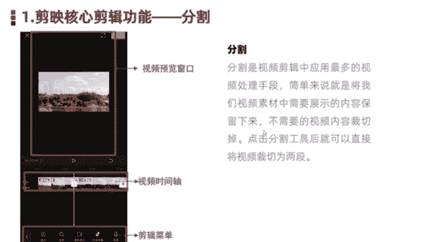
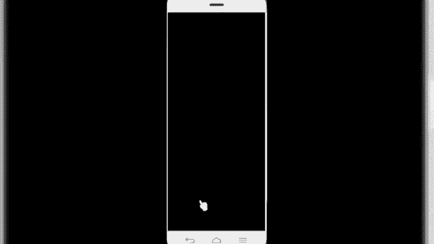
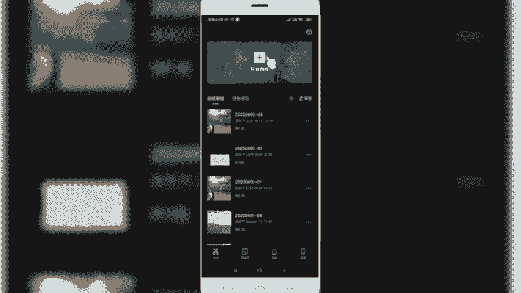
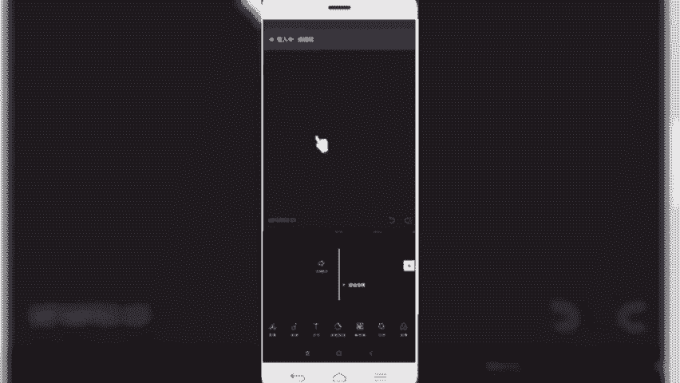
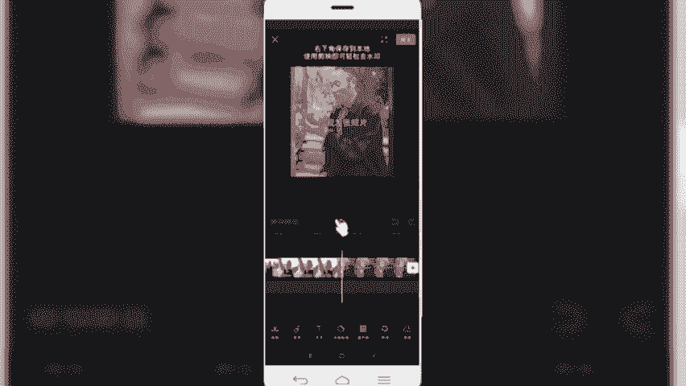
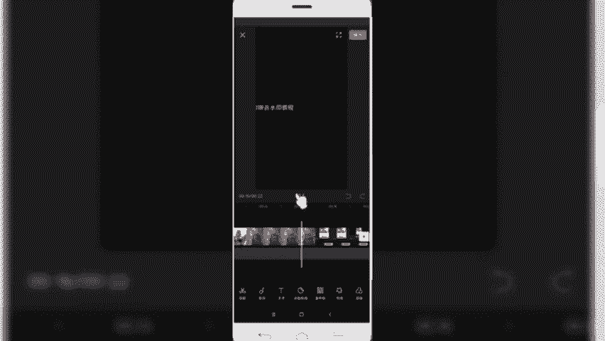
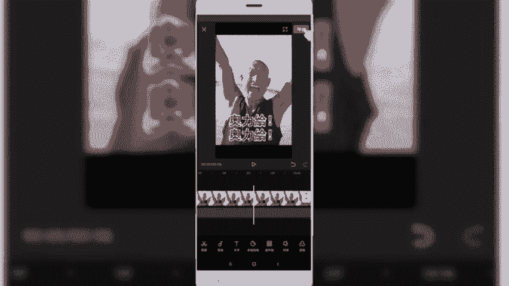
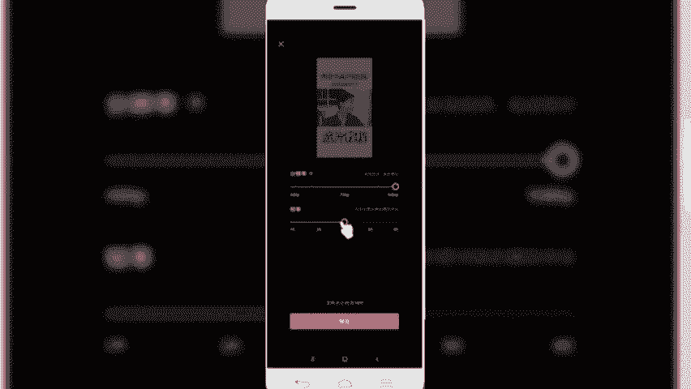
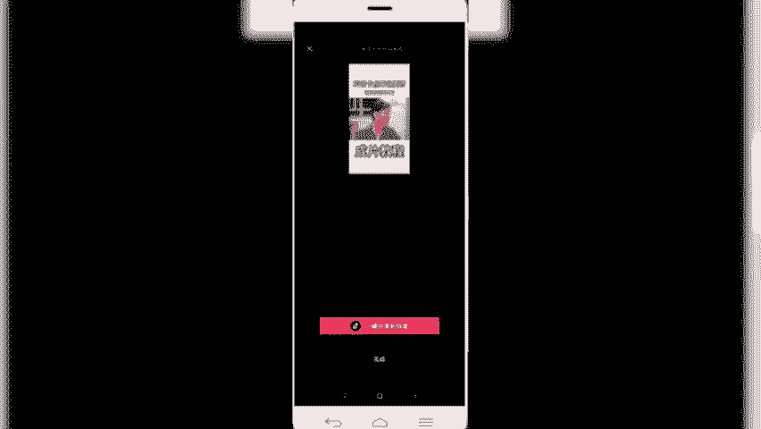
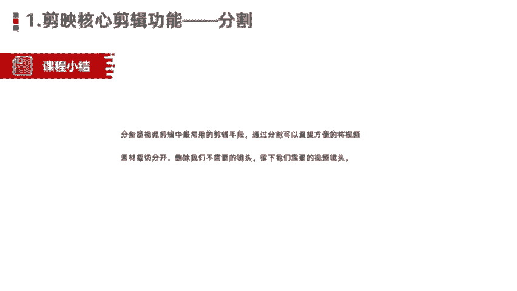

# 【剪映教程】： B站最良心的2024剪映手机版全套教程（适合零基础小白学习） - P5：3剪映核心剪辑功能讲解--分割功能 - 视-频号教学 - BV1p9xsePEvi

那么今天呢给大家讲解的是剪映核心的剪辑功能。那么我们在上节课呢跟大家分享的是剪映APP的一个界面结构。我们了解了剪映主要有四部分组成，剪辑剪同款。消息和我的。那么在这四项功能当中呢。

剪辑和剪同款是我们学习剪映APP剪辑的核心两部分。那么我们要学习核心哪两部分。那接下来的话就是围绕剪辑功能的主要内容给大家进行展开来讲解。好，那么首先来看一下本堂课的一个学习目标。

掌握剪映APP的核心剪辑功能，包括分割、音频、文本、贴纸、特效、蒙版等等15个。剪辑功能，这是我们各位小伙伴学习剪映APP的必须要掌握的这15个功能。这对我们后期剪辑各类抖音视频的时候帮助非常大。

我们看到的各类爆款视频也是由这些功能组合起来制作出来。好，再来看一下我们的目录。目录的话也是按照功能来进行划分的。主要包括这15项。第一个分割功能。第二，音频功能、文本功能、贴纸功能、画中画。

特效滤镜调色比例调整和背景设置。视频过渡转场。定格功能蒙版倒放变声色度抠图以及抖音常用的素材片段这15个部分。好，我们了解了目录之后，那接下来的话就是围绕。剪映的核心功能展开来给大家详细讲解。

首先给大家介绍是第一项功能，分割功能。分割功能是我们在剪辑视频当中运用最多的视频处理手段之一。简单来说就是将我们。拍摄好的视频素材在剪辑过程当中。把需要展现出来的。

或者是说保留下来的视频素材呢给它截取出来，然后不需要的或者说。视频镜头不太友好的画面呢，我们需要给它裁切删除掉。或者说分割掉，那这个时候就是用的分割工具进行剪辑。通过分割直接将我们的视频裁切成两段。

然后把多余的部分删除掉即可。那右侧的话。我们看到的这个视频画面是我们在剪映当中的一个剪辑。图片那我们可以看到在上方呢是一个视频的预览窗口。然后中间这部分呢。是时践轴。

所有的视频剪辑软件呢都会有这样一个时间轴。中间这条白线。就是我们的时间线。也是我们视频剪辑过程当中定位的点。就比如说我们想要把视频定位到第两秒钟或第三秒钟这个位置。

那么我们需要把这个视频时间线放到视视频的第两秒或第三秒，然后进行拆解，或者说分割才能实现。在第二秒或第三秒拆解视频。那再往下的话是我们的剪辑菜单。

我们对视频所进行的一系列的剪辑操作都是在底部这个菜单进行的。包括我们的音频呀、文本呀等等。后期讲到的其他功能也都是在底部菜单进行选取，然后呢开始对视频进行一列处理。这是我们第一部的剪辑菜单。好，那关于。

分割功能的基础介绍呢就跟大家讲到这块儿。那接下来的话是我们进入到软件当中实操给大家演示如何使用分割功能。

好，我们首先呢启动剪映ipad。启动好之后呢，我们首先进入到的界面呢。就是剪辑的界面。那我们在这个地方进行剪辑的话，首先是点击顶部开始创作。

将我们要剪辑的视频素材呢导入到。项目库。我们选择一段说词与视频说材而已。

好，我们把这个视频素材导入来。然后呢，首先可以简单的点击顶部预览窗口的播放按钮，可以预览一下视频。办法吗？

好，那么我们预览这个视频之后呢，我们假设我们想要把这个。视频的几前部分那个镜头。想要把它保存下来。或者我们想要把中间这个奥利给这个镜头给它保留下来，其余的部分呢我想删除掉怎么办呢？啊。

我们首先是需要把这个光标呢定位到我们的。镜头的这个参文点啊，我们可以看到在这个时间线左右是这个两个镜头的一个衔接点。那我们首先把它放大看一下。放大的话。

用我们的食指和我们的中指摁住这个时间轴左右来回拖动，左右同时拖动。把它放大。好，那现在是放到最大了。放到最大之后呢，我们把中间的白色时间线定位到这个位置。然后呢，选择选中视频，点击一下。

可以看到周边加了一个白色的框线，这是代表我们选中了。选中了之后呢，我们可以看到在底部一级菜单这进来之后有一个分割功能，我们点击分割。啊，然后呢这块就加了一个白色小方框，那就代表我们视频剪辑分割了。

所以现在的话就已经分成两段了。那么我们想要把这一部分呢保留下来，那么前面这部分呢就是多余的，我们需要删除，然后呢同样是点击选中。O那这块的话，首先是我们前边这部分的视频片段就选中了。

然后点击右下角的删除。好，那前部分视频呢就删除了。然后我们接着。想要把这一部分的。镜头给它保留下来，那么我们就需要找到下一个视频镜头的一个连接点。好，我们找到下一个视频的剪辑节点。

我们来把同样把时间线定位到这个镜头衔接处，然后呢选中视频。然后点击分割功能。好，那么这种情况下，我们把这一部分也给它拆切分开了。然后我们选中后面部分多余的删除掉。那么我们中间截取的这部分呢。

就是我们想要的部分。然后呢，我们点击预览看一看一下效果。好，我们可以看到啊在视频的第一秒和最后一秒呢都是呃上下两个衔接镜头的画面。我们如果说不想要的话，可以也给它往后再裁切一下。好。

我们先拿最后这个为例。再分割。然后把右侧多余的这部分呢给它拆解掉。好，同样前部分也是。好，我们重新再预览看一下。好，那我们通过这种分割的话，就把中间这部分保留的镜头的给留下来了。

那么我们后期在制作的时候，可以通过这种方法分割，把我们想要的镜头给它裁解出来。裁剪完之后呢，我们可以点击右上角的导出。

然后设置一下我们导数的分辨率和帧率一般默认情况下选择1080P和3值帧率，然后呢选择导出即可。

OK那么我们就把这个视频给剪辑完成。好，回到我们的课件。

好，我们来小结一下。那么刚才呢给大家分享的是剪映的核心剪辑功能，分割功能。分割呢是视频剪辑当中运用最多最广的一种视频剪辑手段。通过分割呢可以将我们想要保留下来的视频片段很方便的直接裁切分开，然后导出。

把我们需要的视频片段就保留出来了。那留下的镜头呢就是我们在后期剪辑拼凑片段的时候呢，把我们的这些镜头拿过来，直接可以作为素材来用，或者说直接就剪辑好我们的视频了。那在剪映APP当中呢，直接选择分割功能。

就实现了我们的视频的一个拆切。操作呢也非常的方便。我们在操作的时候注意是。分割好我们时间轴定位的线，然后围绕这个线呢直接裁切就可以了。好，今天呢关于。简映核心功能的分割讲解就给大家介绍到这块。

我们下节课再见。

