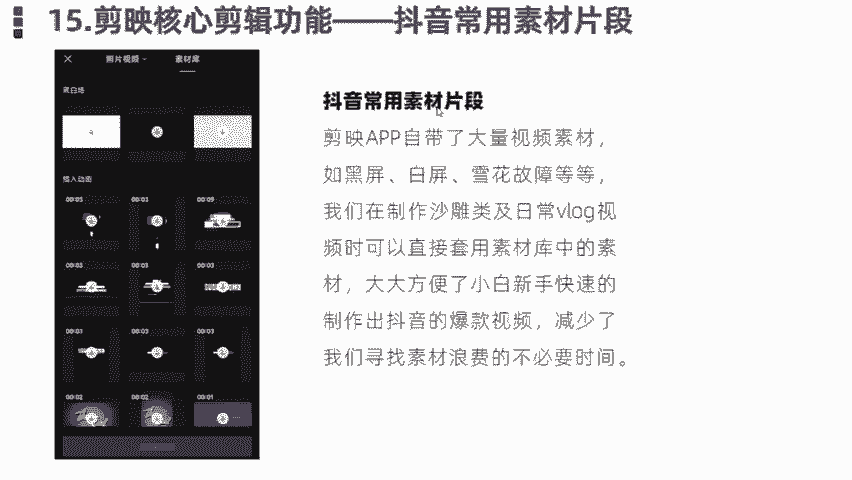
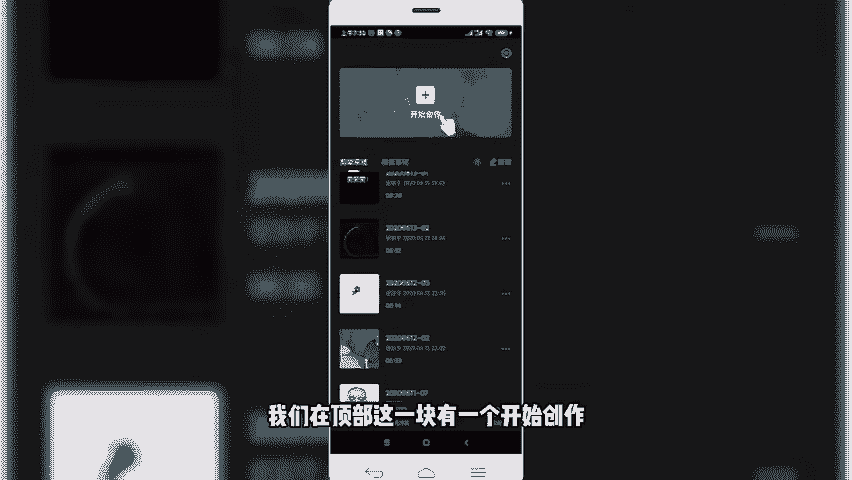
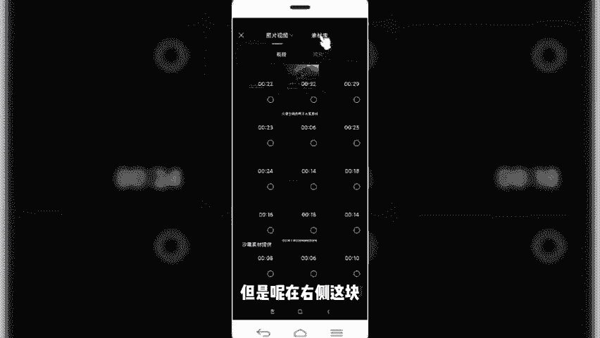
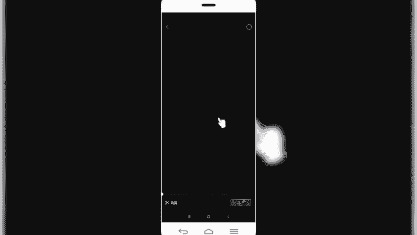
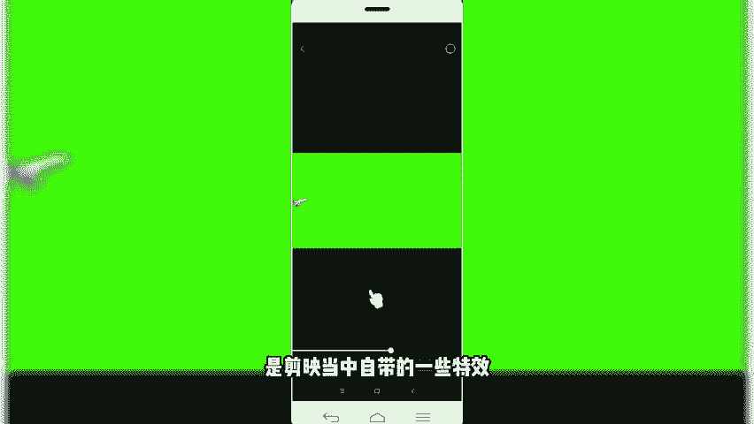
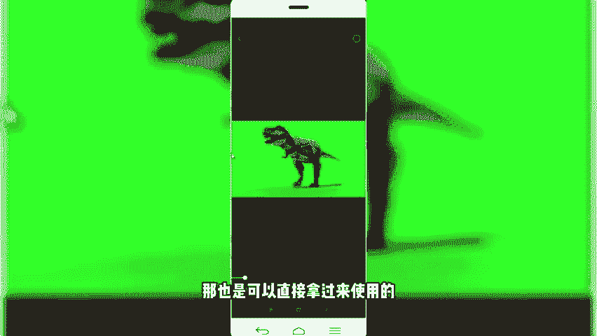
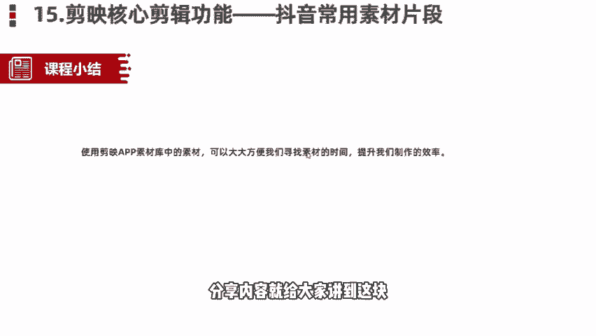

# 【剪映教程】： B站最良心的2024剪映手机版全套教程（适合零基础小白学习） - P8：6剪映核心剪辑功能——常用素材片段 - 视-频号教学 - BV1p9xsePEvi

那么今天这节课呢还是给大家分享的我们剪映的核心剪辑功能最后的一个功能。第15个功能，抖音的常用片段素材。这些片常用的片段素材呢，很多小伙伴在刚开始特别是新手制作的时候啊，经常苦恼这些素材从哪儿来的？

我怎么用呢？我从哪儿找呢？其实啊在我们的剪映APP当中啊，自带了大量的视频素材啊，比如说黑屏啊、白屏啊、雪花故障等等啊，在我们制作一些沙雕类搞笑类段子或者日常北log视频当中啊。

可以直接套用素材库当中的一些视频素材，大大方便了我们新手小白，或者是说我们刚开始的初学者呢找素材这个时间成本啊，提高了我们一个制作的效率。减少了我们寻找素材当中不必要的一些时间浪费。

那么这个剪映当中的素材库在哪儿呢？啊，我们一块儿来看一下啊。

啊，同样是回到我们的这个app郎当中。啊，然后呢我们在顶部这块有一个开始创作，我们看点击开始创作，然后呢。

再导入视频素材库这一块可以看到左侧呢是照片和视频。这一块我们看到的照片和视频呢是我们手机上自带的像素。是我们手机上当中的自带的一些什么素材，视频素材、图片素材。

但是呢在右侧这一块细心的小伙伴会发现有一个素材库啊。对，就是这个地方。我们在这个地方呢同样也是可以添加相关的视频素材。那这些地方添加的食频素材呢就是我们刚才给大家讲到的剪映APP当中自带的一些视频素材。

那我们在制作一些视频，比如说像在那个雪花啊，还有像这种视这种雪花，都是我们比如在制作的一个日常的沙雕视频当中经常会看到的。

那还有比如说绿木，那这些地方当中也提供了很多绿木。那比如说我们看到的像这个小鱼啊、飞机啊，对吧？比如说我们可以看一下。

可以预览一下。啊，就是简易当中自带的一些特效。

再比如动物。恐龙。那也是可以直接拿过来使用的这些视频素材，就特别方便我们啊，这块树视频素材非常多啊。

喜欢的或者感兴趣的小伙伴们呢，我们可以呢在这块多看一些或者多使用一些，反复调试一下啊，里面也非常多。比如说我们遇到一些搞笑的视频片段，像这个。那很多小伙们可能在视频当中经常会看到这个视频接头。ああは。

那这都是剪映当中视频库自带的啊。啊，我们同样点击加号回到添加素材库，然后我们可以再往下滑，有很多啊。那这块有很多。啊，比如新闻类的春节类的，它会发分很多类别啊，我们可以直接选择啊新闻类的。

比如说我们再选择一个。搞笑雷的看一下。啊，这是我们在视频当中经常会看到的一些视频片段啊，它就是进入了我们这个建APP当中自带的素材库。啊，我们可以在这些素材库当中呢，直接把这些素材呢拿过来调用就可以了。

非常的方便。各位小白，我们不需要再自己再寻找其他素材了，直接可以在那块调运就可以。O那么本节课程给大家讲解的关于抖音当中藏用的素材片段啊，或者说我们剪映当中的视频素材库呢分享的时容就给大家讲到这块儿。

我们下节课程呢再见。

