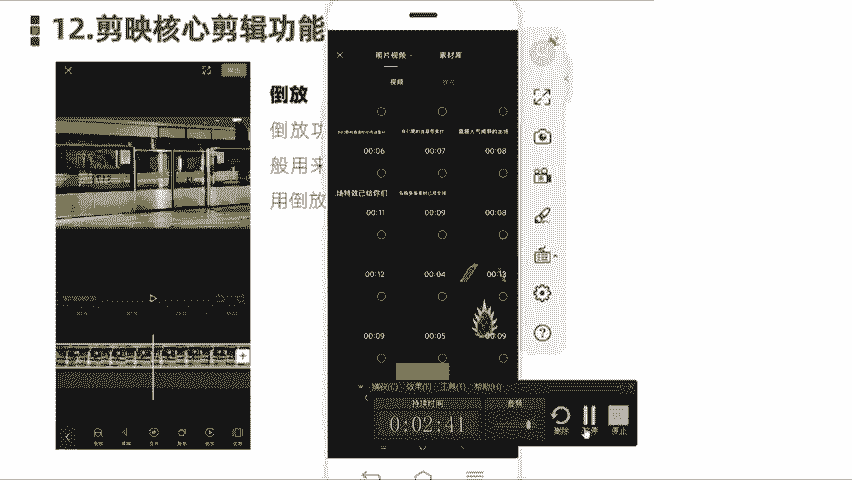
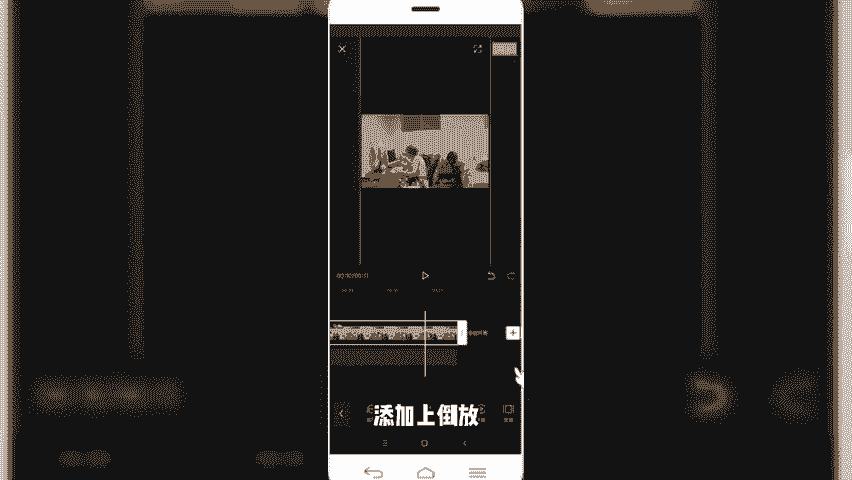
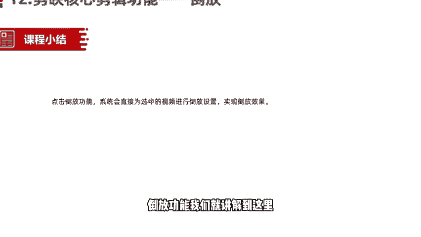

# 【剪映教程】： B站最良心的2024剪映手机版全套教程（适合零基础小白学习） - P9：7剪映核心剪辑功能——倒放功能 - 剪-映新手-教-程 - BV1P9xPeCEVh

hello，各位小伙伴，那我们今天呢接着给大家分享的是简映的核心简辑功能，倒放功能。那倒放功能呢，我们在视频当中啊使用的不多啊，在剪映时里面啊，一般是用来制作一些特效的一些视频的时候，或者搞笑的视频呢。

时候呢会用到一个倒放功能。倒放功能啊顾名思义。我们正常看到的视频，它是正速，或者说按照我们时间线的时间来正向的播放的。那倒放呢顾名思义就是把我们的时间线呢颠倒过来，从后往前放。

那么如果大家没理解这概念的话，我们看一个视频，大家就明白了。好，我们同样是打开一段素材。好，我们先来预览一下这段素材。是不是看的特别的有意思啊，本来应该是正常。在没有倒放之前呢，是这个女主角啊。

这个小姐姐在吃这个骨头，然后呢吃完之后扔给这个小狗，然后那个小狗吃。但是变成倒放之后就是成为什么小狗现在吃这个骨头，然后呢，倒放过来成为这个小姐姐是狗嘴里吐出来的骨头。啊，这是我们用到的倒放功能啊。

非常简单。那这个视频怎怎样制作的话，我们同样是啊再找一个案例，然后。给大家讲一下如何使用导航功能制作。好，我们点击开始创作。导入一段视频素材。

好，我们导入这段素材呢，首先呢先来预览一下它的一个情况是什么样的。啊，这是我们啊看到的正常情况下，到房之前啊，他在打电在玩电脑游戏，然后呢着急把电脑给砸了，把屋子也给都砸了。然后我们使用电。

剪映当中的倒方功能。首先是选中这段视频素材，然后在二级菜单底部向右滑动，在底部可以看到倒放功能，我们选中倒放。啊，然后视频完成倒放。那我们再来预览一下倒放之后的效果。啊，是不是挺有意思的，就这个人开始。

啊，回过头来，然后呢一步一步把这个屋子呢又收拾好了，然后呢重新走到电脑上开始玩游戏啊，这是我们用的倒房功能啊，非常简单，直接在底部二级菜单先选中视频，然后在二二级菜单选中倒房功能。

即可以给我们这个视频素材呢添加上倒放。

O我们一会儿来小结一下，点击倒放功能，那系统呢会直接为我们选中的这段视频素材呢添加倒放。啊，实现我们想要的导航效果。啊，在剪映当中啊运用的不是很多，但是呢也是需要大家了解和掌握的一个技能。

O本节课程呢关于简映核心剪辑功能倒换功能，我们就讲解到这里，我们下节课程再见。

