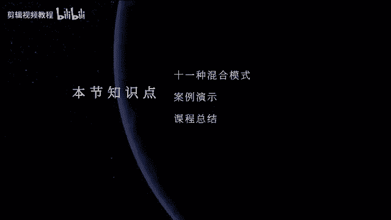
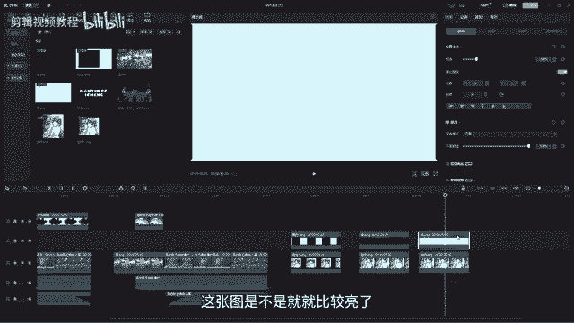

# 【剪映教程】： B站最良心的2024剪映电脑版全套教程（适合零基础小白学习） - P4：【电脑版】10种混合模式 - 视频号运营新手教学 - BV1xm21YhE1E

hello，大家好，那今天这节课要学习点内容的话，呢，我们先来看一下我们要做的这个案例。哪里？🎼的下的我的色。🎼此心在。🎼Has been before。🎼留的。🎼只 waiting for。🎼なり？

OK那这个的话呢，大家可以看到啊，就是我们的画面在出现的时候，它是这种水墨晕开的效果。那这个效果的话呢，如果我们要去使用它的话，我们要怎么去做啊，要怎么做出来。那要做出今天我们这个效果的话呢。

我们就需要去先学习我们今天的知识点，就是我们这边的混合模式啊。好，那我们先把我们这些素材，我们先给它先删除，或者是我们把它重新再复制一份过来，要把我们这个案例啊。cttrorl C。

然后呢哎到后面我们再复制一份ctrl V好，再张贴一份到后面来啊。那我们现在就在我们的这个基础上，然后呢来看我们可以看到像在我们的画面的话呢，它是一个硬件的这种效果。我可以看一下。

🎼变的 shadow到我的色。🎼是经。🎼Its been before。🎼Lo the depends waiting for。🎼なりき。对吧那这个就是我们啊直接剪出来的一个效果啊。

那我们要做出像前面这种有水墨晕开的这些效果，那要怎么去做呢？那这个的话我们就需要借助我们这里的这个混合模式来制作啊。那用这个混合模式的话呢，我们可以做出很多非常漂亮的一些效果。好。

首先我们先进入到我们的本地这边来把我们今天要用到的一些素材，然后呢先给它都导入进来啊。O然后先放进来。好，然后放进来以后，那我们现在就开始来这边给大家去讲解我们这个混合模式。那我们的混合模式的话呢。

它大概的话就由我们这里面啊1234567891011啊11种11种混合模式。那正常情况下，这里面它会显示的是正常，就是我们的素材，他们之间是没有做任何的混合效果的那我们除了正常之外呢。

就是我们啊10种特殊的这个。混合模式。那我们这每一个混合模式，我们如果要一个一个的去学一个一个的记的话呢，就非常的麻烦啊。那这边的话呢，我们来给大家打了三个组，就把我们这个混合模式。

然后呢做一个类型的区分，我们把它分为我们的去量组，还有我们的去暗组，还有我们的对比组啊，首先我们的去量组是什么意思呢？去亮组的话呢，其实它就是去掉我们素材当中偏亮的部分保留暗的部分。

我们可以看到像我们现在的这个画面亮的部分是哪些，是不是画面中呈现白色啊这个地方，对不对？那暗是不是我们这些是不是就是暗的？那如果我们要去哎给它添加混合模式的话，是不是就保留怎么样？

哎去掉我们这些比较亮的部分，然后保留暗的部分啊，那比如说我这边就有一张这个图啊，然后呢，我们给它拖进来啊，比如说像这个小姐姐对不对？小姐姐O然后呢，这里啊然后呢这里这张图片，我们要做。个叠加啊。

大家注意我们混合模式它的一个使用方法啊。第一个条件是必须要有两个图层，然后呢去进行一个叠加啊，就是啊放在一起，然后它才能有混合单个素材，你是没有办法去添加混合模式的啊。OK那么我们给上面的这一层。

然后呢去给它添加我们的混合模式。那它这里面的话，就是我们给它添加上我们的变暗模式。好，大家可以看到变暗模式，是不是我们这个图片啊，就是我们刚刚的这张图片，它是不是哎就在我们没有去给它添加的时候。

哎这个是暗的，这个是亮的，对不对？哎，我们去给它添加以后，那暗的地方亮的地方是不是就被去掉了，去亮组啊，就把亮的地方给去掉了，保留了暗的地方啊，那我们好给它改成。变暗对不对？变暗是不是就给它去掉了。

对不对？那如果我要呃我要让这个画面给它呈现出来的话，我们就要。呃，给它变成什么呀？变量组，那是不是就我们的画面是不是就出来了，对不对？好，所以我们的这个去量组的话呢，就是去除画面当中偏暗的部分。

那我们可以拿刚刚的这张图来给大家去演示啊。那比如说我们在这个图下面放我们的这朵花啊，然后我们放这朵花。OK那我们现在给这个图给它添加上我们的区按。变暗对不对？

那大家可以看到变暗的话是我们最亮地方那些是不是就给去掉了，是不是就只剩我们暗的这个内容，对不对？好，那么我们的这个去量组的话呢，它的类型啊，啊，这里面的类型的话呢，它有这几种。

然后大家可以做一下我们的笔记啊，我们的去亮组有变暗正片叠底颜色加深，线性加深啊，线性加深。然后呢，这四个是我们的去亮组哎，那你可以去哎正片叠底是不是就把啊亮的去掉了。好，然后还有线性加深，对不对？

O还有我们的颜色加深，对不对？是不是就就把我们的啊亮地方几乎都去掉了，就只保留我们比较暗的部分啊，O那这个是我们的去亮组，好，那我们再来看一个就是我们的去暗组，那去暗组的话呢，跟去亮组。

它们两个刚好反过来。去暗组的话呢，就是把去掉画面中暗的部分，保留亮的部分。那比如说刚刚我们的这张图，刚刚我们这张图，我们导入进来的时候，对不对？导入进来的时候，它这边是亮的。然后这中间这一块是暗的。

那我要让它跟下面的这个图片啊，让它们俩合在一起的话呢，是不是哎我要去掉画面当中啊暗的部分，然后呢保留亮的部分，对不对？OK那么我们就要选我们的去暗组，O去暗组的话呢，有我们的绿色变亮啊，颜色减淡啊。

绿色对不对？绿色是不是就把我们的黑色部分给它减掉了，那我们这个图片有点点歪啊，我们可以调一下它的位置。然后呢，这种去调一下它的位置，哎，让它尽可能的保留在我们的画面中间啊，然后更好看一些，对不对？好。

然后那你也可以去加一下其他的，比如说我们的变亮。找一下我们变亮变亮，对不对？是不是就没有变化。好，然后还有我们的一个叫颜色减淡，哎，颜色减淡。那这个的话是我们的去暗组。那去样组的话呢。

就是跟去量组它俩是反过来的啊。那第三组叫什么呢？第三组的话呢叫对比组。那对比组的话呢，它相比于我们前面两个呃类别来说会比较的难记忆一些啊。对比组的话呢，其实就是把上面两个图层叠加在一起去掉我们的中性灰。

然后呢让暗部更暗亮部更亮。比如说我在还是一样，我把这个图拖下来，好，大家可以看到我现在拖这样图，然后呢呃我现在给这个ok给这个添加上一个比较暗的这样的一个背景，对不对？那我现在就给它添加一个叠加。

OK那现样的话大家会发现我画面当中是不是就比较暗然，就哎加之前跟没加之前，大家可以看到是不是去掉我们的中性灰，然后呢让我们亮的地方呢呃继续亮，然后暗的地方更暗啊。

OK那那我再把这个图再涂到我们的时间线上啊，OK然后呢我再给它加一个。比如说这张图。😊，这张图是不是就就比较亮了？好，然后呢我再给这个图片，然后呢再给它添加一个叠加。

那像这个画面是不是就会出现这种比较爆的这种感觉，对不对？好，所以当我们的这个什么哎我们两个图片叠加在一起。那么我们混合层如果是比较偏暗的话，那么画面当中呈现的就是怎么样，哎就会更暗。

那如果我们的混合层比较亮的话，那画面就呈比较曝光的一个状态啊，所以这个是我们的对比组，那对比组的话有哪些呢？对比组的话，有我们的叠加，还有我们的强光啊，还有我们的柔光啊。

那就我们这三个啊三个学会运用了我们的这边它的这个混合模式以后，那么我们要去做我们之前的这个案例是不是就比较简单了？O那现在我们就给大家去演示一下我们的这个小案例啊。首先一开始的时候，我们这个水墨对不对？

这个水墨它要出来。那我们直接在素材库这里面啊，素材库，然后呢。

在这里面我们直接搜这个水墨，对吧？水墨镜头水墨啊，我们直接搜水墨就可以。呃，水墨好。对不对？然后这里面就有很多很多这种镜头，那有好几个啊，那你就随便选一个。比如说我们就选啊像这些啊，对吧？

像这个是不是就很好看？好，脱下来啊，脱下来放在我们画面的上面。那我们先来观察一下我们的这个画面，画面当中啊，然后呢它只有两个颜色，对不对？只有两个颜色，然后呢，只有暗部和我们的亮部。

那我们再给它选混合模式的时候，我们选哪一种啊。哎，这个时候我们就要选的是我们的去暗组，对不对？我们要让暗部的地方给它去掉啊，变调。那这个时候我们就选绿色。好，那我们现在添加了绿色以后，我们现来看一下啊。

对不对？是不是就已经有我们这种水墨晕开的效果。大家可以看到啊，哎我们用了我们的去暗组以后，是不是我们黑色部分是不是就被去掉了，就保留白色部分，就像我我们的画面就像水墨一样，这种晕开，对不对？

O然后呢我们再找一个啊，再找一个呃好看一点的，再把后面的也弄上OK然后再加上我们的这个。好。🎼对不对？然后这个那现在这个要加哪个，是不是也是一样的，也是一样，我们是不是要去给它添加上我们的绿色，对不对？

好，绿色啊好，然后呢。🎼是不是就有我们的这个水墨淡开的效果？那这个效果是不是就做完了？好，然后呢这里面的给大家就是这里面的话呢给大家嗯一个小小的总结啊，那就是呃就相当于是一个学习的小技巧吧。

就是当你的混合层有比较深的颜色，比如说有黑色，那其他的不管是白色还有其他颜色，对吧？白色其他颜色，只是只要是我们画面当中黑色这的比较多。那这个时候你想都不用想，直接用我们的去暗组哎就是用我们的绿色。😊。

或者是我们的变量对吧？绿色变量，还有我们的颜色减大，直接用这个组合去使用呢就可以了。那如果我们的混合层哎亮度比较多，然后呢，我们就用我们的去量组。那如果我们的混合层是纯色或者是不是很明确的颜色啊。

那这个时候呢我们就可以用对比组或者是我们就直接不要用，那我们的对比组的它的一个使用方法相对来说还是比较少的啊。那我们用的最多就是我们的去暗组，还有去量组。那这个的话呢大家就哎自己下去。

然后呢自己去体验一下呢，那就可以了。好，那今天的这节课我们就先到这里，我们下节课再见。

